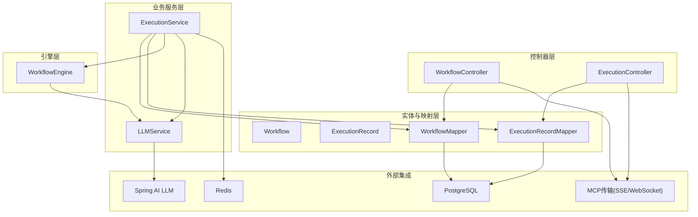
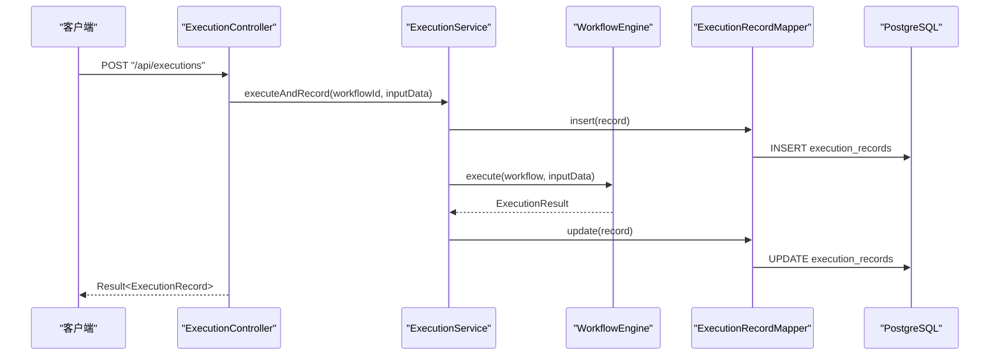
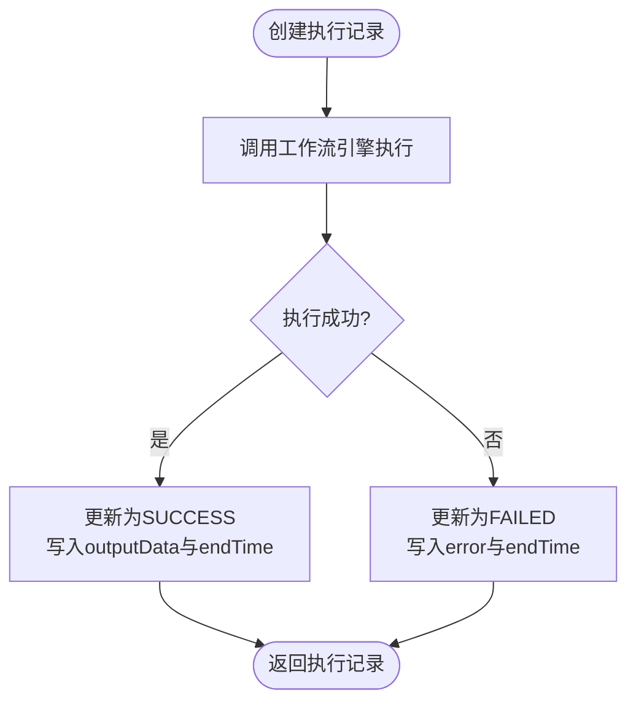
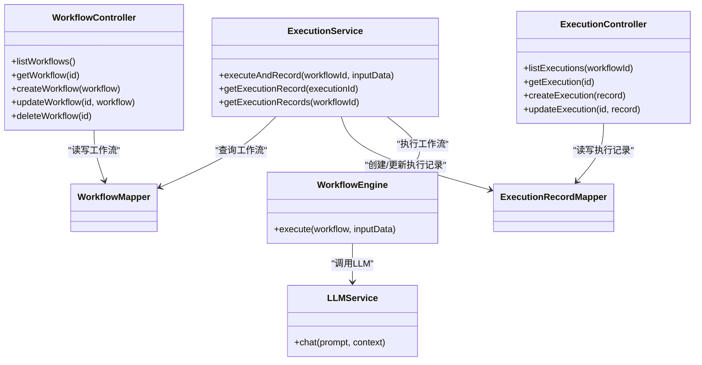
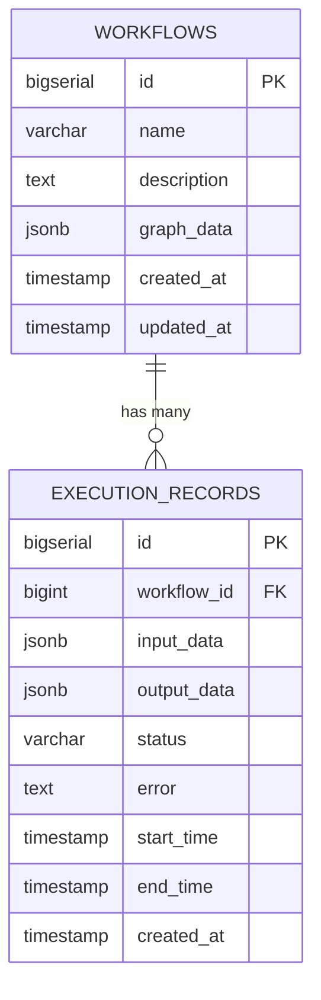

# API接口文档

<cite>
**本文档引用的文件**
- [BokAgentApplication.java](file://backend/src/main/java/com/bokagent/BokAgentApplication.java)
- [WorkflowController.java](file://backend/src/main/java/com/bokagent/controller/WorkflowController.java)
- [ExecutionController.java](file://backend/src/main/java/com/bokagent/controller/ExecutionController.java)
- [ExecutionService.java](file://backend/src/main/java/com/bokagent/service/ExecutionService.java)
- [LLMService.java](file://backend/src/main/java/com/bokagent/service/LLMService.java)
- [Result.java](file://backend/src/main/java/com/bokagent/common/Result.java)
- [GlobalExceptionHandler.java](file://backend/src/main/java/com/bokagent/common/GlobalExceptionHandler.java)
- [Workflow.java](file://backend/src/main/java/com/bokagent/entity/Workflow.java)
- [ExecutionRecord.java](file://backend/src/main/java/com/bokagent/entity/ExecutionRecord.java)
- [WorkflowMapper.java](file://backend/src/main/java/com/bokagent/mapper/WorkflowMapper.java)
- [ExecutionRecordMapper.java](file://backend/src/main/java/com/bokagent/mapper/ExecutionRecordMapper.java)
- [WorkflowEngine.java](file://backend/src/main/java/com/bokagent/engine/WorkflowEngine.java)
- [ExecutionResult.java](file://backend/src/main/java/com/bokagent/engine/ExecutionResult.java)
- [application.yml](file://backend/src/main/resources/application.yml)
- [V1__create_workflow_tables.sql](file://backend/src/main/resources/db/migration/V1__create_workflow_tables.sql)
</cite>

## 目录
1. [简介](#简介)
2. [项目结构](#项目结构)
3. [核心组件](#核心组件)
4. [架构总览](#架构总览)
5. [详细组件分析](#详细组件分析)
6. [依赖关系分析](#依赖关系分析)
7. [性能考虑](#性能考虑)
8. [故障排除指南](#故障排除指南)
9. [结论](#结论)
10. [附录](#附录)

## 简介
本文件为BokAgent系统提供的完整API接口文档，涵盖工作流管理、执行记录管理、工作流执行以及MCP协议相关接口。文档基于后端代码实现进行梳理，详细说明REST API端点、请求与响应格式、状态码与错误处理，并提供最佳实践与常见问题解决方案。

## 项目结构
后端采用Spring Boot + MyBatis-Plus架构，主要模块如下：
- 控制器层：负责HTTP请求处理与统一响应封装
- 业务服务层：封装工作流执行、LLM调用等业务逻辑
- 引擎层：工作流执行引擎，负责拓扑执行与节点调度
- 实体与映射层：工作流与执行记录的数据模型及MyBatis映射
- 配置：数据库、Redis、Spring AI、MCP协议等配置

图表来源
- [WorkflowController.java:16-91](file://backend/src/main/java/com/bokagent/controller/WorkflowController.java#L16-L91)
- [ExecutionController.java:16-80](file://backend/src/main/java/com/bokagent/controller/ExecutionController.java#L16-L80)
- [ExecutionService.java:19-109](file://backend/src/main/java/com/bokagent/service/ExecutionService.java#L19-L109)
- [WorkflowEngine.java:17-168](file://backend/src/main/java/com/bokagent/engine/WorkflowEngine.java#L17-L168)
- [Workflow.java:14-31](file://backend/src/main/java/com/bokagent/entity/Workflow.java#L14-L31)
- [ExecutionRecord.java:15-39](file://backend/src/main/java/com/bokagent/entity/ExecutionRecord.java#L15-L39)
- [WorkflowMapper.java:10-12](file://backend/src/main/java/com/bokagent/mapper/WorkflowMapper.java#L10-L12)
- [ExecutionRecordMapper.java:10-12](file://backend/src/main/java/com/bokagent/mapper/ExecutionRecordMapper.java#L10-L12)
- [application.yml:16-124](file://backend/src/main/resources/application.yml#L16-L124)

章节来源
- [BokAgentApplication.java:16-54](file://backend/src/main/java/com/bokagent/BokAgentApplication.java#L16-L54)
- [application.yml:16-124](file://backend/src/main/resources/application.yml#L16-L124)

## 核心组件
- 统一响应包装：所有API返回统一的Result结构，包含code、message、data字段
- 全局异常处理：对不同异常类型返回相应HTTP状态码与错误信息
- 工作流实体：包含名称、描述、图数据（JSONB）、创建/更新时间
- 执行记录实体：包含输入输出数据（Map）、状态、错误信息、时间戳等
- MCP协议：启用SSE与WebSocket传输路径，支持工具、资源、提示词能力

章节来源
- [Result.java:8-41](file://backend/src/main/java/com/bokagent/common/Result.java#L8-L41)
- [GlobalExceptionHandler.java:12-36](file://backend/src/main/java/com/bokagent/common/GlobalExceptionHandler.java#L12-L36)
- [Workflow.java:14-31](file://backend/src/main/java/com/bokagent/entity/Workflow.java#L14-L31)
- [ExecutionRecord.java:15-39](file://backend/src/main/java/com/bokagent/entity/ExecutionRecord.java#L15-L39)
- [application.yml:108-124](file://backend/src/main/resources/application.yml#L108-L124)

## 架构总览
以下序列图展示了工作流执行的端到端流程，从API调用到引擎执行再到记录更新：

图表来源
- [ExecutionController.java:52-59](file://backend/src/main/java/com/bokagent/controller/ExecutionController.java#L52-L59)
- [ExecutionService.java:38-89](file://backend/src/main/java/com/bokagent/service/ExecutionService.java#L38-L89)
- [WorkflowEngine.java:45-80](file://backend/src/main/java/com/bokagent/engine/WorkflowEngine.java#L45-L80)
- [ExecutionRecordMapper.java:10-12](file://backend/src/main/java/com/bokagent/mapper/ExecutionRecordMapper.java#L10-L12)

## 详细组件分析

### 工作流管理API
- 基础路径：/api/workflows
- 跨域：允许任意源访问

端点一览
- GET /api/workflows
  - 功能：获取工作流列表
  - 请求参数：无
  - 响应：Result<List<Workflow>>
  - 状态码：200 成功；500 系统错误
  - 示例响应：
    {
      "code": 200,
      "message": "success",
      "data": [
        {
          "id": 1,
          "name": "示例工作流",
          "description": "这是一个示例",
          "graphData": {
            "nodes": [],
            "edges": []
          },
          "createdAt": "2024-01-01T00:00:00",
          "updatedAt": "2024-01-01T00:00:00"
        }
      ]
    }

- GET /api/workflows/{id}
  - 功能：根据ID获取工作流
  - 路径参数：id（Long）
  - 响应：Result<Workflow>；当不存在时返回404
  - 状态码：200 成功；404 未找到；500 系统错误

- POST /api/workflows
  - 功能：创建工作流
  - 请求体：Workflow对象（name、description、graphData等）
  - 响应：Result<Workflow>
  - 状态码：200 成功；500 系统错误
  - 示例请求体：
    {
      "name": "新建工作流",
      "description": "用于测试",
      "graphData": {
        "nodes": [],
        "edges": []
      }
    }

- PUT /api/workflows/{id}
  - 功能：更新工作流
  - 路径参数：id（Long）
  - 请求体：Workflow对象（包含id）
  - 响应：Result<Workflow>；当不存在时返回404
  - 状态码：200 成功；404 未找到；500 系统错误

- DELETE /api/workflows/{id}
  - 功能：删除工作流
  - 路径参数：id（Long）
  - 响应：Result<Void>；当不存在时返回404
  - 状态码：200 成功；404 未找到；500 系统错误

章节来源
- [WorkflowController.java:28-90](file://backend/src/main/java/com/bokagent/controller/WorkflowController.java#L28-L90)
- [Workflow.java:14-31](file://backend/src/main/java/com/bokagent/entity/Workflow.java#L14-L31)
- [WorkflowMapper.java:10-12](file://backend/src/main/java/com/bokagent/mapper/WorkflowMapper.java#L10-L12)

### 执行记录API
- 基础路径：/api/executions
- 跨域：允许任意源访问

端点一览
- GET /api/executions/workflow/{workflowId}
  - 功能：获取指定工作流的所有执行记录
  - 路径参数：workflowId（Long）
  - 响应：Result<List<ExecutionRecord>>
  - 状态码：200 成功；500 系统错误
  - 注意：当前实现未按workflowId过滤，需在业务层完善

- GET /api/executions/{id}
  - 功能：根据ID获取执行记录
  - 路径参数：id（Long）
  - 响应：Result<ExecutionRecord>；当不存在时返回404
  - 状态码：200 成功；404 未找到；500 系统错误

- POST /api/executions
  - 功能：创建执行记录并开始执行
  - 请求体：ExecutionRecord（workflowId、inputData等）
  - 响应：Result<ExecutionRecord>
  - 状态码：200 成功；500 系统错误
  - 行为：自动设置status为RUNNING，startTime与createdAt为当前时间

- PUT /api/executions/{id}
  - 功能：更新执行记录
  - 路径参数：id（Long）
  - 请求体：ExecutionRecord（包含id）
  - 响应：Result<ExecutionRecord>；当状态为SUCCESS或FAILED时自动设置endTime
  - 状态码：200 成功；404 未找到；500 系统错误

章节来源
- [ExecutionController.java:28-80](file://backend/src/main/java/com/bokagent/controller/ExecutionController.java#L28-L80)
- [ExecutionRecord.java:15-39](file://backend/src/main/java/com/bokagent/entity/ExecutionRecord.java#L15-L39)
- [ExecutionRecordMapper.java:10-12](file://backend/src/main/java/com/bokagent/mapper/ExecutionRecordMapper.java#L10-L12)
- [ExecutionService.java:38-89](file://backend/src/main/java/com/bokagent/service/ExecutionService.java#L38-L89)

### 工作流执行API
- 基础路径：/api/executions
- 该API通过POST创建执行记录，随后由后端服务触发工作流执行并更新状态

执行流程要点
- 创建执行记录：status=RUNNING，startTime/createdAt=now
- 调用工作流引擎：根据workflowId加载图数据并执行
- 更新执行记录：成功则status=SUCCESS并写入outputData，失败则status=FAILED并写入error，同时设置endTime

图表来源
- [ExecutionController.java:52-59](file://backend/src/main/java/com/bokagent/controller/ExecutionController.java#L52-L59)
- [ExecutionService.java:38-89](file://backend/src/main/java/com/bokagent/service/ExecutionService.java#L38-L89)
- [WorkflowEngine.java:45-80](file://backend/src/main/java/com/bokagent/engine/WorkflowEngine.java#L45-L80)

章节来源
- [ExecutionController.java:52-59](file://backend/src/main/java/com/bokagent/controller/ExecutionController.java#L52-L59)
- [ExecutionService.java:38-89](file://backend/src/main/java/com/bokagent/service/ExecutionService.java#L38-L89)

### MCP协议相关API
- SSE端点：/mcp/sse
- WebSocket端点：/mcp/ws
- 能力声明：tools、resources、prompts
- 传输启用：SSE与WebSocket均开启

使用说明
- 客户端通过SSE订阅/mcp/sse以接收服务器推送事件
- 客户端通过WebSocket连接/mcp/ws进行双向通信
- MCP服务器名称与版本可在配置中查看

章节来源
- [application.yml:108-124](file://backend/src/main/resources/application.yml#L108-L124)

## 依赖关系分析
- 控制器依赖Mapper进行数据持久化
- 业务服务依赖Mapper与引擎执行工作流
- 引擎依赖LLM服务进行语言模型调用
- 配置文件定义数据库、Redis、Spring AI与MCP传输路径

图表来源
- [WorkflowController.java:16-91](file://backend/src/main/java/com/bokagent/controller/WorkflowController.java#L16-L91)
- [ExecutionController.java:16-80](file://backend/src/main/java/com/bokagent/controller/ExecutionController.java#L16-L80)
- [ExecutionService.java:19-109](file://backend/src/main/java/com/bokagent/service/ExecutionService.java#L19-L109)
- [WorkflowEngine.java:17-168](file://backend/src/main/java/com/bokagent/engine/WorkflowEngine.java#L17-L168)
- [LLMService.java:14-66](file://backend/src/main/java/com/bokagent/service/LLMService.java#L14-L66)
- [WorkflowMapper.java:10-12](file://backend/src/main/java/com/bokagent/mapper/WorkflowMapper.java#L10-L12)
- [ExecutionRecordMapper.java:10-12](file://backend/src/main/java/com/bokagent/mapper/ExecutionRecordMapper.java#L10-L12)

## 性能考虑
- 数据库连接池：Hikari最大20，最小空闲5
- Redis连接池：最大活跃8，最大空闲8
- 异步任务：虚拟线程，核心池10，最大100，队列容量1000
- 缓存策略：默认TTL 1小时，LLM响应2小时，工具结果30分钟
- 超时配置：工具执行30秒，LLM调用60秒，工作流执行5分钟

章节来源
- [application.yml:22-24](file://backend/src/main/resources/application.yml#L22-L24)
- [application.yml:38-43](file://backend/src/main/resources/application.yml#L38-L43)
- [application.yml:82-88](file://backend/src/main/resources/application.yml#L82-L88)
- [application.yml:149-154](file://backend/src/main/resources/application.yml#L149-L154)
- [application.yml:141-147](file://backend/src/main/resources/application.yml#L141-L147)

## 故障排除指南
- 400 错误（参数错误）：通常由非法参数触发，检查请求体与路径参数
- 404 错误（未找到）：工作流或执行记录不存在，请确认ID正确
- 500 错误（系统错误）：内部异常，查看日志定位具体异常
- 运行时异常：如工作流执行失败，会记录错误信息并返回FAILED状态

章节来源
- [GlobalExceptionHandler.java:16-35](file://backend/src/main/java/com/bokagent/common/GlobalExceptionHandler.java#L16-L35)

## 结论
本API文档覆盖了BokAgent系统的核心功能：工作流管理、执行记录管理与工作流执行，并提供了MCP协议的SSE与WebSocket接入方式。通过统一响应与异常处理机制，系统具备良好的可维护性与扩展性。建议在生产环境中结合缓存与异步任务进一步优化性能，并完善执行记录按工作流ID的查询过滤。

## 附录

### 统一响应结构
- 成功响应：code=200，message="success"，data为具体对象
- 失败响应：code为错误码（如400、404、500），message为错误描述，data=null

章节来源
- [Result.java:8-41](file://backend/src/main/java/com/bokagent/common/Result.java#L8-L41)

### 数据模型概览

图表来源
- [V1__create_workflow_tables.sql:2-9](file://backend/src/main/resources/db/migration/V1__create_workflow_tables.sql#L2-L9)
- [Workflow.java:14-31](file://backend/src/main/java/com/bokagent/entity/Workflow.java#L14-L31)
- [ExecutionRecord.java:15-39](file://backend/src/main/java/com/bokagent/entity/ExecutionRecord.java#L15-L39)