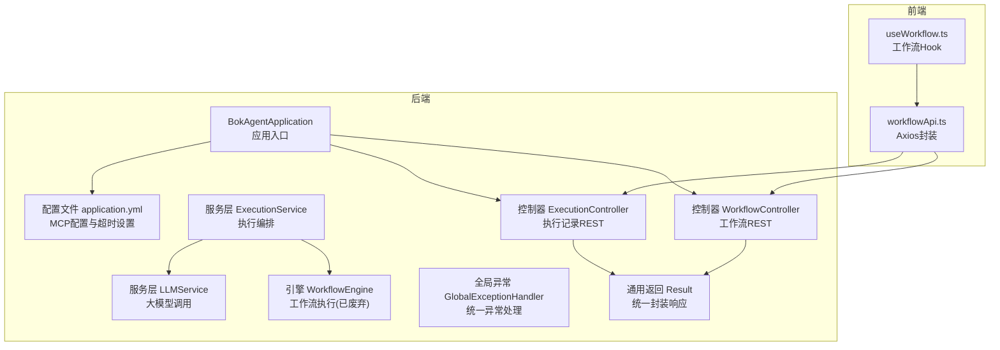
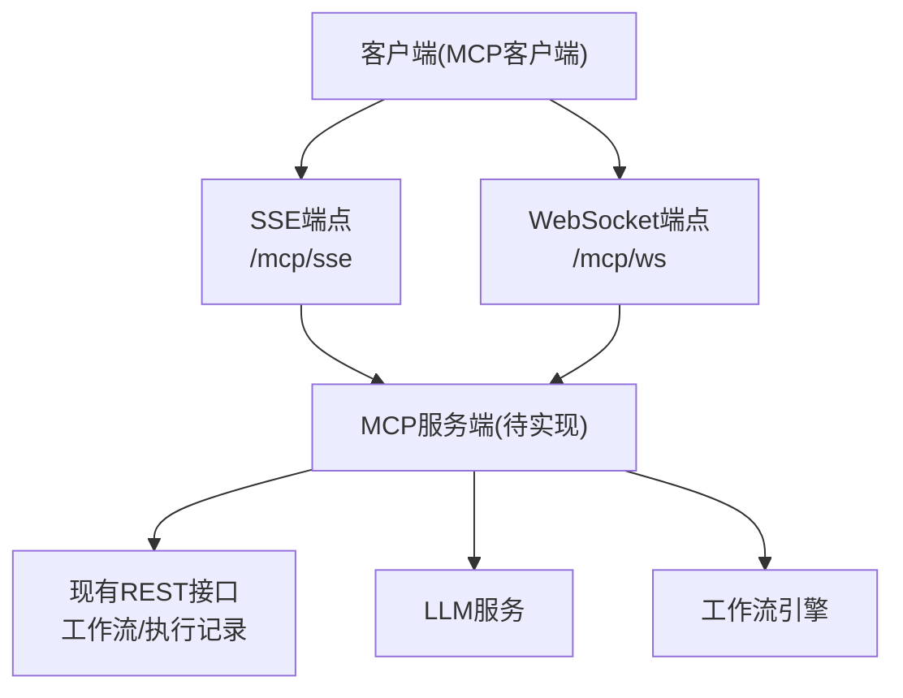
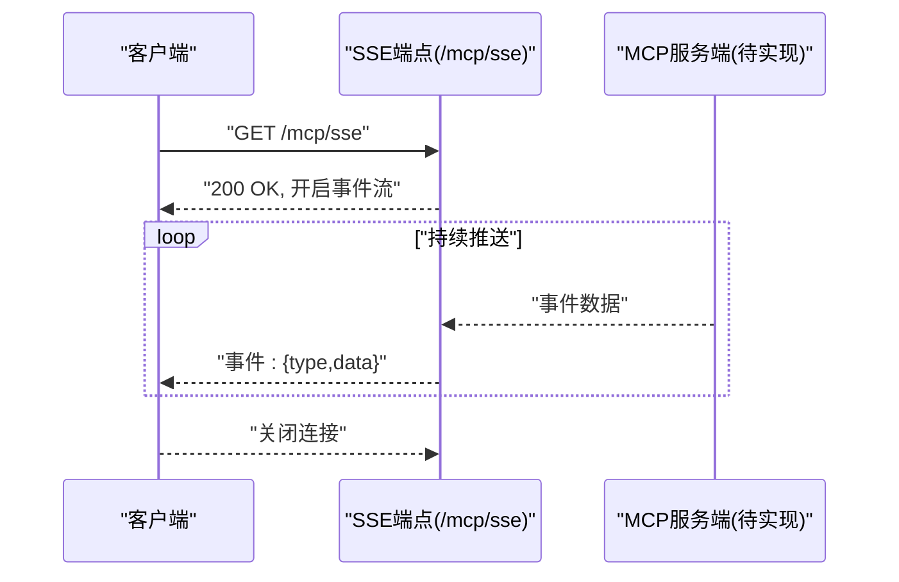
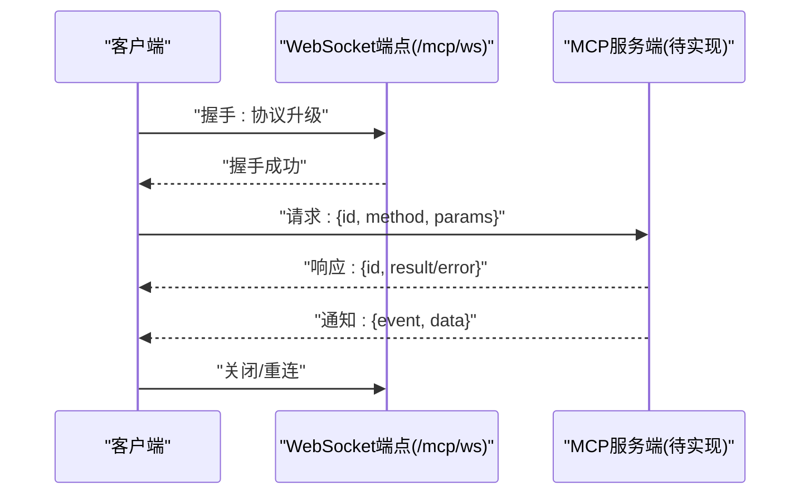
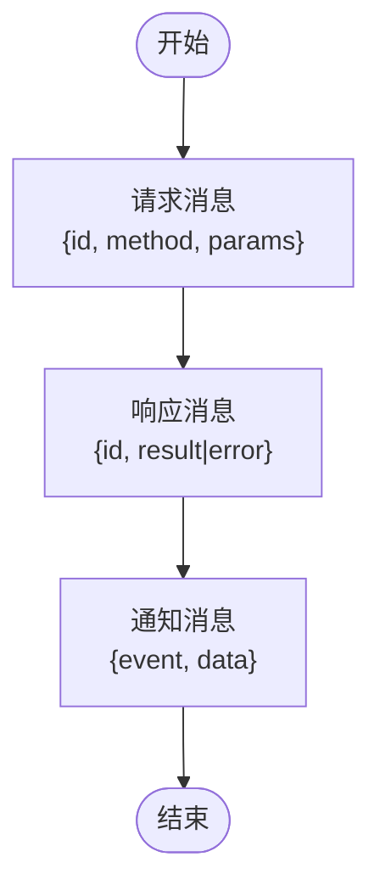
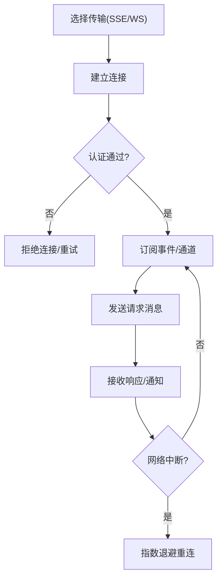
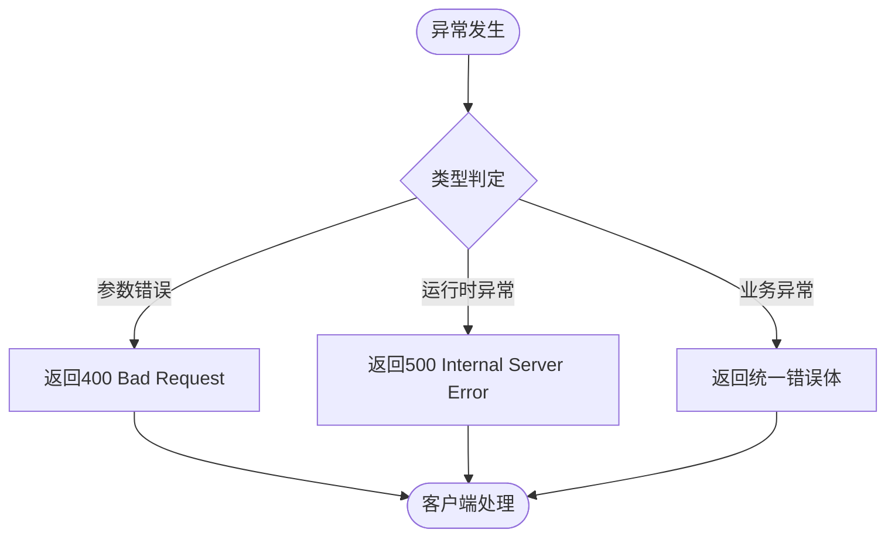
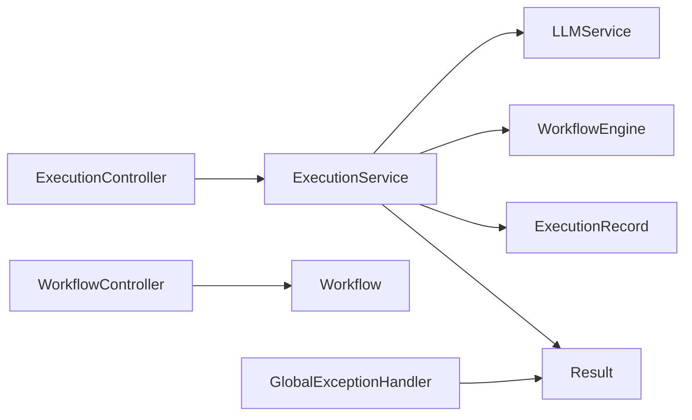

# MCP协议API

<cite>
**本文引用的文件**
- [BokAgentApplication.java](file://backend/src/main/java/com/bokagent/BokAgentApplication.java)
- [application.yml](file://backend/src/main/resources/application.yml)
- [GlobalExceptionHandler.java](file://backend/src/main/java/com/bokagent/common/GlobalExceptionHandler.java)
- [Result.java](file://backend/src/main/java/com/bokagent/common/Result.java)
- [ExecutionController.java](file://backend/src/main/java/com/bokagent/controller/ExecutionController.java)
- [WorkflowController.java](file://backend/src/main/java/com/bokagent/controller/WorkflowController.java)
- [ExecutionRecord.java](file://backend/src/main/java/com/bokagent/entity/ExecutionRecord.java)
- [Workflow.java](file://backend/src/main/java/com/bokagent/entity/Workflow.java)
- [ExecutionService.java](file://backend/src/main/java/com/bokagent/service/ExecutionService.java)
- [LLMService.java](file://backend/src/main/java/com/bokagent/service/LLMService.java)
- [WorkflowEngine.java](file://backend/src/main/java/com/bokagent/engine/WorkflowEngine.java)
- [workflowApi.ts](file://frontend/src/services/workflowApi.ts)
- [useWorkflow.ts](file://frontend/src/hooks/useWorkflow.ts)
</cite>

## 目录
1. [简介](#简介)
2. [项目结构](#项目结构)
3. [核心组件](#核心组件)
4. [架构总览](#架构总览)
5. [详细组件分析](#详细组件分析)
6. [依赖分析](#依赖分析)
7. [性能考虑](#性能考虑)
8. [故障排查指南](#故障排查指南)
9. [结论](#结论)
10. [附录](#附录)

## 简介
本文件面向MCP（Model Context Protocol）协议在本项目的集成与使用，聚焦以下目标：
- SSE（Server-Sent Events）端点的启用与使用方法：连接建立、事件订阅、实时数据推送。
- WebSocket端点的实现要点：双向通信协议、消息格式约定、连接管理与断线重连策略。
- MCP协议的消息类型：请求、响应、通知的格式与用途。
- 完整连接示例：客户端如何建立与MCP服务器的连接、发送与接收消息。
- 安全机制：认证方式、消息加密、访问控制。
- 错误处理与异常：连接失败、消息丢失、协议不匹配等场景的应对策略。
- 客户端集成示例与调试技巧。

注意：本仓库已配置MCP协议开关与传输通道路径，但未发现具体MCP服务端实现类与消息编解码逻辑。本文在“实现现状”基础上，提供可落地的接入与扩展指导。

## 项目结构
后端采用Spring Boot工程，MVC分层清晰；前端基于React + TypeScript，通过Axios封装REST API。MCP协议相关配置位于应用配置文件中，声明了SSE与WebSocket传输路径。

图表来源
- [BokAgentApplication.java:1-56](file://backend/src/main/java/com/bokagent/BokAgentApplication.java#L1-L56)
- [application.yml:116-137](file://backend/src/main/resources/application.yml#L116-L137)
- [ExecutionController.java:1-81](file://backend/src/main/java/com/bokagent/controller/ExecutionController.java#L1-L81)
- [WorkflowController.java:1-92](file://backend/src/main/java/com/bokagent/controller/WorkflowController.java#L1-L92)
- [ExecutionService.java:1-113](file://backend/src/main/java/com/bokagent/service/ExecutionService.java#L1-L113)
- [LLMService.java:1-67](file://backend/src/main/java/com/bokagent/service/LLMService.java#L1-L67)
- [WorkflowEngine.java:1-171](file://backend/src/main/java/com/bokagent/engine/WorkflowEngine.java#L1-L171)
- [GlobalExceptionHandler.java:1-37](file://backend/src/main/java/com/bokagent/common/GlobalExceptionHandler.java#L1-L37)
- [Result.java:1-42](file://backend/src/main/java/com/bokagent/common/Result.java#L1-L42)
- [workflowApi.ts:1-44](file://frontend/src/services/workflowApi.ts#L1-L44)
- [useWorkflow.ts:1-69](file://frontend/src/hooks/useWorkflow.ts#L1-L69)

章节来源
- [BokAgentApplication.java:1-56](file://backend/src/main/java/com/bokagent/BokAgentApplication.java#L1-L56)
- [application.yml:116-137](file://backend/src/main/resources/application.yml#L116-L137)
- [workflowApi.ts:1-44](file://frontend/src/services/workflowApi.ts#L1-L44)
- [useWorkflow.ts:1-69](file://frontend/src/hooks/useWorkflow.ts#L1-L69)

## 核心组件
- 应用入口与编码设置：确保UTF-8编码，避免中文与特殊字符问题。
- MCP协议配置：开启MCP服务端能力与传输通道（SSE/WS），并定义服务名与版本。
- 控制器层：提供工作流与执行记录的REST接口，便于前端集成与调试。
- 服务层：封装执行编排与LLM调用，支撑工作流引擎。
- 异常处理：统一捕获异常并返回标准响应体。
- 前端API：Axios封装基础URL与常用操作，便于后续扩展MCP端点。

章节来源
- [BokAgentApplication.java:21-43](file://backend/src/main/java/com/bokagent/BokAgentApplication.java#L21-L43)
- [application.yml:116-137](file://backend/src/main/resources/application.yml#L116-L137)
- [ExecutionController.java:25-80](file://backend/src/main/java/com/bokagent/controller/ExecutionController.java#L25-L80)
- [WorkflowController.java:25-90](file://backend/src/main/java/com/bokagent/controller/WorkflowController.java#L25-L90)
- [ExecutionService.java:39-92](file://backend/src/main/java/com/bokagent/service/ExecutionService.java#L39-L92)
- [LLMService.java:27-44](file://backend/src/main/java/com/bokagent/service/LLMService.java#L27-L44)
- [GlobalExceptionHandler.java:16-35](file://backend/src/main/java/com/bokagent/common/GlobalExceptionHandler.java#L16-L35)
- [Result.java:14-40](file://backend/src/main/java/com/bokagent/common/Result.java#L14-L40)
- [workflowApi.ts:3-8](file://frontend/src/services/workflowApi.ts#L3-L8)

## 架构总览
MCP协议在本项目中的定位：作为后端能力暴露与外部客户端交互的桥梁。当前已具备：
- 传输通道：SSE与WebSocket路径已在配置中声明。
- 能力开关：tools、resources、prompts三类能力已启用。
- 超时与重试：针对MCP请求与各类调用设置了超时与重试策略。

图表来源
- [application.yml:126-132](file://backend/src/main/resources/application.yml#L126-L132)
- [ExecutionController.java:25-80](file://backend/src/main/java/com/bokagent/controller/ExecutionController.java#L25-L80)
- [WorkflowController.java:25-90](file://backend/src/main/java/com/bokagent/controller/WorkflowController.java#L25-L90)
- [LLMService.java:27-44](file://backend/src/main/java/com/bokagent/service/LLMService.java#L27-L44)
- [ExecutionService.java:39-92](file://backend/src/main/java/com/bokagent/service/ExecutionService.java#L39-L92)

## 详细组件分析

### SSE端点（Server-Sent Events）
- 启用与路径：配置文件中声明了SSE传输启用与路径。
- 使用场景：适用于服务器向客户端单向推送事件（如执行进度、日志流）。
- 连接建立：客户端通过HTTP GET访问SSE路径，保持长连接。
- 事件订阅：客户端监听事件流，解析事件类型与数据负载。
- 实时数据推送：后端在需要时向事件流写入数据，客户端即时接收。

图表来源
- [application.yml:127-129](file://backend/src/main/resources/application.yml#L127-L129)

章节来源
- [application.yml:126-129](file://backend/src/main/resources/application.yml#L126-L129)

### WebSocket端点（双向通信）
- 启用与路径：配置文件中声明了WebSocket传输启用与路径。
- 协议设计：建议采用JSON消息格式，区分请求、响应、通知三类消息。
- 连接管理：心跳检测、超时重连、断线恢复。
- 消息格式：请求包含唯一ID与方法名；响应携带对应ID与结果；通知为单向推送。

图表来源
- [application.yml:130-132](file://backend/src/main/resources/application.yml#L130-L132)

章节来源
- [application.yml:130-132](file://backend/src/main/resources/application.yml#L130-L132)

### MCP消息类型与用途
- 请求消息：包含方法名与参数，用于触发服务端能力（如工具调用、资源读取、提示词生成）。
- 响应消息：携带请求ID与结果或错误信息，用于确认与回传数据。
- 通知消息：无需请求ID，由服务端主动推送状态变更或增量数据。

图表来源
- [application.yml:118-125](file://backend/src/main/resources/application.yml#L118-L125)

章节来源
- [application.yml:118-125](file://backend/src/main/resources/application.yml#L118-L125)

### 连接示例（概念性流程）
- 建立连接：SSE使用HTTP长连接；WebSocket使用协议升级。
- 握手与认证：在握手阶段传递认证凭据（如令牌）。
- 订阅事件：SSE监听事件流；WebSocket订阅特定主题或通道。
- 发送请求：客户端发送请求消息，等待响应或通知。
- 断线重连：指数退避重试，恢复订阅与状态。

图表来源
- [application.yml:126-132](file://backend/src/main/resources/application.yml#L126-L132)

章节来源
- [application.yml:126-132](file://backend/src/main/resources/application.yml#L126-L132)

### 安全机制
- 认证方式：建议在握手阶段引入令牌校验（如Bearer Token），并在消息层面附加会话标识。
- 消息加密：对敏感数据采用传输层加密（TLS），必要时对消息体进行签名或加解密。
- 访问控制：基于角色与权限限制MCP能力的使用范围，防止越权调用。

章节来源
- [application.yml:118-125](file://backend/src/main/resources/application.yml#L118-L125)

### 错误处理与异常
- 统一响应：后端通过统一结果封装与全局异常处理器，保证错误信息一致。
- 连接失败：SSE/WS连接失败时，客户端应记录原因并进行重试。
- 消息丢失：请求需带唯一ID，响应通过ID关联；通知无ID，客户端按序处理。
- 协议不匹配：当方法名或参数格式不符时，服务端返回明确错误码与描述。

图表来源
- [GlobalExceptionHandler.java:16-35](file://backend/src/main/java/com/bokagent/common/GlobalExceptionHandler.java#L16-L35)
- [Result.java:14-40](file://backend/src/main/java/com/bokagent/common/Result.java#L14-L40)

章节来源
- [GlobalExceptionHandler.java:16-35](file://backend/src/main/java/com/bokagent/common/GlobalExceptionHandler.java#L16-L35)
- [Result.java:14-40](file://backend/src/main/java/com/bokagent/common/Result.java#L14-L40)

### 客户端集成示例与调试技巧
- 前端REST集成：前端已通过Axios封装基础URL与常用操作，可在此基础上扩展MCP端点调用。
- 调试建议：开启后端日志级别，观察MCP相关请求与响应；使用浏览器开发者工具监控SSE/WS帧；对关键路径添加埋点与指标采集。

章节来源
- [workflowApi.ts:3-8](file://frontend/src/services/workflowApi.ts#L3-L8)
- [useWorkflow.ts:8-39](file://frontend/src/hooks/useWorkflow.ts#L8-L39)

## 依赖分析
- 控制器依赖服务层与通用返回体，保证接口稳定与一致。
- 服务层依赖引擎与LLM服务，形成从编排到执行的链路。
- 配置文件集中管理MCP能力与传输路径，便于统一开关与运维。

图表来源
- [ExecutionController.java:22-23](file://backend/src/main/java/com/bokagent/controller/ExecutionController.java#L22-L23)
- [WorkflowController.java:22-23](file://backend/src/main/java/com/bokagent/controller/WorkflowController.java#L22-L23)
- [ExecutionService.java:24-31](file://backend/src/main/java/com/bokagent/service/ExecutionService.java#L24-L31)
- [LLMService.java:18-19](file://backend/src/main/java/com/bokagent/service/LLMService.java#L18-L19)
- [WorkflowEngine.java:23-30](file://backend/src/main/java/com/bokagent/engine/WorkflowEngine.java#L23-L30)
- [ExecutionRecord.java:19-39](file://backend/src/main/java/com/bokagent/entity/ExecutionRecord.java#L19-L39)
- [Workflow.java:18-31](file://backend/src/main/java/com/bokagent/entity/Workflow.java#L18-L31)
- [Result.java:9-12](file://backend/src/main/java/com/bokagent/common/Result.java#L9-L12)
- [GlobalExceptionHandler.java:16-21](file://backend/src/main/java/com/bokagent/common/GlobalExceptionHandler.java#L16-L21)

章节来源
- [ExecutionController.java:22-23](file://backend/src/main/java/com/bokagent/controller/ExecutionController.java#L22-L23)
- [WorkflowController.java:22-23](file://backend/src/main/java/com/bokagent/controller/WorkflowController.java#L22-L23)
- [ExecutionService.java:24-31](file://backend/src/main/java/com/bokagent/service/ExecutionService.java#L24-L31)
- [LLMService.java:18-19](file://backend/src/main/java/com/bokagent/service/LLMService.java#L18-L19)
- [WorkflowEngine.java:23-30](file://backend/src/main/java/com/bokagent/engine/WorkflowEngine.java#L23-L30)
- [ExecutionRecord.java:19-39](file://backend/src/main/java/com/bokagent/entity/ExecutionRecord.java#L19-L39)
- [Workflow.java:18-31](file://backend/src/main/java/com/bokagent/entity/Workflow.java#L18-L31)
- [Result.java:9-12](file://backend/src/main/java/com/bokagent/common/Result.java#L9-L12)
- [GlobalExceptionHandler.java:16-21](file://backend/src/main/java/com/bokagent/common/GlobalExceptionHandler.java#L16-L21)

## 性能考虑
- 超时与重试：针对MCP请求与LLM调用设置了超时与重试策略，有助于提升稳定性。
- 并发与异步：工作流执行建议采用异步化与进度推送，减少阻塞。
- 缓存：对工具结果与LLM响应进行缓存，降低重复计算成本。

章节来源
- [application.yml:139-155](file://backend/src/main/resources/application.yml#L139-L155)
- [STAGE3_COMPLETION_REPORT.md:275-281](file://STAGE3_COMPLETION_REPORT.md#L275-L281)

## 故障排查指南
- 参数错误：检查请求参数与方法签名，确保与协议定义一致。
- 运行时异常：查看后端日志，定位异常堆栈并修复。
- 连接失败：确认SSE/WS路径与服务端配置一致，检查网络与代理。
- 协议不匹配：核对消息格式与版本号，确保客户端与服务端兼容。

章节来源
- [GlobalExceptionHandler.java:23-35](file://backend/src/main/java/com/bokagent/common/GlobalExceptionHandler.java#L23-L35)
- [application.yml:116-137](file://backend/src/main/resources/application.yml#L116-L137)

## 结论
本项目已为MCP协议预留了传输通道与能力开关，结合现有的REST接口与服务层，可快速扩展MCP服务端实现。建议优先完成消息编解码、认证与访问控制、以及SSE/WS的具体实现，再逐步完善错误处理与性能优化，最终形成完整的MCP集成方案。

## 附录
- 配置项参考：MCP服务端开关、能力列表、传输路径、超时与重试策略。
- 前端集成：基于现有Axios封装，扩展MCP端点调用与事件监听。

章节来源
- [application.yml:116-155](file://backend/src/main/resources/application.yml#L116-L155)
- [workflowApi.ts:11-41](file://frontend/src/services/workflowApi.ts#L11-L41)
- [useWorkflow.ts:8-39](file://frontend/src/hooks/useWorkflow.ts#L8-L39)