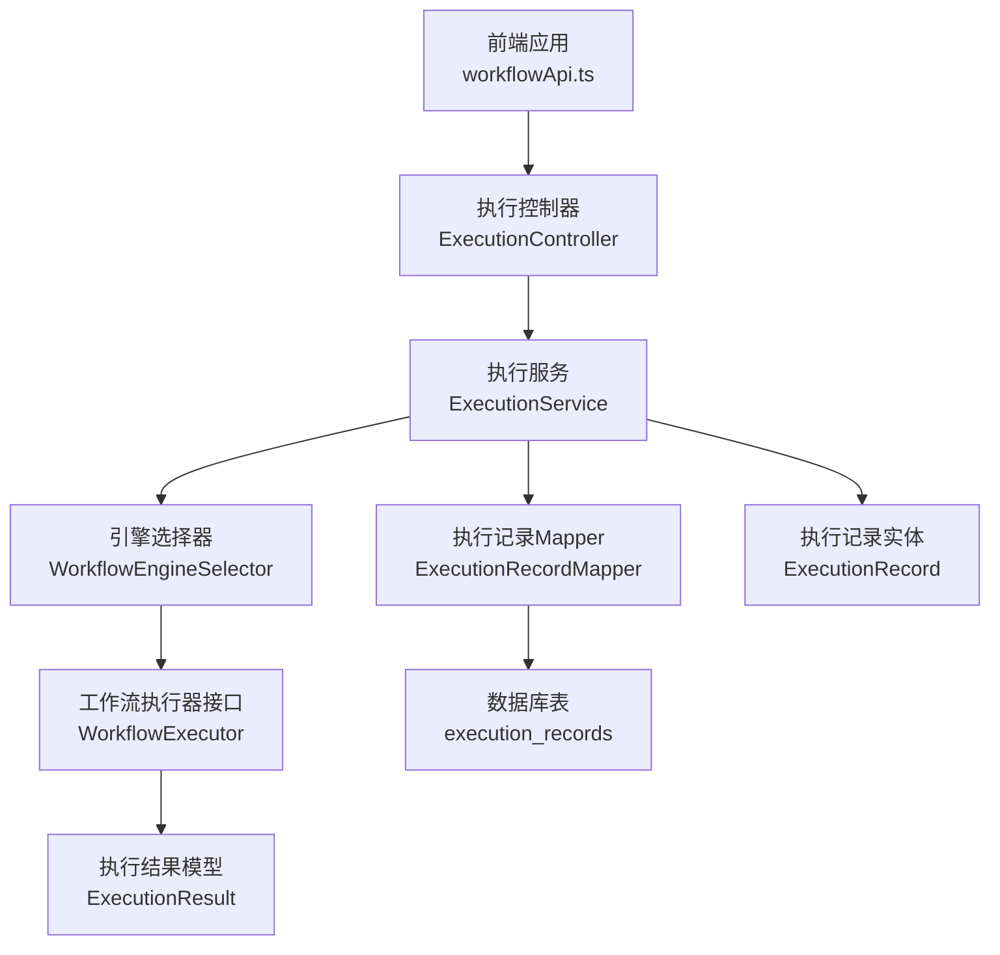
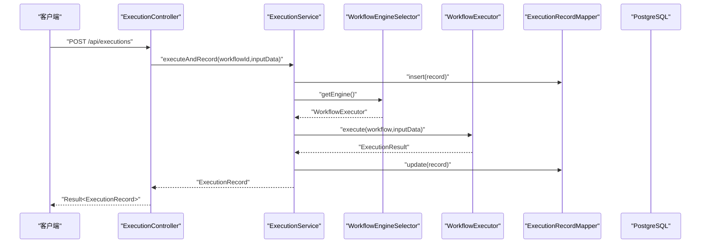
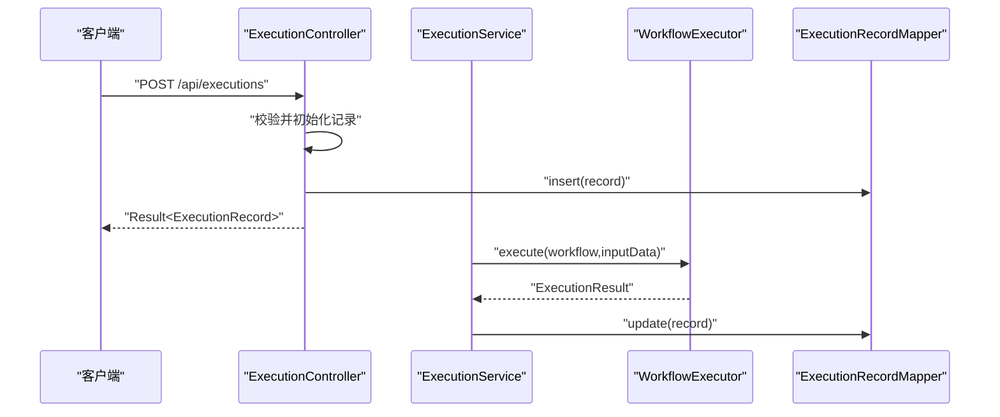
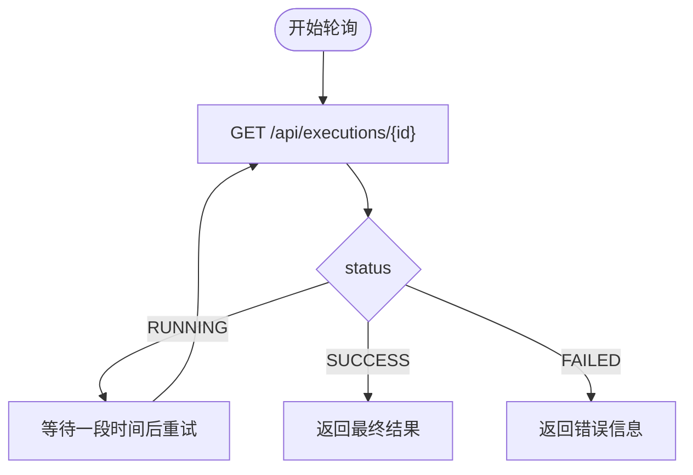
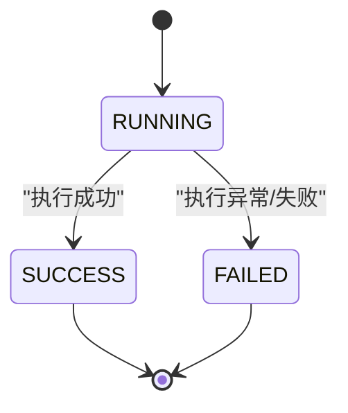
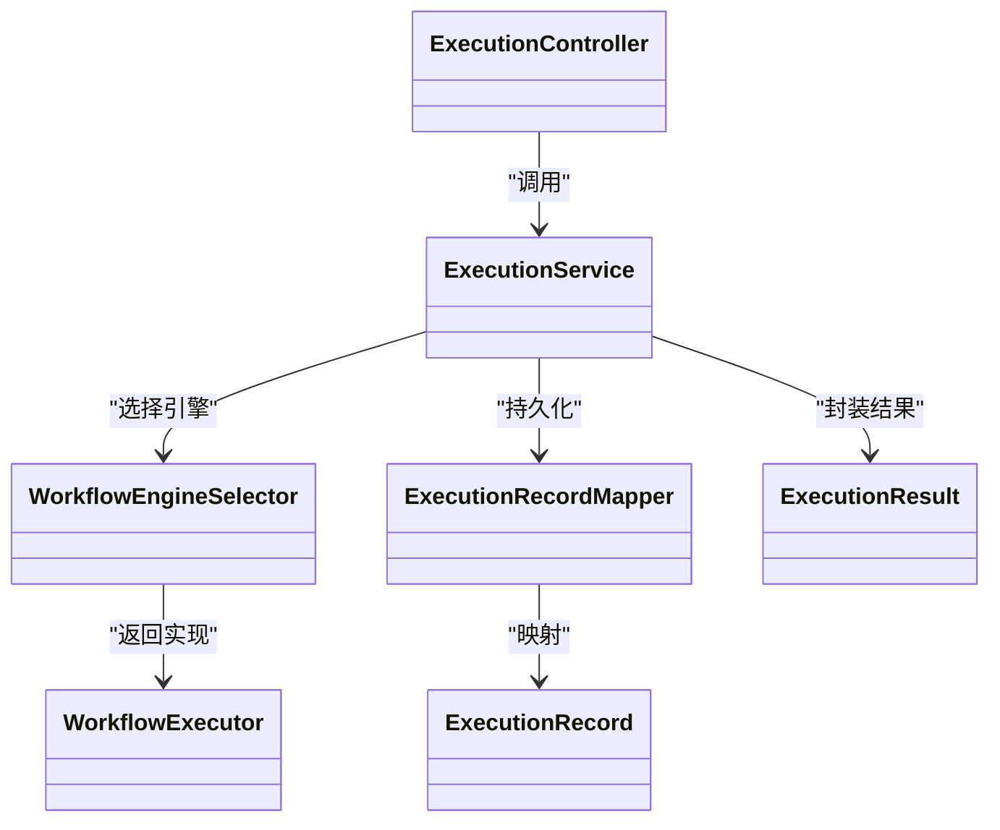

# 工作流执行API

<cite>
**本文引用的文件**
- [ExecutionController.java](file://backend/src/main/java/com/bokagent/controller/ExecutionController.java)
- [ExecutionService.java](file://backend/src/main/java/com/bokagent/service/ExecutionService.java)
- [ExecutionRecord.java](file://backend/src/main/java/com/bokagent/entity/ExecutionRecord.java)
- [ExecutionRecordMapper.java](file://backend/src/main/java/com/bokagent/mapper/ExecutionRecordMapper.java)
- [WorkflowEngine.java](file://backend/src/main/java/com/bokagent/engine/WorkflowEngine.java)
- [WorkflowExecutor.java](file://backend/src/main/java/com/bokagent/engine/WorkflowExecutor.java)
- [WorkflowEngineSelector.java](file://backend/src/main/java/com/bokagent/engine/WorkflowEngineSelector.java)
- [ExecutionResult.java](file://backend/src/main/java/com/bokagent/engine/ExecutionResult.java)
- [application.yml](file://backend/src/main/resources/application.yml)
- [V2__create_execution_records.sql](file://backend/src/main/resources/db/migration/V2__create_execution_records.sql)
- [workflowApi.ts](file://frontend/src/services/workflowApi.ts)
- [Result.java](file://backend/src/main/java/com/bokagent/common/Result.java)
</cite>

## 目录
1. [简介](#简介)
2. [项目结构](#项目结构)
3. [核心组件](#核心组件)
4. [架构总览](#架构总览)
5. [详细组件分析](#详细组件分析)
6. [依赖分析](#依赖分析)
7. [性能考虑](#性能考虑)
8. [故障排查指南](#故障排查指南)
9. [结论](#结论)
10. [附录](#附录)

## 简介
本文件面向“工作流执行API”的使用与集成，聚焦以下目标：
- 手动触发工作流执行：执行启动、执行参数传递、执行上下文设置
- 实时状态监控：执行进度跟踪、中间结果获取、异常状态通知
- 执行结果获取：最终结果查询、执行日志获取、性能指标统计
- 完整生命周期：从请求发起到结果返回的全过程说明
- 执行状态枚举与转换规则：PENDING、RUNNING、COMPLETED、FAILED、CANCELLED
- 实际JSON示例：同步执行与异步执行的典型场景
- 高级能力：执行超时处理、重试机制、并发控制的配置与使用

## 项目结构
后端采用Spring Boot三层结构：控制器层负责HTTP接口，服务层封装业务逻辑，持久层通过MyBatis-Plus访问PostgreSQL；前端通过Axios调用后端REST接口。

**图表来源**
- [ExecutionController.java:1-81](file://backend/src/main/java/com/bokagent/controller/ExecutionController.java#L1-L81)
- [ExecutionService.java:1-113](file://backend/src/main/java/com/bokagent/service/ExecutionService.java#L1-L113)
- [WorkflowEngineSelector.java:1-53](file://backend/src/main/java/com/bokagent/engine/WorkflowEngineSelector.java#L1-L53)
- [WorkflowExecutor.java:1-26](file://backend/src/main/java/com/bokagent/engine/WorkflowExecutor.java#L1-L26)
- [ExecutionResult.java:1-32](file://backend/src/main/java/com/bokagent/engine/ExecutionResult.java#L1-L32)
- [ExecutionRecordMapper.java:1-13](file://backend/src/main/java/com/bokagent/mapper/ExecutionRecordMapper.java#L1-L13)
- [ExecutionRecord.java:1-40](file://backend/src/main/java/com/bokagent/entity/ExecutionRecord.java#L1-L40)
- [V2__create_execution_records.sql:1-19](file://backend/src/main/resources/db/migration/V2__create_execution_records.sql#L1-L19)

**章节来源**
- [ExecutionController.java:1-81](file://backend/src/main/java/com/bokagent/controller/ExecutionController.java#L1-L81)
- [ExecutionService.java:1-113](file://backend/src/main/java/com/bokagent/service/ExecutionService.java#L1-L113)
- [application.yml:101-156](file://backend/src/main/resources/application.yml#L101-L156)

## 核心组件
- 执行控制器：提供执行记录的增删改查REST接口，负责接收客户端请求并返回统一响应包装。
- 执行服务：协调工作流查询、执行记录创建、引擎调度与结果写回。
- 引擎选择器：根据配置动态选择自定义或LangGraph4J引擎。
- 执行记录：持久化执行上下文、输入输出、状态与时间戳。
- 执行结果：封装执行成功与否、输出、错误与耗时。
- 数据库表：execution_records，包含状态、JSONB字段、索引等。

**章节来源**
- [ExecutionController.java:13-80](file://backend/src/main/java/com/bokagent/controller/ExecutionController.java#L13-L80)
- [ExecutionService.java:17-92](file://backend/src/main/java/com/bokagent/service/ExecutionService.java#L17-L92)
- [WorkflowEngineSelector.java:9-52](file://backend/src/main/java/com/bokagent/engine/WorkflowEngineSelector.java#L9-L52)
- [ExecutionRecord.java:12-39](file://backend/src/main/java/com/bokagent/entity/ExecutionRecord.java#L12-L39)
- [ExecutionResult.java:6-31](file://backend/src/main/java/com/bokagent/engine/ExecutionResult.java#L6-L31)
- [V2__create_execution_records.sql:1-19](file://backend/src/main/resources/db/migration/V2__create_execution_records.sql#L1-L19)

## 架构总览
下图展示了从客户端到数据库的完整调用链路与状态流转。

**图表来源**
- [ExecutionController.java:48-60](file://backend/src/main/java/com/bokagent/controller/ExecutionController.java#L48-L60)
- [ExecutionService.java:33-92](file://backend/src/main/java/com/bokagent/service/ExecutionService.java#L33-L92)
- [WorkflowEngineSelector.java:28-43](file://backend/src/main/java/com/bokagent/engine/WorkflowEngineSelector.java#L28-L43)
- [WorkflowExecutor.java:10-25](file://backend/src/main/java/com/bokagent/engine/WorkflowExecutor.java#L10-L25)
- [ExecutionRecordMapper.java:1-13](file://backend/src/main/java/com/bokagent/mapper/ExecutionRecordMapper.java#L1-L13)

## 详细组件分析

### 接口定义与请求/响应规范
- 基础路径：/api/executions
- 统一响应包装：Result<T>，包含code、message、data三部分
- 执行记录实体字段：id、workflowId、inputData、outputData、status、error、startTime、endTime、createdAt

**章节来源**
- [ExecutionController.java:18-80](file://backend/src/main/java/com/bokagent/controller/ExecutionController.java#L18-L80)
- [Result.java:8-42](file://backend/src/main/java/com/bokagent/common/Result.java#L8-L42)
- [ExecutionRecord.java:17-39](file://backend/src/main/java/com/bokagent/entity/ExecutionRecord.java#L17-L39)

### 手动触发执行（同步）
- 方法：POST /api/executions
- 请求体：ExecutionRecord（至少包含workflowId与inputData）
- 行为：服务层创建执行记录并立即调度引擎执行，完成后写回状态与结果
- 返回：Result<ExecutionRecord>，其中status为SUCCESS或FAILED

**图表来源**
- [ExecutionController.java:52-60](file://backend/src/main/java/com/bokagent/controller/ExecutionController.java#L52-L60)
- [ExecutionService.java:39-92](file://backend/src/main/java/com/bokagent/service/ExecutionService.java#L39-L92)

**章节来源**
- [ExecutionController.java:52-60](file://backend/src/main/java/com/bokagent/controller/ExecutionController.java#L52-L60)
- [ExecutionService.java:39-92](file://backend/src/main/java/com/bokagent/service/ExecutionService.java#L39-L92)

### 实时状态监控（异步轮询）
- 方法：GET /api/executions/{id}
- 行为：根据执行记录ID轮询查询，观察status变化
- 建议：在前端以固定间隔轮询，结合error字段判断异常状态
- 中间结果：可通过outputData或在引擎内部通过其他通道获取（本实现以最终结果为主）

**图表来源**
- [ExecutionController.java:39-47](file://backend/src/main/java/com/bokagent/controller/ExecutionController.java#L39-L47)
- [ExecutionService.java:99-101](file://backend/src/main/java/com/bokagent/service/ExecutionService.java#L99-L101)

**章节来源**
- [ExecutionController.java:39-47](file://backend/src/main/java/com/bokagent/controller/ExecutionController.java#L39-L47)
- [ExecutionService.java:99-101](file://backend/src/main/java/com/bokagent/service/ExecutionService.java#L99-L101)

### 执行结果获取
- 最终结果查询：GET /api/executions/{id}，读取outputData与status
- 执行日志：本实现未内置专用日志接口，建议通过后端日志查看执行耗时与错误堆栈
- 性能指标：execution_records表包含duration_ms字段，可在查询时统计

**章节来源**
- [V2__create_execution_records.sql:1-19](file://backend/src/main/resources/db/migration/V2__create_execution_records.sql#L1-L19)
- [ExecutionRecord.java:34-36](file://backend/src/main/java/com/bokagent/entity/ExecutionRecord.java#L34-L36)

### 执行状态枚举与转换规则
- PENDING：未使用；本实现默认创建即进入RUNNING
- RUNNING：执行中
- COMPLETED：未使用；本实现以SUCCESS替代
- FAILED：执行失败
- CANCELLED：未使用；如需支持可在服务层扩展

状态转换示意：

**图表来源**
- [ExecutionController.java:55-76](file://backend/src/main/java/com/bokagent/controller/ExecutionController.java#L55-L76)
- [ExecutionService.java:66-87](file://backend/src/main/java/com/bokagent/service/ExecutionService.java#L66-L87)

**章节来源**
- [ExecutionController.java:55-76](file://backend/src/main/java/com/bokagent/controller/ExecutionController.java#L55-L76)
- [ExecutionService.java:66-87](file://backend/src/main/java/com/bokagent/service/ExecutionService.java#L66-L87)

### 执行生命周期说明
- 请求发起：客户端POST /api/executions提交workflowId与inputData
- 记录创建：服务层插入执行记录，状态置为RUNNING
- 引擎执行：选择器获取引擎并执行，返回ExecutionResult
- 结果写回：成功则SUCCESS并写入outputData，失败则FAILED并写入error
- 完成返回：返回最终ExecutionRecord

**章节来源**
- [ExecutionService.java:39-92](file://backend/src/main/java/com/bokagent/service/ExecutionService.java#L39-L92)
- [WorkflowEngineSelector.java:28-43](file://backend/src/main/java/com/bokagent/engine/WorkflowEngineSelector.java#L28-L43)

### JSON示例

- 同步执行请求体（POST /api/executions）
  - 字段：workflowId（数字）、inputData（对象，键值对）
  - 示例字段结构参考：[ExecutionRecord.java:24-28](file://backend/src/main/java/com/bokagent/entity/ExecutionRecord.java#L24-L28)

- 同步执行响应体
  - 字段：code（200）、message（"success"）、data（包含id、status、inputData、outputData、startTime、endTime等）
  - 包装结构参考：[Result.java:9-12](file://backend/src/main/java/com/bokagent/common/Result.java#L9-L12)

- 异步轮询响应体
  - 字段：同上，status可能为RUNNING/SUCCESS/FAILED
  - 查询接口参考：[ExecutionController.java:39-47](file://backend/src/main/java/com/bokagent/controller/ExecutionController.java#L39-L47)

- 执行记录表结构（数据库）
  - 字段：id、workflow_id、status、input_data(JSONB)、output_data(JSONB)、error_message、started_at、completed_at、duration_ms
  - 参考：[V2__create_execution_records.sql:1-19](file://backend/src/main/resources/db/migration/V2__create_execution_records.sql#L1-L19)

**章节来源**
- [ExecutionRecord.java:17-39](file://backend/src/main/java/com/bokagent/entity/ExecutionRecord.java#L17-L39)
- [Result.java:9-12](file://backend/src/main/java/com/bokagent/common/Result.java#L9-L12)
- [ExecutionController.java:39-47](file://backend/src/main/java/com/bokagent/controller/ExecutionController.java#L39-L47)
- [V2__create_execution_records.sql:1-19](file://backend/src/main/resources/db/migration/V2__create_execution_records.sql#L1-L19)

### 高级功能配置与使用

- 执行超时处理
  - 配置项：workflow-execution（工作流执行超时，默认5分钟）
  - 使用建议：在调用前评估工作流复杂度，必要时在前端增加超时提示与重试策略
  - 参考：[application.yml:149-155](file://backend/src/main/resources/application.yml#L149-L155)

- 重试机制
  - 配置项：retry.default（最大重试次数、初始延迟、退避倍数、最大延迟、可重试异常类型）
  - 使用建议：对网络波动或第三方服务不稳定场景启用；注意幂等性设计
  - 参考：[application.yml:138-148](file://backend/src/main/resources/application.yml#L138-L148)

- 并发控制
  - 配置项：task.execution.pool（核心线程数、最大线程数、队列容量）
  - 使用建议：根据CPU与I/O特性调整线程池大小，避免过度竞争
  - 参考：[application.yml:81-89](file://backend/src/main/resources/application.yml#L81-L89)

- 引擎选择
  - 配置项：workflow.engine（custom 或 langgraph4j）
  - 使用建议：生产环境建议使用langgraph4j（如已实现）以获得更强的图执行能力
  - 参考：[application.yml:101-108](file://backend/src/main/resources/application.yml#L101-L108)

**章节来源**
- [application.yml:81-89](file://backend/src/main/resources/application.yml#L81-L89)
- [application.yml:101-108](file://backend/src/main/resources/application.yml#L101-L108)
- [application.yml:138-148](file://backend/src/main/resources/application.yml#L138-L148)
- [application.yml:149-155](file://backend/src/main/resources/application.yml#L149-L155)

## 依赖分析
- 控制器依赖服务层；服务层依赖引擎选择器与执行记录Mapper；执行记录Mapper映射至execution_records表。
- 引擎接口抽象清晰，便于替换不同实现（自定义/ LangGraph4J）。

**图表来源**
- [ExecutionController.java:22-23](file://backend/src/main/java/com/bokagent/controller/ExecutionController.java#L22-L23)
- [ExecutionService.java:24-31](file://backend/src/main/java/com/bokagent/service/ExecutionService.java#L24-L31)
- [WorkflowEngineSelector.java:17-23](file://backend/src/main/java/com/bokagent/engine/WorkflowEngineSelector.java#L17-L23)
- [ExecutionRecordMapper.java:10-12](file://backend/src/main/java/com/bokagent/mapper/ExecutionRecordMapper.java#L10-L12)
- [ExecutionRecord.java:17-39](file://backend/src/main/java/com/bokagent/entity/ExecutionRecord.java#L17-L39)
- [ExecutionResult.java:10-31](file://backend/src/main/java/com/bokagent/engine/ExecutionResult.java#L10-L31)

**章节来源**
- [ExecutionController.java:22-23](file://backend/src/main/java/com/bokagent/controller/ExecutionController.java#L22-L23)
- [ExecutionService.java:24-31](file://backend/src/main/java/com/bokagent/service/ExecutionService.java#L24-L31)
- [WorkflowEngineSelector.java:17-23](file://backend/src/main/java/com/bokagent/engine/WorkflowEngineSelector.java#L17-L23)
- [ExecutionRecordMapper.java:10-12](file://backend/src/main/java/com/bokagent/mapper/ExecutionRecordMapper.java#L10-L12)
- [ExecutionRecord.java:17-39](file://backend/src/main/java/com/bokagent/entity/ExecutionRecord.java#L17-L39)
- [ExecutionResult.java:10-31](file://backend/src/main/java/com/bokagent/engine/ExecutionResult.java#L10-L31)

## 性能考虑
- 数据库存储：input_data与output_data使用JSONB，适合灵活结构；建议控制单次输出大小，避免过大JSON影响序列化性能。
- 索引优化：execution_records表对workflow_id与started_at建立索引，有利于分页与按时间排序查询。
- 并发与超时：合理配置线程池与执行超时，避免阻塞与资源耗尽。
- 前端轮询：建议指数退避与最大重试次数，降低无效请求。

**章节来源**
- [V2__create_execution_records.sql:17-18](file://backend/src/main/resources/db/migration/V2__create_execution_records.sql#L17-L18)
- [application.yml:81-89](file://backend/src/main/resources/application.yml#L81-L89)
- [application.yml:149-155](file://backend/src/main/resources/application.yml#L149-L155)

## 故障排查指南
- 404错误：执行记录不存在（GET /api/executions/{id}）
  - 处理：确认执行ID正确或先创建执行记录
  - 参考：[ExecutionController.java:43-46](file://backend/src/main/java/com/bokagent/controller/ExecutionController.java#L43-L46)

- 执行失败：status=FAILED且包含error
  - 处理：查看后端日志定位异常；检查inputData格式与工作流定义
  - 参考：[ExecutionService.java:81-91](file://backend/src/main/java/com/bokagent/service/ExecutionService.java#L81-L91)

- 超时问题：workflow-execution超时
  - 处理：延长超时阈值或拆分工作流；前端增加超时提示
  - 参考：[application.yml:149-155](file://backend/src/main/resources/application.yml#L149-L155)

- 并发瓶颈：线程池饱和
  - 处理：增大线程池容量或优化工作流节点执行时间
  - 参考：[application.yml:81-89](file://backend/src/main/resources/application.yml#L81-L89)

**章节来源**
- [ExecutionController.java:43-46](file://backend/src/main/java/com/bokagent/controller/ExecutionController.java#L43-L46)
- [ExecutionService.java:81-91](file://backend/src/main/java/com/bokagent/service/ExecutionService.java#L81-L91)
- [application.yml:81-89](file://backend/src/main/resources/application.yml#L81-L89)
- [application.yml:149-155](file://backend/src/main/resources/application.yml#L149-L155)

## 结论
本工作流执行API提供了简洁明确的同步执行入口与完善的异步轮询监控能力。通过统一响应包装、执行记录持久化与可配置的超时/重试/并发策略，能够满足大多数企业级应用场景。建议在生产环境中结合LangGraph4J引擎与完善的日志体系，进一步提升可观测性与稳定性。

## 附录

### 前端调用参考
- 列表与详情：参考前端API封装
  - [workflowApi.ts:28-41](file://frontend/src/services/workflowApi.ts#L28-L41)

**章节来源**
- [workflowApi.ts:28-41](file://frontend/src/services/workflowApi.ts#L28-L41)