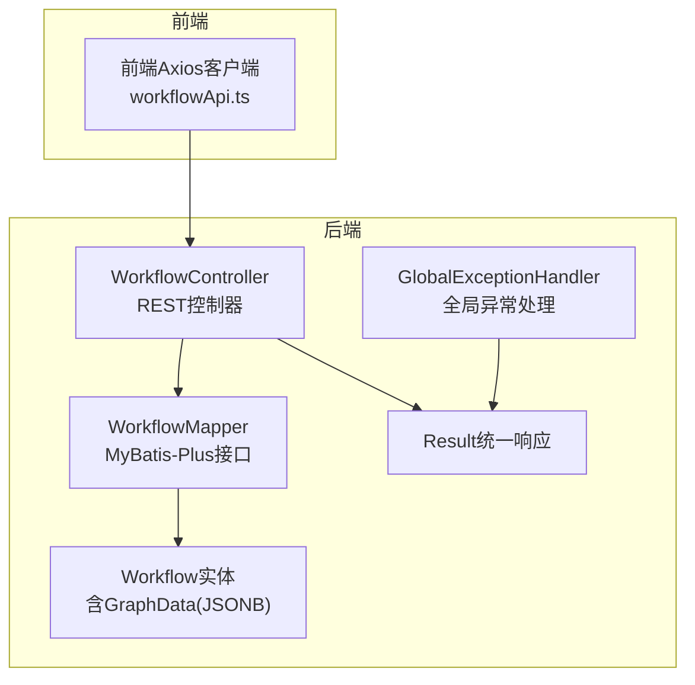
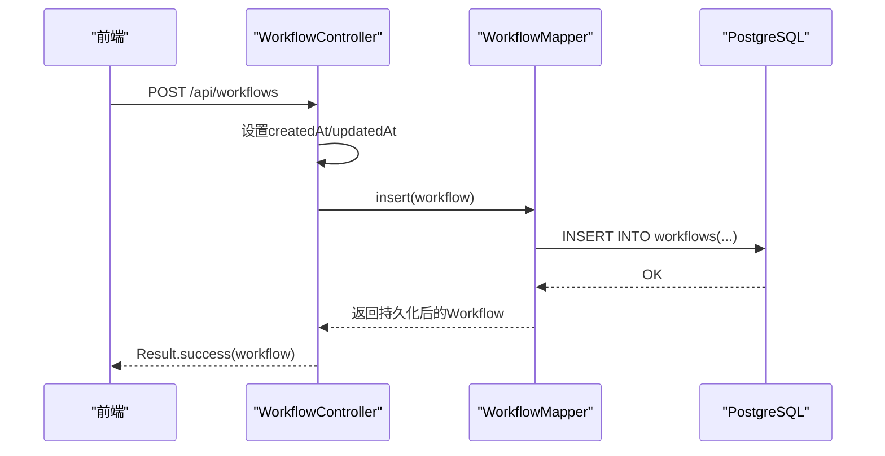
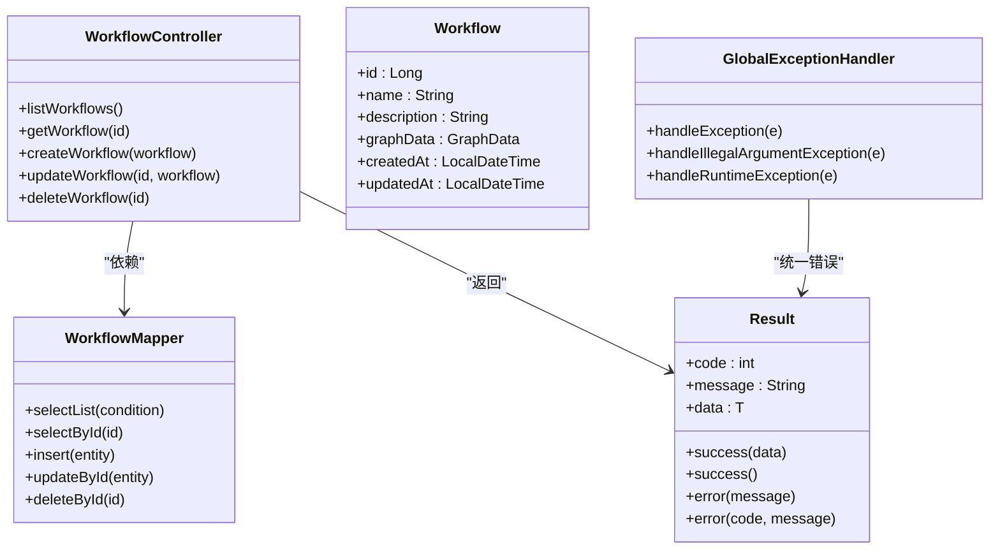

# 工作流管理API

<cite>
**本文引用的文件**
- [WorkflowController.java](file://backend/src/main/java/com/bokagent/controller/WorkflowController.java)
- [Workflow.java](file://backend/src/main/java/com/bokagent/entity/Workflow.java)
- [WorkflowMapper.java](file://backend/src/main/java/com/bokagent/mapper/WorkflowMapper.java)
- [Result.java](file://backend/src/main/java/com/bokagent/common/Result.java)
- [GlobalExceptionHandler.java](file://backend/src/main/java/com/bokagent/common/GlobalExceptionHandler.java)
- [GraphData.java](file://backend/src/main/java/com/bokagent/entity/GraphData.java)
- [Node.java](file://backend/src/main/java/com/bokagent/entity/Node.java)
- [NodeData.java](file://backend/src/main/java/com/bokagent/entity/NodeData.java)
- [Edge.java](file://backend/src/main/java/com/bokagent/entity/Edge.java)
- [Position.java](file://backend/src/main/java/com/bokagent/entity/Position.java)
- [Viewport.java](file://backend/src/main/java/com/bokagent/entity/Viewport.java)
- [V1__create_workflow_tables.sql](file://backend/src/main/resources/db/migration/V1__create_workflow_tables.sql)
- [application.yml](file://backend/src/main/resources/application.yml)
- [workflowApi.ts](file://frontend/src/services/workflowApi.ts)
</cite>

## 目录
1. [简介](#简介)
2. [项目结构](#项目结构)
3. [核心组件](#核心组件)
4. [架构总览](#架构总览)
5. [详细组件分析](#详细组件分析)
6. [依赖分析](#依赖分析)
7. [性能考虑](#性能考虑)
8. [故障排查指南](#故障排查指南)
9. [结论](#结论)
10. [附录](#附录)

## 简介
本文件为“工作流管理API”的权威接口文档，覆盖工作流的完整CRUD能力：获取全部工作流、按ID获取工作流、创建工作流、更新工作流、删除工作流。文档详细说明请求与响应格式、字段定义、鉴权机制、错误码与状态码含义，并提供最佳实践与常见问题解决方案。

## 项目结构
后端采用Spring Boot + MyBatis-Plus架构，工作流实体通过JSONB存储图数据，统一响应封装在Result中，全局异常处理保证一致的错误返回格式。

图表来源
- [WorkflowController.java:1-92](file://backend/src/main/java/com/bokagent/controller/WorkflowController.java#L1-L92)
- [WorkflowMapper.java:1-13](file://backend/src/main/java/com/bokagent/mapper/WorkflowMapper.java#L1-L13)
- [Workflow.java:1-32](file://backend/src/main/java/com/bokagent/entity/Workflow.java#L1-L32)
- [Result.java:1-42](file://backend/src/main/java/com/bokagent/common/Result.java#L1-L42)
- [GlobalExceptionHandler.java:1-37](file://backend/src/main/java/com/bokagent/common/GlobalExceptionHandler.java#L1-L37)
- [workflowApi.ts:1-44](file://frontend/src/services/workflowApi.ts#L1-L44)

章节来源
- [WorkflowController.java:1-92](file://backend/src/main/java/com/bokagent/controller/WorkflowController.java#L1-L92)
- [application.yml:1-190](file://backend/src/main/resources/application.yml#L1-L190)

## 核心组件
- 控制器层：提供REST接口，负责路由与参数校验，调用业务逻辑并返回统一响应。
- 实体层：Workflow实体映射数据库表，graph_data以JSONB存储图结构；配套节点、边、位置、视口等模型。
- 映射层：WorkflowMapper继承BaseMapper，提供基础CRUD能力。
- 响应层：Result统一封装code/message/data，便于前后端约定。
- 异常层：GlobalExceptionHandler对常见异常进行分类处理，返回标准错误响应。

章节来源
- [WorkflowController.java:1-92](file://backend/src/main/java/com/bokagent/controller/WorkflowController.java#L1-L92)
- [Workflow.java:1-32](file://backend/src/main/java/com/bokagent/entity/Workflow.java#L1-L32)
- [WorkflowMapper.java:1-13](file://backend/src/main/java/com/bokagent/mapper/WorkflowMapper.java#L1-L13)
- [Result.java:1-42](file://backend/src/main/java/com/bokagent/common/Result.java#L1-L42)
- [GlobalExceptionHandler.java:1-37](file://backend/src/main/java/com/bokagent/common/GlobalExceptionHandler.java#L1-L37)

## 架构总览
以下序列图展示典型“创建工作流”请求从浏览器到数据库的完整链路。

图表来源
- [WorkflowController.java:48-58](file://backend/src/main/java/com/bokagent/controller/WorkflowController.java#L48-L58)
- [WorkflowMapper.java:1-13](file://backend/src/main/java/com/bokagent/mapper/WorkflowMapper.java#L1-L13)
- [V1__create_workflow_tables.sql:1-17](file://backend/src/main/resources/db/migration/V1__create_workflow_tables.sql#L1-L17)

## 详细组件分析

### 接口总览
- 获取所有工作流
  - 方法与路径：GET /api/workflows
  - 功能：返回系统内所有工作流列表
  - 鉴权：未设置专门鉴权拦截器（见“鉴权机制”）
  - 成功响应：Result.success(List<Workflow>)
  - 错误响应：Result.error(500, "系统错误...")（由全局异常处理器）
- 根据ID获取工作流
  - 方法与路径：GET /api/workflows/{id}
  - 参数：路径变量id（Long）
  - 成功响应：Result.success(Workflow)
  - 404场景：工作流不存在 -> Result.error(404, "工作流不存在")
- 创建工作流
  - 方法与路径：POST /api/workflows
  - 请求体：Workflow对象（name/description/graphData/createdAt/updatedAt）
  - 成功响应：Result.success(Workflow)
  - 错误响应：Result.error(500, "...") 或 Result.error(400, "参数错误...")
- 更新工作流
  - 方法与路径：PUT /api/workflows/{id}
  - 路径参数：id（Long）
  - 请求体：Workflow对象（仅更新name/description/graphData；createdAt由旧值保留）
  - 成功响应：Result.success(Workflow)
  - 404场景：工作流不存在 -> Result.error(404, "工作流不存在")
- 删除工作流
  - 方法与路径：DELETE /api/workflows/{id}
  - 路径参数：id（Long）
  - 成功响应：Result.success()
  - 404场景：工作流不存在 -> Result.error(404, "工作流不存在")

章节来源
- [WorkflowController.java:25-90](file://backend/src/main/java/com/bokagent/controller/WorkflowController.java#L25-L90)
- [GlobalExceptionHandler.java:16-28](file://backend/src/main/java/com/bokagent/common/GlobalExceptionHandler.java#L16-L28)

### 请求与响应格式

- 统一响应结构（Result）
  - 字段：code（数字）、message（字符串）、data（泛型）
  - 成功：code=200，message="success"
  - 失败：默认code=500，或显式传入code（如404/400）

- 工作流实体（Workflow）
  - 字段：id、name、description、graphData(GraphData)、createdAt、updatedAt
  - graphData为JSONB，存储图结构（nodes/edges/viewport）

- 图数据结构（GraphData）
  - nodes：Node数组
  - edges：Edge数组
  - viewport：Viewport

- 节点（Node）
  - id、type（start/llm/end）、position（Position）、data（NodeData）

- 边（Edge）
  - id、source、target

- 位置（Position）
  - x、y

- 视口（Viewport）
  - x、y、zoom

- 数据库表结构（workflows）
  - id（主键）、name、description、graph_data(JSONB)、created_at、updated_at
  - 索引：按created_at倒序索引

章节来源
- [Result.java:1-42](file://backend/src/main/java/com/bokagent/common/Result.java#L1-L42)
- [Workflow.java:1-32](file://backend/src/main/java/com/bokagent/entity/Workflow.java#L1-L32)
- [GraphData.java:1-15](file://backend/src/main/java/com/bokagent/entity/GraphData.java#L1-L15)
- [Node.java:1-15](file://backend/src/main/java/com/bokagent/entity/Node.java#L1-L15)
- [Edge.java:1-14](file://backend/src/main/java/com/bokagent/entity/Edge.java#L1-L14)
- [Position.java:1-13](file://backend/src/main/java/com/bokagent/entity/Position.java#L1-L13)
- [Viewport.java:1-15](file://backend/src/main/java/com/bokagent/entity/Viewport.java#L1-L15)
- [V1__create_workflow_tables.sql:1-17](file://backend/src/main/resources/db/migration/V1__create_workflow_tables.sql#L1-L17)

### 鉴权机制
- 后端未对工作流管理接口设置专门的鉴权拦截器，默认允许跨域访问（@CrossOrigin）。
- 若需鉴权，请在网关或Spring Security处添加认证/授权策略，并在控制器层增加@PreAuthorize等注解。

章节来源
- [WorkflowController.java:18-19](file://backend/src/main/java/com/bokagent/controller/WorkflowController.java#L18-L19)

### 错误码与状态码
- 404（未找到）：当查询/更新/删除的工作流不存在时返回
- 400（参数错误）：由全局异常处理器捕获IllegalArgumentException并返回
- 500（服务器内部错误）：由全局异常处理器捕获Exception/RuntimeException并返回
- 200（成功）：Result.success(...)返回

章节来源
- [WorkflowController.java:42-44](file://backend/src/main/java/com/bokagent/controller/WorkflowController.java#L42-L44)
- [WorkflowController.java:67-69](file://backend/src/main/java/com/bokagent/controller/WorkflowController.java#L67-L69)
- [WorkflowController.java:85-87](file://backend/src/main/java/com/bokagent/controller/WorkflowController.java#L85-L87)
- [GlobalExceptionHandler.java:23-35](file://backend/src/main/java/com/bokagent/common/GlobalExceptionHandler.java#L23-L35)

### 完整接口定义与示例

- 获取所有工作流
  - 请求
    - 方法：GET
    - 路径：/api/workflows
  - 响应
    - 成功：code=200，message="success"，data为Workflow数组
    - 失败：code=500，message="系统错误..."（全局异常）

- 根据ID获取工作流
  - 请求
    - 方法：GET
    - 路径：/api/workflows/{id}
    - 路径参数：id（Long）
  - 响应
    - 成功：code=200，data为Workflow
    - 404：code=404，message="工作流不存在"

- 创建工作流
  - 请求
    - 方法：POST
    - 路径：/api/workflows
    - 请求体：Workflow对象（name、description、graphData、createdAt/updatedAt可省略）
  - 响应
    - 成功：code=200，data为新创建的Workflow
    - 400：参数错误
    - 500：系统错误

- 更新工作流
  - 请求
    - 方法：PUT
    - 路径：/api/workflows/{id}
    - 路径参数：id（Long）
    - 请求体：Workflow对象（name、description、graphData；createdAt由旧值保留）
  - 响应
    - 成功：code=200，data为更新后的Workflow
    - 404：工作流不存在
    - 400/500：参数或系统错误

- 删除工作流
  - 请求
    - 方法：DELETE
    - 路径：/api/workflows/{id}
    - 路径参数：id（Long）
  - 响应
    - 成功：code=200，data=null
    - 404：工作流不存在
    - 500：系统错误

- 前端调用参考
  - 前端Axios封装了上述接口，便于在前端直接调用。

章节来源
- [WorkflowController.java:25-90](file://backend/src/main/java/com/bokagent/controller/WorkflowController.java#L25-L90)
- [workflowApi.ts:10-26](file://frontend/src/services/workflowApi.ts#L10-L26)

### 字段定义与约束

- Workflow
  - id：自增主键
  - name：非空字符串
  - description：文本（支持中文与Emoji）
  - graphData：JSONB，包含nodes/edges/viewport
  - createdAt/updatedAt：时间戳

- GraphData
  - nodes：Node数组
  - edges：Edge数组
  - viewport：视口坐标与缩放

- Node
  - id：节点标识
  - type：节点类型（start/llm/end）
  - position：位置坐标
  - data：节点配置（label/prompt/config）

- Edge
  - id：边标识
  - source/target：连接源与目标节点id

- Position
  - x/y：二维坐标

- Viewport
  - x/y/zoom：视口平移与缩放

章节来源
- [Workflow.java:18-30](file://backend/src/main/java/com/bokagent/entity/Workflow.java#L18-L30)
- [GraphData.java:10-14](file://backend/src/main/java/com/bokagent/entity/GraphData.java#L10-L14)
- [Node.java:9-14](file://backend/src/main/java/com/bokagent/entity/Node.java#L9-L14)
- [Edge.java:9-13](file://backend/src/main/java/com/bokagent/entity/Edge.java#L9-L13)
- [Position.java:9-12](file://backend/src/main/java/com/bokagent/entity/Position.java#L9-L12)
- [Viewport.java:9-14](file://backend/src/main/java/com/bokagent/entity/Viewport.java#L9-L14)
- [V1__create_workflow_tables.sql:2-9](file://backend/src/main/resources/db/migration/V1__create_workflow_tables.sql#L2-L9)

### 前后端交互流程示例

- 创建工作流（前端）
  - 步骤：构造Workflow对象（含name、description、graphData），调用createWorkflow
  - 返回：Result.success(workflow)，前端解析data渲染

- 更新工作流（前端）
  - 步骤：构造Workflow对象（仅更新需要的字段），调用updateWorkflow(id, workflow)
  - 返回：Result.success(workflow)

- 查询工作流（前端）
  - 步骤：调用listWorkflows或getWorkflow(id)
  - 返回：Result.success([...]/workflow)

章节来源
- [workflowApi.ts:18-25](file://frontend/src/services/workflowApi.ts#L18-L25)

## 依赖分析

图表来源
- [WorkflowController.java:1-92](file://backend/src/main/java/com/bokagent/controller/WorkflowController.java#L1-L92)
- [WorkflowMapper.java:1-13](file://backend/src/main/java/com/bokagent/mapper/WorkflowMapper.java#L1-L13)
- [Workflow.java:1-32](file://backend/src/main/java/com/bokagent/entity/Workflow.java#L1-L32)
- [Result.java:1-42](file://backend/src/main/java/com/bokagent/common/Result.java#L1-L42)
- [GlobalExceptionHandler.java:1-37](file://backend/src/main/java/com/bokagent/common/GlobalExceptionHandler.java#L1-L37)

## 性能考虑
- 数据库存储：graph_data使用JSONB，适合灵活的图结构存储；建议对频繁查询字段建立合适索引（如name、created_at）。
- ORM层：MyBatis-Plus提供高效CRUD；注意批量操作时避免N+1查询。
- 响应封装：Result统一封装减少前后端差异处理成本。
- 异常处理：全局异常处理器集中处理，避免重复try/catch。

## 故障排查指南
- 404工作流不存在
  - 现象：查询/更新/删除返回404
  - 排查：确认id是否正确；检查数据库是否存在该记录
- 400参数错误
  - 现象：参数不合法导致IllegalArgumentException
  - 排查：检查请求体字段是否符合实体定义；确保graphData结构完整
- 500服务器错误
  - 现象：系统异常
  - 排查：查看日志；检查数据库连接、Redis、外部LLM服务配置
- 跨域与鉴权
  - 现象：CORS错误或未授权
  - 排查：若启用鉴权，需在网关或Security中配置；当前控制器允许跨域

章节来源
- [WorkflowController.java:42-44](file://backend/src/main/java/com/bokagent/controller/WorkflowController.java#L42-L44)
- [WorkflowController.java:67-69](file://backend/src/main/java/com/bokagent/controller/WorkflowController.java#L67-L69)
- [WorkflowController.java:85-87](file://backend/src/main/java/com/bokagent/controller/WorkflowController.java#L85-L87)
- [GlobalExceptionHandler.java:23-35](file://backend/src/main/java/com/bokagent/common/GlobalExceptionHandler.java#L23-L35)

## 结论
工作流管理API提供了简洁稳定的CRUD能力，配合统一响应与异常处理，满足前后端协作需求。建议在生产环境中补充鉴权与输入校验，并针对graphData进行版本兼容与Schema校验，以提升系统稳定性与可维护性。

## 附录

### 常用配置项（application.yml节选）
- 数据源与ORM：PostgreSQL、MyBatis-Plus、Flyway迁移
- 缓存与超时：Redis、工具执行/LLM调用/工作流执行超时
- 日志与监控：Actuator健康检查

章节来源
- [application.yml:16-190](file://backend/src/main/resources/application.yml#L16-L190)