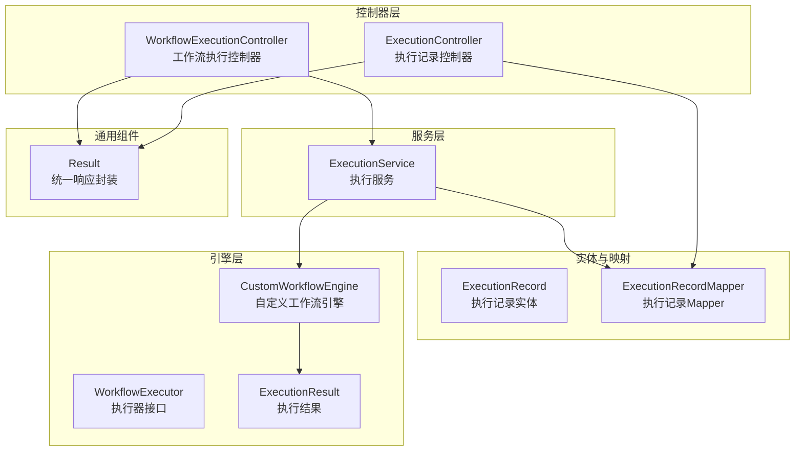
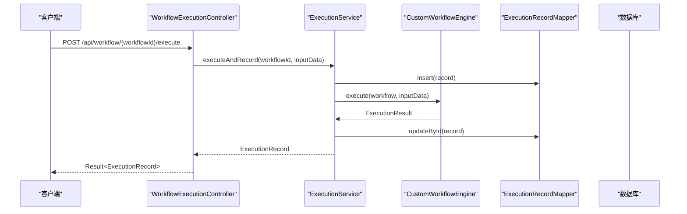
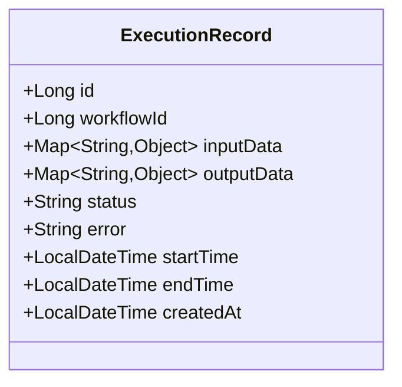
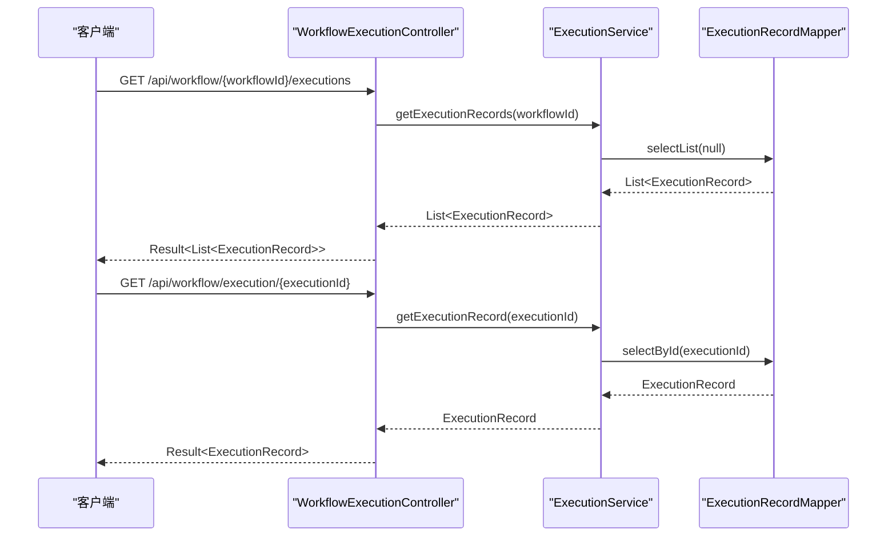
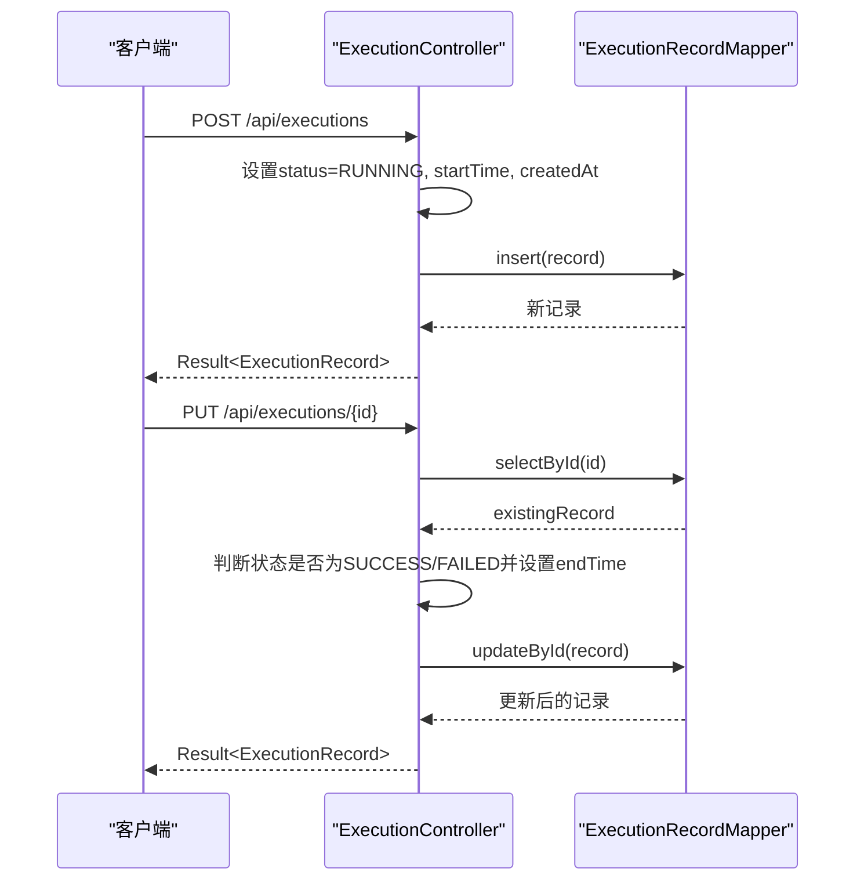
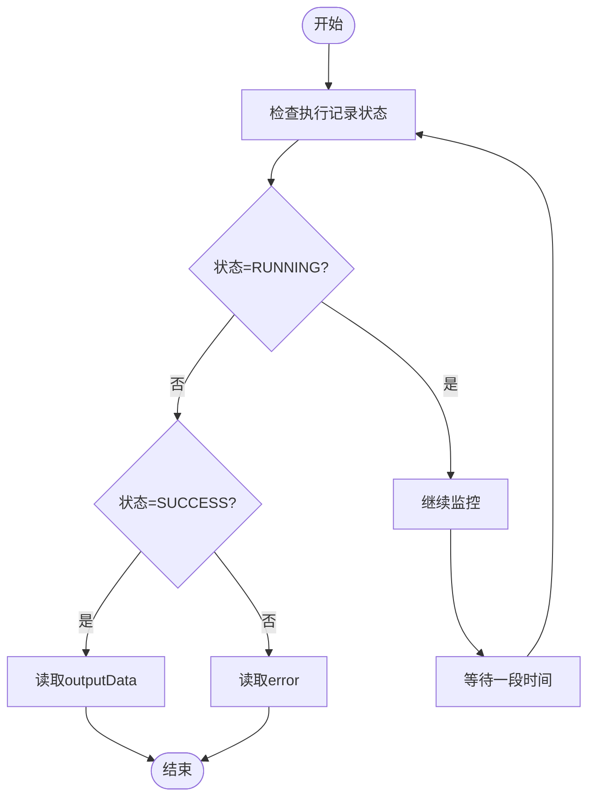
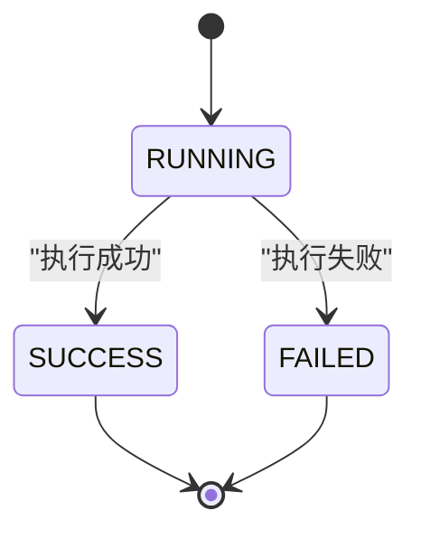
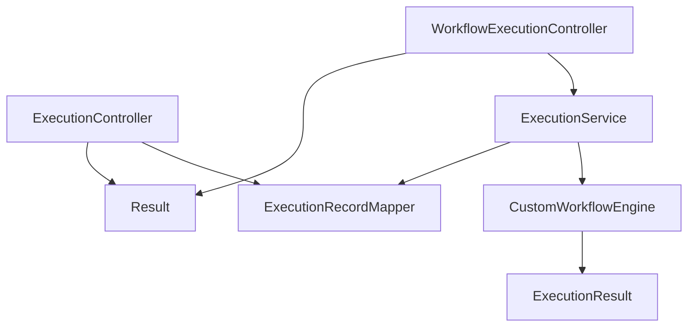

# 执行记录API

<cite>
**本文档引用的文件**
- [ExecutionController.java](file://backend/src/main/java/com/bokagent/controller/ExecutionController.java)
- [WorkflowExecutionController.java](file://backend/src/main/java/com/bokagent/controller/WorkflowExecutionController.java)
- [ExecutionService.java](file://backend/src/main/java/com/bokagent/service/ExecutionService.java)
- [ExecutionRecord.java](file://backend/src/main/java/com/bokagent/entity/ExecutionRecord.java)
- [ExecutionRecordMapper.java](file://backend/src/main/java/com/bokagent/mapper/ExecutionRecordMapper.java)
- [ExecutionResult.java](file://backend/src/main/java/com/bokagent/engine/ExecutionResult.java)
- [CustomWorkflowEngine.java](file://backend/src/main/java/com/bokagent/engine/CustomWorkflowEngine.java)
- [WorkflowExecutor.java](file://backend/src/main/java/com/bokagent/engine/WorkflowExecutor.java)
- [Result.java](file://backend/src/main/java/com/bokagent/common/Result.java)
- [V2__create_execution_records.sql](file://backend/src/main/resources/db/migration/V2__create_execution_records.sql)
- [application.yml](file://backend/src/main/resources/application.yml)
</cite>

## 目录
1. [简介](#简介)
2. [项目结构](#项目结构)
3. [核心组件](#核心组件)
4. [架构概览](#架构概览)
5. [详细组件分析](#详细组件分析)
6. [依赖关系分析](#依赖关系分析)
7. [性能考虑](#性能考虑)
8. [故障排除指南](#故障排除指南)
9. [结论](#结论)
10. [附录](#附录)

## 简介
本文件为执行记录管理API的完整接口文档，涵盖执行记录的查询与管理功能，包括：
- 执行历史列表查询
- 根据ID获取特定执行记录
- 按工作流ID查询执行记录
- 实时状态获取与进度监控
- 执行结果查询与错误处理

同时详细说明执行记录的数据结构、请求参数与响应格式、分页与排序规则、状态枚举值、错误处理机制以及性能优化建议。

## 项目结构
后端采用Spring Boot + MyBatis-Plus架构，执行记录API主要由以下模块组成：
- 控制器层：提供REST接口
- 服务层：封装业务逻辑与工作流执行
- 实体层：定义执行记录数据模型
- 映射层：MyBatis-Plus数据访问接口
- 引擎层：工作流执行器与结果封装

**图表来源**
- [ExecutionController.java:1-81](file://backend/src/main/java/com/bokagent/controller/ExecutionController.java#L1-L81)
- [WorkflowExecutionController.java:1-76](file://backend/src/main/java/com/bokagent/controller/WorkflowExecutionController.java#L1-L76)
- [ExecutionService.java:1-113](file://backend/src/main/java/com/bokagent/service/ExecutionService.java#L1-L113)
- [ExecutionRecord.java:1-40](file://backend/src/main/java/com/bokagent/entity/ExecutionRecord.java#L1-L40)
- [ExecutionRecordMapper.java:1-13](file://backend/src/main/java/com/bokagent/mapper/ExecutionRecordMapper.java#L1-L13)
- [CustomWorkflowEngine.java:1-170](file://backend/src/main/java/com/bokagent/engine/CustomWorkflowEngine.java#L1-L170)
- [WorkflowExecutor.java:1-26](file://backend/src/main/java/com/bokagent/engine/WorkflowExecutor.java#L1-L26)
- [ExecutionResult.java:1-32](file://backend/src/main/java/com/bokagent/engine/ExecutionResult.java#L1-L32)
- [Result.java:1-42](file://backend/src/main/java/com/bokagent/common/Result.java#L1-L42)

**章节来源**
- [ExecutionController.java:1-81](file://backend/src/main/java/com/bokagent/controller/ExecutionController.java#L1-L81)
- [WorkflowExecutionController.java:1-76](file://backend/src/main/java/com/bokagent/controller/WorkflowExecutionController.java#L1-L76)
- [ExecutionService.java:1-113](file://backend/src/main/java/com/bokagent/service/ExecutionService.java#L1-L113)
- [ExecutionRecord.java:1-40](file://backend/src/main/java/com/bokagent/entity/ExecutionRecord.java#L1-L40)
- [ExecutionRecordMapper.java:1-13](file://backend/src/main/java/com/bokagent/mapper/ExecutionRecordMapper.java#L1-L13)
- [CustomWorkflowEngine.java:1-170](file://backend/src/main/java/com/bokagent/engine/CustomWorkflowEngine.java#L1-L170)
- [WorkflowExecutor.java:1-26](file://backend/src/main/java/com/bokagent/engine/WorkflowExecutor.java#L1-L26)
- [ExecutionResult.java:1-32](file://backend/src/main/java/com/bokagent/engine/ExecutionResult.java#L1-L32)
- [Result.java:1-42](file://backend/src/main/java/com/bokagent/common/Result.java#L1-L42)

## 核心组件
- 执行记录实体：包含执行ID、工作流ID、状态、输入输出数据、时间戳、错误信息等字段
- 执行记录Mapper：基于MyBatis-Plus的CRUD接口
- 执行服务：封装执行流程、状态更新与结果持久化
- 执行控制器：提供REST接口，返回统一响应封装
- 工作流引擎：执行工作流并返回执行结果

**章节来源**
- [ExecutionRecord.java:1-40](file://backend/src/main/java/com/bokagent/entity/ExecutionRecord.java#L1-L40)
- [ExecutionRecordMapper.java:1-13](file://backend/src/main/java/com/bokagent/mapper/ExecutionRecordMapper.java#L1-L13)
- [ExecutionService.java:1-113](file://backend/src/main/java/com/bokagent/service/ExecutionService.java#L1-L113)
- [ExecutionController.java:1-81](file://backend/src/main/java/com/bokagent/controller/ExecutionController.java#L1-L81)
- [CustomWorkflowEngine.java:1-170](file://backend/src/main/java/com/bokagent/engine/CustomWorkflowEngine.java#L1-L170)

## 架构概览
执行记录API通过控制器接收请求，服务层协调工作流引擎执行，并将结果写入数据库。统一响应封装确保前后端交互的一致性。

**图表来源**
- [WorkflowExecutionController.java:24-44](file://backend/src/main/java/com/bokagent/controller/WorkflowExecutionController.java#L24-L44)
- [ExecutionService.java:33-92](file://backend/src/main/java/com/bokagent/service/ExecutionService.java#L33-L92)
- [CustomWorkflowEngine.java:40-76](file://backend/src/main/java/com/bokagent/engine/CustomWorkflowEngine.java#L40-L76)
- [ExecutionRecordMapper.java:1-13](file://backend/src/main/java/com/bokagent/mapper/ExecutionRecordMapper.java#L1-L13)

## 详细组件分析

### 执行记录数据模型
执行记录实体包含以下关键字段：
- id：执行记录主键
- workflowId：关联的工作流ID
- inputData：输入数据（JSONB）
- outputData：输出数据（JSONB）
- status：执行状态（RUNNING/SUCCESS/FAILED）
- error：错误信息
- startTime：开始时间
- endTime：结束时间
- createdAt：创建时间

**图表来源**
- [ExecutionRecord.java:12-39](file://backend/src/main/java/com/bokagent/entity/ExecutionRecord.java#L12-L39)

**章节来源**
- [ExecutionRecord.java:1-40](file://backend/src/main/java/com/bokagent/entity/ExecutionRecord.java#L1-L40)
- [V2__create_execution_records.sql:1-19](file://backend/src/main/resources/db/migration/V2__create_execution_records.sql#L1-L19)

### 执行记录查询接口
- 获取工作流的所有执行记录
  - 方法：GET
  - 路径：/api/workflow/{workflowId}/executions
  - 请求参数：路径变量 workflowId（Long）
  - 响应：Result<List<ExecutionRecord>>
- 获取执行记录详情
  - 方法：GET
  - 路径：/api/workflow/execution/{executionId}
  - 请求参数：路径变量 executionId（Long）
  - 响应：Result<ExecutionRecord>
- 分页与排序
  - 当前实现未实现分页与排序，可结合数据库索引进行扩展

**图表来源**
- [WorkflowExecutionController.java:63-75](file://backend/src/main/java/com/bokagent/controller/WorkflowExecutionController.java#L63-L75)
- [ExecutionService.java:103-112](file://backend/src/main/java/com/bokagent/service/ExecutionService.java#L103-L112)
- [ExecutionRecordMapper.java:1-13](file://backend/src/main/java/com/bokagent/mapper/ExecutionRecordMapper.java#L1-L13)

**章节来源**
- [WorkflowExecutionController.java:1-76](file://backend/src/main/java/com/bokagent/controller/WorkflowExecutionController.java#L1-L76)
- [ExecutionService.java:103-112](file://backend/src/main/java/com/bokagent/service/ExecutionService.java#L103-L112)

### 执行记录管理接口
- 创建执行记录
  - 方法：POST
  - 路径：/api/executions
  - 请求体：ExecutionRecord（status自动设为RUNNING，startTime与createdAt设置为当前时间）
  - 响应：Result<ExecutionRecord>
- 更新执行记录
  - 方法：PUT
  - 路径：/api/executions/{id}
  - 请求体：ExecutionRecord（当状态为SUCCESS或FAILED时自动设置endTime）
  - 响应：Result<ExecutionRecord>

**图表来源**
- [ExecutionController.java:49-80](file://backend/src/main/java/com/bokagent/controller/ExecutionController.java#L49-L80)
- [ExecutionRecordMapper.java:1-13](file://backend/src/main/java/com/bokagent/mapper/ExecutionRecordMapper.java#L1-L13)

**章节来源**
- [ExecutionController.java:1-81](file://backend/src/main/java/com/bokagent/controller/ExecutionController.java#L1-L81)

### 执行状态查询与进度监控
- 实时状态获取：通过查询执行记录的status字段判断执行状态
- 执行进度监控：可通过前端轮询或WebSocket（MCP SSE/WebSocket）实现
- 执行结果查询：SUCCESS状态下读取outputData；FAILED状态下读取error

**图表来源**
- [ExecutionRecord.java:30-32](file://backend/src/main/java/com/bokagent/entity/ExecutionRecord.java#L30-L32)
- [application.yml:126-133](file://backend/src/main/resources/application.yml#L126-L133)

**章节来源**
- [ExecutionRecord.java:1-40](file://backend/src/main/java/com/bokagent/entity/ExecutionRecord.java#L1-L40)
- [application.yml:126-133](file://backend/src/main/resources/application.yml#L126-L133)

### 执行流程与状态转换
工作流执行完成后，执行记录的状态会从RUNNING转换为SUCCESS或FAILED，并记录结束时间与结果。

**图表来源**
- [ExecutionService.java:66-77](file://backend/src/main/java/com/bokagent/service/ExecutionService.java#L66-L77)
- [ExecutionController.java:74-76](file://backend/src/main/java/com/bokagent/controller/ExecutionController.java#L74-L76)

**章节来源**
- [ExecutionService.java:33-92](file://backend/src/main/java/com/bokagent/service/ExecutionService.java#L33-L92)
- [ExecutionController.java:62-80](file://backend/src/main/java/com/bokagent/controller/ExecutionController.java#L62-L80)

## 依赖关系分析
- 控制器依赖服务层与统一响应封装
- 服务层依赖执行器接口与数据访问层
- 执行器实现基于节点执行器集合
- 数据模型与数据库表结构保持一致

**图表来源**
- [ExecutionController.java:1-81](file://backend/src/main/java/com/bokagent/controller/ExecutionController.java#L1-L81)
- [WorkflowExecutionController.java:1-76](file://backend/src/main/java/com/bokagent/controller/WorkflowExecutionController.java#L1-L76)
- [ExecutionService.java:1-113](file://backend/src/main/java/com/bokagent/service/ExecutionService.java#L1-L113)
- [CustomWorkflowEngine.java:1-170](file://backend/src/main/java/com/bokagent/engine/CustomWorkflowEngine.java#L1-L170)
- [ExecutionResult.java:1-32](file://backend/src/main/java/com/bokagent/engine/ExecutionResult.java#L1-L32)
- [Result.java:1-42](file://backend/src/main/java/com/bokagent/common/Result.java#L1-L42)

**章节来源**
- [ExecutionController.java:1-81](file://backend/src/main/java/com/bokagent/controller/ExecutionController.java#L1-L81)
- [WorkflowExecutionController.java:1-76](file://backend/src/main/java/com/bokagent/controller/WorkflowExecutionController.java#L1-L76)
- [ExecutionService.java:1-113](file://backend/src/main/java/com/bokagent/service/ExecutionService.java#L1-L113)
- [CustomWorkflowEngine.java:1-170](file://backend/src/main/java/com/bokagent/engine/CustomWorkflowEngine.java#L1-L170)
- [ExecutionResult.java:1-32](file://backend/src/main/java/com/bokagent/engine/ExecutionResult.java#L1-L32)
- [Result.java:1-42](file://backend/src/main/java/com/bokagent/common/Result.java#L1-L42)

## 性能考虑
- 数据库索引：已为execution_records表建立workflow_id与started_at索引，有助于按工作流ID与时间排序查询
- 连接池配置：PostgreSQL连接池最大20，Redis连接池最大8，可根据并发需求调整
- 序列化配置：Jackson默认忽略空属性，减少响应体积
- 缓存策略：启用缓存，默认TTL为1小时，工具结果与LLM响应分别有独立TTL
- 超时配置：工作流执行超时5分钟，可根据实际场景调整

**章节来源**
- [V2__create_execution_records.sql:17-19](file://backend/src/main/resources/db/migration/V2__create_execution_records.sql#L17-L19)
- [application.yml:22-25](file://backend/src/main/resources/application.yml#L22-L25)
- [application.yml:40-43](file://backend/src/main/resources/application.yml#L40-L43)
- [application.yml:69-75](file://backend/src/main/resources/application.yml#L69-L75)
- [application.yml:157-163](file://backend/src/main/resources/application.yml#L157-L163)
- [application.yml:150-156](file://backend/src/main/resources/application.yml#L150-L156)

## 故障排除指南
- 404错误：执行记录不存在
  - 触发场景：查询不存在的执行记录ID
  - 处理方式：检查ID是否正确或是否存在
- 执行异常：服务层捕获异常并标记为FAILED，记录错误信息
- 状态不一致：更新执行记录时若状态为SUCCESS/FAILED，自动设置结束时间
- 统一响应：所有接口均返回Result封装，便于前端统一处理

**章节来源**
- [ExecutionController.java:43-46](file://backend/src/main/java/com/bokagent/controller/ExecutionController.java#L43-L46)
- [ExecutionController.java:68-71](file://backend/src/main/java/com/bokagent/controller/ExecutionController.java#L68-L71)
- [ExecutionService.java:81-91](file://backend/src/main/java/com/bokagent/service/ExecutionService.java#L81-L91)
- [Result.java:26-40](file://backend/src/main/java/com/bokagent/common/Result.java#L26-L40)

## 结论
执行记录API提供了完整的工作流执行生命周期管理能力，包括创建、查询、状态更新与结果获取。通过统一响应封装与数据库索引优化，能够满足大多数应用场景的需求。建议在生产环境中结合分页与排序、缓存策略与超时配置进一步提升性能与稳定性。

## 附录

### 接口定义总览
- 获取工作流的所有执行记录
  - 方法：GET
  - 路径：/api/workflow/{workflowId}/executions
  - 认证：无需
  - 响应：Result<List<ExecutionRecord>>
- 获取执行记录详情
  - 方法：GET
  - 路径：/api/workflow/execution/{executionId}
  - 认证：无需
  - 响应：Result<ExecutionRecord>
- 创建执行记录
  - 方法：POST
  - 路径：/api/executions
  - 认证：无需
  - 请求体：ExecutionRecord
  - 响应：Result<ExecutionRecord>
- 更新执行记录
  - 方法：PUT
  - 路径：/api/executions/{id}
  - 认证：无需
  - 请求体：ExecutionRecord
  - 响应：Result<ExecutionRecord>

**章节来源**
- [WorkflowExecutionController.java:24-75](file://backend/src/main/java/com/bokagent/controller/WorkflowExecutionController.java#L24-L75)
- [ExecutionController.java:25-80](file://backend/src/main/java/com/bokagent/controller/ExecutionController.java#L25-L80)

### 数据结构定义
- 执行记录字段
  - id：Long
  - workflowId：Long
  - inputData：Map<String,Object>
  - outputData：Map<String,Object>
  - status：String（枚举：RUNNING/SUCCESS/FAILED）
  - error：String
  - startTime：LocalDateTime
  - endTime：LocalDateTime
  - createdAt：LocalDateTime

**章节来源**
- [ExecutionRecord.java:18-39](file://backend/src/main/java/com/bokagent/entity/ExecutionRecord.java#L18-L39)

### 状态枚举值
- RUNNING：执行中
- SUCCESS：执行成功
- FAILED：执行失败

**章节来源**
- [ExecutionRecord.java:30](file://backend/src/main/java/com/bokagent/entity/ExecutionRecord.java#L30)

### 错误处理机制
- 统一响应封装：Result类提供success与error静态方法
- 404处理：执行记录不存在时返回错误
- 异常捕获：服务层捕获执行异常并标记为FAILED
- 前端友好：错误信息包含中文描述，便于用户理解

**章节来源**
- [Result.java:14-40](file://backend/src/main/java/com/bokagent/common/Result.java#L14-L40)
- [ExecutionController.java:43-46](file://backend/src/main/java/com/bokagent/controller/ExecutionController.java#L43-L46)
- [ExecutionService.java:81-91](file://backend/src/main/java/com/bokagent/service/ExecutionService.java#L81-L91)

### 性能优化建议
- 分页与排序：在查询接口中增加分页参数与排序规则
- 索引优化：利用workflow_id与started_at索引进行高效查询
- 缓存策略：对热点查询结果进行缓存，降低数据库压力
- 连接池调优：根据并发量调整数据库与Redis连接池大小
- 超时控制：合理设置工作流执行超时时间，避免长时间占用资源

**章节来源**
- [V2__create_execution_records.sql:17-19](file://backend/src/main/resources/db/migration/V2__create_execution_records.sql#L17-L19)
- [application.yml:22-25](file://backend/src/main/resources/application.yml#L22-L25)
- [application.yml:40-43](file://backend/src/main/resources/application.yml#L40-L43)
- [application.yml:157-163](file://backend/src/main/resources/application.yml#L157-L163)
- [application.yml:150-156](file://backend/src/main/resources/application.yml#L150-L156)