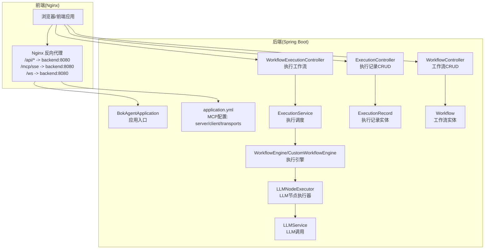
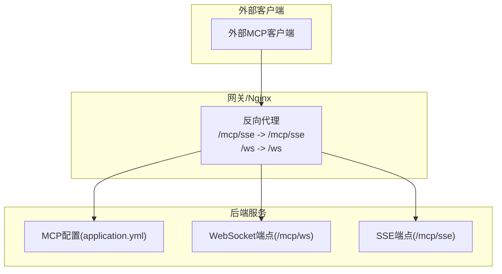
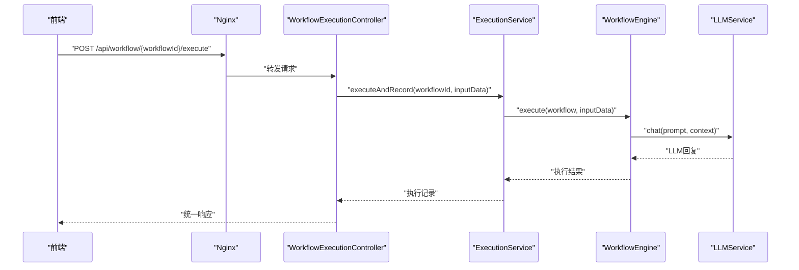
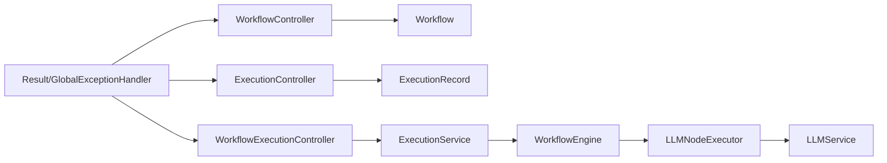

# MCP协议

<cite>
**本文引用的文件**
- [BokAgentApplication.java](file://backend/src/main/java/com/bokagent/BokAgentApplication.java)
- [application.yml](file://backend/src/main/resources/application.yml)
- [nginx.conf](file://docker/nginx.conf)
- [WorkflowController.java](file://backend/src/main/java/com/bokagent/controller/WorkflowController.java)
- [ExecutionController.java](file://backend/src/main/java/com/bokagent/controller/ExecutionController.java)
- [WorkflowExecutionController.java](file://backend/src/main/java/com/bokagent/controller/WorkflowExecutionController.java)
- [Result.java](file://backend/src/main/java/com/bokagent/common/Result.java)
- [GlobalExceptionHandler.java](file://backend/src/main/java/com/bokagent/common/GlobalExceptionHandler.java)
- [WorkflowEngine.java](file://backend/src/main/java/com/bokagent/engine/WorkflowEngine.java)
- [CustomWorkflowEngine.java](file://backend/src/main/java/com/bokagent/engine/CustomWorkflowEngine.java)
- [NodeExecutor.java](file://backend/src/main/java/com/bokagent/engine/NodeExecutor.java)
- [LLMNodeExecutor.java](file://backend/src/main/java/com/bokagent/engine/LLMNodeExecutor.java)
- [ExecutionRecord.java](file://backend/src/main/java/com/bokagent/entity/ExecutionRecord.java)
- [Workflow.java](file://backend/src/main/java/com/bokagent/entity/Workflow.java)
- [LLMService.java](file://backend/src/main/java/com/bokagent/service/LLMService.java)
</cite>

## 目录
1. [简介](#简介)
2. [项目结构](#项目结构)
3. [核心组件](#核心组件)
4. [架构总览](#架构总览)
5. [组件详解](#组件详解)
6. [依赖关系分析](#依赖关系分析)
7. [性能考量](#性能考量)
8. [故障排查指南](#故障排查指南)
9. [结论](#结论)
10. [附录](#附录)

## 简介
本文件面向开发者，系统性梳理BokAgent中MCP（Model Context Protocol）协议的实现与使用方法。结合现有配置与工程结构，文档从设计理念、双向通信、消息格式、会话管理、服务器与客户端集成、安全与扩展等方面展开，并提供基于仓库实际代码的架构图与流程图，帮助快速落地MCP能力。

## 项目结构
后端采用Spring Boot工程，MCP相关配置集中在应用配置文件中；前端通过Nginx反向代理转发至后端。工作流执行链路由REST API触发，经服务层与引擎层执行，最终返回统一响应。

图表来源
- [BokAgentApplication.java:1-56](file://backend/src/main/java/com/bokagent/BokAgentApplication.java#L1-L56)
- [application.yml:108-129](file://backend/src/main/resources/application.yml#L108-L129)
- [WorkflowController.java:1-92](file://backend/src/main/java/com/bokagent/controller/WorkflowController.java#L1-L92)
- [ExecutionController.java:1-81](file://backend/src/main/java/com/bokagent/controller/ExecutionController.java#L1-L81)
- [WorkflowExecutionController.java:1-46](file://backend/src/main/java/com/bokagent/controller/WorkflowExecutionController.java#L1-L46)
- [ExecutionRecord.java:1-40](file://backend/src/main/java/com/bokagent/entity/ExecutionRecord.java#L1-L40)
- [Workflow.java:1-31](file://backend/src/main/java/com/bokagent/entity/Workflow.java#L1-L31)
- [LLMService.java:1-67](file://backend/src/main/java/com/bokagent/service/LLMService.java#L1-L67)
- [LLMNodeExecutor.java:1-69](file://backend/src/main/java/com/bokagent/engine/LLMNodeExecutor.java#L1-L69)

章节来源
- [BokAgentApplication.java:1-56](file://backend/src/main/java/com/bokagent/BokAgentApplication.java#L1-L56)
- [application.yml:108-129](file://backend/src/main/resources/application.yml#L108-L129)
- [nginx.conf:1-55](file://docker/nginx.conf#L1-L55)

## 核心组件
- MCP服务器配置与传输通道
  - 服务器启用、名称、版本、能力声明（tools/resources/prompts）
  - 传输通道：SSE与WebSocket路径
- 统一响应与异常处理
  - 统一响应包装与全局异常捕获
- 工作流执行链路
  - 控制器接收请求，服务层创建执行记录并调度引擎
  - 引擎按拓扑顺序执行节点，LLM节点通过LLMService调用外部模型
- 前后端代理
  - Nginx对/api、/mcp/sse、/ws进行转发与缓冲控制

章节来源
- [application.yml:108-129](file://backend/src/main/resources/application.yml#L108-L129)
- [Result.java:1-42](file://backend/src/main/java/com/bokagent/common/Result.java#L1-L42)
- [GlobalExceptionHandler.java:1-37](file://backend/src/main/java/com/bokagent/common/GlobalExceptionHandler.java#L1-L37)
- [WorkflowExecutionController.java:1-46](file://backend/src/main/java/com/bokagent/controller/WorkflowExecutionController.java#L1-L46)
- [WorkflowEngine.java:47-150](file://backend/src/main/java/com/bokagent/engine/WorkflowEngine.java#L47-L150)
- [LLMNodeExecutor.java:1-69](file://backend/src/main/java/com/bokagent/engine/LLMNodeExecutor.java#L1-L69)
- [LLMService.java:1-67](file://backend/src/main/java/com/bokagent/service/LLMService.java#L1-L67)
- [nginx.conf:20-54](file://docker/nginx.conf#L20-L54)

## 架构总览
下图展示MCP在系统中的定位：作为可选的外部协议通道，与现有REST API并行存在；前端通过Nginx将MCP SSE与WebSocket请求转发至后端。

图表来源
- [application.yml:108-129](file://backend/src/main/resources/application.yml#L108-L129)
- [nginx.conf:45-54](file://docker/nginx.conf#L45-L54)

## 组件详解

### MCP服务器实现要点
- 服务器开关与能力声明
  - 在配置中启用MCP服务器，声明能力集合（tools/resources/prompts）
- 传输通道
  - SSE与WebSocket均提供独立路径，便于不同场景选择
- 与后端的集成边界
  - 当前工程未提供MCP专用的WebSocket/SSE处理器与消息路由实现，MCP服务器能力由配置驱动，具体协议处理需在后续阶段补充

章节来源
- [application.yml:108-129](file://backend/src/main/resources/application.yml#L108-L129)

### WebSocket连接与消息路由
- 连接建立
  - 客户端通过Nginx代理连接后端WebSocket端点
- 消息路由
  - 当前仓库未实现具体的WebSocket处理器与消息分发逻辑
- 状态同步
  - 未见与MCP协议直接关联的状态同步实现

章节来源
- [nginx.conf:36-43](file://docker/nginx.conf#L36-L43)
- [application.yml:122-124](file://backend/src/main/resources/application.yml#L122-L124)

### MCP客户端集成
- 连接建立
  - 通过配置的WebSocket与SSE路径进行连接
- 消息发送与事件监听
  - 未见客户端侧的连接、发送与监听实现
- 断线重连
  - 未见客户端侧的重连策略与退避机制

章节来源
- [application.yml:119-124](file://backend/src/main/resources/application.yml#L119-L124)
- [nginx.conf:45-54](file://docker/nginx.conf#L45-L54)

### 协议消息格式规范
- 请求/响应结构
  - 未在仓库中定义MCP消息结构与字段规范
- 错误码定义
  - 未见MCP专用错误码映射
- 扩展字段支持
  - 未见扩展字段的解析与透传逻辑

章节来源
- [application.yml:108-129](file://backend/src/main/resources/application.yml#L108-L129)

### 使用示例（基于现有工程）
- 服务器端（工作流执行）
  - 通过REST API触发工作流执行，服务层创建执行记录并调度引擎
  - 引擎按拓扑顺序执行节点，LLM节点调用LLMService
- 客户端（前端）
  - 通过Nginx代理访问后端API与MCP端点

图表来源
- [WorkflowExecutionController.java:24-44](file://backend/src/main/java/com/bokagent/controller/WorkflowExecutionController.java#L24-L44)
- [ExecutionService.java:43-80](file://backend/src/main/java/com/bokagent/service/ExecutionService.java#L43-L80)
- [WorkflowEngine.java:47-150](file://backend/src/main/java/com/bokagent/engine/WorkflowEngine.java#L47-L150)
- [LLMService.java:27-44](file://backend/src/main/java/com/bokagent/service/LLMService.java#L27-L44)

### 安全考虑
- 身份验证
  - 未见MCP协议的身份认证实现
- 消息签名
  - 未见消息签名与校验逻辑
- 传输加密
  - 建议在生产环境启用TLS终止于Nginx或反向代理层

章节来源
- [nginx.conf:1-55](file://docker/nginx.conf#L1-L55)

### 协议扩展机制
- 自定义消息类型
  - 未见MCP消息类型的扩展点
- 处理逻辑
  - 未见消息路由与处理扩展机制

章节来源
- [application.yml:108-129](file://backend/src/main/resources/application.yml#L108-L129)

## 依赖关系分析
- 控制器依赖服务层，服务层依赖引擎与实体
- 引擎依赖节点执行器接口与具体实现
- LLM节点执行器依赖LLM服务
- 统一响应与异常处理贯穿各层

图表来源
- [WorkflowController.java:1-92](file://backend/src/main/java/com/bokagent/controller/WorkflowController.java#L1-L92)
- [ExecutionController.java:1-81](file://backend/src/main/java/com/bokagent/controller/ExecutionController.java#L1-L81)
- [WorkflowExecutionController.java:1-46](file://backend/src/main/java/com/bokagent/controller/WorkflowExecutionController.java#L1-L46)
- [ExecutionRecord.java:1-40](file://backend/src/main/java/com/bokagent/entity/ExecutionRecord.java#L1-L40)
- [Workflow.java:1-31](file://backend/src/main/java/com/bokagent/entity/Workflow.java#L1-L31)
- [LLMNodeExecutor.java:1-69](file://backend/src/main/java/com/bokagent/engine/LLMNodeExecutor.java#L1-L69)
- [LLMService.java:1-67](file://backend/src/main/java/com/bokagent/service/LLMService.java#L1-L67)
- [Result.java:1-42](file://backend/src/main/java/com/bokagent/common/Result.java#L1-L42)
- [GlobalExceptionHandler.java:1-37](file://backend/src/main/java/com/bokagent/common/GlobalExceptionHandler.java#L1-L37)

## 性能考量
- 异步执行与进度推送
  - 当前为同步执行，建议对长耗时工作流引入异步执行、返回executionId并配合WebSocket推送进度
- 超时与重试
  - 工程已提供通用重试与各类超时配置，可用于MCP请求与工具执行等场景
- 缓存
  - 工程提供缓存配置，可用于MCP结果缓存与LLM响应缓存

章节来源
- [application.yml:130-147](file://backend/src/main/resources/application.yml#L130-L147)
- [application.yml:149-154](file://backend/src/main/resources/application.yml#L149-L154)

## 故障排查指南
- 统一响应与异常
  - 使用统一响应包装与全局异常处理器，便于前后端一致地处理错误
- 日志级别
  - 工程日志级别已配置，便于定位问题
- 前后端代理
  - 确认Nginx对/api、/mcp/sse、/ws的代理配置与缓冲关闭策略

章节来源
- [Result.java:1-42](file://backend/src/main/java/com/bokagent/common/Result.java#L1-L42)
- [GlobalExceptionHandler.java:1-37](file://backend/src/main/java/com/bokagent/common/GlobalExceptionHandler.java#L1-L37)
- [application.yml:156-182](file://backend/src/main/resources/application.yml#L156-L182)
- [nginx.conf:20-54](file://docker/nginx.conf#L20-L54)

## 结论
- 本仓库已具备MCP服务器的配置基础与前后端代理能力，但尚未实现具体的WebSocket/SSE处理器与消息路由逻辑
- 工作流执行链路完善，可作为MCP协议承载业务逻辑的参考实现
- 建议在下一阶段补充MCP协议的消息格式、路由与状态同步实现，并完善安全与扩展机制

## 附录
- MCP配置项说明
  - 服务器启用、名称、版本、能力集合
  - 传输通道：SSE与WebSocket路径
- 前端代理说明
  - 对/api、/mcp/sse、/ws的代理与缓冲策略

章节来源
- [application.yml:108-129](file://backend/src/main/resources/application.yml#L108-L129)
- [nginx.conf:20-54](file://docker/nginx.conf#L20-L54)