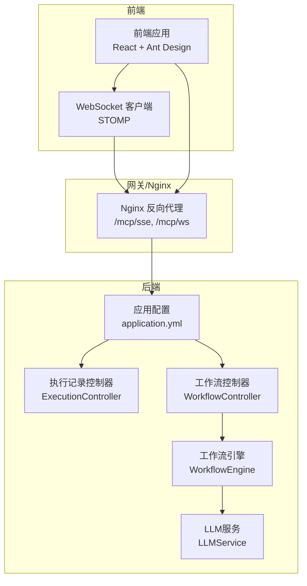
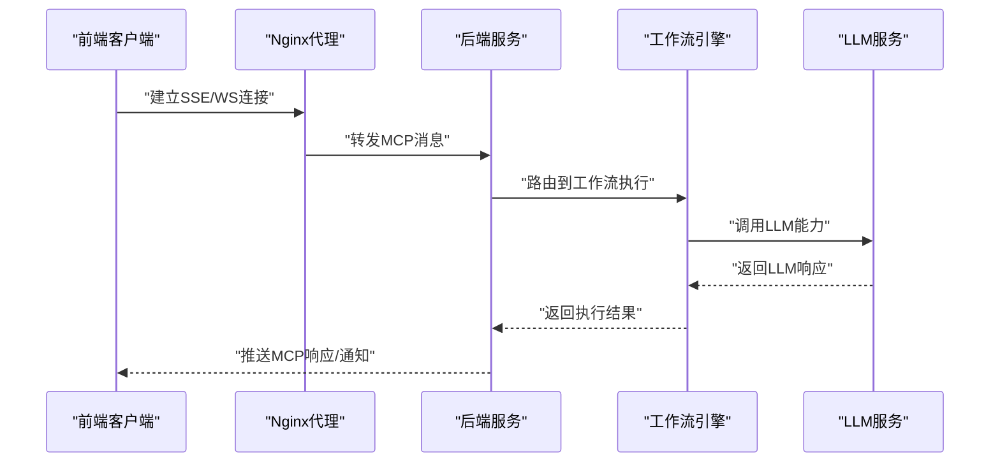
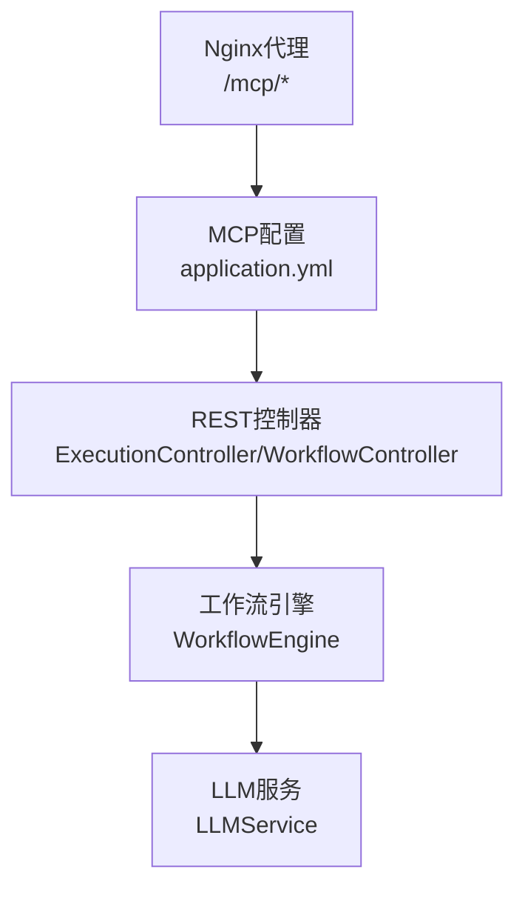

# MCP协议规范

<cite>
**本文引用的文件**
- [README.md](file://README.md)
- [application.yml](file://backend/src/main/resources/application.yml)
- [nginx.conf](file://docker/nginx.conf)
- [ExecutionController.java](file://backend/src/main/java/com/bokagent/controller/ExecutionController.java)
- [WorkflowController.java](file://backend/src/main/java/com/bokagent/controller/WorkflowController.java)
- [WorkflowEngine.java](file://backend/src/main/java/com/bokagent/engine/WorkflowEngine.java)
- [Workflow.java](file://backend/src/main/java/com/bokagent/entity/Workflow.java)
- [LLMService.java](file://backend/src/main/java/com/bokagent/service/LLMService.java)
- [PROJECT_STRUCTURE.md](file://docs/PROJECT_STRUCTURE.md)
</cite>

## 目录
1. [简介](#简介)
2. [项目结构](#项目结构)
3. [核心组件](#核心组件)
4. [架构总览](#架构总览)
5. [详细组件分析](#详细组件分析)
6. [依赖关系分析](#依赖关系分析)
7. [性能考虑](#性能考虑)
8. [故障排查指南](#故障排查指南)
9. [结论](#结论)
10. [附录](#附录)

## 简介
本文件面向开发者与集成者，系统化梳理并规范BokAgent中的MCP（Model Context Protocol）协议实现与使用方式。依据现有配置与规划，项目已明确启用双向MCP能力，并在配置中声明了tools、resources、prompts三类能力，同时支持SSE与WebSocket两种传输层。本文将从协议版本、消息格式、传输层支持、消息类型与结构、错误处理、扩展性、会话管理、能力声明、JSON Schema约束、以及实现参考等方面给出完整规范与实践指南。

## 项目结构
围绕MCP协议的关键位置与配置如下：
- 后端配置：在应用配置中集中声明MCP服务端能力与传输路径
- 前端与网关：通过Nginx代理将SSE与WebSocket端点暴露给前端
- 控制器与引擎：工作流执行与LLM调用作为MCP能力的具体承载
- 工程结构：模块划分清晰，便于扩展MCP Server/Client与自定义消息类型

图表来源
- [application.yml:116-137](file://backend/src/main/resources/application.yml#L116-L137)
- [nginx.conf:45-54](file://docker/nginx.conf#L45-L54)
- [ExecutionController.java:1-81](file://backend/src/main/java/com/bokagent/controller/ExecutionController.java#L1-L81)
- [WorkflowController.java:1-92](file://backend/src/main/java/com/bokagent/controller/WorkflowController.java#L1-L92)
- [WorkflowEngine.java:1-171](file://backend/src/main/java/com/bokagent/engine/WorkflowEngine.java#L1-L171)
- [LLMService.java:42-66](file://backend/src/main/java/com/bokagent/service/LLMService.java#L42-L66)

章节来源
- [README.md:1-106](file://README.md#L1-L106)
- [PROJECT_STRUCTURE.md:1-256](file://docs/PROJECT_STRUCTURE.md#L1-L256)

## 核心组件
- MCP服务端配置：声明名称、版本、能力开关与传输端点
- 传输层支持：SSE与WebSocket路径已在配置与Nginx中体现
- 能力声明：tools、resources、prompts三类能力在配置中开启
- 超时与重试：为MCP请求设置专用超时阈值，保障稳定性
- 控制器与引擎：工作流执行与LLM调用作为典型MCP能力载体

章节来源
- [application.yml:116-155](file://backend/src/main/resources/application.yml#L116-L155)
- [nginx.conf:45-54](file://docker/nginx.conf#L45-L54)

## 架构总览
下图展示MCP在系统中的位置与交互关系：前端通过WebSocket或SSE与后端通信；后端根据MCP消息路由到相应能力实现（如工具、资源、提示词），并通过工作流引擎与LLM服务完成具体执行。

图表来源
- [application.yml:116-137](file://backend/src/main/resources/application.yml#L116-L137)
- [nginx.conf:45-54](file://docker/nginx.conf#L45-L54)
- [WorkflowEngine.java:47-82](file://backend/src/main/java/com/bokagent/engine/WorkflowEngine.java#L47-L82)
- [LLMService.java:42-66](file://backend/src/main/java/com/bokagent/service/LLMService.java#L42-L66)

## 详细组件分析

### MCP协议版本与能力声明
- 版本：服务端版本号在配置中声明
- 能力：tools、resources、prompts均开启
- 传输：SSE与WebSocket均已启用并配置路径

章节来源
- [application.yml:118-132](file://backend/src/main/resources/application.yml#L118-L132)

### 传输层支持与端点
- SSE端点：/mcp/sse
- WebSocket端点：/mcp/ws
- Nginx代理：对SSE关闭缓冲、透传Accept-Charset，对WebSocket升级头部透传

章节来源
- [application.yml:126-132](file://backend/src/main/resources/application.yml#L126-L132)
- [nginx.conf:45-54](file://docker/nginx.conf#L45-L54)

### 消息类型与结构（规范草案）
以下为MCP消息类型的通用结构规范（基于配置与典型实现抽象）。实际实现需遵循具体消息定义与版本约定。

- 请求消息（Request）
  - 字段：方法名、参数对象、请求ID
  - 作用：发起一次MCP调用
- 响应消息（Response）
  - 字段：结果对象、错误对象、请求ID
  - 作用：返回调用结果或错误
- 通知消息（Notification）
  - 字段：主题、内容、时间戳
  - 作用：单向推送状态变更或事件
- 错误消息（Error）
  - 字段：错误码、错误描述、附加信息
  - 作用：标准化错误返回

消息格式要点
- 编码：UTF-8
- 内容类型：JSON
- 字段约束：必填字段需显式校验；可选字段保持向后兼容
- 时间戳：统一使用ISO 8601格式

（本节为规范性说明，不直接对应具体代码片段）

### 错误处理机制
- 统一错误包装：控制器层返回统一的结果封装
- 超时控制：为MCP请求设置独立超时阈值
- 重试策略：针对可重试异常配置指数退避
- 日志记录：关键流程与异常均记录日志

章节来源
- [application.yml:138-147](file://backend/src/main/resources/application.yml#L138-L147)
- [ExecutionController.java:25-46](file://backend/src/main/java/com/bokagent/controller/ExecutionController.java#L25-L46)
- [WorkflowController.java:35-46](file://backend/src/main/java/com/bokagent/controller/WorkflowController.java#L35-L46)

### 会话管理与状态同步
- 连接建立：SSE/WS握手由Nginx与后端共同完成
- 心跳检测：建议在客户端侧定期发送ping消息并在服务端设置读超时
- 状态同步：通过通知消息推送执行进度与最终结果
- 断线重连：客户端实现指数退避重连策略

（本节为概念性说明，不直接对应具体代码片段）

### 扩展性设计
- 自定义消息类型：通过在配置中声明新能力并扩展后端路由实现
- 兼容性保证：保留旧字段、新增字段向后兼容；版本号用于协商能力
- 插件与工具：结合项目规划的插件与工具SDK，可作为MCP能力的扩展载体

章节来源
- [README.md:8-14](file://README.md#L8-L14)
- [PROJECT_STRUCTURE.md:208-237](file://docs/PROJECT_STRUCTURE.md#L208-L237)

### 能力声明与承载
- tools：工具注册与调用
- resources：资源访问与管理
- prompts：提示词模板与注入
- 承载实现：工作流引擎与LLM服务作为典型能力载体

章节来源
- [application.yml:122-125](file://backend/src/main/resources/application.yml#L122-L125)
- [WorkflowEngine.java:47-82](file://backend/src/main/java/com/bokagent/engine/WorkflowEngine.java#L47-L82)
- [LLMService.java:42-66](file://backend/src/main/java/com/bokagent/service/LLMService.java#L42-L66)

### JSON Schema定义与字段约束（示例规范）
以下为典型字段的Schema约束示例（非强制要求，仅作为实现参考）：

- 请求ID（字符串，必填，唯一标识一次请求）
- 方法名（字符串，必填，枚举值：如“tools/list”、“resources/read”、“prompts/get”）
- 参数对象（对象，可选，按方法语义定义）
- 结果对象（对象，可选，按方法语义定义）
- 错误对象（对象，可选，包含错误码与描述）
- 通知主题（字符串，必填）
- 通知内容（对象，可选）
- 时间戳（字符串，ISO 8601格式）

（本节为规范性说明，不直接对应具体代码片段）

## 依赖关系分析
MCP协议在系统中的依赖关系如下：

图表来源
- [application.yml:116-137](file://backend/src/main/resources/application.yml#L116-L137)
- [nginx.conf:45-54](file://docker/nginx.conf#L45-L54)
- [ExecutionController.java:1-81](file://backend/src/main/java/com/bokagent/controller/ExecutionController.java#L1-L81)
- [WorkflowController.java:1-92](file://backend/src/main/java/com/bokagent/controller/WorkflowController.java#L1-L92)
- [WorkflowEngine.java:1-171](file://backend/src/main/java/com/bokagent/engine/WorkflowEngine.java#L1-L171)
- [LLMService.java:42-66](file://backend/src/main/java/com/bokagent/service/LLMService.java#L42-L66)

章节来源
- [application.yml:116-155](file://backend/src/main/resources/application.yml#L116-L155)
- [nginx.conf:45-54](file://docker/nginx.conf#L45-L54)

## 性能考虑
- 超时与重试：为MCP请求设置合理超时与重试策略，避免阻塞
- 并发与异步：长耗时操作采用异步执行与进度通知
- 缓存：对热点结果进行缓存，降低重复计算
- 传输优化：SSE关闭缓冲，WebSocket保持低延迟

章节来源
- [application.yml:138-162](file://backend/src/main/resources/application.yml#L138-L162)
- [nginx.conf:45-54](file://docker/nginx.conf#L45-L54)

## 故障排查指南
- 端点不可达：确认Nginx代理路径与后端端口映射
- 编码问题：确保请求头包含UTF-8编码声明
- 超时异常：检查MCP请求超时阈值与网络状况
- 控制器错误：查看控制器返回的统一结果封装与日志

章节来源
- [nginx.conf:20-54](file://docker/nginx.conf#L20-L54)
- [ExecutionController.java:25-46](file://backend/src/main/java/com/bokagent/controller/ExecutionController.java#L25-L46)
- [WorkflowController.java:35-46](file://backend/src/main/java/com/bokagent/controller/WorkflowController.java#L35-L46)
- [application.yml:149-155](file://backend/src/main/resources/application.yml#L149-L155)

## 结论
本规范基于现有配置与工程结构，给出了MCP协议在BokAgent中的版本、能力、传输层、消息类型与结构、错误处理、扩展性、会话管理、能力声明与JSON Schema约束等方面的系统化说明。建议在实现过程中严格遵循统一的编码与消息格式，确保前后端与第三方客户端的兼容性与稳定性。

## 附录
- 术语
  - MCP：Model Context Protocol
  - SSE：Server-Sent Events
  - WS：WebSocket
- 参考实现位置
  - MCP配置：application.yml
  - 传输端点：Nginx代理
  - 能力承载：工作流引擎与LLM服务
  - 控制器：执行记录与工作流控制器

章节来源
- [application.yml:116-155](file://backend/src/main/resources/application.yml#L116-L155)
- [nginx.conf:45-54](file://docker/nginx.conf#L45-L54)
- [WorkflowEngine.java:47-82](file://backend/src/main/java/com/bokagent/engine/WorkflowEngine.java#L47-L82)
- [LLMService.java:42-66](file://backend/src/main/java/com/bokagent/service/LLMService.java#L42-L66)
- [ExecutionController.java:25-46](file://backend/src/main/java/com/bokagent/controller/ExecutionController.java#L25-L46)
- [WorkflowController.java:35-46](file://backend/src/main/java/com/bokagent/controller/WorkflowController.java#L35-L46)