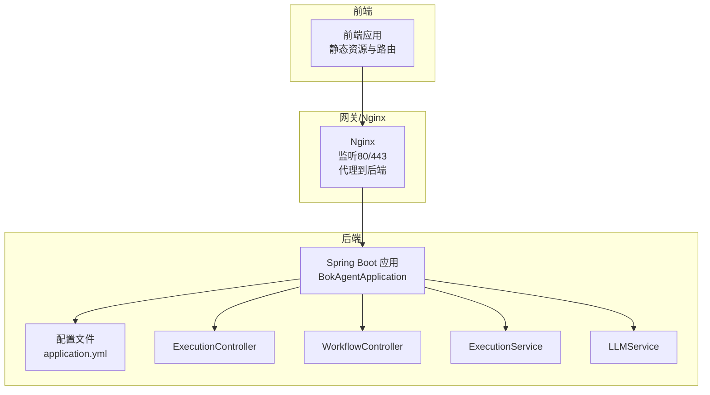
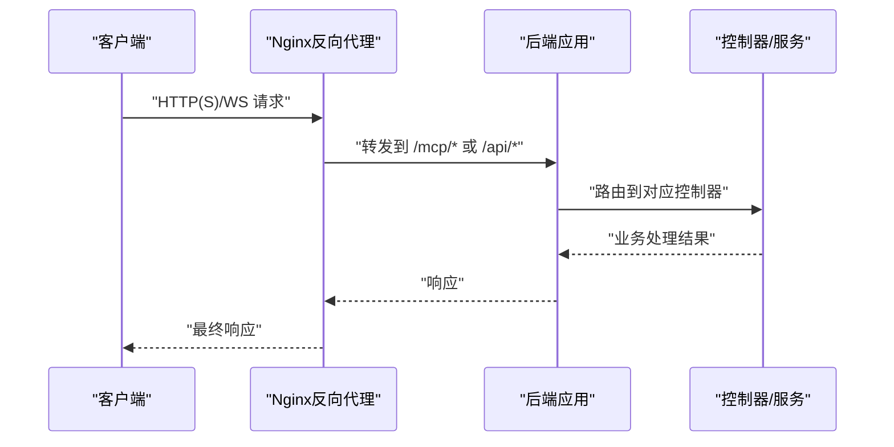
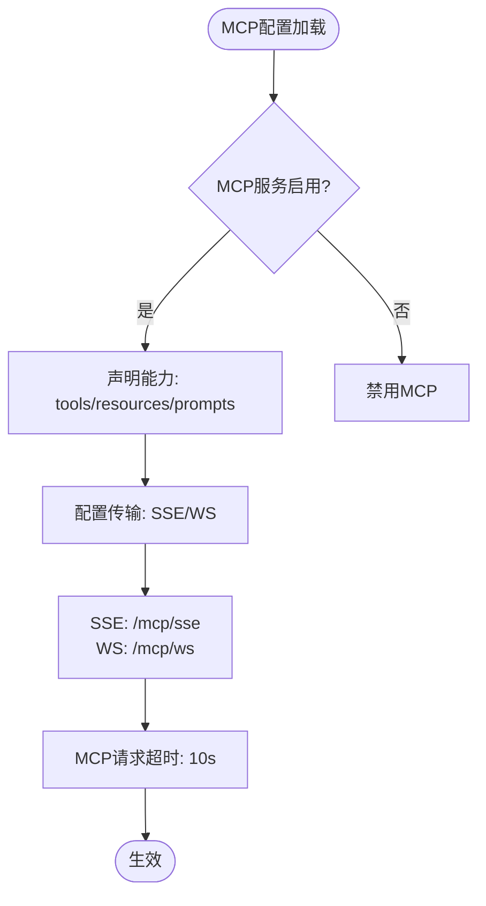
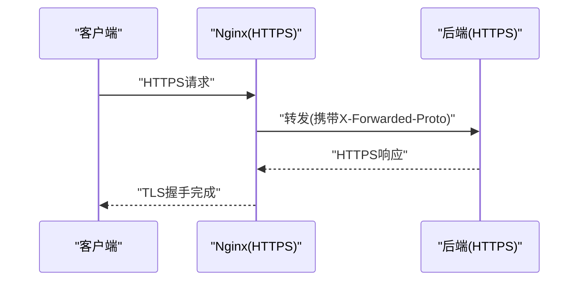
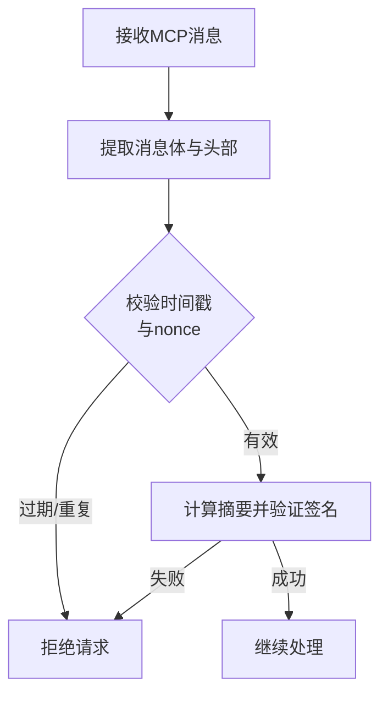
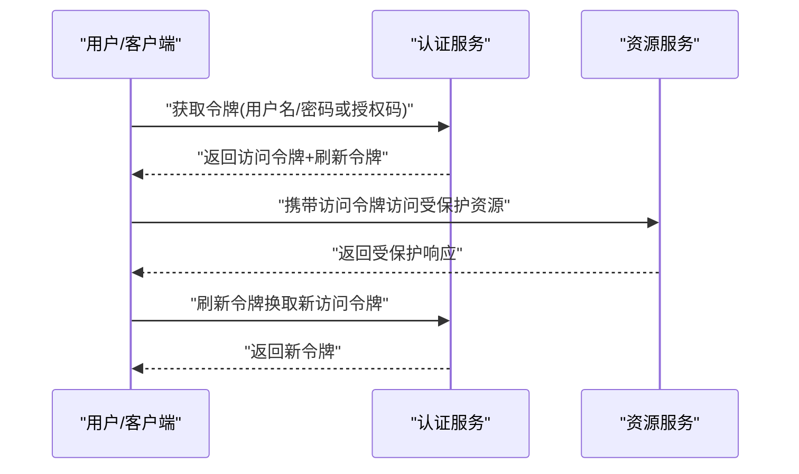
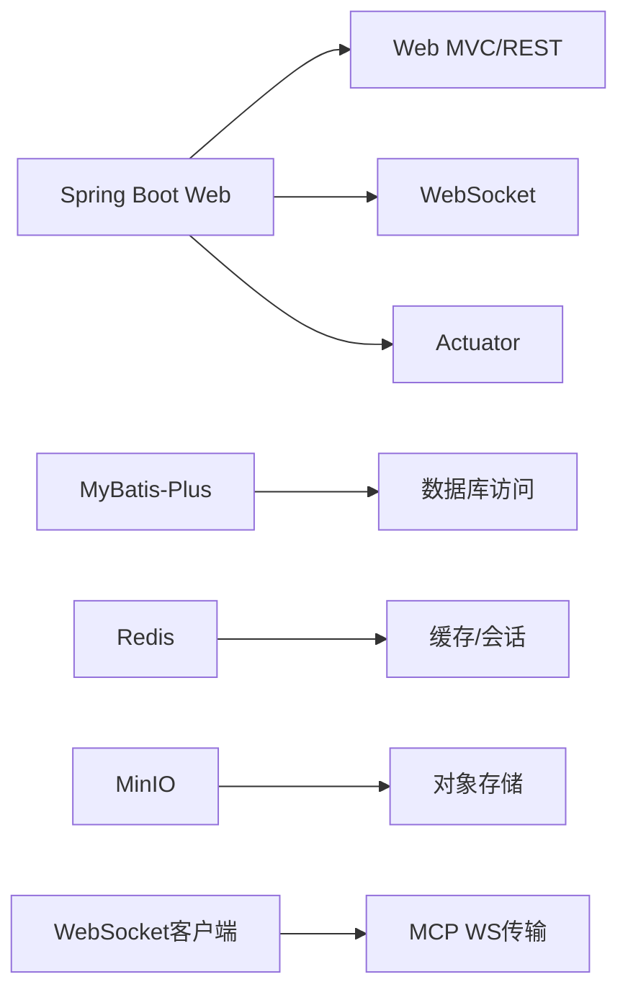

# MCP安全认证

<cite>
**本文引用的文件**
- [BokAgentApplication.java](file://backend/src/main/java/com/bokagent/BokAgentApplication.java)
- [application.yml](file://backend/src/main/resources/application.yml)
- [GlobalExceptionHandler.java](file://backend/src/main/java/com/bokagent/common/GlobalExceptionHandler.java)
- [Result.java](file://backend/src/main/java/com/bokagent/common/Result.java)
- [ExecutionController.java](file://backend/src/main/java/com/bokagent/controller/ExecutionController.java)
- [WorkflowController.java](file://backend/src/main/java/com/bokagent/controller/WorkflowController.java)
- [ExecutionService.java](file://backend/src/main/java/com/bokagent/service/ExecutionService.java)
- [LLMService.java](file://backend/src/main/java/com/bokagent/service/LLMService.java)
- [pom.xml](file://backend/pom.xml)
- [nginx.conf](file://docker/nginx.conf)
- [start.sh](file://start.sh)
- [start.ps1](file://start.ps1)
</cite>

## 目录
1. [简介](#简介)
2. [项目结构](#项目结构)
3. [核心组件](#核心组件)
4. [架构总览](#架构总览)
5. [详细组件分析](#详细组件分析)
6. [依赖分析](#依赖分析)
7. [性能考虑](#性能考虑)
8. [故障排查指南](#故障排查指南)
9. [结论](#结论)
10. [附录](#附录)

## 简介
本文件面向MCP协议在本项目中的安全认证与传输安全实现，结合现有配置与依赖，系统性阐述以下主题：
- 身份验证与访问控制：当前未实现专用认证模块，建议基于Spring Security引入JWT/OAuth2。
- 消息完整性与防重放：建议在MCP消息层引入nonce与时间戳校验，以及基于对称/非对称签名。
- 传输加密：建议启用HTTPS/TLS，结合Nginx与后端SSL配置。
- 认证流程设计：握手、令牌发放与刷新、权限验证与审计。
- 安全配置示例：JWT、OAuth2、API密钥管理。
- 威胁防护：中间人攻击、消息篡改、身份伪造。
- 安全审计与监控：日志策略、指标采集与告警。

注意：当前仓库未包含MCP协议的具体实现代码，本文在不虚构代码的前提下，基于现有配置与依赖给出可落地的安全实现方案与最佳实践。

## 项目结构
后端采用Spring Boot，MCP协议相关配置位于application.yml中；Nginx作为反向代理，负责静态资源、API与MCP端点转发；启动脚本用于初始化环境与数据库校验。

图表来源
- [application.yml:1-190](file://backend/src/main/resources/application.yml#L1-L190)
- [BokAgentApplication.java:1-56](file://backend/src/main/java/com/bokagent/BokAgentApplication.java#L1-L56)
- [ExecutionController.java:1-81](file://backend/src/main/java/com/bokagent/controller/ExecutionController.java#L1-L81)
- [WorkflowController.java:1-92](file://backend/src/main/java/com/bokagent/controller/WorkflowController.java#L1-L92)
- [ExecutionService.java:1-113](file://backend/src/main/java/com/bokagent/service/ExecutionService.java#L1-L113)
- [LLMService.java:1-67](file://backend/src/main/java/com/bokagent/service/LLMService.java#L1-L67)
- [nginx.conf:1-55](file://docker/nginx.conf#L1-L55)

章节来源
- [BokAgentApplication.java:1-56](file://backend/src/main/java/com/bokagent/BokAgentApplication.java#L1-L56)
- [application.yml:1-190](file://backend/src/main/resources/application.yml#L1-L190)
- [nginx.conf:1-55](file://docker/nginx.conf#L1-L55)

## 核心组件
- 应用入口与编码保障：应用启动时强制UTF-8编码，避免字符集问题导致的消息解析异常。
- 统一响应与异常处理：Result封装统一返回格式，全局异常处理器集中处理各类异常。
- 控制器层：提供工作流与执行记录的REST接口，跨域开放便于前端调试。
- 服务层：执行服务负责工作流执行与记录写入；LLM服务集成Spring AI进行对话调用。
- 配置中心：application.yml集中管理MCP协议开关、端点路径、超时与缓存等。

章节来源
- [BokAgentApplication.java:21-54](file://backend/src/main/java/com/bokagent/BokAgentApplication.java#L21-L54)
- [Result.java:1-42](file://backend/src/main/java/com/bokagent/common/Result.java#L1-L42)
- [GlobalExceptionHandler.java:1-37](file://backend/src/main/java/com/bokagent/common/GlobalExceptionHandler.java#L1-L37)
- [ExecutionController.java:1-81](file://backend/src/main/java/com/bokagent/controller/ExecutionController.java#L1-L81)
- [WorkflowController.java:1-92](file://backend/src/main/java/com/bokagent/controller/WorkflowController.java#L1-L92)
- [ExecutionService.java:1-113](file://backend/src/main/java/com/bokagent/service/ExecutionService.java#L1-L113)
- [LLMService.java:1-67](file://backend/src/main/java/com/bokagent/service/LLMService.java#L1-L67)
- [application.yml:116-137](file://backend/src/main/resources/application.yml#L116-L137)

## 架构总览
下图展示MCP协议在本项目中的部署位置与交互关系。当前MCP端点由Nginx代理至后端，后端通过WebSocket与SSE提供实时能力。

图表来源
- [nginx.conf:20-54](file://docker/nginx.conf#L20-L54)
- [application.yml:116-137](file://backend/src/main/resources/application.yml#L116-L137)

## 详细组件分析

### MCP协议配置与端点
- 开关与能力：MCP服务启用，声明tools/resources/prompts能力。
- 传输方式：SSE与WebSocket均启用，分别指向/mcp/sse与/mcp/ws。
- 超时：MCP请求超时10秒，需结合客户端实现重试与心跳。

图表来源
- [application.yml:116-137](file://backend/src/main/resources/application.yml#L116-L137)
- [application.yml:149-155](file://backend/src/main/resources/application.yml#L149-L155)

章节来源
- [application.yml:116-137](file://backend/src/main/resources/application.yml#L116-L137)
- [application.yml:149-155](file://backend/src/main/resources/application.yml#L149-L155)

### 传输层安全（TLS/HTTPS）
- Nginx代理：已配置HTTP到后端的代理，建议在生产环境启用HTTPS与证书。
- SSL/TLS建议：使用强密码套件与现代TLS版本；证书由可信CA签发；启用HSTS与OCSP Stapling。
- 代理头：确保X-Forwarded-Proto等头部正确传递，以便后端识别原始协议。

图表来源
- [nginx.conf:20-34](file://docker/nginx.conf#L20-L34)

章节来源
- [nginx.conf:20-34](file://docker/nginx.conf#L20-L34)

### 身份验证与访问控制
- 当前现状：未发现专用认证模块或拦截器，建议引入Spring Security。
- JWT方案：后端签发JWT，前端在Authorization头中携带；后端通过过滤器校验签名与有效期。
- OAuth2方案：对接外部OIDC提供商，使用授权码模式；后端配置受信任的issuer与公钥。
- API密钥：为特定端点提供一次性API密钥，结合IP白名单与速率限制。

章节来源
- [pom.xml:30-49](file://backend/pom.xml#L30-L49)

### 消息完整性与防重放
- 数字签名：对MCP消息体进行哈希，使用私钥签名；接收方用公钥验证。
- 防重放：为每条消息附加nonce与时间戳，服务端维护短期窗口去重。
- 消息摘要：SHA-256或更高强度；签名算法推荐RSA-SHA256或EdDSA。

（本图为概念流程，无需图表来源）

### 认证流程设计
- 握手：客户端发起认证请求，后端颁发短期令牌；后续请求必须携带令牌。
- 令牌管理：短有效期+刷新令牌；刷新令牌存储在安全介质中。
- 权限验证：基于角色/作用域的细粒度授权；对敏感工具与资源访问进行鉴权。

（本图为概念流程，无需图表来源）

### 安全配置示例
- JWT：后端配置密钥与算法；设置过期时间；在过滤器中校验。
- OAuth2：配置issuer、jwkSetUri与client信息；启用PKCE。
- API密钥：为每个客户端分配唯一密钥；记录使用轨迹与限额。

章节来源
- [application.yml:45-67](file://backend/src/main/resources/application.yml#L45-L67)

### 安全威胁防护
- 中间人攻击：强制HTTPS/TLS；校验证书链；启用HSTS。
- 消息篡改：启用数字签名与摘要校验；对关键字段进行完整性保护。
- 身份伪造：严格令牌校验；对refresh_token进行安全存储与轮换。

章节来源
- [nginx.conf:20-34](file://docker/nginx.conf#L20-L34)

### 安全审计与监控
- 日志：统一输出格式与级别；记录认证事件、访问尝试与异常。
- 指标：收集认证成功率、失败原因分布、请求延迟。
- 告警：对异常登录、频繁失败、高延迟等触发告警。

章节来源
- [application.yml:164-190](file://backend/src/main/resources/application.yml#L164-L190)

## 依赖分析
后端使用Spring Web/WebSocket、Actuator、Redis、MyBatis-Plus、MinIO等依赖；MCP相关传输依赖WebSocket客户端。

图表来源
- [pom.xml:30-125](file://backend/pom.xml#L30-L125)

章节来源
- [pom.xml:30-125](file://backend/pom.xml#L30-L125)

## 性能考虑
- 连接池与超时：合理设置数据库连接池与MCP请求超时，避免阻塞。
- 缓存：利用Redis缓存热点数据，降低后端压力。
- 代理缓冲：Nginx关闭SSE缓冲，保证实时性；WS升级保持长连接。

章节来源
- [application.yml:22-43](file://backend/src/main/resources/application.yml#L22-L43)
- [application.yml:149-155](file://backend/src/main/resources/application.yml#L149-L155)
- [nginx.conf:45-54](file://docker/nginx.conf#L45-L54)

## 故障排查指南
- 编码问题：应用启动时记录编码信息；如出现乱码，检查系统与容器编码。
- 异常处理：全局异常处理器统一返回错误；关注参数错误与运行时异常。
- 端口与代理：确认Nginx端口映射与后端端口一致；检查代理头配置。
- 启动验证：启动脚本会等待服务并检查数据库编码；若失败，查看容器日志。

章节来源
- [BokAgentApplication.java:45-54](file://backend/src/main/java/com/bokagent/BokAgentApplication.java#L45-L54)
- [GlobalExceptionHandler.java:16-35](file://backend/src/main/java/com/bokagent/common/GlobalExceptionHandler.java#L16-L35)
- [start.sh:17-38](file://start.sh#L17-L38)
- [start.ps1:15-35](file://start.ps1#L15-L35)

## 结论
本项目已具备MCP协议的基础配置与传输通道（SSE/WS），但尚未实现认证、签名与传输加密等安全机制。建议按以下优先级落地：
1) 引入Spring Security与JWT/OAuth2，完善身份验证与授权；
2) 在MCP消息层加入签名与防重放机制；
3) 强化传输安全，启用HTTPS/TLS与证书校验；
4) 建立完善的日志与监控体系，覆盖安全事件审计。

## 附录
- 开发者指南：在控制器与服务层增加安全注解与拦截器；对敏感操作进行审计记录。
- 最佳实践：最小权限原则、零信任网络、定期轮换密钥与证书、多因子认证。