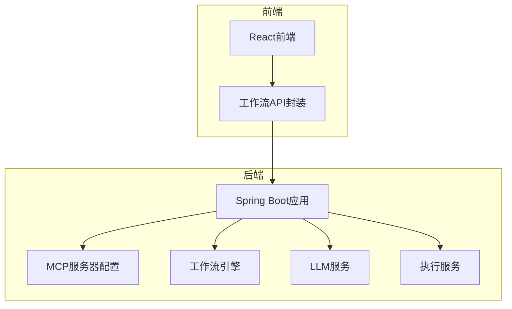
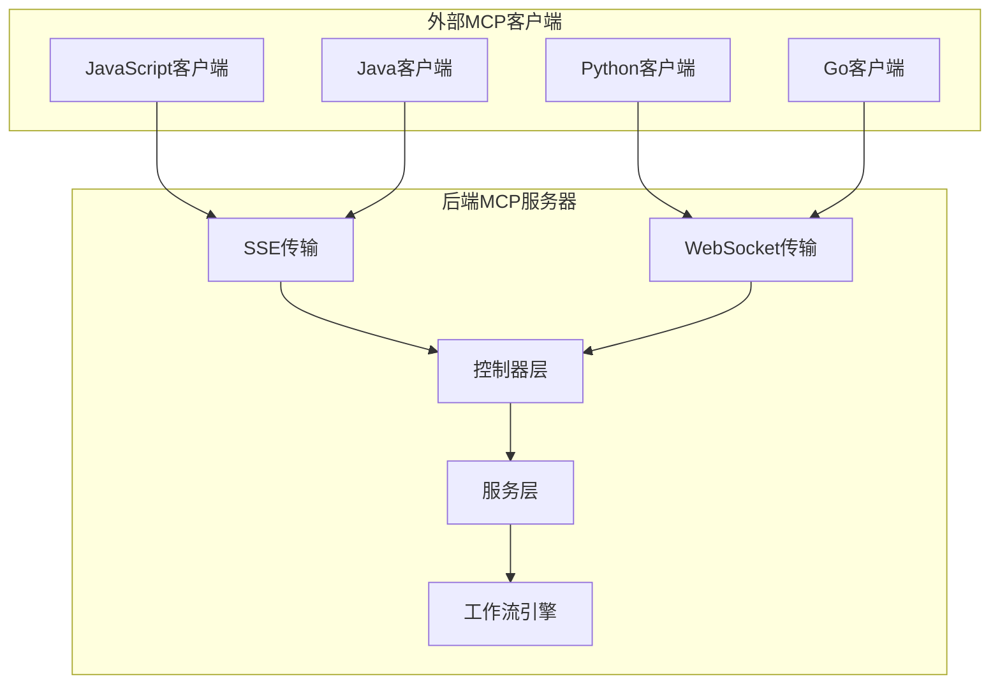
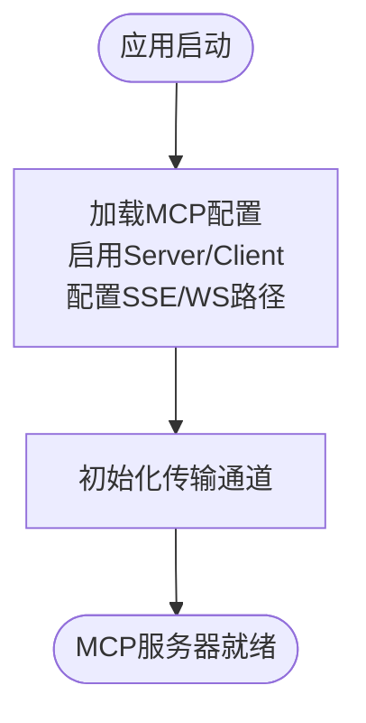
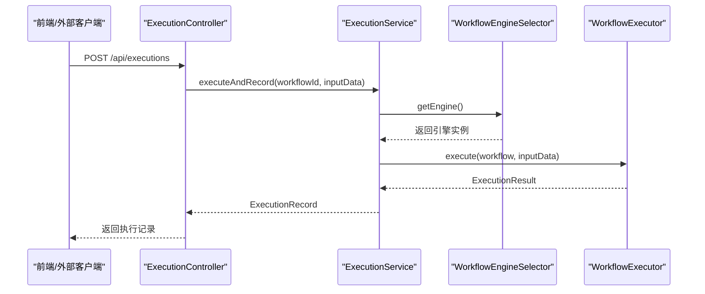
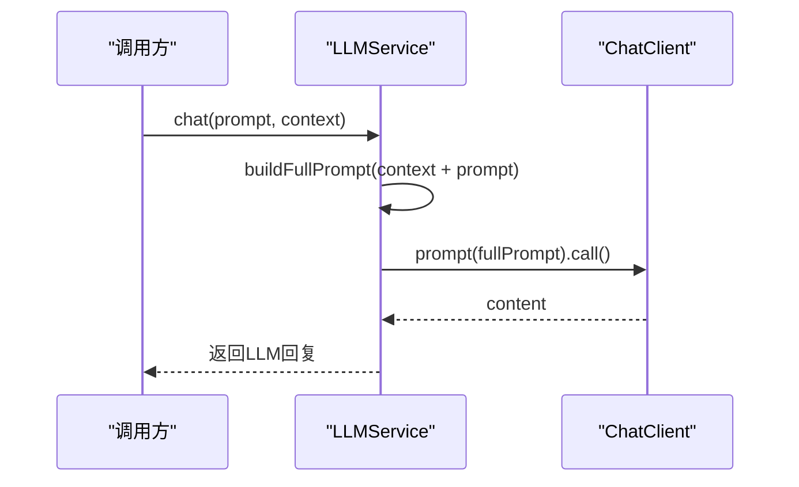
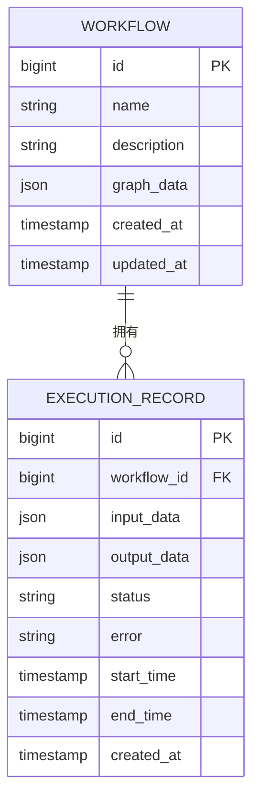
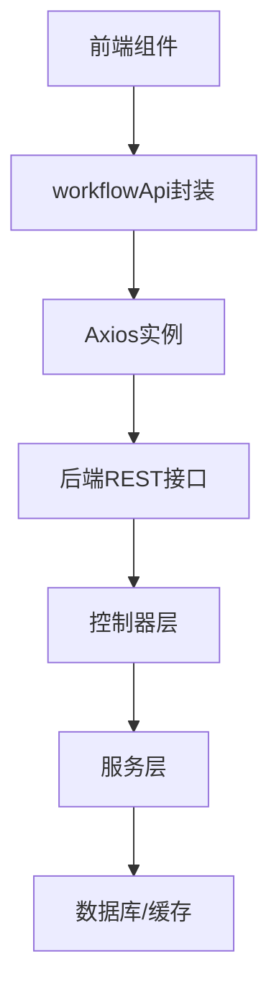
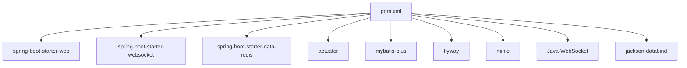

# MCP客户端多语言支持

<cite>
**本文档引用的文件**
- [README.md](file://README.md)
- [QUICKSTART.md](file://QUICKSTART.md)
- [backend/src/main/resources/application.yml](file://backend/src/main/resources/application.yml)
- [backend/src/main/java/com/bokagent/BokAgentApplication.java](file://backend/src/main/java/com/bokagent/BokAgentApplication.java)
- [backend/src/main/java/com/bokagent/controller/ExecutionController.java](file://backend/src/main/java/com/bokagent/controller/ExecutionController.java)
- [backend/src/main/java/com/bokagent/controller/WorkflowController.java](file://backend/src/main/java/com/bokagent/controller/WorkflowController.java)
- [backend/src/main/java/com/bokagent/service/ExecutionService.java](file://backend/src/main/java/com/bokagent/service/ExecutionService.java)
- [backend/src/main/java/com/bokagent/service/LLMService.java](file://backend/src/main/java/com/bokagent/service/LLMService.java)
- [backend/src/main/java/com/bokagent/engine/WorkflowEngine.java](file://backend/src/main/java/com/bokagent/engine/WorkflowEngine.java)
- [backend/src/main/java/com/bokagent/engine/WorkflowEngineSelector.java](file://backend/src/main/java/com/bokagent/engine/WorkflowEngineSelector.java)
- [backend/src/main/java/com/bokagent/entity/ExecutionRecord.java](file://backend/src/main/java/com/bokagent/entity/ExecutionRecord.java)
- [backend/src/main/java/com/bokagent/entity/Workflow.java](file://backend/src/main/java/com/bokagent/entity/Workflow.java)
- [backend/pom.xml](file://backend/pom.xml)
- [frontend/src/services/workflowApi.ts](file://frontend/src/services/workflowApi.ts)
</cite>

## 目录
1. [简介](#简介)
2. [项目结构](#项目结构)
3. [核心组件](#核心组件)
4. [架构总览](#架构总览)
5. [详细组件分析](#详细组件分析)
6. [依赖关系分析](#依赖关系分析)
7. [性能考虑](#性能考虑)
8. [故障排除指南](#故障排除指南)
9. [结论](#结论)
10. [附录](#附录)

## 简介
本项目是一个基于React与Spring Boot的企业级AI Agent可视化工作流编排系统，支持多LLM厂商集成、工具注册系统、插件生态、双向MCP协议（Server + Client）、TTS音频合成以及企业级特性（重试、超时、缓存、异步执行）。本文档聚焦于MCP客户端的多语言支持，解释不同编程语言的客户端实现思路、SDK使用方法、跨语言通信协议、语言特定优化策略，并提供完整的多语言集成示例与最佳实践。

## 项目结构
项目采用前后端分离架构，后端使用Spring Boot 3.5 + Java 21，前端使用React 18 + TypeScript。MCP协议配置位于后端配置文件中，支持SSE与WebSocket两种传输方式。

图表来源
- [backend/src/main/resources/application.yml:116-137](file://backend/src/main/resources/application.yml#L116-L137)
- [frontend/src/services/workflowApi.ts:1-44](file://frontend/src/services/workflowApi.ts#L1-44)

章节来源
- [README.md:1-106](file://README.md#L1-L106)
- [backend/src/main/resources/application.yml:1-190](file://backend/src/main/resources/application.yml#L1-L190)

## 核心组件
- MCP服务器配置：启用MCP Server与Client，支持SSE与WebSocket传输路径。
- 工作流引擎：负责解析与执行工作流，支持自定义引擎与LangGraph4J引擎切换。
- LLM服务：基于Spring AI的ChatClient封装，提供多LLM厂商调用能力。
- 执行服务：管理工作流执行与记录，统一处理执行状态、错误与时间统计。
- 前端API封装：基于Axios的REST API封装，便于前端调用后端接口。

章节来源
- [backend/src/main/resources/application.yml:116-155](file://backend/src/main/resources/application.yml#L116-L155)
- [backend/src/main/java/com/bokagent/engine/WorkflowEngineSelector.java:1-53](file://backend/src/main/java/com/bokagent/engine/WorkflowEngineSelector.java#L1-L53)
- [backend/src/main/java/com/bokagent/service/LLMService.java:1-67](file://backend/src/main/java/com/bokagent/service/LLMService.java#L1-L67)
- [backend/src/main/java/com/bokagent/service/ExecutionService.java:1-113](file://backend/src/main/java/com/bokagent/service/ExecutionService.java#L1-L113)
- [frontend/src/services/workflowApi.ts:1-44](file://frontend/src/services/workflowApi.ts#L1-44)

## 架构总览
MCP客户端多语言支持的核心在于通过标准化的消息格式与数据类型映射，结合SSE/WS传输通道，实现跨语言的稳定通信。后端提供统一的MCP配置与接口，前端通过REST API与后端交互，后端内部通过工作流引擎与LLM服务完成业务逻辑。

图表来源
- [backend/src/main/resources/application.yml:116-137](file://backend/src/main/resources/application.yml#L116-L137)
- [backend/src/main/java/com/bokagent/controller/ExecutionController.java:1-81](file://backend/src/main/java/com/bokagent/controller/ExecutionController.java#L1-L81)
- [backend/src/main/java/com/bokagent/controller/WorkflowController.java:1-92](file://backend/src/main/java/com/bokagent/controller/WorkflowController.java#L1-L92)
- [backend/src/main/java/com/bokagent/service/ExecutionService.java:1-113](file://backend/src/main/java/com/bokagent/service/ExecutionService.java#L1-L113)

## 详细组件分析

### MCP服务器配置与传输通道
- 启用MCP Server与Client，声明能力（tools、resources、prompts），并配置SSE与WebSocket路径。
- 超时与重试策略：MCP请求超时、工具执行超时、LLM调用超时等。
- 缓存策略：默认缓存与工具/LLM结果缓存。

图表来源
- [backend/src/main/resources/application.yml:116-155](file://backend/src/main/resources/application.yml#L116-L155)

章节来源
- [backend/src/main/resources/application.yml:116-155](file://backend/src/main/resources/application.yml#L116-L155)

### 工作流执行流程（后端）
- 执行服务创建执行记录，调用工作流引擎执行，根据结果更新执行记录状态与错误信息。
- 工作流引擎解析图结构，按拓扑顺序执行节点，支持上下文传递与输出合并。

图表来源
- [backend/src/main/java/com/bokagent/controller/ExecutionController.java:52-79](file://backend/src/main/java/com/bokagent/controller/ExecutionController.java#L52-L79)
- [backend/src/main/java/com/bokagent/service/ExecutionService.java:39-92](file://backend/src/main/java/com/bokagent/service/ExecutionService.java#L39-L92)
- [backend/src/main/java/com/bokagent/engine/WorkflowEngineSelector.java:32-43](file://backend/src/main/java/com/bokagent/engine/WorkflowEngineSelector.java#L32-L43)

章节来源
- [backend/src/main/java/com/bokagent/controller/ExecutionController.java:1-81](file://backend/src/main/java/com/bokagent/controller/ExecutionController.java#L1-L81)
- [backend/src/main/java/com/bokagent/service/ExecutionService.java:1-113](file://backend/src/main/java/com/bokagent/service/ExecutionService.java#L1-L113)
- [backend/src/main/java/com/bokagent/engine/WorkflowEngineSelector.java:1-53](file://backend/src/main/java/com/bokagent/engine/WorkflowEngineSelector.java#L1-L53)

### LLM服务调用流程
- LLM服务封装ChatClient，构建完整提示词（含上下文），调用多LLM厂商接口并返回结果。
- 错误处理：捕获异常并抛出运行时异常，便于上层统一处理。

图表来源
- [backend/src/main/java/com/bokagent/service/LLMService.java:27-44](file://backend/src/main/java/com/bokagent/service/LLMService.java#L27-L44)

章节来源
- [backend/src/main/java/com/bokagent/service/LLMService.java:1-67](file://backend/src/main/java/com/bokagent/service/LLMService.java#L1-L67)

### 数据模型与JSON处理
- 工作流与执行记录实体均使用JSON字段存储复杂数据结构，通过自定义TypeHandler进行序列化/反序列化。
- 时间字段使用LocalDateTime，便于跨时区与国际化展示。

图表来源
- [backend/src/main/java/com/bokagent/entity/Workflow.java:1-32](file://backend/src/main/java/com/bokagent/entity/Workflow.java#L1-L32)
- [backend/src/main/java/com/bokagent/entity/ExecutionRecord.java:1-40](file://backend/src/main/java/com/bokagent/entity/ExecutionRecord.java#L1-L40)

章节来源
- [backend/src/main/java/com/bokagent/entity/Workflow.java:1-32](file://backend/src/main/java/com/bokagent/entity/Workflow.java#L1-L32)
- [backend/src/main/java/com/bokagent/entity/ExecutionRecord.java:1-40](file://backend/src/main/java/com/bokagent/entity/ExecutionRecord.java#L1-L40)

### 前端API封装与工作流交互
- 前端通过Axios封装基础URL与JSON头，提供工作流与执行记录的增删改查接口。
- 前端开发模式下自动代理API请求至后端，便于本地调试。

图表来源
- [frontend/src/services/workflowApi.ts:1-44](file://frontend/src/services/workflowApi.ts#L1-44)

章节来源
- [frontend/src/services/workflowApi.ts:1-44](file://frontend/src/services/workflowApi.ts#L1-44)

## 依赖关系分析
后端使用Spring Boot Starter Web、Websocket、Redis、Actuator等，集成MyBatis-Plus与Flyway进行数据库操作与迁移；WebSocket客户端依赖Java-WebSocket；MinIO用于对象存储；Spring AI用于LLM调用。

图表来源
- [backend/pom.xml:29-133](file://backend/pom.xml#L29-L133)

章节来源
- [backend/pom.xml:1-175](file://backend/pom.xml#L1-L175)

## 性能考虑
- 异步执行：通过线程池配置与虚拟线程类型提升并发处理能力。
- 超时控制：针对MCP请求、工具执行、LLM调用分别设置超时阈值，避免阻塞。
- 缓存策略：默认缓存与工具/LLM结果缓存，降低重复计算与网络开销。
- 连接池：数据库连接池最大活跃数与空闲数合理配置，避免资源争用。
- 编码一致性：JVM与HTTP编码统一为UTF-8，确保多语言字符正确传输。

章节来源
- [backend/src/main/resources/application.yml:81-100](file://backend/src/main/resources/application.yml#L81-L100)
- [backend/src/main/resources/application.yml:138-155](file://backend/src/main/resources/application.yml#L138-L155)
- [backend/src/main/resources/application.yml:157-162](file://backend/src/main/resources/application.yml#L157-L162)
- [backend/src/main/java/com/bokagent/BokAgentApplication.java:21-54](file://backend/src/main/java/com/bokagent/BokAgentApplication.java#L21-L54)

## 故障排除指南
- 服务启动失败：检查数据库服务状态与端口映射，查看后端日志定位问题。
- 中文显示异常：确认终端、浏览器与系统语言支持UTF-8，后端已强制UTF-8编码。
- API调用失败：检查前端代理配置与后端控制器路径，确保Content-Type为application/json。
- MCP连接问题：确认SSE/WS路径可用，传输通道已启用且未被防火墙拦截。

章节来源
- [QUICKSTART.md:112-185](file://QUICKSTART.md#L112-L185)
- [backend/src/main/java/com/bokagent/BokAgentApplication.java:45-54](file://backend/src/main/java/com/bokagent/BokAgentApplication.java#L45-L54)
- [frontend/src/services/workflowApi.ts:3-8](file://frontend/src/services/workflowApi.ts#L3-L8)

## 结论
本项目通过标准化的MCP协议与多传输通道，结合Spring Boot的工程化能力，实现了跨语言的客户端集成。后端提供统一的配置与接口，前端通过REST API与后端交互，后端内部通过工作流引擎与LLM服务完成复杂业务逻辑。建议在实际多语言客户端开发中遵循统一的消息格式、数据类型映射与错误码规范，并结合异步处理与缓存策略提升整体性能与稳定性。

## 附录

### 多语言客户端集成指南（概念性说明）
- JavaScript客户端
  - 使用fetch或axios发起HTTP请求，支持SSE/WS连接。
  - 建议：使用AbortController处理超时，使用EventSource处理SSE事件。
- Python客户端
  - 使用requests进行HTTP请求，使用websockets库处理WebSocket。
  - 建议：使用asyncio实现异步调用，结合aiohttp与websockets。
- Java客户端
  - 使用OkHttp或Apache HttpClient进行HTTP请求，使用Java-WebSocket库处理WS。
  - 建议：使用CompletableFuture实现非阻塞调用，结合线程池。
- Go客户端
  - 使用net/http发起HTTP请求，使用gorilla/websocket处理WS。
  - 建议：使用context控制超时，使用channel实现并发控制。

### 跨语言通信协议要点
- 消息格式：统一使用JSON，字段命名采用驼峰或下划线风格，保持前后端一致。
- 数据类型映射：字符串、数字、布尔、数组、对象；日期使用ISO 8601字符串。
- 错误码统一：HTTP状态码与业务错误码分离，统一错误响应结构。
- 传输通道：优先使用WebSocket，SSE作为降级方案；确保心跳与断线重连机制。

### 语言特定优化策略
- JavaScript：利用Promise/async-await简化异步流程，使用IndexedDB缓存减少网络请求。
- Python：使用concurrent.futures或asyncio并发，结合requests.Session复用连接。
- Java：使用CompletableFuture与线程池，结合Netty实现高性能网络通信。
- Go：使用goroutine与channel，结合context取消与超时控制，使用sync.Pool复用资源。

### 多语言集成示例（概念性说明）
- 简单调用：客户端发送请求，后端返回执行记录ID，轮询状态直至完成。
- 复杂场景：客户端订阅SSE/WS，实时接收中间结果与进度通知，支持中断与重试。
- 错误处理：捕获网络异常、超时与业务错误，统一上报并记录日志。

### 语言选择指南与性能对比（概念性说明）
- JavaScript：适合前端与Node.js环境，生态丰富，开发效率高。
- Python：适合数据科学与脚本场景，生态成熟，易于集成第三方库。
- Java：适合企业级后端服务，性能稳定，GC优化成熟。
- Go：适合高并发与微服务场景，内存占用低，启动速度快。