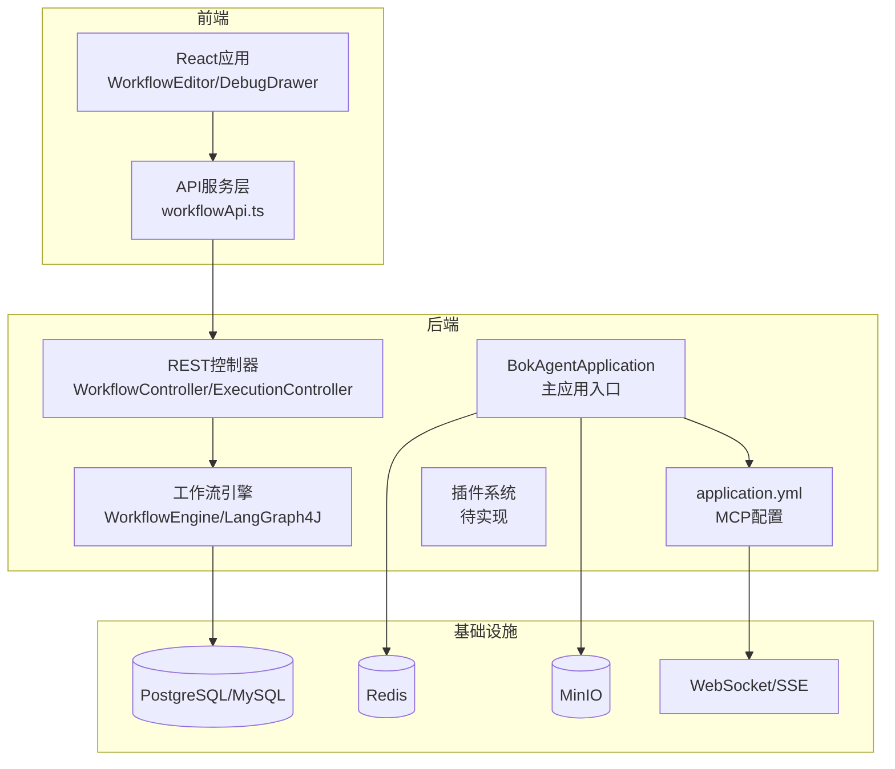
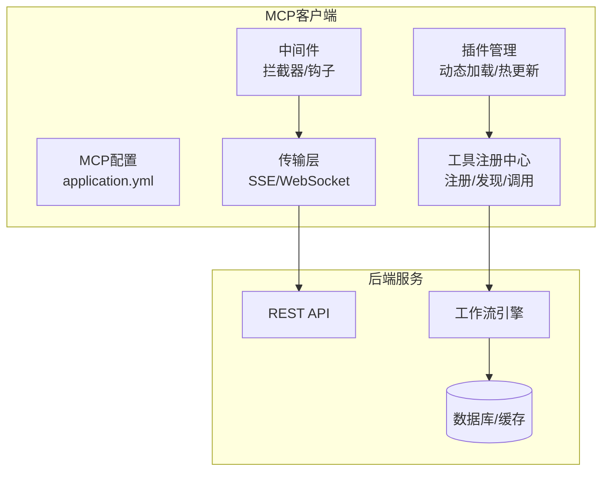
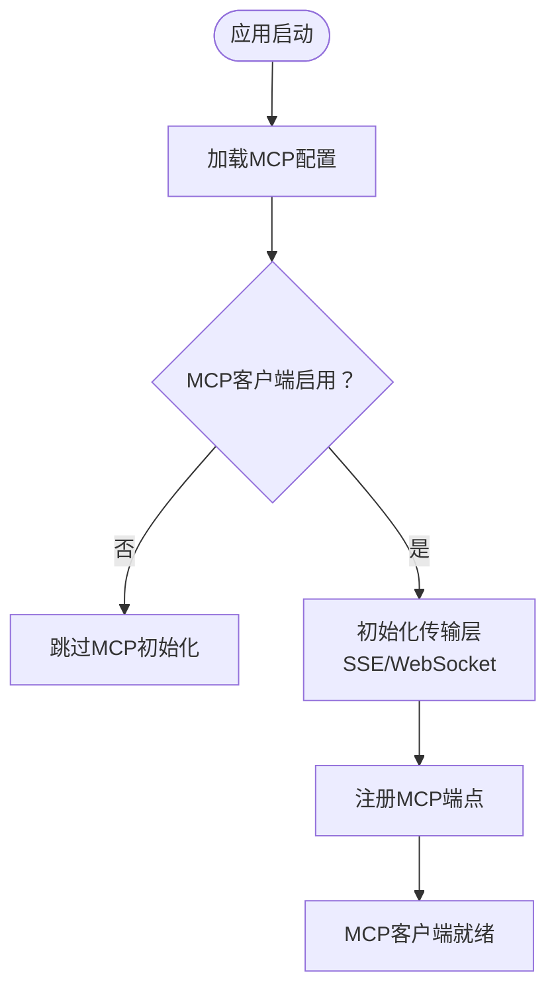
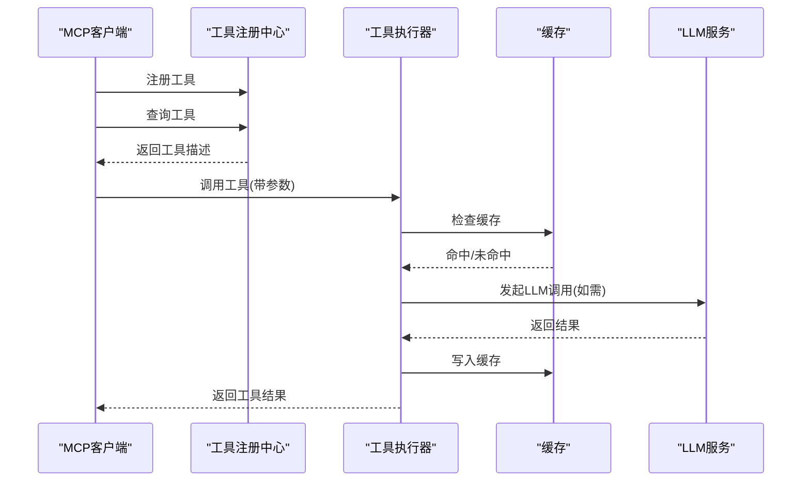
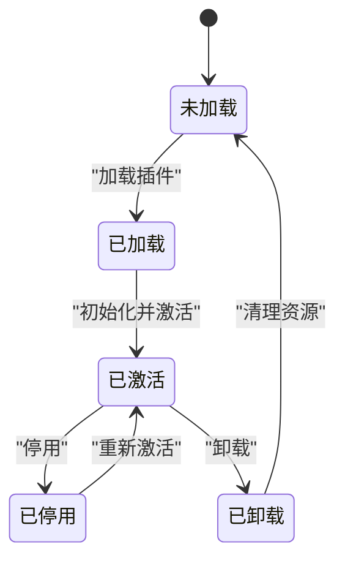
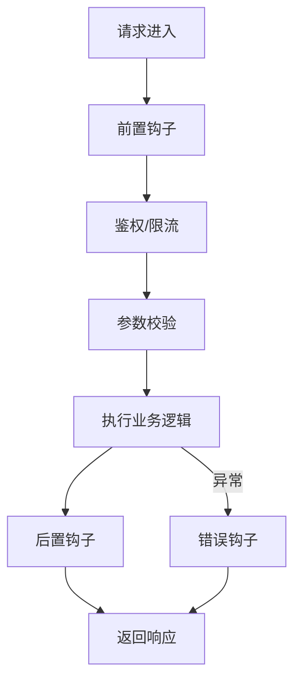
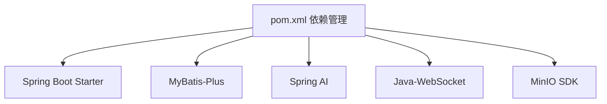

# MCP客户端扩展开发

<cite>
**本文档引用的文件**
- [README.md](file://README.md)
- [BokAgentApplication.java](file://backend/src/main/java/com/bokagent/BokAgentApplication.java)
- [application.yml](file://backend/src/main/resources/application.yml)
- [ExecutionController.java](file://backend/src/main/java/com/bokagent/controller/ExecutionController.java)
- [WorkflowController.java](file://backend/src/main/java/com/bokagent/controller/WorkflowController.java)
- [pom.xml](file://backend/pom.xml)
- [IMPLEMENTATION_PROGRESS.md](file://IMPLEMENTATION_PROGRESS.md)
- [PROJECT_INIT_STATUS.md](file://PROJECT_INIT_STATUS.md)
- [QUICKSTART.md](file://QUICKSTART.md)
</cite>

## 目录
1. [简介](#简介)
2. [项目结构](#项目结构)
3. [核心组件](#核心组件)
4. [架构总览](#架构总览)
5. [详细组件分析](#详细组件分析)
6. [依赖关系分析](#依赖关系分析)
7. [性能考虑](#性能考虑)
8. [故障排除指南](#故障排除指南)
9. [结论](#结论)
10. [附录](#附录)

## 简介
本文件面向MCP客户端扩展开发者，系统性阐述BokAgent中MCP客户端的扩展机制与最佳实践。基于现有配置与规划文档，重点覆盖以下主题：
- 扩展机制：自定义消息类型、插件系统集成、中间件开发
- 扩展点设计：钩子函数、事件系统、拦截器模式
- 最佳实践：模块化设计、接口抽象、版本兼容性
- 部署与管理：动态加载、配置管理、热更新
- 开发示例：简单扩展、复杂插件、第三方集成
- 工具与调试：扩展开发工具、调试技巧、性能测试方法

## 项目结构
BokAgent采用前后端分离架构，后端基于Spring Boot 3.5，前端基于React 18。MCP协议配置位于后端配置文件中，前端通过HTTP/SSE与后端交互。

图表来源
- [BokAgentApplication.java:1-56](file://backend/src/main/java/com/bokagent/BokAgentApplication.java#L1-L56)
- [application.yml:116-165](file://backend/src/main/resources/application.yml#L116-L165)
- [WorkflowController.java:1-92](file://backend/src/main/java/com/bokagent/controller/WorkflowController.java#L1-L92)
- [ExecutionController.java:1-81](file://backend/src/main/java/com/bokagent/controller/ExecutionController.java#L1-L81)

章节来源
- [README.md:81-92](file://README.md#L81-L92)
- [PROJECT_INIT_STATUS.md:160-187](file://PROJECT_INIT_STATUS.md#L160-L187)

## 核心组件
- 主应用入口：负责JVM编码设置、默认属性注入、启动日志输出
- 配置中心：集中管理MCP协议、超时、重试、缓存等配置
- 控制器层：提供工作流与执行记录的REST接口
- 工作流引擎：基于LangGraph4J的执行引擎（规划中）
- 插件系统：热插拔架构（规划中）

章节来源
- [BokAgentApplication.java:21-43](file://backend/src/main/java/com/bokagent/BokAgentApplication.java#L21-L43)
- [application.yml:116-165](file://backend/src/main/resources/application.yml#L116-L165)
- [WorkflowController.java:25-76](file://backend/src/main/java/com/bokagent/controller/WorkflowController.java#L25-L76)
- [ExecutionController.java:25-79](file://backend/src/main/java/com/bokagent/controller/ExecutionController.java#L25-L79)

## 架构总览
MCP客户端扩展围绕以下扩展点展开：
- 传输层扩展：SSE/WebSocket/STDIO（配置在application.yml中）
- 工具注册与调用：工具注册中心、重试、超时、缓存（规划中）
- 插件管理：插件生命周期、动态加载、热更新（规划中）
- 中间件：请求/响应拦截、事件钩子、AOP式横切关注点（规划中）

图表来源
- [application.yml:116-165](file://backend/src/main/resources/application.yml#L116-L165)
- [IMPLEMENTATION_PROGRESS.md:105-108](file://IMPLEMENTATION_PROGRESS.md#L105-L108)

## 详细组件分析

### MCP客户端配置与传输层
- 配置项：启用/禁用、能力声明、传输路径
- 传输：SSE与WebSocket路径分别配置
- 建议：为不同环境（开发/生产）提供profile隔离

图表来源
- [application.yml:116-136](file://backend/src/main/resources/application.yml#L116-L136)

章节来源
- [application.yml:116-136](file://backend/src/main/resources/application.yml#L116-L136)

### 工具注册与调用（规划中）
- 工具注册中心：统一注册、发现、版本管理
- 重试与超时：统一的重试策略与超时控制
- 缓存：工具结果缓存，提升性能
- 内置工具：WebSearch、Calculator等（规划中）

图表来源
- [IMPLEMENTATION_PROGRESS.md:169-175](file://IMPLEMENTATION_PROGRESS.md#L169-L175)

章节来源
- [IMPLEMENTATION_PROGRESS.md:169-175](file://IMPLEMENTATION_PROGRESS.md#L169-L175)

### 插件管理系统（规划中）
- 生命周期：加载、初始化、激活、停用、卸载
- 动态加载：基于类加载器的插件隔离
- 热更新：无停机替换插件版本
- 版本兼容：语义化版本与兼容性检查

图表来源
- [IMPLEMENTATION_PROGRESS.md:179](file://IMPLEMENTATION_PROGRESS.md#L179)

章节来源
- [IMPLEMENTATION_PROGRESS.md:179](file://IMPLEMENTATION_PROGRESS.md#L179)

### 中间件与拦截器（规划中）
- 请求/响应拦截：统一日志、鉴权、限流
- 事件钩子：执行前/后、错误、完成事件
- AOP式横切：减少重复代码，增强可维护性

图表来源
- [IMPLEMENTATION_PROGRESS.md:105-108](file://IMPLEMENTATION_PROGRESS.md#L105-L108)

章节来源
- [IMPLEMENTATION_PROGRESS.md:105-108](file://IMPLEMENTATION_PROGRESS.md#L105-L108)

### 扩展开发最佳实践
- 模块化设计：每个插件/工具独立模块，清晰边界
- 接口抽象：定义稳定接口，避免对具体实现的耦合
- 版本兼容：语义化版本，向后兼容，废弃策略明确
- 配置管理：环境隔离、默认值、热更新支持
- 错误处理：幂等、可恢复、可观测性

章节来源
- [PROJECT_INIT_STATUS.md:160-187](file://PROJECT_INIT_STATUS.md#L160-L187)

### 扩展开发示例（概念性）
- 简单扩展：注册一个只读工具，返回固定数据
- 复杂插件：集成外部API，实现重试、缓存、限流
- 第三方集成：对接第三方MCP服务器，实现双向通信

章节来源
- [README.md:10-13](file://README.md#L10-L13)

## 依赖关系分析
后端依赖Spring Boot、MyBatis-Plus、Spring AI等，MCP相关依赖通过配置启用。WebSocket客户端依赖Java-WebSocket。

图表来源
- [pom.xml:29-132](file://backend/pom.xml#L29-L132)

章节来源
- [pom.xml:29-132](file://backend/pom.xml#L29-L132)

## 性能考虑
- 连接池与并发：合理配置数据库连接池与线程池
- 缓存策略：工具结果缓存、LLM响应缓存
- 超时与重试：针对不同场景设置合理的超时与重试策略
- 监控与指标：结合Actuator暴露指标，持续优化

章节来源
- [application.yml:138-162](file://backend/src/main/resources/application.yml#L138-L162)
- [application.yml:181-190](file://backend/src/main/resources/application.yml#L181-L190)

## 故障排除指南
- 编码问题：确认JVM与配置文件编码一致，Docker环境变量设置正确
- 端口冲突：检查docker-compose映射，必要时调整端口
- 服务状态：使用docker-compose ps与logs定位问题
- UTF-8验证：通过SQL查询数据库编码，验证中文显示

章节来源
- [BokAgentApplication.java:22-52](file://backend/src/main/java/com/bokagent/BokAgentApplication.java#L22-L52)
- [QUICKSTART.md:112-164](file://QUICKSTART.md#L112-L164)

## 结论
MCP客户端扩展开发应遵循模块化、接口抽象与版本兼容的原则。基于现有配置与规划，建议优先完善MCP传输层、工具注册中心与插件管理系统的实现，并配套中间件与事件钩子机制，最终形成可动态加载、热更新、可观测的扩展生态。

## 附录
- 快速开始：参考快速开始指南进行本地部署与验证
- 文档索引：README中提供了完整的文档链接

章节来源
- [QUICKSTART.md:166-185](file://QUICKSTART.md#L166-L185)
- [README.md:94-101](file://README.md#L94-L101)