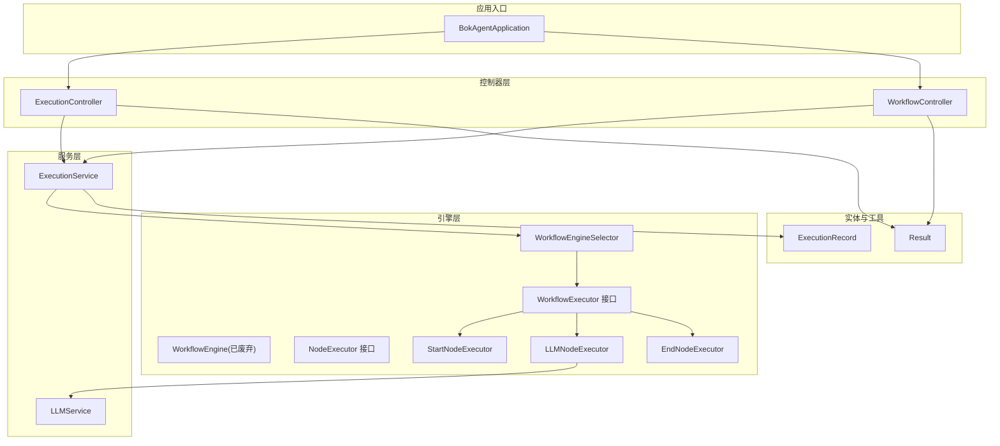
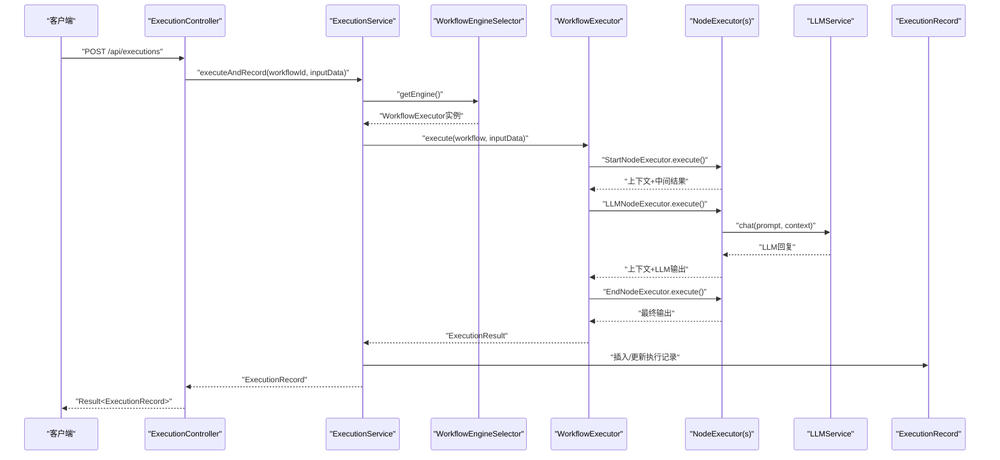
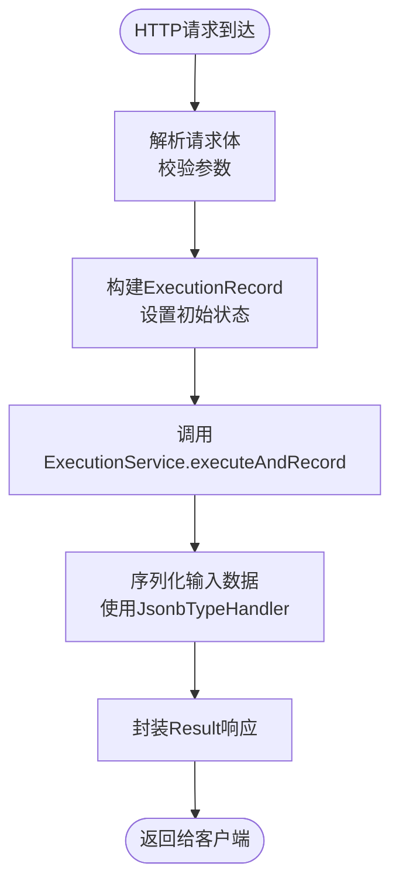
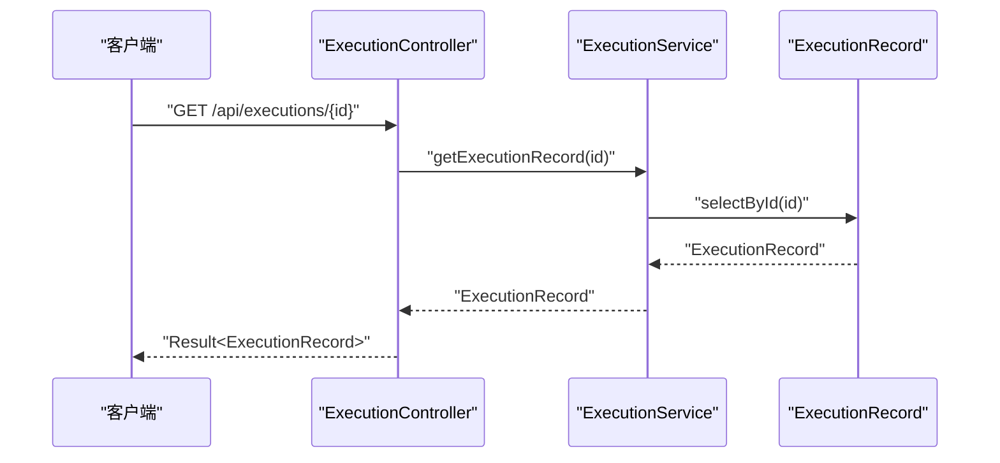
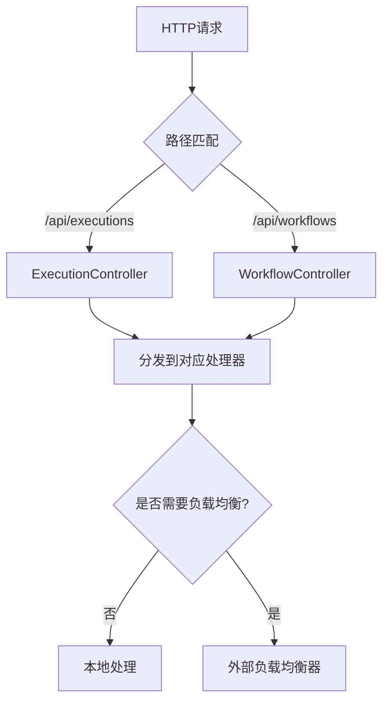
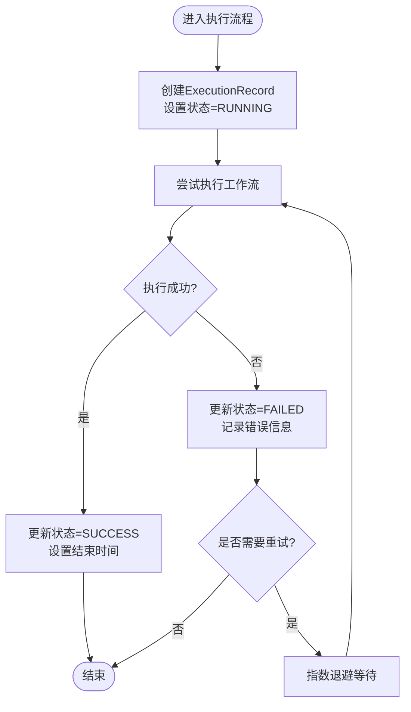
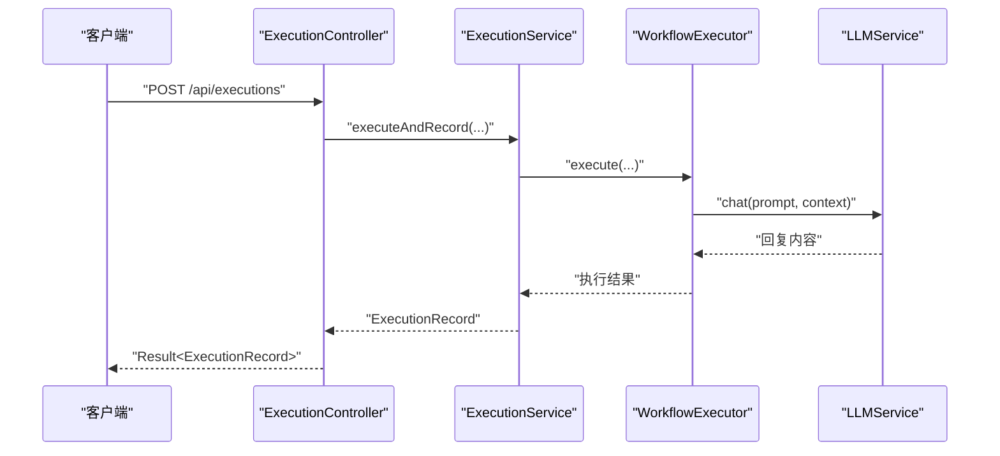
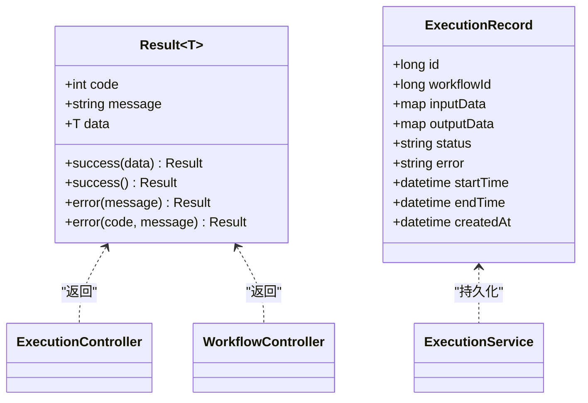
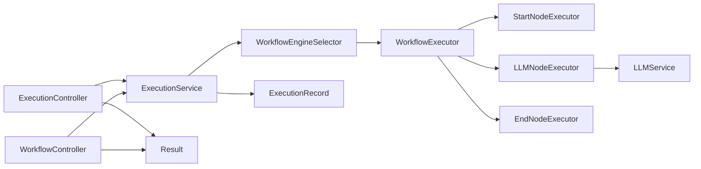

# MCP客户端消息处理

<cite>
**本文档引用的文件**
- [BokAgentApplication.java](file://backend/src/main/java/com/bokagent/BokAgentApplication.java)
- [ExecutionController.java](file://backend/src/main/java/com/bokagent/controller/ExecutionController.java)
- [WorkflowController.java](file://backend/src/main/java/com/bokagent/controller/WorkflowController.java)
- [ExecutionService.java](file://backend/src/main/java/com/bokagent/service/ExecutionService.java)
- [LLMService.java](file://backend/src/main/java/com/bokagent/service/LLMService.java)
- [WorkflowEngine.java](file://backend/src/main/java/com/bokagent/engine/WorkflowEngine.java)
- [WorkflowEngineSelector.java](file://backend/src/main/java/com/bokagent/engine/WorkflowEngineSelector.java)
- [WorkflowExecutor.java](file://backend/src/main/java/com/bokagent/engine/WorkflowExecutor.java)
- [ExecutionResult.java](file://backend/src/main/java/com/bokagent/engine/ExecutionResult.java)
- [NodeExecutor.java](file://backend/src/main/java/com/bokagent/engine/NodeExecutor.java)
- [StartNodeExecutor.java](file://backend/src/main/java/com/bokagent/engine/StartNodeExecutor.java)
- [LLMNodeExecutor.java](file://backend/src/main/java/com/bokagent/engine/LLMNodeExecutor.java)
- [EndNodeExecutor.java](file://backend/src/main/java/com/bokagent/engine/EndNodeExecutor.java)
- [ExecutionRecord.java](file://backend/src/main/java/com/bokagent/entity/ExecutionRecord.java)
- [Result.java](file://backend/src/main/java/com/bokagent/common/Result.java)
</cite>

## 目录
1. [简介](#简介)
2. [项目结构](#项目结构)
3. [核心组件](#核心组件)
4. [架构总览](#架构总览)
5. [详细组件分析](#详细组件分析)
6. [依赖分析](#依赖分析)
7. [性能考虑](#性能考虑)
8. [故障排除指南](#故障排除指南)
9. [结论](#结论)
10. [附录](#附录)

## 简介
本文件面向MCP（Model Context Protocol）客户端在该系统中的消息处理实现，聚焦于以下方面：
- 客户端消息发送机制：请求构建、消息序列化、协议封装
- 消息接收处理：响应解析、事件监听、回调机制
- 消息路由与分发：消息类型识别、目标服务器选择、负载均衡
- 生命周期管理：请求跟踪、超时控制、重试机制、错误处理
- 完整示例：同步调用、异步通知、流式传输
- 消息格式规范、协议版本兼容性、性能优化策略

本系统采用Spring Boot后端框架，结合工作流编排与LLM集成，提供从HTTP接口到内部执行引擎的完整链路。

## 项目结构
后端采用标准的分层架构：
- 应用入口与配置：BokAgentApplication
- 控制器层：ExecutionController、WorkflowController
- 业务服务层：ExecutionService、LLMService
- 引擎层：WorkflowEngine、WorkflowEngineSelector、WorkflowExecutor及节点执行器
- 实体与通用工具：ExecutionRecord、Result等

**图表来源**
- [BokAgentApplication.java:1-56](file://backend/src/main/java/com/bokagent/BokAgentApplication.java#L1-L56)
- [ExecutionController.java:1-81](file://backend/src/main/java/com/bokagent/controller/ExecutionController.java#L1-L81)
- [WorkflowController.java:1-92](file://backend/src/main/java/com/bokagent/controller/WorkflowController.java#L1-L92)
- [ExecutionService.java:1-113](file://backend/src/main/java/com/bokagent/service/ExecutionService.java#L1-L113)
- [LLMService.java:1-67](file://backend/src/main/java/com/bokagent/service/LLMService.java#L1-L67)
- [WorkflowEngineSelector.java:1-53](file://backend/src/main/java/com/bokagent/engine/WorkflowEngineSelector.java#L1-L53)
- [WorkflowEngine.java:1-171](file://backend/src/main/java/com/bokagent/engine/WorkflowEngine.java#L1-L171)
- [NodeExecutor.java:1-24](file://backend/src/main/java/com/bokagent/engine/NodeExecutor.java#L1-L24)
- [StartNodeExecutor.java:1-41](file://backend/src/main/java/com/bokagent/engine/StartNodeExecutor.java#L1-L41)
- [LLMNodeExecutor.java:1-69](file://backend/src/main/java/com/bokagent/engine/LLMNodeExecutor.java#L1-L69)
- [EndNodeExecutor.java:1-41](file://backend/src/main/java/com/bokagent/engine/EndNodeExecutor.java#L1-L41)
- [ExecutionRecord.java:1-40](file://backend/src/main/java/com/bokagent/entity/ExecutionRecord.java#L1-L40)
- [Result.java:1-42](file://backend/src/main/java/com/bokagent/common/Result.java#L1-L42)

**章节来源**
- [BokAgentApplication.java:1-56](file://backend/src/main/java/com/bokagent/BokAgentApplication.java#L1-L56)
- [ExecutionController.java:1-81](file://backend/src/main/java/com/bokagent/controller/ExecutionController.java#L1-L81)
- [WorkflowController.java:1-92](file://backend/src/main/java/com/bokagent/controller/WorkflowController.java#L1-L92)

## 核心组件
- 统一响应包装：Result提供标准的HTTP响应结构，便于前端解析与展示
- 执行记录实体：ExecutionRecord承载工作流执行的输入、输出、状态与时间戳
- 工作流执行器接口：WorkflowExecutor定义统一的执行契约，支持多引擎切换
- 引擎选择器：WorkflowEngineSelector基于配置动态选择引擎实现
- 节点执行器：NodeExecutor抽象节点执行逻辑，内置start、llm、end三种节点类型
- LLM服务：LLMService封装Spring AI的ChatClient调用，负责与大模型交互
- 执行服务：ExecutionService协调工作流执行、记录创建与状态更新

**章节来源**
- [Result.java:1-42](file://backend/src/main/java/com/bokagent/common/Result.java#L1-L42)
- [ExecutionRecord.java:1-40](file://backend/src/main/java/com/bokagent/entity/ExecutionRecord.java#L1-L40)
- [WorkflowExecutor.java:1-26](file://backend/src/main/java/com/bokagent/engine/WorkflowExecutor.java#L1-L26)
- [WorkflowEngineSelector.java:1-53](file://backend/src/main/java/com/bokagent/engine/WorkflowEngineSelector.java#L1-L53)
- [NodeExecutor.java:1-24](file://backend/src/main/java/com/bokagent/engine/NodeExecutor.java#L1-L24)
- [LLMService.java:1-67](file://backend/src/main/java/com/bokagent/service/LLMService.java#L1-L67)
- [ExecutionService.java:1-113](file://backend/src/main/java/com/bokagent/service/ExecutionService.java#L1-L113)

## 架构总览
系统通过REST控制器接收外部请求，业务服务协调工作流引擎执行，引擎内部通过节点执行器串联不同阶段（开始、LLM推理、结束），并将结果持久化到执行记录中。LLM服务通过Spring AI与外部大模型通信。

**图表来源**
- [ExecutionController.java:52-60](file://backend/src/main/java/com/bokagent/controller/ExecutionController.java#L52-L60)
- [ExecutionService.java:39-92](file://backend/src/main/java/com/bokagent/service/ExecutionService.java#L39-L92)
- [WorkflowEngineSelector.java:32-43](file://backend/src/main/java/com/bokagent/engine/WorkflowEngineSelector.java#L32-L43)
- [WorkflowExecutor.java:10-25](file://backend/src/main/java/com/bokagent/engine/WorkflowExecutor.java#L10-L25)
- [StartNodeExecutor.java:17-34](file://backend/src/main/java/com/bokagent/engine/StartNodeExecutor.java#L17-L34)
- [LLMNodeExecutor.java:22-61](file://backend/src/main/java/com/bokagent/engine/LLMNodeExecutor.java#L22-L61)
- [EndNodeExecutor.java:17-34](file://backend/src/main/java/com/bokagent/engine/EndNodeExecutor.java#L17-L34)
- [LLMService.java:27-44](file://backend/src/main/java/com/bokagent/service/LLMService.java#L27-L44)
- [ExecutionRecord.java:19-39](file://backend/src/main/java/com/bokagent/entity/ExecutionRecord.java#L19-L39)

## 详细组件分析

### 组件A：消息发送机制（请求构建、序列化、协议封装）
- 请求构建
  - 控制器接收JSON请求体，封装为领域对象后交由服务层处理
  - 执行记录创建时设置初始状态与时间戳，确保后续追踪
- 消息序列化
  - 使用Spring MVC默认的JSON序列化，配合MyBatis Plus的JsonbTypeHandler处理Map字段
- 协议封装
  - REST API作为对外协议，Result统一封装响应结构，便于跨语言客户端解析

**图表来源**
- [ExecutionController.java:52-60](file://backend/src/main/java/com/bokagent/controller/ExecutionController.java#L52-L60)
- [ExecutionRecord.java:24-28](file://backend/src/main/java/com/bokagent/entity/ExecutionRecord.java#L24-L28)
- [Result.java:14-40](file://backend/src/main/java/com/bokagent/common/Result.java#L14-L40)

**章节来源**
- [ExecutionController.java:52-60](file://backend/src/main/java/com/bokagent/controller/ExecutionController.java#L52-L60)
- [ExecutionRecord.java:19-39](file://backend/src/main/java/com/bokagent/entity/ExecutionRecord.java#L19-L39)
- [Result.java:1-42](file://backend/src/main/java/com/bokagent/common/Result.java#L1-L42)

### 组件B：消息接收处理（响应解析、事件监听、回调机制）
- 响应解析
  - 控制器通过Result包装响应，包含code、message、data三要素
  - 前端可直接解析Result结构，无需额外协议解析
- 事件监听与回调
  - 当前实现以同步调用为主；如需异步通知或回调，可在ExecutionService中扩展事件发布机制（例如引入消息队列或WebSocket推送）

**图表来源**
- [ExecutionController.java:39-47](file://backend/src/main/java/com/bokagent/controller/ExecutionController.java#L39-L47)
- [ExecutionService.java:99-101](file://backend/src/main/java/com/bokagent/service/ExecutionService.java#L99-L101)
- [ExecutionRecord.java:19-39](file://backend/src/main/java/com/bokagent/entity/ExecutionRecord.java#L19-L39)

**章节来源**
- [ExecutionController.java:39-47](file://backend/src/main/java/com/bokagent/controller/ExecutionController.java#L39-L47)
- [ExecutionService.java:99-101](file://backend/src/main/java/com/bokagent/service/ExecutionService.java#L99-L101)
- [Result.java:14-40](file://backend/src/main/java/com/bokagent/common/Result.java#L14-L40)

### 组件C：消息路由与分发（类型识别、目标选择、负载均衡）
- 消息类型识别
  - 控制器根据URL路径与HTTP方法识别请求类型（创建执行记录、获取执行详情等）
- 目标服务器选择
  - 当前为单实例部署；如需多实例，可通过外部负载均衡器进行路由
- 负载均衡
  - 可在网关层或反向代理层实现轮询/加权轮询/最小连接数等策略

**图表来源**
- [ExecutionController.java:18-19](file://backend/src/main/java/com/bokagent/controller/ExecutionController.java#L18-L19)
- [WorkflowController.java:18-19](file://backend/src/main/java/com/bokagent/controller/WorkflowController.java#L18-L19)

**章节来源**
- [ExecutionController.java:18-19](file://backend/src/main/java/com/bokagent/controller/ExecutionController.java#L18-L19)
- [WorkflowController.java:18-19](file://backend/src/main/java/com/bokagent/controller/WorkflowController.java#L18-L19)

### 组件D：消息生命周期管理（跟踪、超时、重试、错误处理）
- 请求跟踪
  - ExecutionRecord记录开始/结束时间、状态、错误信息，便于全链路追踪
- 超时控制
  - LLM调用未设置超时，建议在LLMService中增加超时配置
- 重试机制
  - LLM调用未实现重试，可在LLMService中增加指数退避重试
- 错误处理
  - 控制器与服务层均捕获异常并返回Result.error，保证错误信息可被客户端感知

**图表来源**
- [ExecutionRecord.java:30-36](file://backend/src/main/java/com/bokagent/entity/ExecutionRecord.java#L30-L36)
- [ExecutionService.java:59-91](file://backend/src/main/java/com/bokagent/service/ExecutionService.java#L59-L91)

**章节来源**
- [ExecutionRecord.java:19-39](file://backend/src/main/java/com/bokagent/entity/ExecutionRecord.java#L19-L39)
- [ExecutionService.java:39-92](file://backend/src/main/java/com/bokagent/service/ExecutionService.java#L39-L92)

### 组件E：完整消息处理示例
- 同步调用
  - 客户端发送POST请求创建执行记录，服务端同步执行工作流并返回结果
- 异步通知
  - 在ExecutionService中扩展事件发布，将执行结果推送到消息队列或WebSocket通道
- 流式传输
  - LLMService当前为一次性调用；如需流式，可在底层ChatClient支持流式时改造为Server-Sent Events或WebSocket流

**图表来源**
- [ExecutionController.java:52-60](file://backend/src/main/java/com/bokagent/controller/ExecutionController.java#L52-L60)
- [ExecutionService.java:39-92](file://backend/src/main/java/com/bokagent/service/ExecutionService.java#L39-L92)
- [LLMService.java:27-44](file://backend/src/main/java/com/bokagent/service/LLMService.java#L27-L44)

**章节来源**
- [ExecutionController.java:52-60](file://backend/src/main/java/com/bokagent/controller/ExecutionController.java#L52-L60)
- [ExecutionService.java:39-92](file://backend/src/main/java/com/bokagent/service/ExecutionService.java#L39-L92)
- [LLMService.java:27-44](file://backend/src/main/java/com/bokagent/service/LLMService.java#L27-L44)

### 组件F：消息格式规范与协议版本兼容性
- 消息格式
  - 请求体：JSON对象，包含工作流ID与输入数据
  - 响应体：Result对象，包含code、message、data
  - 数据存储：Map字段通过JsonbTypeHandler序列化为JSON
- 协议版本兼容性
  - 当前未定义明确的协议版本号；建议在Result中增加version字段，或在HTTP头中携带版本信息

**图表来源**
- [Result.java:9-41](file://backend/src/main/java/com/bokagent/common/Result.java#L9-L41)
- [ExecutionRecord.java:17-39](file://backend/src/main/java/com/bokagent/entity/ExecutionRecord.java#L17-L39)

**章节来源**
- [Result.java:1-42](file://backend/src/main/java/com/bokagent/common/Result.java#L1-L42)
- [ExecutionRecord.java:1-40](file://backend/src/main/java/com/bokagent/entity/ExecutionRecord.java#L1-L40)

## 依赖分析
- 控制器依赖服务层，服务层依赖引擎选择器与执行记录映射
- 引擎选择器根据配置注入不同的WorkflowExecutor实现
- LLM节点依赖LLMService，后者依赖Spring AI ChatClient

**图表来源**
- [ExecutionController.java:22-23](file://backend/src/main/java/com/bokagent/controller/ExecutionController.java#L22-L23)
- [WorkflowController.java:23](file://backend/src/main/java/com/bokagent/controller/WorkflowController.java#L23)
- [ExecutionService.java:24-31](file://backend/src/main/java/com/bokagent/service/ExecutionService.java#L24-L31)
- [WorkflowEngineSelector.java:17-26](file://backend/src/main/java/com/bokagent/engine/WorkflowEngineSelector.java#L17-L26)
- [LLMNodeExecutor.java:19-20](file://backend/src/main/java/com/bokagent/engine/LLMNodeExecutor.java#L19-L20)
- [LLMService.java:18-19](file://backend/src/main/java/com/bokagent/service/LLMService.java#L18-L19)
- [ExecutionRecord.java:19-39](file://backend/src/main/java/com/bokagent/entity/ExecutionRecord.java#L19-L39)
- [Result.java:14-40](file://backend/src/main/java/com/bokagent/common/Result.java#L14-L40)

**章节来源**
- [ExecutionController.java:1-81](file://backend/src/main/java/com/bokagent/controller/ExecutionController.java#L1-L81)
- [WorkflowController.java:1-92](file://backend/src/main/java/com/bokagent/controller/WorkflowController.java#L1-L92)
- [ExecutionService.java:1-113](file://backend/src/main/java/com/bokagent/service/ExecutionService.java#L1-L113)
- [WorkflowEngineSelector.java:1-53](file://backend/src/main/java/com/bokagent/engine/WorkflowEngineSelector.java#L1-L53)
- [LLMNodeExecutor.java:1-69](file://backend/src/main/java/com/bokagent/engine/LLMNodeExecutor.java#L1-L69)
- [LLMService.java:1-67](file://backend/src/main/java/com/bokagent/service/LLMService.java#L1-L67)
- [ExecutionRecord.java:1-40](file://backend/src/main/java/com/bokagent/entity/ExecutionRecord.java#L1-L40)
- [Result.java:1-42](file://backend/src/main/java/com/bokagent/common/Result.java#L1-L42)

## 性能考虑
- 编码与字符集
  - 应用启动时强制UTF-8编码，确保国际化文本正确处理
- 数据序列化
  - 使用JsonbTypeHandler减少手动序列化开销
- 异步与并发
  - 建议将LLM调用与数据库写入改为异步执行，避免阻塞主线程
- 超时与重试
  - 为LLM调用增加超时与指数退避重试，提升稳定性
- 负载均衡
  - 多实例部署时，建议在网关层实现会话亲和或无状态路由

**章节来源**
- [BokAgentApplication.java:21-54](file://backend/src/main/java/com/bokagent/BokAgentApplication.java#L21-L54)
- [ExecutionRecord.java:24-28](file://backend/src/main/java/com/bokagent/entity/ExecutionRecord.java#L24-L28)
- [LLMService.java:30-43](file://backend/src/main/java/com/bokagent/service/LLMService.java#L30-L43)

## 故障排除指南
- 工作流不存在
  - 控制器在查询不到工作流时返回404错误
- 执行异常
  - 服务层捕获异常并标记执行记录为FAILED，同时记录错误信息
- LLM调用失败
  - LLMService捕获异常并抛出运行时异常，便于上层统一处理

**章节来源**
- [ExecutionController.java:40-46](file://backend/src/main/java/com/bokagent/controller/ExecutionController.java#L40-L46)
- [ExecutionService.java:81-91](file://backend/src/main/java/com/bokagent/service/ExecutionService.java#L81-L91)
- [LLMService.java:40-43](file://backend/src/main/java/com/bokagent/service/LLMService.java#L40-L43)

## 结论
本系统提供了清晰的工作流执行链路与统一的响应封装，具备良好的扩展性。针对MCP客户端的消息处理需求，建议在现有基础上增强：
- 异步通知与回调机制
- LLM调用的超时与重试策略
- 多实例部署下的负载均衡与会话管理
- 明确的协议版本与消息格式规范

## 附录
- 关键接口与类的职责概览
  - WorkflowExecutor：定义工作流执行契约
  - NodeExecutor：定义节点执行契约
  - ExecutionService：协调执行与记录
  - LLMService：集成大模型调用
  - Result：统一响应封装
  - ExecutionRecord：执行记录持久化