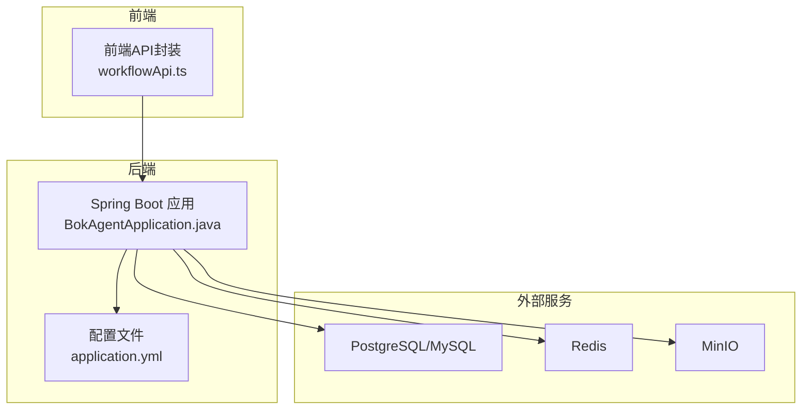
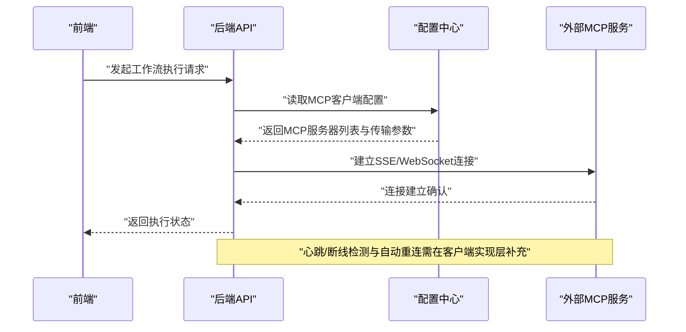
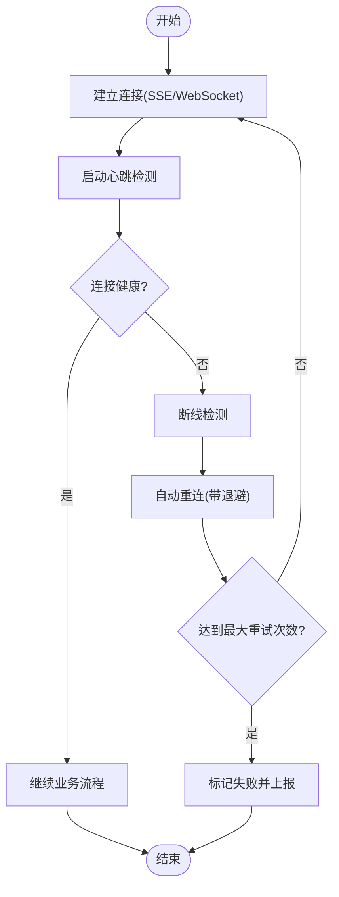
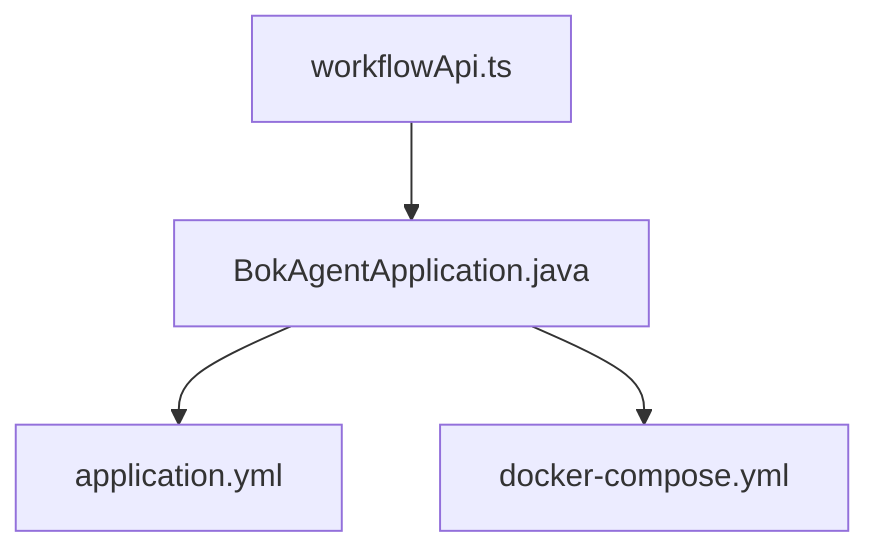

# MCP客户端连接管理

<cite>
**本文引用的文件**
- [BokAgentApplication.java](file://backend/src/main/java/com/bokagent/BokAgentApplication.java)
- [application.yml](file://backend/src/main/resources/application.yml)
- [README.md](file://README.md)
- [workflowApi.ts](file://frontend/src/services/workflowApi.ts)
- [docker-compose.yml](file://docker/docker-compose.yml)
</cite>

## 目录
1. [引言](#引言)
2. [项目结构](#项目结构)
3. [核心组件](#核心组件)
4. [架构总览](#架构总览)
5. [详细组件分析](#详细组件分析)
6. [依赖分析](#依赖分析)
7. [性能考虑](#性能考虑)
8. [故障排除指南](#故障排除指南)
9. [结论](#结论)
10. [附录](#附录)

## 引言
本文件聚焦于MCP（Model Context Protocol）客户端连接管理的技术文档，面向需要在本项目中实现或集成MCP双向通信能力的开发者与运维人员。文档从连接建立、服务器发现、认证机制、连接状态管理（建立、心跳、断线检测、自动重连）、连接池策略（最大连接数、超时、资源清理）、客户端配置选项（服务器列表、传输协议选择、参数调优）等方面进行系统化阐述，并提供最佳实践、配置示例与故障排除指南。

## 项目结构
后端采用Spring Boot应用，前端基于React。MCP协议配置位于后端配置文件中，前端通过HTTP API与后端交互。Docker Compose用于统一编排后端与依赖服务（数据库、缓存、对象存储等）。

图表来源
- [BokAgentApplication.java:1-56](file://backend/src/main/java/com/bokagent/BokAgentApplication.java#L1-L56)
- [application.yml:1-190](file://backend/src/main/resources/application.yml#L1-L190)
- [workflowApi.ts:1-44](file://frontend/src/services/workflowApi.ts#L1-L44)
- [docker-compose.yml:42-94](file://docker/docker-compose.yml#L42-L94)

章节来源
- [BokAgentApplication.java:1-56](file://backend/src/main/java/com/bokagent/BokAgentApplication.java#L1-L56)
- [application.yml:1-190](file://backend/src/main/resources/application.yml#L1-L190)
- [README.md:1-106](file://README.md#L1-L106)
- [workflowApi.ts:1-44](file://frontend/src/services/workflowApi.ts#L1-L44)
- [docker-compose.yml:42-94](file://docker/docker-compose.yml#L42-L94)

## 核心组件
- Spring Boot应用入口与编码配置：负责应用启动、默认属性设置与编码校验。
- 配置中心（application.yml）：集中管理MCP协议开关、传输通道、重试与超时策略、缓存与日志等。
- 前端API封装：提供统一的REST接口访问后端工作流相关能力。
- 外部依赖服务：数据库、缓存、对象存储等，支撑工作流执行与数据持久化。

章节来源
- [BokAgentApplication.java:1-56](file://backend/src/main/java/com/bokagent/BokAgentApplication.java#L1-L56)
- [application.yml:116-156](file://backend/src/main/resources/application.yml#L116-L156)
- [workflowApi.ts:1-44](file://frontend/src/services/workflowApi.ts#L1-L44)

## 架构总览
MCP客户端连接管理涉及以下关键路径：
- 服务器发现：通过配置文件中的MCP客户端服务器列表进行静态发现。
- 连接参数配置：传输协议（SSE/WebSocket）路径、超时与重试策略由配置文件定义。
- 认证机制：当前配置未显式声明认证参数，需结合实际MCP服务端要求补充。
- 连接状态管理：建立、心跳、断线检测、自动重连需在客户端实现层补充。
- 连接池策略：最大连接数、超时、资源清理需在客户端实现层补充。
- 客户端配置选项：服务器列表、传输协议选择、参数调优在配置文件中定义。

图表来源
- [application.yml:116-137](file://backend/src/main/resources/application.yml#L116-L137)
- [workflowApi.ts:1-44](file://frontend/src/services/workflowApi.ts#L1-L44)

## 详细组件分析

### 1) 服务器发现与连接参数配置
- 服务器发现：MCP客户端启用开关与服务器列表在配置文件中定义，当前为空数组，需按实际部署填写。
- 传输协议：同时启用SSE与WebSocket，分别指定路径；前端可通过HTTP API间接触发后端连接行为。
- 连接参数：超时与重试策略在配置文件中集中定义，便于统一管理。

章节来源
- [application.yml:116-137](file://backend/src/main/resources/application.yml#L116-L137)
- [application.yml:138-148](file://backend/src/main/resources/application.yml#L138-L148)
- [application.yml:149-156](file://backend/src/main/resources/application.yml#L149-L156)

### 2) 认证机制
- 当前配置未显式声明认证参数（如Bearer Token、API Key等），若MCP服务端要求认证，应在客户端实现层补充认证头或令牌传递逻辑，并在配置文件中安全地注入密钥。

章节来源
- [application.yml:116-137](file://backend/src/main/resources/application.yml#L116-L137)

### 3) 连接状态管理
- 连接建立：根据配置选择SSE或WebSocket路径，建立初始连接。
- 心跳检测：建议在客户端实现心跳帧发送与超时判定。
- 断线检测：监听底层连接事件，识别网络异常或服务端主动断开。
- 自动重连：结合重试配置，指数退避策略进行有限次数的重连尝试。

图表来源
- [application.yml:138-148](file://backend/src/main/resources/application.yml#L138-L148)
- [application.yml:149-156](file://backend/src/main/resources/application.yml#L149-L156)

### 4) 连接池管理策略
- 最大连接数限制：在客户端实现层设置并发连接上限，避免资源耗尽。
- 连接超时设置：结合请求超时与连接超时，防止长尾阻塞。
- 资源清理：断开连接时释放句柄、取消定时器、清理缓冲区。

章节来源
- [application.yml:149-156](file://backend/src/main/resources/application.yml#L149-L156)

### 5) 客户端配置选项
- 服务器列表配置：在MCP客户端配置项中维护目标服务地址列表。
- 传输协议选择：SSE与WebSocket二选一或双通道并行，依据延迟与可靠性需求选择。
- 连接参数调优：超时、重试间隔、最大重试次数、心跳周期等参数应结合业务场景调整。

章节来源
- [application.yml:116-137](file://backend/src/main/resources/application.yml#L116-L137)
- [application.yml:138-148](file://backend/src/main/resources/application.yml#L138-L148)
- [application.yml:149-156](file://backend/src/main/resources/application.yml#L149-L156)

### 6) 前后端交互与工作流执行
- 前端通过HTTP API调用后端工作流能力；后端根据配置决定是否触发MCP客户端连接与消息收发。
- 建议在后端增加MCP客户端生命周期管理与可观测性指标，便于监控与告警。

章节来源
- [workflowApi.ts:1-44](file://frontend/src/services/workflowApi.ts#L1-L44)
- [application.yml:116-137](file://backend/src/main/resources/application.yml#L116-L137)

## 依赖分析
- 后端应用依赖Spring Boot与相关生态组件，MCP客户端能力需在现有框架上扩展。
- 外部依赖服务（数据库、缓存、对象存储）通过Docker Compose编排，确保运行环境一致性。

图表来源
- [BokAgentApplication.java:1-56](file://backend/src/main/java/com/bokagent/BokAgentApplication.java#L1-L56)
- [application.yml:1-190](file://backend/src/main/resources/application.yml#L1-L190)
- [workflowApi.ts:1-44](file://frontend/src/services/workflowApi.ts#L1-L44)
- [docker-compose.yml:42-94](file://docker/docker-compose.yml#L42-L94)

章节来源
- [BokAgentApplication.java:1-56](file://backend/src/main/java/com/bokagent/BokAgentApplication.java#L1-L56)
- [application.yml:1-190](file://backend/src/main/resources/application.yml#L1-L190)
- [docker-compose.yml:42-94](file://docker/docker-compose.yml#L42-L94)

## 性能考虑
- 传输协议选择：低延迟场景优先WebSocket，高兼容性场景可选SSE；必要时双通道并行以提升可用性。
- 超时与重试：合理设置请求超时与重试退避，避免雪崩效应；对关键路径设置更严格的超时阈值。
- 连接池与资源：限制最大连接数，及时释放闲置连接；对心跳频率与保活策略进行权衡。
- 监控与日志：埋点连接建立、断线、重连、错误类型与耗时，结合日志级别进行分级采集。

## 故障排除指南
- 无法连接MCP服务
  - 检查MCP客户端服务器列表是否正确配置且可达。
  - 确认传输协议路径与服务端一致。
  - 查看后端日志与网络连通性。
- 连接频繁断开
  - 检查心跳配置与网络波动，适当增大超时与重试间隔。
  - 观察服务端负载与限流策略。
- 认证失败
  - 确认认证参数是否正确注入至客户端实现层。
  - 校验密钥有效期与权限范围。
- 超时与性能问题
  - 结合超时配置与重试策略进行调优。
  - 分析慢请求与热点资源，优化上游依赖。

章节来源
- [application.yml:116-137](file://backend/src/main/resources/application.yml#L116-L137)
- [application.yml:138-148](file://backend/src/main/resources/application.yml#L138-L148)
- [application.yml:149-156](file://backend/src/main/resources/application.yml#L149-L156)

## 结论
本项目已具备MCP协议的基础配置能力，后续可在客户端实现层完善连接建立、心跳、断线检测与自动重连机制，并结合配置中心进行参数化管理。通过合理的连接池策略、超时与重试配置以及完善的监控告警体系，可显著提升MCP客户端的稳定性与性能表现。

## 附录

### A. 配置示例（片段路径）
- MCP客户端启用与服务器列表
  - [application.yml:134-137](file://backend/src/main/resources/application.yml#L134-L137)
- 传输协议（SSE/WebSocket）路径
  - [application.yml:126-133](file://backend/src/main/resources/application.yml#L126-L133)
- 重试策略
  - [application.yml:138-148](file://backend/src/main/resources/application.yml#L138-L148)
- 请求超时
  - [application.yml:149-156](file://backend/src/main/resources/application.yml#L149-L156)

### B. 最佳实践清单
- 明确认证方式并在客户端实现层统一注入。
- 为不同传输协议设定差异化的心跳与超时策略。
- 限制最大连接数并实现优雅关闭与资源回收。
- 将连接状态、错误类型与耗时纳入监控与日志。
- 在配置文件中集中管理参数，避免硬编码。