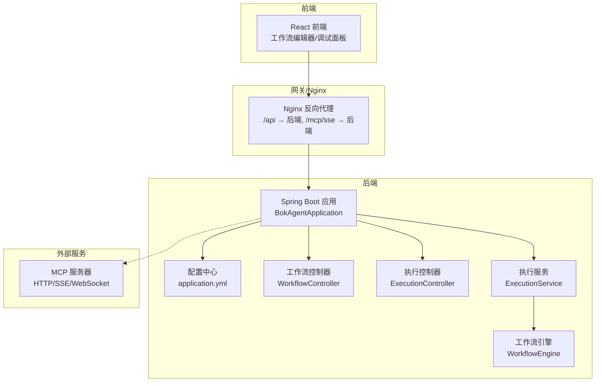
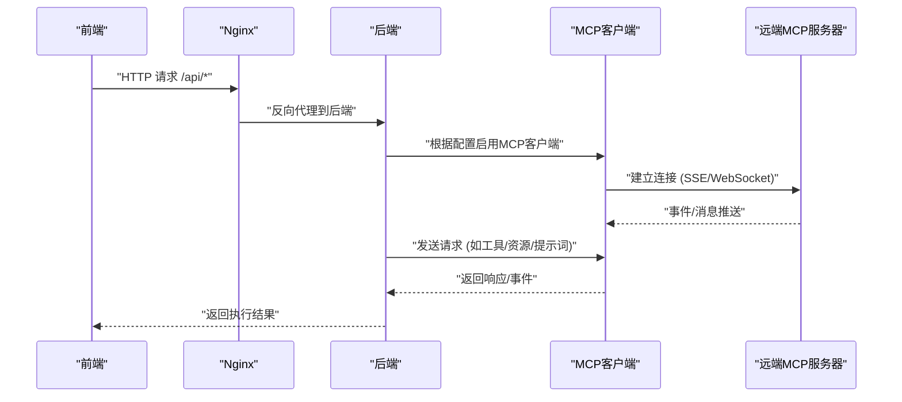
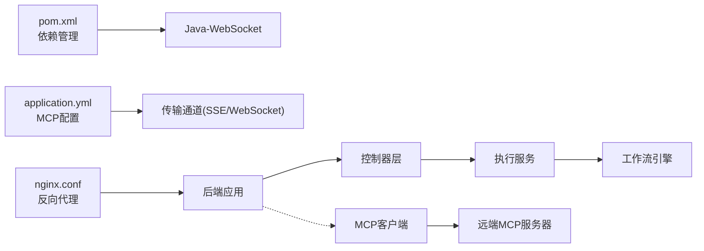

# MCP客户端集成

<cite>
**本文引用的文件**
- [README.md](file://README.md)
- [QUICKSTART.md](file://QUICKSTART.md)
- [IMPLEMENTATION_PROGRESS.md](file://IMPLEMENTATION_PROGRESS.md)
- [docker-compose.yml](file://docker/docker-compose.yml)
- [nginx.conf](file://docker/nginx.conf)
- [application.yml](file://backend/src/main/resources/application.yml)
- [BokAgentApplication.java](file://backend/src/main/java/com/bokagent/BokAgentApplication.java)
- [WorkflowController.java](file://backend/src/main/java/com/bokagent/controller/WorkflowController.java)
- [ExecutionController.java](file://backend/src/main/java/com/bokagent/controller/ExecutionController.java)
- [pom.xml](file://backend/pom.xml)
- [WorkflowEngine.java](file://backend/src/main/java/com/bokagent/engine/WorkflowEngine.java)
- [ExecutionService.java](file://backend/src/main/java/com/bokagent/service/ExecutionService.java)
</cite>

## 目录
1. [简介](#简介)
2. [项目结构](#项目结构)
3. [核心组件](#核心组件)
4. [架构总览](#架构总览)
5. [详细组件分析](#详细组件分析)
6. [依赖关系分析](#依赖关系分析)
7. [性能考量](#性能考量)
8. [故障排查指南](#故障排查指南)
9. [结论](#结论)
10. [附录](#附录)

## 简介
本文件面向希望在BokAgent系统中集成MCP（Model Context Protocol）客户端的开发者，提供从架构设计、配置管理、消息处理、连接管理到扩展与测试的完整技术文档。当前仓库已具备MCP服务端能力与相关配置，MCP客户端能力尚在规划与实现阶段。本文将基于现有配置与依赖，给出MCP客户端的集成蓝图、最佳实践与落地建议。

## 项目结构
BokAgent采用前后端分离架构，后端基于Spring Boot 3.5，前端基于React 18，MCP协议通过HTTP/SSE与WebSocket提供服务端能力。MCP客户端集成的目标是：以统一的客户端实现连接远端MCP服务器、发送请求、接收事件、处理错误与超时，并支持扩展自定义消息类型与处理逻辑。

图表来源
- [docker-compose.yml:1-132](file://docker/docker-compose.yml#L1-L132)
- [nginx.conf:1-55](file://docker/nginx.conf#L1-L55)
- [application.yml:116-137](file://backend/src/main/resources/application.yml#L116-L137)
- [BokAgentApplication.java:16-43](file://backend/src/main/java/com/bokagent/BokAgentApplication.java#L16-L43)
- [WorkflowController.java:16-20](file://backend/src/main/java/com/bokagent/controller/WorkflowController.java#L16-L20)
- [ExecutionController.java:16-20](file://backend/src/main/java/com/bokagent/controller/ExecutionController.java#L16-L20)
- [ExecutionService.java:20-32](file://backend/src/main/java/com/bokagent/service/ExecutionService.java#L20-L32)
- [WorkflowEngine.java:14-21](file://backend/src/main/java/com/bokagent/engine/WorkflowEngine.java#L14-L21)

章节来源
- [README.md:1-106](file://README.md#L1-L106)
- [docker-compose.yml:1-132](file://docker/docker-compose.yml#L1-L132)
- [nginx.conf:1-55](file://docker/nginx.conf#L1-L55)
- [application.yml:116-137](file://backend/src/main/resources/application.yml#L116-L137)
- [BokAgentApplication.java:16-56](file://backend/src/main/java/com/bokagent/BokAgentApplication.java#L16-L56)
- [WorkflowController.java:16-20](file://backend/src/main/java/com/bokagent/controller/WorkflowController.java#L16-L20)
- [ExecutionController.java:16-20](file://backend/src/main/java/com/bokagent/controller/ExecutionController.java#L16-L20)
- [ExecutionService.java:20-32](file://backend/src/main/java/com/bokagent/service/ExecutionService.java#L20-L32)
- [WorkflowEngine.java:14-21](file://backend/src/main/java/com/bokagent/engine/WorkflowEngine.java#L14-L21)

## 核心组件
- 配置中心：MCP服务端启用、传输通道（SSE/WebSocket）、客户端开关与服务器列表等均在配置文件中集中管理。
- 控制器层：提供工作流与执行记录的REST接口，作为前端与后端执行引擎之间的桥梁。
- 执行服务：协调工作流引擎与数据库，负责执行生命周期管理与状态持久化。
- 工作流引擎：负责解析图数据、构建节点映射与邻接表、按拓扑顺序执行节点、管理上下文传递。
- 网关与反向代理：Nginx负责将/api与/mcp/sse路由至后端，保证UTF-8字符集与WebSocket升级。

章节来源
- [application.yml:116-137](file://backend/src/main/resources/application.yml#L116-L137)
- [WorkflowController.java:25-47](file://backend/src/main/java/com/bokagent/controller/WorkflowController.java#L25-L47)
- [ExecutionController.java:25-47](file://backend/src/main/java/com/bokagent/controller/ExecutionController.java#L25-L47)
- [ExecutionService.java:33-44](file://backend/src/main/java/com/bokagent/service/ExecutionService.java#L33-L44)
- [WorkflowEngine.java:32-48](file://backend/src/main/java/com/bokagent/engine/WorkflowEngine.java#L32-L48)
- [nginx.conf:20-54](file://docker/nginx.conf#L20-L54)

## 架构总览
下图展示了MCP客户端在系统中的位置与交互路径：前端通过Nginx将请求转发至后端；后端根据配置决定是否启用MCP客户端，并与远端MCP服务器建立连接（SSE/WebSocket）。执行服务在工作流执行过程中可触发MCP请求，实现与外部工具/资源的交互。

图表来源
- [nginx.conf:20-54](file://docker/nginx.conf#L20-L54)
- [application.yml:116-137](file://backend/src/main/resources/application.yml#L116-L137)

## 详细组件分析

### 配置管理（MCP客户端）
- 服务端启用与能力声明：MCP服务端在配置中启用，声明tools/resources/prompts等能力，并开启SSE与WebSocket传输通道。
- 客户端启用与服务器列表：MCP客户端开关与服务器列表预留，便于后续接入多个远端MCP服务器。
- 超时与重试策略：系统提供统一的超时配置（含MCP请求超时），以及通用重试策略，可用于MCP客户端的请求控制。
- 编码与国际化：全链路UTF-8配置确保MCP消息中的文本内容正确传输与显示。

章节来源
- [application.yml:116-137](file://backend/src/main/resources/application.yml#L116-L137)
- [application.yml:149-155](file://backend/src/main/resources/application.yml#L149-L155)
- [application.yml:138-147](file://backend/src/main/resources/application.yml#L138-L147)
- [BokAgentApplication.java:22-34](file://backend/src/main/java/com/bokagent/BokAgentApplication.java#L22-L34)

### 连接建立与传输通道
- SSE通道：配置中提供/mcp/sse路径，Nginx将其代理至后端，适合事件驱动的单向推送场景。
- WebSocket通道：配置中提供/mcp/ws路径，Nginx对Upgrade头部进行处理，适合双向实时通信。
- 客户端实现要点：MCP客户端应根据配置选择合适的传输通道，建立连接后订阅事件，发送请求并处理响应。

章节来源
- [application.yml:126-132](file://backend/src/main/resources/application.yml#L126-L132)
- [nginx.conf:45-54](file://docker/nginx.conf#L45-L54)

### 消息发送与事件监听
- 请求构建：MCP客户端需根据消息类型（如工具调用、资源请求、提示词）构造请求负载，遵循MCP协议规范。
- 响应解析：对服务器返回的响应进行解析，区分成功与错误，并提取必要的上下文数据。
- 事件监听：在SSE/WebSocket通道上监听服务器推送的事件，及时更新内部状态或触发后续动作。
- 错误处理与超时控制：结合系统超时配置与通用重试策略，对网络异常、解析失败等情况进行处理。

章节来源
- [application.yml:149-155](file://backend/src/main/resources/application.yml#L149-L155)
- [application.yml:138-147](file://backend/src/main/resources/application.yml#L138-L147)

### 连接管理（建立、断线检测、自动重连、优雅关闭）
- 连接建立：根据配置选择SSE或WebSocket，建立连接并进行握手。
- 断线检测：通过心跳/超时检测、异常捕获等方式识别断线。
- 自动重连：在断线后按指数退避策略进行重连，避免频繁重试造成压力。
- 优雅关闭：在应用关闭或切换目标服务器时，先停止发送新请求，再等待未完成请求完成或超时后释放连接。

章节来源
- [application.yml:138-147](file://backend/src/main/resources/application.yml#L138-L147)
- [pom.xml:115-120](file://backend/pom.xml#L115-L120)

### 执行服务与工作流引擎的协作
- 执行服务在工作流执行过程中可触发MCP请求，实现与外部工具/资源的交互。
- 工作流引擎负责解析图数据、构建节点映射与邻接表、按拓扑顺序执行节点、管理上下文传递，MCP客户端可作为其中的一个节点或外部扩展点参与执行。

章节来源
- [ExecutionService.java:33-44](file://backend/src/main/java/com/bokagent/service/ExecutionService.java#L33-L44)
- [WorkflowEngine.java:32-48](file://backend/src/main/java/com/bokagent/engine/WorkflowEngine.java#L32-L48)

### 扩展机制（自定义消息类型与处理逻辑）
- 消息类型扩展：在MCP客户端中增加新的消息类型枚举与序列化/反序列化逻辑。
- 处理逻辑扩展：为每种消息类型注册对应的处理器，实现请求构建、响应解析与事件分发。
- 配置化管理：通过配置文件控制启用的消息类型与目标服务器，便于灰度与回滚。

章节来源
- [application.yml:134-137](file://backend/src/main/resources/application.yml#L134-L137)

### 完整集成示例（语言与实现思路）
说明：本节提供各语言的实现思路与参考路径，不直接展示具体代码内容。

- JavaScript（浏览器/Node.js）
  - 传输通道：优先使用WebSocket；若不可用则回退至SSE。
  - 连接建立：根据配置初始化连接，处理onopen/onmessage/onerror/onclose。
  - 请求发送：封装请求对象，发送至/mcp/ws或/mcp/sse。
  - 事件监听：解析事件负载，更新UI或触发后续动作。
  - 参考路径：[application.yml:126-132](file://backend/src/main/resources/application.yml#L126-L132)，[nginx.conf:45-54](file://docker/nginx.conf#L45-L54)

- Python
  - 传输通道：使用websockets库建立WebSocket连接；使用requests库处理SSE。
  - 连接管理：实现重连与心跳，结合超时配置控制请求生命周期。
  - 请求与响应：序列化/反序列化MCP消息，处理错误与异常。
  - 参考路径：[application.yml:149-155](file://backend/src/main/resources/application.yml#L149-L155)，[pom.xml:115-120](file://backend/pom.xml#L115-L120)

- Java（后端集成）
  - 传输通道：WebSocket客户端（Java-WebSocket）或HTTP客户端+SSE。
  - 连接管理：在Spring环境中以Bean形式管理，支持自动装配与配置注入。
  - 请求与响应：结合Jackson进行JSON处理，结合全局异常与日志体系。
  - 参考路径：[pom.xml:115-120](file://backend/pom.xml#L115-L120)，[BokAgentApplication.java:16-43](file://backend/src/main/java/com/bokagent/BokAgentApplication.java#L16-L43)

章节来源
- [application.yml:126-132](file://backend/src/main/resources/application.yml#L126-L132)
- [application.yml:149-155](file://backend/src/main/resources/application.yml#L149-L155)
- [pom.xml:115-120](file://backend/pom.xml#L115-L120)
- [BokAgentApplication.java:16-43](file://backend/src/main/java/com/bokagent/BokAgentApplication.java#L16-L43)

### 调试与测试方法
- 连接状态验证
  - 健康检查：访问后端健康端点确认服务可用。
  - Nginx代理验证：确认/mcp/sse与/ws代理正确。
  - 前端调试：在调试面板中观察MCP事件与请求响应。
- 消息传递验证
  - 通过最小工作流触发MCP请求，观察响应与事件。
  - 使用抓包工具（如浏览器开发者工具、Wireshark）验证SSE/WebSocket消息。
- 错误与超时验证
  - 模拟网络异常与超时，验证重试与降级策略。
  - 检查日志输出，定位异常原因。

章节来源
- [docker-compose.yml:88-114](file://docker/docker-compose.yml#L88-L114)
- [nginx.conf:20-54](file://docker/nginx.conf#L20-L54)
- [application.yml:149-155](file://backend/src/main/resources/application.yml#L149-L155)

## 依赖关系分析
MCP客户端的实现依赖于后端的配置与传输通道，以及前端的代理与界面交互。下图展示了主要依赖关系：

图表来源
- [pom.xml:115-120](file://backend/pom.xml#L115-L120)
- [application.yml:116-137](file://backend/src/main/resources/application.yml#L116-L137)
- [nginx.conf:20-54](file://docker/nginx.conf#L20-L54)
- [WorkflowController.java:16-20](file://backend/src/main/java/com/bokagent/controller/WorkflowController.java#L16-L20)
- [ExecutionController.java:16-20](file://backend/src/main/java/com/bokagent/controller/ExecutionController.java#L16-L20)
- [ExecutionService.java:20-32](file://backend/src/main/java/com/bokagent/service/ExecutionService.java#L20-L32)
- [WorkflowEngine.java:14-21](file://backend/src/main/java/com/bokagent/engine/WorkflowEngine.java#L14-L21)

章节来源
- [pom.xml:115-120](file://backend/pom.xml#L115-L120)
- [application.yml:116-137](file://backend/src/main/resources/application.yml#L116-L137)
- [nginx.conf:20-54](file://docker/nginx.conf#L20-L54)
- [WorkflowController.java:16-20](file://backend/src/main/java/com/bokagent/controller/WorkflowController.java#L16-L20)
- [ExecutionController.java:16-20](file://backend/src/main/java/com/bokagent/controller/ExecutionController.java#L16-L20)
- [ExecutionService.java:20-32](file://backend/src/main/java/com/bokagent/service/ExecutionService.java#L20-L32)
- [WorkflowEngine.java:14-21](file://backend/src/main/java/com/bokagent/engine/WorkflowEngine.java#L14-L21)

## 性能考量
- 连接池与并发：合理配置连接池大小与并发数，避免过多连接导致资源争用。
- 超时与背压：结合系统超时配置，对慢响应进行快速失败与限流。
- 缓存策略：对重复请求的结果进行缓存，减少往返次数。
- 日志与监控：开启必要的日志级别与指标采集，便于定位性能瓶颈。

## 故障排查指南
- 服务端健康检查
  - 通过后端健康端点确认服务状态。
- 代理与路由
  - 检查Nginx配置，确保/mcp/sse与/ws正确代理。
- 编码问题
  - 确认全链路UTF-8配置生效，避免中文与特殊字符乱码。
- MCP连接问题
  - 检查MCP客户端配置与远端服务器可达性，验证SSE/WebSocket握手。
- 执行异常
  - 查看执行服务与工作流引擎的日志，定位异常节点与错误原因。

章节来源
- [docker-compose.yml:88-114](file://docker/docker-compose.yml#L88-L114)
- [nginx.conf:20-54](file://docker/nginx.conf#L20-L54)
- [BokAgentApplication.java:22-54](file://backend/src/main/java/com/bokagent/BokAgentApplication.java#L22-L54)
- [ExecutionService.java:33-44](file://backend/src/main/java/com/bokagent/service/ExecutionService.java#L33-L44)
- [WorkflowEngine.java:32-48](file://backend/src/main/java/com/bokagent/engine/WorkflowEngine.java#L32-L48)

## 结论
本文件基于现有配置与依赖，给出了MCP客户端在BokAgent系统中的集成蓝图：以配置为中心的传输通道选择、以服务层为核心的执行编排、以扩展机制支撑的自定义消息类型与处理逻辑。建议在实现MCP客户端时，严格遵循系统的超时与重试策略，完善连接管理与事件处理，并通过充分的测试与监控保障稳定性与可观测性。

## 附录
- 快速开始与部署：参考快速开始指南，完成环境变量配置与Docker一键部署。
- 配置参考：MCP服务端与客户端配置、超时与重试策略、日志级别等。

章节来源
- [QUICKSTART.md:1-205](file://QUICKSTART.md#L1-L205)
- [application.yml:116-137](file://backend/src/main/resources/application.yml#L116-L137)
- [application.yml:138-155](file://backend/src/main/resources/application.yml#L138-L155)
- [IMPLEMENTATION_PROGRESS.md:171-185](file://IMPLEMENTATION_PROGRESS.md#L171-L185)