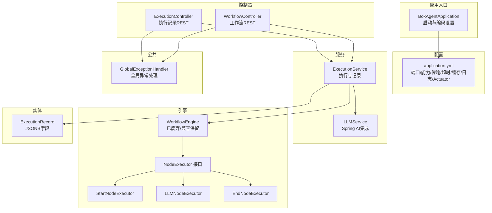
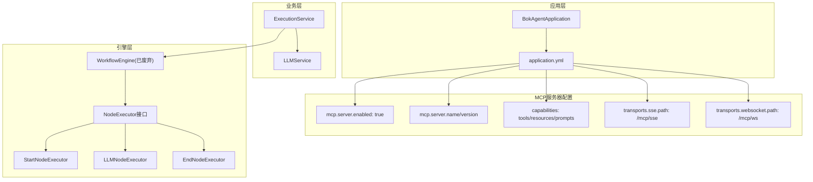
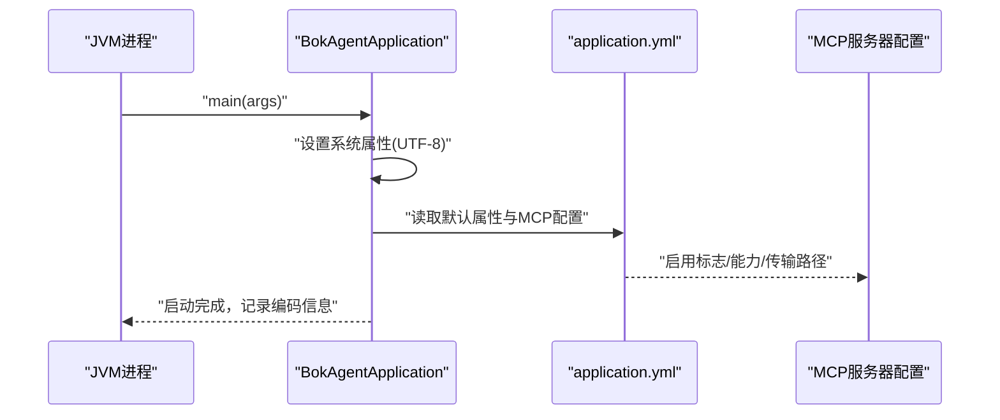
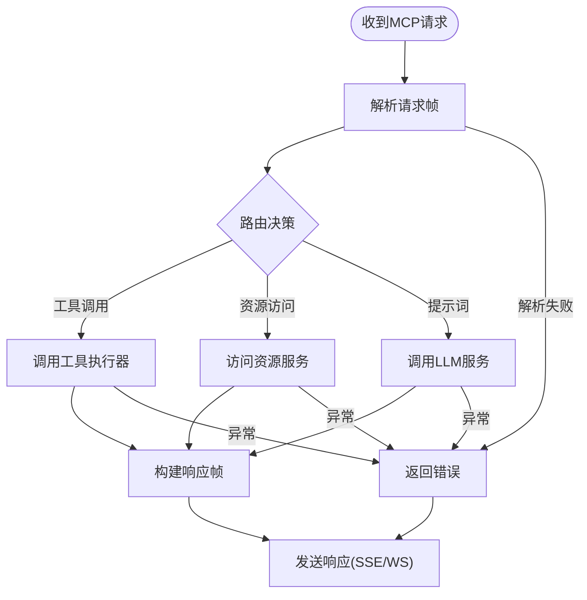
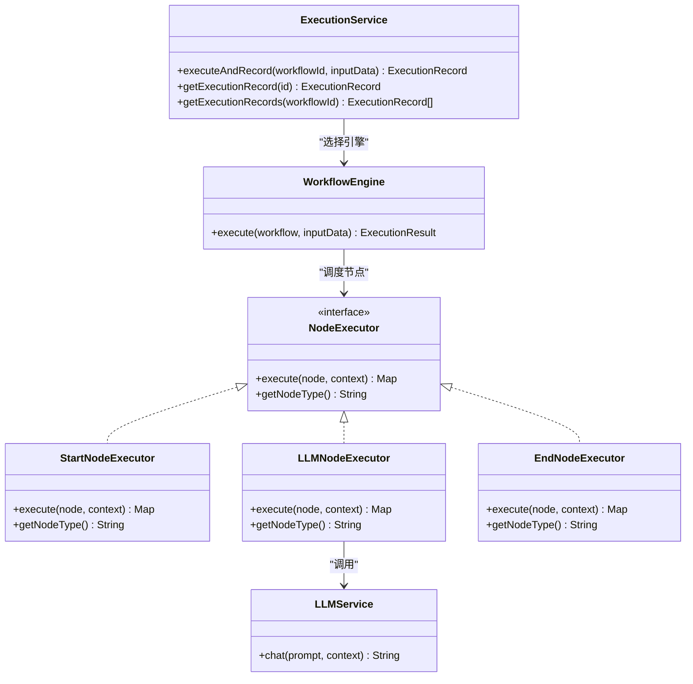
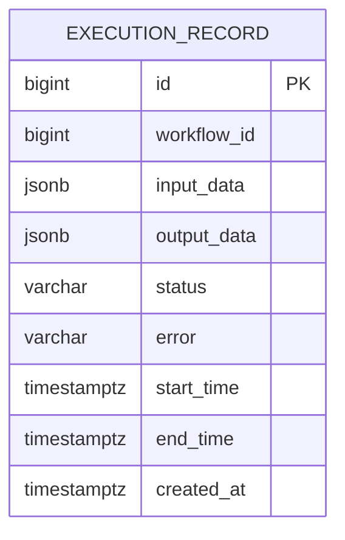
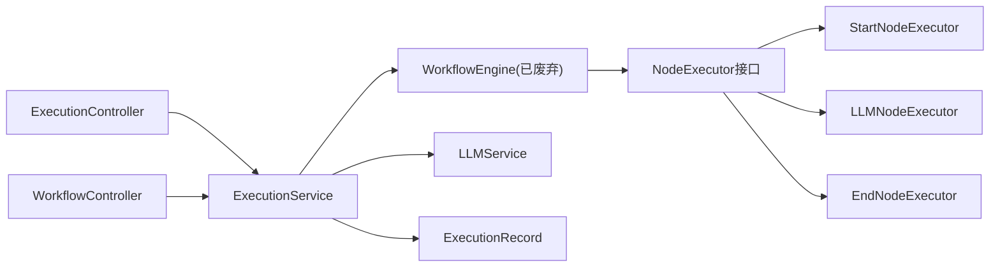

# MCP服务器实现

<cite>
**本文引用的文件**
- [BokAgentApplication.java](file://backend/src/main/java/com/bokagent/BokAgentApplication.java)
- [application.yml](file://backend/src/main/resources/application.yml)
- [ExecutionController.java](file://backend/src/main/java/com/bokagent/controller/ExecutionController.java)
- [WorkflowController.java](file://backend/src/main/java/com/bokagent/controller/WorkflowController.java)
- [GlobalExceptionHandler.java](file://backend/src/main/java/com/bokagent/common/GlobalExceptionHandler.java)
- [ExecutionService.java](file://backend/src/main/java/com/bokagent/service/ExecutionService.java)
- [LLMService.java](file://backend/src/main/java/com/bokagent/service/LLMService.java)
- [WorkflowEngine.java](file://backend/src/main/java/com/bokagent/engine/WorkflowEngine.java)
- [NodeExecutor.java](file://backend/src/main/java/com/bokagent/engine/NodeExecutor.java)
- [StartNodeExecutor.java](file://backend/src/main/java/com/bokagent/engine/StartNodeExecutor.java)
- [LLMNodeExecutor.java](file://backend/src/main/java/com/bokagent/engine/LLMNodeExecutor.java)
- [EndNodeExecutor.java](file://backend/src/main/java/com/bokagent/engine/EndNodeExecutor.java)
- [ExecutionRecord.java](file://backend/src/main/java/com/bokagent/entity/ExecutionRecord.java)
</cite>

## 目录
1. [简介](#简介)
2. [项目结构](#项目结构)
3. [核心组件](#核心组件)
4. [架构总览](#架构总览)
5. [详细组件分析](#详细组件分析)
6. [依赖分析](#依赖分析)
7. [性能考虑](#性能考虑)
8. [故障排查指南](#故障排查指南)
9. [结论](#结论)
10. [附录](#附录)

## 简介
本文件面向开发者与运维人员，系统性梳理该MCP服务器实现的架构设计与实现细节，重点覆盖以下方面：
- 传输层：WebSocket 与 Server-Sent Events 的启用与路径配置
- 服务器启动与配置：端口、能力声明、传输层开关与路径
- 消息路由：请求分发、响应处理、错误传播
- 状态管理：连接生命周期、会话跟踪、资源清理
- 完整实现示例：连接处理、消息解析、业务逻辑调用
- 性能优化：并发处理、内存管理、网络优化
- 监控与调试：日志级别、Actuator指标、异常处理
- 部署建议：容器化、环境变量、超时与缓存策略

## 项目结构
后端采用 Spring Boot 应用，核心模块包括：
- 应用入口与启动配置
- 控制器层（REST API）
- 服务层（工作流执行、LLM调用）
- 引擎层（工作流节点执行器）
- 实体与持久化（MyBatis-Plus）
- 公共异常处理

图表来源
- [BokAgentApplication.java:1-56](file://backend/src/main/java/com/bokagent/BokAgentApplication.java#L1-L56)
- [application.yml:1-190](file://backend/src/main/resources/application.yml#L1-L190)
- [ExecutionController.java:1-81](file://backend/src/main/java/com/bokagent/controller/ExecutionController.java#L1-L81)
- [WorkflowController.java:1-92](file://backend/src/main/java/com/bokagent/controller/WorkflowController.java#L1-L92)
- [ExecutionService.java:1-113](file://backend/src/main/java/com/bokagent/service/ExecutionService.java#L1-L113)
- [LLMService.java:1-67](file://backend/src/main/java/com/bokagent/service/LLMService.java#L1-L67)
- [WorkflowEngine.java:1-171](file://backend/src/main/java/com/bokagent/engine/WorkflowEngine.java#L1-L171)
- [NodeExecutor.java:1-24](file://backend/src/main/java/com/bokagent/engine/NodeExecutor.java#L1-L24)
- [StartNodeExecutor.java:1-41](file://backend/src/main/java/com/bokagent/engine/StartNodeExecutor.java#L1-L41)
- [LLMNodeExecutor.java:1-69](file://backend/src/main/java/com/bokagent/engine/LLMNodeExecutor.java#L1-L69)
- [EndNodeExecutor.java:1-41](file://backend/src/main/java/com/bokagent/engine/EndNodeExecutor.java#L1-L41)
- [ExecutionRecord.java:1-40](file://backend/src/main/java/com/bokagent/entity/ExecutionRecord.java#L1-L40)
- [GlobalExceptionHandler.java:1-37](file://backend/src/main/java/com/bokagent/common/GlobalExceptionHandler.java#L1-L37)

章节来源
- [BokAgentApplication.java:1-56](file://backend/src/main/java/com/bokagent/BokAgentApplication.java#L1-L56)
- [application.yml:116-137](file://backend/src/main/resources/application.yml#L116-L137)

## 核心组件
- 应用入口与启动
  - 设置 JVM 字符集为 UTF-8，确保中文与 Emoji 正常显示
  - 通过 SpringApplicationBuilder 设置默认属性，强制启用 UTF-8
- 配置中心
  - 服务器端口、Servlet 编码、Spring 应用名
  - 数据源（PostgreSQL）、Redis、Flyway 迁移
  - Spring AI OpenAI/DeepSeek/Qwen 配置
  - Jackson 序列化/反序列化策略
  - 异步任务线程池
  - MCP 服务器配置：启用标志、名称、版本、能力声明、传输层（SSE/WebSocket）路径
  - 超时与重试策略
  - 缓存 TTL
  - 日志级别与文件输出
  - Actuator 指标暴露
- 控制器层
  - 执行记录 REST API：分页/详情/创建/更新
  - 工作流 REST API：列表/详情/创建/更新/删除
- 服务层
  - 执行服务：工作流执行与执行记录写入
  - LLM 服务：基于 Spring AI ChatClient 的多模型调用封装
- 引擎层
  - 工作流引擎（已标注为废弃，保留兼容）
  - 节点执行器接口与三种具体实现：开始、LLM、结束
- 实体层
  - 执行记录实体，使用 JSONB 类型处理器存储 Map 结构的输入/输出数据
- 公共异常处理
  - 统一异常返回与日志记录

章节来源
- [BokAgentApplication.java:21-43](file://backend/src/main/java/com/bokagent/BokAgentApplication.java#L21-L43)
- [application.yml:1-190](file://backend/src/main/resources/application.yml#L1-L190)
- [ExecutionController.java:25-80](file://backend/src/main/java/com/bokagent/controller/ExecutionController.java#L25-L80)
- [WorkflowController.java:25-91](file://backend/src/main/java/com/bokagent/controller/WorkflowController.java#L25-L91)
- [ExecutionService.java:39-92](file://backend/src/main/java/com/bokagent/service/ExecutionService.java#L39-L92)
- [LLMService.java:27-44](file://backend/src/main/java/com/bokagent/service/LLMService.java#L27-L44)
- [WorkflowEngine.java:47-82](file://backend/src/main/java/com/bokagent/engine/WorkflowEngine.java#L47-L82)
- [NodeExecutor.java:9-23](file://backend/src/main/java/com/bokagent/engine/NodeExecutor.java#L9-L23)
- [StartNodeExecutor.java:17-34](file://backend/src/main/java/com/bokagent/engine/StartNodeExecutor.java#L17-L34)
- [LLMNodeExecutor.java:22-61](file://backend/src/main/java/com/bokagent/engine/LLMNodeExecutor.java#L22-L61)
- [EndNodeExecutor.java:17-33](file://backend/src/main/java/com/bokagent/engine/EndNodeExecutor.java#L17-L33)
- [ExecutionRecord.java:19-39](file://backend/src/main/java/com/bokagent/entity/ExecutionRecord.java#L19-L39)
- [GlobalExceptionHandler.java:16-35](file://backend/src/main/java/com/bokagent/common/GlobalExceptionHandler.java#L16-L35)

## 架构总览
MCP 服务器在本项目中以“能力声明 + 传输层路径”的形式存在，当前仓库未包含实际的 MCP 协议实现代码。但配置文件已明确启用 MCP 服务器，并声明了工具、资源、提示词三类能力，同时启用了 SSE 与 WebSocket 两种传输方式及其路径。

图表来源
- [application.yml:116-137](file://backend/src/main/resources/application.yml#L116-L137)
- [BokAgentApplication.java:19-43](file://backend/src/main/java/com/bokagent/BokAgentApplication.java#L19-L43)
- [ExecutionService.java:39-63](file://backend/src/main/java/com/bokagent/service/ExecutionService.java#L39-L63)
- [LLMService.java:18-35](file://backend/src/main/java/com/bokagent/service/LLMService.java#L18-L35)
- [WorkflowEngine.java:32-39](file://backend/src/main/java/com/bokagent/engine/WorkflowEngine.java#L32-L39)
- [NodeExecutor.java:9-23](file://backend/src/main/java/com/bokagent/engine/NodeExecutor.java#L9-L23)
- [StartNodeExecutor.java:17-34](file://backend/src/main/java/com/bokagent/engine/StartNodeExecutor.java#L17-L34)
- [LLMNodeExecutor.java:22-48](file://backend/src/main/java/com/bokagent/engine/LLMNodeExecutor.java#L22-L48)
- [EndNodeExecutor.java:17-33](file://backend/src/main/java/com/bokagent/engine/EndNodeExecutor.java#L17-L33)

## 详细组件分析

### MCP 服务器配置与启动流程
- 启动阶段
  - 设置 JVM 编码为 UTF-8，避免中文与特殊字符乱码
  - Spring Boot 应用启动，加载 application.yml 中的默认属性
- MCP 服务器配置
  - 启用标志、服务器名称与版本
  - 能力声明：tools、resources、prompts
  - 传输层：SSE 与 WebSocket 均启用，分别绑定到 /mcp/sse 与 /mcp/ws
- 传输层路径与能力声明
  - SSE 路径：/mcp/sse
  - WebSocket 路径：/mcp/ws
- 超时与重试
  - MCP 请求超时 10 秒
  - 默认重试策略：最大尝试次数、初始延迟、退避倍数、最大延迟、可重试异常类型

图表来源
- [BokAgentApplication.java:21-43](file://backend/src/main/java/com/bokagent/BokAgentApplication.java#L21-L43)
- [application.yml:116-137](file://backend/src/main/resources/application.yml#L116-L137)

章节来源
- [BokAgentApplication.java:21-43](file://backend/src/main/java/com/bokagent/BokAgentApplication.java#L21-L43)
- [application.yml:116-155](file://backend/src/main/resources/application.yml#L116-L155)

### 消息路由机制（概念性说明）
由于当前仓库未包含 MCP 协议的具体实现代码，以下为概念性流程说明，便于开发者在后续扩展时参考：
- 请求分发
  - SSE/WebSocket 连接建立后，服务器接收客户端请求帧
  - 根据请求类型（如工具调用、资源访问、提示词请求）进行路由
- 响应处理
  - 业务服务执行完成后，将结果封装为 MCP 响应帧
  - 通过 SSE 流式推送或 WebSocket 发送至客户端
- 错误传播
  - 任何环节出现异常，统一由全局异常处理器捕获
  - 返回标准化错误响应，包含状态码与错误信息

（本图为概念性流程，不对应具体源码文件）

### 状态管理（连接池、会话、资源清理）
- 连接生命周期
  - SSE：基于 HTTP 长连接，按需推送事件；断开即释放
  - WebSocket：全双工长连接，需要心跳与断连检测
- 会话跟踪
  - 建议在传输层为每个连接分配唯一会话标识，记录连接建立时间、最后活动时间
- 资源清理
  - 连接关闭时清理会话上下文、取消异步任务、释放缓冲区
  - 使用超时与重试策略避免资源泄露

（本节为通用实践说明，不直接分析具体文件）

### 业务执行链路（工作流引擎）
- 执行服务
  - 创建执行记录，标记状态为 RUNNING
  - 选择工作流引擎，执行工作流，收集执行结果
  - 更新执行记录状态为 SUCCESS 或 FAILED，并记录耗时
- 引擎与节点执行器
  - 节点执行器接口定义统一执行契约
  - 开始节点：初始化上下文
  - LLM 节点：调用 LLM 服务生成回复并回填上下文
  - 结束节点：汇总最终输出
- LLM 服务
  - 基于 Spring AI ChatClient，支持多模型（OpenAI/DeepSeek/Qwen）
  - 构建完整提示词（上下文 + 用户提示），调用模型并返回内容

图表来源
- [ExecutionService.java:39-92](file://backend/src/main/java/com/bokagent/service/ExecutionService.java#L39-L92)
- [WorkflowEngine.java:47-82](file://backend/src/main/java/com/bokagent/engine/WorkflowEngine.java#L47-L82)
- [NodeExecutor.java:9-23](file://backend/src/main/java/com/bokagent/engine/NodeExecutor.java#L9-L23)
- [StartNodeExecutor.java:17-34](file://backend/src/main/java/com/bokagent/engine/StartNodeExecutor.java#L17-L34)
- [LLMNodeExecutor.java:22-61](file://backend/src/main/java/com/bokagent/engine/LLMNodeExecutor.java#L22-L61)
- [EndNodeExecutor.java:17-33](file://backend/src/main/java/com/bokagent/engine/EndNodeExecutor.java#L17-L33)
- [LLMService.java:27-44](file://backend/src/main/java/com/bokagent/service/LLMService.java#L27-L44)

章节来源
- [ExecutionService.java:39-92](file://backend/src/main/java/com/bokagent/service/ExecutionService.java#L39-L92)
- [WorkflowEngine.java:47-82](file://backend/src/main/java/com/bokagent/engine/WorkflowEngine.java#L47-L82)
- [NodeExecutor.java:9-23](file://backend/src/main/java/com/bokagent/engine/NodeExecutor.java#L9-L23)
- [StartNodeExecutor.java:17-34](file://backend/src/main/java/com/bokagent/engine/StartNodeExecutor.java#L17-L34)
- [LLMNodeExecutor.java:22-61](file://backend/src/main/java/com/bokagent/engine/LLMNodeExecutor.java#L22-L61)
- [EndNodeExecutor.java:17-33](file://backend/src/main/java/com/bokagent/engine/EndNodeExecutor.java#L17-L33)
- [LLMService.java:27-44](file://backend/src/main/java/com/bokagent/service/LLMService.java#L27-L44)

### 数据模型（执行记录）
- 字段说明
  - 主键自增
  - 关联工作流 ID
  - 输入/输出数据：使用 JSONB 类型处理器存储 Map 结构
  - 状态：RUNNING/SUCCESS/FAILED
  - 错误信息与时间戳
- 存储与查询
  - 通过 MyBatis-Plus Mapper 进行 CRUD
  - 支持按工作流 ID 查询执行记录列表（当前实现为全量查询，可扩展条件）

图表来源
- [ExecutionRecord.java:19-39](file://backend/src/main/java/com/bokagent/entity/ExecutionRecord.java#L19-L39)

章节来源
- [ExecutionRecord.java:19-39](file://backend/src/main/java/com/bokagent/entity/ExecutionRecord.java#L19-L39)

## 依赖分析
- 组件耦合
  - 控制器依赖服务层；服务层依赖引擎与 LLM 服务
  - 引擎层依赖节点执行器接口，具体实现通过 Spring 自动装配
  - 执行记录实体通过 JSONB 类型处理器与数据库交互
- 外部依赖
  - Spring Boot、Spring MVC、MyBatis-Plus、Flyway
  - Spring AI（OpenAI/DeepSeek/Qwen）
  - PostgreSQL、Redis
  - Actuator 指标暴露

图表来源
- [ExecutionController.java:22-23](file://backend/src/main/java/com/bokagent/controller/ExecutionController.java#L22-L23)
- [WorkflowController.java:22-23](file://backend/src/main/java/com/bokagent/controller/WorkflowController.java#L22-L23)
- [ExecutionService.java:24-31](file://backend/src/main/java/com/bokagent/service/ExecutionService.java#L24-L31)
- [WorkflowEngine.java:23-30](file://backend/src/main/java/com/bokagent/engine/WorkflowEngine.java#L23-L30)
- [NodeExecutor.java:9-23](file://backend/src/main/java/com/bokagent/engine/NodeExecutor.java#L9-L23)
- [StartNodeExecutor.java:15](file://backend/src/main/java/com/bokagent/engine/StartNodeExecutor.java#L15)
- [LLMNodeExecutor.java:19-20](file://backend/src/main/java/com/bokagent/engine/LLMNodeExecutor.java#L19-L20)
- [EndNodeExecutor.java:14](file://backend/src/main/java/com/bokagent/engine/EndNodeExecutor.java#L14)
- [ExecutionRecord.java:16](file://backend/src/main/java/com/bokagent/entity/ExecutionRecord.java#L16)

章节来源
- [ExecutionController.java:22-23](file://backend/src/main/java/com/bokagent/controller/ExecutionController.java#L22-L23)
- [WorkflowController.java:22-23](file://backend/src/main/java/com/bokagent/controller/WorkflowController.java#L22-L23)
- [ExecutionService.java:24-31](file://backend/src/main/java/com/bokagent/service/ExecutionService.java#L24-L31)
- [WorkflowEngine.java:23-30](file://backend/src/main/java/com/bokagent/engine/WorkflowEngine.java#L23-L30)
- [NodeExecutor.java:9-23](file://backend/src/main/java/com/bokagent/engine/NodeExecutor.java#L9-L23)
- [StartNodeExecutor.java:15](file://backend/src/main/java/com/bokagent/engine/StartNodeExecutor.java#L15)
- [LLMNodeExecutor.java:19-20](file://backend/src/main/java/com/bokagent/engine/LLMNodeExecutor.java#L19-L20)
- [EndNodeExecutor.java:14](file://backend/src/main/java/com/bokagent/engine/EndNodeExecutor.java#L14)
- [ExecutionRecord.java:16](file://backend/src/main/java/com/bokagent/entity/ExecutionRecord.java#L16)

## 性能考虑
- 并发处理
  - 异步任务线程池：虚拟线程类型、核心/最大线程数、队列容量
  - 建议：根据 CPU 核心数与 I/O 密集度调整线程池参数
- 内存管理
  - Jackson 配置：非空字段序列化、日期格式、未知字段容错
  - JSONB 存储 Map 数据，注意避免过大的上下文导致内存峰值
- 网络优化
  - SSE：适合单向事件推送，低开销
  - WebSocket：双向通信，适合频繁交互场景
  - 超时与重试：合理设置 MCP 请求超时与重试策略，避免阻塞
- 缓存策略
  - 默认缓存 TTL 1 小时，工具结果 30 分钟，LLM 响应 2 小时
  - 建议：对热点数据启用缓存，结合失效策略降低后端压力

章节来源
- [application.yml:82-89](file://backend/src/main/resources/application.yml#L82-L89)
- [application.yml:68-75](file://backend/src/main/resources/application.yml#L68-L75)
- [application.yml:158-163](file://backend/src/main/resources/application.yml#L158-L163)
- [application.yml:149-155](file://backend/src/main/resources/application.yml#L149-L155)

## 故障排查指南
- 全局异常处理
  - 捕获 Exception、IllegalArgumentException、RuntimeException
  - 返回标准化错误响应，记录日志
- 日志与监控
  - 日志级别：root/INFO，应用包/外部框架 DEBUG
  - 文件输出：大小限制与历史天数
  - Actuator：健康检查、指标暴露
- 常见问题定位
  - 编码问题：确认 JVM 与 Servlet 编码均为 UTF-8
  - 数据库连接：检查 PostgreSQL 地址、凭据与连接池配置
  - LLM 调用：核对 API Key、Base URL 与模型配置
  - MCP 传输：确认 SSE/WebSocket 路径是否正确暴露

章节来源
- [GlobalExceptionHandler.java:16-35](file://backend/src/main/java/com/bokagent/common/GlobalExceptionHandler.java#L16-L35)
- [application.yml:164-190](file://backend/src/main/resources/application.yml#L164-L190)
- [BokAgentApplication.java:45-54](file://backend/src/main/java/com/bokagent/BokAgentApplication.java#L45-L54)

## 结论
本项目提供了清晰的启动配置与业务骨架，MCP 服务器的能力声明与传输层路径已在配置中明确。当前仓库未包含 MCP 协议的具体实现代码，建议在后续迭代中：
- 补充 MCP 协议实现（SSE/WebSocket）
- 明确消息路由与错误传播机制
- 完善连接池与会话管理
- 加强监控与可观测性

## 附录
- 部署建议
  - 使用 Docker Compose 启动后端与数据库/缓存
  - 通过环境变量覆盖数据库、Redis、LLM 等敏感配置
  - 在生产环境开启 HTTPS 与限流策略
- 开发建议
  - 为 MCP 传输层增加心跳与断连重试
  - 对热点工作流与 LLM 调用引入缓存
  - 使用 Actuator 指标与日志聚合平台进行监控