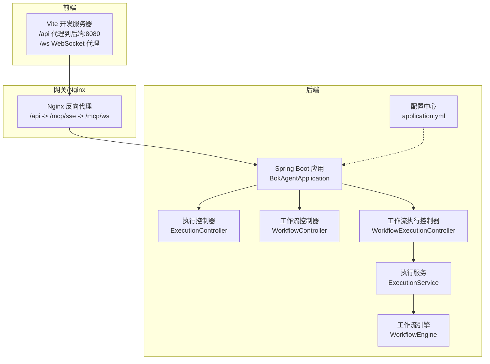
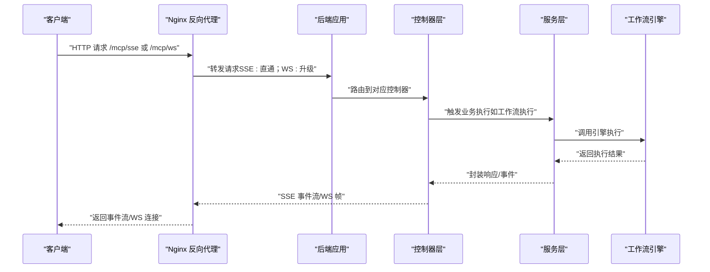
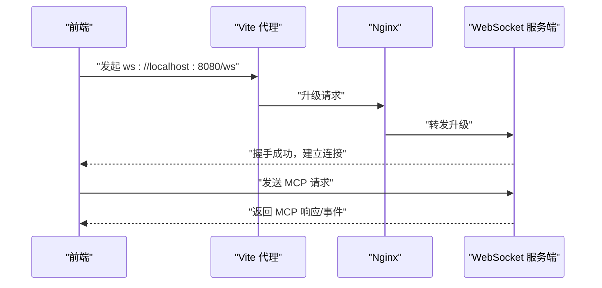
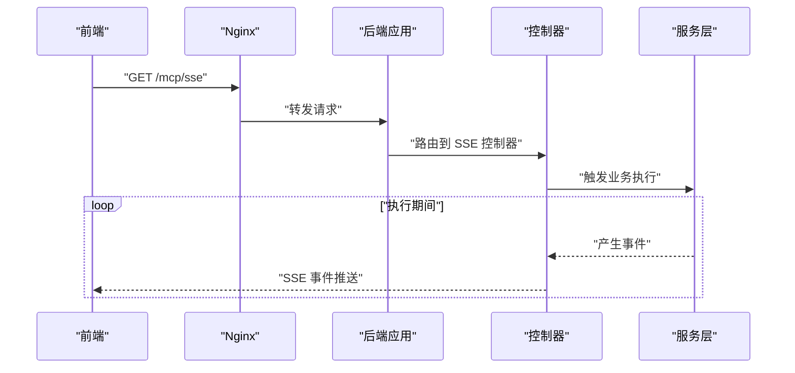
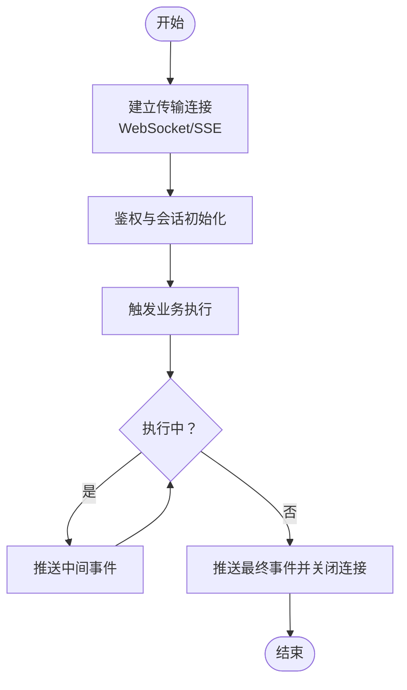
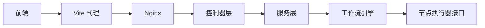

# 传输层实现

<cite>
**本文引用的文件**
- [BokAgentApplication.java](file://backend/src/main/java/com/bokagent/BokAgentApplication.java)
- [application.yml](file://backend/src/main/resources/application.yml)
- [nginx.conf](file://docker/nginx.conf)
- [vite.config.ts](file://frontend/vite.config.ts)
- [ExecutionController.java](file://backend/src/main/java/com/bokagent/controller/ExecutionController.java)
- [WorkflowController.java](file://backend/src/main/java/com/bokagent/controller/WorkflowController.java)
- [WorkflowExecutionController.java](file://backend/src/main/java/com/bokagent/controller/WorkflowExecutionController.java)
- [ExecutionService.java](file://backend/src/main/java/com/bokagent/service/ExecutionService.java)
- [ExecutionRecord.java](file://backend/src/main/java/com/bokagent/entity/ExecutionRecord.java)
- [Result.java](file://backend/src/main/java/com/bokagent/common/Result.java)
- [WorkflowEngine.java](file://backend/src/main/java/com/bokagent/engine/WorkflowEngine.java)
- [NodeExecutor.java](file://backend/src/main/java/com/bokagent/engine/NodeExecutor.java)
- [pom.xml](file://backend/pom.xml)
</cite>

## 目录
1. [简介](#简介)
2. [项目结构](#项目结构)
3. [核心组件](#核心组件)
4. [架构总览](#架构总览)
5. [详细组件分析](#详细组件分析)
6. [依赖分析](#依赖分析)
7. [性能考虑](#性能考虑)
8. [故障排查指南](#故障排查指南)
9. [结论](#结论)
10. [附录](#附录)

## 简介
本文件面向MCP（Model Context Protocol）传输层的实现与使用，聚焦于后端对两种传输方式的支持：WebSocket与Server-Sent Events（SSE）。基于现有配置与基础设施，文档将从系统架构、组件关系、数据流与处理逻辑、集成点与错误处理、性能优化策略以及监控与调试方法等方面进行深入说明，并提供可落地的实现参考与最佳实践。

## 项目结构
后端采用Spring Boot工程，MCP相关配置集中在application.yml中；前端通过Vite开发服务器与Nginx反向代理对接后端。整体结构如下：

图表来源
- [BokAgentApplication.java:1-56](file://backend/src/main/java/com/bokagent/BokAgentApplication.java#L1-L56)
- [application.yml:116-137](file://backend/src/main/resources/application.yml#L116-L137)
- [nginx.conf:1-55](file://docker/nginx.conf#L1-L55)
- [vite.config.ts:1-20](file://frontend/vite.config.ts#L1-L20)

章节来源
- [BokAgentApplication.java:1-56](file://backend/src/main/java/com/bokagent/BokAgentApplication.java#L1-L56)
- [application.yml:116-137](file://backend/src/main/resources/application.yml#L116-L137)
- [nginx.conf:1-55](file://docker/nginx.conf#L1-L55)
- [vite.config.ts:1-20](file://frontend/vite.config.ts#L1-L20)

## 核心组件
- 配置层：MCP服务端启用与传输通道配置（SSE/WS），包含端点路径与能力声明。
- 控制器层：提供工作流执行与记录的REST接口，作为MCP传输层的业务入口。
- 服务层：封装执行流程与记录写入，为传输层提供事件源。
- 引擎层：工作流执行引擎，负责拓扑执行与上下文传递。
- 前端与网关：前端通过Vite代理至后端，Nginx负责升级与SSE直通。

章节来源
- [application.yml:116-137](file://backend/src/main/resources/application.yml#L116-L137)
- [ExecutionController.java:1-81](file://backend/src/main/java/com/bokagent/controller/ExecutionController.java#L1-L81)
- [WorkflowController.java:1-92](file://backend/src/main/java/com/bokagent/controller/WorkflowController.java#L1-L92)
- [WorkflowExecutionController.java:1-76](file://backend/src/main/java/com/bokagent/controller/WorkflowExecutionController.java#L1-L76)
- [ExecutionService.java:1-113](file://backend/src/main/java/com/bokagent/service/ExecutionService.java#L1-L113)
- [WorkflowEngine.java:1-171](file://backend/src/main/java/com/bokagent/engine/WorkflowEngine.java#L1-L171)

## 架构总览
MCP传输层的总体交互流程如下：

图表来源
- [nginx.conf:20-54](file://docker/nginx.conf#L20-L54)
- [WorkflowExecutionController.java:30-44](file://backend/src/main/java/com/bokagent/controller/WorkflowExecutionController.java#L30-L44)
- [ExecutionService.java:39-92](file://backend/src/main/java/com/bokagent/service/ExecutionService.java#L39-L92)
- [WorkflowEngine.java:47-82](file://backend/src/main/java/com/bokagent/engine/WorkflowEngine.java#L47-L82)

## 详细组件分析

### WebSocket 传输实现
- 连接建立
  - Nginx通过Upgrade/Connection头部将WebSocket请求转发至后端。
  - 前端开发服务器通过ws代理将/ ws请求转到ws://localhost:8080。
- 帧格式与消息序列化
  - 建议采用文本帧承载JSON消息，字段包含消息类型、负载与必要元数据。
- 连接生命周期
  - 建立后由后端维护会话，结合心跳与断线重连策略。
- 与业务集成
  - 通过控制器触发执行，服务层调用引擎，将执行结果以事件形式推送。

图表来源
- [vite.config.ts:14-17](file://frontend/vite.config.ts#L14-L17)
- [nginx.conf:36-43](file://docker/nginx.conf#L36-L43)

章节来源
- [vite.config.ts:1-20](file://frontend/vite.config.ts#L1-L20)
- [nginx.conf:36-43](file://docker/nginx.conf#L36-L43)

### Server-Sent Events 传输实现
- 事件推送机制
  - 后端以SSE模式持续推送事件，客户端以EventSource接收。
  - Nginx对/mcp/sse开启proxy_buffering off，确保事件实时性。
- 连接维持与断线重连
  - 建议客户端实现指数退避重连与last-event-id恢复。
- 与业务集成
  - 控制器触发执行，服务层调用引擎，将中间状态与最终结果以事件形式推送。

图表来源
- [nginx.conf:45-54](file://docker/nginx.conf#L45-L54)
- [WorkflowExecutionController.java:30-44](file://backend/src/main/java/com/bokagent/controller/WorkflowExecutionController.java#L30-L44)

章节来源
- [nginx.conf:45-54](file://docker/nginx.conf#L45-L54)
- [WorkflowExecutionController.java:1-76](file://backend/src/main/java/com/bokagent/controller/WorkflowExecutionController.java#L1-L76)

### 传输层配置参数
- 端点路径
  - SSE: /mcp/sse
  - WebSocket: /mcp/ws
- 连接超时
  - 通过Nginx与Spring Web的默认超时策略控制，建议在生产环境显式配置。
- 缓冲区大小
  - Nginx对SSE关闭proxy_buffering，避免事件延迟。
- 编码与字符集
  - 全链路UTF-8配置，确保中文与特殊字符正确传输。

章节来源
- [application.yml:116-137](file://backend/src/main/resources/application.yml#L116-L137)
- [nginx.conf:45-54](file://docker/nginx.conf#L45-L54)
- [BokAgentApplication.java:21-36](file://backend/src/main/java/com/bokagent/BokAgentApplication.java#L21-L36)

### 传输层实现示例（流程与要点）
以下为通用实现思路与关键步骤，便于在现有工程中落地：

- 连接处理
  - WebSocket：在后端注册WebSocket处理器，监听/ ws端点，建立会话并维护心跳。
  - SSE：在后端注册SSE端点，使用SseEmitter或类似机制推送事件。
- 消息编解码
  - 建议统一使用JSON格式，字段包含type、id、timestamp、payload等。
- 错误处理
  - 对连接异常、序列化错误、上游执行异常进行分类处理与反馈。
- 与业务集成
  - 在控制器中触发执行，服务层调用引擎，将执行状态与结果转换为事件推送。

（本图为概念流程示意，不直接映射具体源码）

### 传输层的性能优化策略
- 连接池管理
  - WebSocket连接池与Nginx上游连接数限制需匹配，避免过载。
- 消息批处理
  - SSE场景可合并事件，减少网络往返；WebSocket场景可批量帧聚合。
- 网络I/O优化
  - SSE关闭缓冲，保证低延迟；WebSocket启用压缩与合理的帧大小。
- 资源回收
  - 及时清理失效会话，避免内存泄漏；对长连接设置空闲超时。

（本节为通用性能建议，不直接分析具体文件）

### 传输层的监控指标与调试方法
- 指标建议
  - 连接数、消息吞吐量、事件延迟、错误率、会话存活时长。
- 调试方法
  - 启用后端日志级别，观察连接建立、事件推送与异常堆栈。
  - 前端使用浏览器开发者工具Network面板检查SSE/WS连接状态与事件流。
  - Nginx开启access/error日志，定位代理层问题。

章节来源
- [application.yml:164-190](file://backend/src/main/resources/application.yml#L164-L190)

## 依赖分析
- 外部依赖
  - WebSocket客户端：Java-WebSocket（用于客户端场景或测试）。
  - 前端代理：Vite的ws代理与Nginx反向代理。
- 内部耦合
  - 控制器依赖服务层；服务层依赖引擎；引擎依赖节点执行器接口。
  - 传输层与业务层通过控制器与服务层解耦。

图表来源
- [pom.xml:120-124](file://backend/pom.xml#L120-L124)
- [vite.config.ts:9-17](file://frontend/vite.config.ts#L9-L17)
- [nginx.conf:20-54](file://docker/nginx.conf#L20-L54)
- [WorkflowExecutionController.java:21-22](file://backend/src/main/java/com/bokagent/controller/WorkflowExecutionController.java#L21-L22)
- [ExecutionService.java:24-31](file://backend/src/main/java/com/bokagent/service/ExecutionService.java#L24-L31)
- [WorkflowEngine.java:23-31](file://backend/src/main/java/com/bokagent/engine/WorkflowEngine.java#L23-L31)
- [NodeExecutor.java:9-23](file://backend/src/main/java/com/bokagent/engine/NodeExecutor.java#L9-L23)

章节来源
- [pom.xml:120-124](file://backend/pom.xml#L120-L124)
- [vite.config.ts:1-20](file://frontend/vite.config.ts#L1-L20)
- [nginx.conf:1-55](file://docker/nginx.conf#L1-L55)
- [WorkflowExecutionController.java:1-76](file://backend/src/main/java/com/bokagent/controller/WorkflowExecutionController.java#L1-L76)
- [ExecutionService.java:1-113](file://backend/src/main/java/com/bokagent/service/ExecutionService.java#L1-L113)
- [WorkflowEngine.java:1-171](file://backend/src/main/java/com/bokagent/engine/WorkflowEngine.java#L1-L171)
- [NodeExecutor.java:1-24](file://backend/src/main/java/com/bokagent/engine/NodeExecutor.java#L1-L24)

## 性能考虑
- 连接与并发
  - 合理设置最大连接数与队列容量，避免阻塞。
- 事件与帧
  - SSE优先无缓冲；WebSocket分片与压缩策略需平衡CPU与带宽。
- 超时与重试
  - 显式配置请求超时与重试策略，避免资源泄露。
- 缓存与去重
  - 对重复事件进行去重与缓存，降低带宽占用。

（本节为通用性能建议，不直接分析具体文件）

## 故障排查指南
- 连接失败
  - 检查Nginx升级头配置与后端端口可达性。
- 事件不推送
  - 确认SSE端点未被缓冲，检查控制器与服务层执行链路。
- 编码问题
  - 核对全链路UTF-8配置，避免中文乱码。
- 异常处理
  - 利用统一响应包装与全局异常处理，快速定位错误来源。

章节来源
- [nginx.conf:20-54](file://docker/nginx.conf#L20-L54)
- [Result.java:1-42](file://backend/src/main/java/com/bokagent/common/Result.java#L1-L42)
- [BokAgentApplication.java:21-36](file://backend/src/main/java/com/bokagent/BokAgentApplication.java#L21-L36)

## 结论
本文基于现有配置与工程结构，系统梳理了MCP传输层在本项目中的实现要点与落地路径。通过明确WebSocket与SSE的连接与事件推送机制、配置参数、性能优化与监控调试方法，可为后续完善传输层提供清晰的参考与最佳实践。

## 附录
- 相关控制器与服务
  - 执行控制器、工作流控制器、工作流执行控制器、执行服务、执行记录实体、统一响应封装、工作流引擎与节点执行器接口。
- 依赖项
  - WebSocket客户端依赖、前端代理与Nginx反向代理配置。

章节来源
- [ExecutionController.java:1-81](file://backend/src/main/java/com/bokagent/controller/ExecutionController.java#L1-L81)
- [WorkflowController.java:1-92](file://backend/src/main/java/com/bokagent/controller/WorkflowController.java#L1-L92)
- [WorkflowExecutionController.java:1-76](file://backend/src/main/java/com/bokagent/controller/WorkflowExecutionController.java#L1-L76)
- [ExecutionService.java:1-113](file://backend/src/main/java/com/bokagent/service/ExecutionService.java#L1-L113)
- [ExecutionRecord.java:1-40](file://backend/src/main/java/com/bokagent/entity/ExecutionRecord.java#L1-L40)
- [Result.java:1-42](file://backend/src/main/java/com/bokagent/common/Result.java#L1-L42)
- [WorkflowEngine.java:1-171](file://backend/src/main/java/com/bokagent/engine/WorkflowEngine.java#L1-L171)
- [NodeExecutor.java:1-24](file://backend/src/main/java/com/bokagent/engine/NodeExecutor.java#L1-L24)
- [pom.xml:120-124](file://backend/pom.xml#L120-L124)