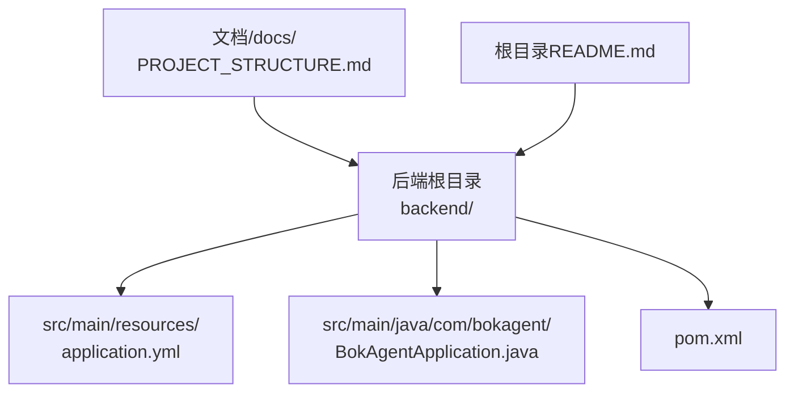
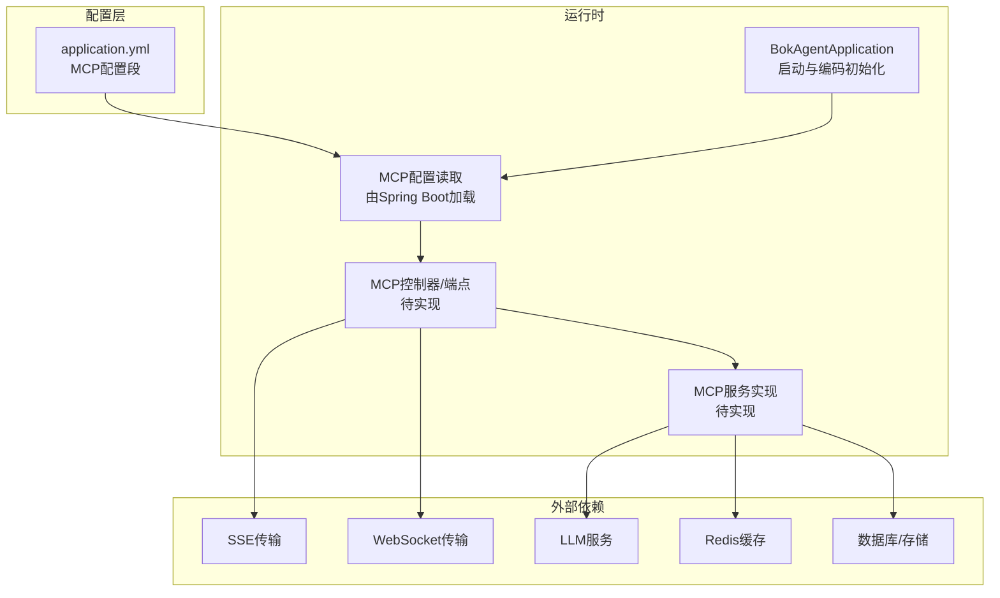
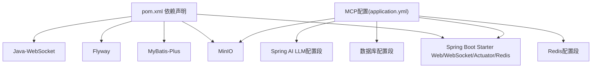

# 服务器配置管理

<cite>
**本文引用的文件**
- [application.yml](file://backend/src/main/resources/application.yml)
- [BokAgentApplication.java](file://backend/src/main/java/com/bokagent/BokAgentApplication.java)
- [pom.xml](file://backend/pom.xml)
- [README.md](file://README.md)
- [PROJECT_STRUCTURE.md](file://docs/PROJECT_STRUCTURE.md)
</cite>

## 目录
1. [简介](#简介)
2. [项目结构](#项目结构)
3. [核心组件](#核心组件)
4. [架构总览](#架构总览)
5. [详细组件分析](#详细组件分析)
6. [依赖分析](#依赖分析)
7. [性能考虑](#性能考虑)
8. [故障排除指南](#故障排除指南)
9. [结论](#结论)
10. [附录](#附录)

## 简介
本文件面向开发者与运维人员，系统化梳理后端配置体系，重点覆盖以下方面：
- MCP服务器配置：服务器基本信息、传输层配置、能力声明配置
- 配置参数的作用与影响：服务器名称、版本号、启用状态、路径设置
- 配置加载与验证机制：配置文件解析、参数校验、默认值处理
- 配置管理实现示例：配置类设计、配置注入、运行时更新
- 环境适配：不同环境差异、敏感信息保护、配置热更新
- 监控与诊断：配置有效性与完整性验证方法
- 最佳实践与故障排除

## 项目结构
后端采用Spring Boot标准结构，配置集中在application.yml中，主程序负责启动与编码初始化。

图表来源
- [application.yml:1-190](file://backend/src/main/resources/application.yml#L1-L190)
- [BokAgentApplication.java:1-56](file://backend/src/main/java/com/bokagent/BokAgentApplication.java#L1-L56)
- [pom.xml:1-175](file://backend/pom.xml#L1-L175)
- [PROJECT_STRUCTURE.md:25-110](file://docs/PROJECT_STRUCTURE.md#L25-L110)

章节来源
- [application.yml:1-190](file://backend/src/main/resources/application.yml#L1-L190)
- [BokAgentApplication.java:1-56](file://backend/src/main/java/com/bokagent/BokAgentApplication.java#L1-L56)
- [pom.xml:1-175](file://backend/pom.xml#L1-L175)
- [PROJECT_STRUCTURE.md:25-110](file://docs/PROJECT_STRUCTURE.md#L25-L110)

## 核心组件
本节聚焦MCP服务器配置的核心要素及其作用范围。

- 服务器基本信息
  - 启用开关：控制MCP服务是否对外暴露
  - 名称与版本：用于客户端识别与兼容性判断
- 能力声明配置
  - tools：是否支持工具调用
  - resources：是否支持资源检索
  - prompts：是否支持提示词管理
- 传输层配置
  - SSE与WebSocket路径：分别定义HTTP SSE与WebSocket接入路径
  - 启用状态：按需开启对应传输通道

章节来源
- [application.yml:116-137](file://backend/src/main/resources/application.yml#L116-L137)

## 架构总览
下图展示MCP配置在系统中的位置与关联模块：

图表来源
- [application.yml:116-137](file://backend/src/main/resources/application.yml#L116-L137)
- [BokAgentApplication.java:16-43](file://backend/src/main/java/com/bokagent/BokAgentApplication.java#L16-L43)

## 详细组件分析

### MCP服务器配置段落解析
- 顶层键：mcp.server
  - enabled：布尔值，决定是否启用MCP服务
  - name：字符串，MCP服务器显示名称
  - version：字符串，MCP服务器版本号
  - capabilities：能力声明对象
    - tools：布尔值，是否支持工具调用
    - resources：布尔值，是否支持资源检索
    - prompts：布尔值，是否支持提示词管理
  - transports：传输层配置对象
    - sse：SSE传输
      - enabled：布尔值
      - path：字符串，SSE接入路径
    - websocket：WebSocket传输
      - enabled：布尔值
      - path：字符串，WebSocket接入路径

章节来源
- [application.yml:116-137](file://backend/src/main/resources/application.yml#L116-L137)

### MCP客户端配置段落解析
- 顶层键：mcp.client
  - enabled：布尔值，是否启用MCP客户端模式
  - servers：数组，目标MCP服务器列表（初始为空）

章节来源
- [application.yml:134-137](file://backend/src/main/resources/application.yml#L134-L137)

### 配置加载与验证机制
- 配置文件解析
  - Spring Boot自动加载application.yml，支持占位符与环境变量替换
  - 通过${ENV_VAR:default}语法实现默认值与环境覆盖
- 参数校验
  - YAML结构校验由Spring Boot在启动时进行
  - 类型不匹配会触发启动失败，便于早期发现错误
- 默认值处理
  - 在主程序中通过setDefaultProperties设置默认字符集等属性
  - 保证系统层面的编码一致性

章节来源
- [application.yml:13-14](file://backend/src/main/resources/application.yml#L13-L14)
- [BokAgentApplication.java:26-34](file://backend/src/main/java/com/bokagent/BokAgentApplication.java#L26-L34)

### 配置注入与运行时更新
- 配置注入
  - 使用@ConfigurationProperties或@Value读取mcp.server.*与mcp.client.*键值
  - 将其注入到MCP控制器与服务实现中
- 运行时更新
  - 对于静态配置（如服务器名称、版本、能力），建议重启生效
  - 对于动态参数（如超时、缓存TTL），可通过Spring的@RefreshScope或Actuator的/actuator/refresh端点实现热更新
  - 注意：传输路径变更通常需要重启以确保路由一致

章节来源
- [application.yml:116-137](file://backend/src/main/resources/application.yml#L116-L137)
- [application.yml:138-162](file://backend/src/main/resources/application.yml#L138-L162)
- [application.yml:181-190](file://backend/src/main/resources/application.yml#L181-L190)

### 环境适配与敏感信息保护
- 不同环境差异
  - 开发环境：SPRING_PROFILES_ACTIVE=dev，数据库与第三方服务指向本地或沙箱
  - 生产环境：通过环境变量覆盖数据库、缓存、LLM等敏感配置
- 敏感信息保护
  - 使用环境变量注入API Key与密码，避免硬编码
  - 在Docker Compose中集中管理密钥与凭据
- 配置热更新
  - 结合Spring Cloud Bus或Actuator刷新端点，实现非停机更新部分配置

章节来源
- [application.yml:13-14](file://backend/src/main/resources/application.yml#L13-L14)
- [application.yml:17-21](file://backend/src/main/resources/application.yml#L17-L21)
- [application.yml:33-43](file://backend/src/main/resources/application.yml#L33-L43)
- [application.yml:45-67](file://backend/src/main/resources/application.yml#L45-L67)
- [application.yml:110-114](file://backend/src/main/resources/application.yml#L110-L114)
- [application.yml:181-190](file://backend/src/main/resources/application.yml#L181-L190)

### 监控与诊断
- 健康检查
  - Actuator暴露health端点，结合show-details策略控制详情可见性
- 配置有效性验证
  - 启动日志中打印编码信息，确认UTF-8生效
  - 通过日志级别与输出路径验证日志配置
- 配置完整性检查
  - 校验MCP配置段是否存在且字段齐全
  - 校验传输路径唯一性与可用性

章节来源
- [application.yml:181-190](file://backend/src/main/resources/application.yml#L181-L190)
- [BokAgentApplication.java:45-54](file://backend/src/main/java/com/bokagent/BokAgentApplication.java#L45-L54)

### 配置管理最佳实践
- 分层配置
  - 将通用配置放入application.yml，环境特定配置通过环境变量覆盖
- 命名规范
  - 使用语义化命名，如mcp.server.name、mcp.server.capabilities.tools
- 版本化管理
  - MCP版本号随功能迭代同步更新，便于客户端兼容判断
- 安全基线
  - 所有敏感信息必须来自环境变量，禁止提交至版本库
- 可观测性
  - 通过Actuator与日志配置，确保配置变更可追踪

章节来源
- [application.yml:116-137](file://backend/src/main/resources/application.yml#L116-L137)
- [application.yml:164-180](file://backend/src/main/resources/application.yml#L164-L180)
- [application.yml:181-190](file://backend/src/main/resources/application.yml#L181-L190)

## 依赖分析
后端依赖Spring Boot生态与相关中间件，MCP配置与以下模块存在间接耦合关系：

图表来源
- [pom.xml:30-132](file://backend/pom.xml#L30-L132)
- [application.yml:16-67](file://backend/src/main/resources/application.yml#L16-L67)
- [application.yml:116-137](file://backend/src/main/resources/application.yml#L116-L137)

章节来源
- [pom.xml:1-175](file://backend/pom.xml#L1-L175)
- [application.yml:1-190](file://backend/src/main/resources/application.yml#L1-L190)

## 性能考虑
- 传输层选择
  - SSE适合事件推送与低延迟场景；WebSocket适合双向交互与高并发
  - 合理设置传输路径，避免与其他REST接口冲突
- 超时与重试
  - MCP请求超时与工具执行超时应与上游客户端保持一致
  - 重试策略需避免雪崩效应，合理设置最大尝试次数与退避间隔
- 缓存策略
  - 利用默认TTL与专用TTL减少重复计算与网络调用
- 日志与监控
  - 控制日志级别，避免生产环境产生过多I/O
  - 使用Actuator指标评估配置对性能的影响

章节来源
- [application.yml:138-162](file://backend/src/main/resources/application.yml#L138-L162)
- [application.yml:164-180](file://backend/src/main/resources/application.yml#L164-L180)
- [application.yml:181-190](file://backend/src/main/resources/application.yml#L181-L190)

## 故障排除指南
- 启动失败
  - 检查application.yml语法与缩进
  - 核对必需环境变量是否设置（如数据库、Redis、LLM API Key）
- 编码问题
  - 确认JVM与系统编码已在启动时设置为UTF-8
  - 查看启动日志中的编码信息输出
- MCP不可用
  - 确认mcp.server.enabled为true
  - 校验transports.sse.path与websocket.path未被其他路由占用
- 性能异常
  - 检查超时与重试配置是否合理
  - 关注Actuator指标与日志告警

章节来源
- [BokAgentApplication.java:21-54](file://backend/src/main/java/com/bokagent/BokAgentApplication.java#L21-L54)
- [application.yml:116-137](file://backend/src/main/resources/application.yml#L116-L137)
- [application.yml:138-162](file://backend/src/main/resources/application.yml#L138-L162)
- [application.yml:181-190](file://backend/src/main/resources/application.yml#L181-L190)

## 结论
本文件从配置文件结构、加载机制、注入方式、环境适配、监控诊断与最佳实践六个维度，全面阐述了MCP服务器配置管理方案。建议在实际落地时：
- 明确各环境的配置边界与覆盖策略
- 将敏感信息严格隔离于环境变量
- 通过Actuator与日志建立完整的可观测性
- 对关键配置变更制定灰度与回滚预案

## 附录
- 快速参考：MCP配置键路径
  - mcp.server.enabled
  - mcp.server.name
  - mcp.server.version
  - mcp.server.capabilities.tools
  - mcp.server.capabilities.resources
  - mcp.server.capabilities.prompts
  - mcp.server.transports.sse.enabled
  - mcp.server.transports.sse.path
  - mcp.server.transports.websocket.enabled
  - mcp.server.transports.websocket.path
  - mcp.client.enabled
  - mcp.client.servers

章节来源
- [application.yml:116-137](file://backend/src/main/resources/application.yml#L116-L137)