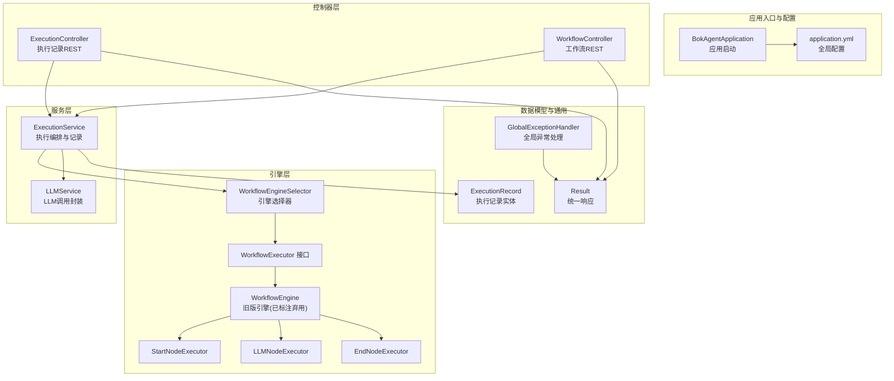
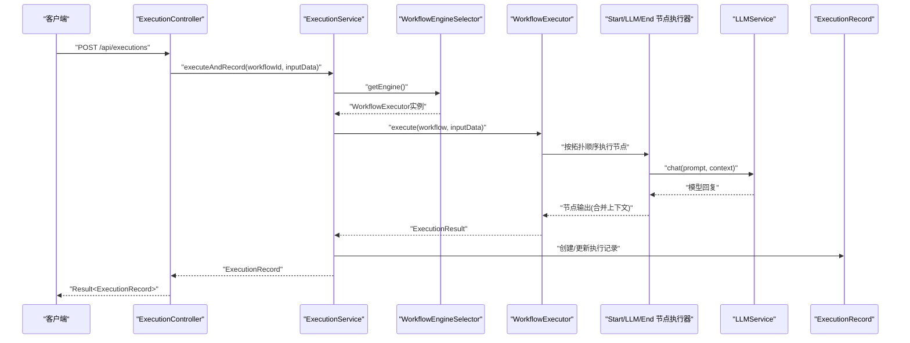
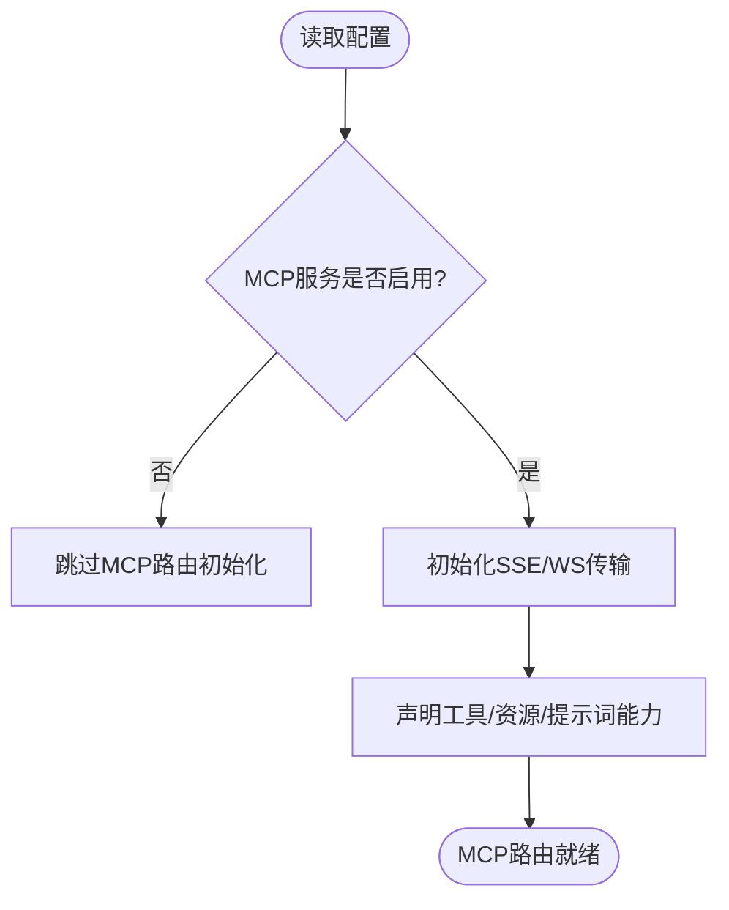
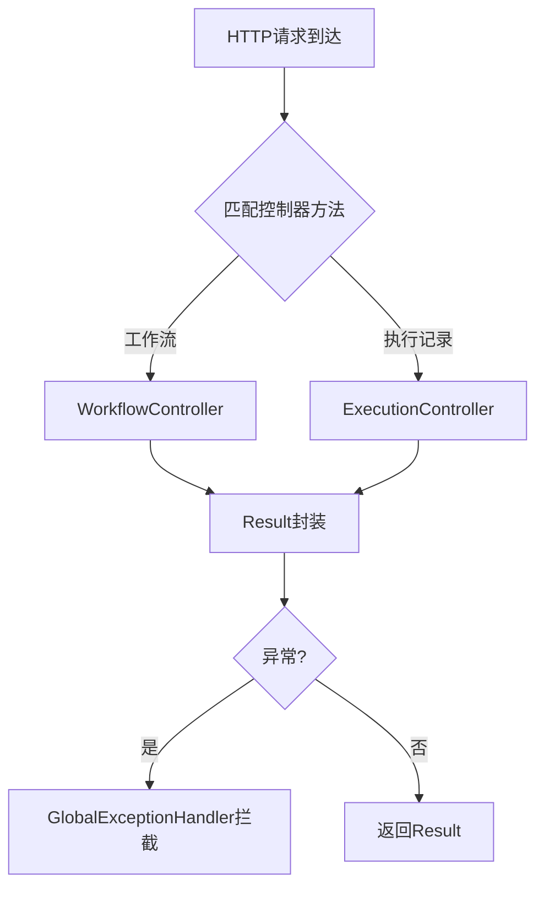
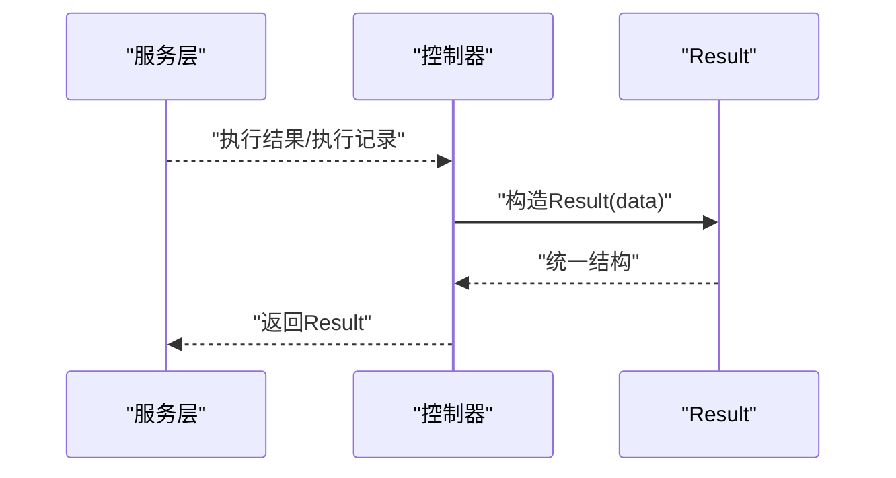
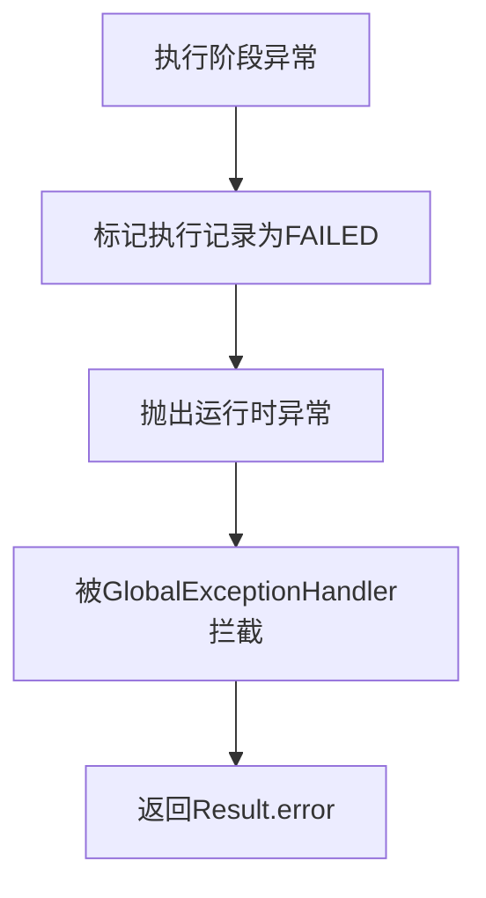
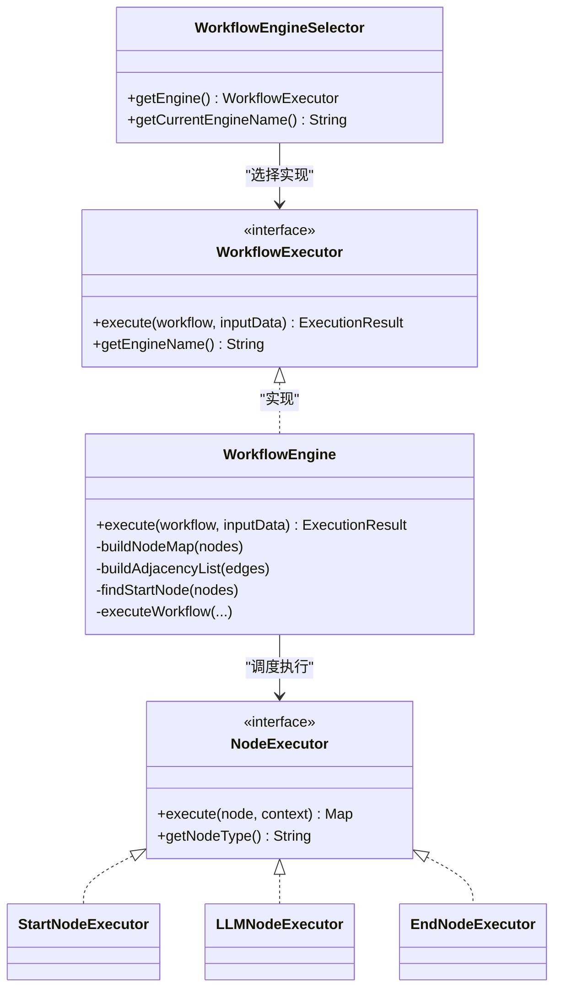
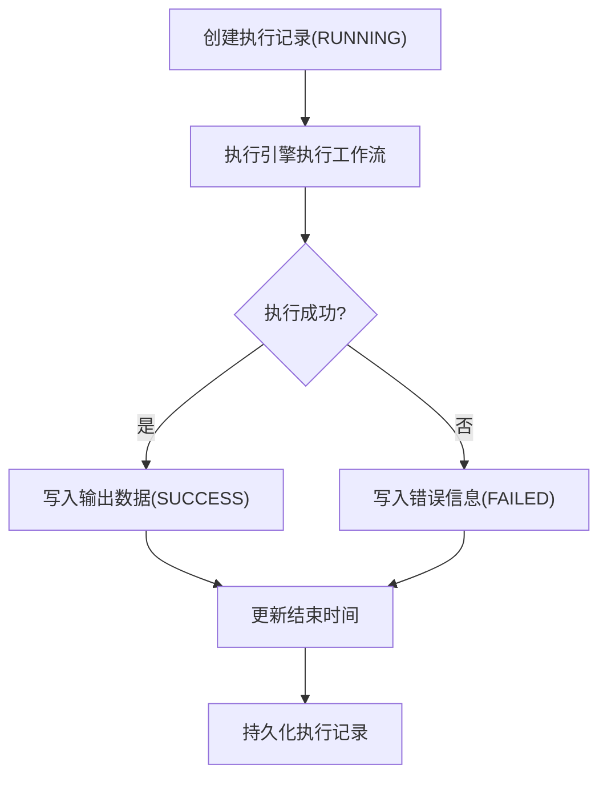
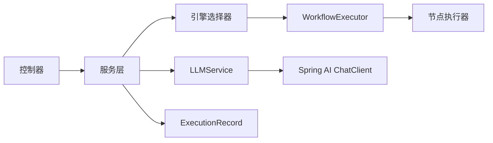

# 消息路由机制

<cite>
**本文引用的文件**
- [BokAgentApplication.java](file://backend/src/main/java/com/bokagent/BokAgentApplication.java)
- [application.yml](file://backend/src/main/resources/application.yml)
- [ExecutionController.java](file://backend/src/main/java/com/bokagent/controller/ExecutionController.java)
- [WorkflowController.java](file://backend/src/main/java/com/bokagent/controller/WorkflowController.java)
- [ExecutionService.java](file://backend/src/main/java/com/bokagent/service/ExecutionService.java)
- [LLMService.java](file://backend/src/main/java/com/bokagent/service/LLMService.java)
- [WorkflowEngine.java](file://backend/src/main/java/com/bokagent/engine/WorkflowEngine.java)
- [WorkflowEngineSelector.java](file://backend/src/main/java/com/bokagent/engine/WorkflowEngineSelector.java)
- [WorkflowExecutor.java](file://backend/src/main/java/com/bokagent/engine/WorkflowExecutor.java)
- [NodeExecutor.java](file://backend/src/main/java/com/bokagent/engine/NodeExecutor.java)
- [StartNodeExecutor.java](file://backend/src/main/java/com/bokagent/engine/StartNodeExecutor.java)
- [LLMNodeExecutor.java](file://backend/src/main/java/com/bokagent/engine/LLMNodeExecutor.java)
- [EndNodeExecutor.java](file://backend/src/main/java/com/bokagent/engine/EndNodeExecutor.java)
- [ExecutionRecord.java](file://backend/src/main/java/com/bokagent/entity/ExecutionRecord.java)
- [Result.java](file://backend/src/main/java/com/bokagent/common/Result.java)
- [GlobalExceptionHandler.java](file://backend/src/main/java/com/bokagent/common/GlobalExceptionHandler.java)
</cite>

## 目录
1. [引言](#引言)
2. [项目结构](#项目结构)
3. [核心组件](#核心组件)
4. [架构总览](#架构总览)
5. [详细组件分析](#详细组件分析)
6. [依赖分析](#依赖分析)
7. [性能考虑](#性能考虑)
8. [故障排查指南](#故障排查指南)
9. [结论](#结论)
10. [附录](#附录)

## 引言
本文件面向开发者与运维人员，系统性阐述本项目的“消息路由机制”。在当前代码库中，“消息路由”主要体现在以下方面：
- 基于MCP协议的传输层能力：通过配置启用SSE与WebSocket传输通道，承载工具、资源、提示词等消息。
- 工作流执行的消息流转：从HTTP入口接收请求，经由控制器、服务层、工作流引擎与节点执行器，最终将结果写入执行记录。
- 统一响应与异常处理：通过统一结果封装与全局异常处理器，确保消息路由过程中的错误可追踪、可观测。

本文件将深入解释消息路由的请求分发策略、响应匹配机制、错误传播路径；梳理配置项（路由规则、优先级、负载均衡）；阐述状态管理（会话跟踪、消息队列、超时处理）；给出实现示例与最佳实践，并提供监控与调试建议。

## 项目结构
后端采用Spring Boot工程，核心模块划分如下：
- 应用入口与配置：应用启动类、全局配置文件
- 控制器层：HTTP REST接口，负责请求接入与响应封装
- 服务层：业务编排与执行记录管理
- 引擎层：工作流执行器与节点执行器
- 实体与通用工具：数据模型与统一响应、异常处理

图表来源
- [BokAgentApplication.java:1-56](file://backend/src/main/java/com/bokagent/BokAgentApplication.java#L1-L56)
- [application.yml:116-137](file://backend/src/main/resources/application.yml#L116-L137)
- [ExecutionController.java:16-81](file://backend/src/main/java/com/bokagent/controller/ExecutionController.java#L16-L81)
- [WorkflowController.java:16-92](file://backend/src/main/java/com/bokagent/controller/WorkflowController.java#L16-L92)
- [ExecutionService.java:21-113](file://backend/src/main/java/com/bokagent/service/ExecutionService.java#L21-L113)
- [LLMService.java:14-67](file://backend/src/main/java/com/bokagent/service/LLMService.java#L14-L67)
- [WorkflowEngineSelector.java:14-52](file://backend/src/main/java/com/bokagent/engine/WorkflowEngineSelector.java#L14-L52)
- [WorkflowExecutor.java:10-25](file://backend/src/main/java/com/bokagent/engine/WorkflowExecutor.java#L10-L25)
- [WorkflowEngine.java:18-171](file://backend/src/main/java/com/bokagent/engine/WorkflowEngine.java#L18-L171)
- [StartNodeExecutor.java:13-41](file://backend/src/main/java/com/bokagent/engine/StartNodeExecutor.java#L13-L41)
- [LLMNodeExecutor.java:12-69](file://backend/src/main/java/com/bokagent/engine/LLMNodeExecutor.java#L12-L69)
- [EndNodeExecutor.java:10-41](file://backend/src/main/java/com/bokagent/engine/EndNodeExecutor.java#L10-L41)
- [ExecutionRecord.java:12-40](file://backend/src/main/java/com/bokagent/entity/ExecutionRecord.java#L12-L40)
- [Result.java:5-42](file://backend/src/main/java/com/bokagent/common/Result.java#L5-L42)
- [GlobalExceptionHandler.java:9-37](file://backend/src/main/java/com/bokagent/common/GlobalExceptionHandler.java#L9-L37)

章节来源
- [BokAgentApplication.java:19-43](file://backend/src/main/java/com/bokagent/BokAgentApplication.java#L19-L43)
- [application.yml:116-156](file://backend/src/main/resources/application.yml#L116-L156)

## 核心组件
- MCP服务器配置：在配置文件中启用MCP服务端能力，声明SSE与WebSocket传输路径，以及工具、资源、提示词等能力开关。
- 统一响应与异常处理：Result封装标准响应结构；GlobalExceptionHandler对异常进行分类处理并返回统一格式。
- 控制器层：提供工作流与执行记录的REST接口，负责请求参数校验与响应封装。
- 服务层：执行服务负责工作流执行与执行记录的创建、更新与查询。
- 引擎层：引擎选择器根据配置动态选择引擎实现；工作流引擎负责拓扑执行与上下文传递；节点执行器负责具体节点逻辑（开始、LLM、结束）。
- LLM服务：封装Spring AI的ChatClient调用，构建完整提示词并返回模型回复。

章节来源
- [application.yml:116-137](file://backend/src/main/resources/application.yml#L116-L137)
- [Result.java:8-42](file://backend/src/main/java/com/bokagent/common/Result.java#L8-L42)
- [GlobalExceptionHandler.java:12-37](file://backend/src/main/java/com/bokagent/common/GlobalExceptionHandler.java#L12-L37)
- [ExecutionController.java:16-81](file://backend/src/main/java/com/bokagent/controller/ExecutionController.java#L16-L81)
- [WorkflowController.java:16-92](file://backend/src/main/java/com/bokagent/controller/WorkflowController.java#L16-L92)
- [ExecutionService.java:21-113](file://backend/src/main/java/com/bokagent/service/ExecutionService.java#L21-L113)
- [WorkflowEngineSelector.java:14-52](file://backend/src/main/java/com/bokagent/engine/WorkflowEngineSelector.java#L14-L52)
- [WorkflowEngine.java:18-171](file://backend/src/main/java/com/bokagent/engine/WorkflowEngine.java#L18-L171)
- [NodeExecutor.java:6-24](file://backend/src/main/java/com/bokagent/engine/NodeExecutor.java#L6-L24)
- [StartNodeExecutor.java:13-41](file://backend/src/main/java/com/bokagent/engine/StartNodeExecutor.java#L13-L41)
- [LLMNodeExecutor.java:12-69](file://backend/src/main/java/com/bokagent/engine/LLMNodeExecutor.java#L12-L69)
- [EndNodeExecutor.java:10-41](file://backend/src/main/java/com/bokagent/engine/EndNodeExecutor.java#L10-L41)
- [LLMService.java:14-67](file://backend/src/main/java/com/bokagent/service/LLMService.java#L14-L67)
- [ExecutionRecord.java:12-40](file://backend/src/main/java/com/bokagent/entity/ExecutionRecord.java#L12-L40)

## 架构总览
消息路由在本项目中体现为两条主线：
- HTTP REST消息路由：控制器接收请求，服务层编排执行，引擎层执行工作流，最终将结果写入数据库并以统一响应返回。
- MCP传输消息路由：通过配置启用SSE与WebSocket传输通道，承载工具、资源、提示词等消息，供外部客户端订阅或连接。

图表来源
- [ExecutionController.java:52-60](file://backend/src/main/java/com/bokagent/controller/ExecutionController.java#L52-L60)
- [ExecutionService.java:39-92](file://backend/src/main/java/com/bokagent/service/ExecutionService.java#L39-L92)
- [WorkflowEngineSelector.java:32-43](file://backend/src/main/java/com/bokagent/engine/WorkflowEngineSelector.java#L32-L43)
- [WorkflowExecutor.java:10-25](file://backend/src/main/java/com/bokagent/engine/WorkflowExecutor.java#L10-L25)
- [StartNodeExecutor.java:17-34](file://backend/src/main/java/com/bokagent/engine/StartNodeExecutor.java#L17-L34)
- [LLMNodeExecutor.java:22-61](file://backend/src/main/java/com/bokagent/engine/LLMNodeExecutor.java#L22-L61)
- [EndNodeExecutor.java:17-34](file://backend/src/main/java/com/bokagent/engine/EndNodeExecutor.java#L17-L34)
- [LLMService.java:27-44](file://backend/src/main/java/com/bokagent/service/LLMService.java#L27-L44)
- [ExecutionRecord.java:19-39](file://backend/src/main/java/com/bokagent/entity/ExecutionRecord.java#L19-L39)

## 详细组件分析

### MCP传输与路由配置
- 传输通道：SSE与WebSocket分别配置独立路径，便于不同场景下的消息推送与双向通信。
- 能力声明：工具、资源、提示词等能力通过布尔开关声明，供客户端发现与使用。
- 服务器元信息：名称与版本用于对外展示与兼容性标识。

图表来源
- [application.yml:116-137](file://backend/src/main/resources/application.yml#L116-L137)

章节来源
- [application.yml:116-137](file://backend/src/main/resources/application.yml#L116-L137)

### 请求分发策略
- HTTP REST入口：控制器基于路径与方法进行请求分发，分别处理工作流与执行记录的增删改查。
- 统一响应：所有控制器返回Result封装，保证前端一致的错误与数据结构。
- 异常处理：全局异常处理器拦截各类异常，返回标准化错误码与消息。

图表来源
- [WorkflowController.java:28-92](file://backend/src/main/java/com/bokagent/controller/WorkflowController.java#L28-L92)
- [ExecutionController.java:28-80](file://backend/src/main/java/com/bokagent/controller/ExecutionController.java#L28-L80)
- [Result.java:8-42](file://backend/src/main/java/com/bokagent/common/Result.java#L8-L42)
- [GlobalExceptionHandler.java:16-35](file://backend/src/main/java/com/bokagent/common/GlobalExceptionHandler.java#L16-L35)

章节来源
- [WorkflowController.java:16-92](file://backend/src/main/java/com/bokagent/controller/WorkflowController.java#L16-L92)
- [ExecutionController.java:16-81](file://backend/src/main/java/com/bokagent/controller/ExecutionController.java#L16-L81)
- [Result.java:8-42](file://backend/src/main/java/com/bokagent/common/Result.java#L8-L42)
- [GlobalExceptionHandler.java:12-37](file://backend/src/main/java/com/bokagent/common/GlobalExceptionHandler.java#L12-L37)

### 响应匹配机制
- 统一结构：Result包含code、message、data三要素，便于前端与SDK侧统一解析。
- 错误码规范：全局异常处理器将不同异常映射为HTTP状态码与业务错误码，确保响应一致性。
- 执行记录返回：执行服务在更新执行记录后，将记录对象作为data返回给控制器，再由Result封装。

图表来源
- [ExecutionService.java:66-78](file://backend/src/main/java/com/bokagent/service/ExecutionService.java#L66-L78)
- [ExecutionController.java:52-60](file://backend/src/main/java/com/bokagent/controller/ExecutionController.java#L52-L60)
- [Result.java:14-40](file://backend/src/main/java/com/bokagent/common/Result.java#L14-L40)

章节来源
- [ExecutionService.java:39-92](file://backend/src/main/java/com/bokagent/service/ExecutionService.java#L39-L92)
- [ExecutionController.java:52-60](file://backend/src/main/java/com/bokagent/controller/ExecutionController.java#L52-L60)
- [Result.java:8-42](file://backend/src/main/java/com/bokagent/common/Result.java#L8-L42)

### 错误传播路径
- 服务层异常：执行过程中抛出的异常被捕获并标记执行记录为失败，随后重新抛出运行时异常。
- 全局异常：控制器与服务层异常最终由全局异常处理器拦截，返回统一Result错误结构。
- LLM调用异常：LLM服务在调用失败时抛出运行时异常，由上层捕获并传播。

图表来源
- [ExecutionService.java:81-91](file://backend/src/main/java/com/bokagent/service/ExecutionService.java#L81-L91)
- [GlobalExceptionHandler.java:16-35](file://backend/src/main/java/com/bokagent/common/GlobalExceptionHandler.java#L16-L35)
- [LLMService.java:40-43](file://backend/src/main/java/com/bokagent/service/LLMService.java#L40-L43)

章节来源
- [ExecutionService.java:81-91](file://backend/src/main/java/com/bokagent/service/ExecutionService.java#L81-L91)
- [GlobalExceptionHandler.java:12-37](file://backend/src/main/java/com/bokagent/common/GlobalExceptionHandler.java#L12-L37)
- [LLMService.java:27-44](file://backend/src/main/java/com/bokagent/service/LLMService.java#L27-L44)

### 工作流执行与消息路由
- 引擎选择：根据配置选择自定义引擎或LangGraph4J引擎，默认使用自定义引擎。
- 拓扑执行：构建节点映射与邻接表，从起始节点开始按拓扑顺序执行，节点输出合并到上下文中。
- LLM集成：LLM节点执行时调用LLM服务，将上下文拼接到提示词中，得到回复后更新上下文。
- 结束节点：收集最终上下文作为最终输出。

图表来源
- [WorkflowEngineSelector.java:14-52](file://backend/src/main/java/com/bokagent/engine/WorkflowEngineSelector.java#L14-L52)
- [WorkflowExecutor.java:10-25](file://backend/src/main/java/com/bokagent/engine/WorkflowExecutor.java#L10-L25)
- [WorkflowEngine.java:18-171](file://backend/src/main/java/com/bokagent/engine/WorkflowEngine.java#L18-L171)
- [NodeExecutor.java:6-24](file://backend/src/main/java/com/bokagent/engine/NodeExecutor.java#L6-L24)
- [StartNodeExecutor.java:13-41](file://backend/src/main/java/com/bokagent/engine/StartNodeExecutor.java#L13-L41)
- [LLMNodeExecutor.java:12-69](file://backend/src/main/java/com/bokagent/engine/LLMNodeExecutor.java#L12-L69)
- [EndNodeExecutor.java:10-41](file://backend/src/main/java/com/bokagent/engine/EndNodeExecutor.java#L10-L41)

章节来源
- [WorkflowEngineSelector.java:25-43](file://backend/src/main/java/com/bokagent/engine/WorkflowEngineSelector.java#L25-L43)
- [WorkflowEngine.java:47-82](file://backend/src/main/java/com/bokagent/engine/WorkflowEngine.java#L47-L82)
- [LLMNodeExecutor.java:22-61](file://backend/src/main/java/com/bokagent/engine/LLMNodeExecutor.java#L22-L61)
- [EndNodeExecutor.java:17-34](file://backend/src/main/java/com/bokagent/engine/EndNodeExecutor.java#L17-L34)

### 状态管理与会话跟踪
- 执行记录：记录工作流执行的输入、输出、状态、错误、时间戳等，支撑会话与审计。
- 上下文传递：节点执行结果合并到上下文中，形成链式消息传递。
- 超时控制：配置中提供多类超时阈值，保障路由与执行的稳定性。

图表来源
- [ExecutionService.java:39-92](file://backend/src/main/java/com/bokagent/service/ExecutionService.java#L39-L92)
- [ExecutionRecord.java:19-39](file://backend/src/main/java/com/bokagent/entity/ExecutionRecord.java#L19-L39)

章节来源
- [ExecutionService.java:39-92](file://backend/src/main/java/com/bokagent/service/ExecutionService.java#L39-L92)
- [ExecutionRecord.java:19-39](file://backend/src/main/java/com/bokagent/entity/ExecutionRecord.java#L19-L39)

### 完整实现示例（步骤说明）
- 消息解析：控制器接收JSON请求体，封装为输入数据；统一响应Result封装返回。
- 路由决策：服务层根据工作流ID查询工作流定义，选择引擎实例。
- 转发处理：引擎按拓扑顺序执行节点，LLM节点调用LLM服务，最终结束节点汇总输出。
- 结果落盘：执行记录写入数据库，返回统一响应。

章节来源
- [ExecutionController.java:52-60](file://backend/src/main/java/com/bokagent/controller/ExecutionController.java#L52-L60)
- [ExecutionService.java:39-92](file://backend/src/main/java/com/bokagent/service/ExecutionService.java#L39-L92)
- [WorkflowEngineSelector.java:32-43](file://backend/src/main/java/com/bokagent/engine/WorkflowEngineSelector.java#L32-L43)
- [WorkflowEngine.java:120-169](file://backend/src/main/java/com/bokagent/engine/WorkflowEngine.java#L120-L169)
- [LLMNodeExecutor.java:22-61](file://backend/src/main/java/com/bokagent/engine/LLMNodeExecutor.java#L22-L61)
- [EndNodeExecutor.java:17-34](file://backend/src/main/java/com/bokagent/engine/EndNodeExecutor.java#L17-L34)

## 依赖分析
- 组件耦合：控制器依赖服务层；服务层依赖引擎选择器与LLM服务；引擎层依赖节点执行器；执行记录作为数据载体贯穿服务层与持久层。
- 外部依赖：Spring AI ChatClient用于LLM调用；MyBatis-Plus用于数据访问；Redis/Hikari用于缓存与连接池；Actuator用于健康检查与指标暴露。

图表来源
- [ExecutionController.java:22-23](file://backend/src/main/java/com/bokagent/controller/ExecutionController.java#L22-L23)
- [ExecutionService.java:24-31](file://backend/src/main/java/com/bokagent/service/ExecutionService.java#L24-L31)
- [WorkflowEngineSelector.java:17-23](file://backend/src/main/java/com/bokagent/engine/WorkflowEngineSelector.java#L17-L23)
- [LLMService.java:18-19](file://backend/src/main/java/com/bokagent/service/LLMService.java#L18-L19)
- [ExecutionRecord.java:19-28](file://backend/src/main/java/com/bokagent/entity/ExecutionRecord.java#L19-L28)

章节来源
- [ExecutionController.java:22-23](file://backend/src/main/java/com/bokagent/controller/ExecutionController.java#L22-L23)
- [ExecutionService.java:24-31](file://backend/src/main/java/com/bokagent/service/ExecutionService.java#L24-L31)
- [WorkflowEngineSelector.java:17-23](file://backend/src/main/java/com/bokagent/engine/WorkflowEngineSelector.java#L17-L23)
- [LLMService.java:18-19](file://backend/src/main/java/com/bokagent/service/LLMService.java#L18-L19)
- [ExecutionRecord.java:19-28](file://backend/src/main/java/com/bokagent/entity/ExecutionRecord.java#L19-L28)

## 性能考虑
- 缓存策略：启用缓存并设置默认TTL与LLM响应TTL，减少重复计算与外部调用开销。
- 并发处理：异步任务线程池配置支持虚拟线程与队列容量，提升并发吞吐。
- 内存管理：合理设置连接池大小与队列容量，避免内存溢出；日志级别与文件滚动避免磁盘压力。
- 超时控制：为工具执行、LLM调用、TTS合成、MCP请求与工作流执行设置明确超时阈值，防止阻塞扩散。

章节来源
- [application.yml:158-162](file://backend/src/main/resources/application.yml#L158-L162)
- [application.yml:82-89](file://backend/src/main/resources/application.yml#L82-L89)
- [application.yml:149-156](file://backend/src/main/resources/application.yml#L149-L156)

## 故障排查指南
- 统一日志：开启DEBUG级别日志，关注工作流执行、LLM调用与异常栈。
- 健康检查：通过Actuator暴露的health、metrics端点观察系统健康与指标。
- 错误码定位：结合Result错误码与全局异常处理器返回信息，快速定位问题类型。
- 数据核对：检查执行记录状态与错误字段，确认失败原因与时间线。

章节来源
- [application.yml:181-190](file://backend/src/main/resources/application.yml#L181-L190)
- [GlobalExceptionHandler.java:16-35](file://backend/src/main/java/com/bokagent/common/GlobalExceptionHandler.java#L16-L35)
- [ExecutionRecord.java:30-32](file://backend/src/main/java/com/bokagent/entity/ExecutionRecord.java#L30-L32)

## 结论
本项目的消息路由机制以“MCP传输能力+HTTP REST入口+工作流引擎”为核心，通过统一响应与异常处理保障消息的一致性与可观测性。配置项覆盖了路由规则（SSE/WS）、优先级（引擎选择）、超时与缓存等关键维度。建议在生产环境中结合缓存、并发与超时策略，配合日志与监控，持续优化路由性能与稳定性。

## 附录
- 配置清单要点
  - MCP服务端：启用标志、能力声明、SSE/WS路径
  - 超时与重试：工具执行、LLM调用、TTS合成、MCP请求、工作流执行
  - 缓存：默认TTL、工具结果TTL、LLM响应TTL
  - 异步任务：核心线程数、最大线程数、队列容量
  - 数据源与连接池：最大连接数、最小空闲数
  - 日志与监控：日志级别、文件滚动、Actuator端点

章节来源
- [application.yml:116-156](file://backend/src/main/resources/application.yml#L116-L156)
- [application.yml:158-162](file://backend/src/main/resources/application.yml#L158-L162)
- [application.yml:82-89](file://backend/src/main/resources/application.yml#L82-L89)
- [application.yml:164-190](file://backend/src/main/resources/application.yml#L164-L190)