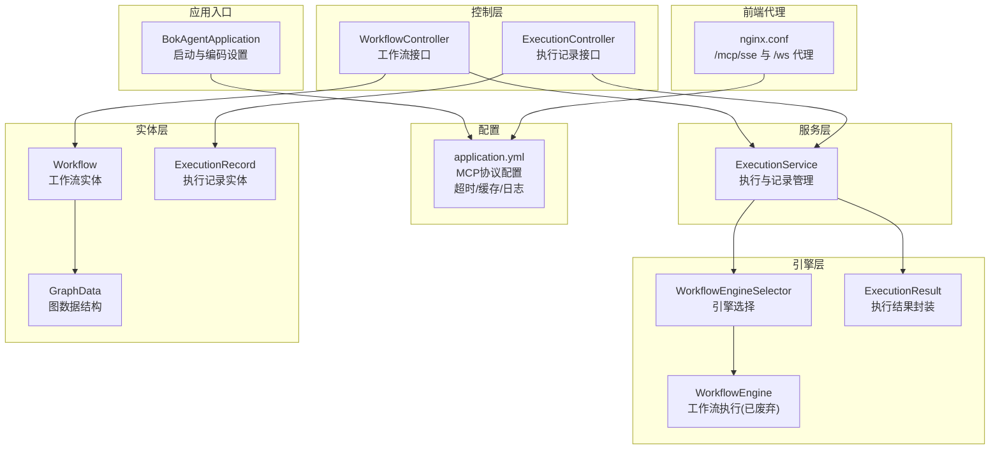
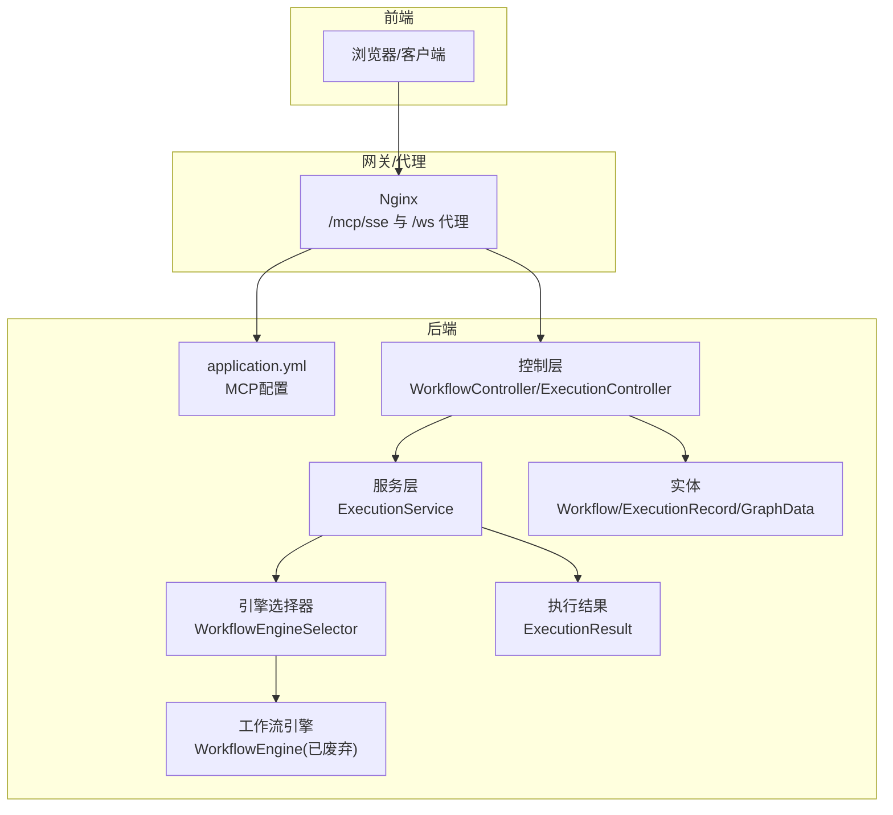
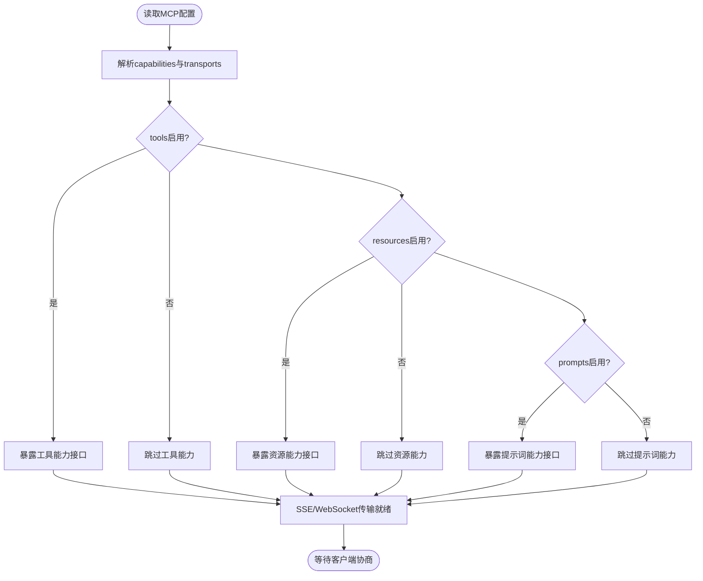
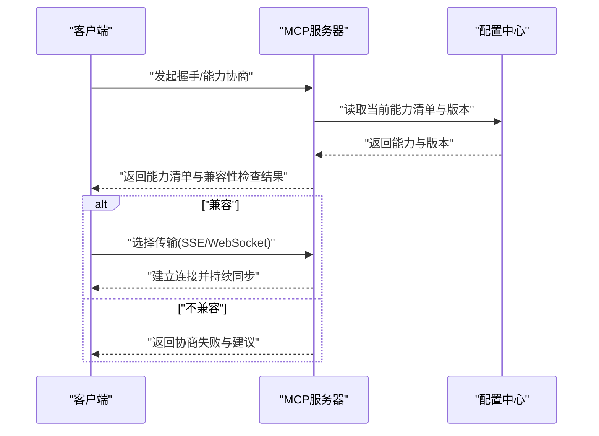
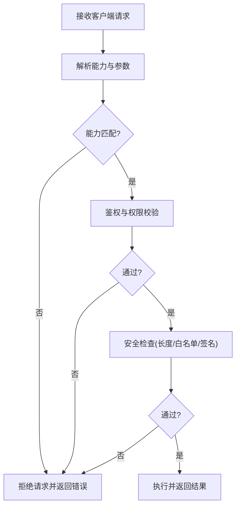
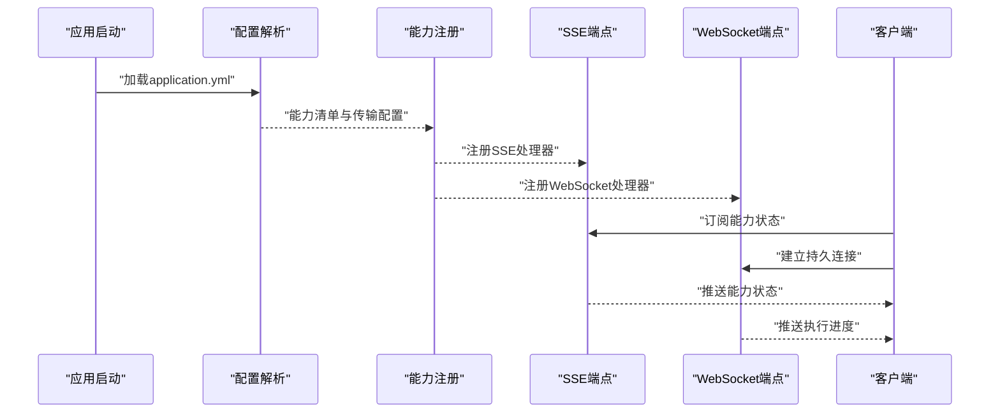
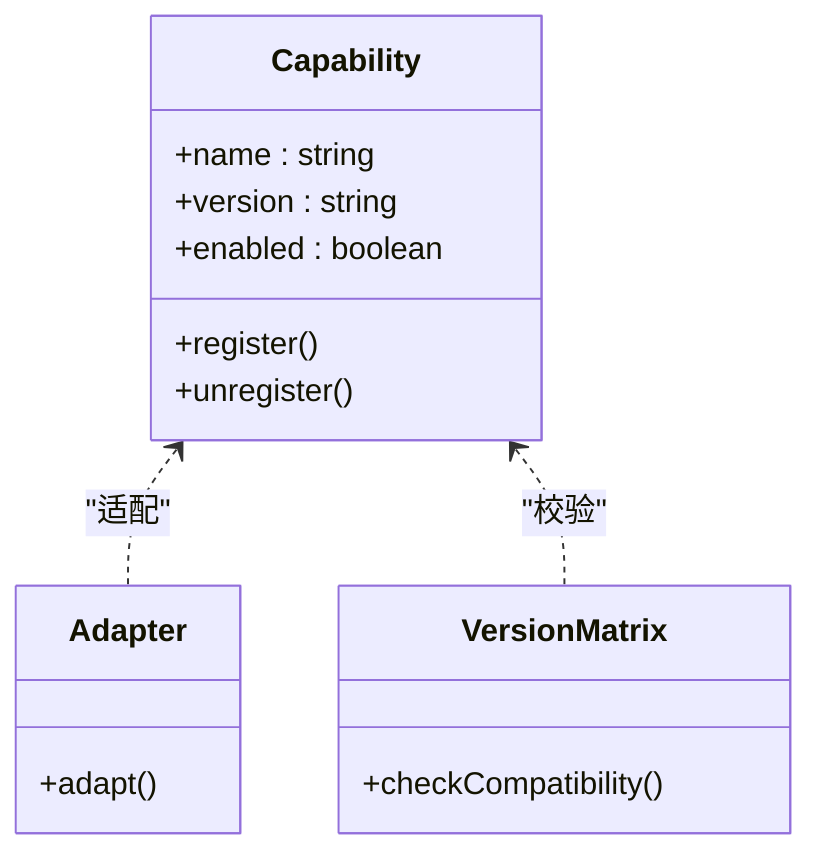
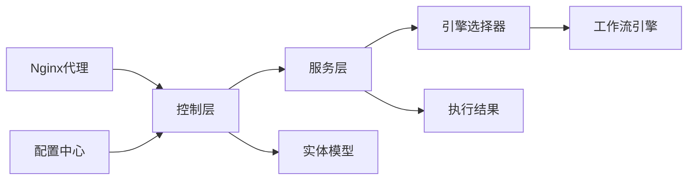

# 能力声明管理

<cite>
**本文引用的文件**
- [BokAgentApplication.java](file://backend/src/main/java/com/bokagent/BokAgentApplication.java)
- [application.yml](file://backend/src/main/resources/application.yml)
- [ExecutionController.java](file://backend/src/main/java/com/bokagent/controller/ExecutionController.java)
- [WorkflowController.java](file://backend/src/main/java/com/bokagent/controller/WorkflowController.java)
- [ExecutionService.java](file://backend/src/main/java/com/bokagent/service/ExecutionService.java)
- [WorkflowEngine.java](file://backend/src/main/java/com/bokagent/engine/WorkflowEngine.java)
- [WorkflowEngineSelector.java](file://backend/src/main/java/com/bokagent/engine/WorkflowEngineSelector.java)
- [ExecutionResult.java](file://backend/src/main/java/com/bokagent/engine/ExecutionResult.java)
- [Workflow.java](file://backend/src/main/java/com/bokagent/entity/Workflow.java)
- [ExecutionRecord.java](file://backend/src/main/java/com/bokagent/entity/ExecutionRecord.java)
- [GraphData.java](file://backend/src/main/java/com/bokagent/entity/GraphData.java)
- [nginx.conf](file://docker/nginx.conf)
- [IMPLEMENTATION_PROGRESS.md](file://IMPLEMENTATION_PROGRESS.md)
- [STAGE3_COMPLETION_REPORT.md](file://STAGE3_COMPLETION_REPORT.md)
</cite>

## 目录
1. [引言](#引言)
2. [项目结构](#项目结构)
3. [核心组件](#核心组件)
4. [架构总览](#架构总览)
5. [详细组件分析](#详细组件分析)
6. [依赖分析](#依赖分析)
7. [性能考虑](#性能考虑)
8. [故障排查指南](#故障排查指南)
9. [结论](#结论)
10. [附录](#附录)

## 引言
本文件面向开发者与运维人员，系统化阐述本项目的“能力声明管理”技术方案。基于现有配置与工程结构，重点覆盖以下方面：
- MCP服务器能力声明机制：tools、resources、prompts三类能力的配置与实现边界
- 动态更新机制：运行时能力变更、客户端协商过程、兼容性检查的落地策略
- 验证与校验：能力匹配、权限控制、安全检查的实现要点
- 完整实现示例：从配置解析、能力注册到状态同步的流程
- 扩展机制：自定义能力开发、第三方能力集成、能力版本管理
- 监控与诊断：能力配置有效性验证与可观测性建议

说明：当前仓库已具备MCP协议的基础配置与传输通道（HTTP/SSE/WebSocket），但尚未实现具体的能力声明与动态更新逻辑。本文在不虚构实现的前提下，给出可落地的架构设计与实施建议。

## 项目结构
后端采用Spring Boot工程，核心模块包括：
- 应用入口与配置：应用启动、编码设置、全局日志
- 控制层：工作流与执行记录的REST接口
- 服务层：工作流执行与记录管理
- 引擎层：工作流引擎选择与执行结果封装
- 实体层：工作流、执行记录、图数据等模型
- 配置层：application.yml中的MCP协议开关、传输路径与超时参数

图表来源
- [BokAgentApplication.java:1-56](file://backend/src/main/java/com/bokagent/BokAgentApplication.java#L1-L56)
- [application.yml:116-137](file://backend/src/main/resources/application.yml#L116-L137)
- [WorkflowController.java:1-92](file://backend/src/main/java/com/bokagent/controller/WorkflowController.java#L1-L92)
- [ExecutionController.java:1-81](file://backend/src/main/java/com/bokagent/controller/ExecutionController.java#L1-L81)
- [ExecutionService.java:1-113](file://backend/src/main/java/com/bokagent/service/ExecutionService.java#L1-L113)
- [WorkflowEngineSelector.java:1-53](file://backend/src/main/java/com/bokagent/engine/WorkflowEngineSelector.java#L1-L53)
- [WorkflowEngine.java:1-171](file://backend/src/main/java/com/bokagent/engine/WorkflowEngine.java#L1-L171)
- [ExecutionResult.java:1-32](file://backend/src/main/java/com/bokagent/engine/ExecutionResult.java#L1-L32)
- [Workflow.java:1-32](file://backend/src/main/java/com/bokagent/entity/Workflow.java#L1-L32)
- [ExecutionRecord.java:1-40](file://backend/src/main/java/com/bokagent/entity/ExecutionRecord.java#L1-L40)
- [GraphData.java:1-15](file://backend/src/main/java/com/bokagent/entity/GraphData.java#L1-L15)
- [nginx.conf:45-54](file://docker/nginx.conf#L45-L54)

章节来源
- [BokAgentApplication.java:1-56](file://backend/src/main/java/com/bokagent/BokAgentApplication.java#L1-L56)
- [application.yml:116-137](file://backend/src/main/resources/application.yml#L116-L137)
- [nginx.conf:45-54](file://docker/nginx.conf#L45-L54)

## 核心组件
- MCP协议配置：在配置文件中启用MCP服务器，声明能力（tools/resources/prompts）与传输方式（SSE/WebSocket），并设置超时与缓存策略
- 控制层接口：提供工作流与执行记录的REST接口，支撑前端与外部系统交互
- 服务层执行：封装执行流程，记录执行状态与结果
- 引擎层选择：根据配置动态选择工作流引擎实现
- 实体模型：工作流、执行记录与图数据结构，承载业务数据

章节来源
- [application.yml:116-137](file://backend/src/main/resources/application.yml#L116-L137)
- [WorkflowController.java:1-92](file://backend/src/main/java/com/bokagent/controller/WorkflowController.java#L1-L92)
- [ExecutionController.java:1-81](file://backend/src/main/java/com/bokagent/controller/ExecutionController.java#L1-L81)
- [ExecutionService.java:1-113](file://backend/src/main/java/com/bokagent/service/ExecutionService.java#L1-L113)
- [WorkflowEngineSelector.java:1-53](file://backend/src/main/java/com/bokagent/engine/WorkflowEngineSelector.java#L1-L53)
- [WorkflowEngine.java:1-171](file://backend/src/main/java/com/bokagent/engine/WorkflowEngine.java#L1-L171)
- [ExecutionResult.java:1-32](file://backend/src/main/java/com/bokagent/engine/ExecutionResult.java#L1-L32)
- [Workflow.java:1-32](file://backend/src/main/java/com/bokagent/entity/Workflow.java#L1-L32)
- [ExecutionRecord.java:1-40](file://backend/src/main/java/com/bokagent/entity/ExecutionRecord.java#L1-L40)
- [GraphData.java:1-15](file://backend/src/main/java/com/bokagent/entity/GraphData.java#L1-L15)

## 架构总览
下图展示MCP能力声明管理在系统中的位置与交互关系：MCP服务器配置位于application.yml，前端通过Nginx代理访问SSE与WebSocket端点；后端控制层与服务层负责工作流与执行记录的管理。

图表来源
- [application.yml:116-137](file://backend/src/main/resources/application.yml#L116-L137)
- [nginx.conf:45-54](file://docker/nginx.conf#L45-L54)
- [WorkflowController.java:1-92](file://backend/src/main/java/com/bokagent/controller/WorkflowController.java#L1-L92)
- [ExecutionController.java:1-81](file://backend/src/main/java/com/bokagent/controller/ExecutionController.java#L1-L81)
- [ExecutionService.java:1-113](file://backend/src/main/java/com/bokagent/service/ExecutionService.java#L1-L113)
- [WorkflowEngineSelector.java:1-53](file://backend/src/main/java/com/bokagent/engine/WorkflowEngineSelector.java#L1-L53)
- [WorkflowEngine.java:1-171](file://backend/src/main/java/com/bokagent/engine/WorkflowEngine.java#L1-L171)
- [ExecutionResult.java:1-32](file://backend/src/main/java/com/bokagent/engine/ExecutionResult.java#L1-L32)
- [Workflow.java:1-32](file://backend/src/main/java/com/bokagent/entity/Workflow.java#L1-L32)
- [ExecutionRecord.java:1-40](file://backend/src/main/java/com/bokagent/entity/ExecutionRecord.java#L1-L40)
- [GraphData.java:1-15](file://backend/src/main/java/com/bokagent/entity/GraphData.java#L1-L15)

## 详细组件分析

### MCP能力声明机制（tools/resources/prompts）
- 能力声明位置：MCP服务器能力在配置文件中集中声明，包含tools、resources、prompts三项能力的布尔开关
- 传输通道：SSE与WebSocket两条路径均已在配置与Nginx代理中开放
- 实现边界：当前仓库未实现具体的能力清单下发、动态更新与客户端协商逻辑，需在后续阶段补齐

图表来源
- [application.yml:116-137](file://backend/src/main/resources/application.yml#L116-L137)
- [nginx.conf:45-54](file://docker/nginx.conf#L45-L54)

章节来源
- [application.yml:116-137](file://backend/src/main/resources/application.yml#L116-L137)
- [nginx.conf:45-54](file://docker/nginx.conf#L45-L54)

### 动态更新机制（运行时变更、客户端协商、兼容性检查）
- 运行时能力变更：建议通过配置中心或环境变量动态切换MCP能力开关；结合健康检查与灰度发布，避免中断
- 客户端协商：在握手阶段返回能力清单与版本信息，客户端据此决定可用能力与传输方式
- 兼容性检查：对客户端上报的能力版本与服务端能力清单进行比对，不兼容时返回协商失败并提供建议

图表来源
- [application.yml:116-137](file://backend/src/main/resources/application.yml#L116-L137)

章节来源
- [application.yml:116-137](file://backend/src/main/resources/application.yml#L116-L137)

### 验证与校验（能力匹配、权限控制、安全检查）
- 能力匹配：服务端能力清单与客户端期望能力进行集合比对，缺失能力需降级或拒绝
- 权限控制：对接入方进行身份认证与授权，限制对敏感能力的访问
- 安全检查：对输入参数与执行结果进行白名单过滤与长度/大小限制，防止注入与滥用

图表来源
- [application.yml:116-137](file://backend/src/main/resources/application.yml#L116-L137)

章节来源
- [application.yml:116-137](file://backend/src/main/resources/application.yml#L116-L137)

### 完整实现示例（配置解析、能力注册、状态同步）
- 配置解析：从application.yml读取MCP能力与传输配置，初始化能力注册表
- 能力注册：将tools/resources/prompts分别注册到路由或服务容器，暴露对应端点
- 状态同步：通过SSE/WebSocket向客户端推送能力状态变更与执行进度

图表来源
- [application.yml:116-137](file://backend/src/main/resources/application.yml#L116-L137)
- [nginx.conf:45-54](file://docker/nginx.conf#L45-L54)

章节来源
- [application.yml:116-137](file://backend/src/main/resources/application.yml#L116-L137)
- [nginx.conf:45-54](file://docker/nginx.conf#L45-L54)

### 扩展机制（自定义能力、第三方集成、版本管理）
- 自定义能力：定义新的能力类型与数据结构，注册到能力注册表并实现对应处理器
- 第三方能力：通过适配器模式接入外部能力源，统一能力格式与调用协议
- 版本管理：为每项能力维护版本号与兼容矩阵，客户端按版本协商，服务端按版本路由

图表来源
- [application.yml:116-137](file://backend/src/main/resources/application.yml#L116-L137)

章节来源
- [application.yml:116-137](file://backend/src/main/resources/application.yml#L116-L137)

### 监控与诊断（能力配置有效性验证）
- 健康检查：提供/health端点，返回MCP能力状态与传输通道可用性
- 指标采集：记录能力调用次数、成功率、延迟分布与错误类型
- 日志审计：记录能力协商、权限校验与安全检查的关键事件，便于追踪

章节来源
- [application.yml:181-190](file://backend/src/main/resources/application.yml#L181-L190)

## 依赖分析
- 组件耦合：控制层依赖服务层；服务层依赖引擎选择器与实体模型；引擎层依赖执行结果封装
- 外部依赖：Nginx代理MCP端点；数据库存储工作流与执行记录；配置中心提供动态配置

图表来源
- [WorkflowController.java:1-92](file://backend/src/main/java/com/bokagent/controller/WorkflowController.java#L1-L92)
- [ExecutionController.java:1-81](file://backend/src/main/java/com/bokagent/controller/ExecutionController.java#L1-L81)
- [ExecutionService.java:1-113](file://backend/src/main/java/com/bokagent/service/ExecutionService.java#L1-L113)
- [WorkflowEngineSelector.java:1-53](file://backend/src/main/java/com/bokagent/engine/WorkflowEngineSelector.java#L1-L53)
- [WorkflowEngine.java:1-171](file://backend/src/main/java/com/bokagent/engine/WorkflowEngine.java#L1-L171)
- [ExecutionResult.java:1-32](file://backend/src/main/java/com/bokagent/engine/ExecutionResult.java#L1-L32)
- [Workflow.java:1-32](file://backend/src/main/java/com/bokagent/entity/Workflow.java#L1-L32)
- [ExecutionRecord.java:1-40](file://backend/src/main/java/com/bokagent/entity/ExecutionRecord.java#L1-L40)
- [GraphData.java:1-15](file://backend/src/main/java/com/bokagent/entity/GraphData.java#L1-L15)
- [nginx.conf:45-54](file://docker/nginx.conf#L45-L54)

章节来源
- [WorkflowController.java:1-92](file://backend/src/main/java/com/bokagent/controller/WorkflowController.java#L1-L92)
- [ExecutionController.java:1-81](file://backend/src/main/java/com/bokagent/controller/ExecutionController.java#L1-L81)
- [ExecutionService.java:1-113](file://backend/src/main/java/com/bokagent/service/ExecutionService.java#L1-L113)
- [WorkflowEngineSelector.java:1-53](file://backend/src/main/java/com/bokagent/engine/WorkflowEngineSelector.java#L1-L53)
- [WorkflowEngine.java:1-171](file://backend/src/main/java/com/bokagent/engine/WorkflowEngine.java#L1-L171)
- [ExecutionResult.java:1-32](file://backend/src/main/java/com/bokagent/engine/ExecutionResult.java#L1-L32)
- [Workflow.java:1-32](file://backend/src/main/java/com/bokagent/entity/Workflow.java#L1-L32)
- [ExecutionRecord.java:1-40](file://backend/src/main/java/com/bokagent/entity/ExecutionRecord.java#L1-L40)
- [GraphData.java:1-15](file://backend/src/main/java/com/bokagent/entity/GraphData.java#L1-L15)
- [nginx.conf:45-54](file://docker/nginx.conf#L45-L54)

## 性能考虑
- 超时与重试：为MCP请求、工具执行与LLM调用设置合理超时与指数退避重试
- 缓存策略：对工具结果与LLM响应进行分层缓存，降低重复调用成本
- 并发与异步：对长时间运行的任务采用异步执行与进度推送，避免阻塞主线程

章节来源
- [application.yml:138-162](file://backend/src/main/resources/application.yml#L138-L162)

## 故障排查指南
- 编码问题：应用启动时打印编码信息，确认UTF-8生效
- MCP端点：检查Nginx代理是否正确转发/mcp/sse与/ws
- 引擎选择：确认配置项选择的引擎实现是否存在，避免回退到默认实现
- 执行异常：查看执行记录的状态与错误字段，定位失败原因

章节来源
- [BokAgentApplication.java:45-54](file://backend/src/main/java/com/bokagent/BokAgentApplication.java#L45-L54)
- [nginx.conf:45-54](file://docker/nginx.conf#L45-L54)
- [WorkflowEngineSelector.java:32-43](file://backend/src/main/java/com/bokagent/engine/WorkflowEngineSelector.java#L32-L43)
- [ExecutionService.java:81-91](file://backend/src/main/java/com/bokagent/service/ExecutionService.java#L81-L91)

## 结论
本项目已具备MCP协议的基础配置与传输通道，能力声明管理尚处于规划与实现初期。建议按照“配置解析—能力注册—状态同步—客户端协商—安全校验”的路径推进，逐步完善tools/resources/prompts三类能力的动态更新与兼容性保障，最终形成可扩展、可观测、可治理的能力声明管理体系。

## 附录
- 阶段性计划参考：后续可实施MCP协议基础实现（含McpServer核心类、McpTool数据结构、MCP HTTP/SSE端点），并在集成测试与优化中完善能力声明管理

章节来源
- [IMPLEMENTATION_PROGRESS.md:171-185](file://IMPLEMENTATION_PROGRESS.md#L171-L185)
- [STAGE3_COMPLETION_REPORT.md:304-318](file://STAGE3_COMPLETION_REPORT.md#L304-L318)