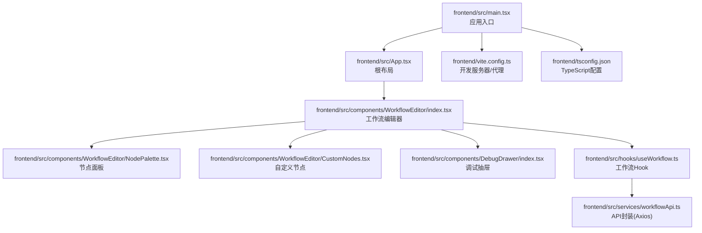
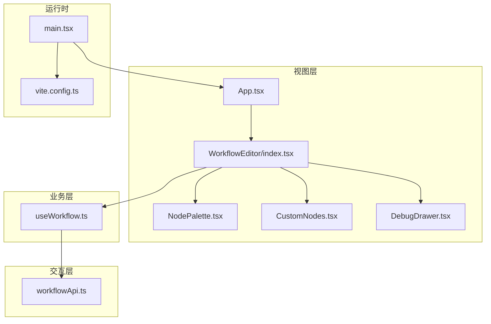
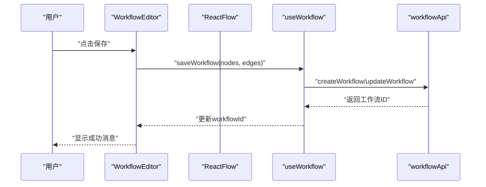
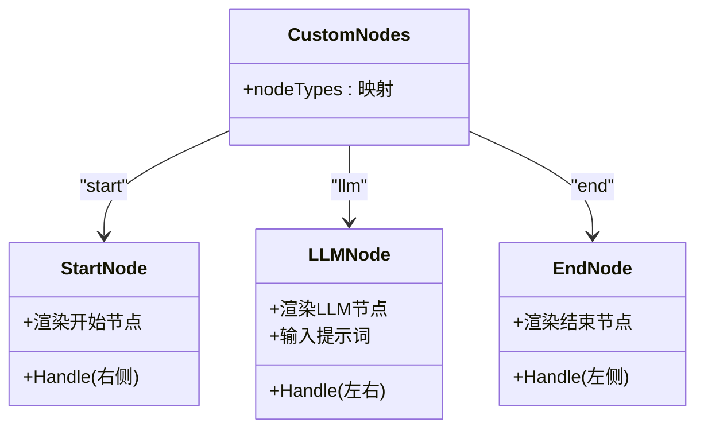
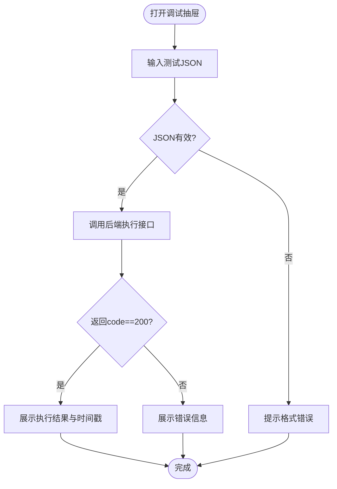
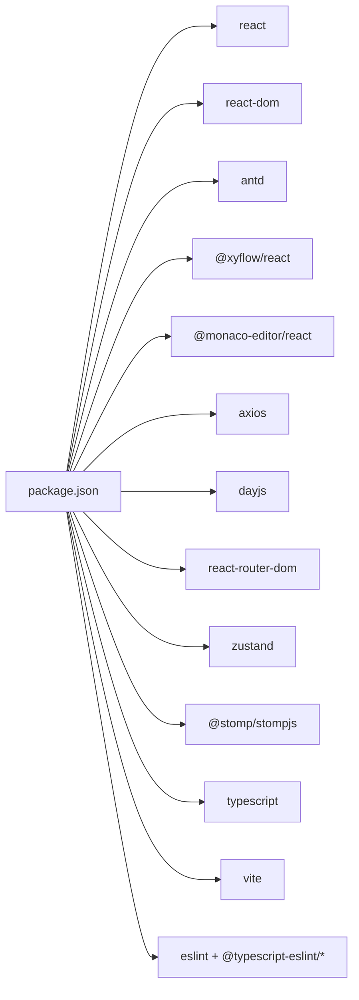

# 前端应用

<cite>
**本文引用的文件**
- [frontend/src/main.tsx](file://frontend/src/main.tsx)
- [frontend/src/App.tsx](file://frontend/src/App.tsx)
- [frontend/vite.config.ts](file://frontend/vite.config.ts)
- [frontend/package.json](file://frontend/package.json)
- [frontend/tsconfig.json](file://frontend/tsconfig.json)
- [frontend/src/components/WorkflowEditor/index.tsx](file://frontend/src/components/WorkflowEditor/index.tsx)
- [frontend/src/components/WorkflowEditor/NodePalette.tsx](file://frontend/src/components/WorkflowEditor/NodePalette.tsx)
- [frontend/src/components/WorkflowEditor/CustomNodes.tsx](file://frontend/src/components/WorkflowEditor/CustomNodes.tsx)
- [frontend/src/components/DebugDrawer/index.tsx](file://frontend/src/components/DebugDrawer/index.tsx)
- [frontend/src/hooks/useWorkflow.ts](file://frontend/src/hooks/useWorkflow.ts)
- [frontend/src/services/workflowApi.ts](file://frontend/src/services/workflowApi.ts)
- [README.md](file://README.md)
- [QUICKSTART.md](file://QUICKSTART.md)
</cite>

## 目录
1. [简介](#简介)
2. [项目结构](#项目结构)
3. [核心组件](#核心组件)
4. [架构总览](#架构总览)
5. [详细组件分析](#详细组件分析)
6. [依赖分析](#依赖分析)
7. [性能考虑](#性能考虑)
8. [故障排除指南](#故障排除指南)
9. [结论](#结论)
10. [附录](#附录)

## 简介
本文件为 BokAgent 前端应用的综合技术文档，面向前端开发者与产品/测试人员，系统性介绍基于 React 18 + TypeScript 的前端架构、组件层次、状态管理、路由与构建配置；同时说明 Ant Design 5 的使用与主题定制、Monaco Editor 的集成思路、组件开发规范、开发环境配置以及与后端 API 的交互模式与最佳实践。

## 项目结构
前端采用 Vite + React 18 + TypeScript 构建，核心目录组织如下：
- src
  - components：可复用 UI 组件与业务组件（如工作流编辑器、调试抽屉）
  - hooks：自定义 Hook（如工作流状态 Hook）
  - services：API 封装（Axios 实例 + 接口方法）
  - App.tsx、main.tsx：应用入口与根组件
- vite.config.ts：开发服务器与代理配置
- package.json：依赖与脚本
- tsconfig.json：TypeScript 编译选项

图表来源
- [frontend/src/main.tsx:1-22](file://frontend/src/main.tsx#L1-L22)
- [frontend/src/App.tsx:1-21](file://frontend/src/App.tsx#L1-L21)
- [frontend/src/components/WorkflowEditor/index.tsx:1-116](file://frontend/src/components/WorkflowEditor/index.tsx#L1-L116)
- [frontend/src/components/WorkflowEditor/NodePalette.tsx:1-48](file://frontend/src/components/WorkflowEditor/NodePalette.tsx#L1-L48)
- [frontend/src/components/WorkflowEditor/CustomNodes.tsx:1-81](file://frontend/src/components/WorkflowEditor/CustomNodes.tsx#L1-L81)
- [frontend/src/components/DebugDrawer/index.tsx:1-141](file://frontend/src/components/DebugDrawer/index.tsx#L1-L141)
- [frontend/src/hooks/useWorkflow.ts:1-69](file://frontend/src/hooks/useWorkflow.ts#L1-L69)
- [frontend/src/services/workflowApi.ts:1-44](file://frontend/src/services/workflowApi.ts#L1-L44)
- [frontend/vite.config.ts:1-21](file://frontend/vite.config.ts#L1-L21)
- [frontend/tsconfig.json:1-26](file://frontend/tsconfig.json#L1-L26)

章节来源
- [frontend/src/main.tsx:1-22](file://frontend/src/main.tsx#L1-L22)
- [frontend/src/App.tsx:1-21](file://frontend/src/App.tsx#L1-L21)
- [frontend/vite.config.ts:1-21](file://frontend/vite.config.ts#L1-L21)
- [frontend/package.json:1-37](file://frontend/package.json#L1-L37)
- [frontend/tsconfig.json:1-26](file://frontend/tsconfig.json#L1-L26)

## 核心组件
- 应用入口与国际化配置：在入口中引入 Ant Design 国际化与中文本地化，设置 dayjs 语言包，保证中文与 Emoji 输出。
- 根组件：提供顶部标题与工作流编辑器容器，形成基础布局。
- 工作流编辑器：基于 @xyflow/react 提供拖拽式画布，支持节点拖放、连线、保存、调试。
- 自定义节点：开始/LLM/结束三种节点，具备输入提示词能力与连接 Handle。
- 节点面板：提供可拖拽节点类型，便于快速添加。
- 调试抽屉：提供测试输入 JSON、执行工作流、展示执行结果的能力。
- 自定义 Hook：封装工作流的创建/更新/加载与状态管理。
- API 封装：基于 Axios 创建实例，统一前缀与内容类型，暴露工作流与执行记录相关接口。

章节来源
- [frontend/src/main.tsx:1-22](file://frontend/src/main.tsx#L1-L22)
- [frontend/src/App.tsx:1-21](file://frontend/src/App.tsx#L1-L21)
- [frontend/src/components/WorkflowEditor/index.tsx:1-116](file://frontend/src/components/WorkflowEditor/index.tsx#L1-L116)
- [frontend/src/components/WorkflowEditor/CustomNodes.tsx:1-81](file://frontend/src/components/WorkflowEditor/CustomNodes.tsx#L1-L81)
- [frontend/src/components/WorkflowEditor/NodePalette.tsx:1-48](file://frontend/src/components/WorkflowEditor/NodePalette.tsx#L1-L48)
- [frontend/src/components/DebugDrawer/index.tsx:1-141](file://frontend/src/components/DebugDrawer/index.tsx#L1-L141)
- [frontend/src/hooks/useWorkflow.ts:1-69](file://frontend/src/hooks/useWorkflow.ts#L1-L69)
- [frontend/src/services/workflowApi.ts:1-44](file://frontend/src/services/workflowApi.ts#L1-L44)

## 架构总览
前端采用“组件分层 + Hook 状态 + Axios 封装”的轻量架构：
- 视图层：React 组件树，Ant Design 提供 UI 基础与主题。
- 业务层：自定义 Hook 管理工作流状态与生命周期。
- 交互层：Axios 实例封装 API，统一处理错误与加载。
- 运行时：Vite 提供开发服务器与代理，本地联调后端。

图表来源
- [frontend/src/App.tsx:1-21](file://frontend/src/App.tsx#L1-L21)
- [frontend/src/components/WorkflowEditor/index.tsx:1-116](file://frontend/src/components/WorkflowEditor/index.tsx#L1-L116)
- [frontend/src/components/WorkflowEditor/NodePalette.tsx:1-48](file://frontend/src/components/WorkflowEditor/NodePalette.tsx#L1-L48)
- [frontend/src/components/WorkflowEditor/CustomNodes.tsx:1-81](file://frontend/src/components/WorkflowEditor/CustomNodes.tsx#L1-L81)
- [frontend/src/components/DebugDrawer/index.tsx:1-141](file://frontend/src/components/DebugDrawer/index.tsx#L1-L141)
- [frontend/src/hooks/useWorkflow.ts:1-69](file://frontend/src/hooks/useWorkflow.ts#L1-L69)
- [frontend/src/services/workflowApi.ts:1-44](file://frontend/src/services/workflowApi.ts#L1-L44)
- [frontend/src/main.tsx:1-22](file://frontend/src/main.tsx#L1-L22)
- [frontend/vite.config.ts:1-21](file://frontend/vite.config.ts#L1-L21)

## 详细组件分析

### 工作流编辑器（WorkflowEditor）
职责与流程：
- 维护节点与边的状态，提供拖拽添加节点、连线、保存工作流、打开调试抽屉等功能。
- 通过 React Flow Provider 提供上下文，使用 useNodesState/useEdgesState 管理状态。
- 保存逻辑委托给 useWorkflow Hook，统一处理创建/更新与返回 ID。

图表来源
- [frontend/src/components/WorkflowEditor/index.tsx:54-62](file://frontend/src/components/WorkflowEditor/index.tsx#L54-L62)
- [frontend/src/hooks/useWorkflow.ts:9-39](file://frontend/src/hooks/useWorkflow.ts#L9-L39)
- [frontend/src/services/workflowApi.ts:18-25](file://frontend/src/services/workflowApi.ts#L18-L25)

章节来源
- [frontend/src/components/WorkflowEditor/index.tsx:1-116](file://frontend/src/components/WorkflowEditor/index.tsx#L1-L116)
- [frontend/src/hooks/useWorkflow.ts:1-69](file://frontend/src/hooks/useWorkflow.ts#L1-L69)
- [frontend/src/services/workflowApi.ts:1-44](file://frontend/src/services/workflowApi.ts#L1-L44)

### 自定义节点（CustomNodes）
- 开始节点：绿色边框与图标，作为流程起点。
- LLM 节点：蓝色边框，内置文本域用于输入提示词，支持双向数据更新。
- 结束节点：红色边框与图标，作为流程终点。
- 节点类型映射：导出 nodeTypes 供 React Flow 使用。

图表来源
- [frontend/src/components/WorkflowEditor/CustomNodes.tsx:6-78](file://frontend/src/components/WorkflowEditor/CustomNodes.tsx#L6-L78)

章节来源
- [frontend/src/components/WorkflowEditor/CustomNodes.tsx:1-81](file://frontend/src/components/WorkflowEditor/CustomNodes.tsx#L1-L81)

### 节点面板（NodePalette）
- 提供三种节点类型的卡片，支持拖拽到画布。
- 拖拽事件通过 HTML5 DataTransfer 写入节点类型，配合画布 onDrop 处理。

章节来源
- [frontend/src/components/WorkflowEditor/NodePalette.tsx:1-48](file://frontend/src/components/WorkflowEditor/NodePalette.tsx#L1-L48)

### 调试抽屉（DebugDrawer）
- 功能：输入测试 JSON、执行工作流、展示执行结果与统计信息。
- 交互：校验 JSON 输入、调用后端执行接口、根据返回状态更新输出区域。
- 注意：当前固定使用固定工作流 ID，后续应从 useWorkflow 获取。

图表来源
- [frontend/src/components/DebugDrawer/index.tsx:17-67](file://frontend/src/components/DebugDrawer/index.tsx#L17-L67)

章节来源
- [frontend/src/components/DebugDrawer/index.tsx:1-141](file://frontend/src/components/DebugDrawer/index.tsx#L1-L141)

### 自定义 Hook（useWorkflow）
- 职责：封装工作流的保存/加载/重置逻辑，维护 workflowId 与 loading 状态。
- 保存策略：若存在 workflowId 则更新，否则创建并回填 ID。
- 错误处理：捕获异常并抛出，由调用方决定 UI 反馈。

章节来源
- [frontend/src/hooks/useWorkflow.ts:1-69](file://frontend/src/hooks/useWorkflow.ts#L1-L69)

### API 封装（workflowApi）
- 基于 Axios 创建实例，设置 baseURL 为 /api，统一 Content-Type。
- 暴露工作流与执行记录相关接口，便于在业务层调用。

章节来源
- [frontend/src/services/workflowApi.ts:1-44](file://frontend/src/services/workflowApi.ts#L1-L44)

## 依赖分析
- 运行时依赖
  - React 18、React DOM、Ant Design 5、@xyflow/react、@monaco-editor/react、axios、dayjs、react-router-dom、zustand、@stomp/stompjs
- 开发依赖
  - TypeScript、Vite、@vitejs/plugin-react、ESLint、@typescript-eslint/*、Prettier 相关（项目未提供具体配置文件）

图表来源
- [frontend/package.json:12-35](file://frontend/package.json#L12-L35)

章节来源
- [frontend/package.json:1-37](file://frontend/package.json#L1-L37)

## 性能考虑
- Vite 构建与热更新：利用 Vite 的原生 ESM 与快速冷启动，提升开发体验。
- 依赖按需加载：Ant Design 与 @xyflow/react 均支持按需导入，减少首屏体积。
- 组件拆分：将节点、面板、抽屉拆分为独立模块，利于懒加载与维护。
- 状态管理：当前使用 React 内置状态与 Hook，复杂场景可考虑 Zustand 或 Redux Toolkit。

## 故障排除指南
- 代理与跨域
  - 开发环境下，Vite 将 /api 代理至后端，/ws 代理至 WebSocket。若端口冲突或后端未启动，需检查 vite.config.ts 与后端服务状态。
- 中文与 Emoji 显示
  - 入口已设置 dayjs 语言与 Ant Design 中文语言包，确保浏览器与系统编码为 UTF-8。
- API 请求失败
  - 检查 baseURL 与路径是否匹配后端接口；确认网络连通与 CORS 配置。
- 调试抽屉无输出
  - 确认已添加节点且 JSON 输入有效；检查后端执行接口返回结构与 code 字段。

章节来源
- [frontend/vite.config.ts:7-19](file://frontend/vite.config.ts#L7-L19)
- [frontend/src/main.tsx:9-10](file://frontend/src/main.tsx#L9-L10)
- [frontend/src/services/workflowApi.ts:3-8](file://frontend/src/services/workflowApi.ts#L3-L8)
- [frontend/src/components/DebugDrawer/index.tsx:17-67](file://frontend/src/components/DebugDrawer/index.tsx#L17-L67)

## 结论
本前端应用以 React 18 + TypeScript 为基础，结合 Ant Design 5 与 @xyflow/react 实现了可视化工作流编辑器的核心功能。通过自定义 Hook 与 Axios 封装，实现了清晰的业务分层与可维护的交互模式。建议后续完善 Monaco Editor 集成、主题定制与样式覆盖、路由配置、以及 ESLint/Prettier 的规范化配置，以进一步提升开发效率与一致性。

## 附录

### Ant Design 5 使用与主题定制
- 国际化：在入口设置 ConfigProvider 与 zhCN 语言包，确保组件文案与日期本地化。
- 主题与样式：可通过 ConfigProvider 的 theme 属性进行主题定制；如需覆盖样式，可在全局样式中使用 CSS 变量或类名覆盖。
- 响应式：Ant Design 提供栅格与断点，结合 Flex 布局实现响应式页面。

章节来源
- [frontend/src/main.tsx:3-19](file://frontend/src/main.tsx#L3-L19)

### Vite 构建与开发服务器
- 插件：使用 @vitejs/plugin-react 提供 React HMR 与 JSX 转换。
- 代理：将 /api 与 /ws 代理至后端，便于本地联调。
- 端口：默认 3000，可在配置中调整。

章节来源
- [frontend/vite.config.ts:1-21](file://frontend/vite.config.ts#L1-L21)

### TypeScript 配置要点
- 模块解析：bundler 模式，支持 ESNext 与 JSX。
- 严格模式：开启严格检查，避免潜在类型问题。
- 仅编译不打包：Vite 以 ESM 形式运行，TypeScript 不输出 JS。

章节来源
- [frontend/tsconfig.json:1-26](file://frontend/tsconfig.json#L1-L26)

### ESLint 与 Prettier 规范
- ESLint：项目包含脚本与依赖，但未提供具体规则文件。建议在根目录新增 .eslintrc.* 并启用 @typescript-eslint 与 react-hooks 规则。
- Prettier：建议新增 .prettierrc 与 .prettierignore，统一格式化风格。

章节来源
- [frontend/package.json:9,27-34](file://frontend/package.json#L9,L27-L34)

### 与后端 API 的交互模式
- Axios 实例：统一 baseURL 与请求头，集中处理错误与拦截器。
- 工作流接口：提供创建、更新、查询、删除；执行记录提供列表与详情。
- 执行流程：前端提交测试数据，后端返回执行结果，前端解析并展示。

章节来源
- [frontend/src/services/workflowApi.ts:11-41](file://frontend/src/services/workflowApi.ts#L11-L41)
- [frontend/src/components/DebugDrawer/index.tsx:31-55](file://frontend/src/components/DebugDrawer/index.tsx#L31-L55)

### 组件开发指南
- 设计原则：单一职责、可组合、可复用；Props 明确、事件回调语义清晰。
- Props 接口：为复杂组件定义明确的接口类型，避免 any。
- 事件处理：区分用户触发与内部状态变更，保持不可变更新。
- 样式与主题：优先使用 Ant Design 组件与主题变量，必要时局部覆盖。

章节来源
- [frontend/src/components/WorkflowEditor/CustomNodes.tsx:6-78](file://frontend/src/components/WorkflowEditor/CustomNodes.tsx#L6-L78)
- [frontend/src/components/DebugDrawer/index.tsx:5-10](file://frontend/src/components/DebugDrawer/index.tsx#L5-L10)

### Monaco Editor 集成建议
- 集成方式：使用 @monaco-editor/react，在需要代码编辑与语法高亮的场景引入。
- 配置项：选择语言（如 json）、主题（vs-dark 或 vs-light）、自动补全与语法高亮。
- 与工作流结合：可将节点的提示词或配置放入编辑器，统一保存。

章节来源
- [frontend/package.json:13](file://frontend/package.json#L13)
- [README.md:22](file://README.md#L22)

### 开发环境与启动
- 一键启动：参考快速开始文档，使用 docker-compose 启动后端与前端。
- 本地开发：进入 frontend 目录，安装依赖后运行 npm run dev，默认端口 3000。
- 代理说明：前端代理 /api 与 /ws 至后端，确保联调顺畅。

章节来源
- [QUICKSTART.md:47-68](file://QUICKSTART.md#L47-L68)
- [QUICKSTART.md:166-185](file://QUICKSTART.md#L166-L185)
- [frontend/vite.config.ts:7-19](file://frontend/vite.config.ts#L7-L19)