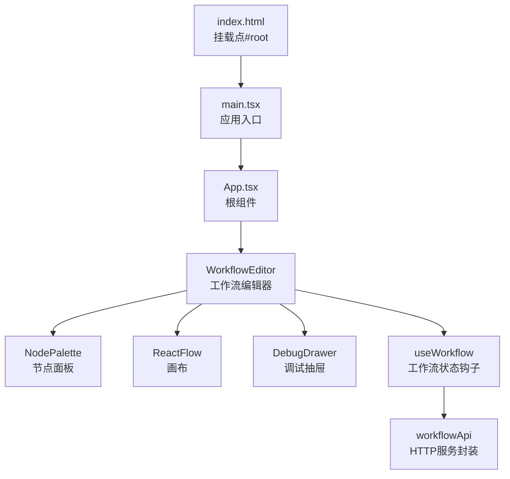
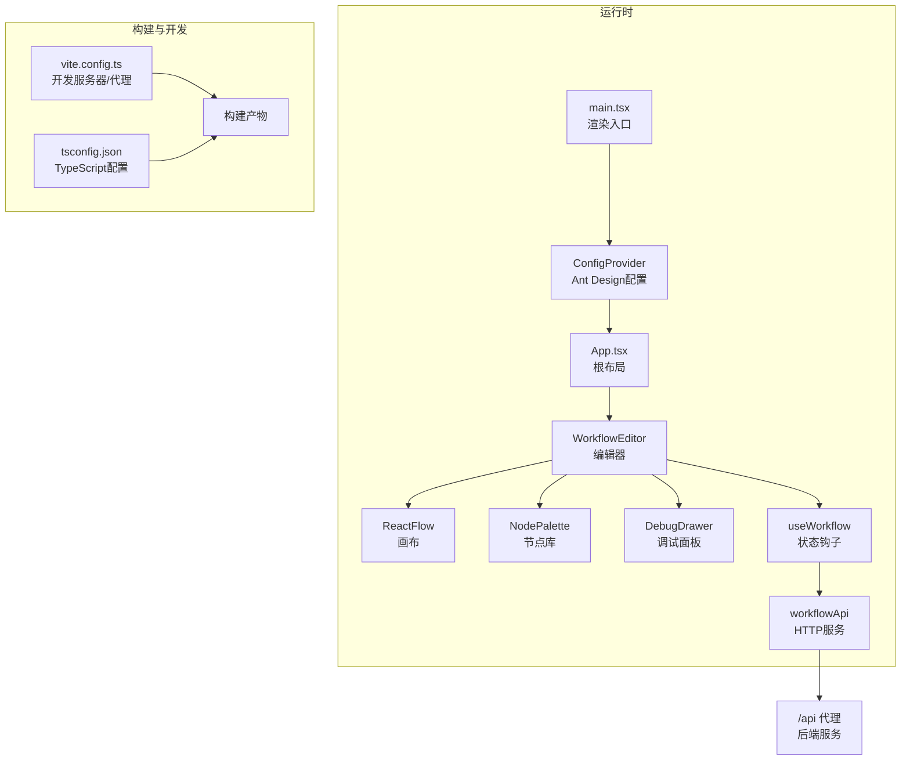
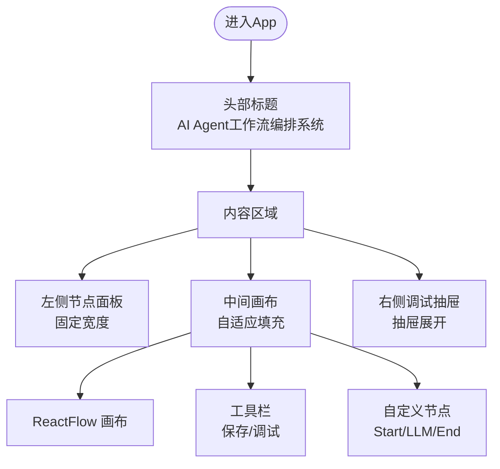
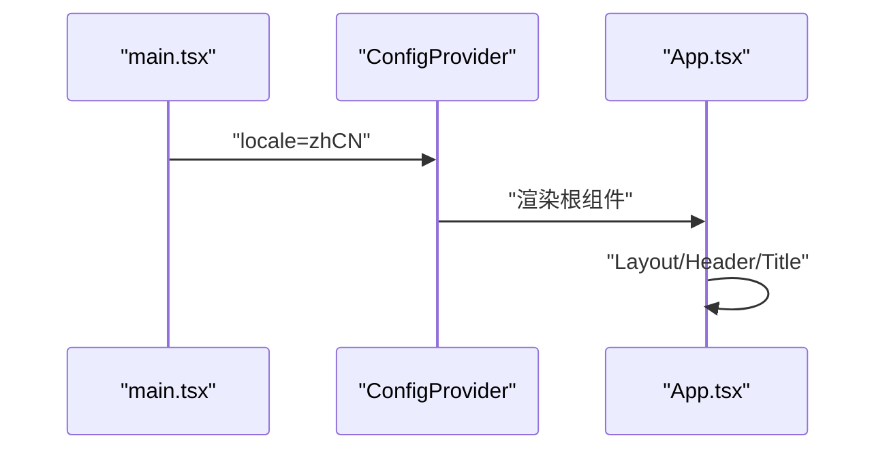
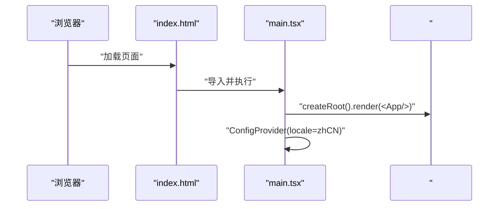
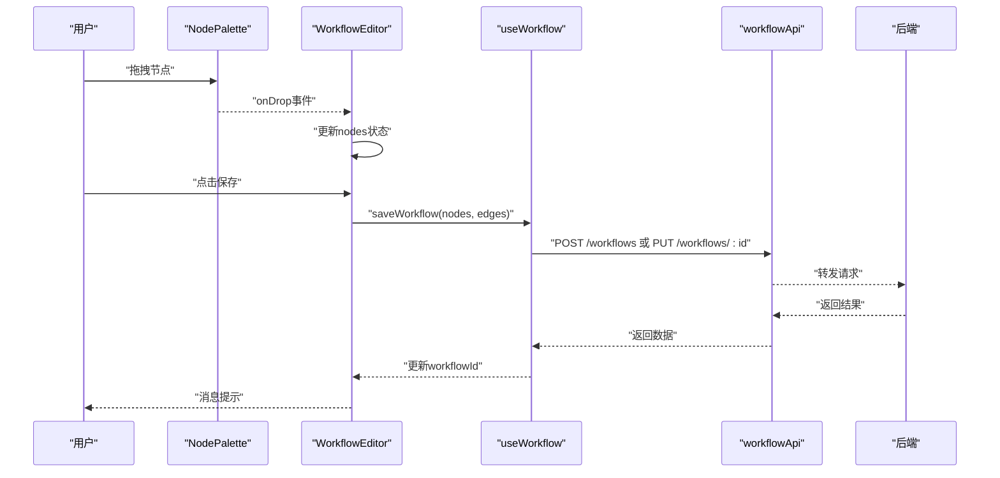
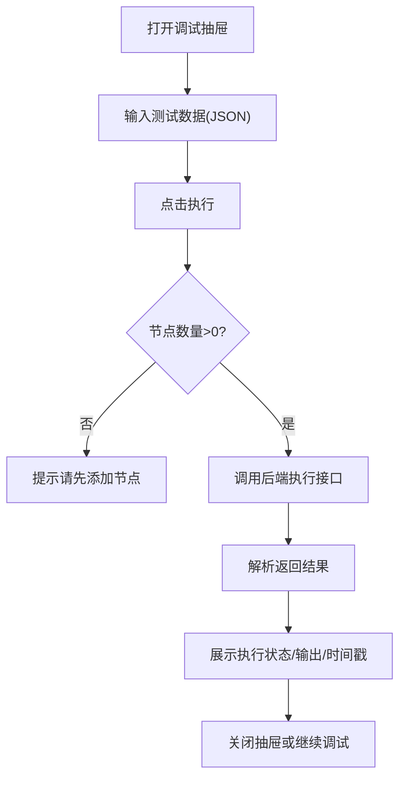
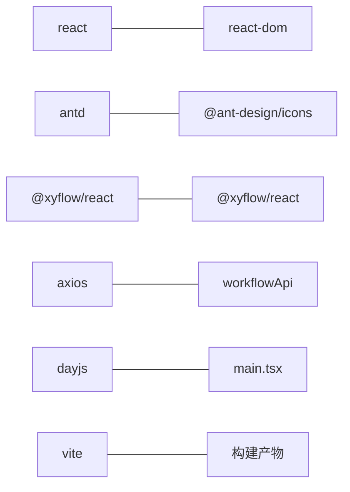

# 应用架构设计

<cite>
**本文引用的文件**
- [frontend/src/App.tsx](file://frontend/src/App.tsx)
- [frontend/src/main.tsx](file://frontend/src/main.tsx)
- [frontend/src/components/WorkflowEditor/index.tsx](file://frontend/src/components/WorkflowEditor/index.tsx)
- [frontend/src/components/WorkflowEditor/CustomNodes.tsx](file://frontend/src/components/WorkflowEditor/CustomNodes.tsx)
- [frontend/src/components/WorkflowEditor/NodePalette.tsx](file://frontend/src/components/WorkflowEditor/NodePalette.tsx)
- [frontend/src/components/DebugDrawer/index.tsx](file://frontend/src/components/DebugDrawer/index.tsx)
- [frontend/src/hooks/useWorkflow.ts](file://frontend/src/hooks/useWorkflow.ts)
- [frontend/src/services/workflowApi.ts](file://frontend/src/services/workflowApi.ts)
- [frontend/package.json](file://frontend/package.json)
- [frontend/vite.config.ts](file://frontend/vite.config.ts)
- [frontend/tsconfig.json](file://frontend/tsconfig.json)
- [frontend/index.html](file://frontend/index.html)
- [docs/PROJECT_STRUCTURE.md](file://docs/PROJECT_STRUCTURE.md)
- [README.md](file://README.md)
</cite>

## 目录
1. [简介](#简介)
2. [项目结构](#项目结构)
3. [核心组件](#核心组件)
4. [架构总览](#架构总览)
5. [详细组件分析](#详细组件分析)
6. [依赖关系分析](#依赖关系分析)
7. [性能考虑](#性能考虑)
8. [故障排查指南](#故障排查指南)
9. [结论](#结论)
10. [附录](#附录)

## 简介
本文件面向BokAgent前端应用，系统性阐述基于React 18与Ant Design 5的架构设计与实现要点。重点覆盖：
- 整体架构与组件树结构
- 布局设计与导航体系
- Ant Design 5主题与中文本地化集成
- 路由与页面组织方式
- 主应用组件App.tsx的职责与实现细节
- 启动流程与main.tsx初始化过程
- 性能优化策略（懒加载、代码分割等）

## 项目结构
前端采用Vite + React 18 + TypeScript的现代工程化方案，核心入口通过index.html挂载到#root，应用在main.tsx中渲染。项目遵循按功能域分层的组织方式：组件、服务、钩子等。

图表来源
- [frontend/index.html:1-14](file://frontend/index.html#L1-L14)
- [frontend/src/main.tsx:1-22](file://frontend/src/main.tsx#L1-L22)
- [frontend/src/App.tsx:1-21](file://frontend/src/App.tsx#L1-L21)
- [frontend/src/components/WorkflowEditor/index.tsx:1-116](file://frontend/src/components/WorkflowEditor/index.tsx#L1-L116)
- [frontend/src/components/WorkflowEditor/NodePalette.tsx:1-48](file://frontend/src/components/WorkflowEditor/NodePalette.tsx#L1-L48)
- [frontend/src/components/DebugDrawer/index.tsx:1-141](file://frontend/src/components/DebugDrawer/index.tsx#L1-L141)
- [frontend/src/hooks/useWorkflow.ts:1-69](file://frontend/src/hooks/useWorkflow.ts#L1-L69)
- [frontend/src/services/workflowApi.ts:1-44](file://frontend/src/services/workflowApi.ts#L1-L44)

章节来源
- [docs/PROJECT_STRUCTURE.md:90-141](file://docs/PROJECT_STRUCTURE.md#L90-L141)
- [frontend/package.json:1-37](file://frontend/package.json#L1-L37)

## 核心组件
- App.tsx：应用根组件，采用Ant Design Layout进行头部与内容区域划分，承载标题与工作流编辑器。
- WorkflowEditor：工作流编辑器主体，集成@xyflow/react画布、工具栏、节点面板与调试抽屉。
- NodePalette：节点库面板，提供拖拽节点到画布的能力。
- CustomNodes：自定义节点类型（开始、LLM、结束），配合Handle实现连接点。
- DebugDrawer：右侧调试抽屉，支持执行工作流、查看执行结果。
- useWorkflow：工作流状态管理钩子，封装创建/更新/加载/重置逻辑。
- workflowApi：Axios封装的HTTP客户端，统一前缀与请求头。

章节来源
- [frontend/src/App.tsx:1-21](file://frontend/src/App.tsx#L1-L21)
- [frontend/src/components/WorkflowEditor/index.tsx:1-116](file://frontend/src/components/WorkflowEditor/index.tsx#L1-L116)
- [frontend/src/components/WorkflowEditor/NodePalette.tsx:1-48](file://frontend/src/components/WorkflowEditor/NodePalette.tsx#L1-L48)
- [frontend/src/components/WorkflowEditor/CustomNodes.tsx:1-81](file://frontend/src/components/WorkflowEditor/CustomNodes.tsx#L1-L81)
- [frontend/src/components/DebugDrawer/index.tsx:1-141](file://frontend/src/components/DebugDrawer/index.tsx#L1-L141)
- [frontend/src/hooks/useWorkflow.ts:1-69](file://frontend/src/hooks/useWorkflow.ts#L1-L69)
- [frontend/src/services/workflowApi.ts:1-44](file://frontend/src/services/workflowApi.ts#L1-L44)

## 架构总览
应用采用“入口渲染 → 根组件布局 → 功能组件组合”的分层架构。Ant Design 5提供UI基础能力，@xyflow/react提供可视化工作流能力，Axios负责后端通信，Vite提供开发与构建支持。

图表来源
- [frontend/src/main.tsx:1-22](file://frontend/src/main.tsx#L1-L22)
- [frontend/src/App.tsx:1-21](file://frontend/src/App.tsx#L1-L21)
- [frontend/src/components/WorkflowEditor/index.tsx:1-116](file://frontend/src/components/WorkflowEditor/index.tsx#L1-L116)
- [frontend/vite.config.ts:1-21](file://frontend/vite.config.ts#L1-L21)
- [frontend/tsconfig.json:1-26](file://frontend/tsconfig.json#L1-L26)

## 详细组件分析

### 组件树与布局设计
- 布局采用Ant Design Layout，Header固定高度与边框，内容区域占满剩余空间。
- WorkflowEditor采用Flex布局：左侧节点面板固定宽度，中间画布自适应填充，右侧调试抽屉以抽屉形式呈现。
- 工具栏提供保存与调试按钮，底部MiniMap与Controls提供交互辅助。

图表来源
- [frontend/src/App.tsx:1-21](file://frontend/src/App.tsx#L1-L21)
- [frontend/src/components/WorkflowEditor/index.tsx:1-116](file://frontend/src/components/WorkflowEditor/index.tsx#L1-L116)
- [frontend/src/components/WorkflowEditor/NodePalette.tsx:1-48](file://frontend/src/components/WorkflowEditor/NodePalette.tsx#L1-L48)
- [frontend/src/components/WorkflowEditor/CustomNodes.tsx:1-81](file://frontend/src/components/WorkflowEditor/CustomNodes.tsx#L1-L81)

章节来源
- [frontend/src/App.tsx:1-21](file://frontend/src/App.tsx#L1-L21)
- [frontend/src/components/WorkflowEditor/index.tsx:1-116](file://frontend/src/components/WorkflowEditor/index.tsx#L1-L116)

### Ant Design 5集成与主题配置
- 中文本地化：ConfigProvider包裹应用，locale设置为zhCN；同时dayjs也切换为中文locale，确保日期类组件文案一致。
- 组件样式定制：通过节点内联样式实现颜色与边框区分（开始/LLM/结束），满足不同节点语义。
- 响应式布局：使用Ant Design的Card、Layout、Typography等组件，结合Flex布局实现自适应。

图表来源
- [frontend/src/main.tsx:1-22](file://frontend/src/main.tsx#L1-L22)
- [frontend/src/App.tsx:1-21](file://frontend/src/App.tsx#L1-L21)

章节来源
- [frontend/src/main.tsx:1-22](file://frontend/src/main.tsx#L1-L22)
- [frontend/src/App.tsx:1-21](file://frontend/src/App.tsx#L1-L21)

### 路由与页面组织
- 当前版本未引入react-router-dom，页面组织以单一入口App为主，编辑器作为唯一页面。
- 若未来扩展多页面，建议采用react-router-dom进行路由拆分与懒加载。

章节来源
- [frontend/package.json:21](file://frontend/package.json#L21)
- [frontend/src/App.tsx:1-21](file://frontend/src/App.tsx#L1-L21)

### 主应用组件App.tsx职责与实现
- 负责应用头部标题展示与内容区域布局。
- 将WorkflowEditor作为内容主体，形成简洁清晰的页面结构。

章节来源
- [frontend/src/App.tsx:1-21](file://frontend/src/App.tsx#L1-L21)

### 启动流程与初始化
- index.html定义UTF-8与中文语言，挂载点为#root。
- main.tsx在StrictMode下渲染，配置Ant Design中文与dayjs中文，随后渲染App。
- Vite开发服务器默认端口3000，配置/api与/ws代理至后端8080。

图表来源
- [frontend/index.html:1-14](file://frontend/index.html#L1-L14)
- [frontend/src/main.tsx:1-22](file://frontend/src/main.tsx#L1-L22)

章节来源
- [frontend/index.html:1-14](file://frontend/index.html#L1-L14)
- [frontend/src/main.tsx:1-22](file://frontend/src/main.tsx#L1-L22)
- [frontend/vite.config.ts:1-21](file://frontend/vite.config.ts#L1-L21)

### 工作流编辑器与数据流
- WorkflowEditor通过@xyflow/react维护nodes/edges状态，支持拖拽、连线、缩放与最小化视图。
- NodePalette提供拖拽节点到画布；CustomNodes定义节点类型与交互控件。
- useWorkflow封装保存/加载逻辑，workflowApi统一处理HTTP请求。

图表来源
- [frontend/src/components/WorkflowEditor/index.tsx:1-116](file://frontend/src/components/WorkflowEditor/index.tsx#L1-L116)
- [frontend/src/components/WorkflowEditor/NodePalette.tsx:1-48](file://frontend/src/components/WorkflowEditor/NodePalette.tsx#L1-L48)
- [frontend/src/components/WorkflowEditor/CustomNodes.tsx:1-81](file://frontend/src/components/WorkflowEditor/CustomNodes.tsx#L1-L81)
- [frontend/src/hooks/useWorkflow.ts:1-69](file://frontend/src/hooks/useWorkflow.ts#L1-L69)
- [frontend/src/services/workflowApi.ts:1-44](file://frontend/src/services/workflowApi.ts#L1-L44)

章节来源
- [frontend/src/components/WorkflowEditor/index.tsx:1-116](file://frontend/src/components/WorkflowEditor/index.tsx#L1-L116)
- [frontend/src/hooks/useWorkflow.ts:1-69](file://frontend/src/hooks/useWorkflow.ts#L1-L69)
- [frontend/src/services/workflowApi.ts:1-44](file://frontend/src/services/workflowApi.ts#L1-L44)

### 调试抽屉与执行流程
- DebugDrawer提供测试输入JSON、执行按钮与结果展示卡片。
- 执行时校验节点数量，调用后端执行接口，解析返回并更新输出区域。

图表来源
- [frontend/src/components/DebugDrawer/index.tsx:1-141](file://frontend/src/components/DebugDrawer/index.tsx#L1-L141)

章节来源
- [frontend/src/components/DebugDrawer/index.tsx:1-141](file://frontend/src/components/DebugDrawer/index.tsx#L1-L141)

## 依赖关系分析
- React 18与React DOM：应用运行时核心。
- Ant Design 5：提供UI组件与国际化配置。
- @xyflow/react：工作流可视化与交互。
- Axios：HTTP客户端，统一前缀与请求头。
- dayjs：日期本地化。
- Vite：开发与构建工具链。

图表来源
- [frontend/package.json:12-22](file://frontend/package.json#L12-L22)
- [frontend/src/main.tsx:1-22](file://frontend/src/main.tsx#L1-L22)
- [frontend/src/services/workflowApi.ts:1-44](file://frontend/src/services/workflowApi.ts#L1-L44)

章节来源
- [frontend/package.json:1-37](file://frontend/package.json#L1-L37)
- [frontend/vite.config.ts:1-21](file://frontend/vite.config.ts#L1-L21)
- [frontend/tsconfig.json:1-26](file://frontend/tsconfig.json#L1-L26)

## 性能考虑
- 代码分割与懒加载
  - 建议对大型组件（如Monaco Editor、复杂图表）采用动态导入与Suspense边界，减少首屏体积。
  - 对路由级页面启用React.lazy与Suspense，实现按需加载。
- 图形渲染优化
  - @xyflow/react画布在节点/连线较多时，可通过虚拟滚动与增量更新策略降低重绘成本。
  - 合理使用Handle与节点数据缓存，避免不必要的重新渲染。
- HTTP请求优化
  - 使用Axios拦截器统一处理鉴权、错误与重试。
  - 对频繁请求进行防抖/节流，合并请求。
- 构建与缓存
  - 利用Vite的预构建与模块热替换提升开发体验。
  - 生产构建开启压缩与Tree Shaking，移除未使用代码。

## 故障排查指南
- 中文与Emoji显示异常
  - 确认index.html与main.tsx中的UTF-8与中文locale配置生效。
- 接口调用失败
  - 检查vite.config.ts代理是否指向正确后端地址，确认CORS与跨域设置。
- 节点无法拖拽
  - 确认NodePalette的drag事件与WorkflowEditor的drop/over事件绑定正常。
- 调试执行无响应
  - 检查后端执行接口可用性与返回格式，确保返回字段与前端解析一致。

章节来源
- [frontend/index.html:1-14](file://frontend/index.html#L1-L14)
- [frontend/src/main.tsx:1-22](file://frontend/src/main.tsx#L1-L22)
- [frontend/vite.config.ts:1-21](file://frontend/vite.config.ts#L1-L21)
- [frontend/src/components/DebugDrawer/index.tsx:1-141](file://frontend/src/components/DebugDrawer/index.tsx#L1-L141)

## 结论
BokAgent前端以React 18为基础，结合Ant Design 5与@xyflow/react实现了可视化工作流编辑器。当前版本聚焦单一页面与核心功能，具备良好的可扩展性。建议后续引入路由与懒加载、完善国际化与主题系统、增强错误处理与监控埋点，持续提升用户体验与工程化水平。

## 附录
- 项目技术栈与快速开始可参考README与项目结构文档。
- Docker与后端服务编排详见项目结构文档的Docker部分。

章节来源
- [README.md:18-23](file://README.md#L18-L23)
- [docs/PROJECT_STRUCTURE.md:135-141](file://docs/PROJECT_STRUCTURE.md#L135-L141)