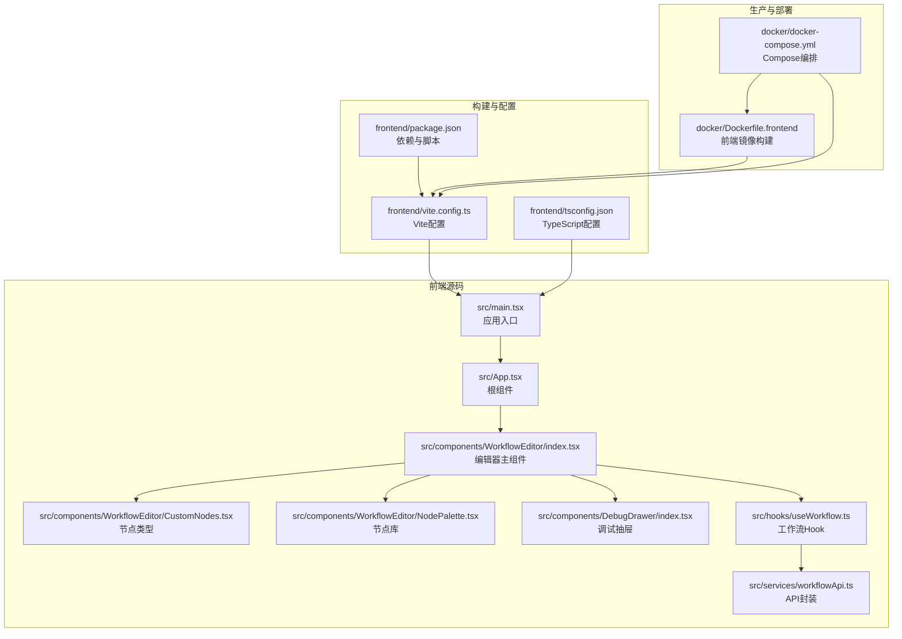
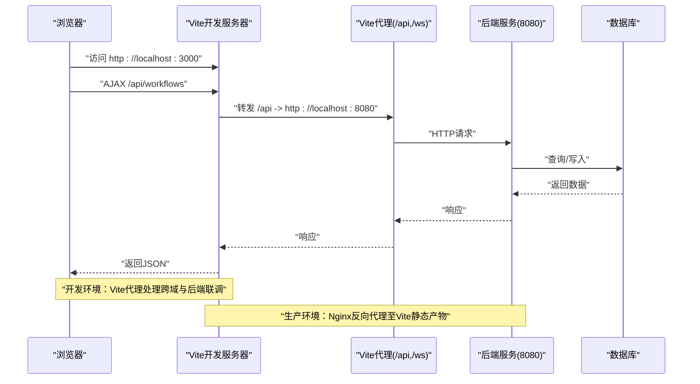
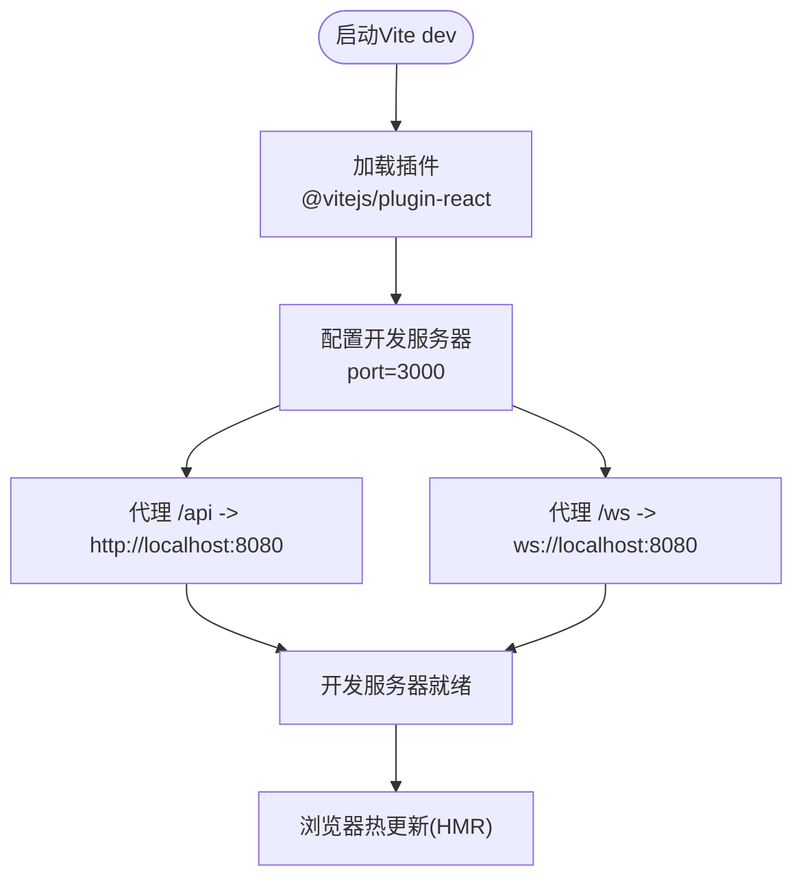
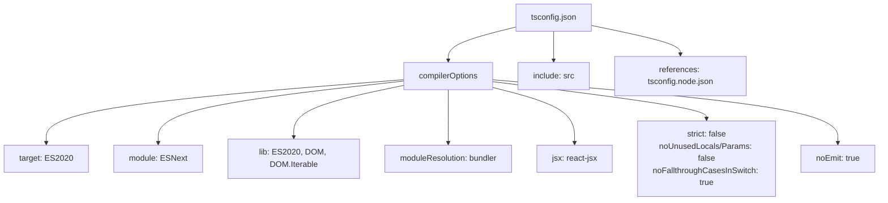
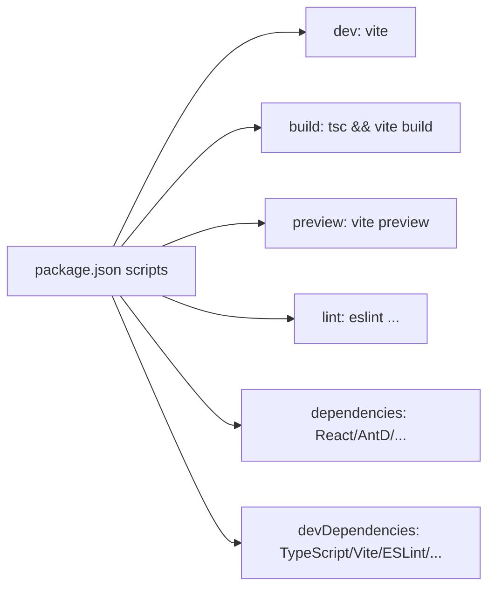
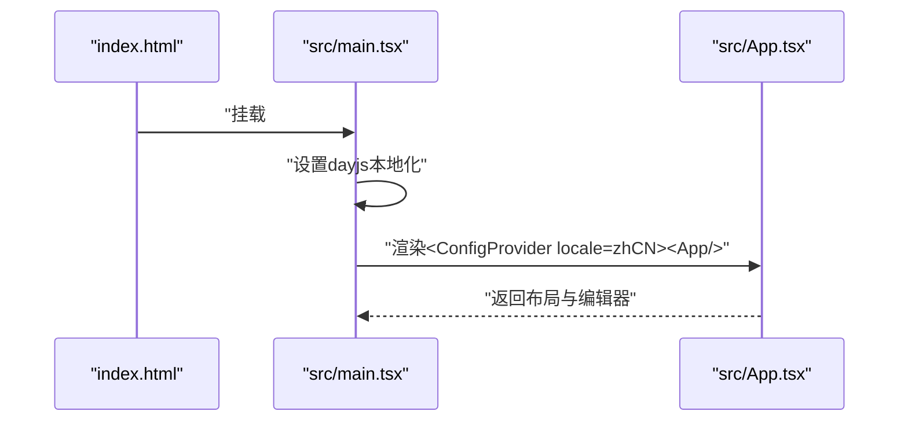
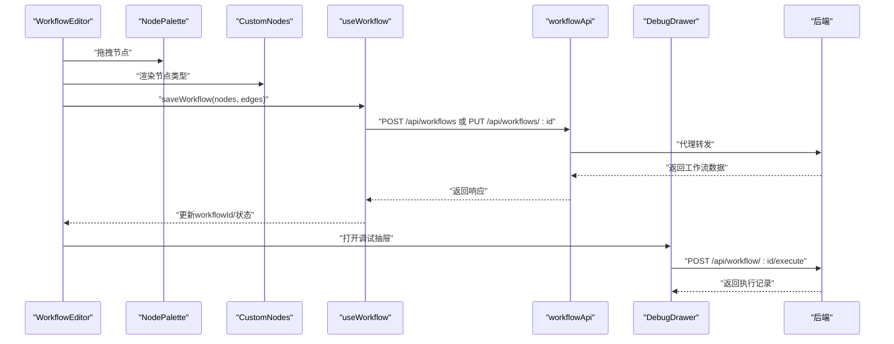
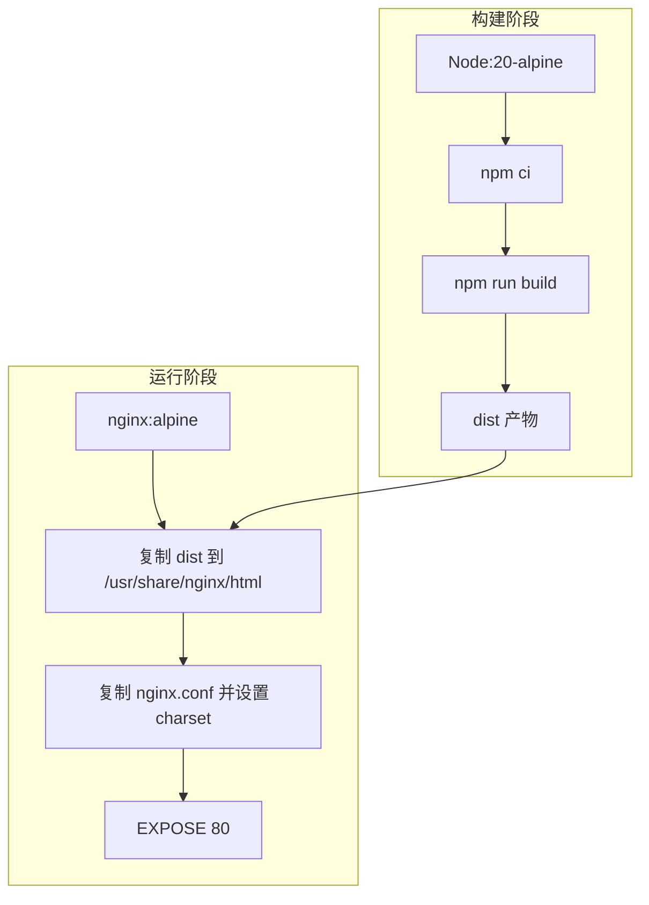
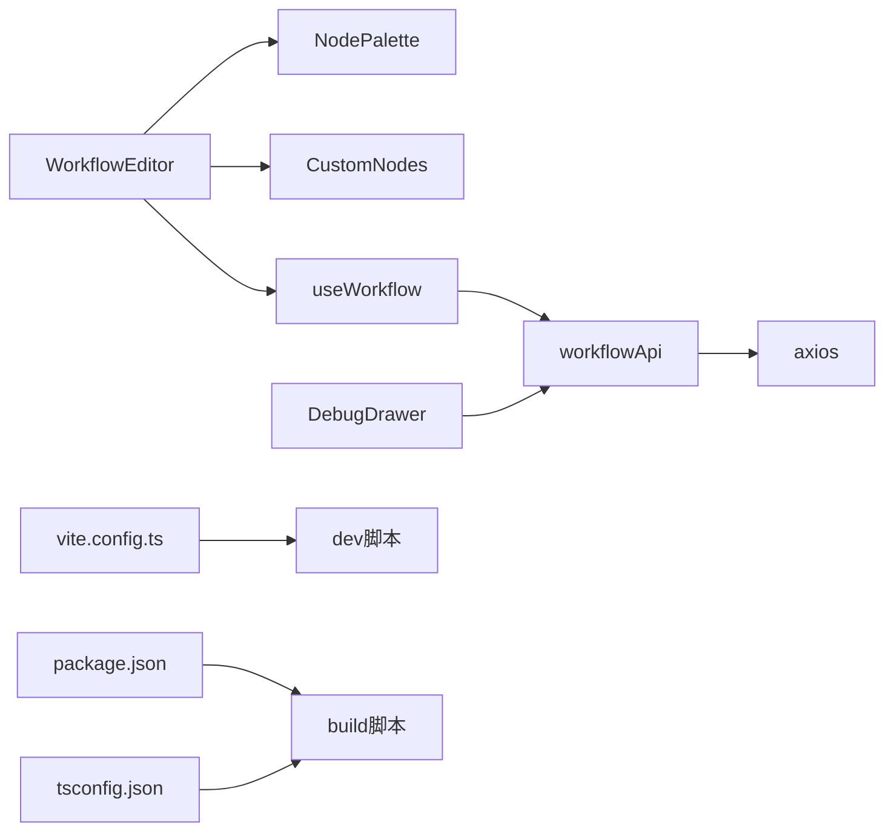

# 构建配置

<cite>
**本文引用的文件**
- [frontend/vite.config.ts](file://frontend/vite.config.ts)
- [frontend/tsconfig.json](file://frontend/tsconfig.json)
- [frontend/package.json](file://frontend/package.json)
- [frontend/src/main.tsx](file://frontend/src/main.tsx)
- [frontend/src/App.tsx](file://frontend/src/App.tsx)
- [frontend/src/components/WorkflowEditor/index.tsx](file://frontend/src/components/WorkflowEditor/index.tsx)
- [frontend/src/components/WorkflowEditor/CustomNodes.tsx](file://frontend/src/components/WorkflowEditor/CustomNodes.tsx)
- [frontend/src/components/WorkflowEditor/NodePalette.tsx](file://frontend/src/components/WorkflowEditor/NodePalette.tsx)
- [frontend/src/components/DebugDrawer/index.tsx](file://frontend/src/components/DebugDrawer/index.tsx)
- [frontend/src/hooks/useWorkflow.ts](file://frontend/src/hooks/useWorkflow.ts)
- [frontend/src/services/workflowApi.ts](file://frontend/src/services/workflowApi.ts)
- [docker/Dockerfile.frontend](file://docker/Dockerfile.frontend)
- [docker/docker-compose.yml](file://docker/docker-compose.yml)
- [README.md](file://README.md)
- [QUICKSTART.md](file://QUICKSTART.md)
</cite>

## 目录
1. [简介](#简介)
2. [项目结构](#项目结构)
3. [核心组件](#核心组件)
4. [架构总览](#架构总览)
5. [详细组件分析](#详细组件分析)
6. [依赖关系分析](#依赖关系分析)
7. [性能考量](#性能考量)
8. [故障排查指南](#故障排查指南)
9. [结论](#结论)
10. [附录](#附录)

## 简介
本文件面向BokAgent前端工程，系统性梳理Vite构建配置与优化策略、TypeScript编译与路径解析、包管理与脚本命令、开发与生产环境配置要点，并结合实际源码给出可操作的优化建议与问题排查方法。目标是帮助开发者快速理解并高效维护前端构建体系。

## 项目结构
前端采用React + TypeScript + Vite技术栈，核心目录与文件如下：
- 构建与配置：vite.config.ts、tsconfig.json、package.json
- 应用入口与根组件：src/main.tsx、src/App.tsx
- 功能模块：src/components/WorkflowEditor（编辑器）、src/components/DebugDrawer（调试抽屉）、src/hooks/useWorkflow.ts（工作流状态）、src/services/workflowApi.ts（API封装）
- 生产构建与部署：docker/Dockerfile.frontend、docker/docker-compose.yml

**图表来源**
- [frontend/src/main.tsx:1-22](file://frontend/src/main.tsx#L1-L22)
- [frontend/src/App.tsx:1-21](file://frontend/src/App.tsx#L1-L21)
- [frontend/src/components/WorkflowEditor/index.tsx:1-116](file://frontend/src/components/WorkflowEditor/index.tsx#L1-L116)
- [frontend/src/components/WorkflowEditor/CustomNodes.tsx:1-81](file://frontend/src/components/WorkflowEditor/CustomNodes.tsx#L1-L81)
- [frontend/src/components/WorkflowEditor/NodePalette.tsx:1-48](file://frontend/src/components/WorkflowEditor/NodePalette.tsx#L1-L48)
- [frontend/src/components/DebugDrawer/index.tsx:1-141](file://frontend/src/components/DebugDrawer/index.tsx#L1-L141)
- [frontend/src/hooks/useWorkflow.ts:1-69](file://frontend/src/hooks/useWorkflow.ts#L1-L69)
- [frontend/src/services/workflowApi.ts:1-44](file://frontend/src/services/workflowApi.ts#L1-L44)
- [frontend/vite.config.ts:1-21](file://frontend/vite.config.ts#L1-L21)
- [frontend/tsconfig.json:1-26](file://frontend/tsconfig.json#L1-L26)
- [frontend/package.json:1-37](file://frontend/package.json#L1-L37)
- [docker/Dockerfile.frontend:1-35](file://docker/Dockerfile.frontend#L1-L35)
- [docker/docker-compose.yml:1-132](file://docker/docker-compose.yml#L1-L132)

**章节来源**
- [frontend/vite.config.ts:1-21](file://frontend/vite.config.ts#L1-L21)
- [frontend/tsconfig.json:1-26](file://frontend/tsconfig.json#L1-L26)
- [frontend/package.json:1-37](file://frontend/package.json#L1-L37)
- [docker/Dockerfile.frontend:1-35](file://docker/Dockerfile.frontend#L1-L35)
- [docker/docker-compose.yml:1-132](file://docker/docker-compose.yml#L1-L132)

## 核心组件
本节聚焦前端构建与开发的关键配置与实现。

- Vite配置（开发服务器、代理、插件）
  - 插件：React开发插件
  - 服务器：端口、API代理（HTTP与WebSocket）
- TypeScript配置（编译目标、模块解析、严格性）
- 包管理与脚本（开发、构建、预览、代码质量）
- 生产构建与部署（多阶段Docker镜像、Nginx）

**章节来源**
- [frontend/vite.config.ts:1-21](file://frontend/vite.config.ts#L1-L21)
- [frontend/tsconfig.json:1-26](file://frontend/tsconfig.json#L1-L26)
- [frontend/package.json:1-37](file://frontend/package.json#L1-L37)
- [docker/Dockerfile.frontend:1-35](file://docker/Dockerfile.frontend#L1-L35)

## 架构总览
下图展示从浏览器到后端服务的请求链路，以及开发与生产环境的差异：

**图表来源**
- [frontend/vite.config.ts:7-19](file://frontend/vite.config.ts#L7-L19)
- [frontend/src/services/workflowApi.ts:3-8](file://frontend/src/services/workflowApi.ts#L3-L8)
- [docker/Dockerfile.frontend:26-30](file://docker/Dockerfile.frontend#L26-L30)

## 详细组件分析

### Vite配置与开发服务器
- 插件：启用React相关开发能力
- 服务器：
  - 端口：3000
  - 代理：
    - HTTP前缀“/api”代理至后端HTTP服务
    - WebSocket前缀“/ws”代理至后端WS服务
- 热更新：由Vite内置实现，无需额外配置

**图表来源**
- [frontend/vite.config.ts:5-20](file://frontend/vite.config.ts#L5-L20)

**章节来源**
- [frontend/vite.config.ts:1-21](file://frontend/vite.config.ts#L1-L21)

### TypeScript配置与编译选项
- 目标与库：ES2020目标、ESNext模块、DOM/DOM.Iterable
- 模块解析：bundler模式，支持TS扩展导入、JSON模块、隔离模块、仅发出声明
- JSX：使用react-jsx
- 严格性：关闭严格模式与未使用局部变量/参数检查，保留switch穷举检查
- 包含范围：src目录
- 引用：包含tsconfig.node.json

**图表来源**
- [frontend/tsconfig.json:2-25](file://frontend/tsconfig.json#L2-L25)

**章节来源**
- [frontend/tsconfig.json:1-26](file://frontend/tsconfig.json#L1-L26)

### 包管理与脚本命令
- 类型：ES模块
- 开发：vite
- 构建：先tsc校验，再vite build
- 预览：vite preview
- 代码质量：eslint（按扩展名扫描，报告未使用禁用指令，最大警告数0）
- 依赖：React、Ant Design、React Flow、Monaco Editor、Axios、Zustand、路由等
- 开发依赖：TypeScript、Vite、React插件、ESLint及其插件

**图表来源**
- [frontend/package.json:6-11](file://frontend/package.json#L6-L11)
- [frontend/package.json:24-35](file://frontend/package.json#L24-L35)

**章节来源**
- [frontend/package.json:1-37](file://frontend/package.json#L1-L37)

### 应用入口与根组件
- 入口：创建React根节点，注入Ant Design中文语言包，设置dayjs本地化，输出UTF-8控制台日志
- 根组件：页面布局与标题，承载编辑器

**图表来源**
- [frontend/src/main.tsx:1-22](file://frontend/src/main.tsx#L1-L22)
- [frontend/src/App.tsx:1-21](file://frontend/src/App.tsx#L1-L21)

**章节来源**
- [frontend/src/main.tsx:1-22](file://frontend/src/main.tsx#L1-L22)
- [frontend/src/App.tsx:1-21](file://frontend/src/App.tsx#L1-L21)

### 工作流编辑器与调试
- 编辑器：React Flow画布、节点拖拽、连线、保存、调试抽屉
- 节点类型：开始/LLM/结束三种节点
- 节点库：拖拽面板
- 调试抽屉：构造测试输入，调用后端执行接口，展示执行结果
- 工作流Hook：封装保存/加载/重置逻辑
- API封装：统一基地址为“/api”，便于代理转发

**图表来源**
- [frontend/src/components/WorkflowEditor/index.tsx:1-116](file://frontend/src/components/WorkflowEditor/index.tsx#L1-L116)
- [frontend/src/components/WorkflowEditor/NodePalette.tsx:1-48](file://frontend/src/components/WorkflowEditor/NodePalette.tsx#L1-L48)
- [frontend/src/components/WorkflowEditor/CustomNodes.tsx:1-81](file://frontend/src/components/WorkflowEditor/CustomNodes.tsx#L1-L81)
- [frontend/src/hooks/useWorkflow.ts:1-69](file://frontend/src/hooks/useWorkflow.ts#L1-L69)
- [frontend/src/services/workflowApi.ts:1-44](file://frontend/src/services/workflowApi.ts#L1-L44)
- [frontend/src/components/DebugDrawer/index.tsx:1-141](file://frontend/src/components/DebugDrawer/index.tsx#L1-L141)

**章节来源**
- [frontend/src/components/WorkflowEditor/index.tsx:1-116](file://frontend/src/components/WorkflowEditor/index.tsx#L1-L116)
- [frontend/src/components/WorkflowEditor/NodePalette.tsx:1-48](file://frontend/src/components/WorkflowEditor/NodePalette.tsx#L1-L48)
- [frontend/src/components/WorkflowEditor/CustomNodes.tsx:1-81](file://frontend/src/components/WorkflowEditor/CustomNodes.tsx#L1-L81)
- [frontend/src/components/DebugDrawer/index.tsx:1-141](file://frontend/src/components/DebugDrawer/index.tsx#L1-L141)
- [frontend/src/hooks/useWorkflow.ts:1-69](file://frontend/src/hooks/useWorkflow.ts#L1-L69)
- [frontend/src/services/workflowApi.ts:1-44](file://frontend/src/services/workflowApi.ts#L1-L44)

### 生产构建与部署
- Dockerfile.frontend：
  - 构建阶段：Node基础镜像，安装依赖，构建产物
  - 运行阶段：Nginx，复制dist，设置UTF-8与时区，暴露80
  - 通过Nginx.conf设置字符集
- docker-compose.yml：
  - 前端服务：构建Dockerfile.frontend，映射80端口
  - 后端服务：监听8080端口，前端依赖后端健康状态
- 说明：生产环境由Nginx提供静态资源服务，Vite开发服务器仅用于开发联调

**图表来源**
- [docker/Dockerfile.frontend:1-35](file://docker/Dockerfile.frontend#L1-L35)
- [docker/docker-compose.yml:115-126](file://docker/docker-compose.yml#L115-L126)

**章节来源**
- [docker/Dockerfile.frontend:1-35](file://docker/Dockerfile.frontend#L1-L35)
- [docker/docker-compose.yml:1-132](file://docker/docker-compose.yml#L1-L132)

## 依赖关系分析
- 组件耦合：
  - WorkflowEditor依赖NodePalette、CustomNodes、useWorkflow、workflowApi
  - DebugDrawer依赖workflowApi与编辑器数据
  - useWorkflow依赖workflowApi
  - workflowApi基于Axios，统一前缀“/api”
- 代理耦合：
  - 前端脚本/dev与代理配置共同保证开发联调
- 构建耦合：
  - package.json的build脚本顺序：先tsc再vite build
  - tsconfig.json的noEmit与bundler解析影响打包行为

**图表来源**
- [frontend/src/components/WorkflowEditor/index.tsx:1-116](file://frontend/src/components/WorkflowEditor/index.tsx#L1-L116)
- [frontend/src/components/WorkflowEditor/NodePalette.tsx:1-48](file://frontend/src/components/WorkflowEditor/NodePalette.tsx#L1-L48)
- [frontend/src/components/WorkflowEditor/CustomNodes.tsx:1-81](file://frontend/src/components/WorkflowEditor/CustomNodes.tsx#L1-L81)
- [frontend/src/hooks/useWorkflow.ts:1-69](file://frontend/src/hooks/useWorkflow.ts#L1-L69)
- [frontend/src/services/workflowApi.ts:1-44](file://frontend/src/services/workflowApi.ts#L1-L44)
- [frontend/src/components/DebugDrawer/index.tsx:1-141](file://frontend/src/components/DebugDrawer/index.tsx#L1-L141)
- [frontend/vite.config.ts:5-20](file://frontend/vite.config.ts#L5-L20)
- [frontend/package.json:6-11](file://frontend/package.json#L6-L11)
- [frontend/tsconfig.json:2-25](file://frontend/tsconfig.json#L2-L25)

**章节来源**
- [frontend/src/components/WorkflowEditor/index.tsx:1-116](file://frontend/src/components/WorkflowEditor/index.tsx#L1-L116)
- [frontend/src/hooks/useWorkflow.ts:1-69](file://frontend/src/hooks/useWorkflow.ts#L1-L69)
- [frontend/src/services/workflowApi.ts:1-44](file://frontend/src/services/workflowApi.ts#L1-L44)
- [frontend/vite.config.ts:1-21](file://frontend/vite.config.ts#L1-L21)
- [frontend/package.json:1-37](file://frontend/package.json#L1-L37)
- [frontend/tsconfig.json:1-26](file://frontend/tsconfig.json#L1-L26)

## 性能考量
- 代码分割与Tree Shaking
  - 使用ES模块与bundler解析，配合现代打包器可实现按需加载与无用代码剔除
  - 建议：拆分大组件、懒加载非首屏模块
- 构建优化
  - 生产构建：确保最小化与资源内联策略符合需求
  - 资源指纹：启用哈希命名，提升缓存命中
- 缓存策略
  - Nginx静态资源缓存与版本化文件名结合
- CDN
  - 可将第三方依赖（如AntD、React Flow）指向CDN，减少首包体积
- 开发体验
  - Vite HMR已开箱即用；可按需开启Fast Refresh与严格模式检查

[本节为通用指导，不直接分析具体文件]

## 故障排查指南
- 开发联调问题
  - 确认Vite代理是否正确配置（/api与/ws），端口是否冲突
  - 检查后端服务是否健康（compose日志）
- 构建失败
  - 先执行tsc校验，修正类型错误后再构建
  - 确认模块解析与noEmit设置与打包器兼容
- 生产显示异常
  - 检查Nginx字符集与时区设置
  - 确认dist目录已正确复制
- 常见问题定位
  - 查看compose日志：后端/前端服务状态
  - 端口占用：调整docker-compose端口映射

**章节来源**
- [frontend/vite.config.ts:7-19](file://frontend/vite.config.ts#L7-L19)
- [frontend/package.json:8-10](file://frontend/package.json#L8-L10)
- [docker/docker-compose.yml:127-131](file://docker/docker-compose.yml#L127-L131)
- [docker/Dockerfile.frontend:22-24](file://docker/Dockerfile.frontend#L22-L24)

## 结论
本项目前端构建以Vite为核心，配合TypeScript与现代化依赖生态，实现了高效的开发体验与清晰的生产构建流程。通过代理与API封装，开发联调顺畅；通过Docker与Nginx，生产部署稳定可靠。建议在后续迭代中进一步完善代码分割、缓存与CDN策略，并持续优化类型安全与代码质量。

[本节为总结性内容，不直接分析具体文件]

## 附录
- 快速开始与本地开发
  - 后端：进入backend目录，使用Maven启动
  - 前端：进入frontend目录，安装依赖后运行dev脚本
  - 开发服务器默认端口3000，代理后端8080端口
- UTF-8与中文支持
  - 前端控制台输出UTF-8，Nginx设置charset utf-8，容器locale为C.UTF-8

**章节来源**
- [README.md:52-67](file://README.md#L52-L67)
- [QUICKSTART.md:166-185](file://QUICKSTART.md#L166-L185)
- [docker/Dockerfile.frontend:22-24](file://docker/Dockerfile.frontend#L22-L24)