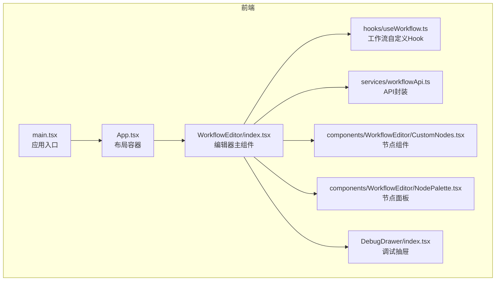
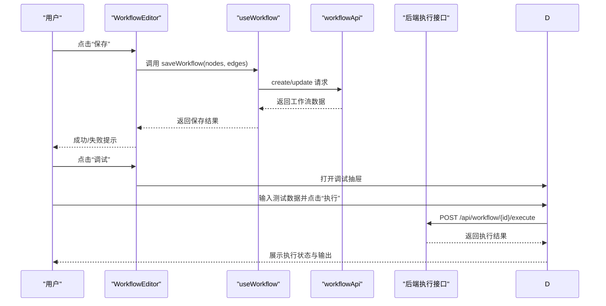
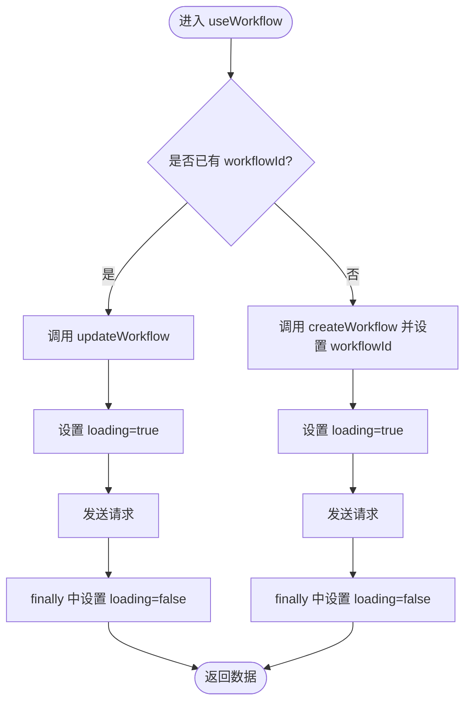
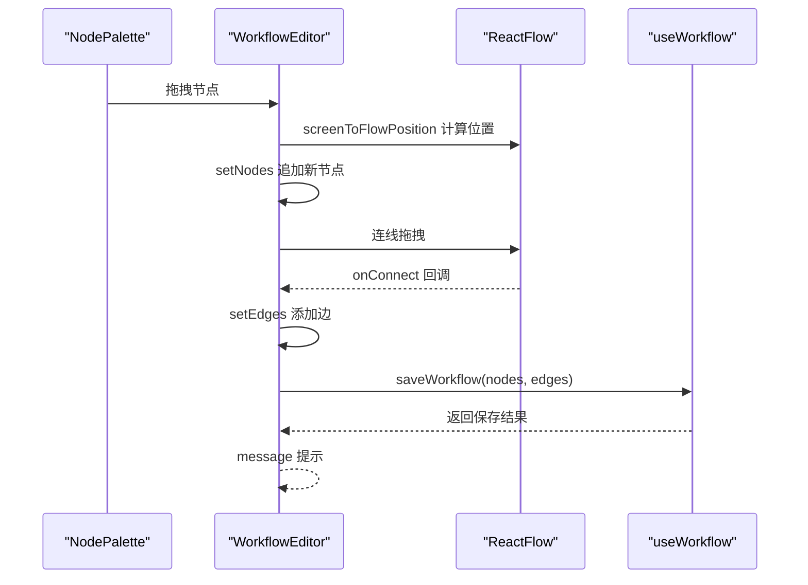
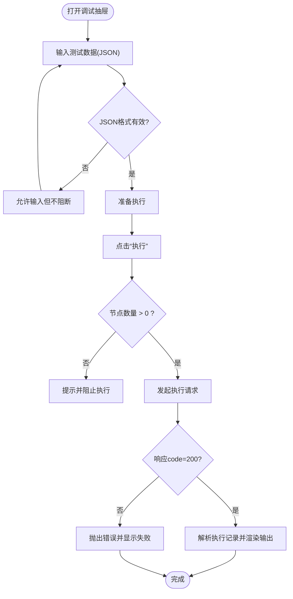
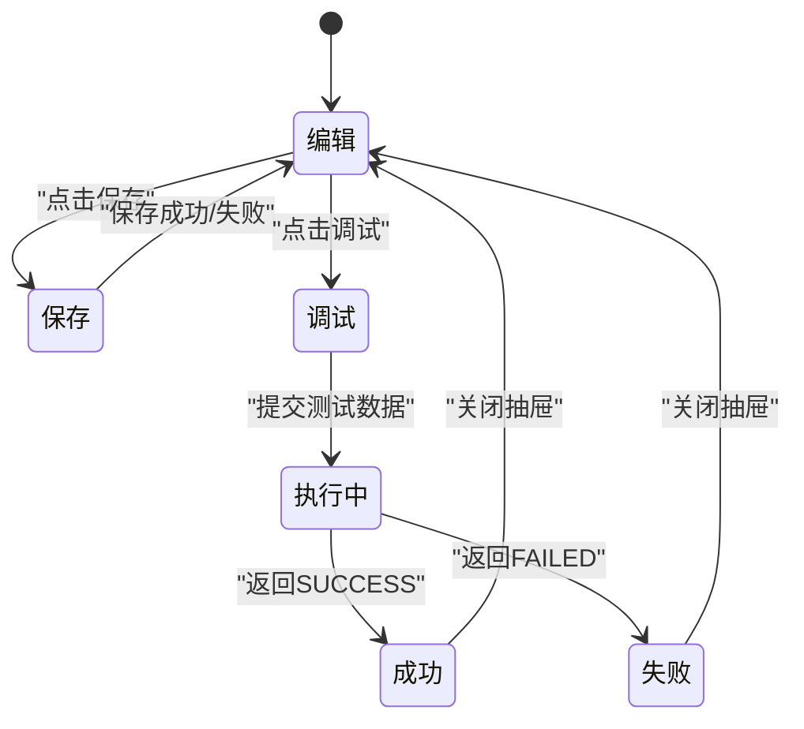
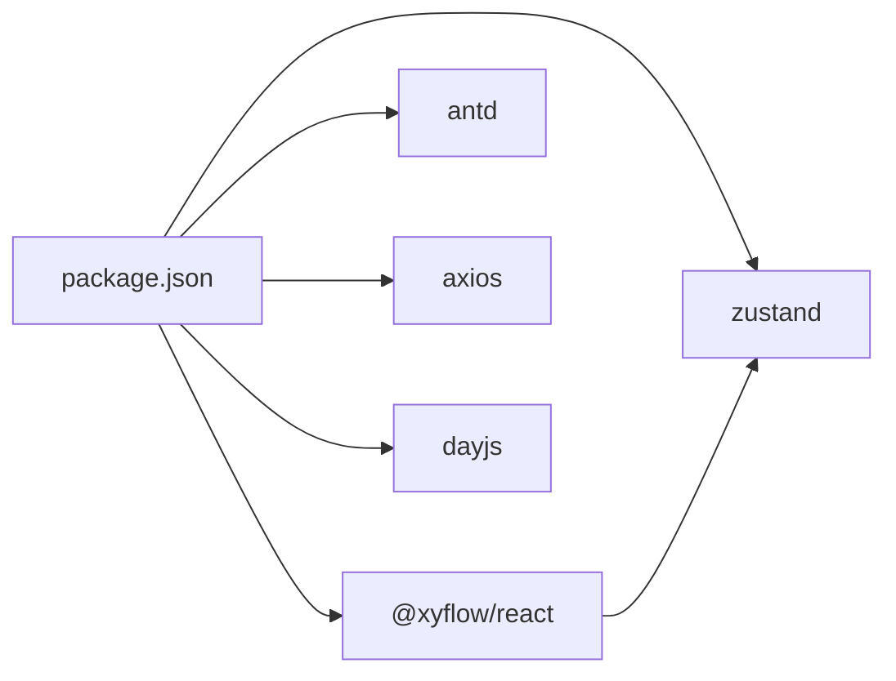

# 状态管理

<cite>
**本文引用的文件**
- [frontend/src/hooks/useWorkflow.ts](file://frontend/src/hooks/useWorkflow.ts)
- [frontend/src/services/workflowApi.ts](file://frontend/src/services/workflowApi.ts)
- [frontend/src/components/WorkflowEditor/index.tsx](file://frontend/src/components/WorkflowEditor/index.tsx)
- [frontend/src/components/DebugDrawer/index.tsx](file://frontend/src/components/DebugDrawer/index.tsx)
- [frontend/src/components/WorkflowEditor/CustomNodes.tsx](file://frontend/src/components/WorkflowEditor/CustomNodes.tsx)
- [frontend/src/components/WorkflowEditor/NodePalette.tsx](file://frontend/src/components/WorkflowEditor/NodePalette.tsx)
- [frontend/src/App.tsx](file://frontend/src/App.tsx)
- [frontend/src/main.tsx](file://frontend/src/main.tsx)
- [frontend/package.json](file://frontend/package.json)
- [backend/src/main/java/com/bokagent/controller/ExecutionController.java](file://backend/src/main/java/com/bokagent/controller/ExecutionController.java)
</cite>

## 目录
1. [简介](#简介)
2. [项目结构](#项目结构)
3. [核心组件](#核心组件)
4. [架构总览](#架构总览)
5. [详细组件分析](#详细组件分析)
6. [依赖分析](#依赖分析)
7. [性能考虑](#性能考虑)
8. [故障排查指南](#故障排查指南)
9. [结论](#结论)
10. [附录](#附录)

## 简介
本文件聚焦于BokAgent前端的状态管理实践，围绕React内置Hook（useState、useReducer、useContext）与第三方状态库（Zustand）在工作流编辑器中的应用进行系统性梳理。重点包括：
- 自定义Hook设计与useWorkflow的职责边界
- 工作流数据的状态流转（编辑态、执行态、调试态）
- API数据的状态管理策略（加载、错误、成功）
- 状态持久化方案（本地存储、会话存储）
- 性能优化与调试方法

## 项目结构
前端采用Vite + React 18 + TypeScript构建，Ant Design作为UI基础，@xyflow/react用于可视化编辑器，Zustand用于轻量状态管理，Axios封装REST API。

图表来源
- [frontend/src/main.tsx:1-22](file://frontend/src/main.tsx#L1-L22)
- [frontend/src/App.tsx:1-21](file://frontend/src/App.tsx#L1-L21)
- [frontend/src/components/WorkflowEditor/index.tsx:1-116](file://frontend/src/components/WorkflowEditor/index.tsx#L1-L116)
- [frontend/src/hooks/useWorkflow.ts:1-69](file://frontend/src/hooks/useWorkflow.ts#L1-L69)
- [frontend/src/services/workflowApi.ts:1-44](file://frontend/src/services/workflowApi.ts#L1-L44)
- [frontend/src/components/DebugDrawer/index.tsx:1-141](file://frontend/src/components/DebugDrawer/index.tsx#L1-L141)
- [frontend/src/components/WorkflowEditor/CustomNodes.tsx:1-81](file://frontend/src/components/WorkflowEditor/CustomNodes.tsx#L1-L81)
- [frontend/src/components/WorkflowEditor/NodePalette.tsx:1-48](file://frontend/src/components/WorkflowEditor/NodePalette.tsx#L1-L48)

章节来源
- [frontend/src/main.tsx:1-22](file://frontend/src/main.tsx#L1-L22)
- [frontend/src/App.tsx:1-21](file://frontend/src/App.tsx#L1-L21)
- [frontend/package.json:1-37](file://frontend/package.json#L1-L37)

## 核心组件
- 自定义Hook useWorkflow：负责工作流的保存、加载、重置与加载状态管理，协调API层与编辑器UI。
- 编辑器组件 WorkflowEditor：维护画布节点与连线的实时状态，通过useWorkflow与API交互。
- 调试抽屉 DebugDrawer：承载执行态状态（测试输入、执行按钮、输出展示），并与后端执行接口交互。
- API封装 workflowApi：统一REST调用，暴露工作流与执行记录相关接口。
- 节点与面板：自定义节点组件与节点面板，配合ReactFlow实现拖拽与连线。

章节来源
- [frontend/src/hooks/useWorkflow.ts:1-69](file://frontend/src/hooks/useWorkflow.ts#L1-L69)
- [frontend/src/components/WorkflowEditor/index.tsx:1-116](file://frontend/src/components/WorkflowEditor/index.tsx#L1-L116)
- [frontend/src/components/DebugDrawer/index.tsx:1-141](file://frontend/src/components/DebugDrawer/index.tsx#L1-L141)
- [frontend/src/services/workflowApi.ts:1-44](file://frontend/src/services/workflowApi.ts#L1-L44)
- [frontend/src/components/WorkflowEditor/CustomNodes.tsx:1-81](file://frontend/src/components/WorkflowEditor/CustomNodes.tsx#L1-L81)
- [frontend/src/components/WorkflowEditor/NodePalette.tsx:1-48](file://frontend/src/components/WorkflowEditor/NodePalette.tsx#L1-L48)

## 架构总览
前端状态管理分层：
- 视图层：WorkflowEditor与DebugDrawer分别维护编辑态与执行态的局部状态。
- 自定义Hook层：useWorkflow集中处理工作流的CRUD与加载状态，屏蔽API细节。
- 服务层：workflowApi封装HTTP请求，提供清晰的接口契约。
- 后端：ExecutionController提供执行记录的增删改查，支撑调试态的执行结果回显。

图表来源
- [frontend/src/components/WorkflowEditor/index.tsx:54-62](file://frontend/src/components/WorkflowEditor/index.tsx#L54-L62)
- [frontend/src/hooks/useWorkflow.ts:9-39](file://frontend/src/hooks/useWorkflow.ts#L9-L39)
- [frontend/src/services/workflowApi.ts:11-26](file://frontend/src/services/workflowApi.ts#L11-L26)
- [frontend/src/components/DebugDrawer/index.tsx:17-67](file://frontend/src/components/DebugDrawer/index.tsx#L17-L67)

## 详细组件分析

### useWorkflow 自定义Hook 设计与实现
- 职责边界
  - 维护当前工作流ID与全局加载状态。
  - 封装保存（新建/更新）与加载逻辑，返回可被组件直接使用的状态与方法。
- 实现要点
  - 保存流程：根据是否存在workflowId判断新建或更新；在请求前后设置/清除loading；异常时抛出以便上层处理。
  - 加载流程：按ID拉取工作流，设置当前ID；同样包裹loading。
  - 重置：清空当前工作流ID，便于新建工作流。
- 与ReactFlow的协作
  - 通过useNodesState/useEdgesState维护画布节点与连线，useWorkflow仅负责持久化与状态标识。

图表来源
- [frontend/src/hooks/useWorkflow.ts:9-39](file://frontend/src/hooks/useWorkflow.ts#L9-L39)

章节来源
- [frontend/src/hooks/useWorkflow.ts:1-69](file://frontend/src/hooks/useWorkflow.ts#L1-L69)

### 编辑器组件 WorkflowEditor 的状态管理
- 局部状态
  - nodes/edges：由ReactFlow提供的useNodesState/useEdgesState维护，支持拖拽、连线、删除等操作。
  - reactFlowInstance：保存实例以进行坐标转换。
  - debugVisible：控制调试抽屉显示。
- 行为流程
  - 拖拽节点：NodePalette提供拖拽源，WorkflowEditor接收并生成新节点。
  - 连线：onConnect回调通过addEdge更新边集合。
  - 保存：调用useWorkflow.saveWorkflow(nodes, edges)，并在消息提示中反馈结果。
- 与自定义Hook的集成
  - 通过useWorkflow返回的saveWorkflow与workflowId，实现工作流的持久化与状态标识。

图表来源
- [frontend/src/components/WorkflowEditor/index.tsx:23-52](file://frontend/src/components/WorkflowEditor/index.tsx#L23-L52)
- [frontend/src/components/WorkflowEditor/index.tsx:54-62](file://frontend/src/components/WorkflowEditor/index.tsx#L54-L62)
- [frontend/src/hooks/useWorkflow.ts:9-39](file://frontend/src/hooks/useWorkflow.ts#L9-L39)

章节来源
- [frontend/src/components/WorkflowEditor/index.tsx:1-116](file://frontend/src/components/WorkflowEditor/index.tsx#L1-L116)
- [frontend/src/components/WorkflowEditor/NodePalette.tsx:1-48](file://frontend/src/components/WorkflowEditor/NodePalette.tsx#L1-L48)
- [frontend/src/components/WorkflowEditor/CustomNodes.tsx:1-81](file://frontend/src/components/WorkflowEditor/CustomNodes.tsx#L1-L81)

### 调试抽屉 DebugDrawer 的执行态管理
- 状态字段
  - testData：测试输入的JSON字符串，实时校验格式。
  - output：执行结果的结构化展示。
  - loading：执行按钮的加载态。
- 执行流程
  - 校验节点数量，避免无节点执行。
  - 发起执行请求，解析响应并更新output与message。
  - 失败时捕获异常，输出错误信息。
- 与后端的交互
  - 调用后端执行接口，返回执行记录并渲染状态与时间戳等信息。

图表来源
- [frontend/src/components/DebugDrawer/index.tsx:17-67](file://frontend/src/components/DebugDrawer/index.tsx#L17-L67)

章节来源
- [frontend/src/components/DebugDrawer/index.tsx:1-141](file://frontend/src/components/DebugDrawer/index.tsx#L1-L141)

### API数据的状态管理策略
- 加载状态
  - 在保存与加载流程中统一设置/清除loading，避免重复请求与界面闪烁。
- 错误状态
  - 保存与加载均通过try/catch捕获异常并向上抛出，交由调用方（如WorkflowEditor）进行消息提示与日志记录。
- 成功状态
  - 保存成功后返回工作流数据，加载成功后设置当前ID，确保后续操作（如执行）基于最新ID。
- 执行态
  - 调试抽屉中，执行成功与失败分别通过message与output进行反馈，保证用户感知。

章节来源
- [frontend/src/hooks/useWorkflow.ts:9-39](file://frontend/src/hooks/useWorkflow.ts#L9-L39)
- [frontend/src/components/WorkflowEditor/index.tsx:54-62](file://frontend/src/components/WorkflowEditor/index.tsx#L54-L62)
- [frontend/src/components/DebugDrawer/index.tsx:17-67](file://frontend/src/components/DebugDrawer/index.tsx#L17-L67)

### 工作流数据的状态流转
- 编辑状态
  - 用户在画布上拖拽节点、连线，nodes/edges实时更新；保存后持久化至后端。
- 执行状态
  - 调试抽屉触发执行，后端返回执行记录，前端渲染状态、输出与时间信息。
- 调试状态
  - 基于执行记录的可视化展示，辅助定位问题与验证工作流正确性。

图表来源
- [frontend/src/components/WorkflowEditor/index.tsx:54-62](file://frontend/src/components/WorkflowEditor/index.tsx#L54-L62)
- [frontend/src/components/DebugDrawer/index.tsx:17-67](file://frontend/src/components/DebugDrawer/index.tsx#L17-L67)

## 依赖分析
- 第三方库
  - @xyflow/react：提供ReactFlow画布、节点与连线的可视化能力，内部使用Zustand进行状态管理。
  - antd：提供UI组件与国际化配置。
  - axios：封装REST API请求。
  - dayjs：本地化日期处理。
  - zustand：轻量状态管理库，适合跨组件共享简单状态。
- 前端包依赖与版本
  - 参考package.json中的依赖声明，确保版本兼容与安全升级路径。

图表来源
- [frontend/package.json:12-22](file://frontend/package.json#L12-L22)

章节来源
- [frontend/package.json:1-37](file://frontend/package.json#L1-L37)

## 性能考虑
- 避免不必要的重渲染
  - 使用useCallback包裹事件处理器（如onConnect、onDragOver、onDrop），减少子组件重渲染。
  - 对节点数据的变更尽量局部化，避免将大对象作为依赖传入。
- 状态粒度控制
  - useWorkflow仅维护工作流ID与加载状态，避免将画布状态混入自定义Hook，保持职责单一。
- 请求去抖与并发控制
  - 对频繁触发的保存操作可考虑节流/去抖，避免短时间内多次写入。
- 渲染优化
  - 节点组件内部使用受控输入，避免无效更新；对大量节点时可考虑虚拟滚动或分页渲染。

## 故障排查指南
- 保存失败
  - 检查网络请求与后端返回的错误码；确认useWorkflow的异常抛出是否被捕获并提示。
  - 关注finally块是否正确恢复loading状态。
- 加载失败
  - 确认ID是否正确传递；检查API返回的数据结构是否符合预期。
- 执行失败
  - 校验测试输入JSON格式；查看后端执行接口返回的错误信息；关注调试抽屉的输出展示。
- 调试抽屉无输出
  - 确认节点数量大于0；检查执行接口URL与参数构造；核对后端执行记录的状态更新逻辑。

章节来源
- [frontend/src/hooks/useWorkflow.ts:9-39](file://frontend/src/hooks/useWorkflow.ts#L9-L39)
- [frontend/src/components/DebugDrawer/index.tsx:17-67](file://frontend/src/components/DebugDrawer/index.tsx#L17-L67)
- [backend/src/main/java/com/bokagent/controller/ExecutionController.java:25-79](file://backend/src/main/java/com/bokagent/controller/ExecutionController.java#L25-L79)

## 结论
本项目在前端状态管理上遵循“局部状态由组件维护、业务状态由自定义Hook聚合、全局状态由Zustand承担”的分层思路。useWorkflow将工作流的保存/加载与加载态统一抽象，WorkflowEditor与DebugDrawer分别覆盖编辑态与执行态，形成清晰的状态流转闭环。建议在后续迭代中：
- 引入更细粒度的错误边界与重试机制
- 对高频操作增加节流/去抖
- 在复杂场景下评估引入Redux Toolkit或Zustand的中间件能力

## 附录
- API接口清单（来自workflowApi）
  - 列表：GET /api/workflows
  - 获取：GET /api/workflows/{id}
  - 新建：POST /api/workflows
  - 更新：PUT /api/workflows/{id}
  - 删除：DELETE /api/workflows/{id}
  - 执行记录列表：GET /api/executions/workflow/{workflowId}
  - 执行记录详情：GET /api/executions/{id}
  - 创建执行记录：POST /api/executions
  - 更新执行记录：PUT /api/executions/{id}

章节来源
- [frontend/src/services/workflowApi.ts:11-41](file://frontend/src/services/workflowApi.ts#L11-L41)