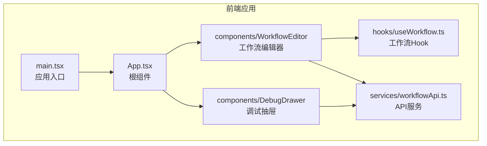
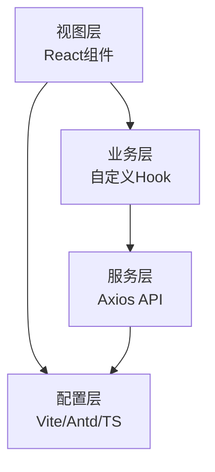
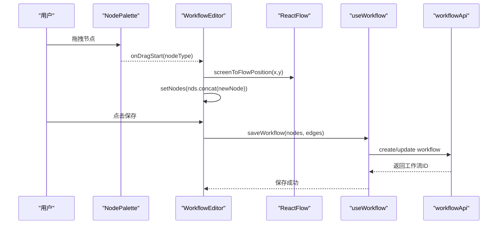
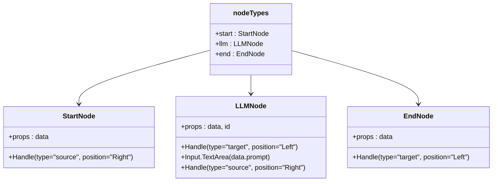
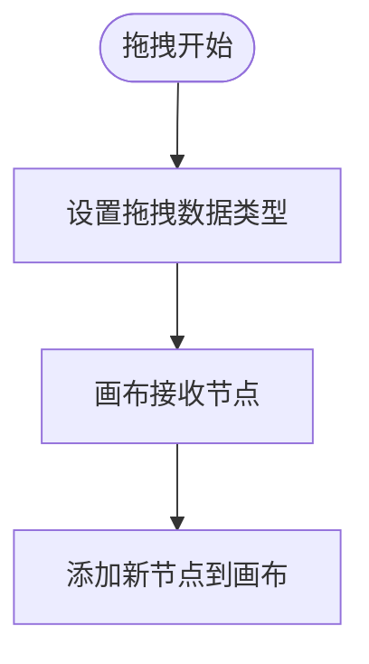
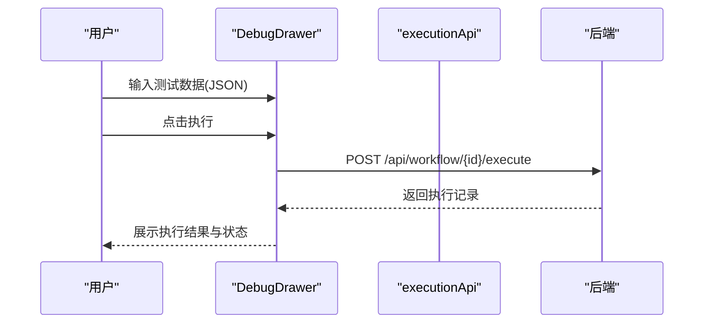
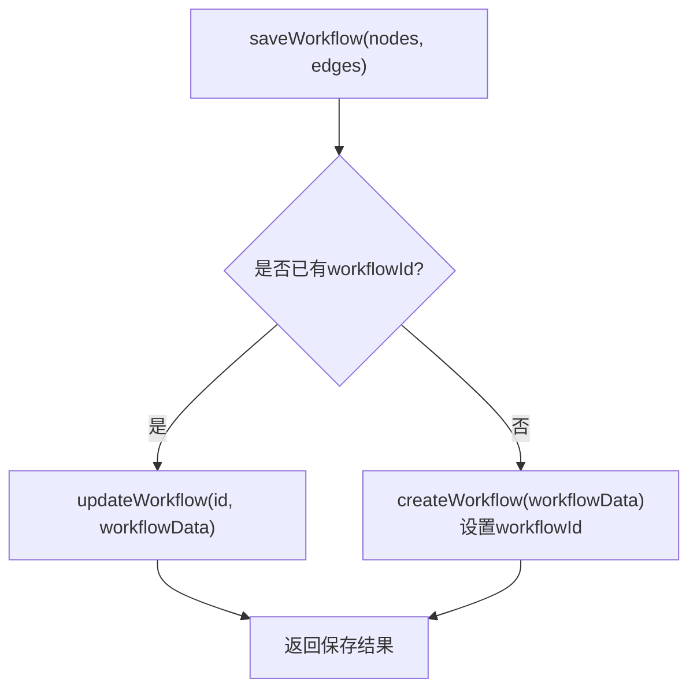
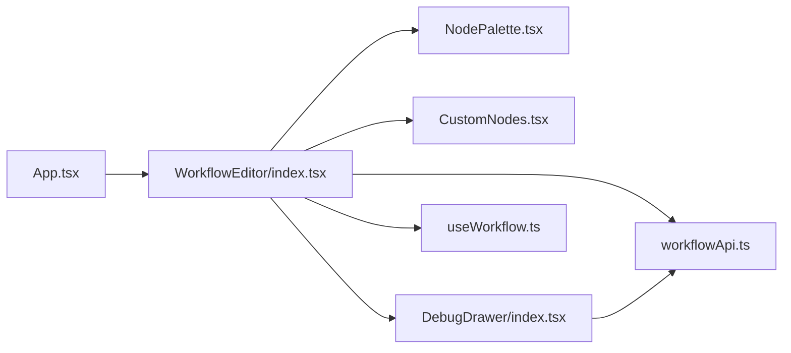

# 组件开发指南

<cite>
**本文引用的文件**
- [App.tsx](file://frontend/src/App.tsx)
- [main.tsx](file://frontend/src/main.tsx)
- [WorkflowEditor/index.tsx](file://frontend/src/components/WorkflowEditor/index.tsx)
- [CustomNodes.tsx](file://frontend/src/components/WorkflowEditor/CustomNodes.tsx)
- [NodePalette.tsx](file://frontend/src/components/WorkflowEditor/NodePalette.tsx)
- [DebugDrawer/index.tsx](file://frontend/src/components/DebugDrawer/index.tsx)
- [useWorkflow.ts](file://frontend/src/hooks/useWorkflow.ts)
- [workflowApi.ts](file://frontend/src/services/workflowApi.ts)
- [vite.config.ts](file://frontend/vite.config.ts)
- [package.json](file://frontend/package.json)
- [tsconfig.json](file://frontend/tsconfig.json)
- [README.md](file://README.md)
- [IMPLEMENTATION_PROGRESS.md](file://IMPLEMENTATION_PROGRESS.md)
</cite>

## 目录
1. [简介](#简介)
2. [项目结构](#项目结构)
3. [核心组件](#核心组件)
4. [架构总览](#架构总览)
5. [详细组件分析](#详细组件分析)
6. [依赖关系分析](#依赖关系分析)
7. [性能考虑](#性能考虑)
8. [故障排查指南](#故障排查指南)
9. [结论](#结论)
10. [附录](#附录)

## 简介
本指南面向BokAgent前端的React组件开发，围绕函数组件设计原则、Hooks应用、Props接口定义、自定义节点组件实现、组件间通信模式、组件复用策略、测试策略与性能优化进行全面讲解。结合项目中工作流编辑器的实际实现，帮助开发者在保持一致性的同时提升可维护性与可扩展性。

## 项目结构
前端采用Vite + React 18 + TypeScript + Ant Design 5 + @xyflow/react构建，核心目录如下：
- src/components：业务组件，包含工作流编辑器与调试抽屉等
- src/hooks：自定义Hook，封装业务逻辑
- src/services：API服务层，统一HTTP请求
- src：入口与根组件
- public：静态资源
- 配置：vite.config.ts、tsconfig.json、package.json

图表来源
- [main.tsx:15-21](file://frontend/src/main.tsx#L15-L21)
- [App.tsx:7-18](file://frontend/src/App.tsx#L7-L18)
- [WorkflowEditor/index.tsx:11-113](file://frontend/src/components/WorkflowEditor/index.tsx#L11-L113)
- [DebugDrawer/index.tsx:12-138](file://frontend/src/components/DebugDrawer/index.tsx#L12-L138)
- [useWorkflow.ts:4-68](file://frontend/src/hooks/useWorkflow.ts#L4-L68)
- [workflowApi.ts:11-41](file://frontend/src/services/workflowApi.ts#L11-L41)

章节来源
- [README.md:18-29](file://README.md#L18-L29)
- [package.json:12-22](file://frontend/package.json#L12-L22)
- [tsconfig.json:1-26](file://frontend/tsconfig.json#L1-L26)

## 核心组件
- 应用入口与国际化配置：在入口中配置Ant Design语言包与全局主题，并挂载根组件。
- 根组件：负责页面布局与标题展示，内部嵌套工作流编辑器。
- 工作流编辑器：基于@xyflow/react实现画布、节点拖拽、连线、保存与调试。
- 自定义节点：StartNode、LLMNode、EndNode三种节点，分别对应不同视觉风格与交互。
- 节点面板：左侧节点库，支持拖拽到画布。
- 调试抽屉：右侧抽屉，支持输入测试数据、执行工作流、查看执行结果。
- 自定义Hook：useWorkflow封装工作流的创建、更新、加载与状态管理。
- API服务：workflowApi与executionApi封装HTTP请求。

章节来源
- [main.tsx:15-21](file://frontend/src/main.tsx#L15-L21)
- [App.tsx:7-18](file://frontend/src/App.tsx#L7-L18)
- [WorkflowEditor/index.tsx:11-113](file://frontend/src/components/WorkflowEditor/index.tsx#L11-L113)
- [CustomNodes.tsx:6-78](file://frontend/src/components/WorkflowEditor/CustomNodes.tsx#L6-L78)
- [NodePalette.tsx:11-45](file://frontend/src/components/WorkflowEditor/NodePalette.tsx#L11-L45)
- [DebugDrawer/index.tsx:12-138](file://frontend/src/components/DebugDrawer/index.tsx#L12-L138)
- [useWorkflow.ts:4-68](file://frontend/src/hooks/useWorkflow.ts#L4-L68)
- [workflowApi.ts:11-41](file://frontend/src/services/workflowApi.ts#L11-L41)

## 架构总览
前端采用分层架构：
- 视图层：React函数组件与@xyflow/react画布
- 业务层：自定义Hook封装工作流状态与操作
- 服务层：Axios封装的API模块，统一处理请求与响应
- 配置层：Vite代理、Ant Design国际化与TypeScript严格模式

图表来源
- [WorkflowEditor/index.tsx:11-113](file://frontend/src/components/WorkflowEditor/index.tsx#L11-L113)
- [useWorkflow.ts:4-68](file://frontend/src/hooks/useWorkflow.ts#L4-L68)
- [workflowApi.ts:3-8](file://frontend/src/services/workflowApi.ts#L3-L8)
- [vite.config.ts:7-19](file://frontend/vite.config.ts#L7-L19)
- [main.tsx:3-10](file://frontend/src/main.tsx#L3-L10)

## 详细组件分析

### 工作流编辑器组件
职责与流程：
- 状态管理：通过@xyflow/react提供的useNodesState/useEdgesState管理节点与边的状态。
- 事件处理：onDragOver/onDrop实现节点拖拽添加；onConnect实现连线建立。
- 保存与调试：调用useWorkflow保存工作流；打开调试抽屉查看执行结果。
- 画布渲染：ReactFlowProvider包裹ReactFlow，渲染背景、控制控件与小地图。

图表来源
- [NodePalette.tsx:11-45](file://frontend/src/components/WorkflowEditor/NodePalette.tsx#L11-L45)
- [WorkflowEditor/index.tsx:23-52](file://frontend/src/components/WorkflowEditor/index.tsx#L23-L52)
- [useWorkflow.ts:9-39](file://frontend/src/hooks/useWorkflow.ts#L9-L39)
- [workflowApi.ts:18-25](file://frontend/src/services/workflowApi.ts#L18-L25)

章节来源
- [WorkflowEditor/index.tsx:11-113](file://frontend/src/components/WorkflowEditor/index.tsx#L11-L113)

### 自定义节点组件
节点类型与交互：
- StartNode：作为起点，提供右侧出口Handle，用于后续连线。
- LLMNode：支持编辑提示词的文本域，输入变更直接写入data对象，便于保存与执行。
- EndNode：作为终点，提供左侧入口Handle。
- 节点类型映射：nodeTypes导出给ReactFlow使用。

图表来源
- [CustomNodes.tsx:6-78](file://frontend/src/components/WorkflowEditor/CustomNodes.tsx#L6-L78)

章节来源
- [CustomNodes.tsx:6-78](file://frontend/src/components/WorkflowEditor/CustomNodes.tsx#L6-L78)

### 节点面板组件
职责与交互：
- 定义节点类型数组，包含类型、标签、图标与颜色。
- onDragStart设置拖拽数据类型，触发@xyflow/react的drop事件。

图表来源
- [NodePalette.tsx:11-45](file://frontend/src/components/WorkflowEditor/NodePalette.tsx#L11-L45)
- [WorkflowEditor/index.tsx:28-51](file://frontend/src/components/WorkflowEditor/index.tsx#L28-L51)

章节来源
- [NodePalette.tsx:11-45](file://frontend/src/components/WorkflowEditor/NodePalette.tsx#L11-L45)

### 调试抽屉组件
职责与交互：
- 接收nodes/edges作为输入，显示节点与连接统计。
- 支持JSON格式测试数据输入，点击执行后调用后端API获取执行结果。
- 使用Ant Design的Drawer、Form、Card等组件构建UI。

图表来源
- [DebugDrawer/index.tsx:17-67](file://frontend/src/components/DebugDrawer/index.tsx#L17-L67)
- [workflowApi.ts:29-41](file://frontend/src/services/workflowApi.ts#L29-L41)

章节来源
- [DebugDrawer/index.tsx:12-138](file://frontend/src/components/DebugDrawer/index.tsx#L12-L138)

### 自定义Hook：useWorkflow
职责与行为：
- 管理workflowId与loading状态。
- saveWorkflow：根据是否存在workflowId决定创建或更新；将nodes/edges转换为graphData提交。
- loadWorkflow：根据id加载工作流。
- reset：重置workflowId。

图表来源
- [useWorkflow.ts:9-39](file://frontend/src/hooks/useWorkflow.ts#L9-L39)

章节来源
- [useWorkflow.ts:4-68](file://frontend/src/hooks/useWorkflow.ts#L4-L68)

### API服务：workflowApi与executionApi
职责与行为：
- workflowApi：封装工作流的增删改查。
- executionApi：封装执行记录的查询与创建。

章节来源
- [workflowApi.ts:11-41](file://frontend/src/services/workflowApi.ts#L11-L41)

## 依赖关系分析
- 组件依赖：App -> WorkflowEditor；WorkflowEditor -> NodePalette、CustomNodes、DebugDrawer、useWorkflow、workflowApi。
- 外部依赖：@xyflow/react（画布）、Ant Design（UI组件库）、Axios（HTTP请求）、dayjs（日期）、Zustand（状态管理）。
- 构建与开发：Vite提供开发服务器与代理；TypeScript启用严格模式；ESLint规则约束。

图表来源
- [App.tsx:7-18](file://frontend/src/App.tsx#L7-L18)
- [WorkflowEditor/index.tsx:6-9](file://frontend/src/components/WorkflowEditor/index.tsx#L6-L9)
- [NodePalette.tsx:1-48](file://frontend/src/components/WorkflowEditor/NodePalette.tsx#L1-L48)
- [CustomNodes.tsx:1-81](file://frontend/src/components/WorkflowEditor/CustomNodes.tsx#L1-L81)
- [DebugDrawer/index.tsx:1-141](file://frontend/src/components/DebugDrawer/index.tsx#L1-L141)
- [useWorkflow.ts:1-69](file://frontend/src/hooks/useWorkflow.ts#L1-L69)
- [workflowApi.ts:1-44](file://frontend/src/services/workflowApi.ts#L1-L44)

章节来源
- [package.json:12-22](file://frontend/package.json#L12-L22)
- [vite.config.ts:7-19](file://frontend/vite.config.ts#L7-L19)
- [tsconfig.json:18-21](file://frontend/tsconfig.json#L18-L21)

## 性能考虑
- 函数组件与Hooks：优先使用函数组件与Hooks，避免不必要的类组件；合理拆分状态与副作用，减少重渲染。
- 回调函数优化：使用useCallback缓存回调，避免子组件重复渲染（例如WorkflowEditor中的onConnect、onDragOver、onDrop）。
- 事件处理：在节点面板中仅在必要时触发状态更新，避免频繁setState。
- 画布性能：@xyflow/react默认具备良好的性能表现，建议在节点数量较多时避免频繁重建节点与边的数据结构。
- 懒加载与虚拟化：对于复杂节点内容，可考虑按需渲染或虚拟化列表（如节点列表），但当前项目以简单节点为主，暂无需。
- 样式与主题：统一使用Ant Design主题与CSS变量，减少样式计算开销。

章节来源
- [WorkflowEditor/index.tsx:18-52](file://frontend/src/components/WorkflowEditor/index.tsx#L18-L52)
- [NodePalette.tsx:11-45](file://frontend/src/components/WorkflowEditor/NodePalette.tsx#L11-L45)

## 故障排查指南
- 代理与跨域：Vite配置了/api与/ws代理至后端，若无法访问，请检查后端是否启动以及代理目标地址。
- 中文与Emoji：入口已设置dayjs与Ant Design语言包，确保控制台输出与界面显示正常。
- 节点拖拽无效：确认NodePalette的onDragStart设置了正确的拖拽数据类型，并且WorkflowEditor的onDragOver/onDrop已正确绑定。
- 保存失败：检查useWorkflow的saveWorkflow逻辑与workflowApi的create/update接口返回值。
- 调试执行失败：检查DebugDrawer的测试数据JSON格式与后端执行接口返回码。

章节来源
- [vite.config.ts:7-19](file://frontend/vite.config.ts#L7-L19)
- [main.tsx:9-10](file://frontend/src/main.tsx#L9-L10)
- [NodePalette.tsx:11-45](file://frontend/src/components/WorkflowEditor/NodePalette.tsx#L11-L45)
- [WorkflowEditor/index.tsx:23-52](file://frontend/src/components/WorkflowEditor/index.tsx#L23-L52)
- [useWorkflow.ts:9-39](file://frontend/src/hooks/useWorkflow.ts#L9-L39)
- [DebugDrawer/index.tsx:17-67](file://frontend/src/components/DebugDrawer/index.tsx#L17-L67)

## 结论
本指南基于BokAgent前端实际实现，总结了函数组件设计原则、Hooks最佳实践、Props接口定义、自定义节点实现、组件间通信模式、复用策略、测试与性能优化要点。建议在后续迭代中引入单元测试与集成测试，完善组件边界与错误处理，持续优化画布性能与用户体验。

## 附录

### 设计原则与开发规范
- 函数组件优先：使用函数组件与Hooks替代类组件，保持简洁与可读性。
- Props接口定义：为组件定义明确的Props接口，确保类型安全与文档清晰。
- 状态集中管理：将共享状态放入自定义Hook，避免状态分散。
- 事件处理优化：使用useCallback缓存回调，减少子组件重渲染。
- 样式与主题：统一使用Ant Design组件与样式变量，保证一致性。

章节来源
- [WorkflowEditor/index.tsx:11-113](file://frontend/src/components/WorkflowEditor/index.tsx#L11-L113)
- [DebugDrawer/index.tsx:5-10](file://frontend/src/components/DebugDrawer/index.tsx#L5-L10)

### 组件间通信模式
- 父子组件通信：父组件通过Props向下传递数据与回调，子组件通过回调向上通知。
- 兄弟组件通信：通过共同父组件的状态与回调实现数据共享。
- 跨层级通信：通过自定义Hook集中状态，或使用Context（当前项目未使用）。

章节来源
- [WorkflowEditor/index.tsx:11-113](file://frontend/src/components/WorkflowEditor/index.tsx#L11-L113)
- [DebugDrawer/index.tsx:12-138](file://frontend/src/components/DebugDrawer/index.tsx#L12-L138)

### 组件复用策略与抽象方法
- 高阶组件：当前项目未使用，可在需要通用能力时引入。
- Render Props：当前项目未使用，可在需要灵活组合渲染逻辑时考虑。
- 自定义Hook：useWorkflow已体现复用策略，建议继续扩展更多业务逻辑。

章节来源
- [useWorkflow.ts:4-68](file://frontend/src/hooks/useWorkflow.ts#L4-L68)

### 测试策略
- 单元测试：建议为自定义Hook与纯函数编写测试，覆盖保存、加载、错误处理等场景。
- 集成测试：建议为工作流编辑器的关键流程编写端到端测试，包括拖拽、连线、保存、调试执行。
- Mock与拦截：使用Vite代理与Mock API模拟后端行为，隔离网络依赖。

章节来源
- [IMPLEMENTATION_PROGRESS.md:98-113](file://IMPLEMENTATION_PROGRESS.md#L98-L113)

### 性能优化技巧
- memoization：对昂贵的计算或渲染结果进行缓存（当前项目以简单节点为主，暂无需）。
- 懒加载：对复杂节点内容按需加载。
- 虚拟化：节点列表较多时考虑虚拟化（当前项目以简单节点为主，暂无需）。

章节来源
- [WorkflowEditor/index.tsx:18-52](file://frontend/src/components/WorkflowEditor/index.tsx#L18-L52)