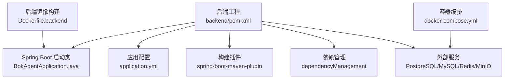
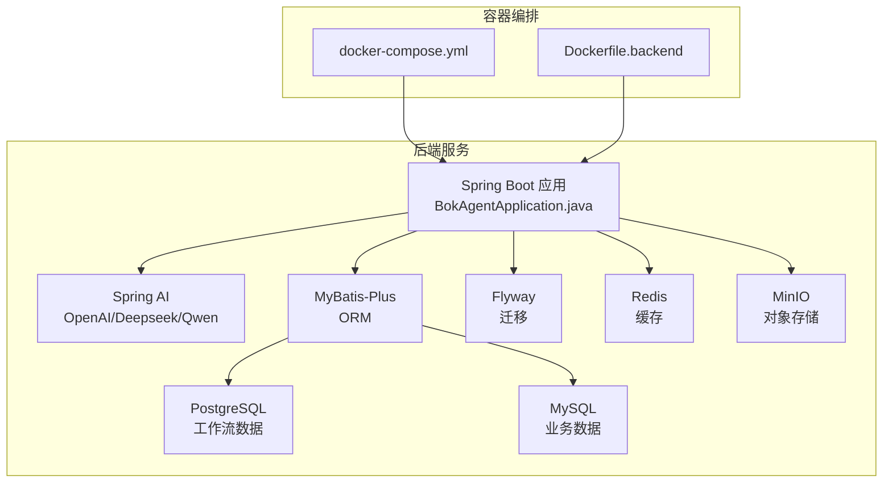
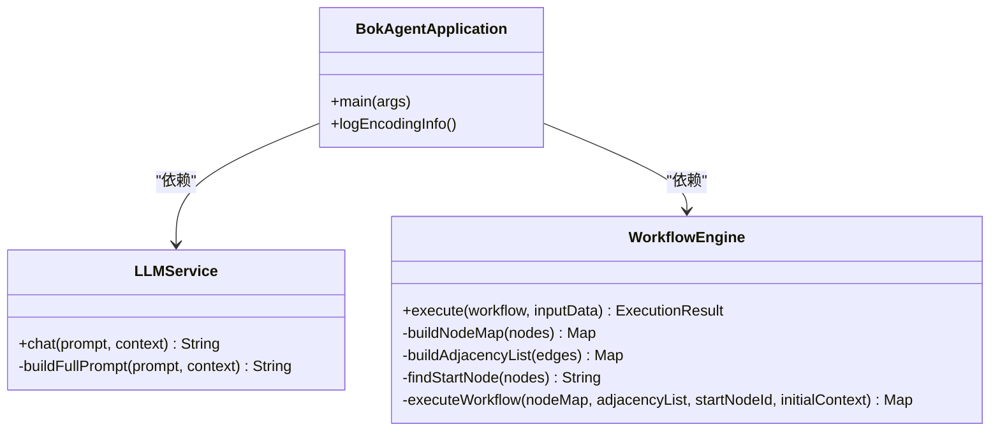
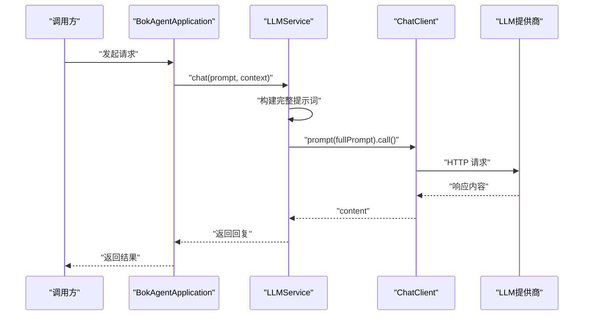
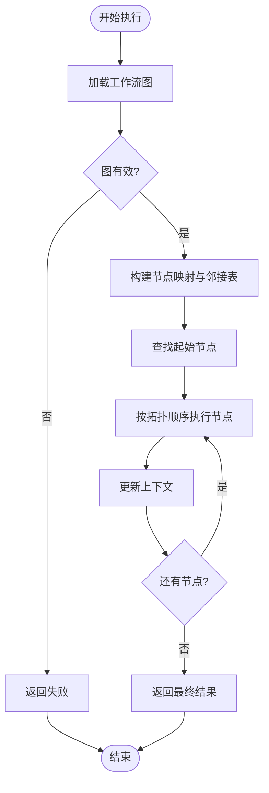

# 依赖管理

<cite>
**本文引用的文件**
- [backend/pom.xml](file://backend/pom.xml)
- [backend/src/main/resources/application.yml](file://backend/src/main/resources/application.yml)
- [docker/docker-compose.yml](file://docker/docker-compose.yml)
- [docker/Dockerfile.backend](file://docker/Dockerfile.backend)
- [README.md](file://README.md)
- [QUICKSTART.md](file://QUICKSTART.md)
- [backend/src/main/java/com/bokagent/BokAgentApplication.java](file://backend/src/main/java/com/bokagent/BokAgentApplication.java)
- [backend/src/main/java/com/bokagent/service/LLMService.java](file://backend/src/main/java/com/bokagent/service/LLMService.java)
- [backend/src/main/java/com/bokagent/engine/WorkflowEngine.java](file://backend/src/main/java/com/bokagent/engine/WorkflowEngine.java)
</cite>

## 目录
1. [简介](#简介)
2. [项目结构](#项目结构)
3. [核心组件](#核心组件)
4. [架构总览](#架构总览)
5. [详细组件分析](#详细组件分析)
6. [依赖分析](#依赖分析)
7. [性能考量](#性能考量)
8. [故障排查指南](#故障排查指南)
9. [结论](#结论)
10. [附录](#附录)

## 简介
本文件聚焦于后端项目的依赖管理体系，系统性解读 Maven POM 的结构与配置，涵盖项目元数据、依赖声明、依赖管理、插件配置、构建配置、依赖范围控制、冲突解决策略、更新与维护建议，以及开发与生产环境的差异配置与性能优化要点。同时结合实际代码使用场景，说明关键依赖（如 Spring Boot 3.5、Spring AI 1.1、MyBatis-Plus 3.5、LangGraph4J、MinIO 等）的作用与版本选择依据。

## 项目结构
后端采用 Maven 多模块风格的单模块工程组织，核心配置集中在 backend/pom.xml；运行时配置通过 application.yml 管理；容器化通过 docker-compose.yml 与 Dockerfile.backend 实现。

图表来源
- [backend/pom.xml:1-170](file://backend/pom.xml#L1-L170)
- [backend/src/main/resources/application.yml:1-190](file://backend/src/main/resources/application.yml#L1-L190)
- [docker/docker-compose.yml:1-132](file://docker/docker-compose.yml#L1-L132)
- [docker/Dockerfile.backend:1-51](file://docker/Dockerfile.backend#L1-L51)

章节来源
- [backend/pom.xml:1-170](file://backend/pom.xml#L1-L170)
- [backend/src/main/resources/application.yml:1-190](file://backend/src/main/resources/application.yml#L1-L190)
- [docker/docker-compose.yml:1-132](file://docker/docker-compose.yml#L1-L132)
- [docker/Dockerfile.backend:1-51](file://docker/Dockerfile.backend#L1-L51)

## 核心组件
- 项目元数据与属性
  - 父 POM：spring-boot-starter-parent 3.5.0，统一版本与插件行为
  - Java 版本：21
  - 自定义属性：spring-ai.version、mybatis-plus.version、langgraph4j.version、minio.version
- 依赖声明
  - Web、WebSocket、Redis、Actuator 等 Spring Boot Starter
  - Spring AI OpenAI Starter
  - MyBatis-Plus Starter（配合自定义版本）
  - 数据库驱动（PostgreSQL、MySQL，作用域 runtime）
  - Flyway（数据库迁移）
  - MinIO 客户端
  - LangGraph4J 核心
  - Lombok（可选）
  - Jackson（JSON 处理）
  - WebSocket 客户端
  - 测试 Starter（作用域 test）
- 依赖管理
  - Spring AI BOM 导入，统一管理 Spring AI 生态版本
- 构建与插件
  - spring-boot-maven-plugin，默认排除 Lombok
- 仓库
  - Spring Milestones 仓库（里程碑版本支持）

章节来源
- [backend/pom.xml:8-27](file://backend/pom.xml#L8-L27)
- [backend/pom.xml:29-128](file://backend/pom.xml#L29-L128)
- [backend/pom.xml:130-140](file://backend/pom.xml#L130-L140)
- [backend/pom.xml:142-157](file://backend/pom.xml#L142-L157)
- [backend/pom.xml:159-168](file://backend/pom.xml#L159-L168)

## 架构总览
后端应用通过 Spring Boot 启动，整合 Spring AI 进行多 LLM 调用，使用 MyBatis-Plus 访问 PostgreSQL/MySQL，Redis 提供缓存，Flyway 管理数据库迁移，MinIO 提供对象存储能力。容器化部署通过 docker-compose 统一编排。

图表来源
- [backend/src/main/java/com/bokagent/BokAgentApplication.java:16-19](file://backend/src/main/java/com/bokagent/BokAgentApplication.java#L16-L19)
- [backend/src/main/java/com/bokagent/service/LLMService.java:14-19](file://backend/src/main/java/com/bokagent/service/LLMService.java#L14-L19)
- [backend/src/main/resources/application.yml:16-44](file://backend/src/main/resources/application.yml#L16-L44)
- [docker/docker-compose.yml:4-114](file://docker/docker-compose.yml#L4-L114)
- [docker/Dockerfile.backend:14-51](file://docker/Dockerfile.backend#L14-L51)

## 详细组件分析

### 项目元数据与属性
- 父 POM 选择 Spring Boot 3.5.0，确保与 JDK 21 的兼容性与现代化特性
- 自定义属性集中管理第三方版本，便于统一升级与审计
- Java 版本固定为 21，保证容器与本地一致

章节来源
- [backend/pom.xml:8-27](file://backend/pom.xml#L8-L27)

### 依赖声明与作用
- Web 与通信
  - spring-boot-starter-web：REST/WebSocket 基础
  - spring-boot-starter-websocket：实时通信
  - spring-boot-starter-data-redis：缓存与消息
  - spring-boot-starter-actuator：健康监控
- AI 与大模型
  - spring-ai-openai-spring-boot-starter：OpenAI/Deepseek/Qwen 多厂商接入
- ORM 与数据库
  - mybatis-plus-spring-boot3-starter：简化 CRUD 与分页
  - postgresql/mysql-connector-j（runtime）：数据库驱动
  - flyway-core/flyway-database-postgresql：数据库迁移
- 存储与对象
  - minio：对象存储客户端
- 图计算与工作流
  - langgraph4j-core：工作流状态机与检查点
- 开发与工具
  - lombok（optional）：减少样板代码
  - jackson-databind：JSON 序列化
  - Java-WebSocket：WebSocket 客户端
  - spring-boot-starter-test（test）：单元测试

章节来源
- [backend/pom.xml:29-128](file://backend/pom.xml#L29-L128)

### 依赖管理与版本控制
- Spring AI BOM 导入，通过 dependencyManagement 统一版本，避免传递依赖导致的版本漂移
- MyBatis-Plus 通过属性版本号集中管理，便于升级

章节来源
- [backend/pom.xml:130-140](file://backend/pom.xml#L130-L140)

### 构建与插件
- spring-boot-maven-plugin：打包可执行 JAR，排除 Lombok，避免运行时引入注解处理器
- Dockerfile.backend：构建阶段使用 Maven + Eclipse Temurin 21，运行阶段使用 Alpine JRE 21，启用虚拟线程，设置 UTF-8 环境变量

章节来源
- [backend/pom.xml:142-157](file://backend/pom.xml#L142-L157)
- [docker/Dockerfile.backend:14-51](file://docker/Dockerfile.backend#L14-L51)

### 依赖范围控制
- compile：默认范围，编译、测试、运行时均有效（如 Web、Redis、Jackson、LangGraph4J、MinIO）
- runtime：仅运行时有效（如数据库驱动），避免污染编译路径
- test：测试范围（如测试 Starter），不影响生产打包
- provided/optional：Lombok 标记为 optional，避免传递依赖影响使用者

章节来源
- [backend/pom.xml:64-76](file://backend/pom.xml#L64-L76)
- [backend/pom.xml:122-128](file://backend/pom.xml#L122-L128)
- [backend/pom.xml:102-107](file://backend/pom.xml#L102-L107)

### 依赖冲突解决策略
- 版本覆盖：通过 dependencyManagement 显式声明版本，优先于传递依赖
- 排除传递依赖：可在具体依赖处使用 <exclusions> 排除不需要的传递依赖
- 依赖调解：遵循“最短路径优先”和“声明优先”，建议在 dependencyManagement 中统一版本，减少歧义
- BOM 管理：Spring AI BOM 导入，统一生态版本，降低冲突概率

章节来源
- [backend/pom.xml:130-140](file://backend/pom.xml#L130-L140)

### 关键依赖的作用与版本选择
- Spring Boot 3.5.0
  - 作用：提供自动配置、Starter、Actuator、WebSocket 等基础能力
  - 选择理由：与 JDK 21 兼容，提供稳定的企业级特性
- Spring AI 1.1.0
  - 作用：统一多 LLM 平台（OpenAI、Deepseek、通义）接入，简化 Prompt/ChatClient 使用
  - 选择理由：BOM 导入，版本与 Spring Boot 3.5 协同良好
- MyBatis-Plus 3.5.5
  - 作用：简化 ORM、分页、条件构造器、自动填充等
  - 选择理由：与 Spring Boot 3.x Starter 兼容，社区活跃
- LangGraph4J 0.1.0
  - 作用：工作流状态机、检查点、多节点编排
  - 选择理由：项目工作流引擎扩展点，便于后续演进
- MinIO 8.5.7
  - 作用：对象存储客户端，支持音频等二进制文件上传/下载
  - 选择理由：与 Docker 编排中的 MinIO 服务配合

章节来源
- [backend/pom.xml:21-26](file://backend/pom.xml#L21-L26)
- [backend/pom.xml:51-55](file://backend/pom.xml#L51-L55)
- [backend/pom.xml:57-62](file://backend/pom.xml#L57-L62)
- [backend/pom.xml:95-100](file://backend/pom.xml#L95-L100)
- [backend/pom.xml:88-93](file://backend/pom.xml#L88-L93)

### 与运行配置的关联
- application.yml 中的数据库、Redis、Spring AI、MyBatis-Plus、MinIO、MCP、超时与缓存等配置，与 POM 中的依赖形成闭环，确保运行时正确加载与使用

章节来源
- [backend/src/main/resources/application.yml:16-190](file://backend/src/main/resources/application.yml#L16-L190)

## 依赖分析

### 依赖关系图（代码级）

图表来源
- [backend/src/main/java/com/bokagent/BokAgentApplication.java:16-55](file://backend/src/main/java/com/bokagent/BokAgentApplication.java#L16-L55)
- [backend/src/main/java/com/bokagent/service/LLMService.java:14-66](file://backend/src/main/java/com/bokagent/service/LLMService.java#L14-L66)
- [backend/src/main/java/com/bokagent/engine/WorkflowEngine.java:18-171](file://backend/src/main/java/com/bokagent/engine/WorkflowEngine.java#L18-L171)

### API 调用序列（Spring AI）

图表来源
- [backend/src/main/java/com/bokagent/service/LLMService.java:27-44](file://backend/src/main/java/com/bokagent/service/LLMService.java#L27-L44)

### 工作流执行流程（简化）

图表来源
- [backend/src/main/java/com/bokagent/engine/WorkflowEngine.java:47-82](file://backend/src/main/java/com/bokagent/engine/WorkflowEngine.java#L47-L82)
- [backend/src/main/java/com/bokagent/engine/WorkflowEngine.java:120-169](file://backend/src/main/java/com/bokagent/engine/WorkflowEngine.java#L120-L169)

## 性能考量
- 虚拟线程：Dockerfile 启用虚拟线程，提升高并发下的吞吐与资源利用率
- 连接池与缓存：Redis 连接池、数据库连接池参数合理配置，避免阻塞
- 序列化：Jackson 配置非空字段、时间戳格式，减少冗余数据
- 缓存策略：针对 LLM 响应与工具结果设置 TTL，降低重复调用成本
- 超时与重试：对 LLM、TTS、MCP 等外部调用设置合理超时与重试，提升稳定性

章节来源
- [docker/Dockerfile.backend:49](file://docker/Dockerfile.backend#L49)
- [backend/src/main/resources/application.yml:22-43](file://backend/src/main/resources/application.yml#L22-L43)
- [backend/src/main/resources/application.yml:68-79](file://backend/src/main/resources/application.yml#L68-L79)
- [backend/src/main/resources/application.yml:158-162](file://backend/src/main/resources/application.yml#L158-L162)
- [backend/src/main/resources/application.yml:138-155](file://backend/src/main/resources/application.yml#L138-L155)

## 故障排查指南
- 编码问题
  - 确认 JVM 参数与容器 locale 设置为 UTF-8，应用启动时记录编码信息
- 数据库连接
  - docker-compose 中数据库服务健康检查，确认端口映射与凭据
- LLM 调用失败
  - 检查 application.yml 中 API Key 与 Base URL，确认网络可达
- Actuator 健康检查
  - 通过 /actuator/health 验证服务状态

章节来源
- [backend/src/main/java/com/bokagent/BokAgentApplication.java:21-54](file://backend/src/main/java/com/bokagent/BokAgentApplication.java#L21-L54)
- [docker/docker-compose.yml:16-26](file://docker/docker-compose.yml#L16-L26)
- [docker/docker-compose.yml:45-49](file://docker/docker-compose.yml#L45-L49)
- [backend/src/main/resources/application.yml:45-66](file://backend/src/main/resources/application.yml#L45-L66)
- [docker/docker-compose.yml:39-41](file://docker/docker-compose.yml#L39-L41)

## 结论
本项目通过 Spring Boot 3.5 与 Spring AI 1.1 的组合，结合 MyBatis-Plus 3.5、LangGraph4J、MinIO 等关键依赖，构建了面向企业级的 AI Agent 工作流编排系统。POM 采用 BOM 管理与 dependencyManagement 统一版本，配合合理的依赖范围与构建插件，确保了可维护性与可扩展性。容器化部署进一步强化了跨环境一致性与 UTF-8 支持。建议持续关注依赖安全与版本升级策略，保持生态同步。

## 附录

### 开发与生产环境差异配置
- Profile 切换：application.yml 通过 SPRING_PROFILES_ACTIVE 控制，docker-compose 中默认激活 docker profile
- 环境变量：数据库、Redis、MinIO、LLM API Key 通过环境变量注入，便于不同环境隔离
- Docker 编排：统一设置时区与 locale，确保日志与字符集一致

章节来源
- [backend/src/main/resources/application.yml:13-14](file://backend/src/main/resources/application.yml#L13-L14)
- [docker/docker-compose.yml:88-100](file://docker/docker-compose.yml#L88-L100)
- [docker/Dockerfile.backend:18-28](file://docker/Dockerfile.backend#L18-L28)

### 依赖更新与维护指南
- 安全漏洞扫描
  - 使用 Maven 插件或第三方工具定期扫描依赖漏洞
- 依赖审计
  - 定期审查 POM 中的依赖，清理不再使用的库
- 版本升级策略
  - 优先升级父 POM 与 BOM，再逐步升级业务依赖
  - 在测试环境充分验证后再推广至生产
- 依赖冲突处理
  - 通过 dependencyManagement 固定关键依赖版本
  - 必要时使用 <exclusions> 排除冲突传递依赖

章节来源
- [backend/pom.xml:130-140](file://backend/pom.xml#L130-L140)

### 依赖优化与性能建议
- 减少不必要的 Starter：仅保留实际需要的功能模块
- 合理设置作用域：将驱动与测试依赖置于 runtime/test，避免污染编译路径
- 使用 BOM：集中管理 Spring AI 生态版本，降低冲突风险
- 容器层优化：精简镜像、启用虚拟线程、设置合适的 JVM 参数

章节来源
- [backend/pom.xml:64-76](file://backend/pom.xml#L64-L76)
- [backend/pom.xml:122-128](file://backend/pom.xml#L122-L128)
- [docker/Dockerfile.backend:14-51](file://docker/Dockerfile.backend#L14-L51)