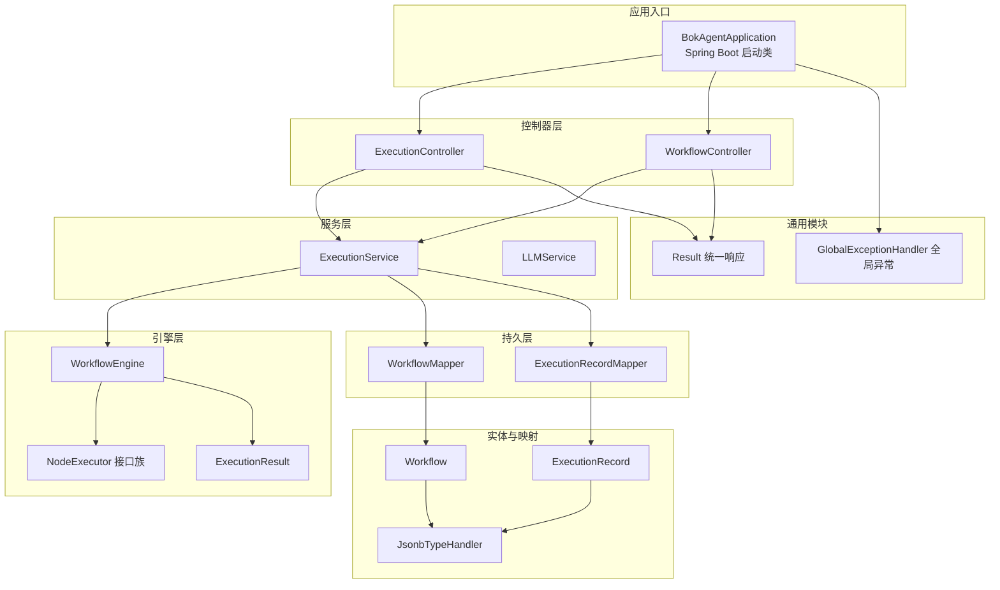
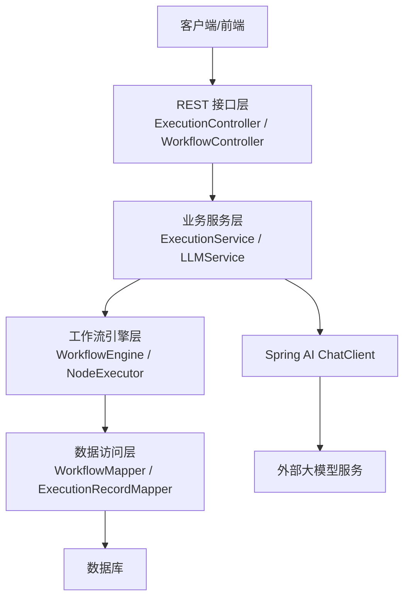
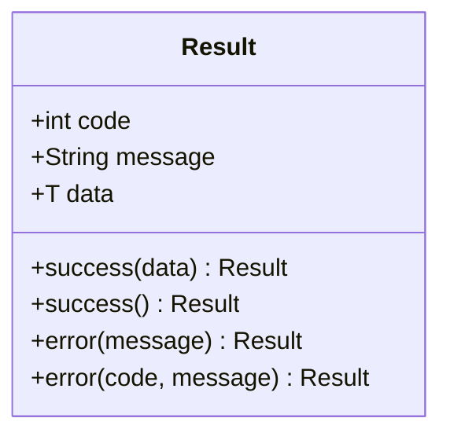
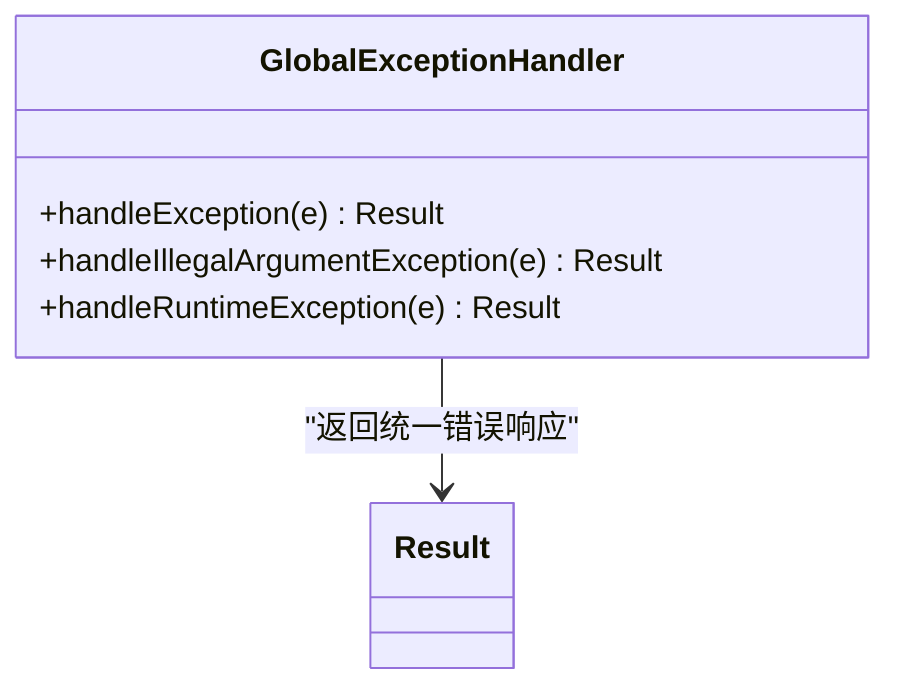
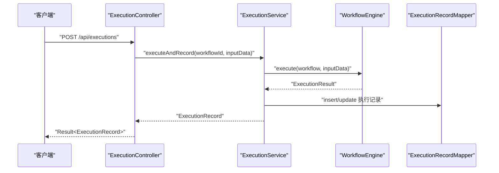
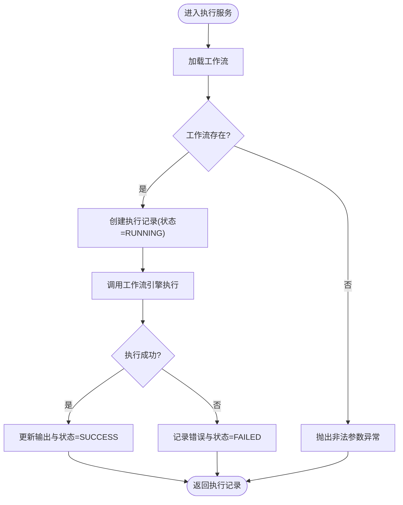
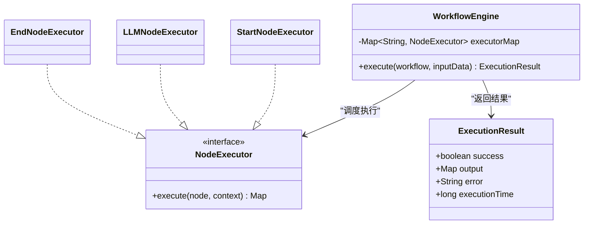
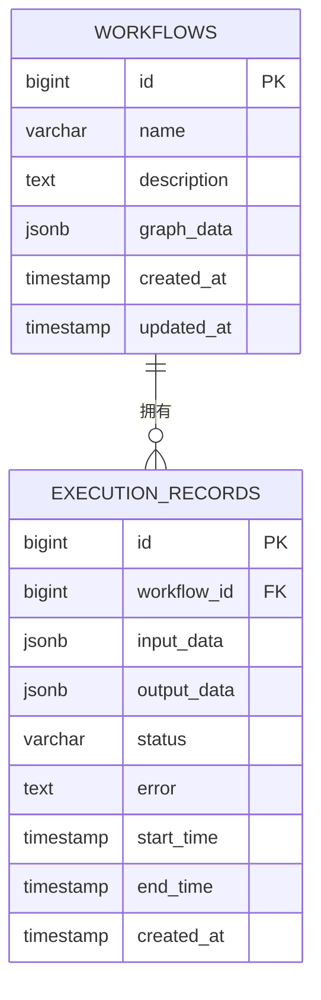
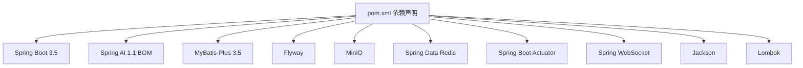

# 后端系统

<cite>
**本文引用的文件**
- [BokAgentApplication.java](file://backend/src/main/java/com/bokagent/BokAgentApplication.java)
- [Result.java](file://backend/src/main/java/com/bokagent/common/Result.java)
- [GlobalExceptionHandler.java](file://backend/src/main/java/com/bokagent/common/GlobalExceptionHandler.java)
- [ExecutionController.java](file://backend/src/main/java/com/bokagent/controller/ExecutionController.java)
- [WorkflowController.java](file://backend/src/main/java/com/bokagent/controller/WorkflowController.java)
- [WorkflowEngine.java](file://backend/src/main/java/com/bokagent/engine/WorkflowEngine.java)
- [ExecutionResult.java](file://backend/src/main/java/com/bokagent/engine/ExecutionResult.java)
- [ExecutionService.java](file://backend/src/main/java/com/bokagent/service/ExecutionService.java)
- [LLMService.java](file://backend/src/main/java/com/bokagent/service/LLMService.java)
- [Workflow.java](file://backend/src/main/java/com/bokagent/entity/Workflow.java)
- [ExecutionRecord.java](file://backend/src/main/java/com/bokagent/entity/ExecutionRecord.java)
- [WorkflowMapper.java](file://backend/src/main/java/com/bokagent/mapper/WorkflowMapper.java)
- [ExecutionRecordMapper.java](file://backend/src/main/java/com/bokagent/mapper/ExecutionRecordMapper.java)
- [JsonbTypeHandler.java](file://backend/src/main/java/com/bokagent/handler/JsonbTypeHandler.java)
- [application.yml](file://backend/src/main/resources/application.yml)
- [pom.xml](file://backend/pom.xml)
</cite>

## 目录
1. [简介](#简介)
2. [项目结构](#项目结构)
3. [核心组件](#核心组件)
4. [架构总览](#架构总览)
5. [详细组件分析](#详细组件分析)
6. [依赖分析](#依赖分析)
7. [性能考虑](#性能考虑)
8. [故障排查指南](#故障排查指南)
9. [结论](#结论)
10. [附录](#附录)

## 简介
本文件面向后端开发者，系统性梳理 BokAgent 后端系统的整体架构与实现细节。系统基于 Spring Boot 3.5，采用 MVC 分层设计，结合 MyBatis-Plus 实现数据库访问，通过统一响应包装 Result 类与全局异常处理器 GlobalExceptionHandler 提供一致的接口契约与错误处理体验。系统还集成了 Spring AI 1.1 以支持大模型调用，并通过 Redis、Flyway、MinIO 等组件完善运行时能力。

## 项目结构
后端工程位于 backend 目录，采用标准 Maven 结构，包结构清晰，职责明确：
- com.bokagent.common：通用工具与全局异常处理
- com.bokagent.controller：REST 控制器层
- com.bokagent.service：业务服务层
- com.bokagent.engine：工作流引擎与节点执行器
- com.bokagent.entity：实体模型
- com.bokagent.mapper：MyBatis-Plus 映射接口
- com.bokagent.handler：自定义类型处理器
- resources：配置文件与数据库迁移脚本

图表来源
- [BokAgentApplication.java:1-56](file://backend/src/main/java/com/bokagent/BokAgentApplication.java#L1-L56)
- [ExecutionController.java:1-81](file://backend/src/main/java/com/bokagent/controller/ExecutionController.java#L1-L81)
- [WorkflowController.java:1-92](file://backend/src/main/java/com/bokagent/controller/WorkflowController.java#L1-L92)
- [ExecutionService.java:1-110](file://backend/src/main/java/com/bokagent/service/ExecutionService.java#L1-L110)
- [WorkflowEngine.java:1-169](file://backend/src/main/java/com/bokagent/engine/WorkflowEngine.java#L1-L169)
- [ExecutionResult.java:1-32](file://backend/src/main/java/com/bokagent/engine/ExecutionResult.java#L1-L32)
- [WorkflowMapper.java:1-13](file://backend/src/main/java/com/bokagent/mapper/WorkflowMapper.java#L1-L13)
- [ExecutionRecordMapper.java:1-13](file://backend/src/main/java/com/bokagent/mapper/ExecutionRecordMapper.java#L1-L13)
- [Workflow.java:1-32](file://backend/src/main/java/com/bokagent/entity/Workflow.java#L1-L32)
- [ExecutionRecord.java:1-40](file://backend/src/main/java/com/bokagent/entity/ExecutionRecord.java#L1-L40)
- [JsonbTypeHandler.java](file://backend/src/main/java/com/bokagent/handler/JsonbTypeHandler.java)
- [Result.java:1-42](file://backend/src/main/java/com/bokagent/common/Result.java#L1-L42)
- [GlobalExceptionHandler.java:1-37](file://backend/src/main/java/com/bokagent/common/GlobalExceptionHandler.java#L1-L37)

章节来源
- [BokAgentApplication.java:1-56](file://backend/src/main/java/com/bokagent/BokAgentApplication.java#L1-L56)
- [application.yml:1-182](file://backend/src/main/resources/application.yml#L1-L182)

## 核心组件
- 统一响应包装 Result：提供 success/error 两类静态工厂方法，统一返回结构，便于前端消费与调试。
- 全局异常处理器 GlobalExceptionHandler：集中捕获运行时异常、非法参数异常与通用异常，返回标准化错误响应。
- 控制器层：提供工作流与执行记录的 CRUD 接口，均以 Result 包装返回。
- 服务层：封装业务流程，协调引擎与持久层；LLMService 基于 Spring AI ChatClient 进行大模型调用。
- 引擎层：WorkflowEngine 解析工作流图，按拓扑顺序调度节点执行器，输出 ExecutionResult。
- 实体与映射：Workflow/ExecutionRecord 使用 JsonbTypeHandler 存储复杂对象；MyBatis-Plus Mapper 自动化 SQL。

章节来源
- [Result.java:1-42](file://backend/src/main/java/com/bokagent/common/Result.java#L1-L42)
- [GlobalExceptionHandler.java:1-37](file://backend/src/main/java/com/bokagent/common/GlobalExceptionHandler.java#L1-L37)
- [ExecutionController.java:1-81](file://backend/src/main/java/com/bokagent/controller/ExecutionController.java#L1-L81)
- [WorkflowController.java:1-92](file://backend/src/main/java/com/bokagent/controller/WorkflowController.java#L1-L92)
- [ExecutionService.java:1-110](file://backend/src/main/java/com/bokagent/service/ExecutionService.java#L1-L110)
- [LLMService.java:1-67](file://backend/src/main/java/com/bokagent/service/LLMService.java#L1-L67)
- [WorkflowEngine.java:1-169](file://backend/src/main/java/com/bokagent/engine/WorkflowEngine.java#L1-L169)
- [ExecutionResult.java:1-32](file://backend/src/main/java/com/bokagent/engine/ExecutionResult.java#L1-L32)
- [Workflow.java:1-32](file://backend/src/main/java/com/bokagent/entity/Workflow.java#L1-L32)
- [ExecutionRecord.java:1-40](file://backend/src/main/java/com/bokagent/entity/ExecutionRecord.java#L1-L40)
- [WorkflowMapper.java:1-13](file://backend/src/main/java/com/bokagent/mapper/WorkflowMapper.java#L1-L13)
- [ExecutionRecordMapper.java:1-13](file://backend/src/main/java/com/bokagent/mapper/ExecutionRecordMapper.java#L1-L13)
- [JsonbTypeHandler.java](file://backend/src/main/java/com/bokagent/handler/JsonbTypeHandler.java)

## 架构总览
系统采用经典的三层架构（表现层/业务层/数据层），配合 Spring 容器进行依赖注入与 AOP 切面（如全局异常）。控制器负责接收请求并返回 Result；服务层编排业务逻辑；引擎层负责工作流图的解析与执行；持久层通过 MyBatis-Plus 访问数据库。

图表来源
- [ExecutionController.java:1-81](file://backend/src/main/java/com/bokagent/controller/ExecutionController.java#L1-L81)
- [WorkflowController.java:1-92](file://backend/src/main/java/com/bokagent/controller/WorkflowController.java#L1-L92)
- [ExecutionService.java:1-110](file://backend/src/main/java/com/bokagent/service/ExecutionService.java#L1-L110)
- [LLMService.java:1-67](file://backend/src/main/java/com/bokagent/service/LLMService.java#L1-L67)
- [WorkflowEngine.java:1-169](file://backend/src/main/java/com/bokagent/engine/WorkflowEngine.java#L1-L169)
- [WorkflowMapper.java:1-13](file://backend/src/main/java/com/bokagent/mapper/WorkflowMapper.java#L1-L13)
- [ExecutionRecordMapper.java:1-13](file://backend/src/main/java/com/bokagent/mapper/ExecutionRecordMapper.java#L1-L13)

## 详细组件分析

### 统一响应包装机制（Result）
- 设计理念：统一前后端交互格式，减少前端分支判断，提升可观测性与可维护性。
- 使用方法：控制器中直接调用 Result.success()/Result.error() 返回标准结构；全局异常处理器在异常时返回错误包装。
- 复杂度：O(1)，无额外计算开销。
- 优化建议：可在 Result 中扩展分页、校验错误集合等场景。

图表来源
- [Result.java:1-42](file://backend/src/main/java/com/bokagent/common/Result.java#L1-L42)

章节来源
- [Result.java:1-42](file://backend/src/main/java/com/bokagent/common/Result.java#L1-L42)

### 全局异常处理器（GlobalExceptionHandler）
- 错误码策略：HTTP 状态码与 Result.code 双维度管理；非法参数使用 400，运行时错误使用 500。
- 国际化：配置中已启用消息编码与基础名，但当前异常处理器未使用消息键；可扩展为多语言。
- 异常分类：对 Exception、IllegalArgumentException、RuntimeException 分别处理，保证错误信息可追踪。
- 复杂度：O(1)，无额外资源消耗。

图表来源
- [GlobalExceptionHandler.java:1-37](file://backend/src/main/java/com/bokagent/common/GlobalExceptionHandler.java#L1-L37)
- [Result.java:1-42](file://backend/src/main/java/com/bokagent/common/Result.java#L1-L42)

章节来源
- [GlobalExceptionHandler.java:1-37](file://backend/src/main/java/com/bokagent/common/GlobalExceptionHandler.java#L1-L37)
- [application.yml:77-80](file://backend/src/main/resources/application.yml#L77-L80)

### 控制器层（ExecutionController / WorkflowController）
- 职责：暴露 REST 接口，接收参数，调用服务层，返回 Result。
- 规范：统一跨域注解、日志记录、空值处理与状态机更新（如执行记录结束时间）。
- 复杂度：接口层 O(1)，业务层取决于具体操作（如查询、插入、更新）。

图表来源
- [ExecutionController.java:1-81](file://backend/src/main/java/com/bokagent/controller/ExecutionController.java#L1-L81)
- [ExecutionService.java:1-110](file://backend/src/main/java/com/bokagent/service/ExecutionService.java#L1-L110)
- [WorkflowEngine.java:1-169](file://backend/src/main/java/com/bokagent/engine/WorkflowEngine.java#L1-L169)
- [ExecutionRecordMapper.java:1-13](file://backend/src/main/java/com/bokagent/mapper/ExecutionRecordMapper.java#L1-L13)

章节来源
- [ExecutionController.java:1-81](file://backend/src/main/java/com/bokagent/controller/ExecutionController.java#L1-L81)
- [WorkflowController.java:1-92](file://backend/src/main/java/com/bokagent/controller/WorkflowController.java#L1-L92)

### 服务层（ExecutionService / LLMService）
- ExecutionService：负责工作流执行生命周期管理，创建执行记录、调用引擎、更新状态与错误信息。
- LLMService：基于 Spring AI ChatClient 构造完整提示词并调用大模型，异常向上抛出由全局处理器捕获。
- 复杂度：执行服务受工作流节点数量与引擎拓扑影响；LLM 调用受网络与模型响应时间影响。

图表来源
- [ExecutionService.java:1-110](file://backend/src/main/java/com/bokagent/service/ExecutionService.java#L1-L110)
- [ExecutionResult.java:1-32](file://backend/src/main/java/com/bokagent/engine/ExecutionResult.java#L1-L32)

章节来源
- [ExecutionService.java:1-110](file://backend/src/main/java/com/bokagent/service/ExecutionService.java#L1-L110)
- [LLMService.java:1-67](file://backend/src/main/java/com/bokagent/service/LLMService.java#L1-L67)

### 引擎层（WorkflowEngine / NodeExecutor）
- WorkflowEngine：构建节点映射与邻接表，按拓扑顺序执行节点，聚合上下文并产出最终输出或错误。
- NodeExecutor：抽象节点执行器接口，当前注册了 start、llm、end 三类执行器（实现位于 engine 包内）。
- ExecutionResult：承载执行成功与否、输出、错误与耗时。

图表来源
- [WorkflowEngine.java:1-169](file://backend/src/main/java/com/bokagent/engine/WorkflowEngine.java#L1-L169)
- [ExecutionResult.java:1-32](file://backend/src/main/java/com/bokagent/engine/ExecutionResult.java#L1-L32)

章节来源
- [WorkflowEngine.java:1-169](file://backend/src/main/java/com/bokagent/engine/WorkflowEngine.java#L1-L169)
- [ExecutionResult.java:1-32](file://backend/src/main/java/com/bokagent/engine/ExecutionResult.java#L1-L32)

### 实体与持久层（Workflow / ExecutionRecord / Mapper / JsonbTypeHandler）
- 实体：Workflow/ExecutionRecord 使用 MyBatis-Plus 注解标识主键与字段映射；复杂字段通过 JsonbTypeHandler 序列化存储。
- Mapper：继承 BaseMapper，自动获得常用 CRUD 方法。
- 配置：application.yml 中开启 MyBatis-Plus 驼峰映射、日志实现、Mapper XML 路径等。

图表来源
- [Workflow.java:1-32](file://backend/src/main/java/com/bokagent/entity/Workflow.java#L1-L32)
- [ExecutionRecord.java:1-40](file://backend/src/main/java/com/bokagent/entity/ExecutionRecord.java#L1-L40)
- [WorkflowMapper.java:1-13](file://backend/src/main/java/com/bokagent/mapper/WorkflowMapper.java#L1-L13)
- [ExecutionRecordMapper.java:1-13](file://backend/src/main/java/com/bokagent/mapper/ExecutionRecordMapper.java#L1-L13)

章节来源
- [Workflow.java:1-32](file://backend/src/main/java/com/bokagent/entity/Workflow.java#L1-L32)
- [ExecutionRecord.java:1-40](file://backend/src/main/java/com/bokagent/entity/ExecutionRecord.java#L1-L40)
- [WorkflowMapper.java:1-13](file://backend/src/main/java/com/bokagent/mapper/WorkflowMapper.java#L1-L13)
- [ExecutionRecordMapper.java:1-13](file://backend/src/main/java/com/bokagent/mapper/ExecutionRecordMapper.java#L1-L13)
- [JsonbTypeHandler.java](file://backend/src/main/java/com/bokagent/handler/JsonbTypeHandler.java)
- [application.yml:90-100](file://backend/src/main/resources/application.yml#L90-L100)

## 依赖分析
- Spring Boot 3.5：提供 Web、Redis、Actuator、WebSocket 等 Starter，简化配置与自动装配。
- Spring AI 1.1：通过 BOM 管理版本，集成 OpenAI、DeepSeek、DashScope 等大模型客户端。
- MyBatis-Plus 3.5：提供强大的 ORM 能力与代码生成，结合 HikariCP 连接池。
- Flyway：数据库迁移工具，自动执行迁移脚本。
- MinIO：对象存储客户端，用于音频等文件管理。
- Lombok：减少样板代码，提升开发效率。
- Jackson：JSON 处理，默认非空字段序列化与未知属性容错。

图表来源
- [pom.xml:1-170](file://backend/pom.xml#L1-L170)

章节来源
- [pom.xml:1-170](file://backend/pom.xml#L1-L170)
- [application.yml:130-147](file://backend/src/main/resources/application.yml#L130-L147)

## 性能考虑
- 连接池与线程池：HikariCP 最大连接数与 Redis 连接池已配置；异步任务线程池大小与队列容量可按负载调整。
- 日志级别：生产环境建议提升日志级别，避免过多 DEBUG 输出。
- 缓存：启用缓存并设置 TTL，针对工具结果与 LLM 响应进行差异化缓存。
- 超时：为 LLM、工具执行、MCP 请求与工作流执行设置合理超时，防止阻塞。
- 数据库：Flyway 自动迁移，建议在灰度发布前评估索引与查询计划。

章节来源
- [application.yml:22-25](file://backend/src/main/resources/application.yml#L22-L25)
- [application.yml:33-43](file://backend/src/main/resources/application.yml#L33-L43)
- [application.yml:82-89](file://backend/src/main/resources/application.yml#L82-L89)
- [application.yml:150-154](file://backend/src/main/resources/application.yml#L150-L154)
- [application.yml:142-147](file://backend/src/main/resources/application.yml#L142-L147)

## 故障排查指南
- 启动编码问题：应用启动时强制设置 UTF-8 编码并打印编码信息，确保中文与 Emoji 正常显示。
- 全局异常：若出现 500 错误，检查全局异常处理器日志；非法参数会返回 400 并携带具体错误信息。
- 数据库连接：核对 PostgreSQL/MySQL 连接串、凭据与驱动；Flyway 是否成功迁移。
- Redis 连通性：确认主机、端口与连接池配置。
- 大模型调用：检查 API Key、Base URL 与模型名称；查看 Spring AI 日志。
- 工作流执行：关注引擎日志与 ExecutionResult，定位节点执行失败原因。

章节来源
- [BokAgentApplication.java:21-54](file://backend/src/main/java/com/bokagent/BokAgentApplication.java#L21-L54)
- [GlobalExceptionHandler.java:16-35](file://backend/src/main/java/com/bokagent/common/GlobalExceptionHandler.java#L16-L35)
- [application.yml:16-21](file://backend/src/main/resources/application.yml#L16-L21)
- [application.yml:32-43](file://backend/src/main/resources/application.yml#L32-L43)
- [application.yml:45-66](file://backend/src/main/resources/application.yml#L45-L66)
- [WorkflowEngine.java:75-79](file://backend/src/main/java/com/bokagent/engine/WorkflowEngine.java#L75-L79)

## 结论
本系统以清晰的分层架构与统一的响应/异常处理机制为基础，结合 Spring AI 与 MyBatis-Plus 实现了从工作流编排到大模型调用的完整能力。通过合理的依赖管理与配置项，系统具备良好的可扩展性与可维护性。后续可在国际化、缓存策略、监控指标与测试覆盖等方面进一步完善。

## 附录
- 开发环境建议
  - JDK 21，IDE 推荐启用 Lombok 插件
  - 使用 application-dev.yml 或通过环境变量覆盖配置
  - 启动前确保数据库、Redis、对象存储可用
- 调试技巧
  - 通过 Actuator 暴露健康与指标端点
  - 在 application.yml 中临时提高日志级别定位问题
  - 对关键链路增加埋点与上下文日志

章节来源
- [application.yml:173-182](file://backend/src/main/resources/application.yml#L173-L182)
- [BokAgentApplication.java:21-43](file://backend/src/main/java/com/bokagent/BokAgentApplication.java#L21-L43)