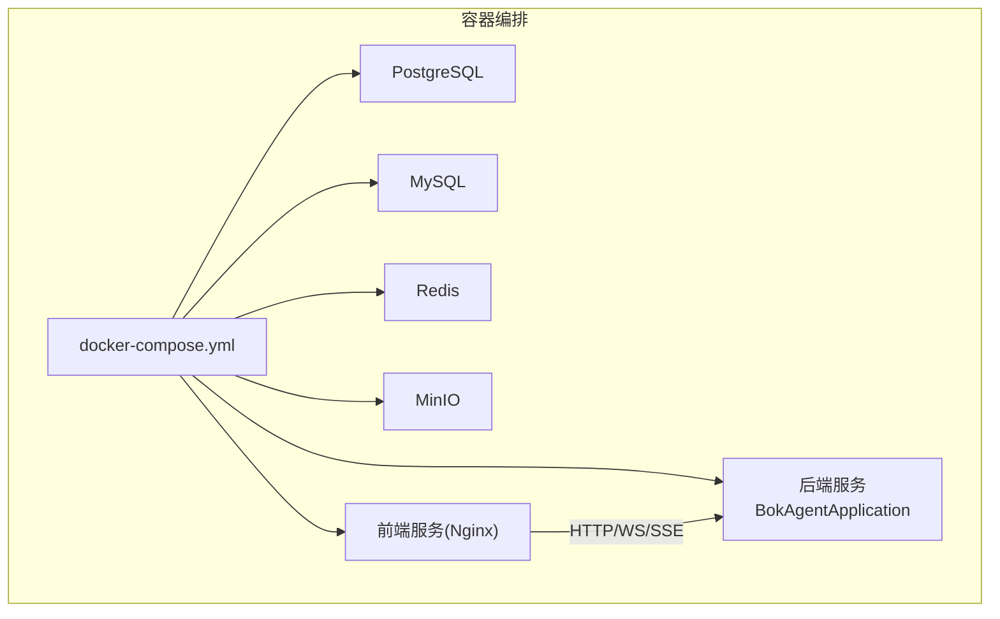
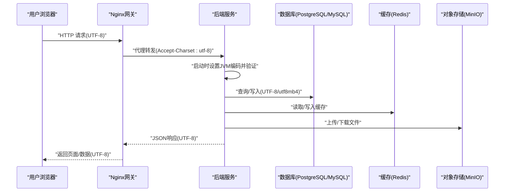
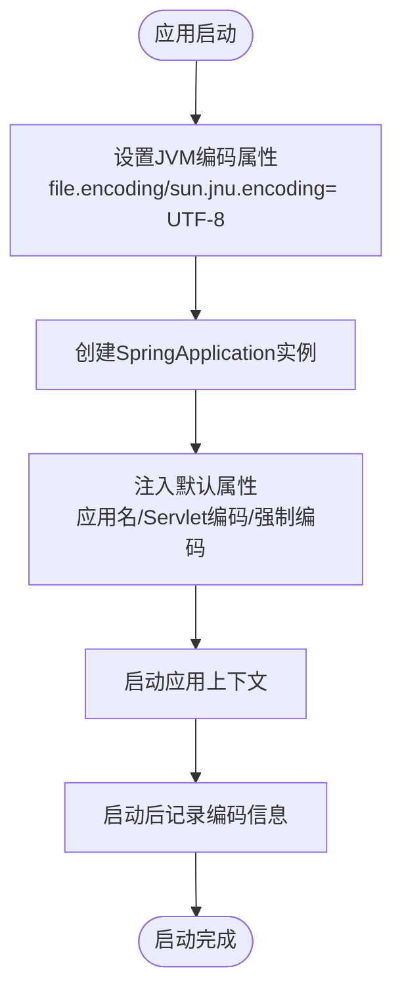
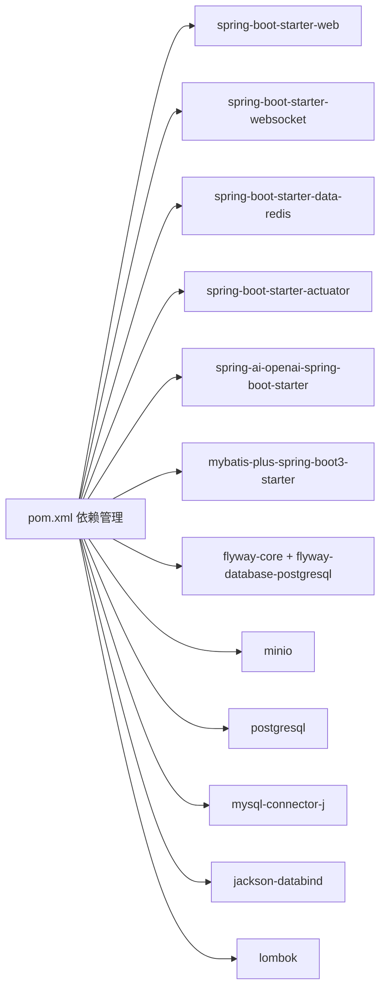

# 应用配置

<cite>
**本文引用的文件**
- [BokAgentApplication.java](file://backend/src/main/java/com/bokagent/BokAgentApplication.java)
- [application.yml](file://backend/src/main/resources/application.yml)
- [pom.xml](file://backend/pom.xml)
- [docker-compose.yml](file://docker/docker-compose.yml)
- [Dockerfile.backend](file://docker/Dockerfile.backend)
- [init-postgres.sql](file://docker/init-postgres.sql)
- [init-mysql.sql](file://docker/init-mysql.sql)
- [nginx.conf](file://docker/nginx.conf)
- [GlobalExceptionHandler.java](file://backend/src/main/java/com/bokagent/common/GlobalExceptionHandler.java)
- [Result.java](file://backend/src/main/java/com/bokagent/common/Result.java)
</cite>

## 目录
1. [简介](#简介)
2. [项目结构](#项目结构)
3. [核心组件](#核心组件)
4. [架构总览](#架构总览)
5. [详细组件分析](#详细组件分析)
6. [依赖分析](#依赖分析)
7. [性能考虑](#性能考虑)
8. [故障排查指南](#故障排查指南)
9. [结论](#结论)
10. [附录](#附录)

## 简介
本文件面向BokAgent后端应用的配置与部署，围绕Spring Boot主应用类的启动配置、编码设置、默认属性、application.yml关键配置项展开，并结合Docker与Nginx实现全链路UTF-8字符集保障。同时提供开发与生产环境差异说明、最佳实践与安全建议，帮助读者快速理解并正确配置系统。

## 项目结构
后端采用Spring Boot单体应用，核心配置集中在application.yml，主应用类负责启动流程与编码校验；容器化通过docker-compose统一编排数据库、缓存、对象存储与后端服务；Nginx作为网关统一处理静态资源与代理，确保前后端一致的UTF-8字符集。

图表来源
- [docker-compose.yml:1-132](file://docker/docker-compose.yml#L1-L132)

章节来源
- [docker-compose.yml:1-132](file://docker/docker-compose.yml#L1-L132)

## 核心组件
- 主应用类：负责设置JVM编码、注入默认属性、启动应用并输出编码验证信息。
- 配置文件：集中管理服务器、数据库、缓存、AI模型、日志、Actuator等配置。
- 容器与网关：Dockerfile与docker-compose确保JVM与数据库字符集一致性；Nginx统一设置charset与代理头部。

章节来源
- [BokAgentApplication.java:16-56](file://backend/src/main/java/com/bokagent/BokAgentApplication.java#L16-L56)
- [application.yml:1-190](file://backend/src/main/resources/application.yml#L1-L190)
- [Dockerfile.backend:1-51](file://docker/Dockerfile.backend#L1-L51)
- [docker-compose.yml:83-114](file://docker/docker-compose.yml#L83-L114)
- [nginx.conf:1-56](file://docker/nginx.conf#L1-L56)

## 架构总览
下图展示从浏览器到后端服务的完整链路，以及各环节的字符集与编码配置要点。

图表来源
- [BokAgentApplication.java:21-43](file://backend/src/main/java/com/bokagent/BokAgentApplication.java#L21-L43)
- [application.yml:17-25](file://backend/src/main/resources/application.yml#L17-L25)
- [docker-compose.yml:88-100](file://docker/docker-compose.yml#L88-L100)
- [nginx.conf:32-34](file://docker/nginx.conf#L32-L34)

## 详细组件分析

### Spring Boot主应用类配置
- @SpringBootApplication：启用自动配置与组件扫描，作为应用入口。
- @MapperScan：指定MyBatis Mapper扫描路径，避免遗漏。
- Lombok日志：通过@Slf4j简化日志记录。
- 启动编码设置：在启动前设置JVM系统属性，确保file.encoding与sun.jnu.encoding为UTF-8。
- 默认属性注入：通过SpringApplication.setDefaultProperties设置应用名、Servlet编码及强制编码。
- 启动后验证：记录JVM与系统编码信息，确保中文与Emoji显示正常。

图表来源
- [BokAgentApplication.java:21-43](file://backend/src/main/java/com/bokagent/BokAgentApplication.java#L21-L43)

章节来源
- [BokAgentApplication.java:16-56](file://backend/src/main/java/com/bokagent/BokAgentApplication.java#L16-L56)

### 编码设置与验证机制
- JVM层：Dockerfile与主应用类均显式设置UTF-8编码，避免默认平台编码导致乱码。
- 应用层：application.yml中server.servlet.encoding强制启用UTF-8。
- 数据库层：PostgreSQL与MySQL初始化脚本分别设置UTF8与utf8mb4，确保存储层兼容。
- 网关层：Nginx设置charset utf-8并为代理头添加Accept-Charset，保证上游一致。

章节来源
- [Dockerfile.backend:25-28](file://docker/Dockerfile.backend#L25-L28)
- [BokAgentApplication.java:22-24](file://backend/src/main/java/com/bokagent/BokAgentApplication.java#L22-L24)
- [application.yml:4-7](file://backend/src/main/resources/application.yml#L4-L7)
- [init-postgres.sql:17-20](file://docker/init-postgres.sql#L17-L20)
- [init-mysql.sql:9-12](file://docker/init-mysql.sql#L9-L12)
- [nginx.conf:8-10](file://docker/nginx.conf#L8-L10)

### 默认属性配置
- spring.application.name：应用名，便于监控与日志识别。
- server.servlet.encoding.charset：字符集。
- server.servlet.encoding.enabled：启用编码。
- server.servlet.encoding.force：强制编码覆盖。

章节来源
- [BokAgentApplication.java:29-34](file://backend/src/main/java/com/bokagent/BokAgentApplication.java#L29-L34)
- [application.yml:10-11](file://backend/src/main/resources/application.yml#L10-L11)
- [application.yml:4-7](file://backend/src/main/resources/application.yml#L4-L7)

### application.yml关键配置项
- 服务器配置：端口、Servlet编码（UTF-8、强制）。
- 数据源配置：PostgreSQL工作流库，Hikari连接池参数；Flyway迁移启用与位置。
- Redis缓存：主机、端口、数据库索引与Lettuce连接池。
- Spring AI集成：OpenAI、DeepSeek、Qwen三套模型配置（API Key、Base URL、模型名）。
- Jackson配置：非空字段序列化、日期格式与时区控制。
- 消息与国际化：消息编码与basename。
- 异步任务：虚拟线程执行器类型与线程池大小。
- MyBatis-Plus：驼峰映射、下划线转驼峰、日志实现、Mapper XML位置、ID策略。
- 工作流引擎：engine类型与LangGraph4J状态Schema等可选配置。
- MinIO对象存储：端点、访问密钥、桶名。
- MCP协议：服务端能力与传输（SSE/WebSocket），客户端服务器列表。
- 重试与超时：默认重试策略与各类超时阈值。
- 缓存策略：全局TTL与特定类型TTL。
- 日志：控制台与文件编码、日志级别、文件滚动策略。
- Actuator：暴露健康、信息、指标端点。

章节来源
- [application.yml:1-190](file://backend/src/main/resources/application.yml#L1-L190)

### 开发与生产环境差异
- profile激活：通过SPRING_PROFILES_ACTIVE动态切换，默认dev。
- 外部化配置：数据库、缓存、AI模型、MinIO等通过环境变量注入，便于不同环境替换。
- Docker时区与语言：容器内设置TZ、LANG、LC_ALL为Asia/Shanghai与C.UTF-8，确保日志与解析一致。
- 端口映射：本地8080映射至容器内部8080；Nginx对外80端口。
- 健康检查：容器与后端Actuator健康端点联动。

章节来源
- [application.yml:13-14](file://backend/src/main/resources/application.yml#L13-L14)
- [docker-compose.yml:88-100](file://docker/docker-compose.yml#L88-L100)
- [Dockerfile.backend:25-28](file://docker/Dockerfile.backend#L25-L28)
- [docker-compose.yml:101-102](file://docker/docker-compose.yml#L101-L102)

### 最佳实践与安全建议
- 字符集一致性：JVM、数据库、网关三层均需UTF-8，避免中间环节被默认编码破坏。
- 敏感信息外置：数据库密码、AI API Key通过环境变量注入，不在仓库中保留明文。
- 连接池与超时：根据负载调整Hikari最大连接数与等待时间；为外部调用设置合理超时。
- 日志脱敏：生产环境避免输出敏感参数；使用结构化日志并限制日志级别。
- 安全端点：仅暴露必要Actuator端点，开启鉴权或限制访问来源。
- 缓存策略：区分热点数据与临时结果，设置合理的TTL与失效策略。
- 异常处理：全局异常统一返回Result结构，避免泄露内部错误细节。

章节来源
- [GlobalExceptionHandler.java:12-36](file://backend/src/main/java/com/bokagent/common/GlobalExceptionHandler.java#L12-L36)
- [Result.java:8-42](file://backend/src/main/java/com/bokagent/common/Result.java#L8-L42)
- [application.yml:181-190](file://backend/src/main/resources/application.yml#L181-L190)

## 依赖分析
- Spring Boot Starter：Web、WebSocket、Redis、Actuator。
- Spring AI：OpenAI、DeepSeek、Qwen集成。
- ORM与迁移：MyBatis-Plus、Flyway。
- 存储与对象：PostgreSQL/MySQL驱动、MinIO。
- 工具与测试：Jackson、Lombok、WebSocket客户端、测试Starter。

图表来源
- [pom.xml:29-128](file://backend/pom.xml#L29-L128)

章节来源
- [pom.xml:1-170](file://backend/pom.xml#L1-L170)

## 性能考虑
- 连接池：Hikari最大连接数与最小空闲数应结合并发与数据库性能调优。
- 线程模型：启用虚拟线程以提升高并发下的吞吐与内存效率。
- 缓存命中率：合理设置TTL与热点数据预热，降低数据库压力。
- 序列化开销：Jackson关闭时间戳序列化可减少体积，提高网络传输效率。
- 超时与重试：为外部服务调用设置上限，避免雪崩效应。

章节来源
- [application.yml:22-24](file://backend/src/main/resources/application.yml#L22-L24)
- [application.yml:82-89](file://backend/src/main/resources/application.yml#L82-L89)
- [application.yml:157-162](file://backend/src/main/resources/application.yml#L157-L162)
- [application.yml:69-75](file://backend/src/main/resources/application.yml#L69-L75)

## 故障排查指南
- 启动后编码异常：检查JVM系统属性是否被命令行或容器覆盖；确认application.yml中Servlet编码已生效。
- 数据库乱码：核对数据库初始化脚本编码设置；确认连接URL包含useUnicode与characterEncoding参数。
- AI模型调用失败：检查对应API Key与Base URL是否正确注入；查看日志中模型选项配置。
- 缓存不可用：确认Redis连接参数与容器连通性；检查TTL与序列化配置。
- Actuator不可访问：确认暴露端点与鉴权策略；检查容器防火墙与网关代理。

章节来源
- [BokAgentApplication.java:45-54](file://backend/src/main/java/com/bokagent/BokAgentApplication.java#L45-L54)
- [init-postgres.sql:17-20](file://docker/init-postgres.sql#L17-L20)
- [init-mysql.sql:9-12](file://docker/init-mysql.sql#L9-L12)
- [application.yml:45-67](file://backend/src/main/resources/application.yml#L45-L67)
- [application.yml:32-44](file://backend/src/main/resources/application.yml#L32-L44)
- [application.yml:181-190](file://backend/src/main/resources/application.yml#L181-L190)

## 结论
BokAgent通过主应用类、配置文件、容器与网关的多层UTF-8保障，实现了从前端到数据库的一致字符集体验。结合合理的连接池、缓存与超时策略，可在开发与生产环境中稳定运行。建议持续关注外部依赖的API变更与安全策略更新，保持配置与依赖版本的同步。

## 附录
- 统一响应结构：全局异常处理返回Result，便于前端统一处理。
- 日志级别：根级别INFO，业务包DEBUG，AI相关DEBUG便于问题定位。

章节来源
- [GlobalExceptionHandler.java:12-36](file://backend/src/main/java/com/bokagent/common/GlobalExceptionHandler.java#L12-L36)
- [Result.java:8-42](file://backend/src/main/java/com/bokagent/common/Result.java#L8-L42)
- [application.yml:164-180](file://backend/src/main/resources/application.yml#L164-L180)