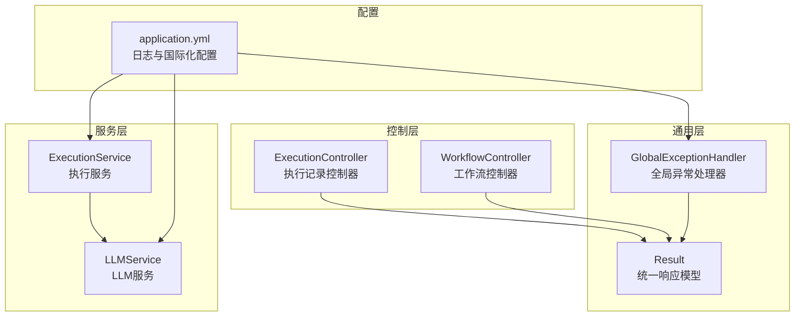
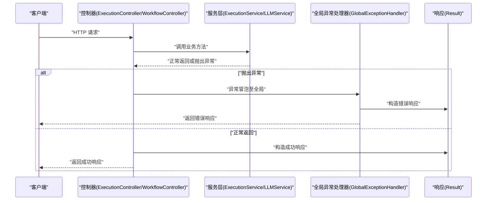
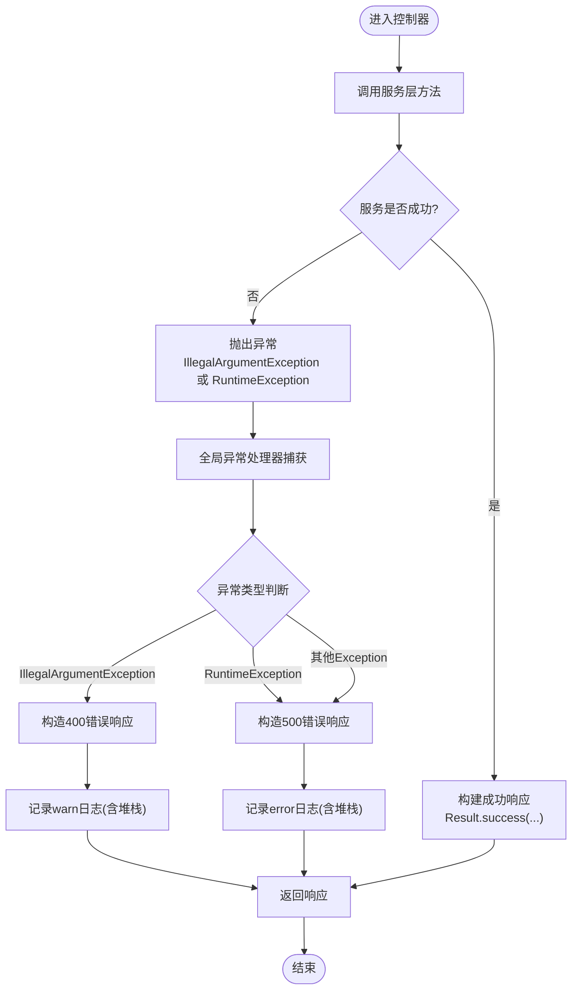
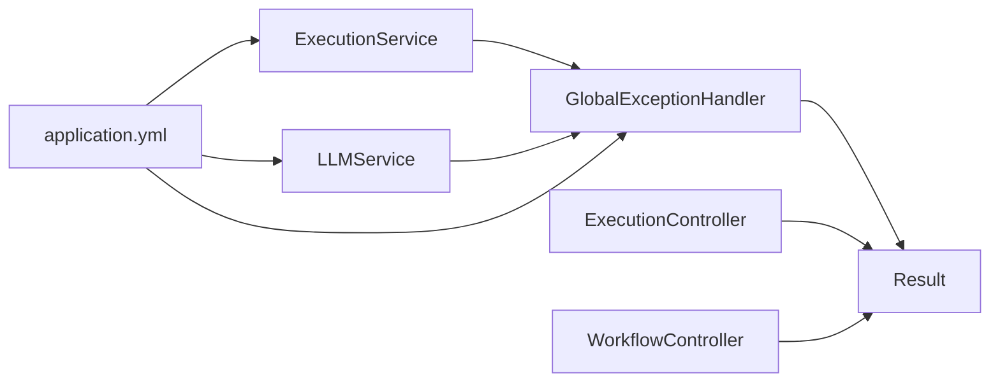

# 异常处理

<cite>
**本文引用的文件**
- [GlobalExceptionHandler.java](file://backend/src/main/java/com/bokagent/common/GlobalExceptionHandler.java)
- [Result.java](file://backend/src/main/java/com/bokagent/common/Result.java)
- [application.yml](file://backend/src/main/resources/application.yml)
- [ExecutionService.java](file://backend/src/main/java/com/bokagent/service/ExecutionService.java)
- [LLMService.java](file://backend/src/main/java/com/bokagent/service/LLMService.java)
- [ExecutionController.java](file://backend/src/main/java/com/bokagent/controller/ExecutionController.java)
- [WorkflowController.java](file://backend/src/main/java/com/bokagent/controller/WorkflowController.java)
- [ExecutionRecord.java](file://backend/src/main/java/com/bokagent/entity/ExecutionRecord.java)
- [BokAgentApplication.java](file://backend/src/main/java/com/bokagent/BokAgentApplication.java)
</cite>

## 目录
1. [简介](#简介)
2. [项目结构](#项目结构)
3. [核心组件](#核心组件)
4. [架构总览](#架构总览)
5. [详细组件分析](#详细组件分析)
6. [依赖分析](#依赖分析)
7. [性能考量](#性能考量)
8. [故障排查指南](#故障排查指南)
9. [结论](#结论)
10. [附录](#附录)

## 简介
本文件系统化梳理后端全局异常处理机制，围绕 GlobalExceptionHandler 的设计理念与实现原理展开，覆盖异常分类处理策略、错误码定义规范、错误信息国际化现状与建议、响应格式标准化字段、日志记录策略、敏感信息脱敏与堆栈保留、自定义异常创建与传播机制、异常恢复策略，以及最佳实践与调试技巧。同时结合项目中已有的 Result 统一响应模型与部分业务层抛出的运行时异常，给出可落地的改进建议。

## 项目结构
后端采用 Spring Boot 结构，异常处理集中在 common 包下的全局异常处理器；业务层通过服务类抛出运行时异常；控制器层返回统一 Result 响应对象；日志与国际化配置位于 application.yml。

图表来源
- [GlobalExceptionHandler.java:1-37](file://backend/src/main/java/com/bokagent/common/GlobalExceptionHandler.java#L1-L37)
- [Result.java:1-42](file://backend/src/main/java/com/bokagent/common/Result.java#L1-L42)
- [ExecutionController.java:1-81](file://backend/src/main/java/com/bokagent/controller/ExecutionController.java#L1-L81)
- [WorkflowController.java:1-92](file://backend/src/main/java/com/bokagent/controller/WorkflowController.java#L1-L92)
- [ExecutionService.java:1-113](file://backend/src/main/java/com/bokagent/service/ExecutionService.java#L1-L113)
- [LLMService.java:1-67](file://backend/src/main/java/com/bokagent/service/LLMService.java#L1-L67)
- [application.yml:1-190](file://backend/src/main/resources/application.yml#L1-L190)

章节来源
- [GlobalExceptionHandler.java:1-37](file://backend/src/main/java/com/bokagent/common/GlobalExceptionHandler.java#L1-L37)
- [Result.java:1-42](file://backend/src/main/java/com/bokagent/common/Result.java#L1-L42)
- [application.yml:76-80](file://backend/src/main/resources/application.yml#L76-L80)

## 核心组件
- 全局异常处理器：基于 Spring MVC 的 @RestControllerAdvice 与 @ExceptionHandler，对 Exception、IllegalArgumentException、RuntimeException 进行统一捕获与响应包装。
- 统一响应模型：Result<T> 提供 success/error 两种静态工厂方法，封装 code、message、data 字段，作为控制器与异常处理器的标准输出格式。
- 业务异常抛出：服务层在工作流不存在、LLM 调用失败等场景抛出运行时异常，交由全局异常处理器统一处理。
- 国际化配置：application.yml 中配置了消息编码与基础名，但当前未发现对应的消息文件，国际化能力尚未启用。
- 日志配置：application.yml 中配置了日志级别、输出模式与文件落盘路径，便于异常日志收集与检索。

章节来源
- [GlobalExceptionHandler.java:12-36](file://backend/src/main/java/com/bokagent/common/GlobalExceptionHandler.java#L12-L36)
- [Result.java:8-41](file://backend/src/main/java/com/bokagent/common/Result.java#L8-L41)
- [ExecutionService.java:44-91](file://backend/src/main/java/com/bokagent/service/ExecutionService.java#L44-L91)
- [LLMService.java:40-43](file://backend/src/main/java/com/bokagent/service/LLMService.java#L40-L43)
- [application.yml:76-80](file://backend/src/main/resources/application.yml#L76-L80)
- [application.yml:164-180](file://backend/src/main/resources/application.yml#L164-L180)

## 架构总览
全局异常处理在请求生命周期中的位置如下：

图表来源
- [ExecutionController.java:28-79](file://backend/src/main/java/com/bokagent/controller/ExecutionController.java#L28-L79)
- [WorkflowController.java:28-90](file://backend/src/main/java/com/bokagent/controller/WorkflowController.java#L28-L90)
- [ExecutionService.java:39-92](file://backend/src/main/java/com/bokagent/service/ExecutionService.java#L39-L92)
- [LLMService.java:27-43](file://backend/src/main/java/com/bokagent/service/LLMService.java#L27-L43)
- [GlobalExceptionHandler.java:16-35](file://backend/src/main/java/com/bokagent/common/GlobalExceptionHandler.java#L16-L35)
- [Result.java:14-40](file://backend/src/main/java/com/bokagent/common/Result.java#L14-L40)

## 详细组件分析

### 全局异常处理器设计与实现
- 设计理念
  - 以“最小侵入”为目标，通过@RestControllerAdvice 将异常处理横切到所有控制器，避免在各控制器重复 try-catch。
  - 对不同异常类型进行差异化处理：参数错误使用 400，业务运行时错误与系统异常统一 500，便于前端与网关层区分。
  - 日志记录遵循“异常即告警”的原则：参数错误使用 warn，系统/运行时异常使用 error，并保留异常堆栈以便定位。
- 实现要点
  - handleException(Exception)：兜底处理所有未捕获异常，返回 500 与通用错误信息。
  - handleIllegalArgumentException(IllegalArgumentException)：参数校验失败返回 400 与具体错误信息。
  - handleRuntimeException(RuntimeException)：业务运行时异常返回 500 与通用错误信息。
- 响应格式
  - 返回 Result<T>，包含 code、message、data。异常场景下 data 为 null，code 与 message 由处理器决定。
- 国际化现状
  - application.yml 中配置了消息编码与基础名，但未发现对应消息文件，国际化能力未启用。后续可结合消息文件完善错误信息本地化。
- 日志策略
  - 参数错误：warn 级别，记录简要信息。
  - 系统/运行时异常：error 级别，记录完整堆栈。
  - 日志落盘与级别：application.yml 中配置了 root 与包级日志级别、控制台与文件输出模式、日志文件路径与轮转参数。

章节来源
- [GlobalExceptionHandler.java:12-36](file://backend/src/main/java/com/bokagent/common/GlobalExceptionHandler.java#L12-L36)
- [Result.java:8-41](file://backend/src/main/java/com/bokagent/common/Result.java#L8-L41)
- [application.yml:76-80](file://backend/src/main/resources/application.yml#L76-L80)
- [application.yml:164-180](file://backend/src/main/resources/application.yml#L164-L180)

### 统一响应模型 Result
- 数据结构
  - code：整型状态码，成功默认 200，错误默认 500。
  - message：字符串描述，成功默认 “success”，错误默认 “error” 或传入的具体信息。
  - data：泛型承载业务数据。
- 工厂方法
  - success(data)/success()：构造成功响应。
  - error(message)/error(code, message)：构造错误响应。
- 使用场景
  - 控制器直接返回 Result.success(...)。
  - 全局异常处理器返回 Result.error(...)。
  - 业务层在特定场景（如 404）直接返回 Result.error(code, message)。

章节来源
- [Result.java:8-41](file://backend/src/main/java/com/bokagent/common/Result.java#L8-L41)

### 业务异常与参数校验异常
- 参数校验异常
  - 在服务层遇到非法参数时抛出 IllegalArgumentException，由全局异常处理器映射为 400 错误响应。
  - 示例：工作流不存在时抛出 IllegalArgumentException。
- 运行时异常
  - 在服务层发生业务异常（如 LLM 调用失败、执行引擎异常）时抛出 RuntimeException，由全局异常处理器映射为 500 错误响应。
  - 示例：LLMService 调用失败抛出 RuntimeException；ExecutionService 执行异常时也抛出 RuntimeException 并更新执行记录状态与错误信息。
- 控制器层的显式错误
  - 控制器层在资源不存在时直接返回 Result.error(code, message)，例如 404。

章节来源
- [ExecutionService.java:44-91](file://backend/src/main/java/com/bokagent/service/ExecutionService.java#L44-L91)
- [LLMService.java:40-43](file://backend/src/main/java/com/bokagent/service/LLMService.java#L40-L43)
- [ExecutionController.java:44-71](file://backend/src/main/java/com/bokagent/controller/ExecutionController.java#L44-L71)
- [WorkflowController.java:43-89](file://backend/src/main/java/com/bokagent/controller/WorkflowController.java#L43-L89)

### 异常处理流程图（代码级）

图表来源
- [GlobalExceptionHandler.java:16-35](file://backend/src/main/java/com/bokagent/common/GlobalExceptionHandler.java#L16-L35)
- [ExecutionService.java:44-91](file://backend/src/main/java/com/bokagent/service/ExecutionService.java#L44-L91)
- [LLMService.java:40-43](file://backend/src/main/java/com/bokagent/service/LLMService.java#L40-L43)
- [Result.java:14-40](file://backend/src/main/java/com/bokagent/common/Result.java#L14-L40)

### 响应格式与字段规范
- 标准字段
  - code：整数状态码（成功默认 200，错误默认 500；参数错误映射 400）。
  - message：字符串描述（成功默认 “success”，错误为具体信息）。
  - data：业务数据（异常场景为 null）。
- 控制器与异常处理器的协作
  - 控制器层：优先使用 Result.success(...)；在资源不存在等场景使用 Result.error(code, message)。
  - 异常处理器层：根据异常类型返回不同 code，并统一使用 Result.error(...) 包装。

章节来源
- [Result.java:8-41](file://backend/src/main/java/com/bokagent/common/Result.java#L8-L41)
- [ExecutionController.java:44-71](file://backend/src/main/java/com/bokagent/controller/ExecutionController.java#L44-L71)
- [WorkflowController.java:43-89](file://backend/src/main/java/com/bokagent/controller/WorkflowController.java#L43-L89)
- [GlobalExceptionHandler.java:16-35](file://backend/src/main/java/com/bokagent/common/GlobalExceptionHandler.java#L16-L35)

### 日志记录策略与敏感信息处理
- 日志级别
  - 参数错误：warn 级别，便于快速识别输入问题。
  - 系统/运行时异常：error 级别，确保异常被监控系统捕获。
- 敏感信息脱敏
  - 当前未见专门的脱敏策略。建议在日志中对敏感字段（如密码、令牌、个人隐私数据）进行脱敏处理，或仅记录必要摘要。
- 堆栈跟踪
  - 全局异常处理器记录异常堆栈，便于定位问题；建议在生产环境控制堆栈输出范围，避免泄露内部细节。
- 日志落盘与轮转
  - application.yml 中配置了日志文件路径、大小限制与历史保留天数，建议结合异常频率评估轮转策略。

章节来源
- [GlobalExceptionHandler.java:18-34](file://backend/src/main/java/com/bokagent/common/GlobalExceptionHandler.java#L18-L34)
- [application.yml:164-180](file://backend/src/main/resources/application.yml#L164-L180)

### 自定义异常与传播机制
- 自定义异常建议
  - 定义业务异常基类与细分异常类型（如 WorkflowNotFoundException、LLMCallFailedException），明确 code 与 message 规范，便于统一处理与国际化。
- 传播机制
  - 服务层抛出自定义异常，控制器不捕获，交由全局异常处理器统一处理，保持控制器简洁。
- 恢复策略
  - 对于可重试的外部依赖（如 LLM 调用），可在服务层增加重试与熔断策略，异常仍向上抛出，由全局异常处理器统一响应。

章节来源
- [ExecutionService.java:44-91](file://backend/src/main/java/com/bokagent/service/ExecutionService.java#L44-L91)
- [LLMService.java:40-43](file://backend/src/main/java/com/bokagent/service/LLMService.java#L40-L43)
- [application.yml:138-147](file://backend/src/main/resources/application.yml#L138-L147)

### 国际化支持现状与建议
- 现状
  - application.yml 中配置了消息编码与基础名（basename），但未发现对应消息文件，国际化能力未启用。
- 建议
  - 在 resources 下新增 i18n/messages_{locale}.properties 文件，按错误码或异常类型维护多语言消息。
  - 在全局异常处理器中读取国际化消息，替换默认错误信息，提升多语言支持能力。

章节来源
- [application.yml:76-80](file://backend/src/main/resources/application.yml#L76-L80)

## 依赖分析
- 组件耦合
  - GlobalExceptionHandler 与 Result 强耦合，用于统一响应包装。
  - 业务服务层（ExecutionService、LLMService）与控制器层通过 Result 协作，异常通过全局处理器解耦。
- 外部依赖
  - Spring MVC 注解驱动的异常处理机制。
  - SLF4J 日志门面与配置文件。
  - Spring Message 国际化配置（当前未启用）。

图表来源
- [GlobalExceptionHandler.java:12-36](file://backend/src/main/java/com/bokagent/common/GlobalExceptionHandler.java#L12-L36)
- [Result.java:8-41](file://backend/src/main/java/com/bokagent/common/Result.java#L8-L41)
- [ExecutionController.java:1-81](file://backend/src/main/java/com/bokagent/controller/ExecutionController.java#L1-L81)
- [WorkflowController.java:1-92](file://backend/src/main/java/com/bokagent/controller/WorkflowController.java#L1-L92)
- [ExecutionService.java:1-113](file://backend/src/main/java/com/bokagent/service/ExecutionService.java#L1-L113)
- [LLMService.java:1-67](file://backend/src/main/java/com/bokagent/service/LLMService.java#L1-L67)
- [application.yml:76-80](file://backend/src/main/resources/application.yml#L76-L80)

## 性能考量
- 异常处理成本
  - 异常栈收集与序列化会带来一定开销，建议在生产环境减少不必要的异常抛出，优先通过参数校验与前置检查降低异常率。
- 日志性能
  - 控制台与文件同步写入可能成为瓶颈，建议结合异步日志或调整日志级别，避免高频异常导致磁盘压力过大。
- 响应体积
  - Result 结构简单，异常响应体较小；若未来引入更复杂的错误上下文，需评估响应体大小对网络的影响。

## 故障排查指南
- 快速定位
  - 查看 application.yml 中的日志配置，确认日志文件路径与级别，定位异常发生时间点。
  - 在 GlobalExceptionHandler 的日志输出中核对异常类型与堆栈，区分参数错误与系统异常。
- 常见问题
  - 参数错误 400：检查控制器与服务层的参数校验逻辑，确保 IllegalArgumentException 的抛出时机合理。
  - 运行时异常 500：检查服务层对外部依赖（如 LLM）的调用与降级策略，确认异常是否可重试。
  - 404 未命中：确认控制器层对资源不存在的显式处理逻辑。
- 敏感信息保护
  - 若日志中出现敏感数据，建议在日志拦截器或全局异常处理器中进行脱敏处理，避免泄露。

章节来源
- [GlobalExceptionHandler.java:18-34](file://backend/src/main/java/com/bokagent/common/GlobalExceptionHandler.java#L18-L34)
- [application.yml:164-180](file://backend/src/main/resources/application.yml#L164-L180)
- [ExecutionController.java:44-71](file://backend/src/main/java/com/bokagent/controller/ExecutionController.java#L44-L71)
- [WorkflowController.java:43-89](file://backend/src/main/java/com/bokagent/controller/WorkflowController.java#L43-L89)

## 结论
当前项目的全局异常处理机制以 GlobalExceptionHandler 为核心，配合 Result 统一响应模型，实现了对参数错误与运行时异常的差异化处理与标准化响应。日志配置完善，便于问题追踪。国际化与敏感信息脱敏方面尚有改进空间。建议后续引入自定义异常体系、完善国际化消息文件、加强日志脱敏与堆栈控制，并在服务层增加可重试与熔断策略，进一步提升系统的稳定性与可观测性。

## 附录

### 错误码定义规范（建议）
- 成功：200
- 参数错误：400
- 未授权：401
- 资源不存在：404
- 业务异常：500
- 服务器错误：500
- 服务不可用：503

### 响应字段说明（建议）
- code：整型状态码
- message：字符串描述
- data：业务数据
- requestId：请求唯一标识（可选，建议在网关或过滤器中注入）
- timestamp：响应时间戳（可选，建议在统一响应包装中添加）

### 国际化消息文件建议
- 在 resources/i18n/messages.properties 中维护默认语言消息。
- 在 resources/i18n/messages_zh_CN.properties 中维护中文消息。
- 在 GlobalExceptionHandler 中读取对应 locale 的消息键，替换默认 message。

### 敏感信息脱敏建议
- 在日志中对密码、令牌、手机号、邮箱等字段进行脱敏处理。
- 对异常堆栈中的敏感路径与参数进行过滤。