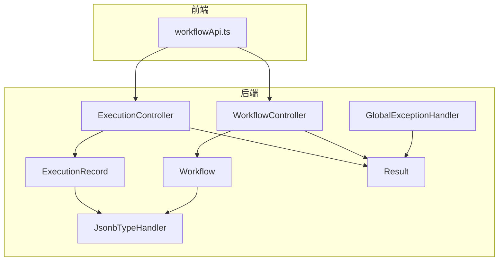
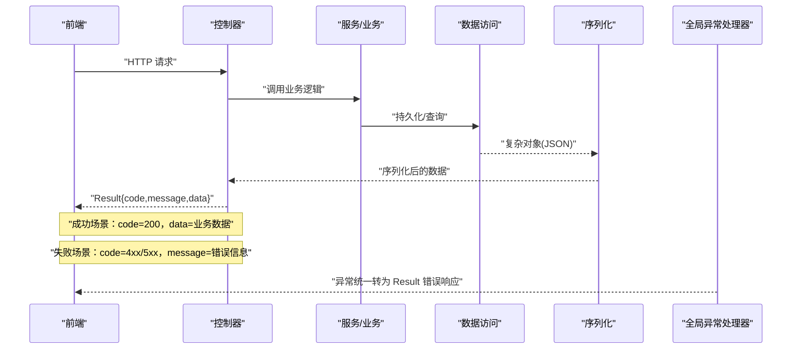
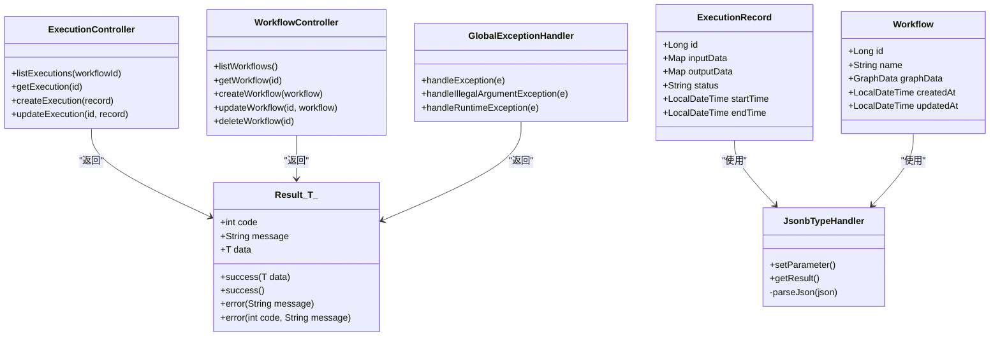

# 统一响应

<cite>
**本文引用的文件**
- [Result.java](file://backend/src/main/java/com/bokagent/common/Result.java)
- [GlobalExceptionHandler.java](file://backend/src/main/java/com/bokagent/common/GlobalExceptionHandler.java)
- [ExecutionController.java](file://backend/src/main/java/com/bokagent/controller/ExecutionController.java)
- [WorkflowController.java](file://backend/src/main/java/com/bokagent/controller/WorkflowController.java)
- [ExecutionRecord.java](file://backend/src/main/java/com/bokagent/entity/ExecutionRecord.java)
- [Workflow.java](file://backend/src/main/java/com/bokagent/entity/Workflow.java)
- [JsonbTypeHandler.java](file://backend/src/main/java/com/bokagent/handler/JsonbTypeHandler.java)
- [workflowApi.ts](file://frontend/src/services/workflowApi.ts)
- [application.yml](file://backend/src/main/resources/application.yml)
</cite>

## 目录
1. [简介](#简介)
2. [项目结构](#项目结构)
3. [核心组件](#核心组件)
4. [架构总览](#架构总览)
5. [详细组件分析](#详细组件分析)
6. [依赖分析](#依赖分析)
7. [性能考量](#性能考量)
8. [故障排查指南](#故障排查指南)
9. [结论](#结论)
10. [附录](#附录)

## 简介
本文件围绕后端统一响应包装机制进行系统化梳理，重点阐释 Result 类的设计理念与架构作用，覆盖响应格式标准化、数据序列化策略、泛型支持机制；详解 Result 类核心方法（success、error、of 等静态工厂方法）的使用方式；说明响应数据结构（code、message、data 等字段）的含义与用途；给出不同场景下的响应封装策略（成功/失败/分页/文件下载等）；并提供响应格式扩展方法（自定义响应体、响应拦截器、跨域处理等），以及前后端数据交互的最佳实践与兼容性考虑。

## 项目结构
该工程采用典型的 Spring Boot 分层架构：
- common：通用工具与基础设施，包含统一响应 Result 与全局异常处理 GlobalExceptionHandler
- controller：REST 控制器层，负责接收请求、调用服务并返回 Result 包装的响应
- entity：领域模型，包含工作流与执行记录等实体
- handler：MyBatis 类型处理器，用于 JSON 字段的序列化与反序列化
- resources：Spring 配置与数据库迁移脚本
- frontend：前端服务，通过 axios 调用后端 /api 接口

图表来源
- [ExecutionController.java:1-81](file://backend/src/main/java/com/bokagent/controller/ExecutionController.java#L1-L81)
- [WorkflowController.java:1-92](file://backend/src/main/java/com/bokagent/controller/WorkflowController.java#L1-L92)
- [Result.java:1-42](file://backend/src/main/java/com/bokagent/common/Result.java#L1-L42)
- [GlobalExceptionHandler.java:1-37](file://backend/src/main/java/com/bokagent/common/GlobalExceptionHandler.java#L1-L37)
- [ExecutionRecord.java:1-40](file://backend/src/main/java/com/bokagent/entity/ExecutionRecord.java#L1-L40)
- [Workflow.java:1-32](file://backend/src/main/java/com/bokagent/entity/Workflow.java#L1-L32)
- [JsonbTypeHandler.java:1-64](file://backend/src/main/java/com/bokagent/handler/JsonbTypeHandler.java#L1-L64)
- [workflowApi.ts:1-44](file://frontend/src/services/workflowApi.ts#L1-L44)

章节来源
- [ExecutionController.java:1-81](file://backend/src/main/java/com/bokagent/controller/ExecutionController.java#L1-L81)
- [WorkflowController.java:1-92](file://backend/src/main/java/com/bokagent/controller/WorkflowController.java#L1-L92)
- [Result.java:1-42](file://backend/src/main/java/com/bokagent/common/Result.java#L1-L42)
- [GlobalExceptionHandler.java:1-37](file://backend/src/main/java/com/bokagent/common/GlobalExceptionHandler.java#L1-L37)
- [ExecutionRecord.java:1-40](file://backend/src/main/java/com/bokagent/entity/ExecutionRecord.java#L1-L40)
- [Workflow.java:1-32](file://backend/src/main/java/com/bokagent/entity/Workflow.java#L1-L32)
- [JsonbTypeHandler.java:1-64](file://backend/src/main/java/com/bokagent/handler/JsonbTypeHandler.java#L1-L64)
- [workflowApi.ts:1-44](file://frontend/src/services/workflowApi.ts#L1-L44)

## 核心组件
- Result<T>：统一响应载体，提供静态工厂方法以生成标准响应对象，支持泛型承载任意业务数据类型
- GlobalExceptionHandler：全局异常处理，将未捕获异常转换为 Result 错误响应，确保前后端一致的错误格式
- ExecutionController/WorkflowController：业务控制器，直接返回 Result 对象，实现成功与失败场景的标准化封装
- ExecutionRecord/Workflow：实体模型，配合 JsonbTypeHandler 实现复杂 JSON 字段的持久化与读取
- JsonbTypeHandler：MyBatis 类型处理器，负责 Map/GraphData 等复杂对象的 JSON 序列化与反序列化
- workflowApi.ts：前端 axios 客户端，约定 /api 基础路径，统一处理 Result 结构

章节来源
- [Result.java:1-42](file://backend/src/main/java/com/bokagent/common/Result.java#L1-L42)
- [GlobalExceptionHandler.java:1-37](file://backend/src/main/java/com/bokagent/common/GlobalExceptionHandler.java#L1-L37)
- [ExecutionController.java:1-81](file://backend/src/main/java/com/bokagent/controller/ExecutionController.java#L1-L81)
- [WorkflowController.java:1-92](file://backend/src/main/java/com/bokagent/controller/WorkflowController.java#L1-L92)
- [ExecutionRecord.java:1-40](file://backend/src/main/java/com/bokagent/entity/ExecutionRecord.java#L1-L40)
- [Workflow.java:1-32](file://backend/src/main/java/com/bokagent/entity/Workflow.java#L1-L32)
- [JsonbTypeHandler.java:1-64](file://backend/src/main/java/com/bokagent/handler/JsonbTypeHandler.java#L1-L64)
- [workflowApi.ts:1-44](file://frontend/src/services/workflowApi.ts#L1-L44)

## 架构总览
统一响应机制贯穿“控制器 -> 业务 -> 数据访问 -> 序列化”的全链路，形成前后端一致的契约：
- 控制器层：返回 Result<T>，屏蔽具体状态码细节
- 异常层：全局捕获异常并统一转为 Result 错误响应
- 序列化层：Jackson 配置与 MyBatis 类型处理器保证复杂对象正确序列化
- 前端层：基于 axios 的 API 客户端按 Result 结构解析响应

图表来源
- [ExecutionController.java:28-79](file://backend/src/main/java/com/bokagent/controller/ExecutionController.java#L28-L79)
- [WorkflowController.java:28-90](file://backend/src/main/java/com/bokagent/controller/WorkflowController.java#L28-L90)
- [GlobalExceptionHandler.java:16-35](file://backend/src/main/java/com/bokagent/common/GlobalExceptionHandler.java#L16-L35)
- [JsonbTypeHandler.java:54-63](file://backend/src/main/java/com/bokagent/handler/JsonbTypeHandler.java#L54-L63)
- [application.yml:68-75](file://backend/src/main/resources/application.yml#L68-L75)

## 详细组件分析

### Result<T> 设计与实现
- 设计理念
  - 统一响应格式，屏蔽 HTTP 状态码与业务数据的耦合
  - 泛型支持，使 data 字段可承载任意业务对象，便于前后端契约稳定
  - 静态工厂方法提供简洁的构造方式，减少样板代码
- 关键字段
  - code：HTTP 状态语义映射的业务状态码，如 200 表示成功，400/404/500 表示不同错误类型
  - message：人类可读的错误或成功提示
  - data：泛型承载的业务数据，可为空（如成功但无数据）
- 核心方法
  - success(T data)：构造成功响应，code=200，message="success"
  - success()：构造无数据的成功响应
  - error(String message)：构造服务器内部错误响应，code=500
  - error(int code, String message)：构造指定错误码的错误响应
- 使用建议
  - 成功场景优先使用 success(data)，失败场景使用 error(code, message)
  - 对于业务校验失败，建议使用 400 系列码；资源不存在使用 404；服务器错误使用 500

章节来源
- [Result.java:9-41](file://backend/src/main/java/com/bokagent/common/Result.java#L9-L41)

### 全局异常处理 GlobalExceptionHandler
- 功能定位
  - 捕获未处理异常，统一转换为 Result 错误响应，避免异常栈直接暴露给前端
- 处理策略
  - Exception.class：默认 500 错误，message 拼接异常消息
  - IllegalArgumentException.class：400 错误，message 来自参数校验
  - RuntimeException.class：500 错误，message 拼接运行时异常
- 与 Result 的协作
  - 返回值均为 Result<?>，确保异常响应与业务响应格式一致

章节来源
- [GlobalExceptionHandler.java:14-35](file://backend/src/main/java/com/bokagent/common/GlobalExceptionHandler.java#L14-L35)

### 控制器层响应封装策略
- ExecutionController
  - 列表/详情/创建/更新接口均返回 Result<T>，成功时 data 为对应实体集合或单个实体
  - 对于不存在的资源，返回 404 错误响应
- WorkflowController
  - 同样遵循统一响应规范，支持分页场景（当前实现返回完整列表）
- 跨域处理
  - 控制器类级别使用 @CrossOrigin(origins = "*")，便于前端开发调试

章节来源
- [ExecutionController.java:28-79](file://backend/src/main/java/com/bokagent/controller/ExecutionController.java#L28-L79)
- [WorkflowController.java:28-90](file://backend/src/main/java/com/bokagent/controller/WorkflowController.java#L28-L90)

### 数据序列化策略与复杂对象处理
- Jackson 配置
  - application.yml 中设置 Jackson 默认属性：非空字段序列化、日期不以时间戳输出、未知属性不报错
- MyBatis 类型处理器
  - JsonbTypeHandler：将 Map/GraphData 等复杂对象序列化为 JSON 存储，并在读取时反序列化
  - ExecutionRecord.inputData/outputData、Workflow.graphData 使用该处理器
- 前端交互
  - 前端 axios 客户端以 application/json 方式发送请求，Result 结构由后端统一返回

章节来源
- [application.yml:68-75](file://backend/src/main/resources/application.yml#L68-L75)
- [JsonbTypeHandler.java:18-63](file://backend/src/main/java/com/bokagent/handler/JsonbTypeHandler.java#L18-L63)
- [ExecutionRecord.java:24-28](file://backend/src/main/java/com/bokagent/entity/ExecutionRecord.java#L24-L28)
- [Workflow.java:25](file://backend/src/main/java/com/bokagent/entity/Workflow.java#L25)
- [workflowApi.ts:3-8](file://frontend/src/services/workflowApi.ts#L3-L8)

### 响应数据结构与字段含义
- code：业务状态码，建议与 HTTP 状态码语义保持一致
- message：错误或成功提示，面向用户展示
- data：业务数据，可为任意对象或集合
- timestamp：当前实现未内置时间戳字段；如需可扩展 Result<T> 或在 data 内部携带

章节来源
- [Result.java:10-12](file://backend/src/main/java/com/bokagent/common/Result.java#L10-L12)

### 不同场景下的响应封装策略
- 成功响应
  - 使用 Result.success(data) 或 Result.success()，code=200
- 失败响应
  - 参数错误：Result.error(400, message)
  - 资源不存在：Result.error(404, message)
  - 服务器错误：Result.error(message) 或 Result.error(500, message)
- 分页响应
  - 当前控制器返回完整列表；若需要分页，可在 data 中封装分页对象（如 total/pageSize/items），并在 Result 中返回
- 文件下载响应
  - 文件下载通常返回二进制流而非 Result 结构；可在控制器中返回 ResponseEntity<Resource> 并设置 Content-Disposition 头，避免与 JSON 响应冲突

章节来源
- [ExecutionController.java:44,70:44-70](file://backend/src/main/java/com/bokagent/controller/ExecutionController.java#L44-L70)
- [WorkflowController.java:43,68,86:43-86](file://backend/src/main/java/com/bokagent/controller/WorkflowController.java#L43-L86)

### 响应格式扩展方法
- 自定义响应体
  - 在 Result<T> 基础上增加字段（如 timestamp），或在 data 内部封装更丰富的元数据
- 响应拦截器
  - 可通过 Spring Interceptor 或 Filter 对 Result 进行二次包装（如统一日志、审计、签名等）
- 跨域处理
  - 控制器已使用 @CrossOrigin("*")，生产环境建议限定具体域名并配置预检请求头

章节来源
- [ExecutionController.java:19](file://backend/src/main/java/com/bokagent/controller/ExecutionController.java#L19)
- [WorkflowController.java:19](file://backend/src/main/java/com/bokagent/controller/WorkflowController.java#L19)

## 依赖分析
- 控制器依赖 Result：所有控制器方法直接返回 Result<T>，形成统一契约
- 全局异常处理器依赖 Result：异常统一转换为 Result 错误响应
- 实体依赖 JsonbTypeHandler：复杂 JSON 字段通过类型处理器进行序列化
- 前端依赖 Result 结构：axios 客户端按 Result 结构解析响应

图表来源
- [Result.java:9-41](file://backend/src/main/java/com/bokagent/common/Result.java#L9-L41)
- [GlobalExceptionHandler.java:16-35](file://backend/src/main/java/com/bokagent/common/GlobalExceptionHandler.java#L16-L35)
- [ExecutionController.java:28-79](file://backend/src/main/java/com/bokagent/controller/ExecutionController.java#L28-L79)
- [WorkflowController.java:28-90](file://backend/src/main/java/com/bokagent/controller/WorkflowController.java#L28-L90)
- [ExecutionRecord.java:24-28](file://backend/src/main/java/com/bokagent/entity/ExecutionRecord.java#L24-L28)
- [Workflow.java:25](file://backend/src/main/java/com/bokagent/entity/Workflow.java#L25)
- [JsonbTypeHandler.java:18-63](file://backend/src/main/java/com/bokagent/handler/JsonbTypeHandler.java#L18-L63)

## 性能考量
- 序列化开销
  - Jackson 配置为非空字段序列化，减少冗余字段传输；复杂对象 JSON 序列化建议控制深度与大小
- 数据库访问
  - MyBatis Plus 配置启用下划线转驼峰映射，提升查询效率；注意批量操作时的事务与锁粒度
- 前端请求
  - axios 默认 application/json，建议对大对象分页或懒加载，避免一次性传输过多数据

章节来源
- [application.yml:68-75](file://backend/src/main/resources/application.yml#L68-L75)
- [application.yml:90-99](file://backend/src/main/resources/application.yml#L90-L99)

## 故障排查指南
- 常见问题
  - 响应格式不一致：检查控制器是否直接返回 Result<T>，避免直接返回原始对象
  - 异常未被统一处理：确认 GlobalExceptionHandler 是否生效，以及是否抛出了受检异常
  - JSON 字段解析失败：检查 JsonbTypeHandler 的 parseJson 流程与数据库字段类型
- 排查步骤
  - 后端：查看日志中异常堆栈，确认是否被 GlobalExceptionHandler 捕获并转换为 Result 错误响应
  - 前端：确认 axios 基础路径与 Result 结构解析逻辑，避免误读 data 字段
- 最佳实践
  - 对外接口统一返回 Result<T>，明确 code/message/data 语义
  - 对业务异常进行显式校验并返回 400/404 等明确错误码
  - 对复杂对象序列化进行单元测试，确保前后端兼容

章节来源
- [GlobalExceptionHandler.java:16-35](file://backend/src/main/java/com/bokagent/common/GlobalExceptionHandler.java#L16-L35)
- [JsonbTypeHandler.java:54-63](file://backend/src/main/java/com/bokagent/handler/JsonbTypeHandler.java#L54-L63)
- [workflowApi.ts:13-25](file://frontend/src/services/workflowApi.ts#L13-L25)

## 结论
统一响应包装机制通过 Result<T> 提供了清晰、稳定的前后端契约，结合全局异常处理与序列化策略，实现了从控制器到前端的一致性体验。建议在现有基础上进一步完善分页封装、文件下载响应策略与跨域安全配置，持续优化序列化性能与前端解析健壮性。

## 附录
- 前后端交互最佳实践
  - 前端：统一使用 axios 客户端，按 Result 结构解析响应；对 400/404/500 场景分别处理
  - 后端：控制器仅返回 Result<T>，异常统一由 GlobalExceptionHandler 处理
  - 数据：复杂对象通过 JsonbTypeHandler 正确序列化，避免丢失字段
- 兼容性考虑
  - 生产环境限制跨域来源，避免通配符 "*" 导致的安全风险
  - 对历史接口进行版本化管理，逐步替换旧响应格式