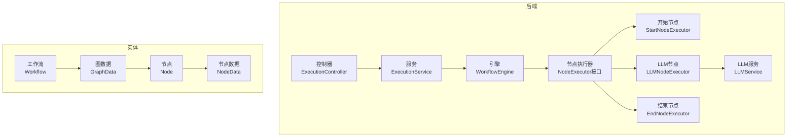
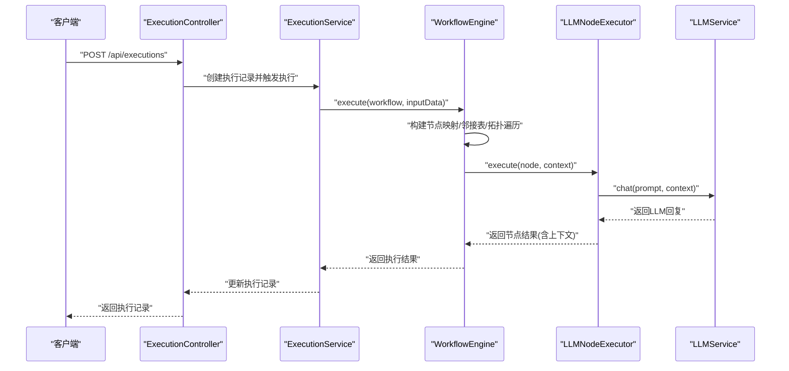
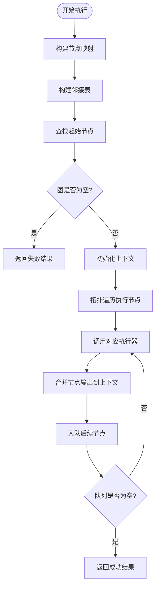
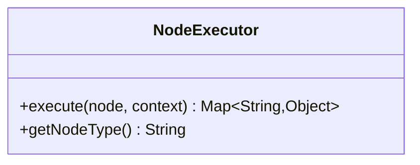
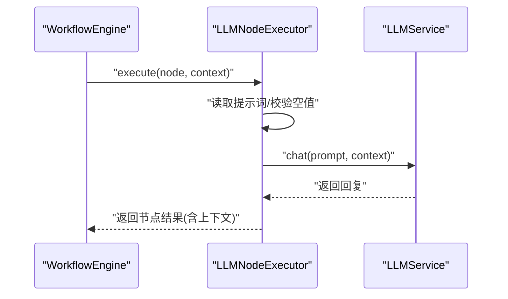
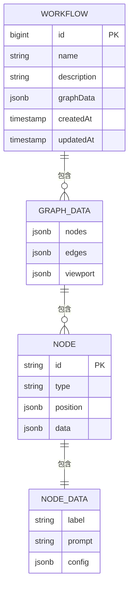
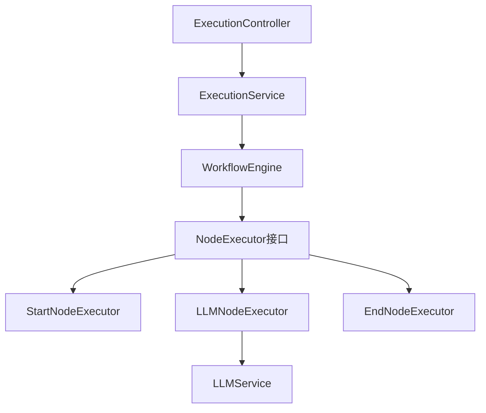

# Function Calling功能

<cite>
**本文引用的文件**
- [WorkflowEngine.java](file://backend/src/main/java/com/bokagent/engine/WorkflowEngine.java)
- [NodeExecutor.java](file://backend/src/main/java/com/bokagent/engine/NodeExecutor.java)
- [LLMNodeExecutor.java](file://backend/src/main/java/com/bokagent/engine/LLMNodeExecutor.java)
- [StartNodeExecutor.java](file://backend/src/main/java/com/bokagent/engine/StartNodeExecutor.java)
- [EndNodeExecutor.java](file://backend/src/main/java/com/bokagent/engine/EndNodeExecutor.java)
- [ExecutionResult.java](file://backend/src/main/java/com/bokagent/engine/ExecutionResult.java)
- [ExecutionService.java](file://backend/src/main/java/com/bokagent/service/ExecutionService.java)
- [ExecutionController.java](file://backend/src/main/java/com/bokagent/controller/ExecutionController.java)
- [LLMService.java](file://backend/src/main/java/com/bokagent/service/LLMService.java)
- [Node.java](file://backend/src/main/java/com/bokagent/entity/Node.java)
- [NodeData.java](file://backend/src/main/java/com/bokagent/entity/NodeData.java)
- [Workflow.java](file://backend/src/main/java/com/bokagent/entity/Workflow.java)
- [GraphData.java](file://backend/src/main/java/com/bokagent/entity/GraphData.java)
- [application.yml](file://backend/src/main/resources/application.yml)
</cite>

## 目录
1. [简介](#简介)
2. [项目结构](#项目结构)
3. [核心组件](#核心组件)
4. [架构总览](#架构总览)
5. [详细组件分析](#详细组件分析)
6. [依赖分析](#依赖分析)
7. [性能考虑](#性能考虑)
8. [故障排查指南](#故障排查指南)
9. [结论](#结论)
10. [附录](#附录)

## 简介
本文件围绕Function Calling功能进行系统化实现文档编制，重点阐述以下方面：
- Function Calling在工作流中的定位与作用：通过LLM节点作为“工具调用”的执行载体，结合上下文传递实现多轮对话与外部能力调用。
- 工具注册系统与函数定义格式：以节点类型与节点数据字段承载工具定义；当前实现以LLM节点承载提示词与配置。
- 参数传递机制：通过执行上下文在节点间传递数据，支持跨节点状态共享与增量更新。
- 工具调用生命周期管理：从工具发现（节点类型识别）、参数验证（提示词与上下文）、执行调度（拓扑执行）、结果返回（统一结构）全流程梳理。
- 与工作流引擎的集成：节点级工具调用、执行上下文管理、错误处理策略。
- 工具安全机制：输入构建（上下文拼接）、超时控制、重试策略、缓存策略等。
- 配置示例与使用指南：基于现有配置项给出工具定义与调用建议。
- 性能优化策略：并发执行控制、缓存机制、资源管理。
- 实际工具开发示例与集成测试方法：基于现有LLM节点扩展思路。

## 项目结构
后端采用分层架构，核心模块如下：
- engine：工作流引擎与节点执行器
- service：业务服务（执行编排、LLM服务）
- controller：执行记录REST接口
- entity：领域模型（工作流、节点、图数据等）
- resources：应用配置（Spring AI、MCP、缓存、超时等）

图表来源
- [ExecutionController.java:1-81](file://backend/src/main/java/com/bokagent/controller/ExecutionController.java#L1-L81)
- [ExecutionService.java:1-113](file://backend/src/main/java/com/bokagent/service/ExecutionService.java#L1-L113)
- [WorkflowEngine.java:1-171](file://backend/src/main/java/com/bokagent/engine/WorkflowEngine.java#L1-L171)
- [NodeExecutor.java:1-24](file://backend/src/main/java/com/bokagent/engine/NodeExecutor.java#L1-L24)
- [StartNodeExecutor.java:1-41](file://backend/src/main/java/com/bokagent/engine/StartNodeExecutor.java#L1-L41)
- [LLMNodeExecutor.java:1-69](file://backend/src/main/java/com/bokagent/engine/LLMNodeExecutor.java#L1-L69)
- [EndNodeExecutor.java:1-41](file://backend/src/main/java/com/bokagent/engine/EndNodeExecutor.java#L1-L41)
- [LLMService.java:1-67](file://backend/src/main/java/com/bokagent/service/LLMService.java#L1-L67)
- [Workflow.java:1-32](file://backend/src/main/java/com/bokagent/entity/Workflow.java#L1-L32)
- [GraphData.java:1-15](file://backend/src/main/java/com/bokagent/entity/GraphData.java#L1-L15)
- [Node.java:1-15](file://backend/src/main/java/com/bokagent/entity/Node.java#L1-L15)
- [NodeData.java:1-15](file://backend/src/main/java/com/bokagent/entity/NodeData.java#L1-L15)

章节来源
- [ExecutionController.java:1-81](file://backend/src/main/java/com/bokagent/controller/ExecutionController.java#L1-L81)
- [ExecutionService.java:1-113](file://backend/src/main/java/com/bokagent/service/ExecutionService.java#L1-L113)
- [WorkflowEngine.java:1-171](file://backend/src/main/java/com/bokagent/engine/WorkflowEngine.java#L1-L171)
- [NodeExecutor.java:1-24](file://backend/src/main/java/com/bokagent/engine/NodeExecutor.java#L1-L24)
- [StartNodeExecutor.java:1-41](file://backend/src/main/java/com/bokagent/engine/StartNodeExecutor.java#L1-L41)
- [LLMNodeExecutor.java:1-69](file://backend/src/main/java/com/bokagent/engine/LLMNodeExecutor.java#L1-L69)
- [EndNodeExecutor.java:1-41](file://backend/src/main/java/com/bokagent/engine/EndNodeExecutor.java#L1-L41)
- [LLMService.java:1-67](file://backend/src/main/java/com/bokagent/service/LLMService.java#L1-L67)
- [Workflow.java:1-32](file://backend/src/main/java/com/bokagent/entity/Workflow.java#L1-L32)
- [GraphData.java:1-15](file://backend/src/main/java/com/bokagent/entity/GraphData.java#L1-L15)
- [Node.java:1-15](file://backend/src/main/java/com/bokagent/entity/Node.java#L1-L15)
- [NodeData.java:1-15](file://backend/src/main/java/com/bokagent/entity/NodeData.java#L1-L15)

## 核心组件
- 工作流引擎：负责解析图结构、构建邻接表、拓扑执行节点，并维护执行上下文。
- 节点执行器接口：定义统一的节点执行契约，不同节点类型实现差异化逻辑。
- LLM节点执行器：作为Function Calling的核心载体，负责将上下文与提示词整合后调用LLM服务。
- LLM服务：封装Spring AI的ChatClient，负责实际的大模型调用与错误处理。
- 执行服务：协调工作流执行与执行记录的持久化，统一处理成功/失败状态与时间戳。
- 控制器：提供执行记录的增删改查接口，支撑前端调试与监控。
- 实体模型：工作流、图数据、节点与节点数据，承载工具定义与运行时数据。

章节来源
- [WorkflowEngine.java:47-82](file://backend/src/main/java/com/bokagent/engine/WorkflowEngine.java#L47-L82)
- [NodeExecutor.java:9-23](file://backend/src/main/java/com/bokagent/engine/NodeExecutor.java#L9-L23)
- [LLMNodeExecutor.java:22-61](file://backend/src/main/java/com/bokagent/engine/LLMNodeExecutor.java#L22-L61)
- [LLMService.java:27-44](file://backend/src/main/java/com/bokagent/service/LLMService.java#L27-L44)
- [ExecutionService.java:39-92](file://backend/src/main/java/com/bokagent/service/ExecutionService.java#L39-L92)
- [ExecutionController.java:25-79](file://backend/src/main/java/com/bokagent/controller/ExecutionController.java#L25-L79)
- [Workflow.java:14-31](file://backend/src/main/java/com/bokagent/entity/Workflow.java#L14-L31)
- [GraphData.java:9-14](file://backend/src/main/java/com/bokagent/entity/GraphData.java#L9-L14)
- [Node.java:8-14](file://backend/src/main/java/com/bokagent/entity/Node.java#L8-L14)
- [NodeData.java:9-14](file://backend/src/main/java/com/bokagent/entity/NodeData.java#L9-L14)

## 架构总览
Function Calling在当前实现中由LLM节点承担工具调用职责，通过上下文在节点间传递，形成可组合的工具链路。

图表来源
- [ExecutionController.java:52-59](file://backend/src/main/java/com/bokagent/controller/ExecutionController.java#L52-L59)
- [ExecutionService.java:39-92](file://backend/src/main/java/com/bokagent/service/ExecutionService.java#L39-L92)
- [WorkflowEngine.java:47-169](file://backend/src/main/java/com/bokagent/engine/WorkflowEngine.java#L47-L169)
- [LLMNodeExecutor.java:22-61](file://backend/src/main/java/com/bokagent/engine/LLMNodeExecutor.java#L22-L61)
- [LLMService.java:27-44](file://backend/src/main/java/com/bokagent/service/LLMService.java#L27-L44)

## 详细组件分析

### 工作流引擎（WorkflowEngine）
- 职责：解析工作流图，构建节点映射与邻接表，按拓扑顺序执行节点，维护执行上下文。
- 关键流程：
  - 图构建：将节点列表转为Map，边列表转为邻接表。
  - 起始节点查找：筛选类型为“start”的节点。
  - 拓扑执行：使用队列进行广度优先遍历，逐节点执行并合并输出到上下文。
- 输出：统一的执行结果对象，包含成功标志、输出数据、错误信息与执行耗时。

图表来源
- [WorkflowEngine.java:47-169](file://backend/src/main/java/com/bokagent/engine/WorkflowEngine.java#L47-L169)

章节来源
- [WorkflowEngine.java:32-39](file://backend/src/main/java/com/bokagent/engine/WorkflowEngine.java#L32-L39)
- [WorkflowEngine.java:58-115](file://backend/src/main/java/com/bokagent/engine/WorkflowEngine.java#L58-L115)
- [WorkflowEngine.java:120-169](file://backend/src/main/java/com/bokagent/engine/WorkflowEngine.java#L120-L169)

### 节点执行器接口（NodeExecutor）
- 统一契约：定义节点执行方法与节点类型标识，便于引擎按类型路由到具体执行器。
- 作用：屏蔽不同节点类型的差异，保证工作流引擎的通用性。

图表来源
- [NodeExecutor.java:9-23](file://backend/src/main/java/com/bokagent/engine/NodeExecutor.java#L9-L23)

章节来源
- [NodeExecutor.java:9-23](file://backend/src/main/java/com/bokagent/engine/NodeExecutor.java#L9-L23)

### LLM节点执行器（LLMNodeExecutor）
- 工具调用实现：读取节点数据中的提示词，调用LLM服务生成回复，将结果合并回上下文。
- 参数验证：若提示词为空则使用默认提示词；捕获异常并返回标准化错误结果。
- 结果格式：包含节点标识、类型、状态、输出、时间戳以及上下文合并后的完整结果。

图表来源
- [LLMNodeExecutor.java:22-61](file://backend/src/main/java/com/bokagent/engine/LLMNodeExecutor.java#L22-L61)
- [LLMService.java:27-44](file://backend/src/main/java/com/bokagent/service/LLMService.java#L27-L44)

章节来源
- [LLMNodeExecutor.java:17-67](file://backend/src/main/java/com/bokagent/engine/LLMNodeExecutor.java#L17-L67)
- [LLMService.java:27-65](file://backend/src/main/java/com/bokagent/service/LLMService.java#L27-L65)

### 开始/结束节点执行器
- 开始节点：标记流程起点，将输入上下文透传到后续节点。
- 结束节点：收集最终上下文作为最终输出，便于上层消费。

章节来源
- [StartNodeExecutor.java:17-34](file://backend/src/main/java/com/bokagent/engine/StartNodeExecutor.java#L17-L34)
- [EndNodeExecutor.java:17-34](file://backend/src/main/java/com/bokagent/engine/EndNodeExecutor.java#L17-L34)

### 执行服务与控制器
- 执行服务：负责工作流查询、执行记录创建与更新、异常捕获与状态回写。
- 控制器：提供执行记录的查询、创建、更新接口，支持前端调试与监控。

章节来源
- [ExecutionService.java:39-92](file://backend/src/main/java/com/bokagent/service/ExecutionService.java#L39-L92)
- [ExecutionController.java:25-79](file://backend/src/main/java/com/bokagent/controller/ExecutionController.java#L25-L79)

### 实体模型与数据结构
- 工作流：包含名称、描述与图数据。
- 图数据：包含节点列表、边列表与视口信息。
- 节点：包含标识、类型、位置与节点数据。
- 节点数据：包含标签、提示词与配置。

图表来源
- [Workflow.java:14-31](file://backend/src/main/java/com/bokagent/entity/Workflow.java#L14-L31)
- [GraphData.java:9-14](file://backend/src/main/java/com/bokagent/entity/GraphData.java#L9-L14)
- [Node.java:8-14](file://backend/src/main/java/com/bokagent/entity/Node.java#L8-L14)
- [NodeData.java:9-14](file://backend/src/main/java/com/bokagent/entity/NodeData.java#L9-L14)

章节来源
- [Workflow.java:14-31](file://backend/src/main/java/com/bokagent/entity/Workflow.java#L14-L31)
- [GraphData.java:9-14](file://backend/src/main/java/com/bokagent/entity/GraphData.java#L9-L14)
- [Node.java:8-14](file://backend/src/main/java/com/bokagent/entity/Node.java#L8-L14)
- [NodeData.java:9-14](file://backend/src/main/java/com/bokagent/entity/NodeData.java#L9-L14)

## 依赖分析
- 组件耦合：
  - 引擎与执行器：通过节点类型映射解耦，新增节点类型只需实现接口并注册。
  - 执行器与服务：LLM节点依赖LLM服务；执行服务依赖引擎选择器与持久化。
  - 控制器与服务：控制器仅暴露执行记录接口，不直接参与执行细节。
- 外部依赖：
  - Spring AI ChatClient：用于大模型调用。
  - 数据库：MyBatis-Plus + Flyway + PostgreSQL。
  - 缓存与异步：Redis与Task Executor配置。

图表来源
- [WorkflowEngine.java:32-39](file://backend/src/main/java/com/bokagent/engine/WorkflowEngine.java#L32-L39)
- [NodeExecutor.java:9-23](file://backend/src/main/java/com/bokagent/engine/NodeExecutor.java#L9-L23)
- [StartNodeExecutor.java:15-39](file://backend/src/main/java/com/bokagent/engine/StartNodeExecutor.java#L15-L39)
- [LLMNodeExecutor.java:17-67](file://backend/src/main/java/com/bokagent/engine/LLMNodeExecutor.java#L17-L67)
- [EndNodeExecutor.java:15-39](file://backend/src/main/java/com/bokagent/engine/EndNodeExecutor.java#L15-L39)
- [LLMService.java:16-19](file://backend/src/main/java/com/bokagent/service/LLMService.java#L16-L19)
- [ExecutionService.java:30-31](file://backend/src/main/java/com/bokagent/service/ExecutionService.java#L30-L31)
- [ExecutionController.java:22-23](file://backend/src/main/java/com/bokagent/controller/ExecutionController.java#L22-L23)

章节来源
- [WorkflowEngine.java:32-39](file://backend/src/main/java/com/bokagent/engine/WorkflowEngine.java#L32-L39)
- [ExecutionService.java:30-31](file://backend/src/main/java/com/bokagent/service/ExecutionService.java#L30-L31)
- [ExecutionController.java:22-23](file://backend/src/main/java/com/bokagent/controller/ExecutionController.java#L22-L23)

## 性能考虑
- 并发执行控制：通过异步任务配置池大小与队列容量控制并发度，避免过载。
- 缓存机制：启用缓存并设置默认TTL；针对工具结果与LLM响应分别设置TTL，减少重复计算与网络调用。
- 资源管理：数据库连接池最大值、Redis连接池参数需结合负载评估调整。
- 超时控制：为工具执行、LLM调用、TTS合成、MCP请求与工作流执行设置明确超时阈值，防止阻塞。
- 重试策略：对可重试异常配置最大尝试次数与退避策略，提升稳定性。

章节来源
- [application.yml:82-88](file://backend/src/main/resources/application.yml#L82-L88)
- [application.yml:157-162](file://backend/src/main/resources/application.yml#L157-L162)
- [application.yml:139-147](file://backend/src/main/resources/application.yml#L139-L147)
- [application.yml:149-155](file://backend/src/main/resources/application.yml#L149-L155)

## 故障排查指南
- 执行失败：
  - 检查工作流图是否为空或缺少起始节点。
  - 查看执行服务异常捕获与执行记录状态回写。
- LLM调用失败：
  - 检查提示词构建逻辑与上下文拼接。
  - 关注LLM服务异常日志与错误包装。
- 节点执行异常：
  - LLM节点会返回标准化错误结果，包含节点标识、类型、状态与错误信息。
- 执行记录问题：
  - 使用控制器接口查询/更新执行记录，确认状态与时间戳。

章节来源
- [WorkflowEngine.java:52-81](file://backend/src/main/java/com/bokagent/engine/WorkflowEngine.java#L52-L81)
- [ExecutionService.java:81-91](file://backend/src/main/java/com/bokagent/service/ExecutionService.java#L81-L91)
- [LLMService.java:40-43](file://backend/src/main/java/com/bokagent/service/LLMService.java#L40-L43)
- [LLMNodeExecutor.java:50-61](file://backend/src/main/java/com/bokagent/engine/LLMNodeExecutor.java#L50-L61)
- [ExecutionController.java:39-79](file://backend/src/main/java/com/bokagent/controller/ExecutionController.java#L39-L79)

## 结论
当前实现将Function Calling聚焦于LLM节点，通过上下文传递实现工具调用与多轮交互。系统具备清晰的执行生命周期、统一的结果格式与完善的错误处理。后续可在以下方向演进：
- 增加独立的工具注册中心与动态加载机制。
- 完善工具参数Schema校验与类型约束。
- 引入工具执行隔离与资源配额控制。
- 扩展更多节点类型（如工具节点、条件节点）以支持复杂编排。

## 附录

### 配置示例与使用指南
- 工具定义语法（基于节点数据）：
  - 标签：用于展示与识别。
  - 提示词：工具执行的核心指令，可为空时使用默认提示词。
  - 配置：工具相关的参数集合（JSON格式），可用于控制行为。
- 调用参数格式：
  - 输入数据：工作流启动时传入的初始上下文。
  - 上下文传递：节点执行结果会合并到上下文中，供后续节点使用。
- 返回值处理：
  - 统一返回结构包含节点标识、类型、状态、输出、时间戳与上下文合并结果。
  - 成功/失败状态由引擎与服务统一维护。

章节来源
- [NodeData.java:10-13](file://backend/src/main/java/com/bokagent/entity/NodeData.java#L10-L13)
- [LLMNodeExecutor.java:36-46](file://backend/src/main/java/com/bokagent/engine/LLMNodeExecutor.java#L36-L46)
- [ExecutionResult.java:10-31](file://backend/src/main/java/com/bokagent/engine/ExecutionResult.java#L10-L31)

### 实际工具开发示例
- 新增工具节点：
  - 实现节点执行器接口，定义节点类型标识。
  - 在引擎中注册节点类型映射，确保按类型路由到新执行器。
  - 在节点数据中定义工具参数（提示词、配置），并在执行器中读取与校验。
- 集成测试方法：
  - 通过控制器创建执行记录并触发执行，观察执行记录状态与输出。
  - 使用单元测试覆盖提示词构建、上下文合并与异常分支。
  - 结合缓存与超时配置验证性能与稳定性。

章节来源
- [NodeExecutor.java:9-23](file://backend/src/main/java/com/bokagent/engine/NodeExecutor.java#L9-L23)
- [WorkflowEngine.java:32-39](file://backend/src/main/java/com/bokagent/engine/WorkflowEngine.java#L32-L39)
- [ExecutionController.java:52-59](file://backend/src/main/java/com/bokagent/controller/ExecutionController.java#L52-L59)