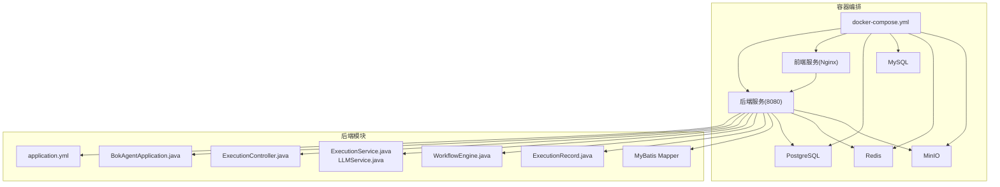
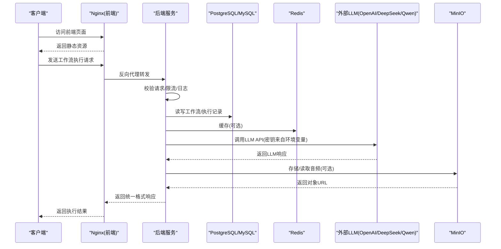
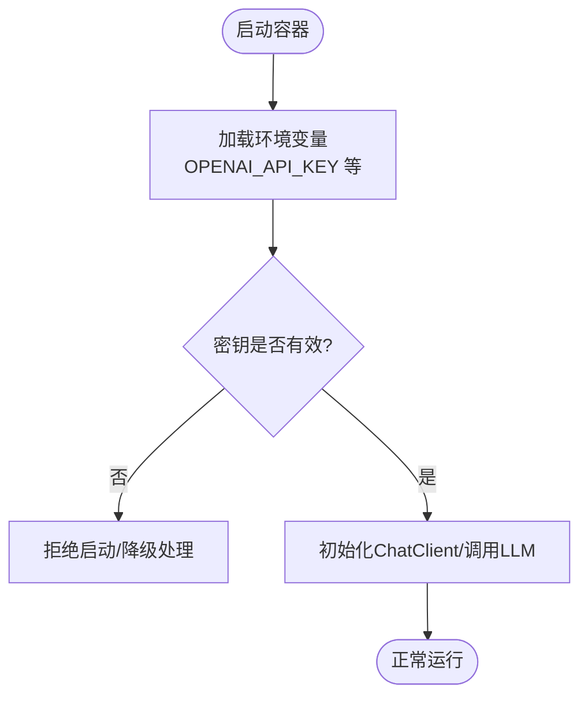
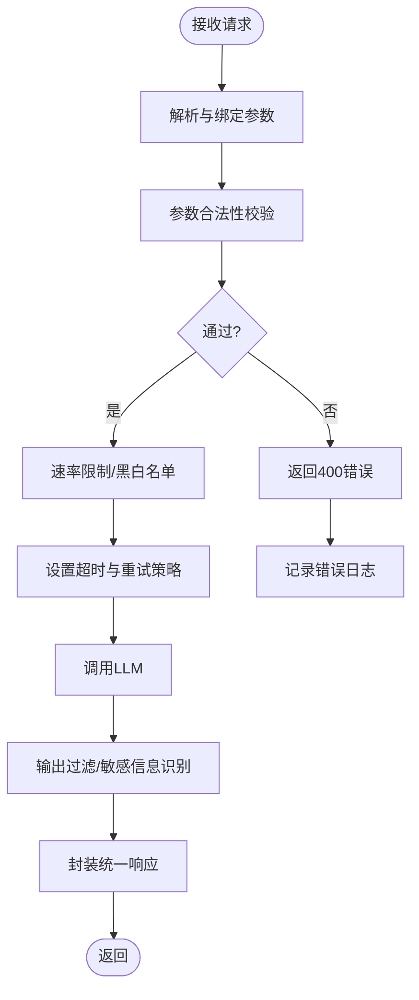
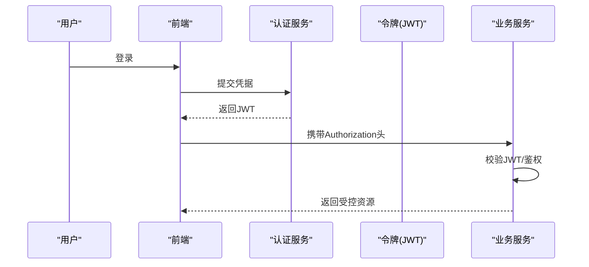
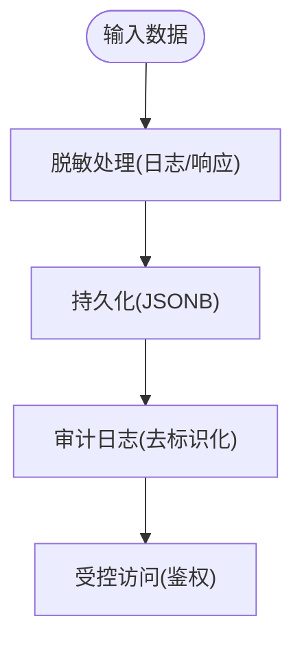
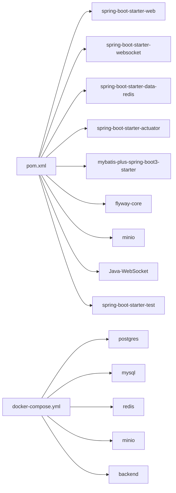

# LLM安全策略

<cite>
**本文引用的文件**
- [application.yml](file://backend/src/main/resources/application.yml)
- [BokAgentApplication.java](file://backend/src/main/java/com/bokagent/BokAgentApplication.java)
- [GlobalExceptionHandler.java](file://backend/src/main/java/com/bokagent/common/GlobalExceptionHandler.java)
- [Result.java](file://backend/src/main/java/com/bokagent/common/Result.java)
- [ExecutionController.java](file://backend/src/main/java/com/bokagent/controller/ExecutionController.java)
- [ExecutionService.java](file://backend/src/main/java/com/bokagent/service/ExecutionService.java)
- [LLMService.java](file://backend/src/main/java/com/bokagent/service/LLMService.java)
- [WorkflowEngine.java](file://backend/src/main/java/com/bokagent/engine/WorkflowEngine.java)
- [ExecutionRecord.java](file://backend/src/main/java/com/bokagent/entity/ExecutionRecord.java)
- [V1__create_workflow_tables.sql](file://backend/src/main/resources/db/migration/V1__create_workflow_tables.sql)
- [V2__create_execution_records.sql](file://backend/src/main/resources/db/migration/V2__create_execution_records.sql)
- [docker-compose.yml](file://docker/docker-compose.yml)
- [pom.xml](file://backend/pom.xml)
- [start.sh](file://start.sh)
</cite>

## 目录
1. [引言](#引言)
2. [项目结构](#项目结构)
3. [核心组件](#核心组件)
4. [架构总览](#架构总览)
5. [详细组件分析](#详细组件分析)
6. [依赖分析](#依赖分析)
7. [性能考虑](#性能考虑)
8. [故障排查指南](#故障排查指南)
9. [结论](#结论)
10. [附录](#附录)

## 引言
本文件面向LLM系统的安全策略与最佳实践，结合现有代码库与配置，系统性梳理API密钥管理、请求安全防护、会话与身份认证、数据隐私保护、安全配置、监控与告警、漏洞防护与应急响应、安全测试与评估等主题。由于当前代码库尚未实现统一的身份认证、会话管理与细粒度访问控制，本文在“现状”基础上提出可落地的安全加固建议与实施路径。

## 项目结构
后端采用Spring Boot工程，通过环境变量注入外部化配置；数据库迁移脚本定义了工作流与执行记录的数据表；Docker Compose提供容器化部署与密钥注入能力；前端通过Nginx反向代理提供静态资源与API转发。

**图表来源**
- [docker-compose.yml:1-132](file://docker/docker-compose.yml#L1-L132)
- [application.yml:1-190](file://backend/src/main/resources/application.yml#L1-L190)
- [BokAgentApplication.java:1-56](file://backend/src/main/java/com/bokagent/BokAgentApplication.java#L1-L56)
- [ExecutionController.java:1-81](file://backend/src/main/java/com/bokagent/controller/ExecutionController.java#L1-L81)
- [ExecutionService.java:1-113](file://backend/src/main/java/com/bokagent/service/ExecutionService.java#L1-L113)
- [LLMService.java:1-67](file://backend/src/main/java/com/bokagent/service/LLMService.java#L1-L67)
- [WorkflowEngine.java:1-171](file://backend/src/main/java/com/bokagent/engine/WorkflowEngine.java#L1-L171)
- [ExecutionRecord.java:1-40](file://backend/src/main/java/com/bokagent/entity/ExecutionRecord.java#L1-L40)

**章节来源**
- [docker-compose.yml:1-132](file://docker/docker-compose.yml#L1-L132)
- [application.yml:1-190](file://backend/src/main/resources/application.yml#L1-L190)
- [BokAgentApplication.java:1-56](file://backend/src/main/java/com/bokagent/BokAgentApplication.java#L1-L56)

## 核心组件
- 应用入口与编码保障：确保JVM与Servlet层UTF-8编码一致，避免字符集相关风险。
- 统一异常处理：集中捕获异常并返回结构化错误响应，避免泄露内部细节。
- 控制器与服务：执行记录的增删改查与工作流执行编排，涉及LLM调用链路。
- 数据持久化：工作流与执行记录以JSONB存储，便于扩展但需关注输入校验与日志脱敏。
- 外部化配置：API密钥通过环境变量注入，避免硬编码。

**章节来源**
- [BokAgentApplication.java:21-54](file://backend/src/main/java/com/bokagent/BokAgentApplication.java#L21-L54)
- [GlobalExceptionHandler.java:16-35](file://backend/src/main/java/com/bokagent/common/GlobalExceptionHandler.java#L16-L35)
- [ExecutionController.java:28-79](file://backend/src/main/java/com/bokagent/controller/ExecutionController.java#L28-L79)
- [ExecutionService.java:39-91](file://backend/src/main/java/com/bokagent/service/ExecutionService.java#L39-L91)
- [LLMService.java:27-44](file://backend/src/main/java/com/bokagent/service/LLMService.java#L27-L44)
- [ExecutionRecord.java:24-38](file://backend/src/main/java/com/bokagent/entity/ExecutionRecord.java#L24-L38)
- [application.yml:45-66](file://backend/src/main/resources/application.yml#L45-L66)

## 架构总览
下图展示从客户端到后端、再到外部LLM与对象存储的关键交互路径，以及密钥注入与日志配置位置。

**图表来源**
- [docker-compose.yml:88-104](file://docker/docker-compose.yml#L88-L104)
- [application.yml:45-66](file://backend/src/main/resources/application.yml#L45-L66)
- [ExecutionController.java:52-79](file://backend/src/main/java/com/bokagent/controller/ExecutionController.java#L52-L79)
- [ExecutionService.java:39-91](file://backend/src/main/java/com/bokagent/service/ExecutionService.java#L39-L91)
- [LLMService.java:27-44](file://backend/src/main/java/com/bokagent/service/LLMService.java#L27-L44)
- [V1__create_workflow_tables.sql:1-17](file://backend/src/main/resources/db/migration/V1__create_workflow_tables.sql#L1-L17)
- [V2__create_execution_records.sql:1-19](file://backend/src/main/resources/db/migration/V2__create_execution_records.sql#L1-L19)

## 详细组件分析

### API密钥安全管理
- 注入方式：通过环境变量注入至后端，避免代码与配置文件泄露。
- 使用范围：OpenAI、DeepSeek、Qwen三类模型的API密钥均来自环境变量。
- 安全建议：
  - 密钥轮换：建立CI/CD流水线自动替换环境变量，支持灰度切换与回滚。
  - 最小暴露：仅在必要容器内注入对应供应商密钥，避免全局可见。
  - 加密存储：生产环境使用KMS或Secret管理服务对密钥进行透明加密与访问授权。
  - 审计追踪：记录密钥使用次数与调用来源，异常时触发告警与冻结。

**图表来源**
- [docker-compose.yml:94-96](file://docker/docker-compose.yml#L94-L96)
- [application.yml:47-66](file://backend/src/main/resources/application.yml#L47-L66)

**章节来源**
- [docker-compose.yml:94-96](file://docker/docker-compose.yml#L94-L96)
- [application.yml:47-66](file://backend/src/main/resources/application.yml#L47-L66)

### 请求安全防护
- 输入验证：控制器与服务层应增加参数校验与长度限制，防止超长输入导致资源耗尽。
- 输出过滤：对LLM输出进行关键词过滤与敏感信息识别，必要时引入内容审核接口。
- 恶意请求检测：基于速率限制、IP白名单、请求体签名与时间戳校验，阻断暴力破解与滥用。
- 超时与重试：合理设置LLM调用超时与指数退避重试，避免级联故障。

**图表来源**
- [ExecutionController.java:52-79](file://backend/src/main/java/com/bokagent/controller/ExecutionController.java#L52-L79)
- [ExecutionService.java:39-91](file://backend/src/main/java/com/bokagent/service/ExecutionService.java#L39-L91)
- [application.yml:149-155](file://backend/src/main/resources/application.yml#L149-L155)

**章节来源**
- [ExecutionController.java:28-79](file://backend/src/main/java/com/bokagent/controller/ExecutionController.java#L28-L79)
- [ExecutionService.java:39-91](file://backend/src/main/java/com/bokagent/service/ExecutionService.java#L39-L91)
- [application.yml:149-155](file://backend/src/main/resources/application.yml#L149-L155)

### 会话管理与身份认证
- 现状：代码库未实现统一认证与会话管理，跨域策略为“允许所有来源”，存在安全风险。
- 建议方案：
  - 引入Spring Security + JWT，实现登录认证与权限控制。
  - 会话存储：Redis集中式会话或无状态JWT，避免会话固定攻击。
  - 跨域：精确配置allowedOrigins与CORS头，禁用通配符。
  - 权限模型：RBAC，区分管理员/普通用户，限制工作流与执行记录的访问范围。

**图表来源**
- [ExecutionController.java](file://backend/src/main/java/com/bokagent/controller/ExecutionController.java#L19)
- [docker-compose.yml:94-100](file://docker/docker-compose.yml#L94-L100)

**章节来源**
- [ExecutionController.java](file://backend/src/main/java/com/bokagent/controller/ExecutionController.java#L19)
- [docker-compose.yml:94-100](file://docker/docker-compose.yml#L94-L100)

### 数据隐私保护
- 敏感信息脱敏：日志与响应中避免直接输出API密钥、用户输入中的敏感字段；对执行记录的input_data与output_data进行脱敏。
- 数据传输加密：生产环境启用HTTPS与TLS，容器间通信使用私有网络。
- 日志脱敏：统一日志格式，对敏感字段打码；保留审计轨迹但不存储明文密钥。
- 数据库设计：使用JSONB存储结构化数据，配合索引优化查询；对错误信息与文本字段支持中文与Emoji。

**图表来源**
- [V1__create_workflow_tables.sql:1-17](file://backend/src/main/resources/db/migration/V1__create_workflow_tables.sql#L1-L17)
- [V2__create_execution_records.sql:1-19](file://backend/src/main/resources/db/migration/V2__create_execution_records.sql#L1-L19)
- [ExecutionRecord.java:24-38](file://backend/src/main/java/com/bokagent/entity/ExecutionRecord.java#L24-L38)

**章节来源**
- [V1__create_workflow_tables.sql:1-17](file://backend/src/main/resources/db/migration/V1__create_workflow_tables.sql#L1-L17)
- [V2__create_execution_records.sql:1-19](file://backend/src/main/resources/db/migration/V2__create_execution_records.sql#L1-L19)
- [ExecutionRecord.java:24-38](file://backend/src/main/java/com/bokagent/entity/ExecutionRecord.java#L24-L38)

### 安全配置最佳实践
- 最小权限原则：数据库连接、Redis访问、MinIO操作仅授予必要权限；密钥仅在需要的服务中可见。
- 安全审计：开启Actuator端点访问控制与鉴权，记录关键操作；日志级别按环境调整。
- 合规要求：遵循数据本地化与跨境传输合规，对日志与备份进行加密与保留期限管理。

**章节来源**
- [application.yml:181-190](file://backend/src/main/resources/application.yml#L181-L190)
- [docker-compose.yml:88-100](file://docker/docker-compose.yml#L88-L100)

### 安全监控与告警
- 异常行为检测：基于请求量、错误率、响应时间与LLM调用耗时构建基线；异常波动触发告警。
- 安全事件响应：建立事件分级与处置流程，包含密钥冻结、IP封禁、服务降级与回滚。
- 日志分析：集中化日志收集与检索，对敏感字段脱敏后再入库；定期巡检异常模式。

**章节来源**
- [GlobalExceptionHandler.java:16-35](file://backend/src/main/java/com/bokagent/common/GlobalExceptionHandler.java#L16-L35)
- [application.yml:164-180](file://backend/src/main/resources/application.yml#L164-L180)

### 安全漏洞防护与应急响应
- 漏洞防护：定期扫描依赖漏洞，及时升级Spring Boot、Spring AI、MyBatis-Plus与第三方组件；对已知高危漏洞设置阻断规则。
- 应急响应：制定密钥泄露、DDoS、数据泄露等场景的预案；演练恢复流程与沟通机制。

**章节来源**
- [pom.xml:21-27](file://backend/pom.xml#L21-L27)
- [docker-compose.yml:94-96](file://docker/docker-compose.yml#L94-L96)

### 安全测试与评估
- 单元与集成测试：覆盖控制器参数校验、服务层异常分支、数据库事务一致性。
- 渗透测试：模拟SQL注入、命令注入、越权访问与敏感信息泄露，修复后回归验证。
- 配置审计：检查密钥注入、CORS配置、日志级别与端点暴露情况。

**章节来源**
- [ExecutionController.java:28-79](file://backend/src/main/java/com/bokagent/controller/ExecutionController.java#L28-L79)
- [ExecutionService.java:39-91](file://backend/src/main/java/com/bokagent/service/ExecutionService.java#L39-L91)
- [pom.xml:127-132](file://backend/pom.xml#L127-L132)

## 依赖分析
后端依赖Spring Web、Websocket、Redis、Actuator、MyBatis-Plus、Flyway、MinIO与WebSocket客户端；容器编排通过Compose拉起PostgreSQL、MySQL、Redis、MinIO与后端服务，并注入各供应商API密钥。

**图表来源**
- [pom.xml:30-132](file://backend/pom.xml#L30-L132)
- [docker-compose.yml:3-131](file://docker/docker-compose.yml#L3-L131)

**章节来源**
- [pom.xml:30-132](file://backend/pom.xml#L30-L132)
- [docker-compose.yml:3-131](file://docker/docker-compose.yml#L3-L131)

## 性能考虑
- 连接池与超时：Hikari连接池大小与最大并发、Redis连接池容量、LLM调用超时与重试策略需结合负载压测调优。
- 缓存策略：合理设置缓存TTL与失效策略，避免热点Key雪崩。
- 数据库索引：为高频查询字段建立索引，减少慢查询。

**章节来源**
- [application.yml:22-24](file://backend/src/main/resources/application.yml#L22-L24)
- [application.yml:157-162](file://backend/src/main/resources/application.yml#L157-L162)
- [V1__create_workflow_tables.sql](file://backend/src/main/resources/db/migration/V1__create_workflow_tables.sql#L16)
- [V2__create_execution_records.sql:17-18](file://backend/src/main/resources/db/migration/V2__create_execution_records.sql#L17-L18)

## 故障排查指南
- 启动编码问题：若出现乱码或字符集异常，检查JVM与Servlet编码设置与容器时区。
- API密钥错误：确认环境变量是否正确注入，容器日志中是否存在密钥为空或无效的报错。
- 数据库连接失败：核对主机名、端口、用户名与密码，查看健康检查状态。
- LLM调用异常：检查超时配置与重试策略，定位网络与上游服务可用性。

**章节来源**
- [BokAgentApplication.java:21-54](file://backend/src/main/java/com/bokagent/BokAgentApplication.java#L21-L54)
- [docker-compose.yml:88-100](file://docker/docker-compose.yml#L88-L100)
- [start.sh:1-38](file://start.sh#L1-L38)

## 结论
当前代码库在API密钥注入、日志与超时配置方面具备基础安全能力，但在统一认证、会话管理、细粒度访问控制、输入输出过滤与全面安全审计方面仍需补齐。建议优先落地密钥加密存储与轮换、引入认证与权限控制、完善输入校验与输出过滤、强化监控与告警体系，并持续开展安全测试与渗透评估，以满足生产环境的安全与合规要求。

## 附录
- 统一响应与异常处理：提供结构化错误码与消息，避免泄露内部异常细节。
- 数据模型：工作流与执行记录采用JSONB存储，便于扩展与国际化文本支持。

**章节来源**
- [Result.java:14-40](file://backend/src/main/java/com/bokagent/common/Result.java#L14-L40)
- [GlobalExceptionHandler.java:16-35](file://backend/src/main/java/com/bokagent/common/GlobalExceptionHandler.java#L16-L35)
- [V1__create_workflow_tables.sql:1-17](file://backend/src/main/resources/db/migration/V1__create_workflow_tables.sql#L1-L17)
- [V2__create_execution_records.sql:1-19](file://backend/src/main/resources/db/migration/V2__create_execution_records.sql#L1-L19)