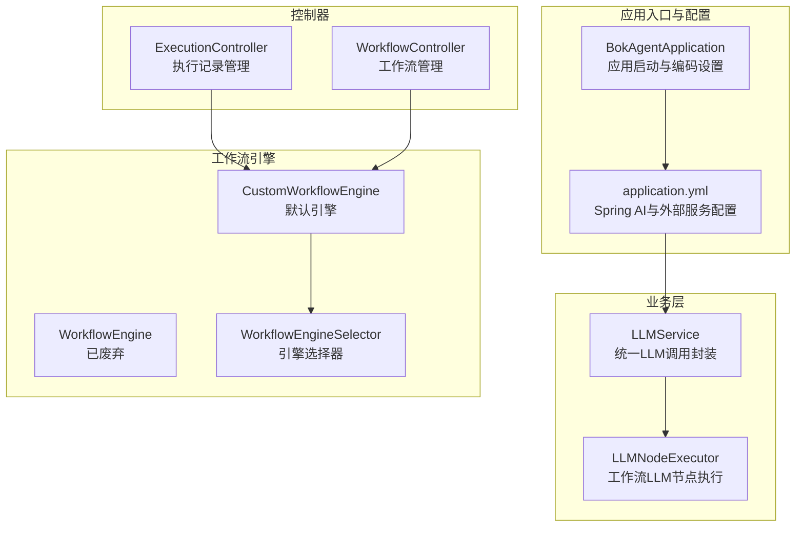
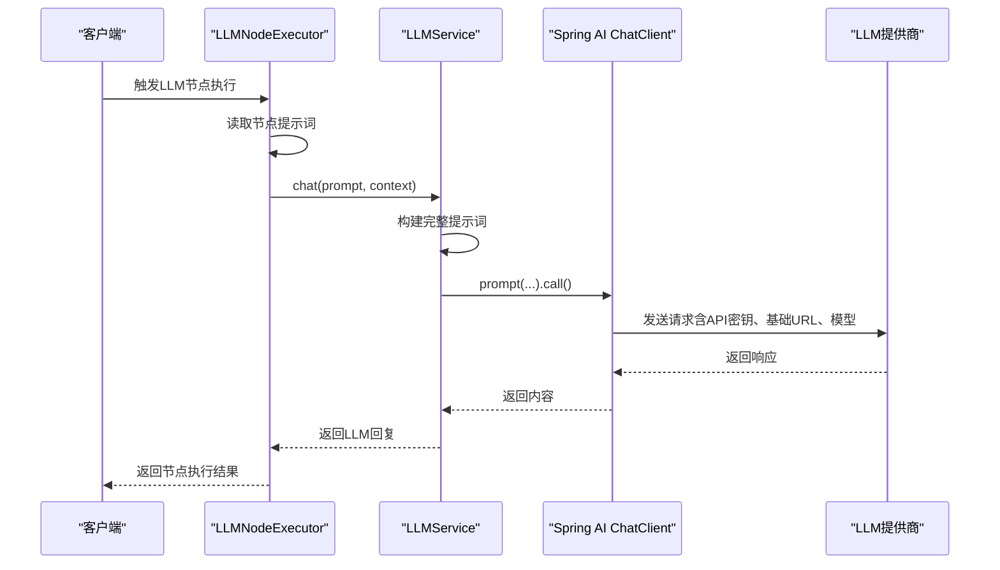
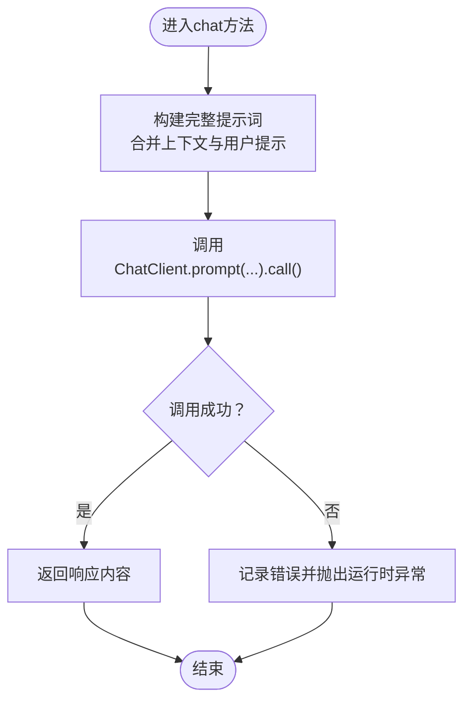
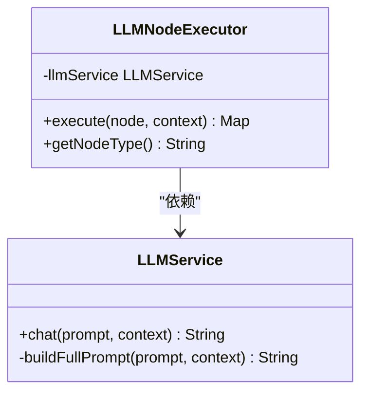
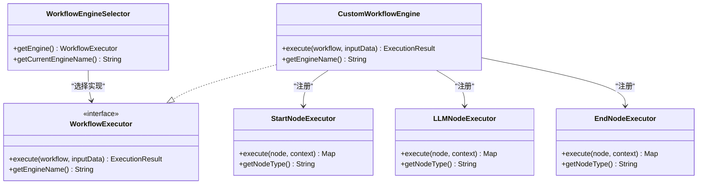
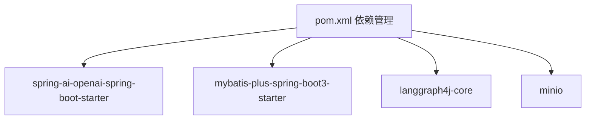

# LLM提供商集成

<cite>
**本文引用的文件**
- [BokAgentApplication.java](file://backend/src/main/java/com/bokagent/BokAgentApplication.java)
- [application.yml](file://backend/src/main/resources/application.yml)
- [LLMService.java](file://backend/src/main/java/com/bokagent/service/LLMService.java)
- [LLMNodeExecutor.java](file://backend/src/main/java/com/bokagent/engine/LLMNodeExecutor.java)
- [pom.xml](file://backend/pom.xml)
- [Result.java](file://backend/src/main/java/com/bokagent/common/Result.java)
- [GlobalExceptionHandler.java](file://backend/src/main/java/com/bokagent/common/GlobalExceptionHandler.java)
- [NodeData.java](file://backend/src/main/java/com/bokagent/entity/NodeData.java)
- [ExecutionController.java](file://backend/src/main/java/com/bokagent/controller/ExecutionController.java)
- [WorkflowController.java](file://backend/src/main/java/com/bokagent/controller/WorkflowController.java)
- [WorkflowEngine.java](file://backend/src/main/java/com/bokagent/engine/WorkflowEngine.java)
- [CustomWorkflowEngine.java](file://backend/src/main/java/com/bokagent/engine/CustomWorkflowEngine.java)
- [WorkflowEngineSelector.java](file://backend/src/main/java/com/bokagent/engine/WorkflowEngineSelector.java)
- [WorkflowExecutor.java](file://backend/src/main/java/com/bokagent/engine/WorkflowExecutor.java)
- [NodeExecutor.java](file://backend/src/main/java/com/bokagent/engine/NodeExecutor.java)
- [StartNodeExecutor.java](file://backend/src/main/java/com/bokagent/engine/StartNodeExecutor.java)
- [EndNodeExecutor.java](file://backend/src/main/java/com/bokagent/engine/EndNodeExecutor.java)
</cite>

## 目录
1. [简介](#简介)
2. [项目结构](#项目结构)
3. [核心组件](#核心组件)
4. [架构总览](#架构总览)
5. [详细组件分析](#详细组件分析)
6. [依赖分析](#依赖分析)
7. [性能考虑](#性能考虑)
8. [故障排查指南](#故障排查指南)
9. [结论](#结论)
10. [附录](#附录)

## 简介
本文件面向多LLM提供商集成场景，围绕OpenAI、Deepseek、通义千问三大主流大模型提供商，系统化梳理在本项目中的集成方式与实现细节。重点包括：
- 各提供商的API配置参数（API密钥、基础URL、模型选择策略）
- 模型差异与适配方法（模型名称映射、参数兼容性、响应格式标准化）
- 提供商切换机制（动态配置加载、运行时模型选择、负载均衡思路）
- 使用示例与最佳实践（性能对比、成本控制、故障转移）
- 配置文件参数详解与调优建议

## 项目结构
后端采用Spring Boot + Spring AI构建，LLM调用通过统一的ChatClient封装，结合工作流引擎实现节点化编排。关键模块如下：
- 应用入口与配置：BokAgentApplication、application.yml
- 业务层：LLMService（统一LLM调用）、LLMNodeExecutor（工作流LLM节点）
- 控制器：ExecutionController、WorkflowController（工作流与执行记录管理）
- 工作流引擎：WorkflowEngine（已废弃，保留兼容）、CustomWorkflowEngine（默认实现）、WorkflowEngineSelector（引擎选择器）
- 统一响应与异常：Result、GlobalExceptionHandler

图表来源
- [BokAgentApplication.java:1-56](file://backend/src/main/java/com/bokagent/BokAgentApplication.java#L1-L56)
- [application.yml:1-190](file://backend/src/main/resources/application.yml#L1-L190)
- [LLMService.java:1-67](file://backend/src/main/java/com/bokagent/service/LLMService.java#L1-L67)
- [LLMNodeExecutor.java:1-69](file://backend/src/main/java/com/bokagent/engine/LLMNodeExecutor.java#L1-L69)
- [WorkflowEngine.java:1-171](file://backend/src/main/java/com/bokagent/engine/WorkflowEngine.java#L1-L171)
- [CustomWorkflowEngine.java:1-171](file://backend/src/main/java/com/bokagent/engine/CustomWorkflowEngine.java#L1-L171)
- [WorkflowEngineSelector.java:1-52](file://backend/src/main/java/com/bokagent/engine/WorkflowEngineSelector.java#L1-L52)

章节来源
- [BokAgentApplication.java:1-56](file://backend/src/main/java/com/bokagent/BokAgentApplication.java#L1-L56)
- [application.yml:1-190](file://backend/src/main/resources/application.yml#L1-L190)

## 核心组件
- LLMService：基于Spring AI的ChatClient进行统一LLM调用，负责提示词构建与调用封装。
- LLMNodeExecutor：工作流中的LLM节点执行器，负责从节点数据读取提示词并调用LLMService。
- WorkflowEngine/CustomWorkflowEngine：工作流执行引擎，默认实现，负责拓扑顺序执行节点。
- WorkflowEngineSelector：根据配置动态选择引擎实现（当前为Custom或LangGraph4J）。
- application.yml：集中配置OpenAI、Deepseek、通义千问的API密钥、基础URL与模型选项。

章节来源
- [LLMService.java:1-67](file://backend/src/main/java/com/bokagent/service/LLMService.java#L1-L67)
- [LLMNodeExecutor.java:1-69](file://backend/src/main/java/com/bokagent/engine/LLMNodeExecutor.java#L1-L69)
- [CustomWorkflowEngine.java:1-171](file://backend/src/main/java/com/bokagent/engine/CustomWorkflowEngine.java#L1-L171)
- [WorkflowEngineSelector.java:1-52](file://backend/src/main/java/com/bokagent/engine/WorkflowEngineSelector.java#L1-L52)
- [application.yml:45-67](file://backend/src/main/resources/application.yml#L45-L67)

## 架构总览
本项目通过Spring AI的ChatClient抽象，屏蔽不同LLM提供商的差异，统一对外提供对话能力。工作流引擎以节点形式串联LLM调用，形成可编排的智能体流程。

图表来源
- [LLMNodeExecutor.java:22-62](file://backend/src/main/java/com/bokagent/engine/LLMNodeExecutor.java#L22-L62)
- [LLMService.java:27-44](file://backend/src/main/java/com/bokagent/service/LLMService.java#L27-L44)
- [application.yml:45-67](file://backend/src/main/resources/application.yml#L45-L67)

## 详细组件分析

### LLMService：统一LLM调用封装
- 功能职责
  - 接收用户提示词与上下文，构建完整提示词
  - 通过ChatClient发起调用，捕获异常并向上抛出
- 关键点
  - 提示词构建：将上下文信息拼接到用户提示词前，便于模型理解全局语境
  - 异常处理：捕获底层调用异常并包装为运行时异常，便于上层统一处理

图表来源
- [LLMService.java:27-44](file://backend/src/main/java/com/bokagent/service/LLMService.java#L27-L44)

章节来源
- [LLMService.java:1-67](file://backend/src/main/java/com/bokagent/service/LLMService.java#L1-L67)

### LLMNodeExecutor：工作流LLM节点执行器
- 功能职责
  - 从节点数据读取提示词，若为空则使用默认提示
  - 调用LLMService执行对话，并将结果写入上下文
  - 失败时返回标准错误结果
- 关键点
  - 节点类型固定为“llm”，便于工作流引擎识别
  - 输出包含节点ID、类型、状态、时间戳以及LLM回复

图表来源
- [LLMNodeExecutor.java:17-68](file://backend/src/main/java/com/bokagent/engine/LLMNodeExecutor.java#L17-L68)
- [LLMService.java:16-66](file://backend/src/main/java/com/bokagent/service/LLMService.java#L16-L66)

章节来源
- [LLMNodeExecutor.java:1-69](file://backend/src/main/java/com/bokagent/engine/LLMNodeExecutor.java#L1-L69)

### 工作流引擎与节点执行器
- CustomWorkflowEngine：默认引擎，基于拓扑排序执行节点，维护节点执行器映射
- StartNodeExecutor/EndNodeExecutor：分别处理开始与结束节点
- WorkflowEngineSelector：根据配置选择引擎实现（默认Custom）

图表来源
- [WorkflowExecutor.java:1-25](file://backend/src/main/java/com/bokagent/engine/WorkflowExecutor.java#L1-L25)
- [CustomWorkflowEngine.java:19-38](file://backend/src/main/java/com/bokagent/engine/CustomWorkflowEngine.java#L19-L38)
- [WorkflowEngineSelector.java:14-52](file://backend/src/main/java/com/bokagent/engine/WorkflowEngineSelector.java#L14-L52)
- [StartNodeExecutor.java:13-40](file://backend/src/main/java/com/bokagent/engine/StartNodeExecutor.java#L13-L40)
- [LLMNodeExecutor.java:15-68](file://backend/src/main/java/com/bokagent/engine/LLMNodeExecutor.java#L15-L68)
- [EndNodeExecutor.java:10-40](file://backend/src/main/java/com/bokagent/engine/EndNodeExecutor.java#L10-L40)

章节来源
- [CustomWorkflowEngine.java:1-171](file://backend/src/main/java/com/bokagent/engine/CustomWorkflowEngine.java#L1-L171)
- [WorkflowEngineSelector.java:1-52](file://backend/src/main/java/com/bokagent/engine/WorkflowEngineSelector.java#L1-L52)
- [StartNodeExecutor.java:1-40](file://backend/src/main/java/com/bokagent/engine/StartNodeExecutor.java#L1-L40)
- [EndNodeExecutor.java:1-40](file://backend/src/main/java/com/bokagent/engine/EndNodeExecutor.java#L1-L40)

### 配置文件与提供商参数
- OpenAI
  - 参数：api-key、base-url、chat.options.model
  - 示例路径：[application.yml:47-52](file://backend/src/main/resources/application.yml#L47-L52)
- Deepseek
  - 参数：api-key、base-url、chat.options.model
  - 示例路径：[application.yml:54-59](file://backend/src/main/resources/application.yml#L54-L59)
- 通义千问（DashScope）
  - 参数：api-key、base-url、chat.options.model
  - 示例路径：[application.yml:61-66](file://backend/src/main/resources/application.yml#L61-L66)

章节来源
- [application.yml:45-67](file://backend/src/main/resources/application.yml#L45-L67)

### 模型差异与适配方法
- 模型名称映射
  - OpenAI：gpt-4
  - Deepseek：deepseek-chat
  - 通义千问：qwen-plus
- 参数兼容性
  - 通过Spring AI的ChatClient统一接口，屏蔽不同提供商的参数差异
  - 在配置中指定对应提供商的chat.options.model即可
- 响应格式标准化
  - LLMService统一返回content字段作为字符串，便于工作流后续处理

章节来源
- [application.yml:50-66](file://backend/src/main/resources/application.yml#L50-L66)
- [LLMService.java:34-35](file://backend/src/main/java/com/bokagent/service/LLMService.java#L34-L35)

### 提供商切换机制
- 动态配置加载
  - 通过application.yml的spring.ai.*配置块加载各提供商参数
- 运行时模型选择
  - LLMService通过ChatClient调用，无需在代码中区分提供商
- 负载均衡策略
  - 当前实现未内置负载均衡；可在ChatClient层面扩展或引入外部限流/熔断组件

章节来源
- [application.yml:45-67](file://backend/src/main/resources/application.yml#L45-L67)
- [LLMService.java:18-19](file://backend/src/main/java/com/bokagent/service/LLMService.java#L18-L19)

### 使用示例与最佳实践
- OpenAI
  - 设置OPENAI_API_KEY与OPENAI_BASE_URL，模型选择chat.options.model=gpt-4
  - 适合高精度推理与复杂任务
- Deepseek
  - 设置DEEPSEEK_API_KEY与默认base-url，模型选择chat.options.model=deepseek-chat
  - 适合性价比与中文场景
- 通义千问
  - 设置QWEN_API_KEY与DashScope兼容模式base-url，模型选择chat.options.model=qwen-plus
  - 适合国内合规与生态集成
- 最佳实践
  - 性能对比：优先以任务类型选择模型（推理强用gpt-4，通用用qwen-plus）
  - 成本控制：通过模型选择与上下文精简降低token消耗
  - 故障转移：在ChatClient层增加重试与降级策略（当前默认重试配置位于retry.default）

章节来源
- [application.yml:47-66](file://backend/src/main/resources/application.yml#L47-L66)
- [application.yml:139-147](file://backend/src/main/resources/application.yml#L139-L147)

### 配置参数详解与调优建议
- spring.ai.openai.*
  - api-key：OpenAI API密钥
  - base-url：OpenAI API基础URL
  - chat.options.model：默认对话模型
- spring.ai.deepseek.*
  - api-key：Deepseek API密钥
  - base-url：Deepseek API基础URL
  - chat.options.model：默认对话模型
- spring.ai.qwen.*
  - api-key：通义千问API密钥
  - base-url：DashScope兼容模式基础URL
  - chat.options.model：默认对话模型
- 超时与重试
  - timeout.llm-call：LLM调用超时（毫秒）
  - retry.default：默认重试策略（最大尝试次数、初始延迟、退避倍数、最大延迟、可重试异常）

章节来源
- [application.yml:45-67](file://backend/src/main/resources/application.yml#L45-L67)
- [application.yml:139-155](file://backend/src/main/resources/application.yml#L139-L155)

## 依赖分析
- Spring AI Starter：启用OpenAI支持
- MyBatis-Plus：持久化工作流与执行记录
- LangGraph4J：可选工作流引擎扩展
- MinIO：对象存储集成

图表来源
- [pom.xml:52-100](file://backend/pom.xml#L52-L100)

章节来源
- [pom.xml:1-170](file://backend/pom.xml#L1-L170)

## 性能考虑
- 提示词优化：减少冗余上下文，提升token利用率
- 模型选择：根据任务复杂度选择合适模型，避免过度计算
- 超时与重试：合理设置timeout与retry.default，平衡稳定性与响应速度
- 缓存策略：利用缓存配置降低重复调用开销（如缓存工具结果与LLM响应）

## 故障排查指南
- 统一异常处理
  - GlobalExceptionHandler：捕获异常并返回Result格式
- 常见问题定位
  - API密钥/基础URL错误：检查application.yml对应配置
  - LLM调用失败：查看LLMService日志与异常栈
  - 工作流执行异常：检查CustomWorkflowEngine执行日志

章节来源
- [GlobalExceptionHandler.java:14-36](file://backend/src/main/java/com/bokagent/common/GlobalExceptionHandler.java#L14-L36)
- [LLMService.java:40-43](file://backend/src/main/java/com/bokagent/service/LLMService.java#L40-L43)

## 结论
本项目通过Spring AI实现了对OpenAI、Deepseek、通义千问的统一接入，配合工作流引擎形成可编排的智能体流程。配置文件集中管理各提供商参数，LLMService提供统一调用封装，便于在不同提供商间切换与迁移。建议在生产环境中结合超时、重试与缓存策略，进一步提升稳定性与性能。

## 附录
- 节点数据结构：NodeData包含label、prompt与config，用于LLM节点提示词与配置传递
- 控制器接口：WorkflowController与ExecutionController提供工作流与执行记录的REST接口

章节来源
- [NodeData.java:10-14](file://backend/src/main/java/com/bokagent/entity/NodeData.java#L10-L14)
- [WorkflowController.java:16-92](file://backend/src/main/java/com/bokagent/controller/WorkflowController.java#L16-L92)
- [ExecutionController.java:16-81](file://backend/src/main/java/com/bokagent/controller/ExecutionController.java#L16-L81)