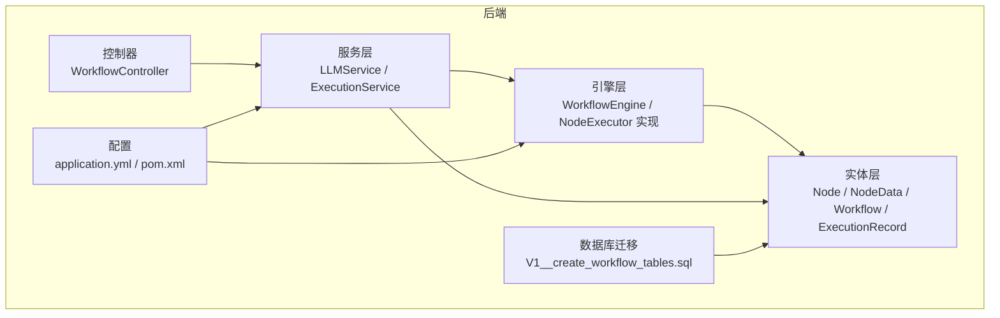
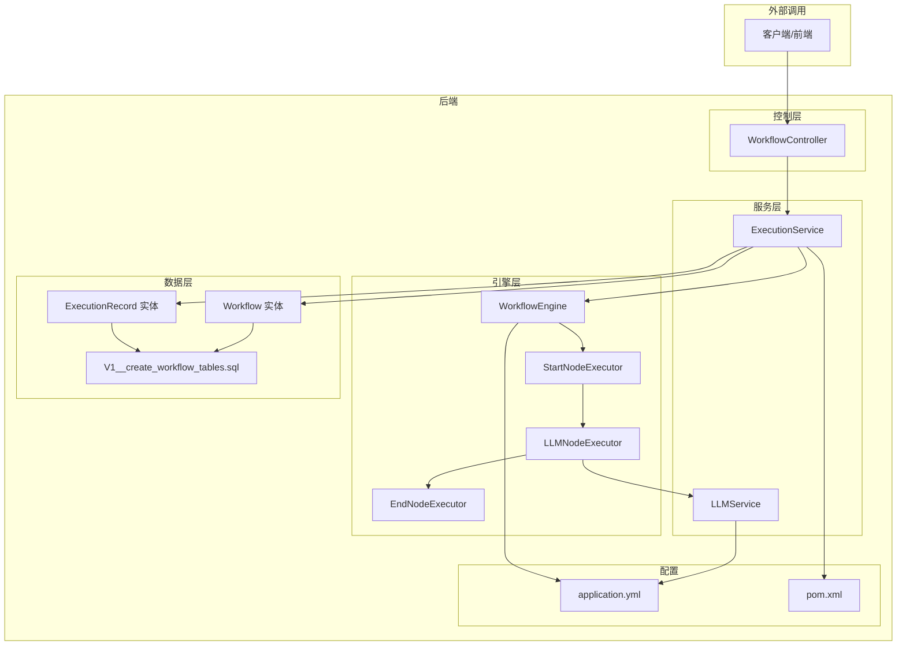
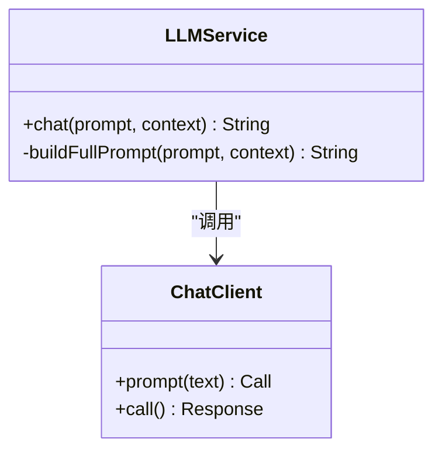
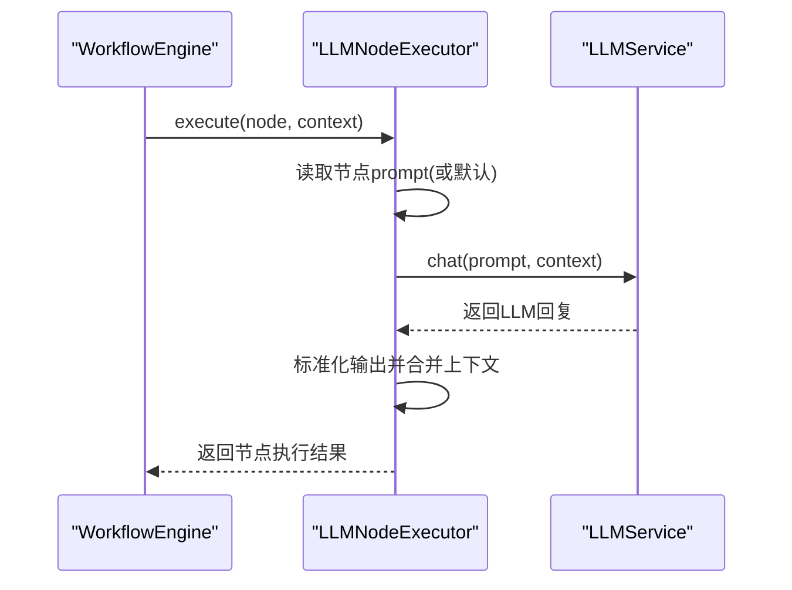
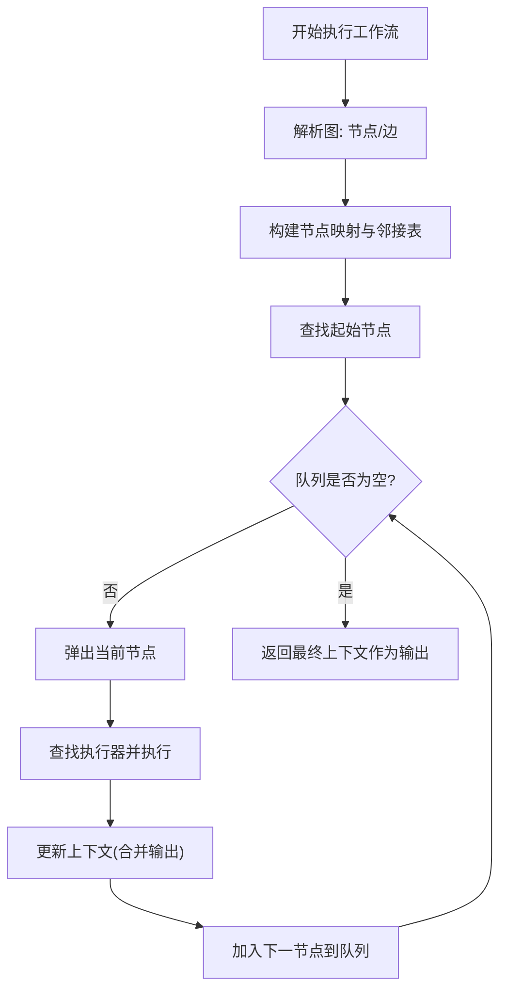
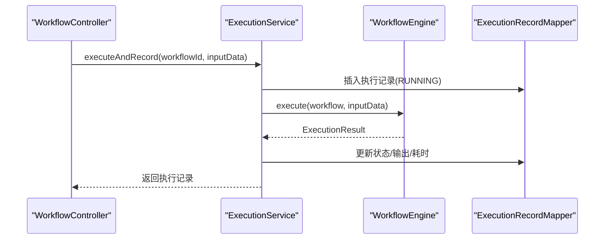
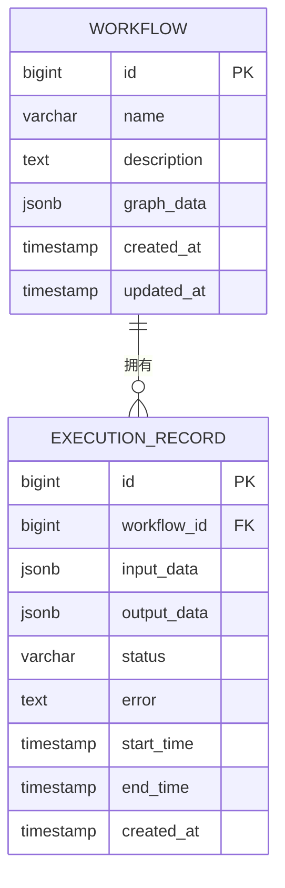
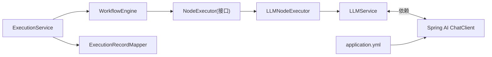

# LLM服务抽象层

<cite>
**本文引用的文件**
- [LLMService.java](file://backend/src/main/java/com/bokagent/service/LLMService.java)
- [LLMNodeExecutor.java](file://backend/src/main/java/com/bokagent/engine/LLMNodeExecutor.java)
- [NodeExecutor.java](file://backend/src/main/java/com/bokagent/engine/NodeExecutor.java)
- [WorkflowEngine.java](file://backend/src/main/java/com/bokagent/engine/WorkflowEngine.java)
- [ExecutionResult.java](file://backend/src/main/java/com/bokagent/engine/ExecutionResult.java)
- [NodeData.java](file://backend/src/main/java/com/bokagent/entity/NodeData.java)
- [Node.java](file://backend/src/main/java/com/bokagent/entity/Node.java)
- [Workflow.java](file://backend/src/main/java/com/bokagent/entity/Workflow.java)
- [ExecutionRecord.java](file://backend/src/main/java/com/bokagent/entity/ExecutionRecord.java)
- [application.yml](file://backend/src/main/resources/application.yml)
- [pom.xml](file://backend/pom.xml)
- [V1__create_workflow_tables.sql](file://backend/src/main/resources/db/migration/V1__create_workflow_tables.sql)
- [ExecutionService.java](file://backend/src/main/java/com/bokagent/service/ExecutionService.java)
- [WorkflowController.java](file://backend/src/main/java/com/bokagent/controller/WorkflowController.java)
- [Result.java](file://backend/src/main/java/com/bokagent/common/Result.java)
</cite>

## 目录
1. [引言](#引言)
2. [项目结构](#项目结构)
3. [核心组件](#核心组件)
4. [架构总览](#架构总览)
5. [详细组件分析](#详细组件分析)
6. [依赖分析](#依赖分析)
7. [性能考虑](#性能考虑)
8. [故障排查指南](#故障排查指南)
9. [结论](#结论)
10. [附录](#附录)

## 引言
本文件面向“LLM服务抽象层”的技术文档，聚焦于如何通过统一接口屏蔽不同LLM提供商的差异，实现模型无关的提示词构建、参数封装与响应处理；同时阐述该抽象层在工作流引擎中的集成方式（节点执行、上下文传递、状态管理），并提供扩展指南（自定义LLM适配器、接口实现最佳实践、性能优化策略）。文档以仓库现有代码为依据，结合架构图与流程图，帮助读者快速理解并安全地扩展系统。

## 项目结构
后端采用Spring Boot工程，核心模块围绕“服务抽象层 + 工作流引擎 + 控制器 + 数据持久化”组织。LLM服务抽象层位于service包，工作流引擎位于engine包，实体与映射位于entity与mapper包，配置集中在application.yml，数据库迁移脚本位于resources/db/migration。

图表来源
- [WorkflowController.java:1-92](file://backend/src/main/java/com/bokagent/controller/WorkflowController.java#L1-92)
- [LLMService.java:1-67](file://backend/src/main/java/com/bokagent/service/LLMService.java#L1-67)
- [ExecutionService.java:1-113](file://backend/src/main/java/com/bokagent/service/ExecutionService.java#L1-113)
- [WorkflowEngine.java:1-171](file://backend/src/main/java/com/bokagent/engine/WorkflowEngine.java#L1-171)
- [NodeExecutor.java:1-24](file://backend/src/main/java/com/bokagent/engine/NodeExecutor.java#L1-24)
- [Node.java:1-15](file://backend/src/main/java/com/bokagent/entity/Node.java#L1-15)
- [NodeData.java:1-15](file://backend/src/main/java/com/bokagent/entity/NodeData.java#L1-15)
- [Workflow.java:1-32](file://backend/src/main/java/com/bokagent/entity/Workflow.java#L1-32)
- [ExecutionRecord.java:1-40](file://backend/src/main/java/com/bokagent/entity/ExecutionRecord.java#L1-40)
- [application.yml:1-190](file://backend/src/main/resources/application.yml#L1-190)
- [pom.xml:1-170](file://backend/pom.xml#L1-170)
- [V1__create_workflow_tables.sql:1-17](file://backend/src/main/resources/db/migration/V1__create_workflow_tables.sql#L1-17)

章节来源
- [pom.xml:1-170](file://backend/pom.xml#L1-170)
- [application.yml:1-190](file://backend/src/main/resources/application.yml#L1-190)

## 核心组件
- LLM服务抽象层：对外暴露统一的chat接口，内部通过Spring AI ChatClient进行LLM调用，负责提示词拼装与错误包装。
- 节点执行器：实现NodeExecutor接口，将LLM节点的执行纳入工作流执行序列，负责上下文传递与结果标准化。
- 工作流引擎：负责解析工作流图、拓扑排序执行节点、维护上下文与状态。
- 执行服务：编排工作流执行、记录执行历史、统一返回格式。
- 统一响应：Result工具类，规范HTTP层返回结构。

章节来源
- [LLMService.java:1-67](file://backend/src/main/java/com/bokagent/service/LLMService.java#L1-67)
- [LLMNodeExecutor.java:1-69](file://backend/src/main/java/com/bokagent/engine/LLMNodeExecutor.java#L1-69)
- [NodeExecutor.java:1-24](file://backend/src/main/java/com/bokagent/engine/NodeExecutor.java#L1-24)
- [WorkflowEngine.java:1-171](file://backend/src/main/java/com/bokagent/engine/WorkflowEngine.java#L1-171)
- [ExecutionService.java:1-113](file://backend/src/main/java/com/bokagent/service/ExecutionService.java#L1-113)
- [Result.java:1-42](file://backend/src/main/java/com/bokagent/common/Result.java#L1-42)

## 架构总览
LLM服务抽象层通过统一接口屏蔽多提供商差异，结合工作流引擎实现“节点级LLM调用 + 上下文传递 + 标准化结果”的闭环。

图表来源
- [WorkflowController.java:1-92](file://backend/src/main/java/com/bokagent/controller/WorkflowController.java#L1-92)
- [ExecutionService.java:1-113](file://backend/src/main/java/com/bokagent/service/ExecutionService.java#L1-113)
- [WorkflowEngine.java:1-171](file://backend/src/main/java/com/bokagent/engine/WorkflowEngine.java#L1-171)
- [LLMNodeExecutor.java:1-69](file://backend/src/main/java/com/bokagent/engine/LLMNodeExecutor.java#L1-69)
- [LLMService.java:1-67](file://backend/src/main/java/com/bokagent/service/LLMService.java#L1-67)
- [Workflow.java:1-32](file://backend/src/main/java/com/bokagent/entity/Workflow.java#L1-32)
- [ExecutionRecord.java:1-40](file://backend/src/main/java/com/bokagent/entity/ExecutionRecord.java#L1-40)
- [application.yml:1-190](file://backend/src/main/resources/application.yml#L1-190)
- [pom.xml:1-170](file://backend/pom.xml#L1-170)
- [V1__create_workflow_tables.sql:1-17](file://backend/src/main/resources/db/migration/V1__create_workflow_tables.sql#L1-17)

## 详细组件分析

### LLM服务抽象层（LLMService）
- 设计理念
  - 统一入口：对外仅暴露chat(prompt, context)方法，屏蔽底层提供商差异。
  - 参数封装：将上下文以结构化文本拼接到提示词前，形成“上下文+任务”的完整提示。
  - 错误处理：捕获异常并抛出统一的运行时异常，便于上层统一处理。
- 关键实现要点
  - 使用Spring AI ChatClient进行调用，简化与OpenAI、DeepSeek、DashScope等提供商的对接。
  - 构建完整提示词：先写入上下文，再追加任务提示，保证LLM能基于上下文生成回复。
  - 日志记录：记录提示词长度与回复内容，便于调试与审计。
- 复杂度与性能
  - 提示词拼装为线性复杂度O(n)，其中n为上下文键值对数量与提示词长度之和。
  - LLM调用为I/O密集型，受网络与提供商限流影响，建议结合超时与重试策略。

图表来源
- [LLMService.java:1-67](file://backend/src/main/java/com/bokagent/service/LLMService.java#L1-67)

章节来源
- [LLMService.java:27-44](file://backend/src/main/java/com/bokagent/service/LLMService.java#L27-44)
- [LLMService.java:49-65](file://backend/src/main/java/com/bokagent/service/LLMService.java#L49-65)

### LLM节点执行器（LLMNodeExecutor）
- 角色定位：实现NodeExecutor接口，负责在工作流中执行LLM节点。
- 执行流程
  - 从节点数据读取prompt，若为空则使用默认提示。
  - 调用LLMService.chat(prompt, context)获取回复。
  - 标准化输出：包含节点ID、类型、状态、时间戳、输出内容，并将LLM回复合并入上下文。
  - 错误处理：捕获异常并返回标准化错误结果，包含错误信息与时间戳。
- 上下文管理
  - 将当前节点输出与传入上下文合并，作为后续节点的输入。
  - 在上下文中注入“llmResponse”，便于下游节点复用LLM输出。

图表来源
- [LLMNodeExecutor.java:22-62](file://backend/src/main/java/com/bokagent/engine/LLMNodeExecutor.java#L22-62)
- [LLMService.java:27-44](file://backend/src/main/java/com/bokagent/service/LLMService.java#L27-44)

章节来源
- [LLMNodeExecutor.java:22-62](file://backend/src/main/java/com/bokagent/engine/LLMNodeExecutor.java#L22-62)

### 工作流引擎（WorkflowEngine）
- 职责
  - 解析工作流图（节点与边），构建邻接表，按拓扑顺序执行节点。
  - 维护执行上下文，将每个节点的输出作为输入传递给后续节点。
  - 记录执行耗时与最终输出，封装为ExecutionResult。
- 执行过程
  - 建立节点映射与邻接表。
  - 查找起始节点，使用队列进行广度优先遍历。
  - 对每个节点，查找对应执行器并执行，更新上下文。
- 兼容性
  - 通过NodeExecutor接口实现多节点类型扩展（start/llm/end）。
  - 保留了已弃用的WorkflowEngine类，提示未来可替换为CustomWorkflowEngine。

图表来源
- [WorkflowEngine.java:47-82](file://backend/src/main/java/com/bokagent/engine/WorkflowEngine.java#L47-82)
- [WorkflowEngine.java:120-169](file://backend/src/main/java/com/bokagent/engine/WorkflowEngine.java#L120-169)

章节来源
- [WorkflowEngine.java:47-82](file://backend/src/main/java/com/bokagent/engine/WorkflowEngine.java#L47-82)
- [WorkflowEngine.java:120-169](file://backend/src/main/java/com/bokagent/engine/WorkflowEngine.java#L120-169)

### 执行服务（ExecutionService）
- 职责
  - 接收工作流ID与输入数据，创建执行记录并标记为RUNNING。
  - 选择具体引擎实例执行工作流，收集ExecutionResult并更新执行记录状态与耗时。
  - 提供查询执行记录的方法，便于前端展示与调试。
- 与引擎层协作
  - 通过WorkflowEngineSelector获取引擎实例（当前代码中直接使用WorkflowEngine，但保留Selector接口）。
  - 将执行结果封装为ExecutionRecord，持久化至数据库。

图表来源
- [ExecutionService.java:39-92](file://backend/src/main/java/com/bokagent/service/ExecutionService.java#L39-92)
- [WorkflowEngine.java:47-82](file://backend/src/main/java/com/bokagent/engine/WorkflowEngine.java#L47-82)

章节来源
- [ExecutionService.java:39-92](file://backend/src/main/java/com/bokagent/service/ExecutionService.java#L39-92)

### 统一响应与实体模型
- 统一响应（Result）：提供success/error静态工厂方法，统一HTTP层返回结构。
- 实体模型
  - Node/NodeData：节点定义与节点数据（含prompt与config）。
  - Workflow：工作流定义，graph_data以JSONB存储，便于前端编辑器保存。
  - ExecutionRecord：执行记录，包含输入、输出、状态、错误与时间戳。

图表来源
- [Workflow.java:14-32](file://backend/src/main/java/com/bokagent/entity/Workflow.java#L14-32)
- [ExecutionRecord.java:15-40](file://backend/src/main/java/com/bokagent/entity/ExecutionRecord.java#L15-40)
- [V1__create_workflow_tables.sql:1-17](file://backend/src/main/resources/db/migration/V1__create_workflow_tables.sql#L1-17)

章节来源
- [Result.java:14-40](file://backend/src/main/java/com/bokagent/common/Result.java#L14-40)
- [Node.java:8-15](file://backend/src/main/java/com/bokagent/entity/Node.java#L8-15)
- [NodeData.java:9-15](file://backend/src/main/java/com/bokagent/entity/NodeData.java#L9-15)
- [Workflow.java:14-32](file://backend/src/main/java/com/bokagent/entity/Workflow.java#L14-32)
- [ExecutionRecord.java:15-40](file://backend/src/main/java/com/bokagent/entity/ExecutionRecord.java#L15-40)

## 依赖分析
- 外部依赖
  - Spring AI OpenAI Starter：提供ChatClient能力，统一OpenAI/DashScope/DeepSeek等提供商接入。
  - MyBatis-Plus：ORM框架，配合Flyway进行数据库迁移。
  - Redis/MinIO/LangGraph4J：系统其他能力（非LLM抽象层核心）。
- 内部耦合
  - LLMNodeExecutor依赖LLMService，二者通过接口解耦。
  - WorkflowEngine通过NodeExecutor接口实现多节点类型扩展。
  - ExecutionService协调引擎与持久化，保持业务与执行分离。

图表来源
- [LLMService.java:18-19](file://backend/src/main/java/com/bokagent/service/LLMService.java#L18-19)
- [LLMNodeExecutor.java:19-20](file://backend/src/main/java/com/bokagent/engine/LLMNodeExecutor.java#L19-20)
- [WorkflowEngine.java:32-39](file://backend/src/main/java/com/bokagent/engine/WorkflowEngine.java#L32-39)
- [ExecutionService.java:30-31](file://backend/src/main/java/com/bokagent/service/ExecutionService.java#L30-31)
- [application.yml:45-67](file://backend/src/main/resources/application.yml#L45-67)

章节来源
- [pom.xml:51-100](file://backend/pom.xml#L51-100)
- [application.yml:45-67](file://backend/src/main/resources/application.yml#L45-67)

## 性能考虑
- LLM调用超时与重试
  - application.yml中定义了LLM调用超时与通用重试策略，建议结合实际提供商限流与网络状况调整。
- 缓存策略
  - LLM响应缓存默认2小时，可降低重复请求成本；需注意缓存键设计与失效策略。
- 并发与资源池
  - Spring AI Starter与数据库连接池、Redis连接池均在application.yml中配置，建议根据并发量与延迟目标调优。
- 日志级别
  - 开发环境可开启DEBUG日志辅助定位问题，生产环境建议适度降低日志量以减少I/O开销。

章节来源
- [application.yml:138-162](file://backend/src/main/resources/application.yml#L138-162)
- [application.yml:164-180](file://backend/src/main/resources/application.yml#L164-180)

## 故障排查指南
- LLM调用失败
  - 现象：LLMService抛出运行时异常，日志记录错误堆栈。
  - 排查：检查OPENAI/QWEN/DEEPSEEK的API Key与Base URL配置；确认网络连通性与超时设置。
- 节点执行异常
  - 现象：LLMNodeExecutor返回错误结果，包含节点ID、错误信息与时间戳。
  - 排查：检查节点prompt是否为空；核对上下文数据结构；查看引擎日志。
- 工作流执行异常
  - 现象：ExecutionService捕获异常并标记执行记录为FAILED。
  - 排查：查看ExecutionRecord的error字段；确认工作流图是否存在环或缺少起始节点。
- 数据库迁移
  - 现象：表结构不一致或字段缺失。
  - 排查：确认Flyway迁移脚本已执行；检查workflows与execution_records表的JSONB字段。

章节来源
- [LLMService.java:40-43](file://backend/src/main/java/com/bokagent/service/LLMService.java#L40-43)
- [LLMNodeExecutor.java:50-61](file://backend/src/main/java/com/bokagent/engine/LLMNodeExecutor.java#L50-61)
- [ExecutionService.java:81-91](file://backend/src/main/java/com/bokagent/service/ExecutionService.java#L81-91)
- [V1__create_workflow_tables.sql:1-17](file://backend/src/main/resources/db/migration/V1__create_workflow_tables.sql#L1-17)

## 结论
本抽象层通过统一的LLMService与标准化的节点执行器，有效屏蔽了不同LLM提供商的差异，实现了“模型无关”的提示词构建与响应处理。结合工作流引擎，系统能够以节点为单位编排复杂的推理与生成流程，具备良好的扩展性与可观测性。建议在生产环境中进一步完善缓存策略、监控指标与错误恢复机制，以提升稳定性与性能。

## 附录

### 扩展指南：自定义LLM适配器
- 目标：新增一个LLM提供商（如Claude、GLM等）的适配器，保持与LLMService的解耦。
- 步骤
  - 定义新的ProviderService（例如ProviderAService），实现与新提供商SDK的交互。
  - 在LLMService中增加分支逻辑或通过配置选择具体实现（例如基于application.yml的provider配置）。
  - 若需要，新增对应的NodeExecutor实现（如ProviderANodeExecutor），并在WorkflowEngine中注册。
- 最佳实践
  - 统一异常包装：将第三方SDK异常转换为运行时异常，确保上层一致处理。
  - 参数映射：将通用参数（如temperature、max_tokens）映射到具体提供商的选项。
  - 流式响应：若提供商支持流式输出，可在LLMService中引入回调或异步处理，避免阻塞主线程。
  - 日志与追踪：为每个调用生成traceId，便于跨服务链路追踪。

章节来源
- [LLMService.java:27-44](file://backend/src/main/java/com/bokagent/service/LLMService.java#L27-44)
- [NodeExecutor.java:9-23](file://backend/src/main/java/com/bokagent/engine/NodeExecutor.java#L9-23)
- [WorkflowEngine.java:32-39](file://backend/src/main/java/com/bokagent/engine/WorkflowEngine.java#L32-39)

### 接口实现最佳实践
- LLMService
  - 提示词构建：优先使用结构化上下文，避免过长的上下文导致token溢出。
  - 错误处理：区分网络错误、鉴权错误与业务错误，分别采取重试、告警或降级策略。
- LLMNodeExecutor
  - 输出标准化：固定字段名与类型，便于下游节点消费。
  - 上下文合并：明确覆盖规则与键冲突处理策略。
- WorkflowEngine
  - 拓扑校验：在执行前验证图的有效性（起始节点唯一、无环等）。
  - 并发安全：确保上下文更新与队列操作的原子性。

章节来源
- [LLMService.java:49-65](file://backend/src/main/java/com/bokagent/service/LLMService.java#L49-65)
- [LLMNodeExecutor.java:36-48](file://backend/src/main/java/com/bokagent/engine/LLMNodeExecutor.java#L36-48)
- [WorkflowEngine.java:109-115](file://backend/src/main/java/com/bokagent/engine/WorkflowEngine.java#L109-115)

### 性能优化策略
- 缓存与预热：对热点提示词与常用上下文进行缓存，减少重复计算。
- 连接池与并发：合理配置Spring AI、数据库与Redis连接池大小，避免资源争用。
- 超时与熔断：为LLM调用设置合理超时与熔断阈值，防止雪崩效应。
- 日志采样：生产环境对高频日志进行采样，降低I/O压力。

章节来源
- [application.yml:138-162](file://backend/src/main/resources/application.yml#L138-162)
- [application.yml:164-180](file://backend/src/main/resources/application.yml#L164-180)

### 使用场景示例（路径指引）
- 执行工作流并获取结果
  - 控制器入口：[WorkflowController.java:1-92](file://backend/src/main/java/com/bokagent/controller/WorkflowController.java#L1-92)
  - 执行服务：[ExecutionService.java:39-92](file://backend/src/main/java/com/bokagent/service/ExecutionService.java#L39-92)
  - 引擎执行：[WorkflowEngine.java:47-82](file://backend/src/main/java/com/bokagent/engine/WorkflowEngine.java#L47-82)
- LLM节点调用
  - 节点执行器：[LLMNodeExecutor.java:22-62](file://backend/src/main/java/com/bokagent/engine/LLMNodeExecutor.java#L22-62)
  - LLM服务：[LLMService.java:27-44](file://backend/src/main/java/com/bokagent/service/LLMService.java#L27-44)
- 数据模型
  - 工作流与执行记录：[Workflow.java:14-32](file://backend/src/main/java/com/bokagent/entity/Workflow.java#L14-32), [ExecutionRecord.java:15-40](file://backend/src/main/java/com/bokagent/entity/ExecutionRecord.java#L15-40)
  - 数据库迁移：[V1__create_workflow_tables.sql:1-17](file://backend/src/main/resources/db/migration/V1__create_workflow_tables.sql#L1-17)