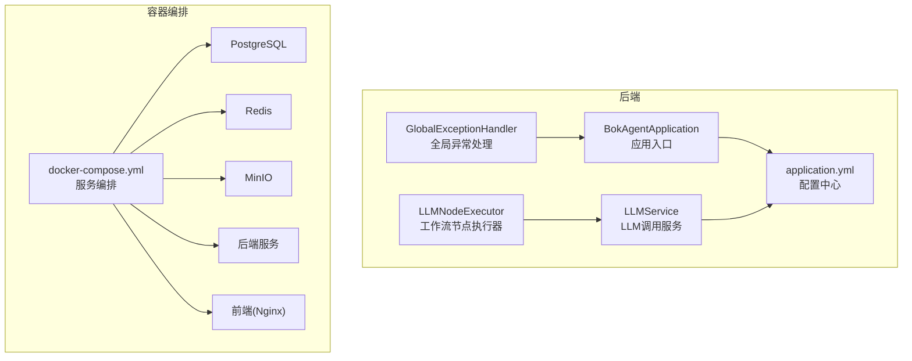
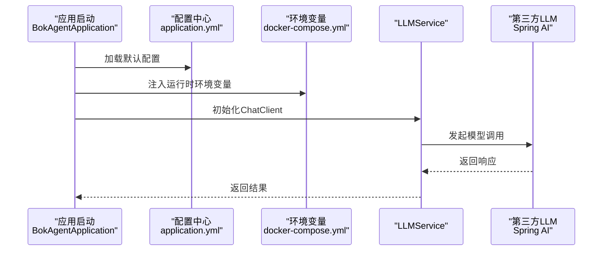
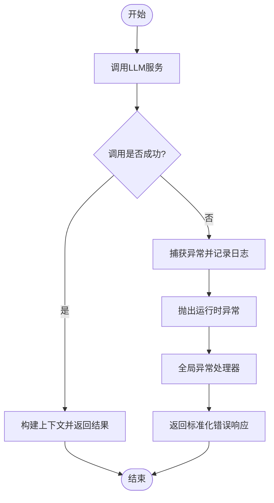
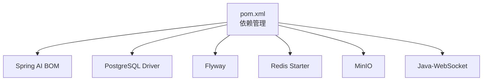

# LLM配置管理

<cite>
**本文引用的文件**
- [application.yml](file://backend/src/main/resources/application.yml)
- [BokAgentApplication.java](file://backend/src/main/java/com/bokagent/BokAgentApplication.java)
- [LLMService.java](file://backend/src/main/java/com/bokagent/service/LLMService.java)
- [LLMNodeExecutor.java](file://backend/src/main/java/com/bokagent/engine/LLMNodeExecutor.java)
- [GlobalExceptionHandler.java](file://backend/src/main/java/com/bokagent/common/GlobalExceptionHandler.java)
- [docker-compose.yml](file://docker/docker-compose.yml)
- [pom.xml](file://backend/pom.xml)
- [start.sh](file://start.sh)
- [QUICKSTART.md](file://QUICKSTART.md)
</cite>

## 目录
1. [简介](#简介)
2. [项目结构](#项目结构)
3. [核心组件](#核心组件)
4. [架构总览](#架构总览)
5. [详细组件分析](#详细组件分析)
6. [依赖分析](#依赖分析)
7. [性能考虑](#性能考虑)
8. [故障排查指南](#故障排查指南)
9. [结论](#结论)
10. [附录](#附录)

## 简介
本文件面向“LLM配置管理”的主题，基于仓库中的实际配置与实现，系统性地阐述以下内容：
- application.yml中LLM相关配置项的设计与作用，涵盖API密钥管理、模型参数配置、连接池设置等
- 环境变量的使用策略，包括敏感信息保护、多环境配置、动态配置更新
- 配置的优先级与覆盖机制，包括默认值设置、环境特定配置、运行时参数调整
- 配置验证与错误处理机制，包括配置校验、异常捕获、降级策略
- 配置管理最佳实践，包括配置模板、安全存储、版本控制、变更管理
- 配置监控与调试方法，包括配置生效验证、性能指标监控、问题排查技巧
- 完整的配置示例与常见场景的解决方案

## 项目结构
本项目采用Spring Boot工程，后端配置集中在resources目录下的application.yml；容器化通过docker-compose统一编排，包含数据库、缓存、对象存储及后端服务；前端通过Nginx提供静态资源与反向代理。

**图表来源**
- [application.yml:1-190](file://backend/src/main/resources/application.yml#L1-L190)
- [docker-compose.yml:1-132](file://docker/docker-compose.yml#L1-L132)

**章节来源**
- [application.yml:1-190](file://backend/src/main/resources/application.yml#L1-L190)
- [docker-compose.yml:1-132](file://docker/docker-compose.yml#L1-L132)

## 核心组件
- 应用入口与默认属性设置：通过应用入口设置默认字符集与应用名，保证系统层面的编码一致性。
- LLM服务：封装ChatClient调用，负责构建完整提示词并进行异常捕获与包装。
- LLM节点执行器：在工作流引擎中作为节点类型“llm”执行，负责调用LLM服务并将结果写入上下文。
- 全局异常处理：统一捕获运行时异常与非法参数异常，返回标准化错误响应。
- 配置中心：application.yml集中管理数据库、缓存、Spring AI（OpenAI/DeepSeek/Qwen）、超时、缓存、日志、Actuator等配置。
- 容器编排：docker-compose统一注入环境变量（如API密钥），并设置时区与语言，保障容器内运行环境一致。

**章节来源**
- [BokAgentApplication.java:1-56](file://backend/src/main/java/com/bokagent/BokAgentApplication.java#L1-L56)
- [LLMService.java:1-67](file://backend/src/main/java/com/bokagent/service/LLMService.java#L1-L67)
- [LLMNodeExecutor.java:1-69](file://backend/src/main/java/com/bokagent/engine/LLMNodeExecutor.java#L1-L69)
- [GlobalExceptionHandler.java:1-37](file://backend/src/main/java/com/bokagent/common/GlobalExceptionHandler.java#L1-L37)
- [application.yml:1-190](file://backend/src/main/resources/application.yml#L1-L190)
- [docker-compose.yml:1-132](file://docker/docker-compose.yml#L1-L132)

## 架构总览
下图展示了LLM配置在系统中的位置与交互路径：应用启动加载配置，容器编排注入环境变量，LLM服务通过ChatClient调用第三方LLM，异常由全局处理器统一处理。

**图表来源**
- [BokAgentApplication.java:21-43](file://backend/src/main/java/com/bokagent/BokAgentApplication.java#L21-L43)
- [application.yml:45-66](file://backend/src/main/resources/application.yml#L45-L66)
- [docker-compose.yml:88-100](file://docker/docker-compose.yml#L88-L100)

## 详细组件分析

### LLM配置项设计与作用
- OpenAI配置
  - API密钥：通过环境变量注入，避免硬编码在代码库中
  - 基础URL：可按需切换至代理或自定义域名
  - 模型参数：chat.options.model指定具体模型
- DeepSeek配置
  - API密钥：通过环境变量注入
  - 基础URL：固定为官方域名
  - 模型参数：chat.options.model指定具体模型
- Qwen（通义千问）配置
  - API密钥：通过环境变量注入
  - 基础URL：固定为兼容模式域名
  - 模型参数：chat.options.model指定具体模型
- 连接池与超时
  - 数据源连接池：HikariCP最大池大小与最小空闲数
  - 缓存连接池：Redis Lettuce连接池参数
  - 超时配置：工具执行、LLM调用、TTS合成、MCP请求、工作流执行等超时阈值
- 日志与监控
  - 日志级别与输出文件路径
  - Actuator暴露健康、信息、指标端点

**章节来源**
- [application.yml:45-66](file://backend/src/main/resources/application.yml#L45-L66)
- [application.yml:22-24](file://backend/src/main/resources/application.yml#L22-L24)
- [application.yml:38-43](file://backend/src/main/resources/application.yml#L38-L43)
- [application.yml:149-155](file://backend/src/main/resources/application.yml#L149-L155)
- [application.yml:164-190](file://backend/src/main/resources/application.yml#L164-L190)

### 环境变量使用策略
- 敏感信息保护
  - API密钥通过环境变量注入，避免提交到版本库
  - 在容器编排中统一注入，减少硬编码风险
- 多环境配置
  - 通过SPRING_PROFILES_ACTIVE切换不同配置文件（如dev、docker）
  - 数据库、缓存、对象存储等外部依赖通过环境变量与容器网络互通
- 动态配置更新
  - application.yml中的占位符支持在运行时被环境变量覆盖
  - 容器启动时注入的环境变量优先于配置文件中的占位符默认值

**章节来源**
- [application.yml:13-14](file://backend/src/main/resources/application.yml#L13-L14)
- [application.yml:47-48](file://backend/src/main/resources/application.yml#L47-L48)
- [application.yml:54-55](file://backend/src/main/resources/application.yml#L54-L55)
- [application.yml:61-62](file://backend/src/main/resources/application.yml#L61-L62)
- [docker-compose.yml:88-100](file://docker/docker-compose.yml#L88-L100)

### 配置优先级与覆盖机制
- 默认值设置
  - application.yml中为各配置项提供默认值（如数据库、Redis、日志等）
  - 应用入口通过setDefaultProperties设置默认字符集与应用名
- 环境特定配置
  - docker-compose中通过environment注入变量，覆盖默认值
  - 支持不同环境（dev、docker）通过SPRING_PROFILES_ACTIVE切换
- 运行时参数调整
  - 通过命令行参数或环境变量覆盖application.yml中的占位符
  - 容器内时区与语言通过TZ、LANG、LC_ALL统一设置

**章节来源**
- [BokAgentApplication.java:26-34](file://backend/src/main/java/com/bokagent/BokAgentApplication.java#L26-L34)
- [application.yml:13-14](file://backend/src/main/resources/application.yml#L13-L14)
- [docker-compose.yml:88-100](file://docker/docker-compose.yml#L88-L100)

### 配置验证与错误处理机制
- 配置校验
  - application.yml集中声明所有配置项，便于审查与审计
  - docker-compose统一注入外部依赖的主机、端口、凭据，降低遗漏风险
- 异常捕获
  - LLMService在调用ChatClient时捕获异常并抛出运行时异常
  - LLMNodeExecutor在执行节点时捕获异常并返回标准化错误结果
  - GlobalExceptionHandler统一处理异常，返回标准错误响应
- 降级策略
  - 当前实现未显式定义降级逻辑，建议在生产环境中增加熔断与降级（例如回退到本地模型或返回预设内容）

**图表来源**
- [LLMService.java:30-44](file://backend/src/main/java/com/bokagent/service/LLMService.java#L30-L44)
- [LLMNodeExecutor.java:50-61](file://backend/src/main/java/com/bokagent/engine/LLMNodeExecutor.java#L50-L61)
- [GlobalExceptionHandler.java:16-35](file://backend/src/main/java/com/bokagent/common/GlobalExceptionHandler.java#L16-L35)

**章节来源**
- [LLMService.java:30-44](file://backend/src/main/java/com/bokagent/service/LLMService.java#L30-L44)
- [LLMNodeExecutor.java:50-61](file://backend/src/main/java/com/bokagent/engine/LLMNodeExecutor.java#L50-L61)
- [GlobalExceptionHandler.java:16-35](file://backend/src/main/java/com/bokagent/common/GlobalExceptionHandler.java#L16-L35)

### 配置管理最佳实践
- 配置模板
  - 使用.env.example作为模板，明确所需环境变量与默认占位值
  - 在启动脚本中自动创建.env文件并提示用户编辑
- 安全存储
  - API密钥通过环境变量注入，不在代码库中保留明文
  - 容器编排中统一管理敏感信息，避免散落各处
- 版本控制
  - application.yml纳入版本控制，记录配置演进
  - docker-compose与.env分离，仅提交模板与说明
- 变更管理
  - 通过SPRING_PROFILES_ACTIVE切换不同环境配置
  - 对关键配置（如超时、连接池）建立变更评审流程

**章节来源**
- [QUICKSTART.md:23-45](file://QUICKSTART.md#L23-L45)
- [start.sh:8-15](file://start.sh#L8-L15)
- [docker-compose.yml:88-100](file://docker/docker-compose.yml#L88-L100)

### 配置监控与调试方法
- 配置生效验证
  - 通过Actuator端点查看健康与指标，确认服务可用
  - 启动脚本中验证数据库编码与中文存储能力
- 性能指标监控
  - application.yml中启用Actuator并暴露指标端点
  - 结合日志级别与输出文件定位性能瓶颈
- 问题排查技巧
  - 使用容器日志定位异常堆栈
  - 在LLM调用前后记录提示词长度与响应时间，辅助定位慢查询

**章节来源**
- [application.yml:181-190](file://backend/src/main/resources/application.yml#L181-L190)
- [start.sh:30-44](file://start.sh#L30-L44)

## 依赖分析
- Spring AI依赖
  - pom.xml中声明了Spring AI的BOM与版本，但starter依赖当前被注释，需等待正式版本发布
- 数据库与迁移
  - PostgreSQL驱动与Flyway用于数据库迁移
- 缓存与对象存储
  - Redis与MinIO分别用于缓存与对象存储
- WebSocket客户端
  - Java-WebSocket用于WebSocket通信

**图表来源**
- [pom.xml:135-144](file://backend/pom.xml#L135-L144)
- [pom.xml:67-96](file://backend/pom.xml#L67-L96)
- [pom.xml:120-125](file://backend/pom.xml#L120-L125)

**章节来源**
- [pom.xml:135-144](file://backend/pom.xml#L135-L144)
- [pom.xml:67-96](file://backend/pom.xml#L67-L96)
- [pom.xml:120-125](file://backend/pom.xml#L120-L125)

## 性能考虑
- 连接池优化
  - HikariCP的最大池大小与最小空闲数应结合并发与资源限制合理配置
  - Redis Lettuce连接池参数需与后端线程池规模匹配
- 超时策略
  - LLM调用超时应根据模型响应时间与业务SLA设定
  - 工作流执行超时需考虑节点数量与链路复杂度
- 缓存策略
  - LLM响应缓存与工具结果缓存可显著降低重复调用成本
  - TTL设置需平衡新鲜度与性能

**章节来源**
- [application.yml:22-24](file://backend/src/main/resources/application.yml#L22-L24)
- [application.yml:38-43](file://backend/src/main/resources/application.yml#L38-L43)
- [application.yml:149-155](file://backend/src/main/resources/application.yml#L149-L155)
- [application.yml:157-162](file://backend/src/main/resources/application.yml#L157-L162)

## 故障排查指南
- 启动失败
  - 检查容器日志，确认数据库、缓存、对象存储服务健康
  - 验证环境变量是否正确注入（API密钥、主机、端口）
- LLM调用失败
  - 查看LLMService日志，确认提示词构建与异常堆栈
  - 核对application.yml中的模型参数与基础URL
- 全局异常
  - 通过GlobalExceptionHandler返回的错误信息定位问题
  - 结合Actuator健康检查与日志文件定位根因

**章节来源**
- [docker-compose.yml:22-26](file://docker/docker-compose.yml#L22-L26)
- [docker-compose.yml:59-63](file://docker/docker-compose.yml#L59-L63)
- [docker-compose.yml:77-81](file://docker/docker-compose.yml#L77-L81)
- [GlobalExceptionHandler.java:16-35](file://backend/src/main/java/com/bokagent/common/GlobalExceptionHandler.java#L16-L35)

## 结论
本项目通过application.yml集中管理LLM相关配置，并结合docker-compose实现环境变量注入与多环境支持。当前实现具备良好的扩展性与安全性，建议在生产环境中补充熔断降级、配置热更新与更完善的监控告警机制，以进一步提升稳定性与可观测性。

## 附录

### 配置示例与常见场景
- 示例一：使用OpenAI模型
  - 在application.yml中配置OpenAI的api-key与base-url
  - 在docker-compose中注入OPENAI_API_KEY
- 示例二：切换到DeepSeek模型
  - 修改chat.options.model为deepseek-chat
  - 确认DEEPSEEK_API_KEY已注入
- 示例三：切换到Qwen模型
  - 修改chat.options.model为qwen-plus
  - 确认QWEN_API_KEY已注入
- 示例四：调整超时与缓存
  - 修改timeout.llm-call与cache.llm-response-ttl
  - 观察日志与Actuator指标评估效果

**章节来源**
- [application.yml:47-48](file://backend/src/main/resources/application.yml#L47-L48)
- [application.yml:54-55](file://backend/src/main/resources/application.yml#L54-L55)
- [application.yml:61-62](file://backend/src/main/resources/application.yml#L61-L62)
- [application.yml:149-155](file://backend/src/main/resources/application.yml#L149-L155)
- [application.yml:157-162](file://backend/src/main/resources/application.yml#L157-L162)
- [docker-compose.yml:94-96](file://docker/docker-compose.yml#L94-L96)