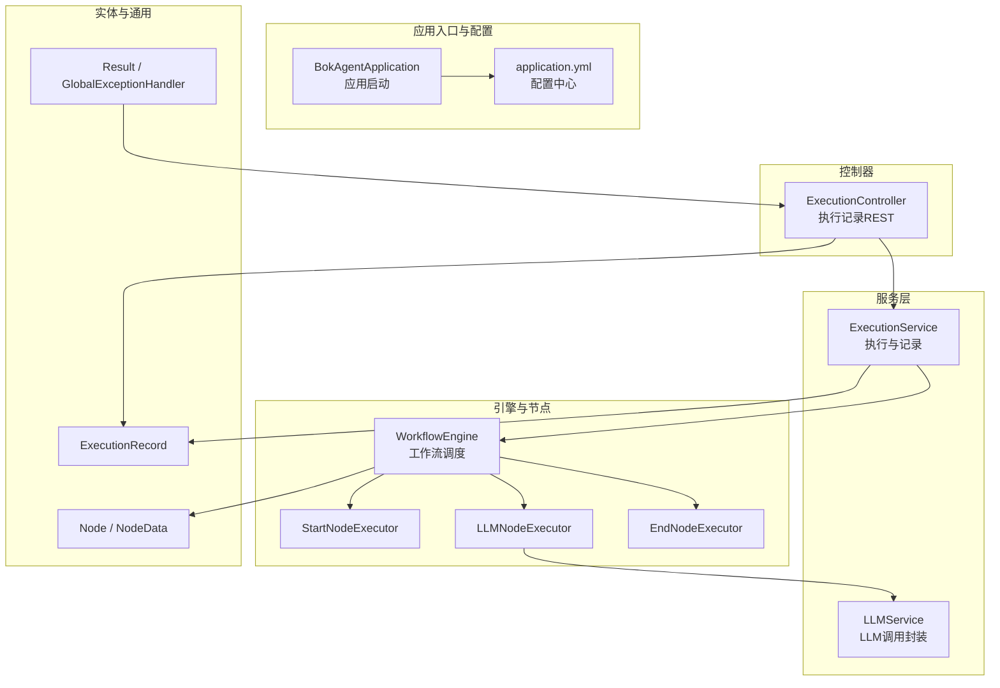
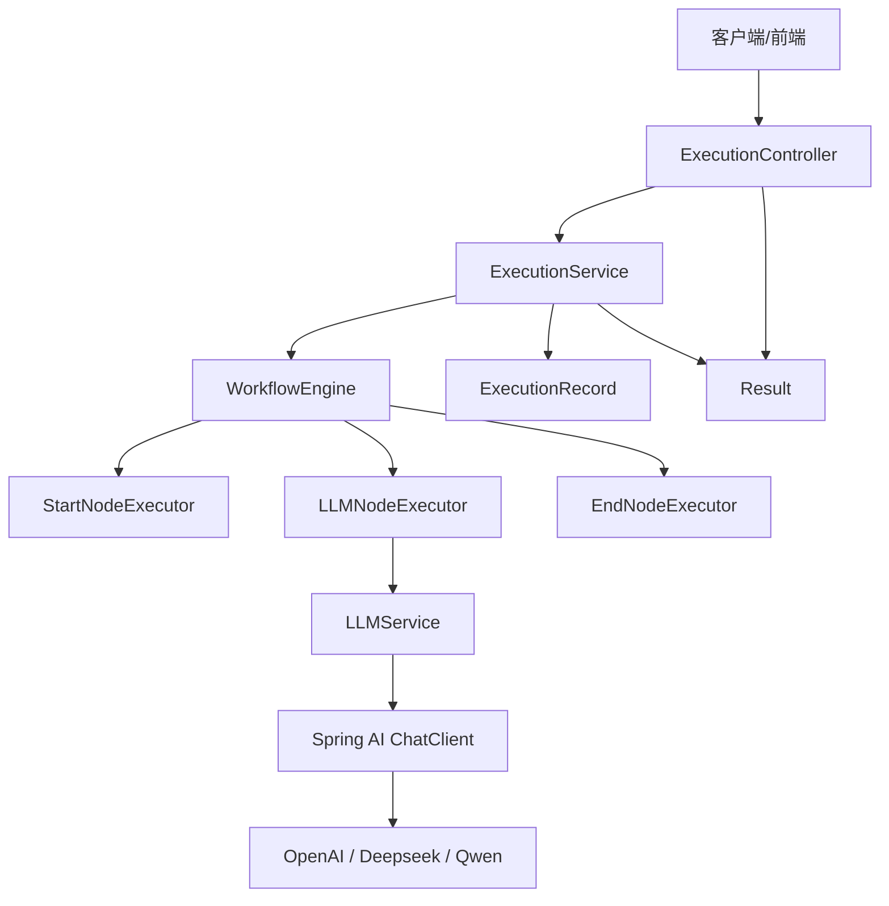
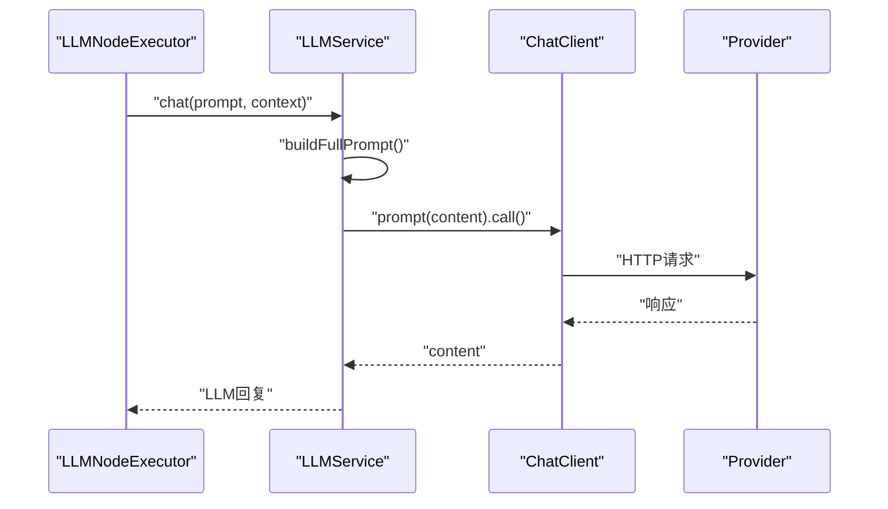
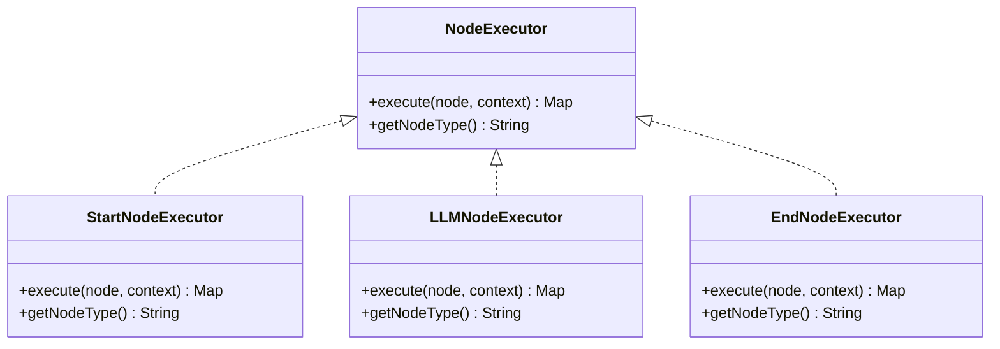
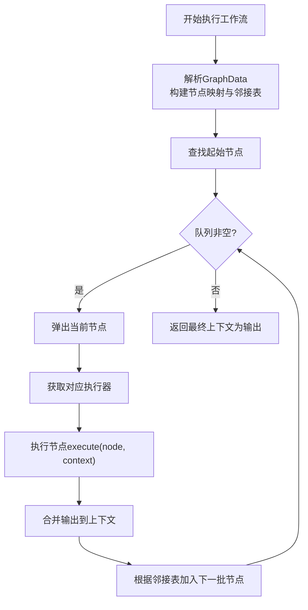
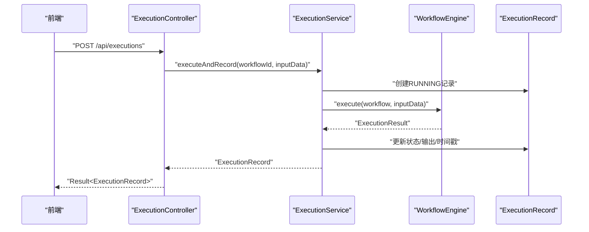
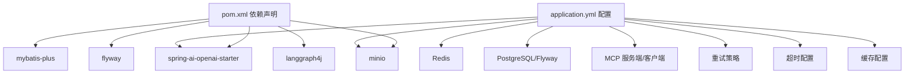

# 多LLM集成

<cite>
**本文引用的文件**
- [BokAgentApplication.java](file://backend/src/main/java/com/bokagent/BokAgentApplication.java)
- [application.yml](file://backend/src/main/resources/application.yml)
- [LLMService.java](file://backend/src/main/java/com/bokagent/service/LLMService.java)
- [NodeExecutor.java](file://backend/src/main/java/com/bokagent/engine/NodeExecutor.java)
- [LLMNodeExecutor.java](file://backend/src/main/java/com/bokagent/engine/LLMNodeExecutor.java)
- [StartNodeExecutor.java](file://backend/src/main/java/com/bokagent/engine/StartNodeExecutor.java)
- [EndNodeExecutor.java](file://backend/src/main/java/com/bokagent/engine/EndNodeExecutor.java)
- [WorkflowEngine.java](file://backend/src/main/java/com/bokagent/engine/WorkflowEngine.java)
- [ExecutionResult.java](file://backend/src/main/java/com/bokagent/engine/ExecutionResult.java)
- [ExecutionService.java](file://backend/src/main/java/com/bokagent/service/ExecutionService.java)
- [ExecutionController.java](file://backend/src/main/java/com/bokagent/controller/ExecutionController.java)
- [ExecutionRecord.java](file://backend/src/main/java/com/bokagent/entity/ExecutionRecord.java)
- [Node.java](file://backend/src/main/java/com/bokagent/entity/Node.java)
- [NodeData.java](file://backend/src/main/java/com/bokagent/entity/NodeData.java)
- [Result.java](file://backend/src/main/java/com/bokagent/common/Result.java)
- [GlobalExceptionHandler.java](file://backend/src/main/java/com/bokagent/common/GlobalExceptionHandler.java)
- [pom.xml](file://backend/pom.xml)
</cite>

## 目录
1. [简介](#简介)
2. [项目结构](#项目结构)
3. [核心组件](#核心组件)
4. [架构总览](#架构总览)
5. [详细组件分析](#详细组件分析)
6. [依赖分析](#依赖分析)
7. [性能考虑](#性能考虑)
8. [故障排查指南](#故障排查指南)
9. [结论](#结论)
10. [附录](#附录)

## 简介
本文件面向BokAgent多LLM集成系统，系统基于Spring Boot与Spring AI，提供工作流编排能力，支持在工作流中插入LLM节点，并通过统一的LLM服务调用不同厂商的大模型（OpenAI、Deepseek、通义千问）。系统采用“节点执行器”抽象层隔离不同节点类型，LLM服务通过Spring AI ChatClient统一封装底层调用，具备统一接口、参数适配与错误处理能力。同时，系统内置超时、重试、缓存、日志与统一响应等基础设施，便于扩展新的LLM提供商与工具链。

## 项目结构
后端采用标准Spring Boot分层结构，核心模块如下：
- 应用入口与配置：BokAgentApplication、application.yml
- 控制器：ExecutionController（执行记录REST接口）
- 业务服务：ExecutionService（工作流执行与记录管理）、LLMService（LLM调用封装）
- 引擎与节点：WorkflowEngine（工作流调度）、StartNodeExecutor/LLMNodeExecutor/EndNodeExecutor（节点执行器）
- 实体与通用：ExecutionRecord（执行记录）、Node/NodeData（工作流节点）、Result/GlobalExceptionHandler（统一响应与异常）

图表来源
- [BokAgentApplication.java:1-56](file://backend/src/main/java/com/bokagent/BokAgentApplication.java#L1-L56)
- [application.yml:1-182](file://backend/src/main/resources/application.yml#L1-L182)
- [ExecutionController.java:1-81](file://backend/src/main/java/com/bokagent/controller/ExecutionController.java#L1-L81)
- [ExecutionService.java:1-110](file://backend/src/main/java/com/bokagent/service/ExecutionService.java#L1-L110)
- [WorkflowEngine.java:1-171](file://backend/src/main/java/com/bokagent/engine/WorkflowEngine.java#L1-L171)
- [LLMNodeExecutor.java:1-69](file://backend/src/main/java/com/bokagent/engine/LLMNodeExecutor.java#L1-L69)
- [LLMService.java:1-67](file://backend/src/main/java/com/bokagent/service/LLMService.java#L1-L67)
- [ExecutionRecord.java:1-40](file://backend/src/main/java/com/bokagent/entity/ExecutionRecord.java#L1-L40)
- [Node.java:1-15](file://backend/src/main/java/com/bokagent/entity/Node.java#L1-L15)
- [NodeData.java:1-15](file://backend/src/main/java/com/bokagent/entity/NodeData.java#L1-L15)
- [Result.java:1-42](file://backend/src/main/java/com/bokagent/common/Result.java#L1-L42)
- [GlobalExceptionHandler.java:1-37](file://backend/src/main/java/com/bokagent/common/GlobalExceptionHandler.java#L1-L37)

章节来源
- [BokAgentApplication.java:1-56](file://backend/src/main/java/com/bokagent/BokAgentApplication.java#L1-L56)
- [application.yml:1-182](file://backend/src/main/resources/application.yml#L1-L182)

## 核心组件
- LLM服务抽象层：LLMService通过Spring AI ChatClient统一调用，屏蔽不同提供商差异；支持构建完整提示词（含上下文）与错误处理。
- 节点执行器抽象层：NodeExecutor定义统一接口，具体实现包括StartNodeExecutor、LLMNodeExecutor、EndNodeExecutor，负责节点级执行与上下文传递。
- 工作流引擎：WorkflowEngine负责解析工作流图、拓扑排序执行、上下文传播与结果聚合。
- 执行服务与控制器：ExecutionService协调工作流执行与记录持久化；ExecutionController提供执行记录的REST接口。
- 统一响应与异常：Result封装统一返回格式；GlobalExceptionHandler集中处理异常并返回标准错误响应。
- 配置与依赖：application.yml集中管理Spring AI多提供商配置、超时、重试、缓存、日志与Actuator等；pom.xml声明Spring AI OpenAI Starter等依赖。

章节来源
- [LLMService.java:1-67](file://backend/src/main/java/com/bokagent/service/LLMService.java#L1-L67)
- [NodeExecutor.java:1-24](file://backend/src/main/java/com/bokagent/engine/NodeExecutor.java#L1-L24)
- [LLMNodeExecutor.java:1-69](file://backend/src/main/java/com/bokagent/engine/LLMNodeExecutor.java#L1-L69)
- [WorkflowEngine.java:1-171](file://backend/src/main/java/com/bokagent/engine/WorkflowEngine.java#L1-L171)
- [ExecutionService.java:1-110](file://backend/src/main/java/com/bokagent/service/ExecutionService.java#L1-L110)
- [ExecutionController.java:1-81](file://backend/src/main/java/com/bokagent/controller/ExecutionController.java#L1-L81)
- [Result.java:1-42](file://backend/src/main/java/com/bokagent/common/Result.java#L1-L42)
- [GlobalExceptionHandler.java:1-37](file://backend/src/main/java/com/bokagent/common/GlobalExceptionHandler.java#L1-L37)
- [application.yml:1-182](file://backend/src/main/resources/application.yml#L1-L182)
- [pom.xml:1-170](file://backend/pom.xml#L1-L170)

## 架构总览
系统采用“控制器-服务-引擎-节点执行器-LLM服务”的分层架构，LLM调用通过Spring AI抽象，支持多提供商配置与参数适配。执行记录贯穿整个流程，便于追踪与审计。

图表来源
- [ExecutionController.java:1-81](file://backend/src/main/java/com/bokagent/controller/ExecutionController.java#L1-L81)
- [ExecutionService.java:1-110](file://backend/src/main/java/com/bokagent/service/ExecutionService.java#L1-L110)
- [WorkflowEngine.java:1-171](file://backend/src/main/java/com/bokagent/engine/WorkflowEngine.java#L1-L171)
- [LLMNodeExecutor.java:1-69](file://backend/src/main/java/com/bokagent/engine/LLMNodeExecutor.java#L1-L69)
- [LLMService.java:1-67](file://backend/src/main/java/com/bokagent/service/LLMService.java#L1-L67)
- [ExecutionRecord.java:1-40](file://backend/src/main/java/com/bokagent/entity/ExecutionRecord.java#L1-L40)
- [Result.java:1-42](file://backend/src/main/java/com/bokagent/common/Result.java#L1-L42)

## 详细组件分析

### LLM服务抽象层（LLMService）
- 统一接口：chat(prompt, context)接收提示词与上下文，内部拼接完整提示词后调用ChatClient。
- 参数适配：通过application.yml中的spring.ai.*配置，自动适配不同提供商的模型参数与基础URL。
- 错误处理：捕获异常并抛出运行时异常，便于上层统一处理。
- 性能与日志：记录提示词长度与LLM回复长度，便于监控与成本估算。

图表来源
- [LLMNodeExecutor.java:22-48](file://backend/src/main/java/com/bokagent/engine/LLMNodeExecutor.java#L22-L48)
- [LLMService.java:27-44](file://backend/src/main/java/com/bokagent/service/LLMService.java#L27-L44)

章节来源
- [LLMService.java:1-67](file://backend/src/main/java/com/bokagent/service/LLMService.java#L1-L67)
- [application.yml:45-67](file://backend/src/main/resources/application.yml#L45-L67)

### 节点执行器抽象层（NodeExecutor）
- 接口职责：execute(node, context)执行节点并将结果写入上下文；getNodeType()标识节点类型。
- 具体实现：
  - StartNodeExecutor：初始化上下文，透传输入数据。
  - LLMNodeExecutor：调用LLMService，合并上下文与LLM输出。
  - EndNodeExecutor：汇总最终输出，标记完成状态。
- 执行顺序：由WorkflowEngine基于拓扑排序驱动，上下文在节点间传递。

图表来源
- [NodeExecutor.java:1-24](file://backend/src/main/java/com/bokagent/engine/NodeExecutor.java#L1-L24)
- [StartNodeExecutor.java:1-41](file://backend/src/main/java/com/bokagent/engine/StartNodeExecutor.java#L1-L41)
- [LLMNodeExecutor.java:1-69](file://backend/src/main/java/com/bokagent/engine/LLMNodeExecutor.java#L1-L69)
- [EndNodeExecutor.java:1-41](file://backend/src/main/java/com/bokagent/engine/EndNodeExecutor.java#L1-L41)

章节来源
- [NodeExecutor.java:1-24](file://backend/src/main/java/com/bokagent/engine/NodeExecutor.java#L1-L24)
- [StartNodeExecutor.java:1-41](file://backend/src/main/java/com/bokagent/engine/StartNodeExecutor.java#L1-L41)
- [LLMNodeExecutor.java:1-69](file://backend/src/main/java/com/bokagent/engine/LLMNodeExecutor.java#L1-L69)
- [EndNodeExecutor.java:1-41](file://backend/src/main/java/com/bokagent/engine/EndNodeExecutor.java#L1-L41)

### 工作流引擎（WorkflowEngine）
- 图解析：从Workflow提取GraphData，构建节点映射与邻接表。
- 执行策略：拓扑排序遍历节点，按边关系推进；上下文在节点间传递。
- 结果聚合：将每个节点输出合并至上下文，最终输出作为ExecutionResult返回。

图表来源
- [WorkflowEngine.java:47-171](file://backend/src/main/java/com/bokagent/engine/WorkflowEngine.java#L47-L171)

章节来源
- [WorkflowEngine.java:1-171](file://backend/src/main/java/com/bokagent/engine/WorkflowEngine.java#L1-L171)
- [ExecutionResult.java:1-32](file://backend/src/main/java/com/bokagent/engine/ExecutionResult.java#L1-L32)

### 执行服务与控制器（ExecutionService/ExecutionController）
- 执行服务：创建ExecutionRecord，调用WorkflowEngine执行，更新执行状态与结果。
- 控制器：提供执行记录的增删改查接口，统一返回Result包装。

图表来源
- [ExecutionController.java:25-80](file://backend/src/main/java/com/bokagent/controller/ExecutionController.java#L25-L80)
- [ExecutionService.java:38-89](file://backend/src/main/java/com/bokagent/service/ExecutionService.java#L38-L89)
- [ExecutionRecord.java:1-40](file://backend/src/main/java/com/bokagent/entity/ExecutionRecord.java#L1-L40)

章节来源
- [ExecutionService.java:1-110](file://backend/src/main/java/com/bokagent/service/ExecutionService.java#L1-L110)
- [ExecutionController.java:1-81](file://backend/src/main/java/com/bokagent/controller/ExecutionController.java#L1-L81)
- [ExecutionRecord.java:1-40](file://backend/src/main/java/com/bokagent/entity/ExecutionRecord.java#L1-L40)

### 统一响应与异常处理（Result/GlobalExceptionHandler）
- Result：提供success/error静态方法，统一返回结构。
- GlobalExceptionHandler：集中捕获异常，返回标准错误码与消息。

章节来源
- [Result.java:1-42](file://backend/src/main/java/com/bokagent/common/Result.java#L1-L42)
- [GlobalExceptionHandler.java:1-37](file://backend/src/main/java/com/bokagent/common/GlobalExceptionHandler.java#L1-L37)

## 依赖分析
- Spring AI：通过spring-ai-openai-spring-boot-starter引入OpenAI支持；Deepseek与通义千问通过spring.ai.*配置启用。
- 数据库与迁移：PostgreSQL + Flyway；MyBatis-Plus + 自定义JsonbTypeHandler。
- 缓存与异步：Redis配置；线程池配置用于异步任务。
- MCP协议：MCP服务端与客户端开关、传输方式（SSE/WebSocket）配置。
- 重试与超时：全局重试策略与各类超时阈值配置。

图表来源
- [pom.xml:29-128](file://backend/pom.xml#L29-L128)
- [application.yml:9-182](file://backend/src/main/resources/application.yml#L9-L182)

章节来源
- [pom.xml:1-170](file://backend/pom.xml#L1-L170)
- [application.yml:1-182](file://backend/src/main/resources/application.yml#L1-L182)

## 性能考虑
- 并发与线程池：application.yml配置了虚拟线程池，适用于轻量异步任务；对于长耗时工作流建议结合@Async与执行ID轮询或WebSocket推送。
- 缓存：开启缓存并设置LLM响应缓存TTL，减少重复调用；工具结果与默认缓存TTL可按需调整。
- 超时与重试：为LLM调用、工具执行、MCP请求分别设置超时；默认重试策略包含最大尝试次数与指数退避。
- 日志与监控：启用Actuator暴露指标，结合日志级别与自定义字段定位性能瓶颈。

章节来源
- [application.yml:81-182](file://backend/src/main/resources/application.yml#L81-L182)

## 故障排查指南
- LLM调用失败：检查OPENAI_API_KEY、BASE_URL与模型名称配置；查看LLMService日志与异常堆栈。
- 工作流执行异常：确认Workflow图是否存在起始节点、边连接是否形成环；查看WorkflowEngine日志。
- 执行记录状态：通过ExecutionController查询执行记录，核对状态与错误信息。
- 统一异常：GlobalExceptionHandler会将异常映射为标准Result错误响应，便于前端展示。

章节来源
- [LLMService.java:30-44](file://backend/src/main/java/com/bokagent/service/LLMService.java#L30-L44)
- [WorkflowEngine.java:52-82](file://backend/src/main/java/com/bokagent/engine/WorkflowEngine.java#L52-L82)
- [ExecutionController.java:25-80](file://backend/src/main/java/com/bokagent/controller/ExecutionController.java#L25-L80)
- [GlobalExceptionHandler.java:16-35](file://backend/src/main/java/com/bokagent/common/GlobalExceptionHandler.java#L16-L35)

## 结论
BokAgent通过Spring AI实现了多LLM提供商的统一接入，结合节点执行器抽象与工作流引擎，提供了可扩展、可观测、可维护的多LLM集成方案。通过配置中心集中管理提供商参数、超时与重试策略，配合执行记录与统一响应，满足生产环境对稳定性与可追溯性的要求。后续可在现有基础上扩展Function Calling、MCP协议与更丰富的工具集。

## 附录

### 模型配置管理（API密钥、参数、成本控制）
- API密钥与基础URL：通过spring.ai.*配置项管理各提供商密钥与基础地址。
- 模型参数：chat.options.model等参数在配置中集中定义，便于切换与成本控制。
- 成本控制策略：可通过限制模型参数（如上下文长度、采样温度）与缓存命中率降低调用成本。

章节来源
- [application.yml:45-67](file://backend/src/main/resources/application.yml#L45-L67)

### Function Calling实现要点（规划）
- 工具注册：在LLMService或专用工具管理器中注册可用工具，定义参数Schema。
- 参数传递：将工具参数序列化为JSON，随提示词一起发送给LLM。
- 结果处理：解析LLM返回的函数调用指令，调用对应工具并回传结果，再由LLM综合生成最终回复。

（本节为概念性指导，不直接对应现有代码文件）

### 安全考虑
- API密钥保护：通过环境变量注入，避免硬编码；在CI/CD中使用机密存储。
- 请求审计：记录关键操作（执行记录创建/更新、LLM调用摘要），保留必要的审计日志。
- 速率限制：结合提供商限流策略与应用侧限流（令牌桶/滑动窗口）控制QPS。

（本节为概念性指导，不直接对应现有代码文件）

### 添加新LLM提供商的扩展指南
- 步骤
  1) 在application.yml中新增spring.ai.{provider}配置块，填写api-key与base-url及模型选项。
  2) 如需特殊参数适配，在LLMService中扩展提示词构建逻辑或参数映射。
  3) 若需要特定工具或协议支持，参考MCP配置与工具注册流程进行扩展。
- 最佳实践
  - 保持统一接口不变，仅在配置与参数适配处扩展。
  - 为新提供商设定独立的超时与重试策略。
  - 通过缓存与成本控制策略平衡性能与费用。

章节来源
- [application.yml:45-67](file://backend/src/main/resources/application.yml#L45-L67)
- [LLMService.java:49-65](file://backend/src/main/java/com/bokagent/service/LLMService.java#L49-L65)