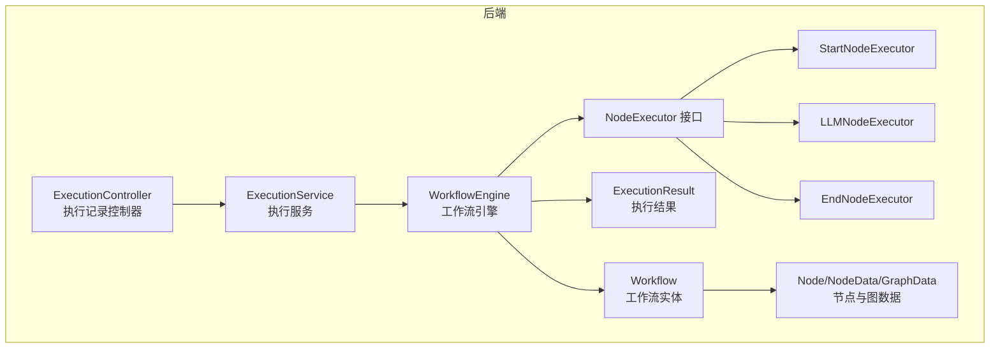
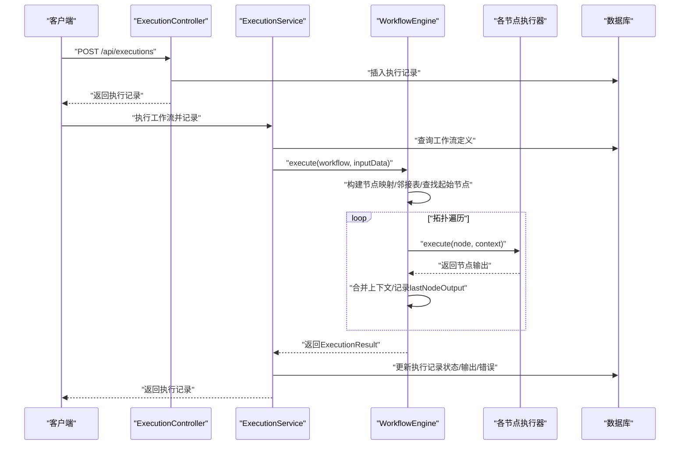
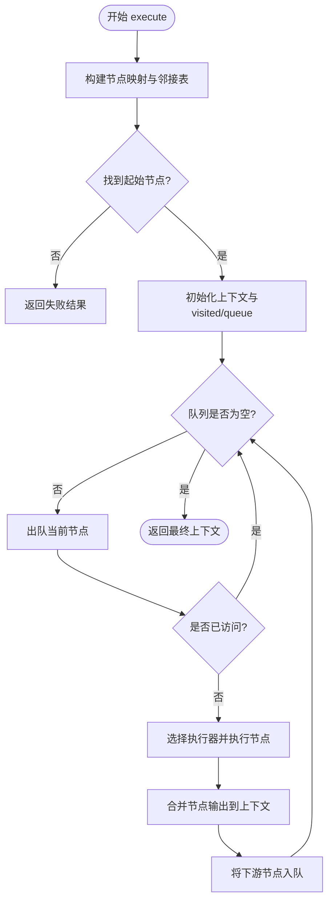
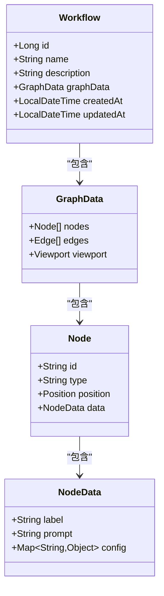
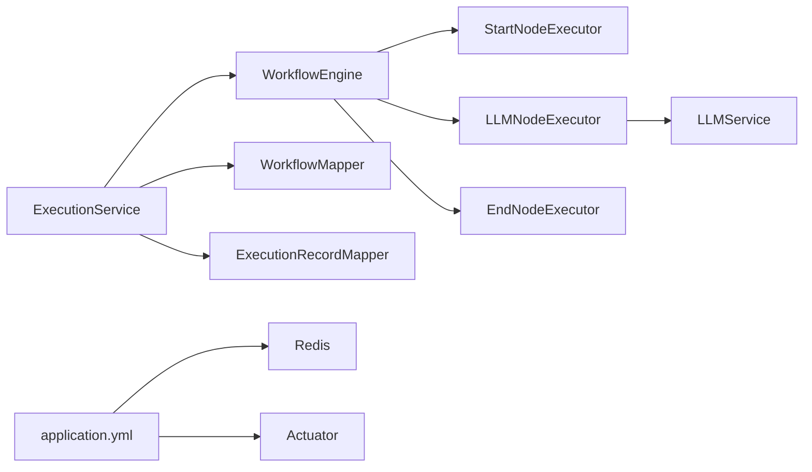

# 工作流引擎

<cite>
**本文引用的文件**
- [WorkflowEngine.java](file://backend/src/main/java/com/bokagent/engine/WorkflowEngine.java)
- [NodeExecutor.java](file://backend/src/main/java/com/bokagent/engine/NodeExecutor.java)
- [StartNodeExecutor.java](file://backend/src/main/java/com/bokagent/engine/StartNodeExecutor.java)
- [LLMNodeExecutor.java](file://backend/src/main/java/com/bokagent/engine/LLMNodeExecutor.java)
- [EndNodeExecutor.java](file://backend/src/main/java/com/bokagent/engine/EndNodeExecutor.java)
- [ExecutionResult.java](file://backend/src/main/java/com/bokagent/engine/ExecutionResult.java)
- [ExecutionService.java](file://backend/src/main/java/com/bokagent/service/ExecutionService.java)
- [ExecutionController.java](file://backend/src/main/java/com/bokagent/controller/ExecutionController.java)
- [Workflow.java](file://backend/src/main/java/com/bokagent/entity/Workflow.java)
- [Node.java](file://backend/src/main/java/com/bokagent/entity/Node.java)
- [NodeData.java](file://backend/src/main/java/com/bokagent/entity/NodeData.java)
- [GraphData.java](file://backend/src/main/java/com/bokagent/entity/GraphData.java)
- [application.yml](file://backend/src/main/resources/application.yml)
- [pom.xml](file://backend/pom.xml)
- [README.md](file://README.md)
</cite>

## 目录
1. [简介](#简介)
2. [项目结构](#项目结构)
3. [核心组件](#核心组件)
4. [架构总览](#架构总览)
5. [详细组件分析](#详细组件分析)
6. [依赖分析](#依赖分析)
7. [性能考虑](#性能考虑)
8. [故障排查指南](#故障排查指南)
9. [结论](#结论)
10. [附录](#附录)

## 简介
本技术文档围绕 BokAgent 工作流引擎展开，系统性阐述其架构设计与实现细节，重点覆盖以下方面：
- 引擎调度机制与节点执行流程
- 状态管理策略与执行结果处理
- StartNodeExecutor、LLMNodeExecutor、EndNodeExecutor 的具体逻辑
- 从工作流启动到完成的完整执行流程
- 性能优化策略（并发、缓存、资源管理）
- 扩展点设计与自定义节点类型接入方式
- 面向系统开发者的实现细节与扩展指南

## 项目结构
后端采用 Spring Boot 3.5 + MyBatis-Plus + Spring AI 的技术栈，工作流引擎位于 engine 包中，核心类包括 WorkflowEngine、NodeExecutor 接口及若干具体执行器；服务层通过 ExecutionService 协调执行与持久化；控制器层提供执行记录的 REST 接口。

**图表来源**
- [WorkflowEngine.java:1-169](file://backend/src/main/java/com/bokagent/engine/WorkflowEngine.java#L1-L169)
- [NodeExecutor.java:1-24](file://backend/src/main/java/com/bokagent/engine/NodeExecutor.java#L1-L24)
- [StartNodeExecutor.java:1-41](file://backend/src/main/java/com/bokagent/engine/StartNodeExecutor.java#L1-L41)
- [LLMNodeExecutor.java:1-69](file://backend/src/main/java/com/bokagent/engine/LLMNodeExecutor.java#L1-L69)
- [EndNodeExecutor.java:1-41](file://backend/src/main/java/com/bokagent/engine/EndNodeExecutor.java#L1-L41)
- [ExecutionResult.java:1-32](file://backend/src/main/java/com/bokagent/engine/ExecutionResult.java#L1-L32)
- [ExecutionService.java:1-110](file://backend/src/main/java/com/bokagent/service/ExecutionService.java#L1-L110)
- [ExecutionController.java:1-81](file://backend/src/main/java/com/bokagent/controller/ExecutionController.java#L1-L81)
- [Workflow.java:1-32](file://backend/src/main/java/com/bokagent/entity/Workflow.java#L1-L32)
- [Node.java:1-15](file://backend/src/main/java/com/bokagent/entity/Node.java#L1-L15)
- [NodeData.java:1-15](file://backend/src/main/java/com/bokagent/entity/NodeData.java#L1-L15)
- [GraphData.java:1-15](file://backend/src/main/java/com/bokagent/entity/GraphData.java#L1-L15)

**章节来源**
- [README.md:1-106](file://README.md#L1-L106)
- [pom.xml:1-170](file://backend/pom.xml#L1-L170)
- [application.yml:1-182](file://backend/src/main/resources/application.yml#L1-L182)

## 核心组件
- 工作流引擎 WorkflowEngine：负责解析工作流图、构建执行图、拓扑顺序调度节点、聚合上下文与结果。
- 节点执行器接口 NodeExecutor：统一节点执行契约，定义 execute 与 getNodeType。
- 具体执行器：
  - StartNodeExecutor：初始化上下文，注入输入数据，标记开始状态。
  - LLMNodeExecutor：读取节点提示词，调用 LLM 服务，封装输出与错误。
  - EndNodeExecutor：收尾节点，输出最终上下文。
- 执行结果 ExecutionResult：封装成功/失败、输出、错误信息与执行耗时。
- 执行服务 ExecutionService：协调执行与持久化，维护执行记录。
- 控制器 ExecutionController：提供执行记录的查询与更新接口。

**章节来源**
- [WorkflowEngine.java:14-169](file://backend/src/main/java/com/bokagent/engine/WorkflowEngine.java#L14-L169)
- [NodeExecutor.java:6-24](file://backend/src/main/java/com/bokagent/engine/NodeExecutor.java#L6-L24)
- [StartNodeExecutor.java:10-41](file://backend/src/main/java/com/bokagent/engine/StartNodeExecutor.java#L10-L41)
- [LLMNodeExecutor.java:12-69](file://backend/src/main/java/com/bokagent/engine/LLMNodeExecutor.java#L12-L69)
- [EndNodeExecutor.java:10-41](file://backend/src/main/java/com/bokagent/engine/EndNodeExecutor.java#L10-L41)
- [ExecutionResult.java:6-32](file://backend/src/main/java/com/bokagent/engine/ExecutionResult.java#L6-L32)
- [ExecutionService.java:16-110](file://backend/src/main/java/com/bokagent/service/ExecutionService.java#L16-L110)
- [ExecutionController.java:13-81](file://backend/src/main/java/com/bokagent/controller/ExecutionController.java#L13-L81)

## 架构总览
工作流引擎采用“图遍历 + 上下文传递”的执行模式。引擎在启动时注册标准节点类型，并依据图的边关系进行广度优先遍历，将前序节点的输出作为上下文传入后续节点，最终汇聚为最终输出。

**图表来源**
- [ExecutionController.java:52-80](file://backend/src/main/java/com/bokagent/controller/ExecutionController.java#L52-L80)
- [ExecutionService.java:38-89](file://backend/src/main/java/com/bokagent/service/ExecutionService.java#L38-L89)
- [WorkflowEngine.java:45-167](file://backend/src/main/java/com/bokagent/engine/WorkflowEngine.java#L45-L167)
- [StartNodeExecutor.java:17-34](file://backend/src/main/java/com/bokagent/engine/StartNodeExecutor.java#L17-L34)
- [LLMNodeExecutor.java:22-62](file://backend/src/main/java/com/bokagent/engine/LLMNodeExecutor.java#L22-L62)
- [EndNodeExecutor.java:17-34](file://backend/src/main/java/com/bokagent/engine/EndNodeExecutor.java#L17-L34)

## 详细组件分析

### 工作流引擎 WorkflowEngine
- 职责
  - 解析工作流图数据，构建节点映射与邻接表
  - 查找起始节点（类型为 start）
  - 使用队列进行广度优先遍历，按拓扑顺序执行节点
  - 维护上下文（context），将每个节点输出合并到上下文中
  - 记录执行耗时并封装为 ExecutionResult
- 关键流程
  - 图构建：将节点列表转为 Map，边列表转为邻接表
  - 起始节点定位：过滤 type=start 的节点
  - 执行循环：队列入队起始节点，出队执行，将下游节点入队
  - 上下文更新：将节点输出合并到 context，并记录 lastNodeOutput
- 错误处理
  - 对空图、缺失节点、未知执行器等情况返回失败 ExecutionResult
  - 捕获执行异常并记录日志

**图表来源**
- [WorkflowEngine.java:45-167](file://backend/src/main/java/com/bokagent/engine/WorkflowEngine.java#L45-L167)

**章节来源**
- [WorkflowEngine.java:14-169](file://backend/src/main/java/com/bokagent/engine/WorkflowEngine.java#L14-L169)

### 节点执行器接口 NodeExecutor
- 统一契约
  - execute(Node, Map<String,Object>)：执行节点并返回输出映射
  - getNodeType()：返回节点类型字符串，用于引擎注册与分发
- 设计要点
  - 通过类型字符串与执行器映射解耦
  - 输出映射作为上下文传递给后续节点

**章节来源**
- [NodeExecutor.java:6-24](file://backend/src/main/java/com/bokagent/engine/NodeExecutor.java#L6-L24)

### StartNodeExecutor
- 行为
  - 初始化节点标识、类型、状态与时间戳
  - 将输入上下文合并到输出中，便于后续节点使用
- 输出字段
  - 包含 nodeId、nodeType、status、timestamp
  - 可选地携带输入上下文键值对

**章节来源**
- [StartNodeExecutor.java:10-41](file://backend/src/main/java/com/bokagent/engine/StartNodeExecutor.java#L10-L41)

### LLMNodeExecutor
- 行为
  - 从节点数据中读取提示词，若为空则使用默认提示
  - 调用 LLM 服务生成回复
  - 成功时返回包含 output、状态、时间戳与上下文的映射
  - 失败时返回包含错误信息的状态映射
- 输出字段
  - 包含 nodeId、nodeType、status、output、timestamp
  - 同时保留上下文键值对与 llmResponse
- 错误处理
  - 捕获异常并返回失败状态映射，不中断整体执行

**章节来源**
- [LLMNodeExecutor.java:12-69](file://backend/src/main/java/com/bokagent/engine/LLMNodeExecutor.java#L12-L69)

### EndNodeExecutor
- 行为
  - 标记结束状态，记录时间戳
  - 将最终上下文作为 finalOutput 返回
- 输出字段
  - 包含 nodeId、nodeType、status、timestamp、finalOutput

**章节来源**
- [EndNodeExecutor.java:10-41](file://backend/src/main/java/com/bokagent/engine/EndNodeExecutor.java#L10-L41)

### 执行结果 ExecutionResult
- 字段
  - success：布尔值，表示执行是否成功
  - output：最终输出映射
  - error：错误信息
  - executionTime：执行耗时（毫秒）
- 工厂方法
  - success(output, executionTime)
  - failure(error, executionTime)

**章节来源**
- [ExecutionResult.java:6-32](file://backend/src/main/java/com/bokagent/engine/ExecutionResult.java#L6-L32)

### 执行服务 ExecutionService
- 职责
  - 查询工作流定义
  - 创建执行记录（状态 RUNNING）
  - 调用引擎执行工作流，更新执行记录状态、输出或错误
  - 记录结束时间
- 异常处理
  - 捕获执行异常，将执行记录标记为 FAILED 并返回包装后的异常

**章节来源**
- [ExecutionService.java:16-110](file://backend/src/main/java/com/bokagent/service/ExecutionService.java#L16-L110)

### 执行记录控制器 ExecutionController
- 提供 REST 接口
  - 列表查询：按工作流 ID 查询执行记录
  - 详情查询：按执行记录 ID 查询
  - 创建执行记录：设置初始状态 RUNNING
  - 更新执行记录：当状态为 SUCCESS 或 FAILED 时自动补全结束时间

**章节来源**
- [ExecutionController.java:13-81](file://backend/src/main/java/com/bokagent/controller/ExecutionController.java#L13-L81)

### 数据模型
- Workflow：工作流定义，包含名称、描述与图数据（GraphData）
- GraphData：包含节点列表、边列表与视口信息
- Node：节点标识、类型、位置与节点数据
- NodeData：节点标签、提示词与配置映射

**图表来源**
- [Workflow.java:11-32](file://backend/src/main/java/com/bokagent/entity/Workflow.java#L11-L32)
- [GraphData.java:6-15](file://backend/src/main/java/com/bokagent/entity/GraphData.java#L6-L15)
- [Node.java:5-15](file://backend/src/main/java/com/bokagent/entity/Node.java#L5-L15)
- [NodeData.java:6-15](file://backend/src/main/java/com/bokagent/entity/NodeData.java#L6-L15)

## 依赖分析
- 引擎与执行器
  - WorkflowEngine 通过构造函数注册标准执行器（start、llm、end）
  - NodeExecutor 为接口，具体实现由 Spring 容器注入
- 服务与持久化
  - ExecutionService 依赖 WorkflowEngine、WorkflowMapper、ExecutionRecordMapper
  - 执行记录状态驱动数据库写入
- 外部依赖
  - Spring AI：提供 LLM 服务能力（LLMNodeExecutor 依赖）
  - MyBatis-Plus：数据库访问
  - Redis：缓存（配置启用）
  - Actuator：监控指标

**图表来源**
- [WorkflowEngine.java:30-37](file://backend/src/main/java/com/bokagent/engine/WorkflowEngine.java#L30-L37)
- [LLMNodeExecutor.java:19-20](file://backend/src/main/java/com/bokagent/engine/LLMNodeExecutor.java#L19-L20)
- [ExecutionService.java:23-30](file://backend/src/main/java/com/bokagent/service/ExecutionService.java#L23-L30)
- [application.yml:32-44](file://backend/src/main/resources/application.yml#L32-L44)
- [application.yml:174-182](file://backend/src/main/resources/application.yml#L174-L182)

**章节来源**
- [pom.xml:29-128](file://backend/pom.xml#L29-L128)
- [application.yml:1-182](file://backend/src/main/resources/application.yml#L1-L182)

## 性能考虑
- 并发执行
  - Spring Task Execution 配置了虚拟线程池（core/max/queue）与队列容量，可用于异步执行或批量任务
  - 建议：将 LLM 调用与外部 I/O 放入异步任务，避免阻塞主线程
- 缓存机制
  - Redis 已启用，可在 LLM 响应与工具结果层面引入缓存（参考缓存 TTL 配置）
  - 建议：对重复输入的 LLM 响应进行键控缓存，结合内容哈希作为缓存键
- 资源管理
  - 数据库连接池最大 20，建议根据 QPS 调优
  - Jackson 配置排除空值，减少序列化体积
- 超时控制
  - LLM 调用超时 60 秒，工作流执行超时 5 分钟，建议在执行器内部结合超时策略
- 日志与监控
  - Actuator 暴露健康与指标，建议结合 Prometheus/Grafana 进行观测

**章节来源**
- [application.yml:81-89](file://backend/src/main/resources/application.yml#L81-L89)
- [application.yml:149-155](file://backend/src/main/resources/application.yml#L149-L155)
- [application.yml:141-147](file://backend/src/main/resources/application.yml#L141-L147)
- [application.yml:174-182](file://backend/src/main/resources/application.yml#L174-L182)

## 故障排查指南
- 常见问题
  - 未找到起始节点：检查工作流图中是否存在 type=start 的节点
  - 节点类型未注册：确认执行器类型字符串与引擎注册一致
  - LLM 调用失败：查看 LLM 服务可用性与凭据配置
  - 执行记录状态异常：确认执行服务是否正确更新状态与结束时间
- 日志定位
  - 引擎与执行器均使用 SLF4J 日志，级别在配置文件中可调整
  - 建议在调试阶段提升 com.bokagent 包的日志级别
- 接口验证
  - 使用执行记录控制器接口校验执行状态与输出
  - 若出现 404，请确认执行记录 ID 是否存在

**章节来源**
- [WorkflowEngine.java:50-80](file://backend/src/main/java/com/bokagent/engine/WorkflowEngine.java#L50-L80)
- [LLMNodeExecutor.java:50-62](file://backend/src/main/java/com/bokagent/engine/LLMNodeExecutor.java#L50-L62)
- [ExecutionService.java:78-89](file://backend/src/main/java/com/bokagent/service/ExecutionService.java#L78-L89)
- [ExecutionController.java:39-47](file://backend/src/main/java/com/bokagent/controller/ExecutionController.java#L39-L47)
- [application.yml:156-172](file://backend/src/main/resources/application.yml#L156-L172)

## 结论
BokAgent 工作流引擎以“图遍历 + 上下文传递”为核心，通过标准化的节点执行器接口实现了良好的扩展性。引擎具备清晰的执行流程、完善的错误处理与可观测性，配合 Spring 生态的缓存、异步与监控能力，能够支撑企业级的多 LLM 工作流编排场景。未来可通过新增节点类型与缓存策略进一步提升吞吐与稳定性。

## 附录

### 执行流程详解（从启动到完成）
- 步骤
  1) 客户端提交执行请求，控制器创建执行记录并返回
  2) 执行服务查询工作流定义，调用引擎执行
  3) 引擎构建节点映射与邻接表，定位起始节点
  4) 广度优先遍历执行各节点，合并上下文
  5) 最终节点输出最终上下文
  6) 执行服务更新执行记录状态、输出或错误，并记录结束时间
- 关键点
  - 上下文贯穿始终，lastNodeOutput 可用于链路追踪
  - 执行耗时记录在 ExecutionResult 中，便于性能分析

**章节来源**
- [ExecutionController.java:52-80](file://backend/src/main/java/com/bokagent/controller/ExecutionController.java#L52-L80)
- [ExecutionService.java:38-89](file://backend/src/main/java/com/bokagent/service/ExecutionService.java#L38-L89)
- [WorkflowEngine.java:45-167](file://backend/src/main/java/com/bokagent/engine/WorkflowEngine.java#L45-L167)

### 扩展点设计与自定义节点类型接入
- 新增步骤
  1) 实现 NodeExecutor 接口，提供 execute 与 getNodeType
  2) 在 WorkflowEngine 构造函数中注册新类型映射
  3) 在工作流图中使用新类型节点，并在 NodeData 中配置必要参数
  4) 如需外部服务，注入对应服务并在执行器中调用
- 注意事项
  - getNodeType 返回值需与工作流图中的 type 保持一致
  - 执行器应保证幂等性与错误隔离，避免影响其他节点
  - 建议为新节点输出统一字段命名规范，便于上下文消费

**章节来源**
- [NodeExecutor.java:6-24](file://backend/src/main/java/com/bokagent/engine/NodeExecutor.java#L6-L24)
- [WorkflowEngine.java:30-37](file://backend/src/main/java/com/bokagent/engine/WorkflowEngine.java#L30-L37)
- [NodeData.java:6-15](file://backend/src/main/java/com/bokagent/entity/NodeData.java#L6-L15)