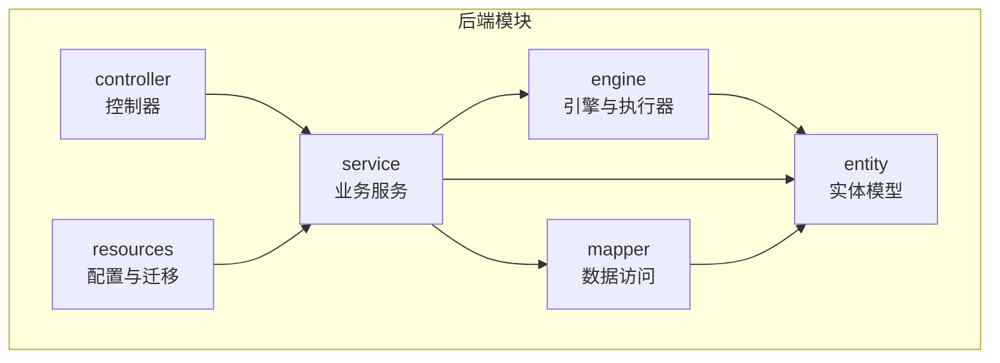
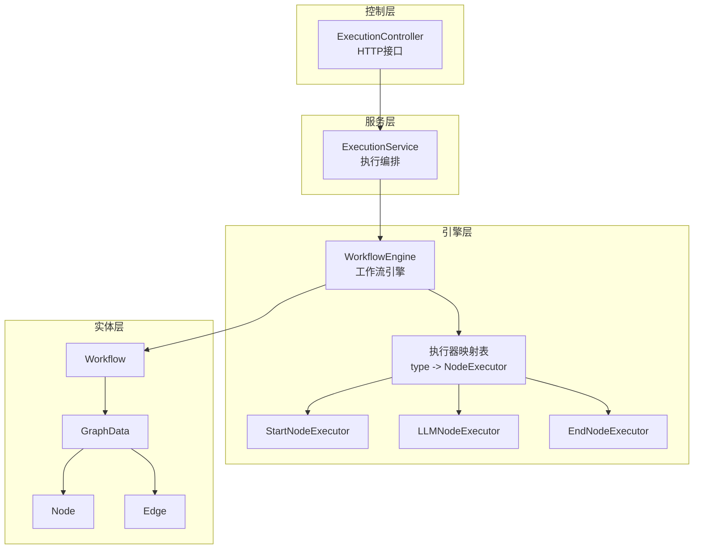
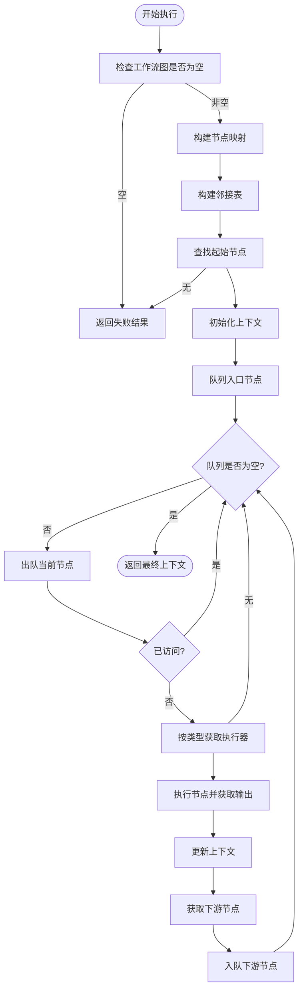
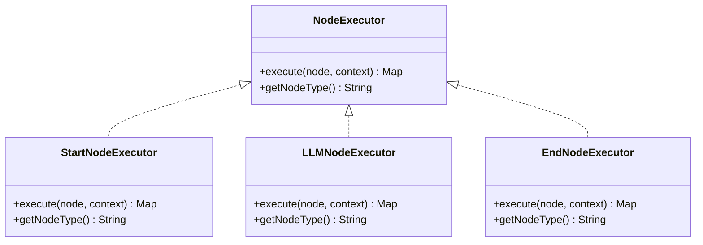
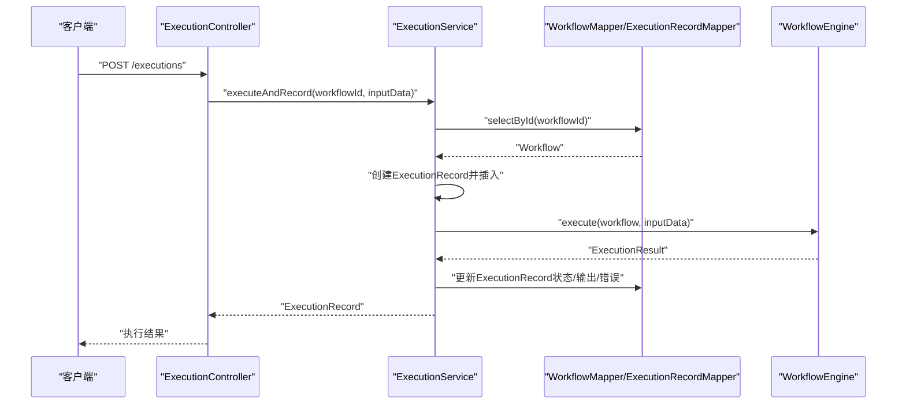
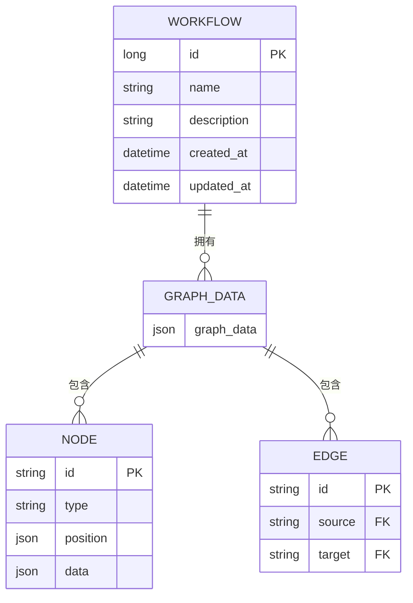
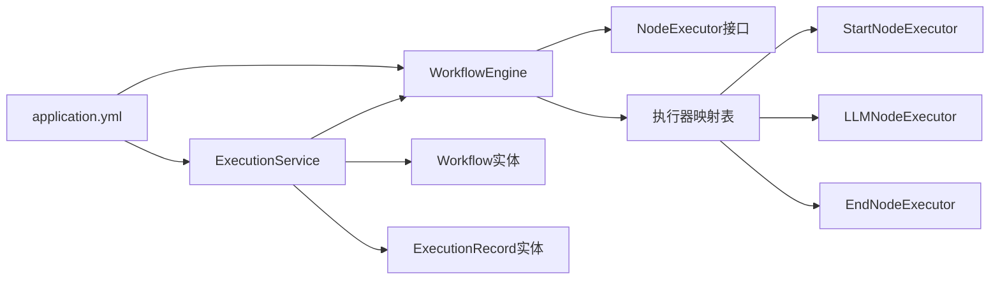

# 引擎架构设计

<cite>
**本文档引用的文件**
- [WorkflowEngine.java](file://backend/src/main/java/com/bokagent/engine/WorkflowEngine.java)
- [NodeExecutor.java](file://backend/src/main/java/com/bokagent/engine/NodeExecutor.java)
- [ExecutionResult.java](file://backend/src/main/java/com/bokagent/engine/ExecutionResult.java)
- [StartNodeExecutor.java](file://backend/src/main/java/com/bokagent/engine/StartNodeExecutor.java)
- [LLMNodeExecutor.java](file://backend/src/main/java/com/bokagent/engine/LLMNodeExecutor.java)
- [EndNodeExecutor.java](file://backend/src/main/java/com/bokagent/engine/EndNodeExecutor.java)
- [WorkflowExecutor.java](file://backend/src/main/java/com/bokagent/engine/WorkflowExecutor.java)
- [ExecutionService.java](file://backend/src/main/java/com/bokagent/service/ExecutionService.java)
- [Workflow.java](file://backend/src/main/java/com/bokagent/entity/Workflow.java)
- [GraphData.java](file://backend/src/main/java/com/bokagent/entity/GraphData.java)
- [Node.java](file://backend/src/main/java/com/bokagent/entity/Node.java)
- [Edge.java](file://backend/src/main/java/com/bokagent/entity/Edge.java)
- [NodeData.java](file://backend/src/main/java/com/bokagent/entity/NodeData.java)
- [BokAgentApplication.java](file://backend/src/main/java/com/bokagent/BokAgentApplication.java)
- [application.yml](file://backend/src/main/resources/application.yml)
</cite>

## 目录
1. [简介](#简介)
2. [项目结构](#项目结构)
3. [核心组件](#核心组件)
4. [架构总览](#架构总览)
5. [详细组件分析](#详细组件分析)
6. [依赖关系分析](#依赖关系分析)
7. [性能考虑](#性能考虑)
8. [故障排查指南](#故障排查指南)
9. [结论](#结论)

## 简介
本文件面向BokAgent工作流引擎的架构设计与实现，重点阐述以下方面：
- 整体架构：基于Spring Boot的模块化分层设计，包含实体层、服务层、引擎层与控制器层。
- 依赖注入与执行器注册：通过Spring容器自动装配与静态映射表实现执行器注册与动态选择。
- 拓扑排序执行：以邻接表表示执行图，采用广度优先搜索进行拓扑顺序执行。
- 核心职责：工作流解析、执行图构建、节点调度策略、执行生命周期管理。
- 执行器映射机制：通过节点类型标识符动态选择对应执行器，支持扩展新节点类型。
- 生命周期管理：从输入数据处理到最终结果输出的完整流程，含错误处理与记录。
- 性能与并发：内存管理、垃圾回收优化、并发安全策略与配置建议。

## 项目结构
后端采用标准Spring Boot目录结构，核心模块如下：
- engine：引擎与执行器相关组件
- entity：领域模型与数据结构
- service：业务服务与执行编排
- controller：HTTP接口层
- mapper：MyBatis持久层
- resources：配置文件与数据库迁移脚本

**章节来源**
- [BokAgentApplication.java:16-19](file://backend/src/main/java/com/bokagent/BokAgentApplication.java#L16-L19)
- [application.yml:101-108](file://backend/src/main/resources/application.yml#L101-L108)

## 核心组件
- 工作流执行器接口：统一执行契约，定义execute与引擎名称标识。
- 执行结果封装：success/failure工厂方法，包含输出、错误与执行时间。
- 节点执行器接口：定义execute与getNodeType，所有具体执行器需实现该接口。
- 三种内置执行器：
  - StartNodeExecutor：初始化上下文，传递输入数据。
  - LLMNodeExecutor：调用LLM服务生成回复，并更新上下文。
  - EndNodeExecutor：汇总最终输出，作为结束节点。
- 执行服务：负责查询工作流、创建执行记录、调用引擎执行、更新状态与错误信息。

**章节来源**
- [WorkflowExecutor.java:10-25](file://backend/src/main/java/com/bokagent/engine/WorkflowExecutor.java#L10-L25)
- [ExecutionResult.java:10-31](file://backend/src/main/java/com/bokagent/engine/ExecutionResult.java#L10-L31)
- [NodeExecutor.java:9-23](file://backend/src/main/java/com/bokagent/engine/NodeExecutor.java#L9-L23)
- [StartNodeExecutor.java:15-40](file://backend/src/main/java/com/bokagent/engine/StartNodeExecutor.java#L15-L40)
- [LLMNodeExecutor.java:17-68](file://backend/src/main/java/com/bokagent/engine/LLMNodeExecutor.java#L17-L68)
- [EndNodeExecutor.java:14-40](file://backend/src/main/java/com/bokagent/engine/EndNodeExecutor.java#L14-L40)
- [ExecutionService.java:22-92](file://backend/src/main/java/com/bokagent/service/ExecutionService.java#L22-L92)

## 架构总览
引擎采用“接口+实现”的分层设计，结合Spring依赖注入与自定义映射表实现执行器注册与选择。执行流程围绕工作流图展开，通过邻接表与队列实现拓扑顺序执行。

**图表来源**
- [ExecutionService.java:39-63](file://backend/src/main/java/com/bokagent/service/ExecutionService.java#L39-L63)
- [WorkflowEngine.java:32-39](file://backend/src/main/java/com/bokagent/engine/WorkflowEngine.java#L32-L39)
- [Workflow.java:16-31](file://backend/src/main/java/com/bokagent/entity/Workflow.java#L16-L31)
- [GraphData.java:10-14](file://backend/src/main/java/com/bokagent/entity/GraphData.java#L10-L14)
- [Node.java:9-14](file://backend/src/main/java/com/bokagent/entity/Node.java#L9-L14)
- [Edge.java:9-13](file://backend/src/main/java/com/bokagent/entity/Edge.java#L9-L13)

**章节来源**
- [ExecutionService.java:39-92](file://backend/src/main/java/com/bokagent/service/ExecutionService.java#L39-L92)
- [WorkflowEngine.java:47-82](file://backend/src/main/java/com/bokagent/engine/WorkflowEngine.java#L47-L82)

## 详细组件分析

### 工作流引擎（WorkflowEngine）
- 职责与流程
  - 解析工作流图：从Workflow提取GraphData，构建节点映射与邻接表。
  - 查找起始节点：过滤类型为start的节点作为入口。
  - 拓扑执行：使用队列进行广度优先遍历，按边关系推进执行。
  - 上下文传递：每个节点执行结果合并入上下文，供后续节点使用。
- 关键实现要点
  - 邻接表构建：遍历Edge集合，建立source到target的映射。
  - 起始节点定位：筛选type=start的节点。
  - 执行器映射：通过HashMap按节点类型查找执行器。
  - 错误处理：捕获异常并返回失败结果，记录执行耗时。
- 复杂度分析
  - 图构建：O(V+E)，V为节点数，E为边数。
  - 执行遍历：O(V+E)，每个节点与边最多访问一次。
- 并发与线程安全
  - 当前实现为单次执行的顺序流程，不涉及共享可变状态；若扩展为多线程，需确保上下文与映射表的线程安全。

**图表来源**
- [WorkflowEngine.java:58-169](file://backend/src/main/java/com/bokagent/engine/WorkflowEngine.java#L58-L169)

**章节来源**
- [WorkflowEngine.java:32-39](file://backend/src/main/java/com/bokagent/engine/WorkflowEngine.java#L32-L39)
- [WorkflowEngine.java:58-169](file://backend/src/main/java/com/bokagent/engine/WorkflowEngine.java#L58-L169)

### 节点执行器接口与实现
- 接口职责
  - execute(Node, Map<String,Object>)：执行节点逻辑并返回输出。
  - getNodeType()：声明节点类型标识，用于映射表匹配。
- 具体实现
  - StartNodeExecutor：写入基础字段与输入上下文，便于后续节点使用。
  - LLMNodeExecutor：读取节点提示词，调用LLM服务，合并响应到上下文。
  - EndNodeExecutor：汇总最终上下文作为最终输出。
- 设计模式
  - 策略模式：不同节点类型对应不同策略，通过映射表解耦。
  - 单一职责：各执行器仅关注自身节点的业务逻辑。

**图表来源**
- [NodeExecutor.java:9-23](file://backend/src/main/java/com/bokagent/engine/NodeExecutor.java#L9-L23)
- [StartNodeExecutor.java:15-40](file://backend/src/main/java/com/bokagent/engine/StartNodeExecutor.java#L15-L40)
- [LLMNodeExecutor.java:17-68](file://backend/src/main/java/com/bokagent/engine/LLMNodeExecutor.java#L17-L68)
- [EndNodeExecutor.java:14-40](file://backend/src/main/java/com/bokagent/engine/EndNodeExecutor.java#L14-L40)

**章节来源**
- [NodeExecutor.java:9-23](file://backend/src/main/java/com/bokagent/engine/NodeExecutor.java#L9-L23)
- [StartNodeExecutor.java:17-34](file://backend/src/main/java/com/bokagent/engine/StartNodeExecutor.java#L17-L34)
- [LLMNodeExecutor.java:22-61](file://backend/src/main/java/com/bokagent/engine/LLMNodeExecutor.java#L22-L61)
- [EndNodeExecutor.java:17-33](file://backend/src/main/java/com/bokagent/engine/EndNodeExecutor.java#L17-L33)

### 执行服务（ExecutionService）
- 职责
  - 查询工作流并校验存在性。
  - 创建执行记录，设置初始状态与时间戳。
  - 通过引擎选择器获取具体引擎实例，执行工作流。
  - 根据执行结果更新执行记录的状态、输出或错误信息。
- 生命周期管理
  - RUNNING -> SUCCESS/FAILED，记录开始与结束时间。
  - 异常捕获并回滚状态，保证一致性。
- 与控制器协作
  - 控制器接收HTTP请求，调用服务层执行并返回结果。

**图表来源**
- [ExecutionService.java:39-92](file://backend/src/main/java/com/bokagent/service/ExecutionService.java#L39-L92)
- [WorkflowEngine.java:47-82](file://backend/src/main/java/com/bokagent/engine/WorkflowEngine.java#L47-L82)

**章节来源**
- [ExecutionService.java:39-92](file://backend/src/main/java/com/bokagent/service/ExecutionService.java#L39-L92)

### 实体模型与数据结构
- Workflow：工作流定义，包含名称、描述、创建/更新时间与GraphData。
- GraphData：工作流图数据，包含节点列表、边列表与视口信息。
- Node：节点定义，包含id、类型、位置与节点数据。
- Edge：边定义，包含id、源节点与目标节点。
- NodeData：节点数据，包含标签、提示词与配置。

**图表来源**
- [Workflow.java:16-31](file://backend/src/main/java/com/bokagent/entity/Workflow.java#L16-L31)
- [GraphData.java:10-14](file://backend/src/main/java/com/bokagent/entity/GraphData.java#L10-L14)
- [Node.java:9-14](file://backend/src/main/java/com/bokagent/entity/Node.java#L9-L14)
- [Edge.java:9-13](file://backend/src/main/java/com/bokagent/entity/Edge.java#L9-L13)

**章节来源**
- [Workflow.java:16-31](file://backend/src/main/java/com/bokagent/entity/Workflow.java#L16-L31)
- [GraphData.java:10-14](file://backend/src/main/java/com/bokagent/entity/GraphData.java#L10-L14)
- [Node.java:9-14](file://backend/src/main/java/com/bokagent/entity/Node.java#L9-L14)
- [Edge.java:9-13](file://backend/src/main/java/com/bokagent/entity/Edge.java#L9-L13)
- [NodeData.java:10-14](file://backend/src/main/java/com/bokagent/entity/NodeData.java#L10-L14)

## 依赖关系分析
- 组件耦合
  - WorkflowEngine与NodeExecutor通过映射表解耦，新增节点类型只需实现接口并注册映射。
  - ExecutionService依赖WorkflowEngine选择器与数据访问层，承担编排职责。
- 外部依赖
  - Spring Boot：依赖注入、配置与Web框架。
  - MyBatis/MyBatis-Plus：ORM与SQL映射。
  - Spring AI/OpenAI等：LLM服务集成。
  - Redis/HikariCP：缓存与连接池。
- 配置驱动
  - application.yml集中管理数据库、缓存、AI服务、超时与日志等配置。

**图表来源**
- [WorkflowEngine.java:32-39](file://backend/src/main/java/com/bokagent/engine/WorkflowEngine.java#L32-L39)
- [ExecutionService.java:30-31](file://backend/src/main/java/com/bokagent/service/ExecutionService.java#L30-L31)
- [application.yml:16-67](file://backend/src/main/resources/application.yml#L16-L67)

**章节来源**
- [WorkflowEngine.java:32-39](file://backend/src/main/java/com/bokagent/engine/WorkflowEngine.java#L32-L39)
- [ExecutionService.java:30-31](file://backend/src/main/java/com/bokagent/service/ExecutionService.java#L30-L31)
- [application.yml:16-67](file://backend/src/main/resources/application.yml#L16-L67)

## 性能考虑
- 内存管理
  - 上下文Map在执行过程中持续增长，建议：
    - 在节点执行完成后及时清理不再需要的中间键。
    - 对大对象（如LLM输出）进行分页或延迟序列化。
- 垃圾回收优化
  - 避免在循环中创建大量临时对象；复用Map与List。
  - 使用局部变量减少闭包捕获，降低GC压力。
- 并发安全策略
  - 单次执行为顺序流程，无需锁；若扩展为并发执行，需：
    - 将上下文改为线程安全的数据结构（如ThreadLocal或不可变对象）。
    - 对共享资源加锁或使用原子操作。
- 配置建议
  - 连接池与线程池：依据流量峰值调整HikariCP与Task Executor参数。
  - 缓存：合理设置TTL，避免缓存雪崩与击穿。
  - 超时：为LLM调用与工具执行设置上限，防止阻塞。

[本节为通用性能指导，不直接分析特定文件]

## 故障排查指南
- 常见问题与定位
  - 工作流图为空：检查Workflow.graphData是否正确存储与反序列化。
  - 未找到起始节点：确认节点类型为start且唯一。
  - 未找到执行器：核对节点类型字符串与执行器注册映射一致。
  - LLM调用失败：查看LLM服务配置与API密钥，检查网络与超时设置。
- 记录与日志
  - ExecutionService在执行前后记录状态与错误，便于追踪。
  - 应用启动时打印编码信息，确保UTF-8支持。
- 快速修复步骤
  - 校验application.yml中的数据库、Redis与AI服务配置。
  - 检查实体序列化配置（JsonbTypeHandler）与数据库迁移脚本。
  - 通过Actuator端点监控健康与指标。

**章节来源**
- [ExecutionService.java:42-91](file://backend/src/main/java/com/bokagent/service/ExecutionService.java#L42-L91)
- [BokAgentApplication.java:45-54](file://backend/src/main/java/com/bokagent/BokAgentApplication.java#L45-L54)
- [application.yml:138-155](file://backend/src/main/resources/application.yml#L138-L155)

## 结论
BokAgent工作流引擎通过清晰的分层与接口抽象，实现了可扩展的节点执行体系。其核心优势在于：
- 基于映射表的执行器注册机制，便于新增节点类型。
- 以邻接表与队列实现的拓扑排序执行，逻辑简洁、易于维护。
- 完整的生命周期管理与错误处理，保障执行可靠性。
建议在生产环境中进一步完善并发安全、缓存策略与可观测性配置，以满足高吞吐与低延迟需求。