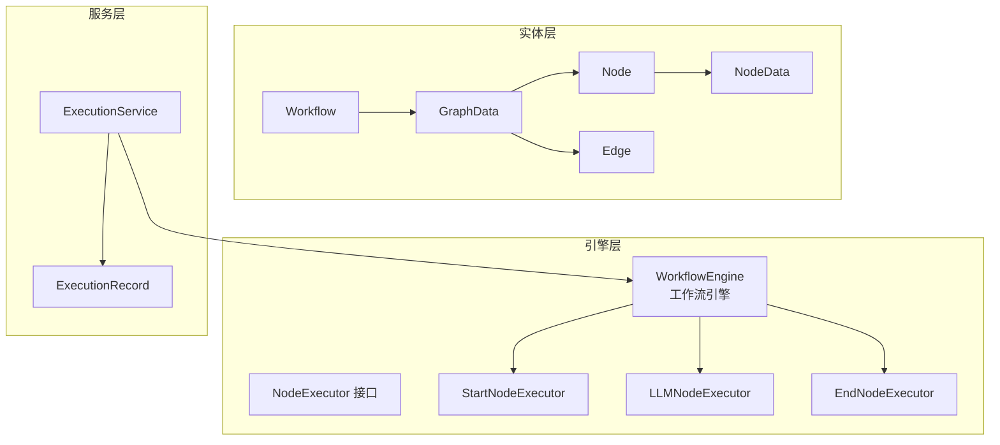
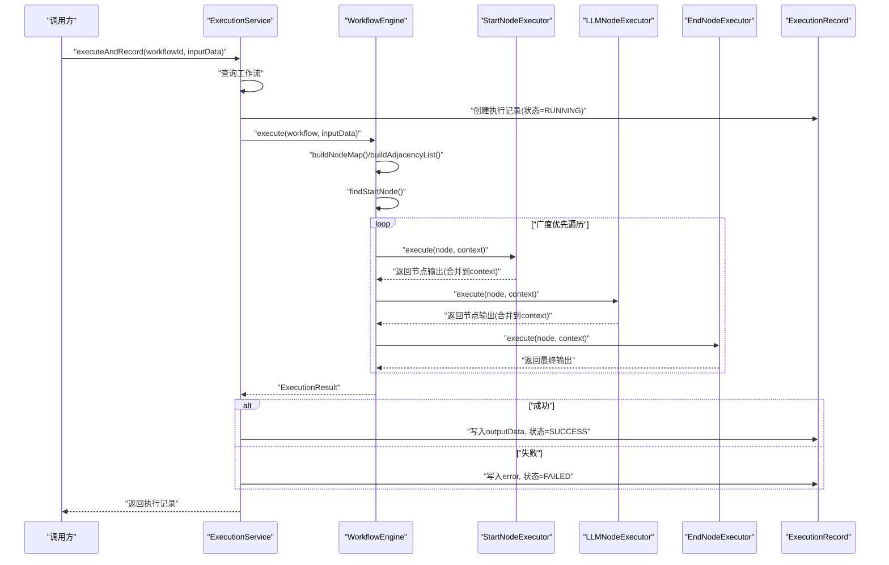
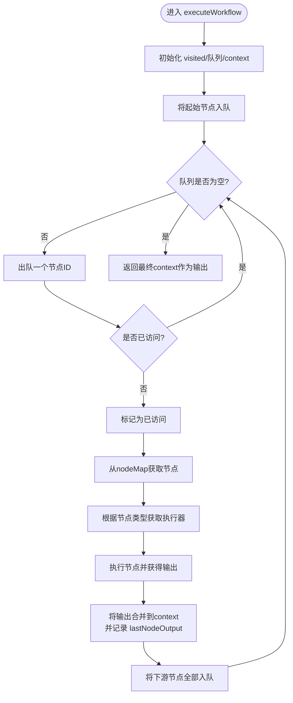
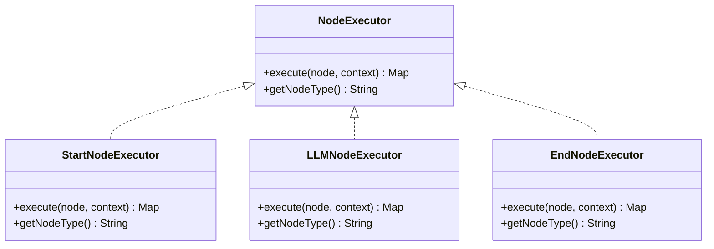
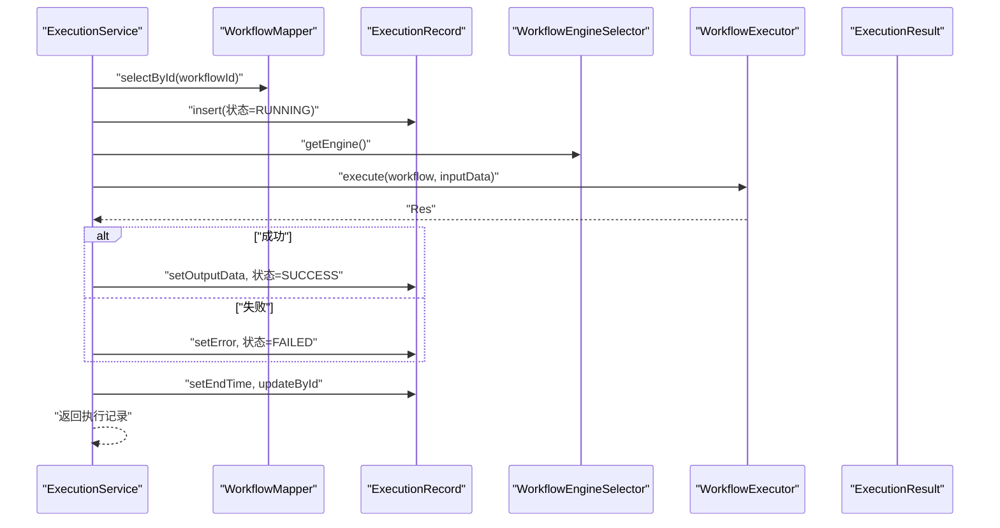
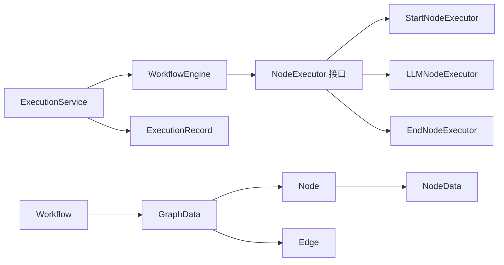
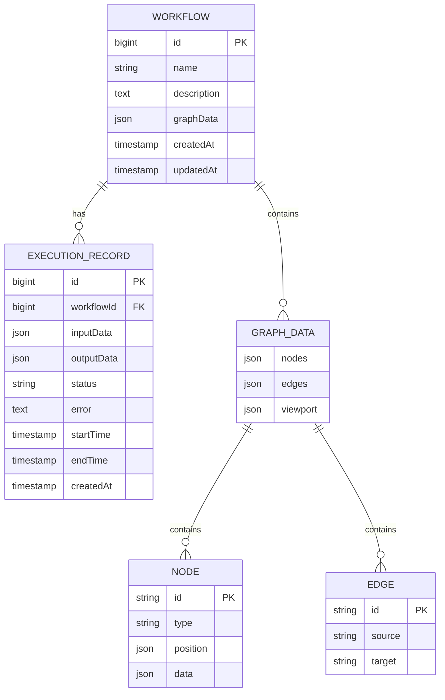

# 执行流程控制

<cite>
**本文引用的文件**
- [WorkflowEngine.java](file://backend/src/main/java/com/bokagent/engine/WorkflowEngine.java)
- [ExecutionResult.java](file://backend/src/main/java/com/bokagent/engine/ExecutionResult.java)
- [NodeExecutor.java](file://backend/src/main/java/com/bokagent/engine/NodeExecutor.java)
- [StartNodeExecutor.java](file://backend/src/main/java/com/bokagent/engine/StartNodeExecutor.java)
- [LLMNodeExecutor.java](file://backend/src/main/java/com/bokagent/engine/LLMNodeExecutor.java)
- [EndNodeExecutor.java](file://backend/src/main/java/com/bokagent/engine/EndNodeExecutor.java)
- [ExecutionService.java](file://backend/src/main/java/com/bokagent/service/ExecutionService.java)
- [Workflow.java](file://backend/src/main/java/com/bokagent/entity/Workflow.java)
- [GraphData.java](file://backend/src/main/java/com/bokagent/entity/GraphData.java)
- [Node.java](file://backend/src/main/java/com/bokagent/entity/Node.java)
- [Edge.java](file://backend/src/main/java/com/bokagent/entity/Edge.java)
- [NodeData.java](file://backend/src/main/java/com/bokagent/entity/NodeData.java)
- [ExecutionRecord.java](file://backend/src/main/java/com/bokagent/entity/ExecutionRecord.java)
</cite>

## 目录
1. [简介](#简介)
2. [项目结构](#项目结构)
3. [核心组件](#核心组件)
4. [架构总览](#架构总览)
5. [详细组件分析](#详细组件分析)
6. [依赖分析](#依赖分析)
7. [性能考虑](#性能考虑)
8. [故障排查指南](#故障排查指南)
9. [结论](#结论)
10. [附录](#附录)

## 简介
本文件聚焦于BokAgent工作流执行流程，围绕以下目标展开：  
- 深入解释execute方法的完整执行流程，包括工作流图解析、节点映射构建、邻接表生成、起始节点定位。  
- 详细说明executeWorkflow方法的拓扑排序执行算法，包括广度优先搜索、节点访问控制、执行顺序保证。  
- 阐述上下文管理机制，包括数据传递、状态共享、执行结果累积。  
- 解释ExecutionResult的结构设计，包括成功/失败状态、执行时间统计、错误信息封装。  
- 提供执行流程的详细时序图，展示从工作流启动到完成的完整过程。  
- 包含执行流程的优化策略，如并行执行、缓存机制、资源复用。

## 项目结构
后端采用分层与职责分离的设计：  
- engine层：工作流引擎与节点执行器接口及实现，负责解析图、调度节点、聚合结果。  
- entity层：工作流、图数据、节点、边等模型定义。  
- service层：业务服务，协调执行与持久化，封装执行记录。  
- controller层：对外暴露执行接口（在当前上下文中由服务层直接调用）。

图表来源
- [WorkflowEngine.java:1-171](file://backend/src/main/java/com/bokagent/engine/WorkflowEngine.java#L1-L171)
- [NodeExecutor.java:1-24](file://backend/src/main/java/com/bokagent/engine/NodeExecutor.java#L1-L24)
- [StartNodeExecutor.java:1-41](file://backend/src/main/java/com/bokagent/engine/StartNodeExecutor.java#L1-L41)
- [LLMNodeExecutor.java:1-69](file://backend/src/main/java/com/bokagent/engine/LLMNodeExecutor.java#L1-L69)
- [EndNodeExecutor.java:1-41](file://backend/src/main/java/com/bokagent/engine/EndNodeExecutor.java#L1-L41)
- [ExecutionService.java:1-113](file://backend/src/main/java/com/bokagent/service/ExecutionService.java#L1-L113)
- [Workflow.java:1-32](file://backend/src/main/java/com/bokagent/entity/Workflow.java#L1-L32)
- [GraphData.java:1-15](file://backend/src/main/java/com/bokagent/entity/GraphData.java#L1-L15)
- [Node.java:1-15](file://backend/src/main/java/com/bokagent/entity/Node.java#L1-L15)
- [Edge.java:1-14](file://backend/src/main/java/com/bokagent/entity/Edge.java#L1-L14)
- [NodeData.java:1-15](file://backend/src/main/java/com/bokagent/entity/NodeData.java#L1-L15)
- [ExecutionRecord.java:1-40](file://backend/src/main/java/com/bokagent/entity/ExecutionRecord.java#L1-L40)

章节来源
- [WorkflowEngine.java:1-171](file://backend/src/main/java/com/bokagent/engine/WorkflowEngine.java#L1-L171)
- [ExecutionService.java:1-113](file://backend/src/main/java/com/bokagent/service/ExecutionService.java#L1-L113)

## 核心组件
- 工作流引擎：负责解析图、构建节点映射与邻接表、定位起始节点、执行拓扑排序、汇总上下文与结果。  
- 节点执行器接口与实现：抽象节点执行行为，不同节点类型通过具体执行器实现差异化逻辑。  
- 执行服务：编排执行流程、创建执行记录、更新状态与结果、持久化执行历史。  
- 执行结果：统一承载成功/失败、输出、错误信息与执行时间。  
- 实体模型：Workflow、GraphData、Node、Edge、NodeData等，描述工作流的静态结构与数据。

章节来源
- [WorkflowEngine.java:47-82](file://backend/src/main/java/com/bokagent/engine/WorkflowEngine.java#L47-L82)
- [ExecutionResult.java:10-31](file://backend/src/main/java/com/bokagent/engine/ExecutionResult.java#L10-L31)
- [ExecutionService.java:39-92](file://backend/src/main/java/com/bokagent/service/ExecutionService.java#L39-L92)
- [Workflow.java:16-31](file://backend/src/main/java/com/bokagent/entity/Workflow.java#L16-L31)
- [GraphData.java:10-14](file://backend/src/main/java/com/bokagent/entity/GraphData.java#L10-L14)
- [Node.java:9-14](file://backend/src/main/java/com/bokagent/entity/Node.java#L9-L14)
- [Edge.java:9-13](file://backend/src/main/java/com/bokagent/entity/Edge.java#L9-L13)
- [NodeData.java:10-14](file://backend/src/main/java/com/bokagent/entity/NodeData.java#L10-L14)

## 架构总览
下图展示了从服务层发起执行到引擎层解析与执行，再到记录层持久化的整体流程。

图表来源
- [ExecutionService.java:39-92](file://backend/src/main/java/com/bokagent/service/ExecutionService.java#L39-L92)
- [WorkflowEngine.java:47-82](file://backend/src/main/java/com/bokagent/engine/WorkflowEngine.java#L47-L82)
- [StartNodeExecutor.java:18-34](file://backend/src/main/java/com/bokagent/engine/StartNodeExecutor.java#L18-L34)
- [LLMNodeExecutor.java:23-62](file://backend/src/main/java/com/bokagent/engine/LLMNodeExecutor.java#L23-L62)
- [EndNodeExecutor.java:18-34](file://backend/src/main/java/com/bokagent/engine/EndNodeExecutor.java#L18-L34)
- [ExecutionRecord.java:17-39](file://backend/src/main/java/com/bokagent/entity/ExecutionRecord.java#L17-L39)

## 详细组件分析

### 执行入口与图解析：WorkflowEngine.execute
- 图解析：从Workflow中提取GraphData，校验节点集合非空；若为空则快速失败并返回ExecutionResult.failure。  
- 节点映射构建：将节点列表转为以id为键的Map，便于O(1)查找。  
- 邻接表生成：基于边集合构建source->target的邻接表，用于后续拓扑遍历。  
- 起始节点定位：筛选type为“start”的节点作为唯一起点。  
- 上下文初始化：以传入的inputData为基础，构造初始上下文。  
- 执行工作流：调用executeWorkflow进行BFS拓扑执行，返回最终上下文作为输出。  
- 结果封装：计算执行耗时，成功则封装为ExecutionResult.success，失败则封装为ExecutionResult.failure。

章节来源
- [WorkflowEngine.java:47-82](file://backend/src/main/java/com/bokagent/engine/WorkflowEngine.java#L47-L82)
- [WorkflowEngine.java:87-115](file://backend/src/main/java/com/bokagent/engine/WorkflowEngine.java#L87-L115)

### 拓扑排序执行算法：WorkflowEngine.executeWorkflow
- 数据结构：  
  - visited集合：避免重复执行同一节点。  
  - 队列：BFS遍历，确保按拓扑顺序推进。  
  - 上下文context：贯穿所有节点，累积中间结果与状态。  
- 执行流程：  
  - 将起始节点入队。  
  - 出队当前节点，若已访问则跳过；否则标记为已访问。  
  - 依据节点类型获取对应执行器，执行节点并将输出合并回上下文（同时保留最近一次节点输出）。  
  - 将当前节点的下游节点全部入队，等待后续处理。  
- 执行顺序保证：由于采用BFS且仅在节点无前置依赖时入队，天然满足拓扑有序性。

图表来源
- [WorkflowEngine.java:120-169](file://backend/src/main/java/com/bokagent/engine/WorkflowEngine.java#L120-L169)

章节来源
- [WorkflowEngine.java:120-169](file://backend/src/main/java/com/bokagent/engine/WorkflowEngine.java#L120-L169)

### 节点执行器体系
- 接口约定：NodeExecutor定义execute(node, context)->Map<String,Object>与getNodeType()。  
- 开始节点：注入输入上下文，附加基础元信息，作为执行的初始状态。  
- LLM节点：读取节点提示词，调用LLM服务生成响应，将响应与上下文合并，标注状态与时间戳。  
- 结束节点：汇总当前上下文作为最终输出，形成可被上层使用的最终结果。

图表来源
- [NodeExecutor.java:9-23](file://backend/src/main/java/com/bokagent/engine/NodeExecutor.java#L9-L23)
- [StartNodeExecutor.java:15-40](file://backend/src/main/java/com/bokagent/engine/StartNodeExecutor.java#L15-L40)
- [LLMNodeExecutor.java:17-68](file://backend/src/main/java/com/bokagent/engine/LLMNodeExecutor.java#L17-L68)
- [EndNodeExecutor.java:15-40](file://backend/src/main/java/com/bokagent/engine/EndNodeExecutor.java#L15-L40)

章节来源
- [NodeExecutor.java:9-23](file://backend/src/main/java/com/bokagent/engine/NodeExecutor.java#L9-L23)
- [StartNodeExecutor.java:18-34](file://backend/src/main/java/com/bokagent/engine/StartNodeExecutor.java#L18-L34)
- [LLMNodeExecutor.java:23-62](file://backend/src/main/java/com/bokagent/engine/LLMNodeExecutor.java#L23-L62)
- [EndNodeExecutor.java:18-34](file://backend/src/main/java/com/bokagent/engine/EndNodeExecutor.java#L18-L34)

### 上下文管理机制
- 数据传递：每个节点执行完成后，其输出会合并回context，供后续节点使用。  
- 状态共享：通过context维护执行过程中的中间状态，例如“lastNodeOutput”用于记录最近一次节点输出。  
- 执行结果累积：最终上下文即为工作流的输出，结束节点可将其作为最终输出字段返回。  
- 输入注入：开始节点将传入的inputData原样合并到context，确保外部输入贯穿全链路。

章节来源
- [WorkflowEngine.java:157-161](file://backend/src/main/java/com/bokagent/engine/WorkflowEngine.java#L157-L161)
- [StartNodeExecutor.java:27-30](file://backend/src/main/java/com/bokagent/engine/StartNodeExecutor.java#L27-L30)
- [EndNodeExecutor.java:27-30](file://backend/src/main/java/com/bokagent/engine/EndNodeExecutor.java#L27-L30)

### ExecutionResult结构设计
- 字段：success布尔值、output输出映射、error错误信息、executionTime执行耗时。  
- 成功/失败：通过静态工厂方法success/failure统一创建，便于上层判断与记录。  
- 时间统计：由调用方在execute入口处采集开始与结束时间，确保覆盖整个执行周期。

章节来源
- [ExecutionResult.java:10-31](file://backend/src/main/java/com/bokagent/engine/ExecutionResult.java#L10-L31)
- [WorkflowEngine.java:72-81](file://backend/src/main/java/com/bokagent/engine/WorkflowEngine.java#L72-L81)

### 执行服务与持久化：ExecutionService
- 编排执行：查询工作流、创建执行记录（状态RUNNING）、调用引擎执行、更新状态与结果。  
- 异常处理：捕获执行异常，将记录置为FAILED并写入错误信息。  
- 结果落库：成功时写入outputData，失败时写入error；统一设置结束时间。

图表来源
- [ExecutionService.java:39-92](file://backend/src/main/java/com/bokagent/service/ExecutionService.java#L39-L92)
- [ExecutionRecord.java:17-39](file://backend/src/main/java/com/bokagent/entity/ExecutionRecord.java#L17-L39)

章节来源
- [ExecutionService.java:39-92](file://backend/src/main/java/com/bokagent/service/ExecutionService.java#L39-L92)
- [ExecutionRecord.java:17-39](file://backend/src/main/java/com/bokagent/entity/ExecutionRecord.java#L17-L39)

## 依赖分析
- 组件耦合：WorkflowEngine通过NodeExecutor接口解耦不同类型节点；ExecutionService通过WorkflowEngineSelector间接依赖具体引擎实现。  
- 外部依赖：LLM节点依赖LLMService；执行记录依赖MyBatis-Plus的JSON字段处理器。  
- 可能的循环依赖：当前结构清晰，未发现循环依赖迹象。  

图表来源
- [ExecutionService.java:30-31](file://backend/src/main/java/com/bokagent/service/ExecutionService.java#L30-L31)
- [WorkflowEngine.java:23-30](file://backend/src/main/java/com/bokagent/engine/WorkflowEngine.java#L23-L30)
- [NodeExecutor.java:9-23](file://backend/src/main/java/com/bokagent/engine/NodeExecutor.java#L9-L23)
- [ExecutionRecord.java:17-39](file://backend/src/main/java/com/bokagent/entity/ExecutionRecord.java#L17-L39)
- [Workflow.java:25-26](file://backend/src/main/java/com/bokagent/entity/Workflow.java#L25-L26)
- [GraphData.java:10-14](file://backend/src/main/java/com/bokagent/entity/GraphData.java#L10-L14)
- [Node.java:9-14](file://backend/src/main/java/com/bokagent/entity/Node.java#L9-L14)
- [Edge.java:9-13](file://backend/src/main/java/com/bokagent/entity/Edge.java#L9-L13)
- [NodeData.java:10-14](file://backend/src/main/java/com/bokagent/entity/NodeData.java#L10-L14)

章节来源
- [ExecutionService.java:30-31](file://backend/src/main/java/com/bokagent/service/ExecutionService.java#L30-L31)
- [WorkflowEngine.java:23-30](file://backend/src/main/java/com/bokagent/engine/WorkflowEngine.java#L23-L30)

## 性能考虑
- 并行执行：当前实现为单线程BFS，节点间无显式并行控制。可在满足拓扑约束的前提下，对无依赖的同层节点引入并行执行，需注意上下文一致性与并发安全。  
- 缓存机制：对LLM节点的重复请求可引入缓存（基于prompt+context哈希），减少重复调用与延迟。  
- 资源复用：LLMService内部可复用连接池或会话，降低初始化开销；执行器实例可复用Spring容器管理的单例Bean。  
- 内存与日志：大量中间结果可能占用内存，建议在节点输出中仅保留必要字段；生产环境适当降低日志级别。  
- 数据序列化：JSON字段处理器在数据库读写时有额外成本，可评估压缩或精简存储方案。

## 故障排查指南
- 未找到起始节点：检查GraphData.nodes中是否存在type为“start”的节点，或确认节点类型拼写正确。  
- 节点类型缺失执行器：确认节点类型字符串与执行器getNodeType一致，避免大小写或命名差异。  
- LLM调用失败：查看LLMService的异常栈，确认网络、鉴权与参数格式；可在节点执行器中增加重试与降级策略。  
- 执行记录状态异常：核对ExecutionService的状态更新逻辑，确保异常分支也能写入FAILED状态与错误信息。  
- 上下文丢失：检查节点输出是否正确合并到context，以及是否被后续节点覆盖。

章节来源
- [WorkflowEngine.java:63-66](file://backend/src/main/java/com/bokagent/engine/WorkflowEngine.java#L63-L66)
- [WorkflowEngine.java:150-154](file://backend/src/main/java/com/bokagent/engine/WorkflowEngine.java#L150-L154)
- [LLMNodeExecutor.java:50-61](file://backend/src/main/java/com/bokagent/engine/LLMNodeExecutor.java#L50-L61)
- [ExecutionService.java:81-91](file://backend/src/main/java/com/bokagent/service/ExecutionService.java#L81-L91)

## 结论
本文系统梳理了BokAgent工作流的执行路径：从图解析、拓扑遍历到上下文累积与结果封装，并结合服务层持久化与异常处理，给出了可操作的优化建议。当前实现具备良好的扩展性与可维护性，后续可在保证拓扑正确性的前提下引入并行与缓存，进一步提升吞吐与稳定性。

## 附录
- 关键实体关系概览：

图表来源
- [Workflow.java:16-31](file://backend/src/main/java/com/bokagent/entity/Workflow.java#L16-L31)
- [ExecutionRecord.java:17-39](file://backend/src/main/java/com/bokagent/entity/ExecutionRecord.java#L17-L39)
- [GraphData.java:10-14](file://backend/src/main/java/com/bokagent/entity/GraphData.java#L10-L14)
- [Node.java:9-14](file://backend/src/main/java/com/bokagent/entity/Node.java#L9-L14)
- [Edge.java:9-13](file://backend/src/main/java/com/bokagent/entity/Edge.java#L9-L13)