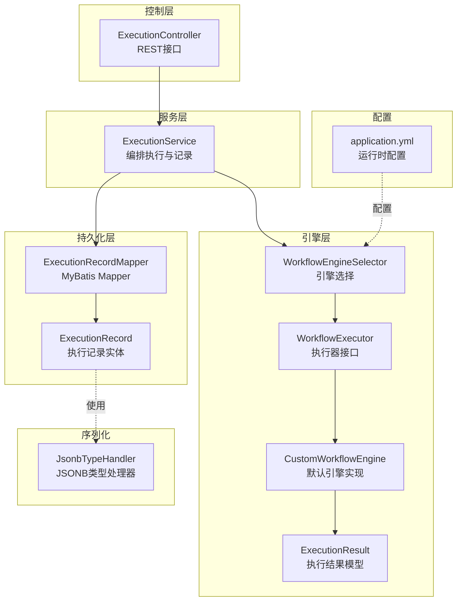
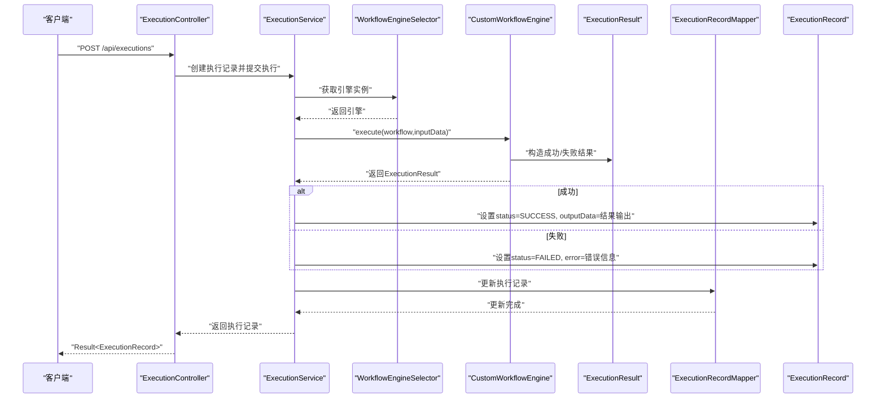
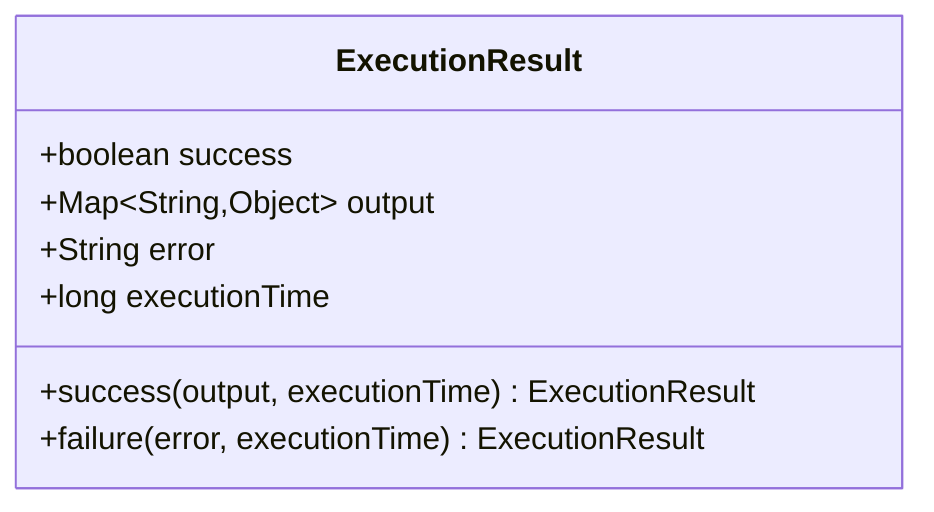
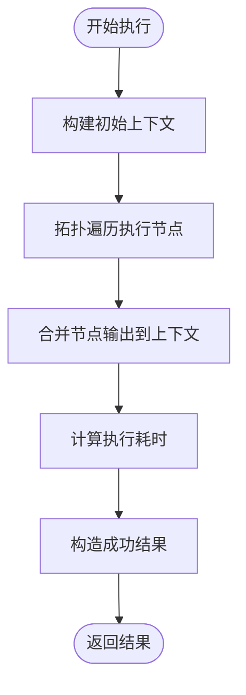
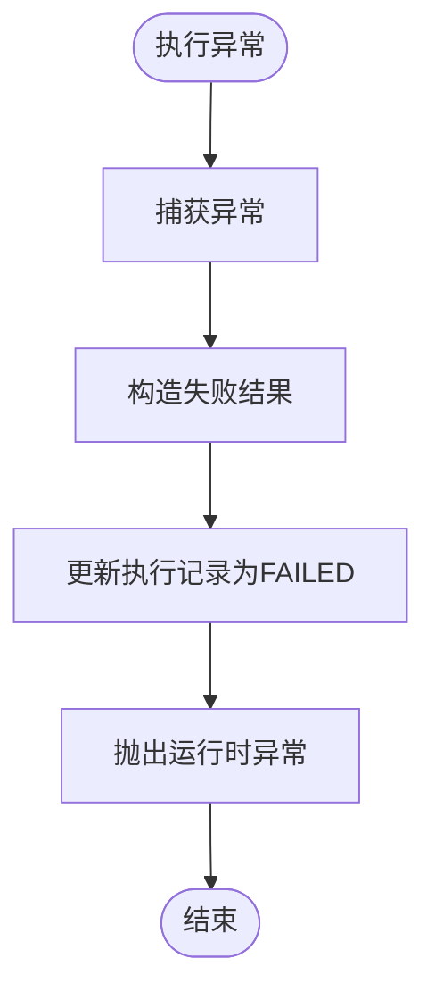
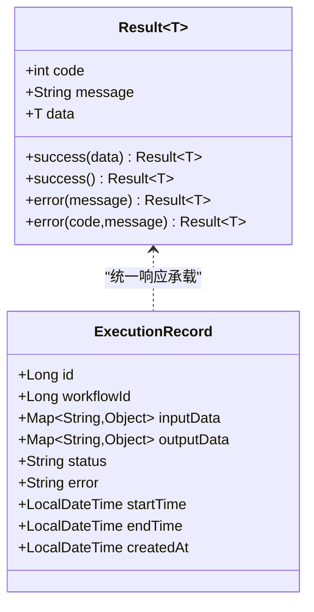
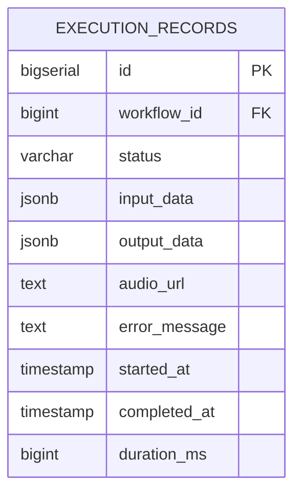
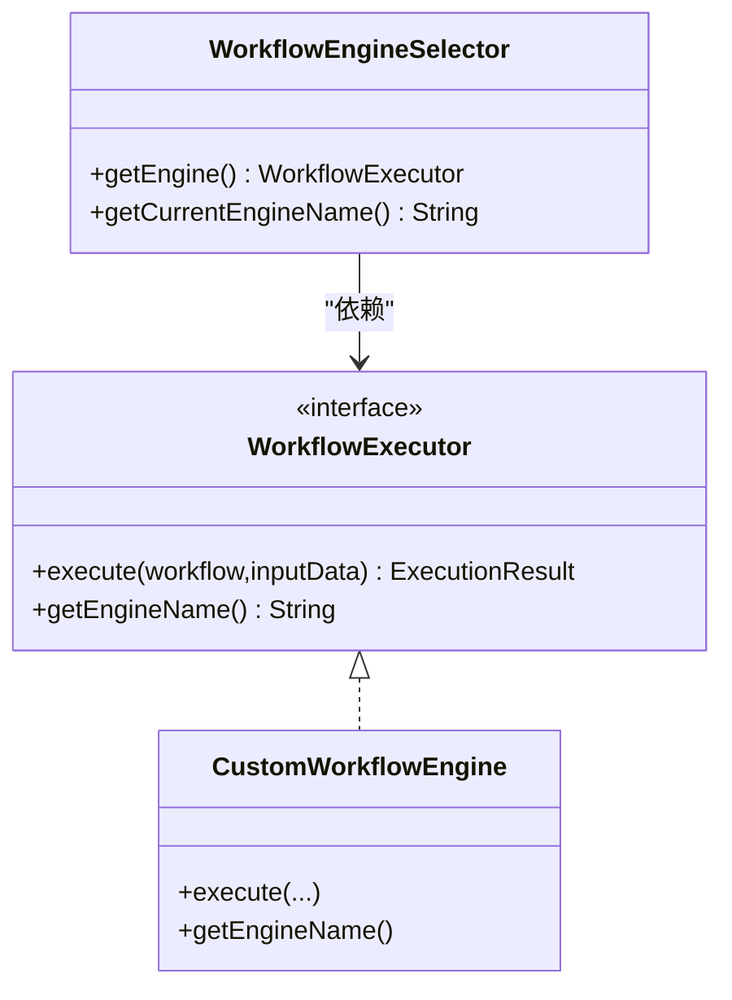
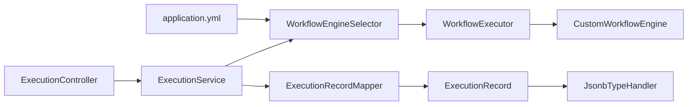

# 执行结果处理

<cite>
**本文引用的文件**
- [ExecutionResult.java](file://backend/src/main/java/com/bokagent/engine/ExecutionResult.java)
- [Result.java](file://backend/src/main/java/com/bokagent/common/Result.java)
- [ExecutionController.java](file://backend/src/main/java/com/bokagent/controller/ExecutionController.java)
- [ExecutionService.java](file://backend/src/main/java/com/bokagent/service/ExecutionService.java)
- [ExecutionRecord.java](file://backend/src/main/java/com/bokagent/entity/ExecutionRecord.java)
- [WorkflowEngineSelector.java](file://backend/src/main/java/com/bokagent/engine/WorkflowEngineSelector.java)
- [WorkflowExecutor.java](file://backend/src/main/java/com/bokagent/engine/WorkflowExecutor.java)
- [CustomWorkflowEngine.java](file://backend/src/main/java/com/bokagent/engine/CustomWorkflowEngine.java)
- [WorkflowEngine.java](file://backend/src/main/java/com/bokagent/engine/WorkflowEngine.java)
- [ExecutionRecordMapper.java](file://backend/src/main/java/com/bokagent/mapper/ExecutionRecordMapper.java)
- [JsonbTypeHandler.java](file://backend/src/main/java/com/bokagent/handler/JsonbTypeHandler.java)
- [application.yml](file://backend/src/main/resources/application.yml)
- [V2__create_execution_records.sql](file://backend/src/main/resources/db/migration/V2__create_execution_records.sql)
- [pom.xml](file://backend/pom.xml)
</cite>

## 目录
1. [简介](#简介)
2. [项目结构](#项目结构)
3. [核心组件](#核心组件)
4. [架构总览](#架构总览)
5. [详细组件分析](#详细组件分析)
6. [依赖分析](#依赖分析)
7. [性能考虑](#性能考虑)
8. [故障排查指南](#故障排查指南)
9. [结论](#结论)
10. [附录](#附录)

## 简介
本文件面向BokAgent执行结果处理系统，聚焦于ExecutionResult类的设计与实现，涵盖其数据结构、工厂方法、序列化支持；成功/失败结果的封装与处理策略；类型安全与运行时校验；以及在实际业务中的最佳实践（如结果缓存、增量更新、状态同步）与扩展点（自定义结果格式、附加元数据、实现结果过滤器）。文档同时给出与之相关的控制器、服务、实体、映射器、类型处理器及配置文件的关联说明，帮助读者从整体到细节全面理解系统。

## 项目结构
后端采用分层架构：controller负责HTTP接口，service编排业务流程，engine定义执行器与结果模型，entity与mapper负责持久化，handler处理JSONB序列化，application.yml提供运行时配置。执行结果处理的关键路径由控制器触发，服务层创建执行记录并委托引擎执行，引擎返回ExecutionResult，服务层据此更新执行记录状态与数据，最终通过统一响应包装返回给客户端。

图表来源
- [ExecutionController.java:1-81](file://backend/src/main/java/com/bokagent/controller/ExecutionController.java#L1-L81)
- [ExecutionService.java:1-113](file://backend/src/main/java/com/bokagent/service/ExecutionService.java#L1-L113)
- [WorkflowEngineSelector.java:1-53](file://backend/src/main/java/com/bokagent/engine/WorkflowEngineSelector.java#L1-L53)
- [WorkflowExecutor.java:1-26](file://backend/src/main/java/com/bokagent/engine/WorkflowExecutor.java#L1-L26)
- [CustomWorkflowEngine.java:1-170](file://backend/src/main/java/com/bokagent/engine/CustomWorkflowEngine.java#L1-L170)
- [ExecutionResult.java:1-32](file://backend/src/main/java/com/bokagent/engine/ExecutionResult.java#L1-L32)
- [ExecutionRecordMapper.java:1-13](file://backend/src/main/java/com/bokagent/mapper/ExecutionRecordMapper.java#L1-L13)
- [ExecutionRecord.java:1-40](file://backend/src/main/java/com/bokagent/entity/ExecutionRecord.java#L1-L40)
- [JsonbTypeHandler.java:1-65](file://backend/src/main/java/com/bokagent/handler/JsonbTypeHandler.java#L1-L65)
- [application.yml:101-108](file://backend/src/main/resources/application.yml#L101-L108)

章节来源
- [ExecutionController.java:1-81](file://backend/src/main/java/com/bokagent/controller/ExecutionController.java#L1-L81)
- [ExecutionService.java:1-113](file://backend/src/main/java/com/bokagent/service/ExecutionService.java#L1-L113)
- [ExecutionResult.java:1-32](file://backend/src/main/java/com/bokagent/engine/ExecutionResult.java#L1-L32)
- [ExecutionRecord.java:1-40](file://backend/src/main/java/com/bokagent/entity/ExecutionRecord.java#L1-L40)
- [WorkflowEngineSelector.java:1-53](file://backend/src/main/java/com/bokagent/engine/WorkflowEngineSelector.java#L1-L53)
- [WorkflowExecutor.java:1-26](file://backend/src/main/java/com/bokagent/engine/WorkflowExecutor.java#L1-L26)
- [CustomWorkflowEngine.java:1-170](file://backend/src/main/java/com/bokagent/engine/CustomWorkflowEngine.java#L1-L170)
- [ExecutionRecordMapper.java:1-13](file://backend/src/main/java/com/bokagent/mapper/ExecutionRecordMapper.java#L1-L13)
- [JsonbTypeHandler.java:1-65](file://backend/src/main/java/com/bokagent/handler/JsonbTypeHandler.java#L1-L65)
- [application.yml:101-108](file://backend/src/main/resources/application.yml#L101-L108)

## 核心组件
- ExecutionResult：工作流执行结果载体，包含成功标志、输出数据、错误信息、执行耗时等字段，提供成功与失败两类工厂方法，用于快速构建结果对象。
- ExecutionService：编排执行与记录，创建执行记录、调用引擎执行、根据结果更新记录状态与数据，并处理异常场景。
- ExecutionController：对外提供执行记录的增删改查接口，统一返回Result<T>格式。
- ExecutionRecord：持久化实体，承载输入/输出数据、状态、错误、时间戳等，使用JSONB类型处理器进行序列化。
- WorkflowEngineSelector：根据配置动态选择引擎实现，默认使用Custom引擎，可扩展为LangGraph4J。
- JsonbTypeHandler：PostgreSQL JSONB类型处理器，负责Map<String,Object>与JSONB之间的序列化/反序列化。
- application.yml：包含工作流引擎类型、缓存、超时、重试等配置项，影响执行行为与性能。

章节来源
- [ExecutionResult.java:1-32](file://backend/src/main/java/com/bokagent/engine/ExecutionResult.java#L1-L32)
- [ExecutionService.java:1-113](file://backend/src/main/java/com/bokagent/service/ExecutionService.java#L1-L113)
- [ExecutionController.java:1-81](file://backend/src/main/java/com/bokagent/controller/ExecutionController.java#L1-L81)
- [ExecutionRecord.java:1-40](file://backend/src/main/java/com/bokagent/entity/ExecutionRecord.java#L1-L40)
- [WorkflowEngineSelector.java:1-53](file://backend/src/main/java/com/bokagent/engine/WorkflowEngineSelector.java#L1-L53)
- [JsonbTypeHandler.java:1-65](file://backend/src/main/java/com/bokagent/handler/JsonbTypeHandler.java#L1-L65)
- [application.yml:101-108](file://backend/src/main/resources/application.yml#L101-L108)

## 架构总览
下图展示从HTTP请求到执行结果落库的完整链路，突出ExecutionResult在其中的桥梁作用：服务层接收引擎返回的结果，据此更新执行记录的状态与数据，再通过统一响应返回给客户端。

图表来源
- [ExecutionController.java:52-59](file://backend/src/main/java/com/bokagent/controller/ExecutionController.java#L52-L59)
- [ExecutionService.java:39-92](file://backend/src/main/java/com/bokagent/service/ExecutionService.java#L39-L92)
- [WorkflowEngineSelector.java:32-43](file://backend/src/main/java/com/bokagent/engine/WorkflowEngineSelector.java#L32-L43)
- [CustomWorkflowEngine.java:40-76](file://backend/src/main/java/com/bokagent/engine/CustomWorkflowEngine.java#L40-L76)
- [ExecutionResult.java:16-30](file://backend/src/main/java/com/bokagent/engine/ExecutionResult.java#L16-L30)
- [ExecutionRecordMapper.java:1-13](file://backend/src/main/java/com/bokagent/mapper/ExecutionRecordMapper.java#L1-L13)

## 详细组件分析

### ExecutionResult 类设计与工厂方法
- 数据结构
  - 字段：success（布尔）、output（Map<String,Object>）、error（字符串）、executionTime（长整型）
  - 用途：承载一次工作流执行的最终结果，包含成功输出或失败错误信息，以及执行耗时
- 工厂方法
  - 成功工厂：success(output, executionTime) 快速构造成功结果
  - 失败工厂：failure(error, executionTime) 快速构造失败结果
- 序列化支持
  - 作为领域对象直接被服务层使用，配合Jackson进行序列化；在数据库侧通过JSONB类型处理器持久化Map字段

图表来源
- [ExecutionResult.java:10-30](file://backend/src/main/java/com/bokagent/engine/ExecutionResult.java#L10-L30)

章节来源
- [ExecutionResult.java:1-32](file://backend/src/main/java/com/bokagent/engine/ExecutionResult.java#L1-L32)

### 成功结果封装机制
- 输出数据格式化
  - output为Map<String,Object>，可容纳任意键值对，便于传递多类型数据
  - 在CustomWorkflowEngine中，节点执行输出会合并到上下文中，最终作为最终输出返回
- 元数据附加
  - 上下文可附加lastNodeOutput等元数据，便于后续节点或上层逻辑使用
- 执行时间记录
  - 引擎在开始与结束时计算时间差，作为executionTime返回；服务层据此更新执行记录

图表来源
- [CustomWorkflowEngine.java:119-168](file://backend/src/main/java/com/bokagent/engine/CustomWorkflowEngine.java#L119-L168)
- [ExecutionResult.java:16-22](file://backend/src/main/java/com/bokagent/engine/ExecutionResult.java#L16-L22)

章节来源
- [CustomWorkflowEngine.java:40-81](file://backend/src/main/java/com/bokagent/engine/CustomWorkflowEngine.java#L40-L81)
- [ExecutionResult.java:16-22](file://backend/src/main/java/com/bokagent/engine/ExecutionResult.java#L16-L22)

### 失败结果处理策略
- 错误码定义
  - 服务层统一返回Result<T>，其中code/message/data由通用Result类定义；执行结果中的error字段用于记录具体错误信息
- 错误信息收集
  - 引擎捕获异常并构造失败结果；服务层在异常分支同样设置失败状态与错误信息
- 堆栈跟踪保存
  - 当前实现未显式保存堆栈跟踪；可在引擎与服务层增强以记录堆栈，便于调试与审计

图表来源
- [CustomWorkflowEngine.java:71-75](file://backend/src/main/java/com/bokagent/engine/CustomWorkflowEngine.java#L71-L75)
- [ExecutionService.java:81-91](file://backend/src/main/java/com/bokagent/service/ExecutionService.java#L81-L91)
- [Result.java:26-40](file://backend/src/main/java/com/bokagent/common/Result.java#L26-L40)

章节来源
- [CustomWorkflowEngine.java:71-75](file://backend/src/main/java/com/bokagent/engine/CustomWorkflowEngine.java#L71-L75)
- [ExecutionService.java:81-91](file://backend/src/main/java/com/bokagent/service/ExecutionService.java#L81-L91)
- [Result.java:26-40](file://backend/src/main/java/com/bokagent/common/Result.java#L26-L40)

### 结果数据的类型安全与验证
- 泛型使用
  - Result<T>提供泛型封装，确保返回数据类型一致性
- 运行时类型检查
  - ExecutionResult.output为Map<String,Object>，未做深层类型约束；建议在上层逻辑或自定义处理器中增加校验
- 数据验证机制
  - JSONB序列化由JsonbTypeHandler负责；若需更强的Schema校验，可在应用层引入校验框架或自定义校验器

图表来源
- [Result.java:9-41](file://backend/src/main/java/com/bokagent/common/Result.java#L9-L41)
- [ExecutionRecord.java:17-39](file://backend/src/main/java/com/bokagent/entity/ExecutionRecord.java#L17-L39)

章节来源
- [Result.java:1-42](file://backend/src/main/java/com/bokagent/common/Result.java#L1-L42)
- [ExecutionRecord.java:1-40](file://backend/src/main/java/com/bokagent/entity/ExecutionRecord.java#L1-L40)
- [JsonbTypeHandler.java:1-65](file://backend/src/main/java/com/bokagent/handler/JsonbTypeHandler.java#L1-L65)

### 执行记录与持久化
- 实体字段
  - 包含workflowId、inputData/outputData、status、error、startTime/endTime/createdAt等
- JSONB序列化
  - 通过JsonbTypeHandler将Map<String,Object>转换为PostgreSQL JSONB存储
- 表结构
  - 执行记录表包含索引与注释，支持按workflow_id与started_at查询

图表来源
- [V2__create_execution_records.sql:1-12](file://backend/src/main/resources/db/migration/V2__create_execution_records.sql#L1-L12)
- [ExecutionRecord.java:24-28](file://backend/src/main/java/com/bokagent/entity/ExecutionRecord.java#L24-L28)
- [JsonbTypeHandler.java:17-24](file://backend/src/main/java/com/bokagent/handler/JsonbTypeHandler.java#L17-L24)

章节来源
- [ExecutionRecord.java:1-40](file://backend/src/main/java/com/bokagent/entity/ExecutionRecord.java#L1-L40)
- [ExecutionRecordMapper.java:1-13](file://backend/src/main/java/com/bokagent/mapper/ExecutionRecordMapper.java#L1-L13)
- [JsonbTypeHandler.java:1-65](file://backend/src/main/java/com/bokagent/handler/JsonbTypeHandler.java#L1-L65)
- [V2__create_execution_records.sql:1-19](file://backend/src/main/resources/db/migration/V2__create_execution_records.sql#L1-L19)

### 引擎选择与扩展
- 引擎选择
  - 通过配置项选择引擎类型，默认使用Custom引擎；当配置为langgraph4j且存在实现时切换
- 接口契约
  - WorkflowExecutor定义execute与getEngineName，所有引擎实现需遵循
- 扩展点
  - 新增引擎实现只需实现WorkflowExecutor接口，并在选择器中注册

图表来源
- [WorkflowExecutor.java:10-25](file://backend/src/main/java/com/bokagent/engine/WorkflowExecutor.java#L10-L25)
- [CustomWorkflowEngine.java:18-81](file://backend/src/main/java/com/bokagent/engine/CustomWorkflowEngine.java#L18-L81)
- [WorkflowEngineSelector.java:15-51](file://backend/src/main/java/com/bokagent/engine/WorkflowEngineSelector.java#L15-L51)

章节来源
- [WorkflowEngineSelector.java:1-53](file://backend/src/main/java/com/bokagent/engine/WorkflowEngineSelector.java#L1-L53)
- [WorkflowExecutor.java:1-26](file://backend/src/main/java/com/bokagent/engine/WorkflowExecutor.java#L1-L26)
- [CustomWorkflowEngine.java:1-170](file://backend/src/main/java/com/bokagent/engine/CustomWorkflowEngine.java#L1-L170)

## 依赖分析
- 控制器依赖服务层；服务层依赖引擎选择器与执行记录映射器；引擎实现依赖节点执行器；实体依赖JSONB类型处理器；配置文件驱动引擎选择与缓存策略。
- 耦合与内聚
  - 控制器与服务层职责清晰；服务层通过接口依赖引擎，降低对具体实现的耦合
- 外部依赖
  - PostgreSQL JSONB、MyBatis-Plus、Jackson、Lombok等

图表来源
- [ExecutionController.java:1-81](file://backend/src/main/java/com/bokagent/controller/ExecutionController.java#L1-L81)
- [ExecutionService.java:1-113](file://backend/src/main/java/com/bokagent/service/ExecutionService.java#L1-L113)
- [WorkflowEngineSelector.java:1-53](file://backend/src/main/java/com/bokagent/engine/WorkflowEngineSelector.java#L1-L53)
- [WorkflowExecutor.java:1-26](file://backend/src/main/java/com/bokagent/engine/WorkflowExecutor.java#L1-L26)
- [CustomWorkflowEngine.java:1-170](file://backend/src/main/java/com/bokagent/engine/CustomWorkflowEngine.java#L1-L170)
- [ExecutionRecordMapper.java:1-13](file://backend/src/main/java/com/bokagent/mapper/ExecutionRecordMapper.java#L1-L13)
- [ExecutionRecord.java:1-40](file://backend/src/main/java/com/bokagent/entity/ExecutionRecord.java#L1-L40)
- [JsonbTypeHandler.java:1-65](file://backend/src/main/java/com/bokagent/handler/JsonbTypeHandler.java#L1-L65)
- [application.yml:101-108](file://backend/src/main/resources/application.yml#L101-L108)

章节来源
- [pom.xml:29-132](file://backend/pom.xml#L29-L132)

## 性能考虑
- 执行耗时统计
  - 引擎在开始与结束时计算时间差，作为executionTime返回；服务层据此更新执行记录
- 缓存策略
  - application.yml提供缓存配置项，可用于缓存工具结果与LLM响应，减少重复计算
- 超时与重试
  - 提供工具执行、LLM调用、TTS合成、MCP请求、工作流执行等超时配置；默认重试策略可避免瞬时异常导致失败
- 数据库写入
  - 执行记录在成功/失败后统一更新，避免频繁写入；JSONB序列化由类型处理器处理

章节来源
- [CustomWorkflowEngine.java:41-76](file://backend/src/main/java/com/bokagent/engine/CustomWorkflowEngine.java#L41-L76)
- [ExecutionService.java:63-91](file://backend/src/main/java/com/bokagent/service/ExecutionService.java#L63-L91)
- [application.yml:138-155](file://backend/src/main/resources/application.yml#L138-L155)
- [application.yml:157-162](file://backend/src/main/resources/application.yml#L157-L162)

## 故障排查指南
- 执行失败
  - 检查引擎返回的错误信息与服务层异常分支；确认执行记录状态与错误字段是否正确更新
- JSONB序列化问题
  - 若出现解析异常，检查输入数据结构与类型处理器；确保Map<String,Object>可被Jackson序列化
- 引擎选择异常
  - 确认配置项workflow.engine与可用实现；日志中会输出当前使用的引擎名称
- 统一响应
  - 客户端收到Result对象，可通过code/message/data定位问题

章节来源
- [ExecutionService.java:81-91](file://backend/src/main/java/com/bokagent/service/ExecutionService.java#L81-L91)
- [JsonbTypeHandler.java:54-63](file://backend/src/main/java/com/bokagent/handler/JsonbTypeHandler.java#L54-L63)
- [WorkflowEngineSelector.java:32-43](file://backend/src/main/java/com/bokagent/engine/WorkflowEngineSelector.java#L32-L43)
- [Result.java:26-40](file://backend/src/main/java/com/bokagent/common/Result.java#L26-L40)

## 结论
ExecutionResult作为执行结果的核心载体，通过简洁的数据结构与工厂方法实现了成功/失败两种结果的快速构建，并与服务层、控制器、实体、映射器形成完整的执行闭环。结合引擎选择器与JSONB序列化，系统具备良好的扩展性与可维护性。建议在后续迭代中增强堆栈跟踪、Schema校验与结果过滤能力，进一步提升可观测性与安全性。

## 附录
- 最佳实践
  - 结果缓存：利用配置项缓存工具结果与LLM响应，减少重复调用
  - 增量更新：仅在状态变更时更新执行记录，降低写放大
  - 状态同步：在成功/失败分支分别设置结束时间，保持状态一致性
- 扩展点
  - 自定义结果格式：在引擎内部对输出进行二次加工，或在服务层对ExecutionResult进行包装
  - 附加元数据：在上下文中注入更多元信息，如节点执行轨迹、中间结果快照
  - 实现结果过滤器：在服务层或控制器层增加过滤逻辑，按需裁剪输出字段

章节来源
- [application.yml:157-162](file://backend/src/main/resources/application.yml#L157-L162)
- [ExecutionService.java:63-78](file://backend/src/main/java/com/bokagent/service/ExecutionService.java#L63-L78)
- [CustomWorkflowEngine.java:156-161](file://backend/src/main/java/com/bokagent/engine/CustomWorkflowEngine.java#L156-L161)