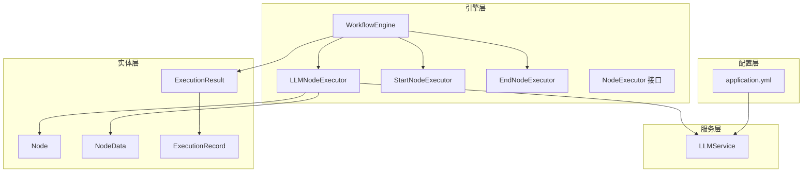
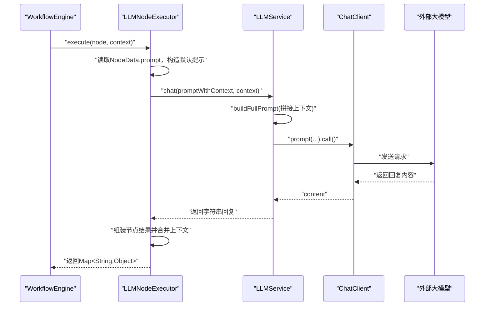
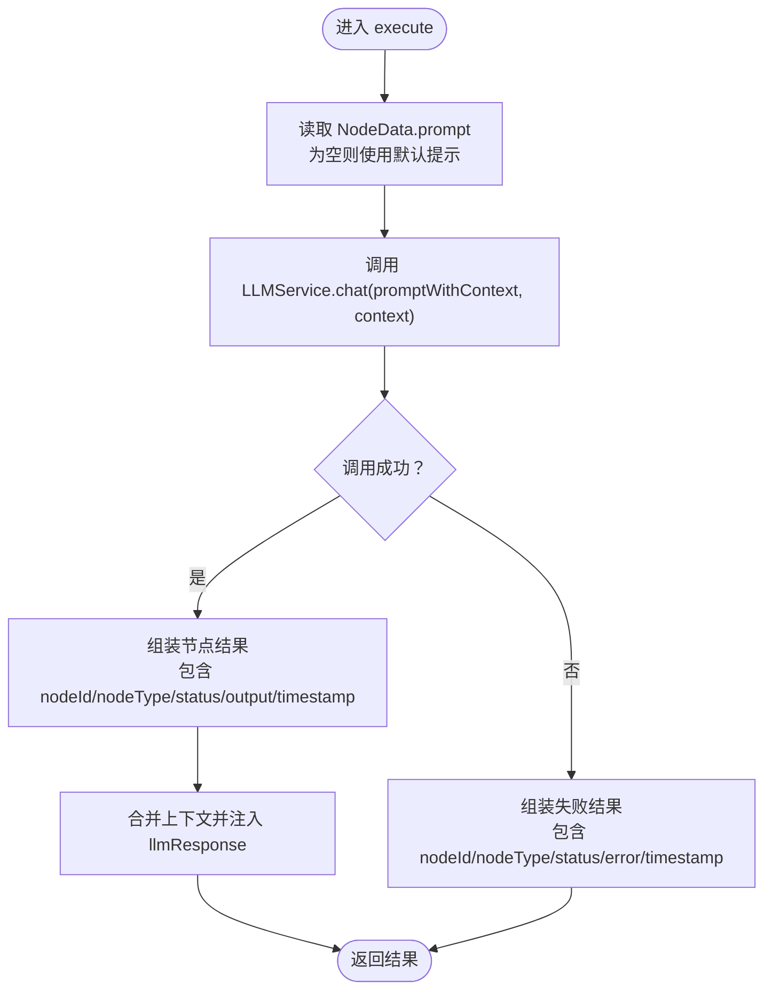
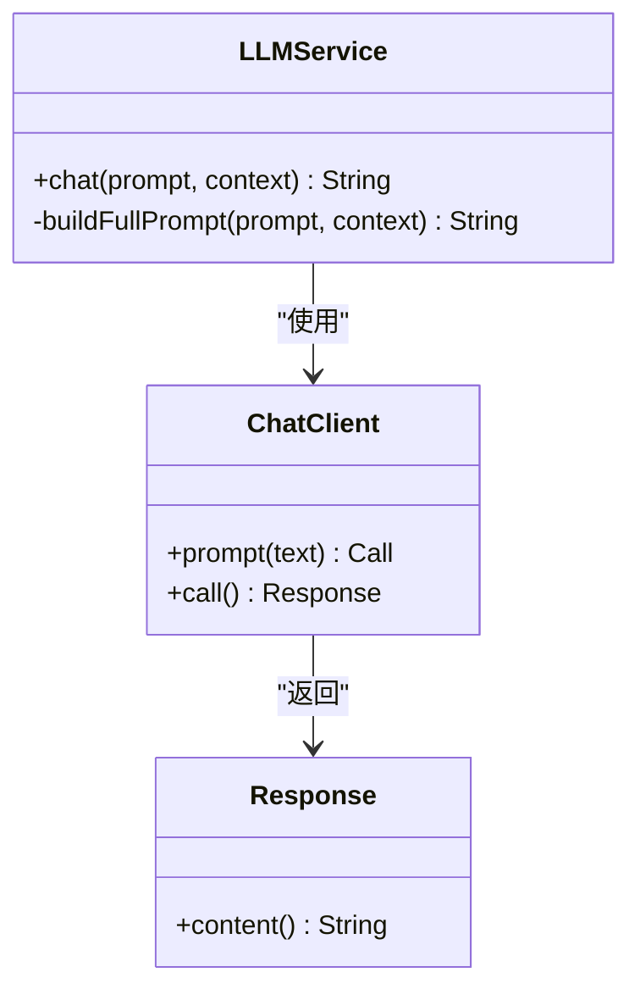
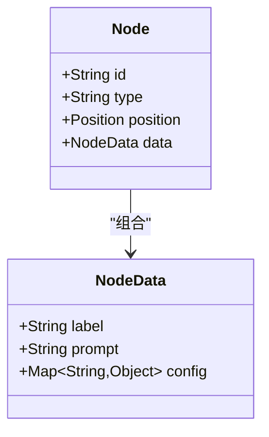
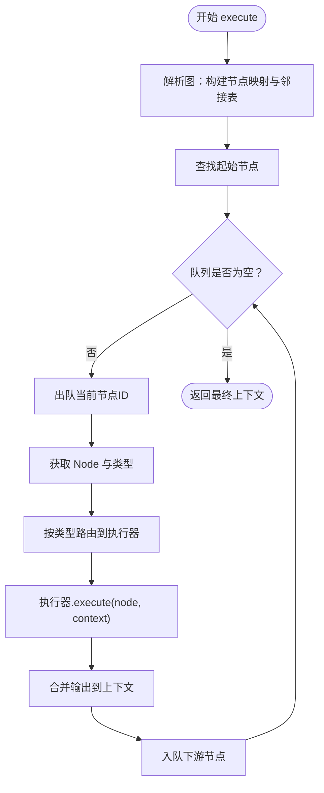
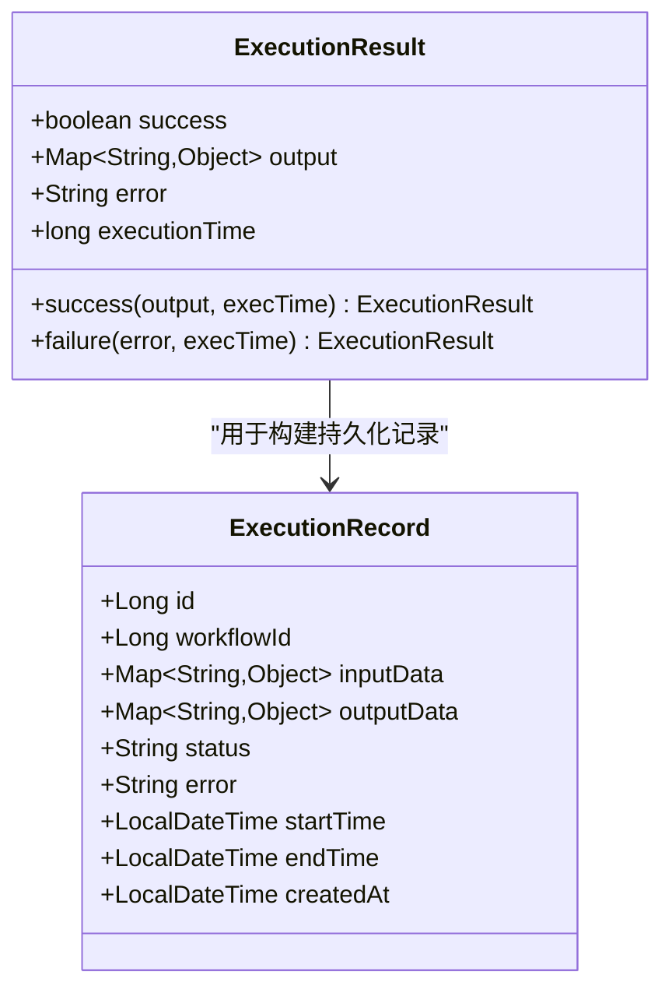
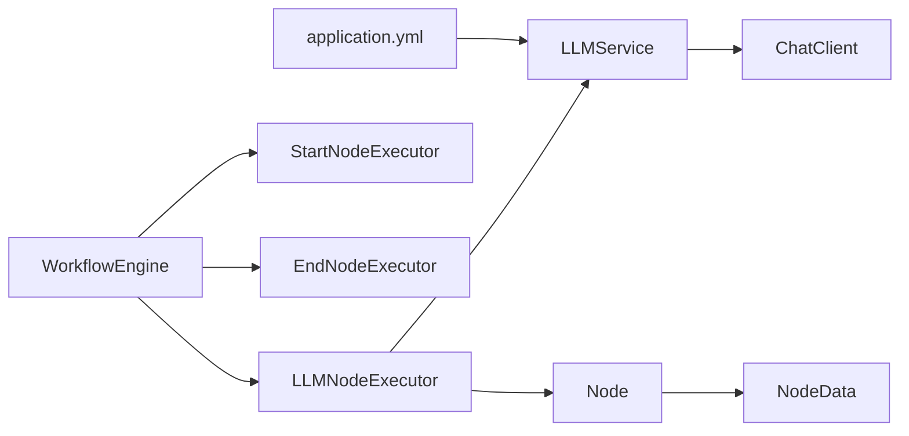

# 大模型节点执行器

<cite>
**本文引用的文件**
- [LLMNodeExecutor.java](file://backend/src/main/java/com/bokagent/engine/LLMNodeExecutor.java)
- [LLMService.java](file://backend/src/main/java/com/bokagent/service/LLMService.java)
- [NodeExecutor.java](file://backend/src/main/java/com/bokagent/engine/NodeExecutor.java)
- [Node.java](file://backend/src/main/java/com/bokagent/entity/Node.java)
- [NodeData.java](file://backend/src/main/java/com/bokagent/entity/NodeData.java)
- [ExecutionResult.java](file://backend/src/main/java/com/bokagent/engine/ExecutionResult.java)
- [WorkflowEngine.java](file://backend/src/main/java/com/bokagent/engine/WorkflowEngine.java)
- [ExecutionRecord.java](file://backend/src/main/java/com/bokagent/entity/ExecutionRecord.java)
- [application.yml](file://backend/src/main/resources/application.yml)
- [pom.xml](file://backend/pom.xml)
</cite>

## 目录
1. [简介](#简介)
2. [项目结构](#项目结构)
3. [核心组件](#核心组件)
4. [架构总览](#架构总览)
5. [详细组件分析](#详细组件分析)
6. [依赖分析](#依赖分析)
7. [性能考虑](#性能考虑)
8. [故障排除指南](#故障排除指南)
9. [结论](#结论)
10. [附录](#附录)

## 简介
本文件面向BokAgent工作流系统中的“大模型节点执行器”（LLMNodeExecutor），系统性梳理其在工作流引擎中的职责、与LLM服务的集成方式、参数传递机制、响应处理逻辑、错误重试与上下文数据流转，并给出性能优化建议与故障排除指引。目标是帮助开发者与运维人员快速理解并高效维护该执行器。

## 项目结构
后端采用Spring Boot工程，核心模块围绕“引擎-服务-实体-配置”分层组织：
- 引擎层：负责工作流解析与节点调度（含LLMNodeExecutor、StartNodeExecutor、EndNodeExecutor、WorkflowEngine等）
- 服务层：对外部大模型能力进行封装（LLMService）
- 实体层：工作流与执行记录的领域模型
- 配置层：application.yml集中管理各子系统参数（如Spring AI、缓存、超时、重试等）

图表来源
- [WorkflowEngine.java:1-171](file://backend/src/main/java/com/bokagent/engine/WorkflowEngine.java#L1-L171)
- [LLMNodeExecutor.java:1-69](file://backend/src/main/java/com/bokagent/engine/LLMNodeExecutor.java#L1-L69)
- [LLMService.java:1-67](file://backend/src/main/java/com/bokagent/service/LLMService.java#L1-L67)
- [Node.java:1-15](file://backend/src/main/java/com/bokagent/entity/Node.java#L1-L15)
- [NodeData.java:1-15](file://backend/src/main/java/com/bokagent/entity/NodeData.java#L1-L15)
- [ExecutionRecord.java:1-40](file://backend/src/main/java/com/bokagent/entity/ExecutionRecord.java#L1-L40)
- [ExecutionResult.java:1-32](file://backend/src/main/java/com/bokagent/engine/ExecutionResult.java#L1-L32)
- [application.yml:1-190](file://backend/src/main/resources/application.yml#L1-L190)

章节来源
- [pom.xml:1-175](file://backend/pom.xml#L1-L175)
- [application.yml:1-190](file://backend/src/main/resources/application.yml#L1-L190)

## 核心组件
- LLMNodeExecutor：负责执行“llm”类型节点，封装对LLMService的调用，构建节点级结果并回填上下文
- LLMService：基于Spring AI ChatClient封装外部大模型调用，拼装完整提示词（含上下文）并返回模型回复
- Node/NodeData：承载节点元数据（含prompt与config），驱动LLM节点行为
- WorkflowEngine：工作流编排器，按拓扑顺序调度各节点执行器，维护全局上下文
- ExecutionResult/ExecutionRecord：统一的执行结果与持久化记录载体

章节来源
- [LLMNodeExecutor.java:1-69](file://backend/src/main/java/com/bokagent/engine/LLMNodeExecutor.java#L1-L69)
- [LLMService.java:1-67](file://backend/src/main/java/com/bokagent/service/LLMService.java#L1-L67)
- [Node.java:1-15](file://backend/src/main/java/com/bokagent/entity/Node.java#L1-L15)
- [NodeData.java:1-15](file://backend/src/main/java/com/bokagent/entity/NodeData.java#L1-L15)
- [WorkflowEngine.java:1-171](file://backend/src/main/java/com/bokagent/engine/WorkflowEngine.java#L1-L171)
- [ExecutionResult.java:1-32](file://backend/src/main/java/com/bokagent/engine/ExecutionResult.java#L1-L32)
- [ExecutionRecord.java:1-40](file://backend/src/main/java/com/bokagent/entity/ExecutionRecord.java#L1-L40)

## 架构总览
LLM节点在工作流中的调用链路如下：

图表来源
- [WorkflowEngine.java:120-169](file://backend/src/main/java/com/bokagent/engine/WorkflowEngine.java#L120-L169)
- [LLMNodeExecutor.java:22-62](file://backend/src/main/java/com/bokagent/engine/LLMNodeExecutor.java#L22-L62)
- [LLMService.java:27-44](file://backend/src/main/java/com/bokagent/service/LLMService.java#L27-L44)

## 详细组件分析

### LLMNodeExecutor：LLM节点执行器
- 职责
  - 从NodeData提取prompt；若为空则使用默认提示
  - 调用LLMService进行对话生成
  - 组装标准节点结果（包含节点ID、类型、状态、输出、时间戳等）
  - 将LLM输出与原始上下文合并回传给上层执行器
  - 发生异常时返回失败结果（包含错误信息）
- 参数传递
  - 输入：Node（含NodeData）、执行上下文Map
  - 输出：Map<String,Object>（标准化节点结果）
- 错误处理
  - 捕获异常并返回失败节点结果，便于上层统一处理

图表来源
- [LLMNodeExecutor.java:22-62](file://backend/src/main/java/com/bokagent/engine/LLMNodeExecutor.java#L22-L62)

章节来源
- [LLMNodeExecutor.java:1-69](file://backend/src/main/java/com/bokagent/engine/LLMNodeExecutor.java#L1-L69)

### LLMService：大模型服务封装
- 职责
  - 使用Spring AI ChatClient发起模型调用
  - 构建完整提示词：先拼接上下文信息，再追加用户prompt
  - 记录日志并抛出运行时异常以便上层捕获
- 集成点
  - 通过Spring AI自动装配ChatClient
  - 由LLMNodeExecutor直接依赖注入并调用

图表来源
- [LLMService.java:16-44](file://backend/src/main/java/com/bokagent/service/LLMService.java#L16-L44)

章节来源
- [LLMService.java:1-67](file://backend/src/main/java/com/bokagent/service/LLMService.java#L1-L67)

### Node/NodeData：节点数据模型
- Node：包含节点ID、类型、位置与NodeData
- NodeData：包含label、prompt、config等字段
- LLM节点通过NodeData的prompt驱动提示词生成

图表来源
- [Node.java:9-14](file://backend/src/main/java/com/bokagent/entity/Node.java#L9-L14)
- [NodeData.java:10-14](file://backend/src/main/java/com/bokagent/entity/NodeData.java#L10-L14)

章节来源
- [Node.java:1-15](file://backend/src/main/java/com/bokagent/entity/Node.java#L1-L15)
- [NodeData.java:1-15](file://backend/src/main/java/com/bokagent/entity/NodeData.java#L1-L15)

### WorkflowEngine：工作流编排器
- 职责
  - 解析工作流图（节点、边），构建邻接表
  - 通过拓扑顺序调度各节点执行器
  - 维护全局上下文，将每个节点输出合并回上下文
- 与LLMNodeExecutor的关系
  - 依据节点类型路由到对应执行器（start/llm/end）
  - 在执行过程中将上一节点输出作为当前节点上下文

图表来源
- [WorkflowEngine.java:47-82](file://backend/src/main/java/com/bokagent/engine/WorkflowEngine.java#L47-L82)
- [WorkflowEngine.java:120-169](file://backend/src/main/java/com/bokagent/engine/WorkflowEngine.java#L120-L169)

章节来源
- [WorkflowEngine.java:1-171](file://backend/src/main/java/com/bokagent/engine/WorkflowEngine.java#L1-L171)

### 执行结果与记录
- ExecutionResult：统一的成功/失败结果封装，包含success、output、error、executionTime
- ExecutionRecord：持久化执行记录，包含inputData、outputData、status、error、时间戳等

图表来源
- [ExecutionResult.java:10-31](file://backend/src/main/java/com/bokagent/engine/ExecutionResult.java#L10-L31)
- [ExecutionRecord.java:17-39](file://backend/src/main/java/com/bokagent/entity/ExecutionRecord.java#L17-L39)

章节来源
- [ExecutionResult.java:1-32](file://backend/src/main/java/com/bokagent/engine/ExecutionResult.java#L1-L32)
- [ExecutionRecord.java:1-40](file://backend/src/main/java/com/bokagent/entity/ExecutionRecord.java#L1-L40)

## 依赖分析
- 组件耦合
  - LLMNodeExecutor依赖LLMService（通过@Autowired注入）
  - WorkflowEngine聚合多个NodeExecutor（start/llm/end），并通过类型路由
  - Node/NodeData为数据载体，被LLMNodeExecutor读取
- 外部依赖
  - Spring AI ChatClient：用于实际调用外部大模型
  - application.yml：提供模型提供商配置（OpenAI/DeepSeek/Qwen）与超时、重试、缓存等参数

图表来源
- [LLMNodeExecutor.java:19-20](file://backend/src/main/java/com/bokagent/engine/LLMNodeExecutor.java#L19-L20)
- [LLMService.java:18-19](file://backend/src/main/java/com/bokagent/service/LLMService.java#L18-L19)
- [WorkflowEngine.java:23-30](file://backend/src/main/java/com/bokagent/engine/WorkflowEngine.java#L23-L30)
- [Node.java:9-14](file://backend/src/main/java/com/bokagent/entity/Node.java#L9-L14)
- [application.yml:45-67](file://backend/src/main/resources/application.yml#L45-L67)

章节来源
- [pom.xml:29-133](file://backend/pom.xml#L29-L133)
- [application.yml:138-156](file://backend/src/main/resources/application.yml#L138-L156)

## 性能考虑
- 提示词长度控制
  - LLMService在构建完整提示词时会拼接上下文，建议在上游节点限制上下文大小，避免提示过长导致延迟与成本上升
- 超时与并发
  - application.yml中定义了LLM调用超时阈值，建议结合业务场景调整
  - Spring Task线程池配置可支撑异步任务，但LLM调用本身为阻塞I/O，需结合限流与降级策略
- 缓存策略
  - application.yml提供缓存开关与TTL（含LLM响应缓存），可在重复输入场景显著降低调用次数
- 日志与可观测性
  - LLMService与LLMNodeExecutor均输出关键日志，建议结合日志级别与采样策略平衡性能与可观测性

章节来源
- [LLMService.java:27-44](file://backend/src/main/java/com/bokagent/service/LLMService.java#L27-L44)
- [application.yml:149-162](file://backend/src/main/resources/application.yml#L149-L162)

## 故障排除指南
- 常见问题定位
  - LLM调用失败：查看LLMService日志与异常堆栈，确认模型提供商配置（API Key、Base URL、Model）是否正确
  - 上下文缺失或过大：检查NodeData.prompt与上下文合并逻辑，确保关键字段存在且长度合理
  - 执行失败返回：LLMNodeExecutor在异常时返回失败节点结果，可据此定位具体节点与错误原因
- 重试机制现状
  - 当前代码未实现显式重试逻辑；application.yml中定义了通用重试配置，但未在LLM调用路径中启用
  - 若需增强鲁棒性，可在LLMService或调用侧引入指数退避重试（参考重试配置项）
- 超时与资源
  - 如遇超时，优先检查网络连通性、模型提供商可用性与application.yml中的超时阈值设置

章节来源
- [LLMNodeExecutor.java:50-61](file://backend/src/main/java/com/bokagent/engine/LLMNodeExecutor.java#L50-L61)
- [LLMService.java:40-43](file://backend/src/main/java/com/bokagent/service/LLMService.java#L40-L43)
- [application.yml:138-156](file://backend/src/main/resources/application.yml#L138-L156)

## 结论
LLMNodeExecutor通过简洁的接口与清晰的上下文传递，将工作流编排与大模型调用有效解耦。LLMService进一步抽象外部模型调用细节，配合application.yml中的模型配置、超时与缓存策略，形成可扩展的执行体系。当前未内置重试机制，建议在关键路径引入指数退避重试以提升稳定性；同时通过提示词长度控制与缓存策略优化整体性能与成本。

## 附录
- 配置要点速览
  - 模型提供商配置：OpenAI/DeepSeek/Qwen的基础URL与模型名
  - 超时配置：工具执行、LLM调用、TTS合成、MCP请求、工作流执行
  - 缓存配置：默认TTL、工具结果TTL、LLM响应TTL
  - 重试配置：默认最大尝试次数、初始延迟、退避倍数、最大延迟、可重试异常类型

章节来源
- [application.yml:45-67](file://backend/src/main/resources/application.yml#L45-L67)
- [application.yml:138-156](file://backend/src/main/resources/application.yml#L138-L156)
- [application.yml:157-162](file://backend/src/main/resources/application.yml#L157-L162)