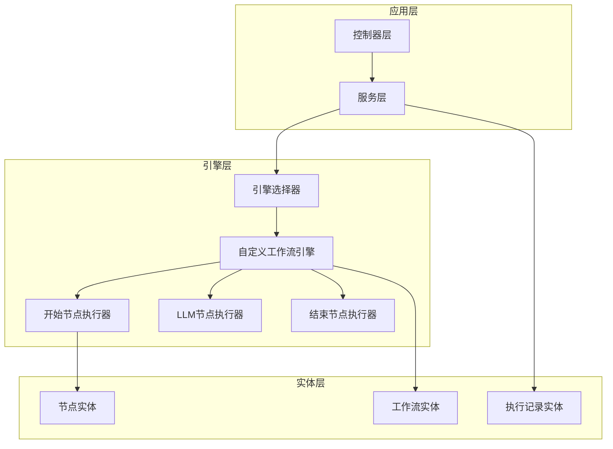
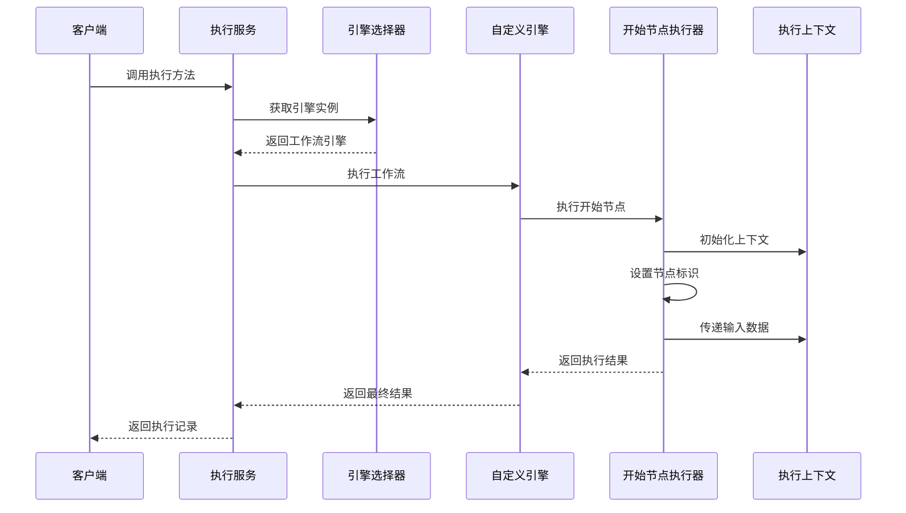
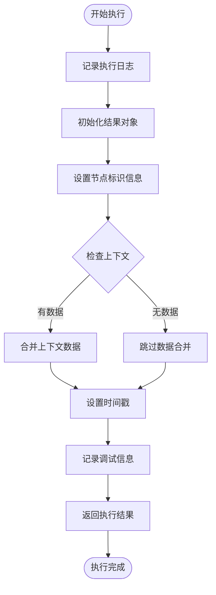
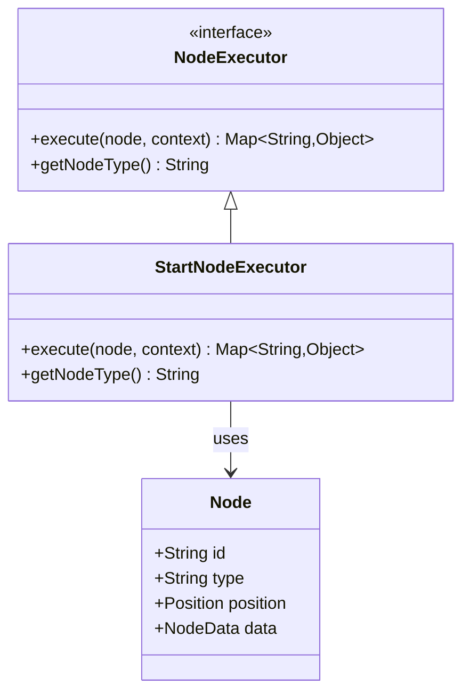
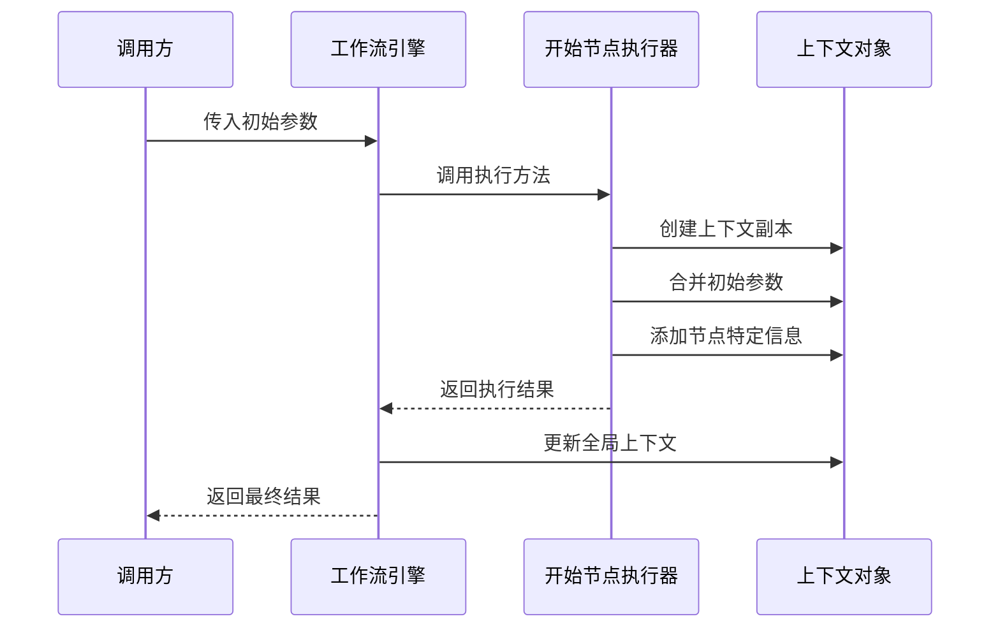
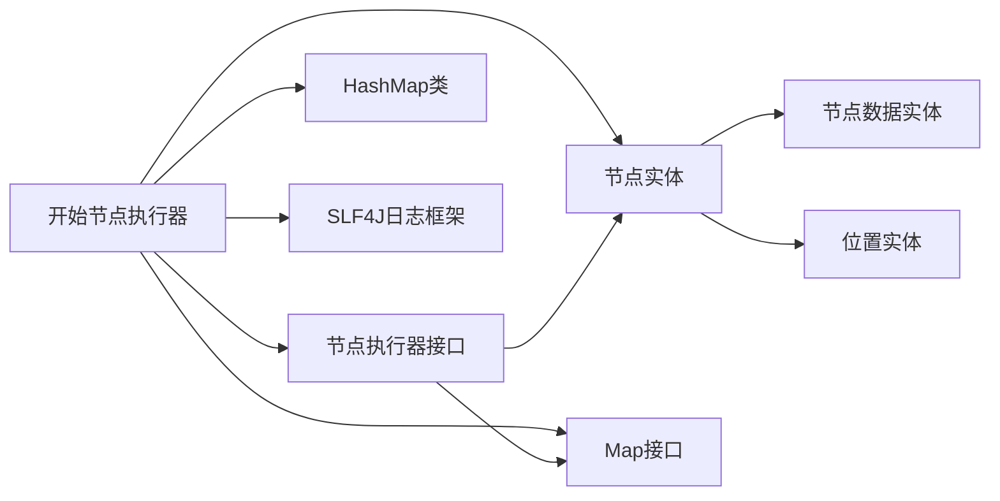

# 开始节点执行器

<cite>
**本文档引用的文件**
- [StartNodeExecutor.java](file://backend/src/main/java/com/bokagent/engine/StartNodeExecutor.java)
- [NodeExecutor.java](file://backend/src/main/java/com/bokagent/engine/NodeExecutor.java)
- [CustomWorkflowEngine.java](file://backend/src/main/java/com/bokagent/engine/CustomWorkflowEngine.java)
- [WorkflowEngineSelector.java](file://backend/src/main/java/com/bokagent/engine/WorkflowEngineSelector.java)
- [ExecutionService.java](file://backend/src/main/java/com/bokagent/service/ExecutionService.java)
- [Node.java](file://backend/src/main/java/com/bokagent/entity/Node.java)
- [NodeData.java](file://backend/src/main/java/com/bokagent/entity/NodeData.java)
- [ExecutionResult.java](file://backend/src/main/java/com/bokagent/engine/ExecutionResult.java)
- [application.yml](file://backend/src/main/resources/application.yml)
</cite>

## 目录
1. [简介](#简介)
2. [项目结构](#项目结构)
3. [核心组件](#核心组件)
4. [架构概览](#架构概览)
5. [详细组件分析](#详细组件分析)
6. [依赖关系分析](#依赖关系分析)
7. [性能考虑](#性能考虑)
8. [故障排除指南](#故障排除指南)
9. [结论](#结论)

## 简介

开始节点执行器（StartNodeExecutor）是BokAgent工作流引擎中的核心组件之一，负责处理工作流的入口节点。作为工作流执行的第一步，它承担着初始化执行环境、准备初始数据和建立执行上下文的重要职责。本文档将深入分析StartNodeExecutor的初始化逻辑、执行流程以及在整个工作流系统中的作用和地位。

## 项目结构

BokAgent采用分层架构设计，开始节点执行器位于引擎层（engine），与工作流执行器、节点执行器等组件协同工作：

**图表来源**
- [StartNodeExecutor.java:1-41](file://backend/src/main/java/com/bokagent/engine/StartNodeExecutor.java#L1-L41)
- [CustomWorkflowEngine.java:1-170](file://backend/src/main/java/com/bokagent/engine/CustomWorkflowEngine.java#L1-L170)
- [WorkflowEngineSelector.java:1-53](file://backend/src/main/java/com/bokagent/engine/WorkflowEngineSelector.java#L1-L53)

**章节来源**
- [StartNodeExecutor.java:1-41](file://backend/src/main/java/com/bokagent/engine/StartNodeExecutor.java#L1-L41)
- [CustomWorkflowEngine.java:1-170](file://backend/src/main/java/com/bokagent/engine/CustomWorkflowEngine.java#L1-L170)

## 核心组件

开始节点执行器作为节点执行器接口的具体实现，具有以下核心特性：

### 接口实现
- 实现NodeExecutor接口，提供标准的节点执行能力
- 支持统一的执行模式和上下文管理
- 提供标准化的节点类型标识

### 执行能力
- 处理工作流的初始状态设置
- 管理执行上下文的数据传递
- 生成标准化的执行结果格式

### 类型标识
- 返回固定的节点类型标识"start"
- 确保与其他节点执行器的一致性
- 支持工作流引擎的节点路由机制

**章节来源**
- [NodeExecutor.java:1-24](file://backend/src/main/java/com/bokagent/engine/NodeExecutor.java#L1-L24)
- [StartNodeExecutor.java:15-40](file://backend/src/main/java/com/bokagent/engine/StartNodeExecutor.java#L15-L40)

## 架构概览

开始节点执行器在整个工作流系统中扮演着关键的入口角色，其架构关系如下：

**图表来源**
- [ExecutionService.java:39-92](file://backend/src/main/java/com/bokagent/service/ExecutionService.java#L39-L92)
- [CustomWorkflowEngine.java:40-76](file://backend/src/main/java/com/bokagent/engine/CustomWorkflowEngine.java#L40-L76)
- [StartNodeExecutor.java:17-34](file://backend/src/main/java/com/bokagent/engine/StartNodeExecutor.java#L17-L34)

## 详细组件分析

### 开始节点执行器实现

开始节点执行器是一个轻量级的组件，专注于工作流的初始化和上下文建立：

#### 核心执行逻辑

**图表来源**
- [StartNodeExecutor.java:18-34](file://backend/src/main/java/com/bokagent/engine/StartNodeExecutor.java#L18-L34)

#### 初始化过程

开始节点执行器的初始化过程相对简单，主要包含以下步骤：

1. **日志记录**：记录开始节点的执行信息，便于调试和监控
2. **结果对象创建**：创建标准化的结果映射对象
3. **节点标识设置**：设置固定的节点类型标识"start"
4. **状态初始化**：设置执行状态为"started"
5. **时间戳记录**：记录执行的时间信息
6. **上下文数据合并**：将传入的上下文数据合并到结果中

#### 上下文数据处理

开始节点执行器支持灵活的上下文数据处理机制：

- **空值检查**：对传入的上下文进行null和empty检查
- **数据合并**：使用putAll方法将上下文数据合并到结果中
- **数据完整性**：确保原始上下文数据不被破坏
- **类型保持**：保持原始数据的类型和结构

**章节来源**
- [StartNodeExecutor.java:17-34](file://backend/src/main/java/com/bokagent/engine/StartNodeExecutor.java#L17-L34)

### 节点类型标识系统

开始节点执行器通过getNodeType方法提供标准化的节点类型标识：

#### 标识获取机制

**图表来源**
- [NodeExecutor.java:9-23](file://backend/src/main/java/com/bokagent/engine/NodeExecutor.java#L9-L23)
- [StartNodeExecutor.java:36-39](file://backend/src/main/java/com/bokagent/engine/StartNodeExecutor.java#L36-L39)
- [Node.java:9-14](file://backend/src/main/java/com/bokagent/entity/Node.java#L9-L14)

#### 唯一性保证

节点类型标识的唯一性和一致性通过以下机制保证：

1. **固定字符串返回**：getNodeType方法始终返回"start"
2. **接口约束**：NodeExecutor接口定义了标准化的标识规范
3. **工作流引擎路由**：自定义工作流引擎根据类型标识路由到相应的执行器
4. **配置验证**：引擎启动时注册所有节点执行器，确保类型标识的唯一性

**章节来源**
- [StartNodeExecutor.java:36-39](file://backend/src/main/java/com/bokagent/engine/StartNodeExecutor.java#L36-L39)
- [CustomWorkflowEngine.java:33-38](file://backend/src/main/java/com/bokagent/engine/CustomWorkflowEngine.java#L33-L38)

### 执行上下文传递机制

开始节点执行器实现了完整的上下文传递机制，确保数据在工作流执行过程中的连续性：

#### 初始参数接收和处理

**图表来源**
- [CustomWorkflowEngine.java:63-64](file://backend/src/main/java/com/bokagent/engine/CustomWorkflowEngine.java#L63-L64)
- [StartNodeExecutor.java:27-30](file://backend/src/main/java/com/bokagent/engine/StartNodeExecutor.java#L27-L30)

#### 数据传递策略

开始节点执行器采用以下策略处理数据传递：

1. **数据完整性**：保持原始数据的完整性和准确性
2. **类型保持**：确保数据类型在传递过程中不发生变化
3. **内存安全**：创建数据副本，避免外部修改影响内部状态
4. **性能优化**：使用高效的合并操作减少内存分配

**章节来源**
- [StartNodeExecutor.java:27-30](file://backend/src/main/java/com/bokagent/engine/StartNodeExecutor.java#L27-L30)
- [CustomWorkflowEngine.java:125-160](file://backend/src/main/java/com/bokagent/engine/CustomWorkflowEngine.java#L125-L160)

### 执行环境配置

开始节点执行器的执行环境配置相对简单，主要包含以下方面：

#### 环境初始化

- **日志配置**：使用SLF4J日志框架进行详细的执行日志记录
- **Spring集成**：作为Spring组件自动注册到IoC容器
- **线程安全**：无共享状态，天然线程安全
- **依赖注入**：通过构造函数注入所需的依赖

#### 执行环境要求

- **Java运行时**：需要Java 8或更高版本
- **Spring框架**：需要Spring Boot运行时环境
- **内存要求**：轻量级执行器，内存占用极小
- **并发支持**：支持多线程并发执行

**章节来源**
- [StartNodeExecutor.java:13-15](file://backend/src/main/java/com/bokagent/engine/StartNodeExecutor.java#L13-L15)

## 依赖关系分析

开始节点执行器的依赖关系相对简单，主要依赖于核心的实体类和接口：

**图表来源**
- [StartNodeExecutor.java:3-8](file://backend/src/main/java/com/bokagent/engine/StartNodeExecutor.java#L3-L8)
- [NodeExecutor.java:3-4](file://backend/src/main/java/com/bokagent/engine/NodeExecutor.java#L3-L4)
- [Node.java:9-14](file://backend/src/main/java/com/bokagent/entity/Node.java#L9-L14)

### 直接依赖

开始节点执行器的直接依赖包括：

1. **NodeExecutor接口**：提供标准化的节点执行能力
2. **Node实体类**：包含节点的基本信息和配置
3. **SLF4J日志框架**：提供结构化的日志记录能力
4. **Java集合框架**：使用HashMap和Map接口进行数据处理

### 间接依赖

通过工作流引擎的依赖关系，开始节点执行器还间接依赖于：

1. **自定义工作流引擎**：提供执行环境和上下文管理
2. **执行服务**：提供工作流执行的协调和调度
3. **Spring容器**：提供依赖注入和生命周期管理

**章节来源**
- [StartNodeExecutor.java:3-8](file://backend/src/main/java/com/bokagent/engine/StartNodeExecutor.java#L3-L8)
- [CustomWorkflowEngine.java:22-29](file://backend/src/main/java/com/bokagent/engine/CustomWorkflowEngine.java#L22-L29)

## 性能考虑

开始节点执行器作为工作流执行的第一个节点，其性能表现直接影响整个工作流的执行效率：

### 时间复杂度分析

- **执行时间**：O(n)，其中n为上下文数据项的数量
- **空间复杂度**：O(n)，用于存储合并后的上下文数据
- **内存分配**：创建单个HashMap实例和数据副本

### 性能优化建议

1. **数据预处理**：在调用开始节点之前对输入数据进行必要的预处理
2. **内存管理**：合理控制上下文数据的大小，避免过大的数据集
3. **日志级别**：在生产环境中适当调整日志级别以减少I/O开销
4. **并发执行**：利用开始节点执行器的线程安全性支持并发执行

### 内存使用分析

开始节点执行器的内存使用主要包括：

- **对象开销**：HashMap实例和基本数据结构的开销
- **数据复制**：上下文数据的完整复制
- **字符串常量**：固定的节点类型标识和状态信息
- **日志缓冲**：SLF4J的日志记录缓冲

## 故障排除指南

### 常见问题及解决方案

#### 节点类型识别问题

**问题描述**：工作流引擎无法正确识别开始节点

**可能原因**：
- 节点类型标识不正确
- 节点配置错误
- 引擎注册问题

**解决方案**：
1. 检查节点的type字段是否为"start"
2. 验证节点执行器的注册状态
3. 确认工作流引擎的配置正确

#### 上下文数据丢失

**问题描述**：传递给开始节点的上下文数据在执行后丢失

**可能原因**：
- 上下文数据格式不正确
- 数据类型转换问题
- 内存溢出

**解决方案**：
1. 验证输入数据的JSON格式
2. 检查数据类型兼容性
3. 监控内存使用情况

#### 执行异常处理

**问题描述**：开始节点执行过程中发生异常

**可能原因**：
- 空指针异常
- 数据格式错误
- 系统资源不足

**解决方案**：
1. 添加适当的异常处理机制
2. 验证输入数据的有效性
3. 检查系统资源使用情况

**章节来源**
- [StartNodeExecutor.java:18-34](file://backend/src/main/java/com/bokagent/engine/StartNodeExecutor.java#L18-L34)
- [CustomWorkflowEngine.java:71-75](file://backend/src/main/java/com/bokagent/engine/CustomWorkflowEngine.java#L71-L75)

## 结论

开始节点执行器作为BokAgent工作流系统的核心组件，虽然实现相对简单，但在整个执行流程中发挥着至关重要的作用。它通过标准化的节点类型标识、灵活的上下文数据处理和可靠的执行环境配置，为工作流的顺利执行奠定了坚实的基础。

### 主要优势

1. **简单可靠**：实现简洁，易于理解和维护
2. **标准化**：遵循统一的接口规范，确保一致性
3. **扩展性强**：支持灵活的上下文数据处理
4. **性能优异**：轻量级设计，执行效率高

### 最佳实践建议

1. **正确的节点配置**：确保开始节点的type字段设置为"start"
2. **合理的数据传递**：提供必要的初始参数，避免冗余数据
3. **适当的日志配置**：在开发和生产环境中使用合适的日志级别
4. **监控和调试**：利用详细的日志信息进行问题诊断和性能优化

开始节点执行器的设计体现了BokAgent项目注重实用性和可维护性的设计理念，为构建复杂的工作流系统提供了稳定可靠的基础组件。