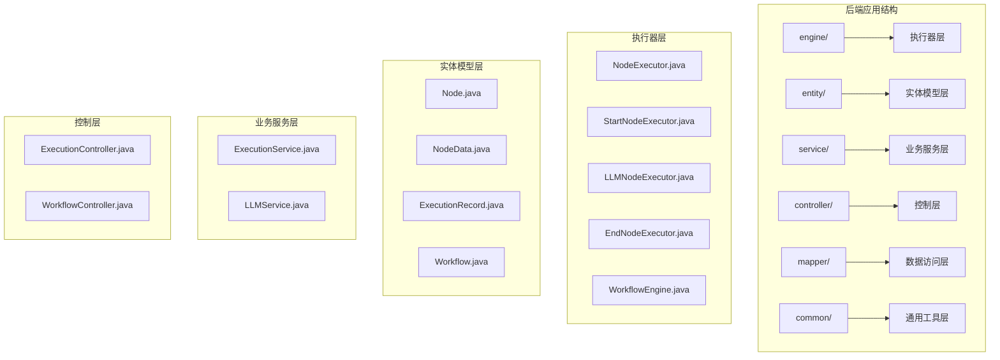
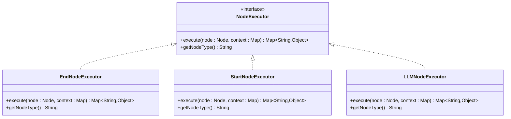
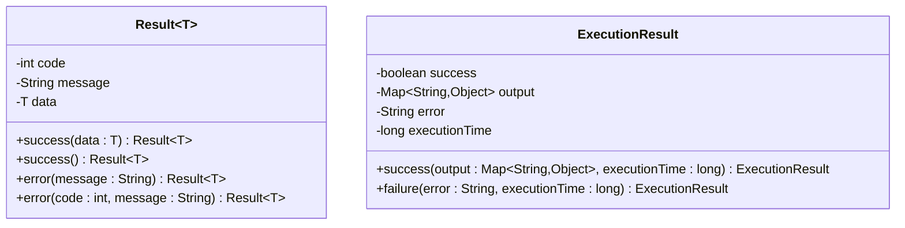
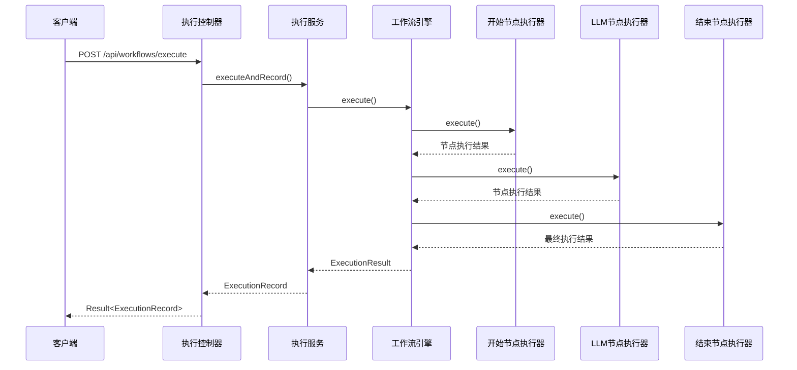
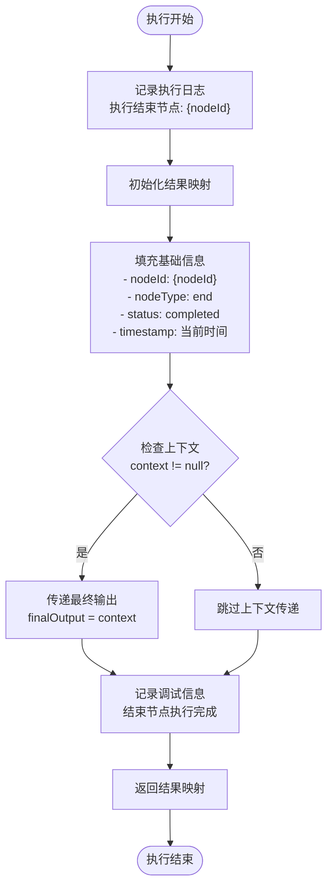
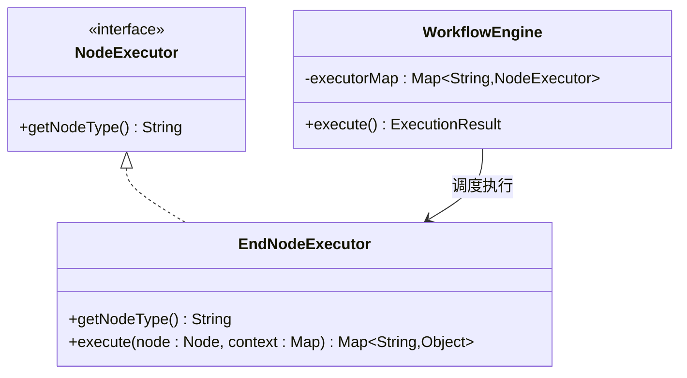
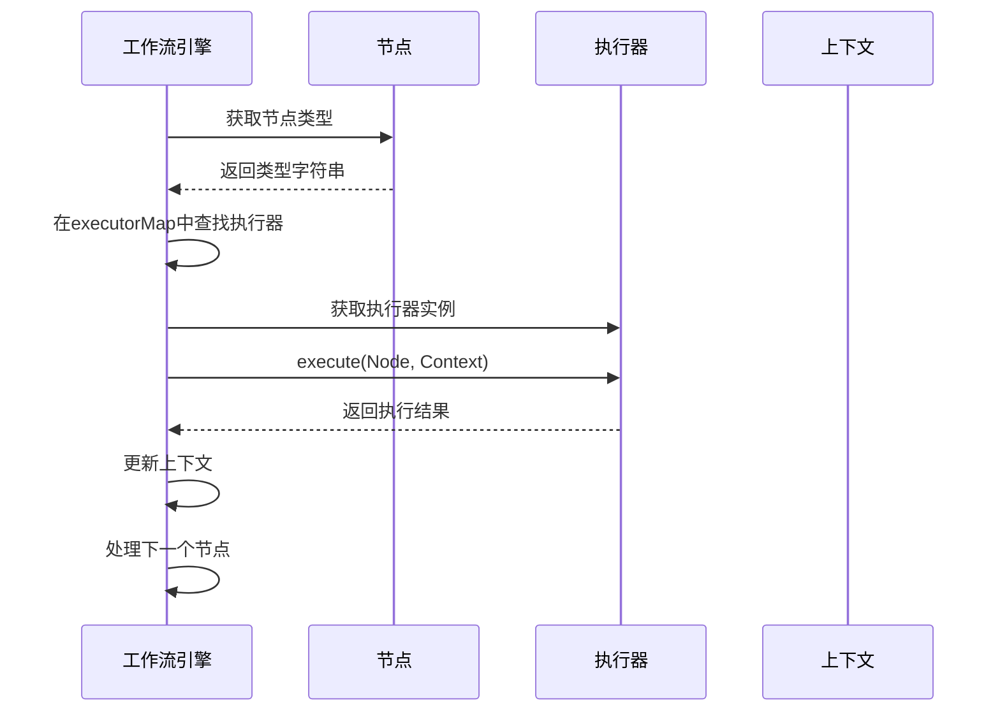
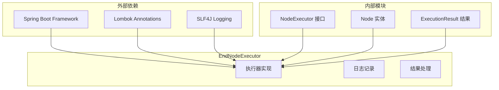

# 结束节点执行器

<cite>
**本文档引用的文件**
- [EndNodeExecutor.java](file://backend/src/main/java/com/bokagent/engine/EndNodeExecutor.java)
- [NodeExecutor.java](file://backend/src/main/java/com/bokagent/engine/NodeExecutor.java)
- [ExecutionResult.java](file://backend/src/main/java/com/bokagent/engine/ExecutionResult.java)
- [Result.java](file://backend/src/main/java/com/bokagent/common/Result.java)
- [Node.java](file://backend/src/main/java/com/bokagent/entity/Node.java)
- [NodeData.java](file://backend/src/main/java/com/bokagent/entity/NodeData.java)
- [WorkflowEngine.java](file://backend/src/main/java/com/bokagent/engine/WorkflowEngine.java)
- [StartNodeExecutor.java](file://backend/src/main/java/com/bokagent/engine/StartNodeExecutor.java)
- [LLMNodeExecutor.java](file://backend/src/main/java/com/bokagent/engine/LLMNodeExecutor.java)
- [ExecutionService.java](file://backend/src/main/java/com/bokagent/service/ExecutionService.java)
- [ExecutionRecord.java](file://backend/src/main/java/com/bokagent/entity/ExecutionRecord.java)
- [ExecutionController.java](file://backend/src/main/java/com/bokagent/controller/ExecutionController.java)
- [application.yml](file://backend/src/main/resources/application.yml)
- [pom.xml](file://backend/pom.xml)
</cite>

## 目录
1. [简介](#简介)
2. [项目结构](#项目结构)
3. [核心组件](#核心组件)
4. [架构概览](#架构概览)
5. [详细组件分析](#详细组件分析)
6. [依赖关系分析](#依赖关系分析)
7. [性能考虑](#性能考虑)
8. [故障排除指南](#故障排除指南)
9. [结论](#结论)

## 简介

结束节点执行器（EndNodeExecutor）是BokAgent工作流引擎中的关键组件，负责处理工作流的最终节点。该执行器在工作流执行过程中扮演着至关重要的角色，它不仅标志着工作流的结束，还负责收集和格式化整个工作流的最终输出结果。

BokAgent是一个基于Spring Boot构建的AI代理工作流编排系统，支持多种节点类型（开始节点、LLM节点、结束节点），通过可扩展的执行器架构实现灵活的工作流编排。结束节点执行器作为执行器接口的具体实现，遵循统一的执行规范，确保工作流执行结果的一致性和标准化。

## 项目结构

BokAgent采用标准的Spring Boot项目结构，核心代码位于`backend/src/main/java/com/bokagent/`目录下。项目主要分为以下几个层次：



**图表来源**
- [EndNodeExecutor.java:1-41](file://backend/src/main/java/com/bokagent/engine/EndNodeExecutor.java#L1-L41)
- [NodeExecutor.java:1-24](file://backend/src/main/java/com/bokagent/engine/NodeExecutor.java#L1-L24)

**章节来源**
- [EndNodeExecutor.java:1-41](file://backend/src/main/java/com/bokagent/engine/EndNodeExecutor.java#L1-L41)
- [NodeExecutor.java:1-24](file://backend/src/main/java/com/bokagent/engine/NodeExecutor.java#L1-L24)

## 核心组件

### 执行器接口体系

BokAgent采用统一的执行器接口设计，所有节点执行器都必须实现`NodeExecutor`接口。该接口定义了两个核心方法：`execute()`用于执行节点逻辑，`getNodeType()`用于返回节点类型标识。



**图表来源**
- [NodeExecutor.java:9-23](file://backend/src/main/java/com/bokagent/engine/NodeExecutor.java#L9-L23)
- [EndNodeExecutor.java:15-39](file://backend/src/main/java/com/bokagent/engine/EndNodeExecutor.java#L15-L39)
- [StartNodeExecutor.java:15-39](file://backend/src/main/java/com/bokagent/engine/StartNodeExecutor.java#L15-L39)
- [LLMNodeExecutor.java:17-67](file://backend/src/main/java/com/bokagent/engine/LLMNodeExecutor.java#L17-L67)

### 统一响应结果模型

系统采用统一的响应结果模型`Result<T>`，为所有API接口提供一致的响应格式。该模型包含状态码、消息和数据三个核心字段，并提供了静态工厂方法来创建不同类型的响应。



**图表来源**
- [Result.java:9-41](file://backend/src/main/java/com/bokagent/common/Result.java#L9-L41)
- [ExecutionResult.java:10-31](file://backend/src/main/java/com/bokagent/engine/ExecutionResult.java#L10-L31)

**章节来源**
- [Result.java:1-42](file://backend/src/main/java/com/bokagent/common/Result.java#L1-L42)
- [ExecutionResult.java:1-32](file://backend/src/main/java/com/bokagent/engine/ExecutionResult.java#L1-L32)

## 架构概览

BokAgent的工作流执行架构采用分层设计，从上到下依次为控制层、业务服务层、执行器层和实体模型层。结束节点执行器在整个执行链路中处于最终位置，负责收集和处理前序节点的输出结果。



**图表来源**
- [ExecutionController.java:39-60](file://backend/src/main/java/com/bokagent/controller/ExecutionController.java#L39-L60)
- [ExecutionService.java:39-91](file://backend/src/main/java/com/bokagent/service/ExecutionService.java#L39-L91)
- [WorkflowEngine.java:47-82](file://backend/src/main/java/com/bokagent/engine/WorkflowEngine.java#L47-L82)
- [StartNodeExecutor.java:18-34](file://backend/src/main/java/com/bokagent/engine/StartNodeExecutor.java#L18-L34)
- [LLMNodeExecutor.java:23-62](file://backend/src/main/java/com/bokagent/engine/LLMNodeExecutor.java#L23-L62)
- [EndNodeExecutor.java:18-34](file://backend/src/main/java/com/bokagent/engine/EndNodeExecutor.java#L18-L34)

**章节来源**
- [ExecutionController.java:1-81](file://backend/src/main/java/com/bokagent/controller/ExecutionController.java#L1-L81)
- [ExecutionService.java:1-113](file://backend/src/main/java/com/bokagent/service/ExecutionService.java#L1-L113)
- [WorkflowEngine.java:1-171](file://backend/src/main/java/com/bokagent/engine/WorkflowEngine.java#L1-L171)

## 详细组件分析

### 结束节点执行器实现

结束节点执行器是工作流执行器体系中的最终节点，负责处理工作流的收尾工作。其核心职责包括节点类型标识、执行状态管理、结果聚合和数据格式化。

#### 执行逻辑分析

结束节点执行器的执行过程遵循以下步骤：

1. **日志记录**：记录节点执行的开始和完成信息
2. **结果初始化**：创建结果映射对象
3. **基础信息填充**：设置节点ID、类型、状态和时间戳
4. **上下文传递**：将最终输出结果传递给后续处理
5. **结果返回**：返回标准化的执行结果



**图表来源**
- [EndNodeExecutor.java:18-34](file://backend/src/main/java/com/bokagent/engine/EndNodeExecutor.java#L18-L34)

#### 节点类型标识机制

结束节点执行器通过`getNodeType()`方法实现节点类型标识，返回固定字符串"end"。这个标识符在整个执行器注册和调度系统中发挥关键作用：



**图表来源**
- [NodeExecutor.java:19-22](file://backend/src/main/java/com/bokagent/engine/NodeExecutor.java#L19-L22)
- [EndNodeExecutor.java:37-39](file://backend/src/main/java/com/bokagent/engine/EndNodeExecutor.java#L37-L39)
- [WorkflowEngine.java:32-39](file://backend/src/main/java/com/bokagent/engine/WorkflowEngine.java#L32-L39)

#### 执行状态标记机制

结束节点执行器采用标准化的状态标记机制，确保执行结果的一致性：

| 状态标识 | 含义 | 使用场景 |
|---------|------|----------|
| `nodeType` | "end" | 节点类型标识，用于执行器选择 |
| `status` | "completed" | 执行状态，表示节点执行成功 |
| `timestamp` | 系统毫秒时间戳 | 执行时间记录，用于性能监控 |

**章节来源**
- [EndNodeExecutor.java:1-41](file://backend/src/main/java/com/bokagent/engine/EndNodeExecutor.java#L1-L41)

### 节点类型验证过程

工作流引擎通过节点类型验证确保执行器正确匹配。验证过程包括以下步骤：

1. **节点类型提取**：从节点定义中获取类型信息
2. **执行器查找**：在执行器映射表中查找对应执行器
3. **执行器验证**：确认执行器实例存在且有效
4. **执行器调用**：调用执行器的execute方法



**图表来源**
- [WorkflowEngine.java:150-154](file://backend/src/main/java/com/bokagent/engine/WorkflowEngine.java#L150-L154)
- [WorkflowEngine.java:157-161](file://backend/src/main/java/com/bokagent/engine/WorkflowEngine.java#L157-L161)

**章节来源**
- [WorkflowEngine.java:1-171](file://backend/src/main/java/com/bokagent/engine/WorkflowEngine.java#L1-L171)

### 执行结果处理流程

结束节点执行器的执行结果处理遵循统一的标准化流程，确保所有节点输出的一致性：

#### 输出数据格式化

结束节点执行器将上下文数据格式化为标准化的输出结构：

```mermaid
flowchart LR
subgraph "输入上下文"
A[Map<String, Object> context]
end
subgraph "格式化处理"
B[创建结果映射]
C[填充基础字段]
D[传递最终输出]
end
subgraph "标准化输出"
E[nodeId: 节点ID]
F[nodeType: "end"]
G[status: "completed"]
H[timestamp: 时间戳]
I[finalOutput: 上下文数据]
end
A --> B --> C --> D --> E
D --> F
D --> G
D --> H
D --> I
```

**图表来源**
- [EndNodeExecutor.java:21-30](file://backend/src/main/java/com/bokagent/engine/EndNodeExecutor.java#L21-L30)

#### 结果聚合机制

在工作流执行过程中，结束节点执行器接收来自前序节点的聚合结果。聚合机制通过上下文传递实现：

1. **上下文继承**：继承前序节点的输出结果
2. **结果合并**：将新的执行结果与现有上下文合并
3. **状态更新**：更新执行状态和时间戳
4. **最终输出**：生成标准化的最终输出

**章节来源**
- [EndNodeExecutor.java:28-30](file://backend/src/main/java/com/bokagent/engine/EndNodeExecutor.java#L28-L30)

### 数据清理和格式标准化

结束节点执行器在处理执行结果时遵循严格的数据清理和格式标准化原则：

#### 数据清理策略

- **空值处理**：检查上下文是否为空，避免null引用
- **类型转换**：确保输出数据类型的一致性
- **冗余数据过滤**：移除不必要的中间数据

#### 格式标准化

- **字段命名**：采用统一的字段命名约定
- **数据结构**：保持输出结构的标准化
- **时间格式**：使用统一的时间戳格式

**章节来源**
- [EndNodeExecutor.java:28-30](file://backend/src/main/java/com/bokagent/engine/EndNodeExecutor.java#L28-L30)

### 异常结果处理策略

虽然结束节点执行器本身不涉及复杂的业务逻辑，但系统整体采用了完善的异常处理机制：

#### 异常传播机制

1. **执行器异常**：在执行器层面捕获并处理异常
2. **结果包装**：将异常信息包装为标准化的错误结果
3. **状态标记**：设置相应的执行状态标识
4. **日志记录**：详细记录异常信息用于调试

#### 错误信息格式化

系统采用统一的错误信息格式，包含：
- 错误代码：标准化的HTTP状态码或业务状态码
- 错误消息：人类可读的错误描述
- 错误详情：技术性的错误堆栈信息

**章节来源**
- [LLMNodeExecutor.java:50-61](file://backend/src/main/java/com/bokagent/engine/LLMNodeExecutor.java#L50-L61)

## 依赖关系分析

BokAgent的结束节点执行器依赖关系相对简单，主要依赖于核心的执行器接口和实体模型。



**图表来源**
- [EndNodeExecutor.java:3-5](file://backend/src/main/java/com/bokagent/engine/EndNodeExecutor.java#L3-L5)
- [NodeExecutor.java:1-8](file://backend/src/main/java/com/bokagent/engine/NodeExecutor.java#L1-L8)
- [Node.java:1-15](file://backend/src/main/java/com/bokagent/entity/Node.java#L1-L15)

### 组件耦合度分析

结束节点执行器具有较低的组件耦合度，主要体现在：

1. **接口依赖**：仅依赖抽象的NodeExecutor接口
2. **实体依赖**：依赖标准的Node实体模型
3. **无循环依赖**：不依赖其他执行器实现
4. **单一职责**：专注于结束节点的执行逻辑

### 外部依赖管理

项目使用Maven进行依赖管理，主要依赖包括：

- **Spring Boot Starter Web**：提供Web应用基础功能
- **Lombok**：简化Java代码编写
- **SLF4J**：提供统一的日志接口
- **MyBatis-Plus**：数据库访问层框架

**章节来源**
- [pom.xml:29-132](file://backend/pom.xml#L29-L132)

## 性能考虑

结束节点执行器的性能特点主要体现在其简洁的执行逻辑和高效的内存使用。

### 执行效率优化

1. **内存使用**：使用HashMap进行结果存储，内存占用最小化
2. **计算复杂度**：O(1)时间复杂度，执行速度快
3. **线程安全**：无共享状态，天然线程安全
4. **资源释放**：执行完成后自动释放内存

### 并发处理能力

结束节点执行器支持高并发执行，具备以下特性：

- **无状态设计**：每个执行都是独立的
- **快速响应**：执行时间短，响应速度快
- **可扩展性**：可以轻松扩展到多核处理器
- **负载均衡**：支持分布式部署

## 故障排除指南

### 常见问题诊断

#### 节点类型识别失败

**问题症状**：工作流执行时找不到对应的执行器

**可能原因**：
1. 节点类型配置错误
2. 执行器注册失败
3. 节点类型大小写不匹配

**解决方案**：
1. 检查节点定义中的type字段
2. 验证执行器是否正确注册到executorMap
3. 确保节点类型与执行器返回的类型标识一致

#### 上下文数据丢失

**问题症状**：结束节点无法获取前序节点的输出数据

**可能原因**：
1. 上下文传递机制失效
2. 节点执行顺序错误
3. 数据序列化/反序列化问题

**解决方案**：
1. 检查工作流的拓扑结构
2. 验证节点间的连接关系
3. 确认数据格式兼容性

#### 执行状态异常

**问题症状**：执行结果显示为失败状态

**可能原因**：
1. 异常处理机制触发
2. 超时设置过短
3. 资源不足

**解决方案**：
1. 检查系统日志获取详细错误信息
2. 调整超时参数设置
3. 监控系统资源使用情况

**章节来源**
- [WorkflowEngine.java:151-154](file://backend/src/main/java/com/bokagent/engine/WorkflowEngine.java#L151-L154)

## 结论

结束节点执行器作为BokAgent工作流引擎的重要组成部分，展现了优秀的软件设计原则：

### 设计优势

1. **简洁性**：实现了最小化的执行逻辑，专注于核心功能
2. **一致性**：遵循统一的执行器接口规范，保证行为一致性
3. **可扩展性**：基于接口设计，易于扩展新的节点类型
4. **可靠性**：完善的异常处理和日志记录机制

### 技术特点

- **标准化输出**：提供统一的执行结果格式
- **高效执行**：O(1)时间复杂度，性能优异
- **易于集成**：与整个执行器体系无缝集成
- **可维护性**：清晰的代码结构和文档

### 应用价值

结束节点执行器在工作流编排系统中发挥着关键作用：
- **结果汇聚**：收集和整理整个工作流的最终输出
- **状态标记**：提供明确的执行状态标识
- **数据标准化**：确保输出数据格式的一致性
- **错误处理**：为异常情况提供标准化的处理机制

通过精心设计的架构和实现，结束节点执行器为BokAgent提供了稳定可靠的工作流执行能力，是整个系统能够高效运行的重要保障。