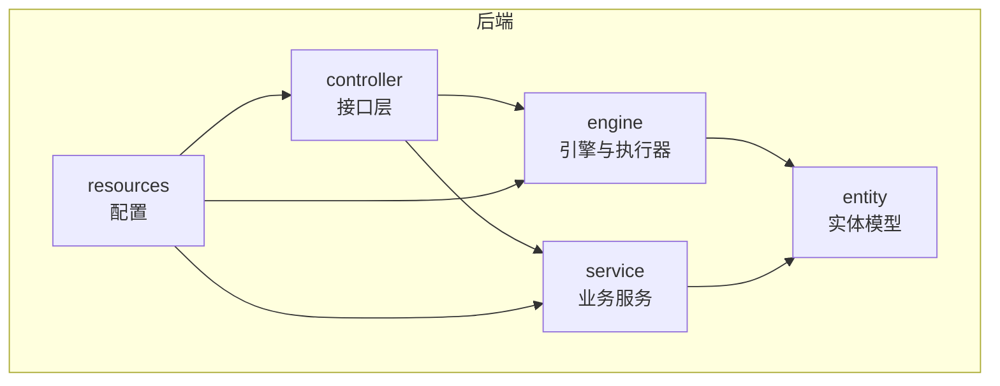
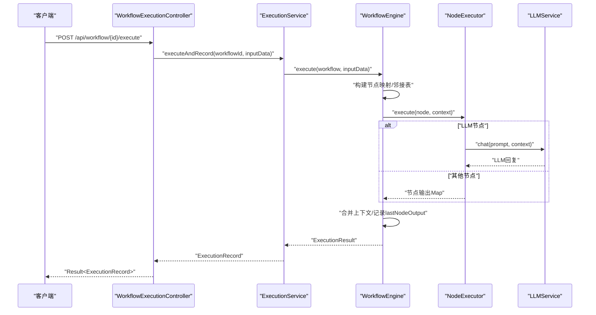
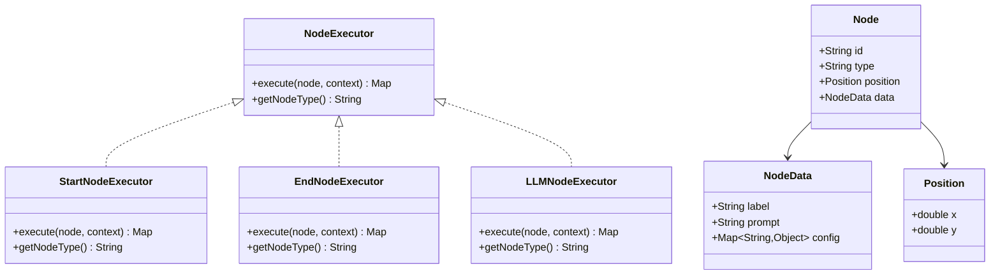
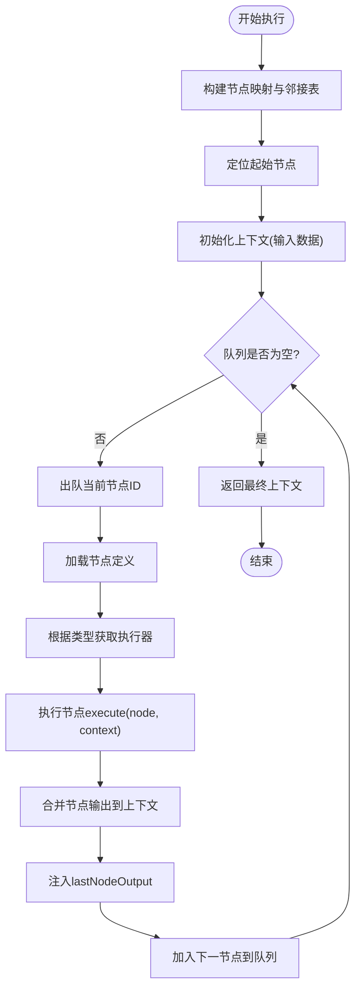
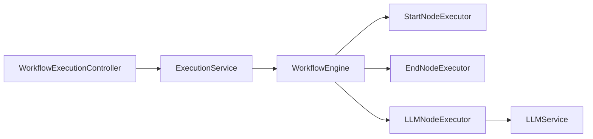

# 自定义节点执行器开发

<cite>
**本文档引用的文件**
- [NodeExecutor.java](file://backend/src/main/java/com/bokagent/engine/NodeExecutor.java)
- [ExecutionResult.java](file://backend/src/main/java/com/bokagent/engine/ExecutionResult.java)
- [WorkflowEngine.java](file://backend/src/main/java/com/bokagent/engine/WorkflowEngine.java)
- [StartNodeExecutor.java](file://backend/src/main/java/com/bokagent/engine/StartNodeExecutor.java)
- [EndNodeExecutor.java](file://backend/src/main/java/com/bokagent/engine/EndNodeExecutor.java)
- [LLMNodeExecutor.java](file://backend/src/main/java/com/bokagent/engine/LLMNodeExecutor.java)
- [Node.java](file://backend/src/main/java/com/bokagent/entity/Node.java)
- [NodeData.java](file://backend/src/main/java/com/bokagent/entity/NodeData.java)
- [Position.java](file://backend/src/main/java/com/bokagent/entity/Position.java)
- [LLMService.java](file://backend/src/main/java/com/bokagent/service/LLMService.java)
- [WorkflowExecutionController.java](file://backend/src/main/java/com/bokagent/controller/WorkflowExecutionController.java)
- [ExecutionController.java](file://backend/src/main/java/com/bokagent/controller/ExecutionController.java)
- [application.yml](file://backend/src/main/resources/application.yml)
</cite>

## 目录
1. [简介](#简介)
2. [项目结构](#项目结构)
3. [核心组件](#核心组件)
4. [架构总览](#架构总览)
5. [详细组件分析](#详细组件分析)
6. [依赖分析](#依赖分析)
7. [性能考虑](#性能考虑)
8. [故障排查指南](#故障排查指南)
9. [结论](#结论)
10. [附录](#附录)

## 简介
本指南面向希望在BokAgent工作流引擎中开发“自定义节点执行器”的开发者。文档以NodeExecutor接口规范为基础，提供从接口实现、节点类型定义、执行逻辑编写到上下文使用模式的完整实践路径，并给出工具节点、决策节点、数据处理节点等多类节点的实现思路与最佳实践。同时涵盖测试策略、调试技巧、性能优化建议以及与现有执行器的集成方式。

## 项目结构
后端采用Spring Boot工程，核心模块位于backend/src/main/java/com/bokagent，主要分为以下层次：
- engine：工作流引擎与节点执行器
- entity：实体模型
- service：业务服务（如LLM服务）
- controller：REST接口层
- resources：配置文件

图表来源
- [WorkflowExecutionController.java:1-76](file://backend/src/main/java/com/bokagent/controller/WorkflowExecutionController.java#L1-76)
- [LLMService.java:1-67](file://backend/src/main/java/com/bokagent/service/LLMService.java#L1-67)
- [WorkflowEngine.java:1-171](file://backend/src/main/java/com/bokagent/engine/WorkflowEngine.java#L1-171)

章节来源
- [WorkflowExecutionController.java:1-76](file://backend/src/main/java/com/bokagent/controller/WorkflowExecutionController.java#L1-76)
- [application.yml:1-190](file://backend/src/main/resources/application.yml#L1-190)

## 核心组件
- NodeExecutor接口：定义节点执行器的统一规范，包含execute与getNodeType两个方法。
- ExecutionResult：封装执行结果，包含成功标志、输出数据、错误信息与执行耗时。
- WorkflowEngine：工作流调度与执行的核心，负责拓扑遍历、上下文传递与执行器分发。
- 内置执行器：StartNodeExecutor、EndNodeExecutor、LLMNodeExecutor，演示了不同节点类型的实现范式。
- 实体模型：Node、NodeData、Position等，承载节点元数据与运行时数据。

章节来源
- [NodeExecutor.java:1-24](file://backend/src/main/java/com/bokagent/engine/NodeExecutor.java#L1-24)
- [ExecutionResult.java:1-32](file://backend/src/main/java/com/bokagent/engine/ExecutionResult.java#L1-32)
- [WorkflowEngine.java:1-171](file://backend/src/main/java/com/bokagent/engine/WorkflowEngine.java#L1-171)
- [StartNodeExecutor.java:1-41](file://backend/src/main/java/com/bokagent/engine/StartNodeExecutor.java#L1-41)
- [EndNodeExecutor.java:1-41](file://backend/src/main/java/com/bokagent/engine/EndNodeExecutor.java#L1-41)
- [LLMNodeExecutor.java:1-69](file://backend/src/main/java/com/bokagent/engine/LLMNodeExecutor.java#L1-69)
- [Node.java:1-15](file://backend/src/main/java/com/bokagent/entity/Node.java#L1-15)
- [NodeData.java:1-15](file://backend/src/main/java/com/bokagent/entity/NodeData.java#L1-15)
- [Position.java:1-13](file://backend/src/main/java/com/bokagent/entity/Position.java#L1-13)

## 架构总览
工作流执行的关键流程如下：
- 控制器接收执行请求，调用执行服务
- 执行服务委托给工作流引擎
- 引擎构建执行图（节点映射、邻接表），按拓扑顺序遍历
- 对每个节点，根据类型查找对应执行器并执行
- 执行器返回Map作为节点输出，引擎将其合并入上下文
- 最终输出由结束节点汇总并返回

图表来源
- [WorkflowExecutionController.java:30-44](file://backend/src/main/java/com/bokagent/controller/WorkflowExecutionController.java#L30-44)
- [WorkflowEngine.java:47-82](file://backend/src/main/java/com/bokagent/engine/WorkflowEngine.java#L47-82)
- [LLMNodeExecutor.java:22-62](file://backend/src/main/java/com/bokagent/engine/LLMNodeExecutor.java#L22-62)
- [LLMService.java:27-44](file://backend/src/main/java/com/bokagent/service/LLMService.java#L27-44)

## 详细组件分析

### 接口与上下文规范
- NodeExecutor接口
  - execute(Node node, Map<String,Object> context)：执行节点，返回Map作为节点输出
  - getNodeType()：返回节点类型字符串，用于引擎注册与分发
- 执行上下文
  - 初始上下文来自输入数据
  - 每个节点执行后，其输出会被合并到上下文中
  - 引擎会注入lastNodeOutput键，便于后续节点读取上一个节点的输出
- 执行结果
  - 使用ExecutionResult封装success/failure两种状态
  - 包含output或error字段，以及executionTime

章节来源
- [NodeExecutor.java:9-23](file://backend/src/main/java/com/bokagent/engine/NodeExecutor.java#L9-23)
- [WorkflowEngine.java:120-169](file://backend/src/main/java/com/bokagent/engine/WorkflowEngine.java#L120-169)
- [ExecutionResult.java:10-31](file://backend/src/main/java/com/bokagent/engine/ExecutionResult.java#L10-31)

### 节点类型与实体模型
- Node：包含id、type、position、data
- NodeData：包含label、prompt、config
- Position：包含x、y坐标
- 内置类型：start、llm、end；自定义节点需定义唯一类型字符串并在引擎中注册

章节来源
- [Node.java:9-14](file://backend/src/main/java/com/bokagent/entity/Node.java#L9-14)
- [NodeData.java:10-14](file://backend/src/main/java/com/bokagent/entity/NodeData.java#L10-14)
- [Position.java:9-12](file://backend/src/main/java/com/bokagent/entity/Position.java#L9-12)
- [StartNodeExecutor.java:37-39](file://backend/src/main/java/com/bokagent/engine/StartNodeExecutor.java#L37-39)
- [EndNodeExecutor.java:36-39](file://backend/src/main/java/com/bokagent/engine/EndNodeExecutor.java#L36-39)
- [LLMNodeExecutor.java:64-67](file://backend/src/main/java/com/bokagent/engine/LLMNodeExecutor.java#L64-67)

### 执行器实现范式
- 基础模板
  - 实现NodeExecutor接口
  - 在execute中读取node.data与context，执行业务逻辑
  - 返回包含必要元信息（如nodeId、nodeType、status、timestamp）的Map
  - 在getNodeType中返回唯一类型标识
- 上下文使用模式
  - 输入数据：context初始包含输入参数
  - 中间结果：将关键中间值写入返回Map，供后续节点读取
  - 上下文合并：引擎自动将节点输出合并到全局上下文
  - lastNodeOutput：引擎注入，便于链路追踪与调试

章节来源
- [StartNodeExecutor.java:17-34](file://backend/src/main/java/com/bokagent/engine/StartNodeExecutor.java#L17-34)
- [EndNodeExecutor.java:17-33](file://backend/src/main/java/com/bokagent/engine/EndNodeExecutor.java#L17-33)
- [LLMNodeExecutor.java:22-62](file://backend/src/main/java/com/bokagent/engine/LLMNodeExecutor.java#L22-62)
- [WorkflowEngine.java:150-161](file://backend/src/main/java/com/bokagent/engine/WorkflowEngine.java#L150-161)

### 多种自定义节点类型实现思路

#### 工具节点（Tool Node）
- 典型用途：调用外部API、数据库操作、文件处理等
- 实现要点
  - 从node.data.config读取配置参数
  - 从context读取输入数据
  - 执行完成后将结果写入返回Map，并可选择性写入上下文
- 关键路径参考
  - [NodeData.java:10-14](file://backend/src/main/java/com/bokagent/entity/NodeData.java#L10-14)
  - [NodeExecutor.java](file://backend/src/main/java/com/bokagent/engine/NodeExecutor.java#L17)

#### 决策节点（Decision Node）
- 典型用途：根据条件分支选择不同下游节点
- 实现要点
  - 从context读取决策依据
  - 根据规则计算下一跳节点ID集合
  - 返回Map中包含决策结果与下一跳信息
- 注意事项
  - 不要直接修改上下文，避免副作用
  - 明确分支语义，确保拓扑图正确

#### 数据处理节点（Data Processing Node）
- 典型用途：清洗、转换、聚合、格式化数据
- 实现要点
  - 从context读取上游输出
  - 执行数据变换逻辑
  - 输出标准化格式，便于下游节点消费
- 性能建议
  - 避免重复计算，利用缓存键（如config hash）

#### LLM节点（参考实现）
- 典型用途：调用大模型生成文本
- 实现要点
  - 从node.data.prompt读取提示词
  - 调用LLMService.chat(prompt, context)
  - 将llmResponse等关键输出写入返回Map
- 关键路径参考
  - [LLMNodeExecutor.java:22-62](file://backend/src/main/java/com/bokagent/engine/LLMNodeExecutor.java#L22-62)
  - [LLMService.java:27-44](file://backend/src/main/java/com/bokagent/service/LLMService.java#L27-44)

图表来源
- [NodeExecutor.java:9-23](file://backend/src/main/java/com/bokagent/engine/NodeExecutor.java#L9-23)
- [StartNodeExecutor.java:15-40](file://backend/src/main/java/com/bokagent/engine/StartNodeExecutor.java#L15-40)
- [EndNodeExecutor.java:15-40](file://backend/src/main/java/com/bokagent/engine/EndNodeExecutor.java#L15-40)
- [LLMNodeExecutor.java:17-68](file://backend/src/main/java/com/bokagent/engine/LLMNodeExecutor.java#L17-68)
- [Node.java:9-14](file://backend/src/main/java/com/bokagent/entity/Node.java#L9-14)
- [NodeData.java:10-14](file://backend/src/main/java/com/bokagent/entity/NodeData.java#L10-14)
- [Position.java:9-12](file://backend/src/main/java/com/bokagent/entity/Position.java#L9-12)

### 执行流程与上下文传递

图表来源
- [WorkflowEngine.java:47-169](file://backend/src/main/java/com/bokagent/engine/WorkflowEngine.java#L47-169)

章节来源
- [WorkflowEngine.java:47-169](file://backend/src/main/java/com/bokagent/engine/WorkflowEngine.java#L47-169)

### 与现有执行器的集成方式
- 类型注册
  - 在引擎中通过类型字符串映射到具体执行器实例
  - 新增自定义执行器后，需要在注册处加入类型映射
- 扩展点
  - 可替换/增强LLMService以支持不同模型
  - 可扩展上下文键命名约定，统一中间结果格式
- 配置驱动
  - 通过application.yml中的workflow.engine等配置项控制引擎行为

章节来源
- [WorkflowEngine.java:32-39](file://backend/src/main/java/com/bokagent/engine/WorkflowEngine.java#L32-39)
- [application.yml:101-108](file://backend/src/main/resources/application.yml#L101-108)

## 依赖分析
- 控制器层依赖执行服务，执行服务委托引擎执行
- 引擎依赖各节点执行器实现
- LLM节点依赖LLMService
- LLMService依赖Spring AI ChatClient

图表来源
- [WorkflowExecutionController.java:21-22](file://backend/src/main/java/com/bokagent/controller/WorkflowExecutionController.java#L21-22)
- [WorkflowEngine.java:23-30](file://backend/src/main/java/com/bokagent/engine/WorkflowEngine.java#L23-30)
- [LLMNodeExecutor.java:19-20](file://backend/src/main/java/com/bokagent/engine/LLMNodeExecutor.java#L19-20)
- [LLMService.java:18-19](file://backend/src/main/java/com/bokagent/service/LLMService.java#L18-19)

章节来源
- [WorkflowExecutionController.java:1-76](file://backend/src/main/java/com/bokagent/controller/WorkflowExecutionController.java#L1-76)
- [WorkflowEngine.java:1-171](file://backend/src/main/java/com/bokagent/engine/WorkflowEngine.java#L1-171)
- [LLMNodeExecutor.java:1-69](file://backend/src/main/java/com/bokagent/engine/LLMNodeExecutor.java#L1-69)
- [LLMService.java:1-67](file://backend/src/main/java/com/bokagent/service/LLMService.java#L1-67)

## 性能考虑
- 执行时间统计
  - 引擎在开始与结束时记录时间，便于评估整体性能
  - 建议在自定义执行器中对关键步骤进行子计时
- 缓存策略
  - application.yml中提供缓存配置，可针对工具结果与LLM响应设置TTL
  - 对于重复输入，优先命中缓存减少重复计算
- 超时控制
  - 提供工具执行、LLM调用、TTS合成、MCP请求、工作流执行等超时配置
  - 自定义执行器应遵守超时限制，避免阻塞整个执行链
- 并发与资源池
  - application.yml提供线程池与连接池配置，注意控制自定义执行器的并发度

章节来源
- [WorkflowEngine.java:48-81](file://backend/src/main/java/com/bokagent/engine/WorkflowEngine.java#L48-81)
- [application.yml:139-155](file://backend/src/main/resources/application.yml#L139-155)
- [application.yml:158-162](file://backend/src/main/resources/application.yml#L158-162)

## 故障排查指南
- 常见问题
  - 未找到节点类型执行器：检查getNodeType返回值与注册映射是否一致
  - 上下文缺失：确认输入数据是否传入，节点输出是否被正确合并
  - LLM调用失败：检查模型配置、API密钥与网络连通性
- 调试技巧
  - 启用DEBUG日志级别，关注引擎与执行器的日志输出
  - 使用lastNodeOutput键定位最近一次节点输出
  - 在控制器层打印ExecutionRecord状态变化
- 错误处理
  - 执行器内部捕获异常并返回结构化错误信息
  - 控制器层统一包装Result响应

章节来源
- [WorkflowEngine.java:150-154](file://backend/src/main/java/com/bokagent/engine/WorkflowEngine.java#L150-154)
- [LLMNodeExecutor.java:50-61](file://backend/src/main/java/com/bokagent/engine/LLMNodeExecutor.java#L50-61)
- [ExecutionController.java:56-78](file://backend/src/main/java/com/bokagent/controller/ExecutionController.java#L56-78)
- [application.yml:164-180](file://backend/src/main/resources/application.yml#L164-180)

## 结论
通过遵循NodeExecutor接口规范与上下文传递机制，开发者可以快速实现各类自定义节点执行器。结合内置执行器的实现范式与引擎的注册机制，能够高效地扩展工作流能力。配合缓存、超时与日志等配置，可在保证稳定性的同时获得良好的性能表现。

## 附录

### 快速实现清单
- 定义节点类型字符串，确保唯一且与注册映射一致
- 实现execute方法：读取node.data与context，执行业务逻辑，返回包含元信息的Map
- 实现getNodeType方法：返回类型字符串
- 在引擎注册处加入类型映射
- 设计中间结果键名，保持与上下文命名约定一致
- 编写单元测试与集成测试，覆盖正常路径与异常路径
- 配置超时与缓存策略，观察日志定位问题

### 测试策略
- 单元测试
  - 针对execute方法输入输出进行断言
  - 模拟上下文与节点数据，验证键名与格式
- 集成测试
  - 通过控制器发起执行请求，验证ExecutionRecord状态流转
  - 检查引擎日志与执行耗时
- 回归测试
  - 对比不同输入下的输出一致性
  - 验证缓存命中与失效行为

### 调试技巧
- 在执行器中打印关键上下文键值
- 使用lastNodeOutput回溯上一节点输出
- 分阶段验证：先验证输入解析，再验证执行逻辑，最后验证输出格式