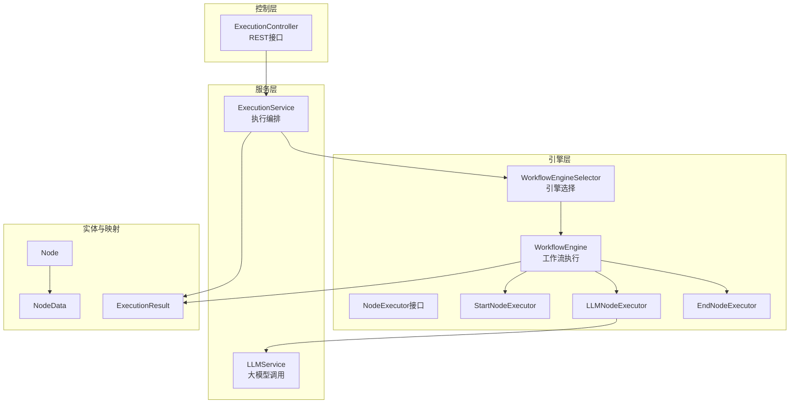
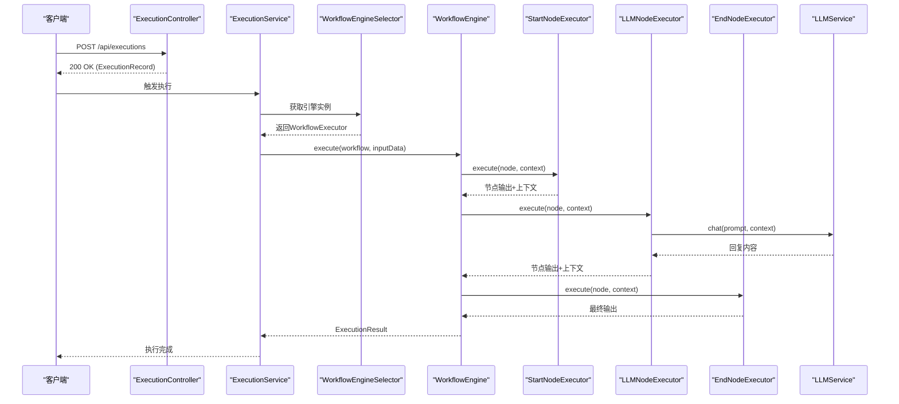
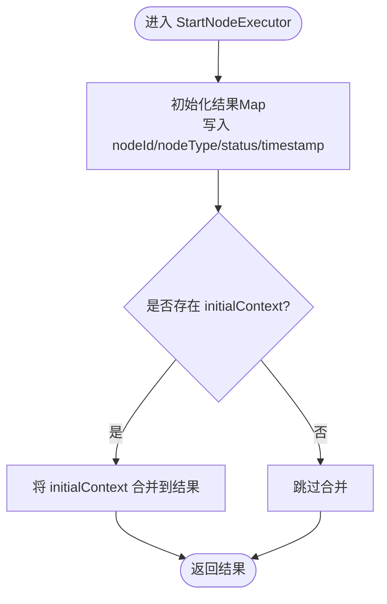
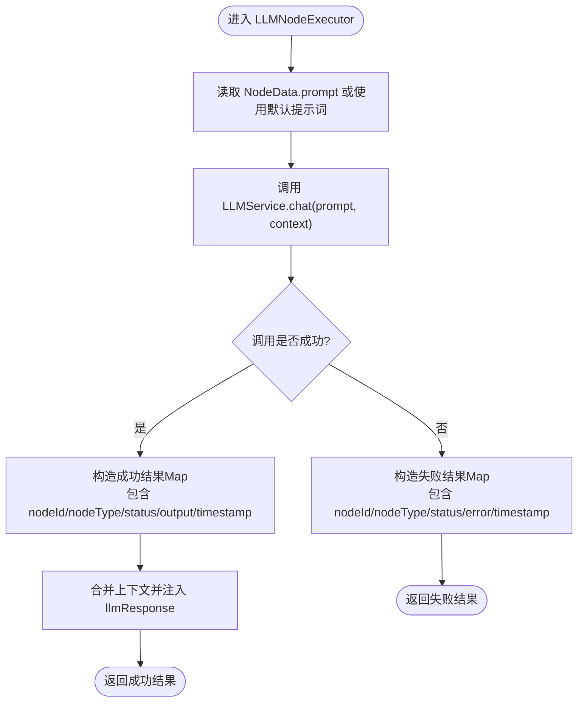
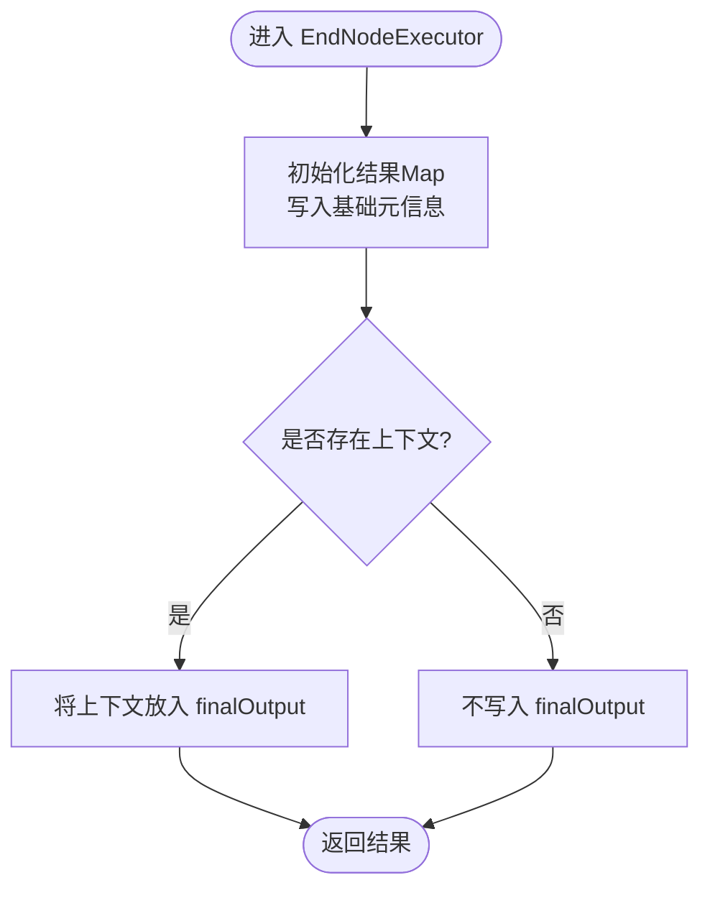
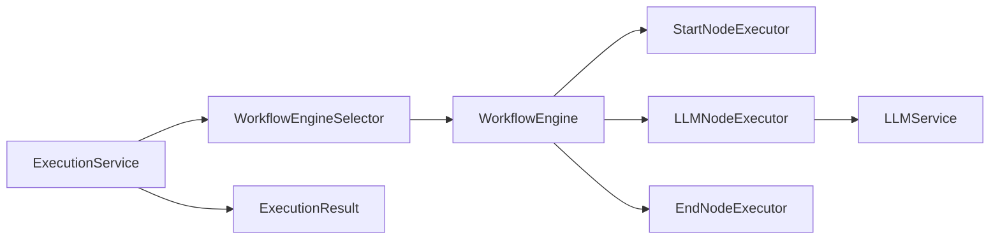

# 节点执行器

<cite>
**本文引用的文件**
- [NodeExecutor.java](file://backend/src/main/java/com/bokagent/engine/NodeExecutor.java)
- [StartNodeExecutor.java](file://backend/src/main/java/com/bokagent/engine/StartNodeExecutor.java)
- [LLMNodeExecutor.java](file://backend/src/main/java/com/bokagent/engine/LLMNodeExecutor.java)
- [EndNodeExecutor.java](file://backend/src/main/java/com/bokagent/engine/EndNodeExecutor.java)
- [ExecutionResult.java](file://backend/src/main/java/com/bokagent/engine/ExecutionResult.java)
- [WorkflowEngine.java](file://backend/src/main/java/com/bokagent/engine/WorkflowEngine.java)
- [WorkflowEngineSelector.java](file://backend/src/main/java/com/bokagent/engine/WorkflowEngineSelector.java)
- [LLMService.java](file://backend/src/main/java/com/bokagent/service/LLMService.java)
- [ExecutionService.java](file://backend/src/main/java/com/bokagent/service/ExecutionService.java)
- [ExecutionController.java](file://backend/src/main/java/com/bokagent/controller/ExecutionController.java)
- [Node.java](file://backend/src/main/java/com/bokagent/entity/Node.java)
- [NodeData.java](file://backend/src/main/java/com/bokagent/entity/NodeData.java)
- [application.yml](file://backend/src/main/resources/application.yml)
</cite>

## 目录
1. [简介](#简介)
2. [项目结构](#项目结构)
3. [核心组件](#核心组件)
4. [架构总览](#架构总览)
5. [详细组件分析](#详细组件分析)
6. [依赖分析](#依赖分析)
7. [性能考虑](#性能考虑)
8. [故障排查指南](#故障排查指南)
9. [结论](#结论)
10. [附录：扩展新节点类型开发指南](#附录扩展新节点类型开发指南)

## 简介
本文件面向BokAgent节点执行器系统，围绕NodeExecutor接口及其三种内置实现（StartNodeExecutor、LLMNodeExecutor、EndNodeExecutor）进行系统性技术说明。文档重点涵盖：
- NodeExecutor接口的设计理念与通用执行模式
- StartNodeExecutor的初始化逻辑与上下文传播
- LLMNodeExecutor的大模型调用封装、参数传递、响应处理与错误处理
- EndNodeExecutor的结果聚合与状态标记
- 执行上下文管理、异常处理策略与可扩展性设计
- 如何基于现有框架扩展新的节点类型

## 项目结构
后端采用分层架构：控制层负责HTTP接口，服务层编排执行与持久化，引擎层负责工作流调度与节点执行，实体与映射层负责数据模型与数据库交互。

图表来源
- [ExecutionController.java:1-81](file://backend/src/main/java/com/bokagent/controller/ExecutionController.java#L1-81)
- [ExecutionService.java:1-113](file://backend/src/main/java/com/bokagent/service/ExecutionService.java#L1-113)
- [WorkflowEngineSelector.java:1-53](file://backend/src/main/java/com/bokagent/engine/WorkflowEngineSelector.java#L1-53)
- [WorkflowEngine.java:1-171](file://backend/src/main/java/com/bokagent/engine/WorkflowEngine.java#L1-171)
- [NodeExecutor.java:1-24](file://backend/src/main/java/com/bokagent/engine/NodeExecutor.java#L1-24)
- [StartNodeExecutor.java:1-41](file://backend/src/main/java/com/bokagent/engine/StartNodeExecutor.java#L1-41)
- [LLMNodeExecutor.java:1-69](file://backend/src/main/java/com/bokagent/engine/LLMNodeExecutor.java#L1-69)
- [EndNodeExecutor.java:1-41](file://backend/src/main/java/com/bokagent/engine/EndNodeExecutor.java#L1-41)
- [LLMService.java:1-67](file://backend/src/main/java/com/bokagent/service/LLMService.java#L1-67)
- [Node.java:1-15](file://backend/src/main/java/com/bokagent/entity/Node.java#L1-15)
- [NodeData.java:1-15](file://backend/src/main/java/com/bokagent/entity/NodeData.java#L1-15)
- [ExecutionResult.java:1-32](file://backend/src/main/java/com/bokagent/engine/ExecutionResult.java#L1-32)

章节来源
- [application.yml:101-108](file://backend/src/main/resources/application.yml#L101-L108)

## 核心组件
- NodeExecutor接口：定义统一的节点执行契约，要求实现execute与getNodeType两个方法，确保不同节点类型以一致方式参与工作流执行。
- StartNodeExecutor：作为工作流入口，负责初始化上下文、注入输入数据，并标记节点状态。
- LLMNodeExecutor：封装大模型调用，构建完整提示词，处理异常并返回标准化结果。
- EndNodeExecutor：作为工作流出口，汇总最终输出并标记完成状态。
- ExecutionResult：封装执行结果与耗时，统一成功/失败的返回格式。
- WorkflowEngine：负责工作流拓扑解析、节点调度与上下文传播。
- WorkflowEngineSelector：根据配置动态选择引擎实现（custom/langgraph4j）。
- LLMService：集成Spring AI的ChatClient，构建完整提示词并调用大模型。
- ExecutionService：协调执行流程，持久化执行记录并更新状态。
- ExecutionController：对外提供执行记录的CRUD接口。

章节来源
- [NodeExecutor.java:1-24](file://backend/src/main/java/com/bokagent/engine/NodeExecutor.java#L1-24)
- [StartNodeExecutor.java:1-41](file://backend/src/main/java/com/bokagent/engine/StartNodeExecutor.java#L1-41)
- [LLMNodeExecutor.java:1-69](file://backend/src/main/java/com/bokagent/engine/LLMNodeExecutor.java#L1-69)
- [EndNodeExecutor.java:1-41](file://backend/src/main/java/com/bokagent/engine/EndNodeExecutor.java#L1-41)
- [ExecutionResult.java:1-32](file://backend/src/main/java/com/bokagent/engine/ExecutionResult.java#L1-32)
- [WorkflowEngine.java:1-171](file://backend/src/main/java/com/bokagent/engine/WorkflowEngine.java#L1-171)
- [WorkflowEngineSelector.java:1-53](file://backend/src/main/java/com/bokagent/engine/WorkflowEngineSelector.java#L1-53)
- [LLMService.java:1-67](file://backend/src/main/java/com/bokagent/service/LLMService.java#L1-67)
- [ExecutionService.java:1-113](file://backend/src/main/java/com/bokagent/service/ExecutionService.java#L1-113)
- [ExecutionController.java:1-81](file://backend/src/main/java/com/bokagent/controller/ExecutionController.java#L1-81)

## 架构总览
下图展示从HTTP请求到工作流执行再到结果落库的关键路径，以及各组件间的依赖关系。

图表来源
- [ExecutionController.java:52-60](file://backend/src/main/java/com/bokagent/controller/ExecutionController.java#L52-60)
- [ExecutionService.java:39-92](file://backend/src/main/java/com/bokagent/service/ExecutionService.java#L39-92)
- [WorkflowEngineSelector.java:32-43](file://backend/src/main/java/com/bokagent/engine/WorkflowEngineSelector.java#L32-43)
- [WorkflowEngine.java:47-82](file://backend/src/main/java/com/bokagent/engine/WorkflowEngine.java#L47-82)
- [StartNodeExecutor.java:18-34](file://backend/src/main/java/com/bokagent/engine/StartNodeExecutor.java#L18-34)
- [LLMNodeExecutor.java:23-62](file://backend/src/main/java/com/bokagent/engine/LLMNodeExecutor.java#L23-62)
- [EndNodeExecutor.java:18-34](file://backend/src/main/java/com/bokagent/engine/EndNodeExecutor.java#L18-34)
- [LLMService.java:27-44](file://backend/src/main/java/com/bokagent/service/LLMService.java#L27-44)

## 详细组件分析

### NodeExecutor接口与通用执行模式
- 设计理念
  - 统一抽象：所有节点类型通过execute方法参与工作流，返回标准化结果，便于上层调度与上下文合并。
  - 类型标识：getNodeType用于引擎侧路由到具体执行器，避免硬编码分支。
- 通用执行模式
  - 输入：Node定义与Map形式的上下文context。
  - 处理：在各自实现中读取NodeData中的业务字段（如prompt），结合上下文生成输出。
  - 输出：返回包含节点标识、类型、状态、时间戳及业务输出的Map；同时将上下文原样或增强后的结果合并回全局上下文。

章节来源
- [NodeExecutor.java:9-23](file://backend/src/main/java/com/bokagent/engine/NodeExecutor.java#L9-L23)

### StartNodeExecutor 初始化逻辑
- 初始数据准备
  - 读取节点ID与类型，写入结果Map。
  - 从传入的initialContext复制已有键值，保证上游数据透传。
- 上下文设置
  - 在执行完成后，将上下文合并回全局上下文，供后续节点使用。
- 执行环境配置
  - 通过日志记录执行过程，便于调试与审计。
- 关键行为
  - 状态标记为“started”，时间戳记录执行时刻。
  - 若initialContext为空，则仅保留基础元信息。

图表来源
- [StartNodeExecutor.java:18-34](file://backend/src/main/java/com/bokagent/engine/StartNodeExecutor.java#L18-34)

章节来源
- [StartNodeExecutor.java:18-34](file://backend/src/main/java/com/bokagent/engine/StartNodeExecutor.java#L18-34)

### LLMNodeExecutor 核心功能
- 大模型调用封装
  - 从NodeData读取prompt，若为空则使用默认提示词。
  - 借助LLMService构建完整提示词（含上下文），调用ChatClient获取回复。
- 参数传递与响应处理
  - 将LLMService返回的回复写入结果Map，并将llmResponse注入上下文，便于下游节点使用。
  - 合并原始context，形成新的上下文继续传播。
- 错误重试机制
  - LLMService内部捕获异常并抛出运行时异常；当前执行器直接捕获异常并返回失败状态的结果Map。
  - 项目配置支持重试策略（application.yml），但当前LLMNodeExecutor未显式使用该策略，建议在LLMService或上层调用处引入重试装饰器以提升鲁棒性。
- 性能与可观测性
  - 记录回复长度与关键日志，便于监控与调试。

图表来源
- [LLMNodeExecutor.java:23-62](file://backend/src/main/java/com/bokagent/engine/LLMNodeExecutor.java#L23-62)
- [LLMService.java:27-44](file://backend/src/main/java/com/bokagent/service/LLMService.java#L27-44)

章节来源
- [LLMNodeExecutor.java:23-62](file://backend/src/main/java/com/bokagent/engine/LLMNodeExecutor.java#L23-62)
- [LLMService.java:27-44](file://backend/src/main/java/com/bokagent/service/LLMService.java#L27-44)
- [application.yml:139-148](file://backend/src/main/resources/application.yml#L139-L148)

### EndNodeExecutor 结果处理逻辑
- 输出数据格式化
  - 写入节点标识、类型、状态与时间戳。
- 结果聚合
  - 将当前上下文整体放入finalOutput，作为工作流最终输出。
- 执行状态标记
  - 标记为“completed”，表示工作流正常结束。
- 上下文传播
  - 保持上下文完整性，便于外部系统消费最终结果。

图表来源
- [EndNodeExecutor.java:18-34](file://backend/src/main/java/com/bokagent/engine/EndNodeExecutor.java#L18-34)

章节来源
- [EndNodeExecutor.java:18-34](file://backend/src/main/java/com/bokagent/engine/EndNodeExecutor.java#L18-34)

### 执行上下文管理与异常处理策略
- 上下文管理
  - WorkflowEngine在每次节点执行后，将节点输出合并回全局上下文，并记录lastNodeOutput，便于调试与链路追踪。
- 异常处理
  - LLMNodeExecutor捕获异常并返回失败结果Map，避免中断整个工作流。
  - ExecutionService在捕获异常时将执行记录置为FAILED并记录错误信息。
- 可扩展性
  - 新增节点类型只需实现NodeExecutor接口并在WorkflowEngine中注册映射，即可无缝接入工作流。

章节来源
- [WorkflowEngine.java:120-169](file://backend/src/main/java/com/bokagent/engine/WorkflowEngine.java#L120-169)
- [ExecutionService.java:81-91](file://backend/src/main/java/com/bokagent/service/ExecutionService.java#L81-91)
- [LLMNodeExecutor.java:50-61](file://backend/src/main/java/com/bokagent/engine/LLMNodeExecutor.java#L50-61)

## 依赖分析
- 组件耦合
  - WorkflowEngine对StartNodeExecutor、LLMNodeExecutor、EndNodeExecutor存在直接依赖，通过类型映射进行解耦。
  - LLMNodeExecutor依赖LLMService，后者依赖Spring AI的ChatClient。
  - ExecutionService依赖WorkflowEngineSelector与WorkflowExecutor，实现引擎可插拔。
- 外部依赖
  - Spring AI：OpenAI/DeepSeek/Qwen等模型接入。
  - PostgreSQL：工作流与执行记录存储。
  - Redis：缓存与会话管理（由配置启用）。
  - MinIO：对象存储（音频文件等）。

图表来源
- [WorkflowEngine.java:24-39](file://backend/src/main/java/com/bokagent/engine/WorkflowEngine.java#L24-39)
- [LLMNodeExecutor.java:19-21](file://backend/src/main/java/com/bokagent/engine/LLMNodeExecutor.java#L19-21)
- [LLMService.java:18-19](file://backend/src/main/java/com/bokagent/service/LLMService.java#L18-19)
- [ExecutionService.java:31-31](file://backend/src/main/java/com/bokagent/service/ExecutionService.java#L31-31)
- [WorkflowEngineSelector.java:17-23](file://backend/src/main/java/com/bokagent/engine/WorkflowEngineSelector.java#L17-23)

章节来源
- [application.yml:16-67](file://backend/src/main/resources/application.yml#L16-L67)

## 性能考虑
- 并发与线程池
  - application.yml配置了异步任务执行池，可用于并行化非阻塞任务（如工具调用、TTS合成等）。
- 超时与重试
  - LLM调用超时配置为60秒，工具执行为30秒；重试策略已配置，可在LLMService或上层调用处启用以提升稳定性。
- 缓存
  - LLM响应缓存默认2小时，可显著降低重复请求成本。
- I/O优化
  - 使用连接池（HikariCP）与合适的Redis连接池，避免频繁建立连接带来的开销。

章节来源
- [application.yml:82-89](file://backend/src/main/resources/application.yml#L82-L89)
- [application.yml:149-155](file://backend/src/main/resources/application.yml#L149-L155)
- [application.yml:157-163](file://backend/src/main/resources/application.yml#L157-L163)

## 故障排查指南
- 常见问题定位
  - LLM调用失败：检查OpenAI/DeepSeek/Qwen的API Key与Base URL配置，确认网络连通性。
  - 工作流执行异常：查看ExecutionService的日志，定位具体异常堆栈并核对ExecutionRecord的状态与错误信息。
  - 节点执行中断：确认WorkflowEngine是否正确识别起始节点与类型映射，检查节点ID与类型一致性。
- 建议排查步骤
  - 启用DEBUG级别日志，观察节点输出与上下文变化。
  - 对LLM调用增加重试与熔断策略，减少瞬时故障影响。
  - 校验数据库连接与Flyway迁移脚本，确保表结构正确。

章节来源
- [ExecutionService.java:81-91](file://backend/src/main/java/com/bokagent/service/ExecutionService.java#L81-91)
- [WorkflowEngine.java:149-154](file://backend/src/main/java/com/bokagent/engine/WorkflowEngine.java#L149-154)
- [application.yml:165-180](file://backend/src/main/resources/application.yml#L165-L180)

## 结论
BokAgent节点执行器系统通过NodeExecutor接口实现了统一的节点抽象，配合Start/LLM/End三类执行器完成了从初始化、大模型推理到结果收尾的完整工作流闭环。系统具备良好的可扩展性与可观测性，通过配置化的引擎选择与缓存/超时/重试策略，能够在保证稳定性的同时满足多样化业务需求。建议在后续迭代中引入LLM调用的自动重试与熔断机制，并完善LangGraph4J引擎的实现与测试覆盖。

## 附录：扩展新节点类型开发指南
- 实现步骤
  1) 定义节点数据结构：在NodeData中新增业务字段（如配置项、模板等），或在Node中扩展属性。
  2) 实现NodeExecutor接口：编写execute方法，读取Node与上下文，生成标准化结果Map，并将必要上下文合并回全局。
  3) 注册执行器：在WorkflowEngine中将新类型映射到对应执行器实例。
  4) 接口测试：编写单元测试与集成测试，覆盖正常路径与异常路径。
- 输入参数验证
  - 对必填字段进行校验（如prompt、配置项），缺失时返回失败结果并记录日志。
- 执行上下文管理
  - 明确哪些上下文需要透传、哪些需要覆盖或追加，避免污染后续节点。
- 异常处理策略
  - 对外暴露失败结果Map，避免异常向上冒泡导致工作流中断；对可恢复异常可引入重试。
- 最佳实践
  - 保持execute方法幂等与无副作用，便于并行与重试。
  - 为每个节点输出补充唯一标识与时间戳，便于审计与追踪。

章节来源
- [NodeExecutor.java:9-23](file://backend/src/main/java/com/bokagent/engine/NodeExecutor.java#L9-L23)
- [WorkflowEngine.java:34-39](file://backend/src/main/java/com/bokagent/engine/WorkflowEngine.java#L34-L39)
- [NodeData.java:10-14](file://backend/src/main/java/com/bokagent/entity/NodeData.java#L10-L14)
- [Node.java:9-14](file://backend/src/main/java/com/bokagent/entity/Node.java#L9-L14)