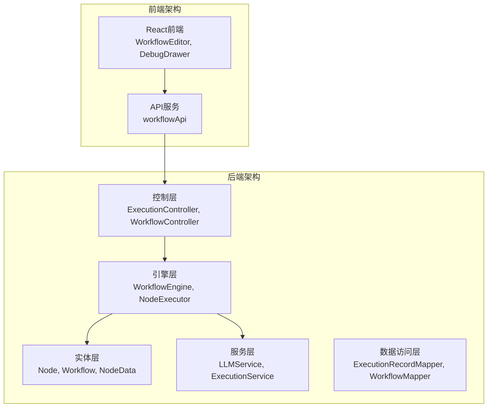
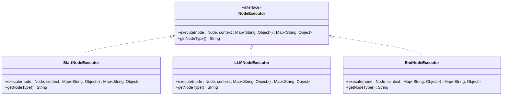
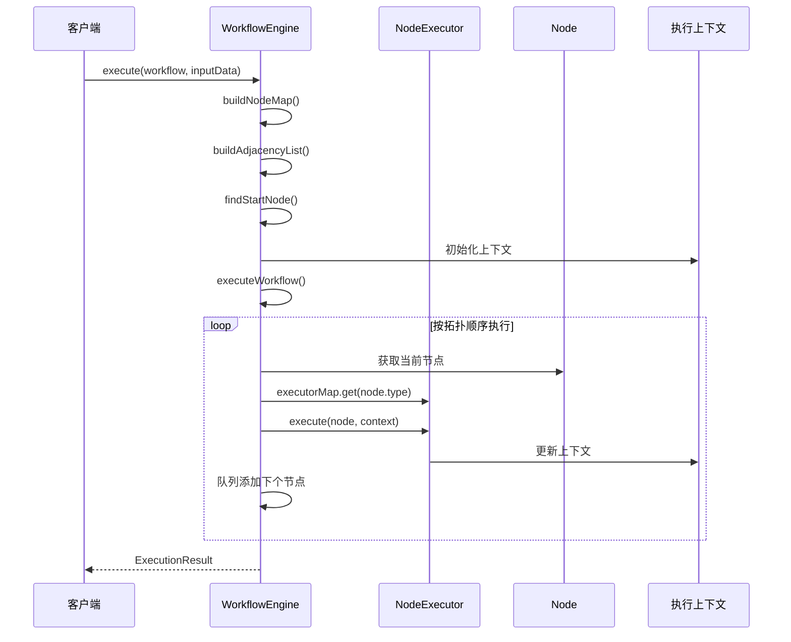
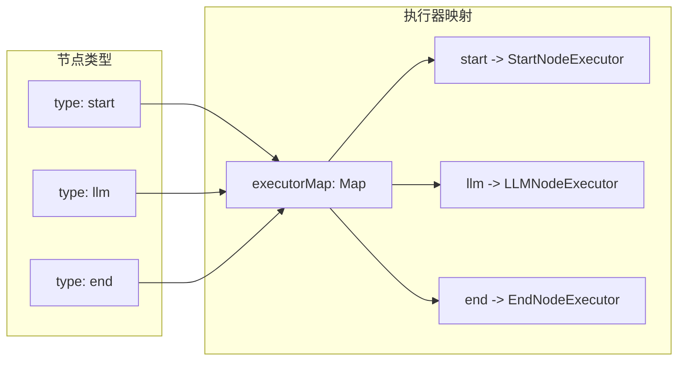
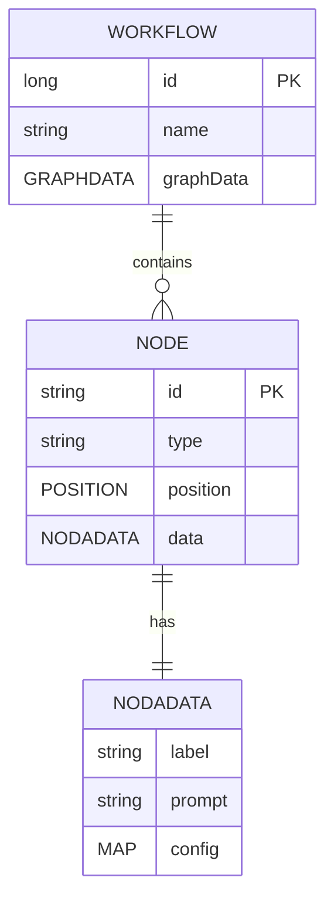
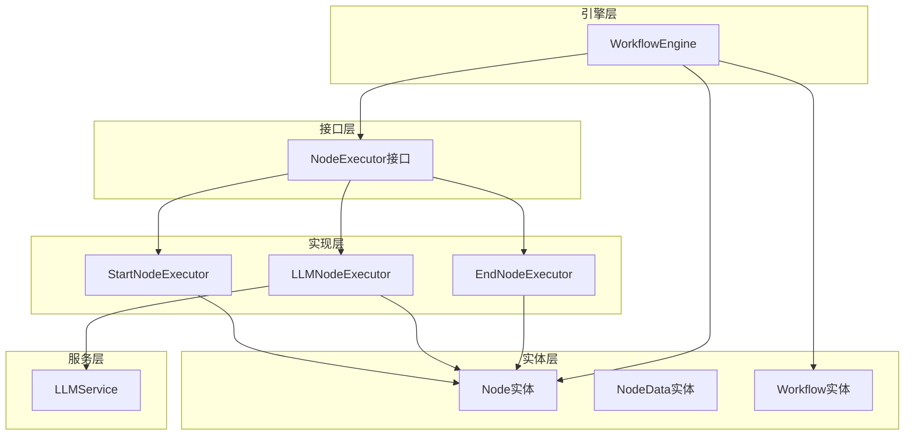
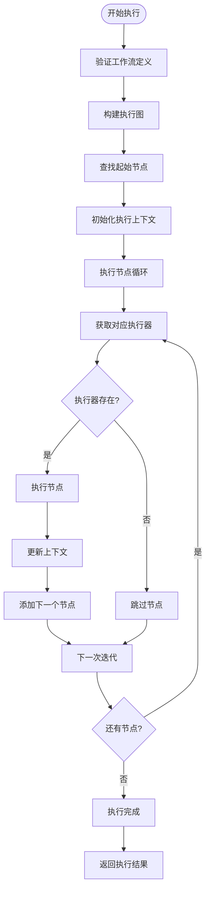

# 节点执行器接口

<cite>
**本文档引用的文件**
- [NodeExecutor.java](file://backend/src/main/java/com/bokagent/engine/NodeExecutor.java)
- [ExecutionResult.java](file://backend/src/main/java/com/bokagent/engine/ExecutionResult.java)
- [WorkflowEngine.java](file://backend/src/main/java/com/bokagent/engine/WorkflowEngine.java)
- [StartNodeExecutor.java](file://backend/src/main/java/com/bokagent/engine/StartNodeExecutor.java)
- [LLMNodeExecutor.java](file://backend/src/main/java/com/bokagent/engine/LLMNodeExecutor.java)
- [EndNodeExecutor.java](file://backend/src/main/java/com/bokagent/engine/EndNodeExecutor.java)
- [Node.java](file://backend/src/main/java/com/bokagent/entity/Node.java)
- [NodeData.java](file://backend/src/main/java/com/bokagent/entity/NodeData.java)
- [Workflow.java](file://backend/src/main/java/com/bokagent/entity/Workflow.java)
- [application.yml](file://backend/src/main/resources/application.yml)
</cite>

## 目录
1. [简介](#简介)
2. [项目结构](#项目结构)
3. [核心组件](#核心组件)
4. [架构概览](#架构概览)
5. [详细组件分析](#详细组件分析)
6. [依赖关系分析](#依赖关系分析)
7. [性能考虑](#性能考虑)
8. [故障排除指南](#故障排除指南)
9. [结论](#结论)

## 简介

BokAgent是一个基于Spring Boot的企业级AI Agent可视化编排系统，节点执行器接口是该系统工作流执行引擎的核心组件。本文档深入分析NodeExecutor接口的设计理念、核心职责和实现细节，解释其在整体架构中的作用以及如何通过统一接口实现不同类型节点的统一调度。

## 项目结构

BokAgent采用分层架构设计，主要包含以下核心模块：

**图表来源**
- [NodeExecutor.java:1-24](file://backend/src/main/java/com/bokagent/engine/NodeExecutor.java#L1-L24)
- [WorkflowEngine.java:1-171](file://backend/src/main/java/com/bokagent/engine/WorkflowEngine.java#L1-L171)

**章节来源**
- [NodeExecutor.java:1-24](file://backend/src/main/java/com/bokagent/engine/NodeExecutor.java#L1-L24)
- [WorkflowEngine.java:1-171](file://backend/src/main/java/com/bokagent/engine/WorkflowEngine.java#L1-L171)

## 核心组件

### NodeExecutor接口设计

NodeExecutor接口是BokAgent工作流执行引擎的核心抽象，定义了节点执行的标准规范：

**图表来源**
- [NodeExecutor.java:9-23](file://backend/src/main/java/com/bokagent/engine/NodeExecutor.java#L9-L23)
- [StartNodeExecutor.java:15-40](file://backend/src/main/java/com/bokagent/engine/StartNodeExecutor.java#L15-L40)
- [LLMNodeExecutor.java:17-68](file://backend/src/main/java/com/bokagent/engine/LLMNodeExecutor.java#L17-L68)
- [EndNodeExecutor.java:15-40](file://backend/src/main/java/com/bokagent/engine/EndNodeExecutor.java#L15-L40)

### 接口方法详解

#### execute方法设计

execute方法是节点执行器的核心，负责执行具体的工作流节点：

**方法签名**: `Map<String, Object> execute(Node node, Map<String, Object> context)`

**参数设计**:
- **Node node**: 节点定义对象，包含节点的标识、类型、位置和数据配置
- **Map<String, Object> context**: 执行上下文，包含前序节点的输出结果和全局状态

**返回值格式**:
执行结果映射包含标准化的节点执行信息：
- `nodeId`: 节点唯一标识
- `nodeType`: 节点类型标识
- `status`: 执行状态（started/completed/failed）
- `timestamp`: 执行时间戳
- `output`: 节点输出结果（对于LLM节点）
- `error`: 错误信息（当执行失败时）
- `finalOutput`: 最终输出结果（用于结束节点）

**章节来源**
- [NodeExecutor.java:11-17](file://backend/src/main/java/com/bokagent/engine/NodeExecutor.java#L11-L17)
- [ExecutionResult.java:10-31](file://backend/src/main/java/com/bokagent/engine/ExecutionResult.java#L10-L31)

#### getNodeType方法设计

getNodeType方法用于标识节点类型，是实现统一调度的关键：

**方法签名**: `String getNodeType()`

**实现要求**:
- 返回值必须与Node对象的type属性保持一致
- 用于WorkflowEngine中的执行器映射查找
- 支持标准节点类型：start、llm、end

**章节来源**
- [NodeExecutor.java:19-22](file://backend/src/main/java/com/bokagent/engine/NodeExecutor.java#L19-L22)

## 架构概览

### 工作流执行引擎架构

**图表来源**
- [WorkflowEngine.java:47-82](file://backend/src/main/java/com/bokagent/engine/WorkflowEngine.java#L47-L82)
- [WorkflowEngine.java:120-169](file://backend/src/main/java/com/bokagent/engine/WorkflowEngine.java#L120-L169)

### 统一调度机制

WorkflowEngine通过执行器映射实现统一调度：

**图表来源**
- [WorkflowEngine.java:32-39](file://backend/src/main/java/com/bokagent/engine/WorkflowEngine.java#L32-L39)

**章节来源**
- [WorkflowEngine.java:32-39](file://backend/src/main/java/com/bokagent/engine/WorkflowEngine.java#L32-L39)
- [WorkflowEngine.java:149-154](file://backend/src/main/java/com/bokagent/engine/WorkflowEngine.java#L149-L154)

## 详细组件分析

### StartNodeExecutor实现

StartNodeExecutor负责处理开始节点，作为工作流的入口点：

**核心功能**:
- 初始化执行上下文
- 传递输入数据到上下文
- 标识节点执行状态
- 提供标准化的执行结果格式

**实现特点**:
- 继承自NodeExecutor接口
- 实现getNodeType()返回"start"
- execute方法返回包含基础信息的结果映射

**章节来源**
- [StartNodeExecutor.java:15-40](file://backend/src/main/java/com/bokagent/engine/StartNodeExecutor.java#L15-L40)

### LLMNodeExecutor实现

LLMNodeExecutor处理大语言模型节点，是工作流中最复杂的执行器：

**核心功能**:
- 调用LLM服务进行对话
- 处理异常情况
- 管理上下文传递
- 标准化LLM响应格式

**实现特点**:
- 依赖LLMService进行实际的AI调用
- 包含完整的错误处理机制
- 支持动态提示词配置
- 维护LLM响应到上下文

**章节来源**
- [LLMNodeExecutor.java:17-68](file://backend/src/main/java/com/bokagent/engine/LLMNodeExecutor.java#L17-L68)

### EndNodeExecutor实现

EndNodeExecutor负责处理结束节点，收集和整理最终结果：

**核心功能**:
- 汇总工作流执行结果
- 传递最终输出到上下文
- 标识工作流执行完成状态

**实现特点**:
- 继承自NodeExecutor接口
- 实现getNodeType()返回"end"
- execute方法返回包含最终输出的结果映射

**章节来源**
- [EndNodeExecutor.java:15-40](file://backend/src/main/java/com/bokagent/engine/EndNodeExecutor.java#L15-L40)

### 节点数据模型

**图表来源**
- [Node.java:9-14](file://backend/src/main/java/com/bokagent/entity/Node.java#L9-L14)
- [NodeData.java:10-14](file://backend/src/main/java/com/bokagent/entity/NodeData.java#L10-L14)
- [Workflow.java:16-26](file://backend/src/main/java/com/bokagent/entity/Workflow.java#L16-L26)

**章节来源**
- [Node.java:9-14](file://backend/src/main/java/com/bokagent/entity/Node.java#L9-L14)
- [NodeData.java:10-14](file://backend/src/main/java/com/bokagent/entity/NodeData.java#L10-L14)
- [Workflow.java:16-26](file://backend/src/main/java/com/bokagent/entity/Workflow.java#L16-L26)

## 依赖关系分析

### 组件依赖图

**图表来源**
- [NodeExecutor.java:9-23](file://backend/src/main/java/com/bokagent/engine/NodeExecutor.java#L9-L23)
- [StartNodeExecutor.java:15-40](file://backend/src/main/java/com/bokagent/engine/StartNodeExecutor.java#L15-L40)
- [LLMNodeExecutor.java:17-68](file://backend/src/main/java/com/bokagent/engine/LLMNodeExecutor.java#L17-L68)
- [EndNodeExecutor.java:15-40](file://backend/src/main/java/com/bokagent/engine/EndNodeExecutor.java#L15-L40)
- [WorkflowEngine.java:23-30](file://backend/src/main/java/com/bokagent/engine/WorkflowEngine.java#L23-L30)

### 执行流程依赖

**图表来源**
- [WorkflowEngine.java:47-82](file://backend/src/main/java/com/bokagent/engine/WorkflowEngine.java#L47-L82)
- [WorkflowEngine.java:120-169](file://backend/src/main/java/com/bokagent/engine/WorkflowEngine.java#L120-L169)

**章节来源**
- [WorkflowEngine.java:47-82](file://backend/src/main/java/com/bokagent/engine/WorkflowEngine.java#L47-L82)
- [WorkflowEngine.java:120-169](file://backend/src/main/java/com/bokagent/engine/WorkflowEngine.java#L120-L169)

## 性能考虑

### 执行器注册优化

WorkflowEngine通过HashMap实现O(1)的执行器查找，支持快速的节点类型到执行器的映射：

- **时间复杂度**: O(1)查找，O(n)遍历
- **空间复杂度**: O(k)存储k个执行器实例
- **内存优化**: 使用单例模式管理执行器实例

### 上下文传递效率

执行上下文采用HashMap实现，支持高效的键值对操作：

- **时间复杂度**: O(1)插入/查找/更新
- **内存管理**: 动态扩容机制
- **线程安全**: 单线程执行环境，无需同步

### 执行结果标准化

ExecutionResult提供统一的执行结果格式，便于后续处理和存储：

- **结构化数据**: 明确的成功/失败标志
- **元数据支持**: 执行时间和错误信息
- **序列化友好**: 标准化的字段结构

## 故障排除指南

### 常见问题诊断

**节点执行器未找到**:
- 检查节点类型是否正确配置
- 验证执行器是否正确注册到executorMap
- 确认getNodeType()返回值与节点类型匹配

**执行上下文为空**:
- 确保输入数据正确传递
- 检查前序节点的输出格式
- 验证上下文更新逻辑

**LLM调用失败**:
- 检查API密钥配置
- 验证网络连接状态
- 查看详细的错误信息

### 调试建议

1. **启用详细日志**: 在application.yml中调整日志级别
2. **监控执行时间**: 利用ExecutionResult中的executionTime字段
3. **检查节点类型**: 确保Node对象的type属性正确设置
4. **验证配置**: 检查Spring AI的配置参数

**章节来源**
- [application.yml:165-179](file://backend/src/main/resources/application.yml#L165-L179)

## 结论

NodeExecutor接口设计体现了BokAgent工作流执行引擎的核心设计理念：通过统一的接口抽象实现不同类型节点的灵活扩展，通过标准化的执行结果格式实现统一的调度和管理。该接口不仅简化了节点执行的复杂性，还为系统的可扩展性和可维护性提供了坚实的基础。

通过StartNodeExecutor、LLMNodeExecutor和EndNodeExecutor的具体实现，我们可以看到接口设计的成功实践，每个执行器都遵循统一的规范，同时保持了各自的特色功能。这种设计模式为未来的节点类型扩展提供了清晰的路径，使得系统能够轻松适应新的业务需求和技术发展。