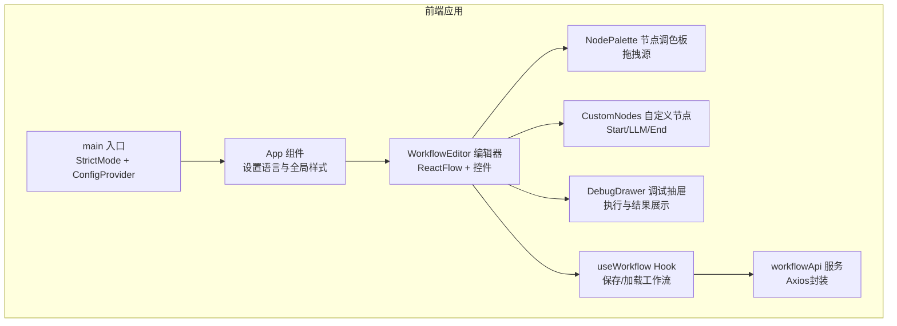
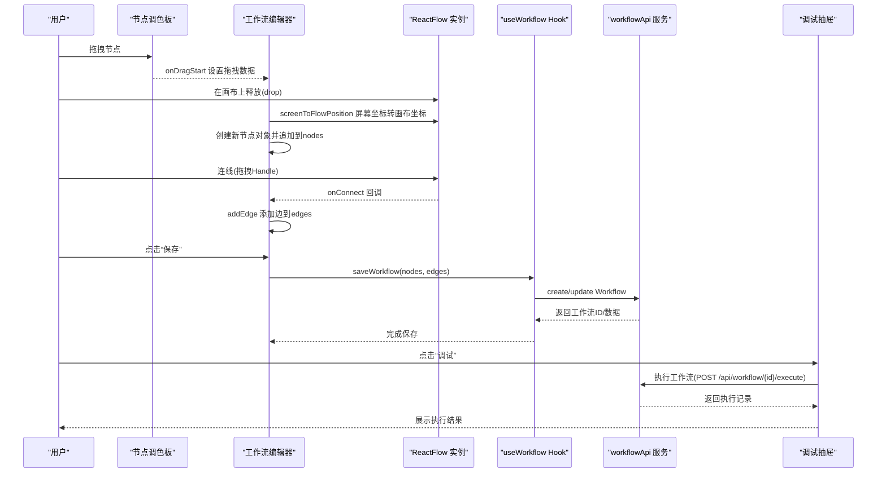
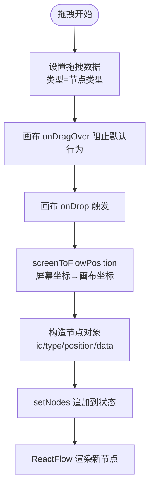
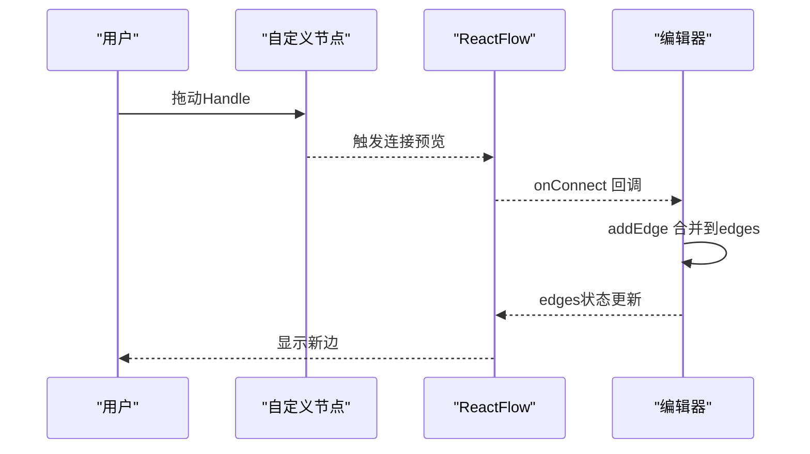
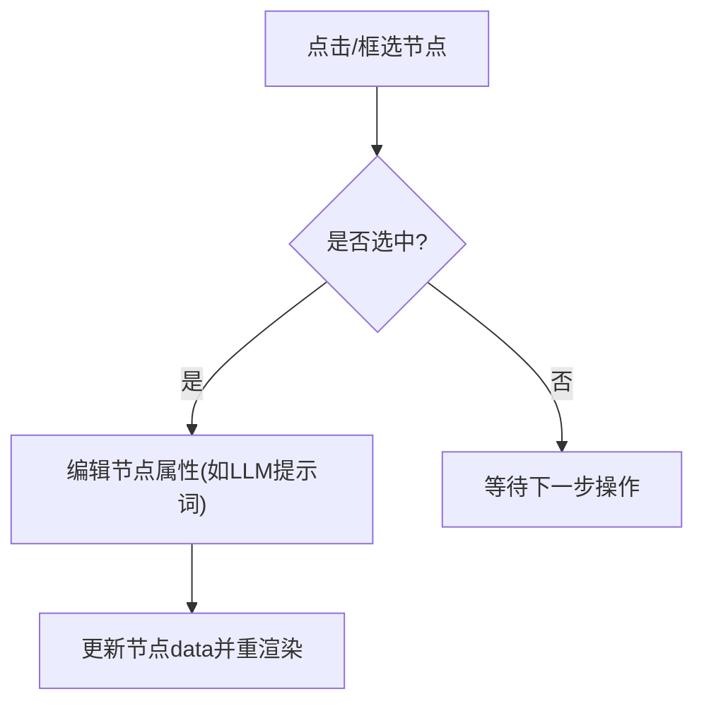
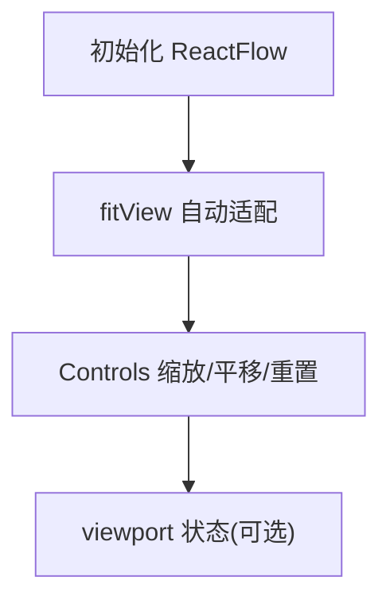
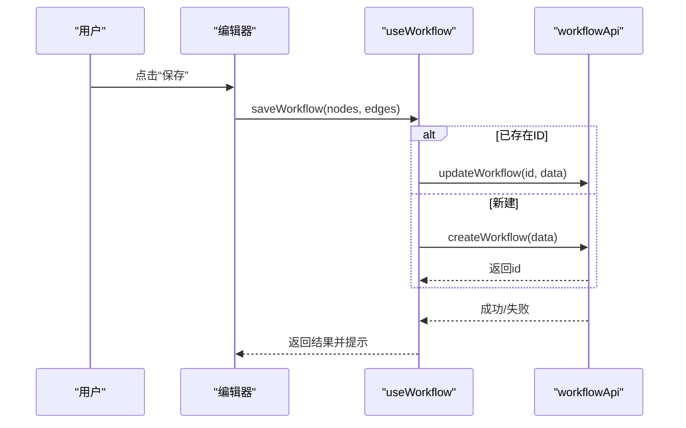
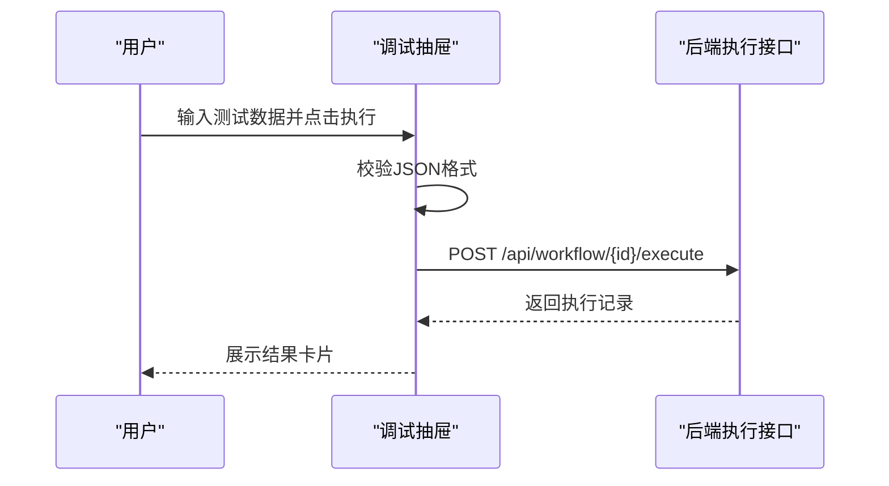
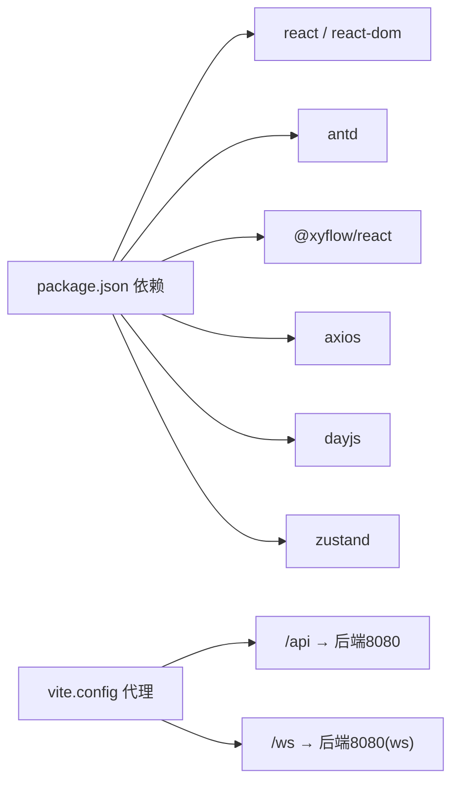

# 交互逻辑处理

<cite>
**本文引用的文件**
- [frontend/src/components/WorkflowEditor/index.tsx](file://frontend/src/components/WorkflowEditor/index.tsx)
- [frontend/src/components/WorkflowEditor/CustomNodes.tsx](file://frontend/src/components/WorkflowEditor/CustomNodes.tsx)
- [frontend/src/components/WorkflowEditor/NodePalette.tsx](file://frontend/src/components/WorkflowEditor/NodePalette.tsx)
- [frontend/src/hooks/useWorkflow.ts](file://frontend/src/hooks/useWorkflow.ts)
- [frontend/src/services/workflowApi.ts](file://frontend/src/services/workflowApi.ts)
- [frontend/src/components/DebugDrawer/index.tsx](file://frontend/src/components/DebugDrawer/index.tsx)
- [frontend/src/App.tsx](file://frontend/src/App.tsx)
- [frontend/src/main.tsx](file://frontend/src/main.tsx)
- [frontend/package.json](file://frontend/package.json)
- [frontend/vite.config.ts](file://frontend/vite.config.ts)
</cite>

## 目录
1. [简介](#简介)
2. [项目结构](#项目结构)
3. [核心组件](#核心组件)
4. [架构总览](#架构总览)
5. [详细组件分析](#详细组件分析)
6. [依赖分析](#依赖分析)
7. [性能考虑](#性能考虑)
8. [故障排查指南](#故障排查指南)
9. [结论](#结论)
10. [附录](#附录)

## 简介
本文件聚焦于BokAgent工作流编辑器的交互逻辑处理，围绕以下主题展开：节点拖拽的完整流程（事件捕获、坐标转换、节点创建与插入）、连线功能（连接点检测、连线预览与边创建）、节点选择与编辑（单选/多选、框选、键盘快捷键）、画布导航（缩放、平移、重置、自动适配）、事件处理最佳实践（事件委托、性能优化、内存泄漏防护）、交互体验优化（拖拽反馈、视觉提示、错误处理、无障碍支持），以及与调试抽屉的状态同步、与API服务的数据交换等协作关系。

## 项目结构
前端采用React + TypeScript + Vite构建，使用Ant Design作为UI框架，@xyflow/react实现可视化画布与节点连线，Axios进行HTTP请求代理至后端。编辑器由工具栏、节点调色板、主画布、调试抽屉组成；通过自定义Hook管理工作流状态与持久化；通过服务模块封装API调用。

图表来源
- [frontend/src/App.tsx:1-21](file://frontend/src/App.tsx#L1-L21)
- [frontend/src/main.tsx:1-22](file://frontend/src/main.tsx#L1-L22)
- [frontend/src/components/WorkflowEditor/index.tsx:1-116](file://frontend/src/components/WorkflowEditor/index.tsx#L1-L116)
- [frontend/src/components/WorkflowEditor/NodePalette.tsx:1-48](file://frontend/src/components/WorkflowEditor/NodePalette.tsx#L1-L48)
- [frontend/src/components/WorkflowEditor/CustomNodes.tsx:1-81](file://frontend/src/components/WorkflowEditor/CustomNodes.tsx#L1-L81)
- [frontend/src/components/DebugDrawer/index.tsx:1-141](file://frontend/src/components/DebugDrawer/index.tsx#L1-L141)
- [frontend/src/hooks/useWorkflow.ts:1-69](file://frontend/src/hooks/useWorkflow.ts#L1-L69)
- [frontend/src/services/workflowApi.ts:1-44](file://frontend/src/services/workflowApi.ts#L1-L44)

章节来源
- [frontend/src/App.tsx:1-21](file://frontend/src/App.tsx#L1-L21)
- [frontend/src/main.tsx:1-22](file://frontend/src/main.tsx#L1-L22)
- [frontend/src/components/WorkflowEditor/index.tsx:1-116](file://frontend/src/components/WorkflowEditor/index.tsx#L1-L116)

## 核心组件
- 工作流编辑器容器：负责初始化ReactFlow实例、绑定拖拽事件、保存按钮回调、调试抽屉开关、节点与连线状态管理。
- 节点调色板：提供可拖拽的节点类型，设置拖拽数据类型，作为外部拖入画布的入口。
- 自定义节点：定义开始、LLM、结束三种节点的渲染与连接点（Handle）位置。
- 调试抽屉：承载执行输入、触发执行、展示执行结果与统计信息。
- 工作流Hook：封装保存/加载工作流的业务逻辑，统一处理新增与更新分支。
- API服务：封装Axios实例与工作流/执行记录接口，配合Vite代理转发到后端。

章节来源
- [frontend/src/components/WorkflowEditor/index.tsx:11-116](file://frontend/src/components/WorkflowEditor/index.tsx#L11-L116)
- [frontend/src/components/WorkflowEditor/NodePalette.tsx:11-48](file://frontend/src/components/WorkflowEditor/NodePalette.tsx#L11-L48)
- [frontend/src/components/WorkflowEditor/CustomNodes.tsx:6-81](file://frontend/src/components/WorkflowEditor/CustomNodes.tsx#L6-L81)
- [frontend/src/components/DebugDrawer/index.tsx:12-141](file://frontend/src/components/DebugDrawer/index.tsx#L12-L141)
- [frontend/src/hooks/useWorkflow.ts:4-69](file://frontend/src/hooks/useWorkflow.ts#L4-L69)
- [frontend/src/services/workflowApi.ts:11-44](file://frontend/src/services/workflowApi.ts#L11-L44)

## 架构总览
下图展示了从用户交互到后端API的整体链路，包括拖拽创建节点、连线建立、保存工作流、调试执行等关键路径。

图表来源
- [frontend/src/components/WorkflowEditor/NodePalette.tsx:12-15](file://frontend/src/components/WorkflowEditor/NodePalette.tsx#L12-L15)
- [frontend/src/components/WorkflowEditor/index.tsx:28-52](file://frontend/src/components/WorkflowEditor/index.tsx#L28-L52)
- [frontend/src/components/WorkflowEditor/index.tsx:18-21](file://frontend/src/components/WorkflowEditor/index.tsx#L18-L21)
- [frontend/src/hooks/useWorkflow.ts:9-39](file://frontend/src/hooks/useWorkflow.ts#L9-L39)
- [frontend/src/services/workflowApi.ts:11-26](file://frontend/src/services/workflowApi.ts#L11-L26)
- [frontend/src/components/DebugDrawer/index.tsx:17-67](file://frontend/src/components/DebugDrawer/index.tsx#L17-L67)

## 详细组件分析

### 节点拖拽与坐标转换
- 事件捕获与数据传递
  - 调色板在拖拽开始时设置自定义MIME类型的数据，携带节点类型字符串，作为后续画布drop阶段的识别依据。
  - 编辑器在画布上监听拖拽进入与释放事件，阻止默认行为以启用drop目标判定。
- 坐标转换
  - 使用ReactFlow实例提供的屏幕坐标到画布坐标的转换方法，确保节点放置位置与鼠标指针一致。
- 新节点创建与插入
  - 构造节点对象（含唯一ID、类型、初始位置、标签数据），追加到nodes状态中，驱动画布重新渲染。

图表来源
- [frontend/src/components/WorkflowEditor/NodePalette.tsx:12-15](file://frontend/src/components/WorkflowEditor/NodePalette.tsx#L12-L15)
- [frontend/src/components/WorkflowEditor/index.tsx:23-26](file://frontend/src/components/WorkflowEditor/index.tsx#L23-L26)
- [frontend/src/components/WorkflowEditor/index.tsx:28-52](file://frontend/src/components/WorkflowEditor/index.tsx#L28-L52)

章节来源
- [frontend/src/components/WorkflowEditor/NodePalette.tsx:11-48](file://frontend/src/components/WorkflowEditor/NodePalette.tsx#L11-L48)
- [frontend/src/components/WorkflowEditor/index.tsx:23-52](file://frontend/src/components/WorkflowEditor/index.tsx#L23-L52)

### 连线功能实现
- 连接点检测
  - 自定义节点通过连接点组件声明输入/输出端口（Handle），ReactFlow根据端口位置与类型判断是否可连接。
- 连线预览与边创建
  - 用户拖动Handle时，ReactFlow提供连线预览；当松开鼠标时触发连线回调，编辑器通过统一方法将边加入状态。
- 边的更新逻辑
  - 通过状态变更与回调函数组合，保证边集合的不可变更新，避免直接修改引用导致的渲染问题。

图表来源
- [frontend/src/components/WorkflowEditor/CustomNodes.tsx:18](file://frontend/src/components/WorkflowEditor/CustomNodes.tsx#L18)
- [frontend/src/components/WorkflowEditor/CustomNodes.tsx:35](file://frontend/src/components/WorkflowEditor/CustomNodes.tsx#L35)
- [frontend/src/components/WorkflowEditor/CustomNodes.tsx:66](file://frontend/src/components/WorkflowEditor/CustomNodes.tsx#L66)
- [frontend/src/components/WorkflowEditor/index.tsx:18-21](file://frontend/src/components/WorkflowEditor/index.tsx#L18-L21)

章节来源
- [frontend/src/components/WorkflowEditor/CustomNodes.tsx:6-81](file://frontend/src/components/WorkflowEditor/CustomNodes.tsx#L6-L81)
- [frontend/src/components/WorkflowEditor/index.tsx:18-21](file://frontend/src/components/WorkflowEditor/index.tsx#L18-L21)

### 节点选择与编辑交互
- 单选/多选与框选
  - 通过ReactFlow内置的选择能力实现节点选中与批量选中；当前代码未显式扩展键盘快捷键，建议在回调中增加键盘事件处理以支持删除、复制等常用操作。
- 输入编辑
  - LLM节点提供文本域用于编辑提示词，编辑时直接更新节点数据对象，驱动组件重渲染。
- 可访问性
  - 建议为节点与控件补充aria-label、tabIndex、键盘事件监听，提升可访问性。

图表来源
- [frontend/src/components/WorkflowEditor/CustomNodes.tsx:40-48](file://frontend/src/components/WorkflowEditor/CustomNodes.tsx#L40-L48)
- [frontend/src/components/WorkflowEditor/index.tsx:84-94](file://frontend/src/components/WorkflowEditor/index.tsx#L84-L94)

章节来源
- [frontend/src/components/WorkflowEditor/CustomNodes.tsx:26-52](file://frontend/src/components/WorkflowEditor/CustomNodes.tsx#L26-L52)
- [frontend/src/components/WorkflowEditor/index.tsx:84-94](file://frontend/src/components/WorkflowEditor/index.tsx#L84-L94)

### 画布导航与视图控制
- 缩放与平移
  - 使用ReactFlow提供的控件组件实现缩放、平移、重置等操作；当前通过自动适配参数开启自动居中显示。
- 自动适配
  - 初始化时启用自动适配，使画布内容在初次渲染时自动调整到可视区域。
- 建议增强
  - 可结合状态管理暴露viewport信息，便于持久化与跨会话恢复。

图表来源
- [frontend/src/components/WorkflowEditor/index.tsx:94](file://frontend/src/components/WorkflowEditor/index.tsx#L94)
- [frontend/src/components/WorkflowEditor/index.tsx:97](file://frontend/src/components/WorkflowEditor/index.tsx#L97)

章节来源
- [frontend/src/components/WorkflowEditor/index.tsx:84-100](file://frontend/src/components/WorkflowEditor/index.tsx#L84-L100)

### 保存与加载工作流
- 保存流程
  - 将nodes、edges与视口信息打包为工作流数据，区分新建与更新场景，调用API完成持久化，并在成功后提示用户。
- 加载流程
  - 通过工作流ID拉取数据，设置当前工作流ID并返回数据供编辑器使用。
- 错误处理
  - 统一捕获异常并打印日志，避免阻断用户操作。

图表来源
- [frontend/src/hooks/useWorkflow.ts:9-39](file://frontend/src/hooks/useWorkflow.ts#L9-L39)
- [frontend/src/services/workflowApi.ts:18-22](file://frontend/src/services/workflowApi.ts#L18-L22)

章节来源
- [frontend/src/hooks/useWorkflow.ts:4-69](file://frontend/src/hooks/useWorkflow.ts#L4-L69)
- [frontend/src/services/workflowApi.ts:11-44](file://frontend/src/services/workflowApi.ts#L11-L44)

### 调试抽屉与执行联动
- 状态同步
  - 调试抽屉接收当前nodes与edges，用于执行前校验与展示统计信息。
- 执行流程
  - 校验输入JSON格式，向后端发起执行请求，解析响应并展示执行状态、时间戳、输出或错误信息。
- 与工作流的协作
  - 当前示例固定使用固定ID进行演示，实际应从Hook中读取当前工作流ID。

图表来源
- [frontend/src/components/DebugDrawer/index.tsx:17-67](file://frontend/src/components/DebugDrawer/index.tsx#L17-L67)

章节来源
- [frontend/src/components/DebugDrawer/index.tsx:12-141](file://frontend/src/components/DebugDrawer/index.tsx#L12-L141)

## 依赖分析
- React生态：React、React DOM、React Router、Ant Design、@xyflow/react。
- 网络层：Axios用于HTTP请求，Vite开发服务器配置代理，将/api前缀转发到后端服务。
- 本地化与日期：dayjs与Ant Design本地化集成。
- 状态与存储：Zustand（用于状态管理，如需引入）。

图表来源
- [frontend/package.json:12-22](file://frontend/package.json#L12-L22)
- [frontend/vite.config.ts:7-18](file://frontend/vite.config.ts#L7-L18)

章节来源
- [frontend/package.json:1-37](file://frontend/package.json#L1-L37)
- [frontend/vite.config.ts:1-21](file://frontend/vite.config.ts#L1-L21)

## 性能考虑
- 事件处理优化
  - 使用useCallback稳定回调，减少子组件不必要重渲染；将依赖数组最小化，避免频繁重建函数。
- 数据结构与更新
  - 使用不可变更新模式（如追加/合并）避免深层引用变化；合理拆分状态，降低渲染范围。
- 渲染与布局
  - 对大量节点场景，优先使用虚拟化或分页策略；保持Handle位置稳定，减少布局抖动。
- 资源与网络
  - 合理节流/防抖拖拽与缩放事件；对保存/执行等耗时操作使用加载态与取消机制。
- 内存泄漏防护
  - 在组件卸载时清理定时器、WebSocket订阅与事件监听；确保Axios拦截器与轮询任务被正确注销。

## 故障排查指南
- 拖拽无效
  - 检查调色板是否设置了正确的拖拽数据类型；确认画布onDragOver是否阻止了默认行为；确认ReactFlow实例已初始化。
- 坐标错位
  - 确认使用了屏幕坐标到画布坐标的转换方法；检查容器是否有滚动或偏移影响定位。
- 连线无法建立
  - 检查两端Handle的类型与位置是否匹配；确认未被禁用或遮挡；查看连线回调是否被触发。
- 保存失败
  - 查看API返回与错误日志；确认工作流ID是否存在；检查网络代理配置是否正确。
- 调试执行报错
  - 校验测试输入JSON格式；确认后端执行接口可用；检查工作流ID是否有效。

章节来源
- [frontend/src/components/WorkflowEditor/NodePalette.tsx:12-15](file://frontend/src/components/WorkflowEditor/NodePalette.tsx#L12-L15)
- [frontend/src/components/WorkflowEditor/index.tsx:23-52](file://frontend/src/components/WorkflowEditor/index.tsx#L23-L52)
- [frontend/src/components/DebugDrawer/index.tsx:17-67](file://frontend/src/components/DebugDrawer/index.tsx#L17-L67)
- [frontend/src/services/workflowApi.ts:18-22](file://frontend/src/services/workflowApi.ts#L18-L22)

## 结论
该工作流编辑器基于React与@xyflow/react实现了完整的节点拖拽、连线、保存与调试执行闭环。通过清晰的组件职责划分与Hook封装，交互逻辑具备良好的可维护性。建议后续增强键盘快捷键、可访问性、视口状态持久化与更丰富的调试信息展示，以进一步提升用户体验与工程化水平。

## 附录
- 无障碍支持建议
  - 为节点与控件添加aria-label；支持Tab切换与Enter激活；提供键盘删除与复制粘贴。
- 与后端协作
  - 通过Vite代理统一转发/api请求；WebSocket用于实时消息（如执行进度）。
- 版本与构建
  - 使用Vite开发与构建，TypeScript类型保障，ESLint与React Hooks规则约束。