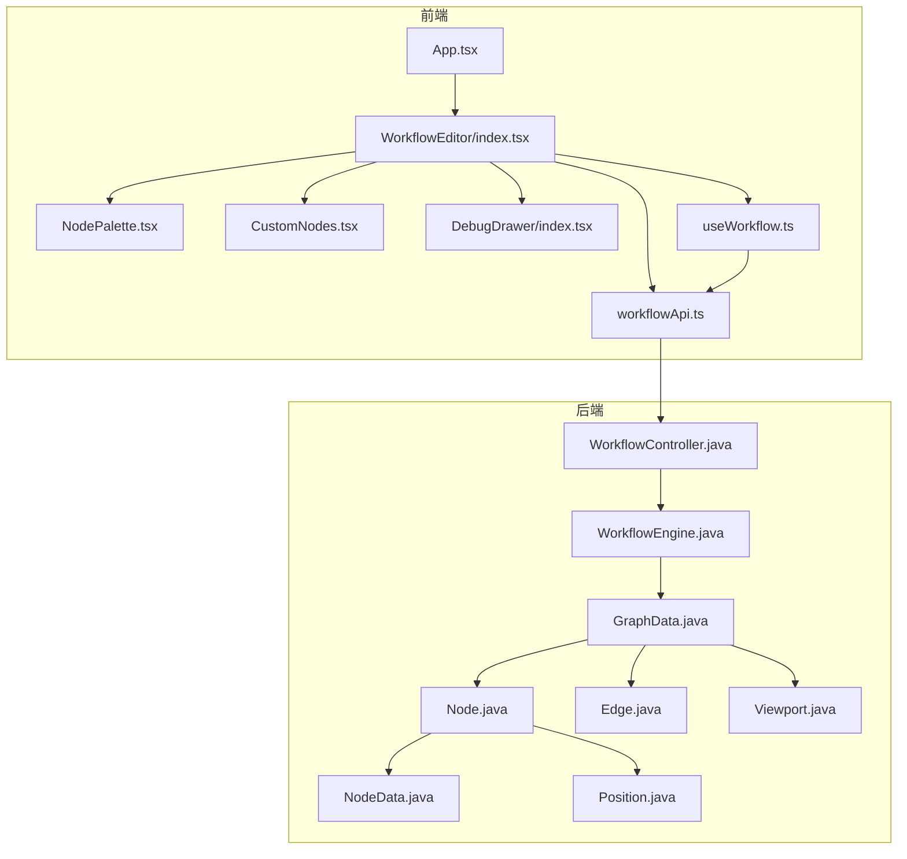
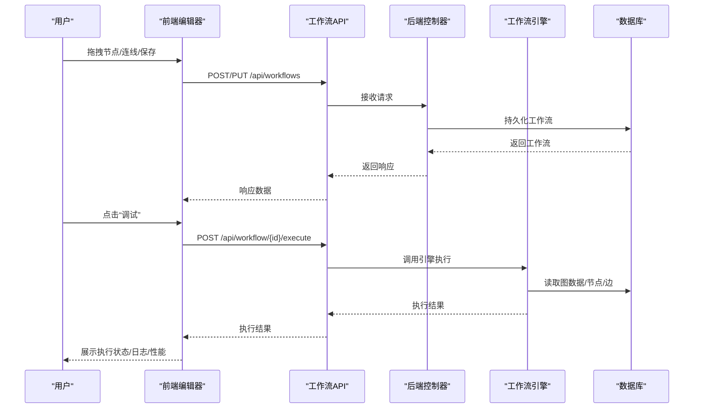
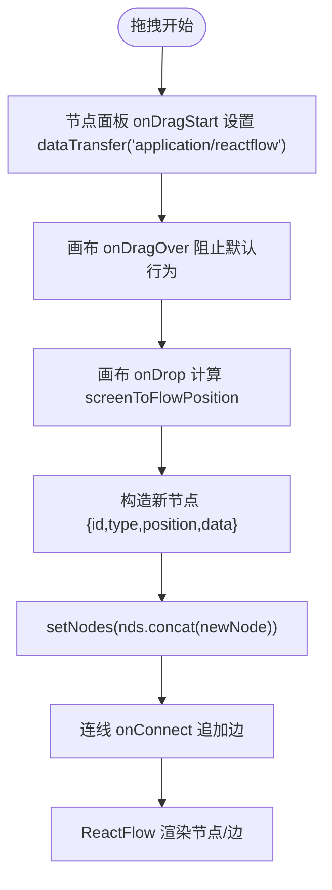
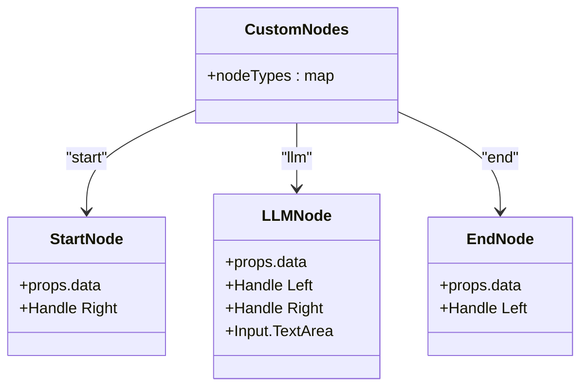
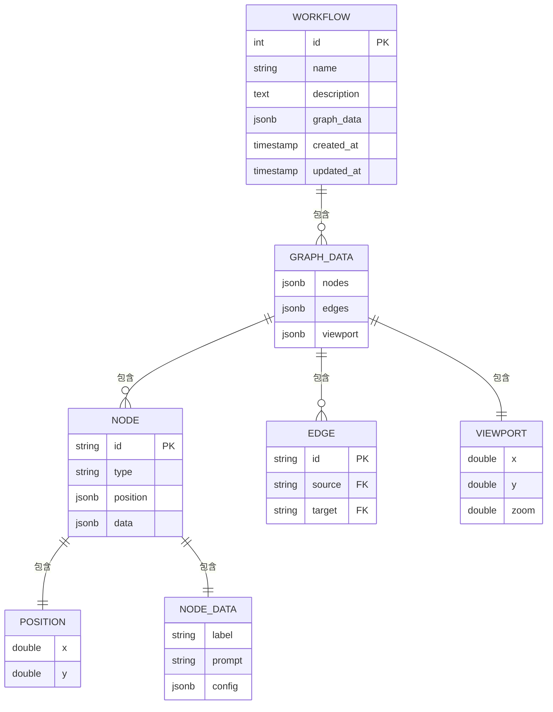
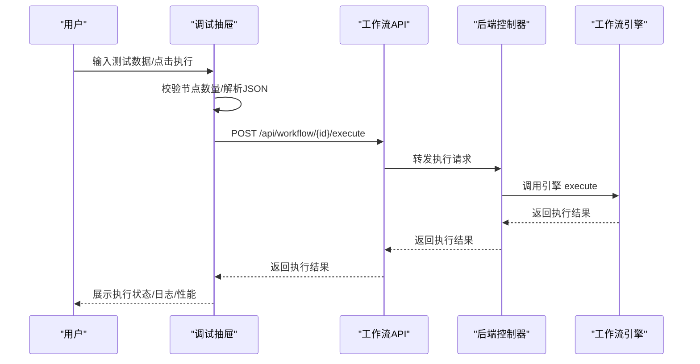
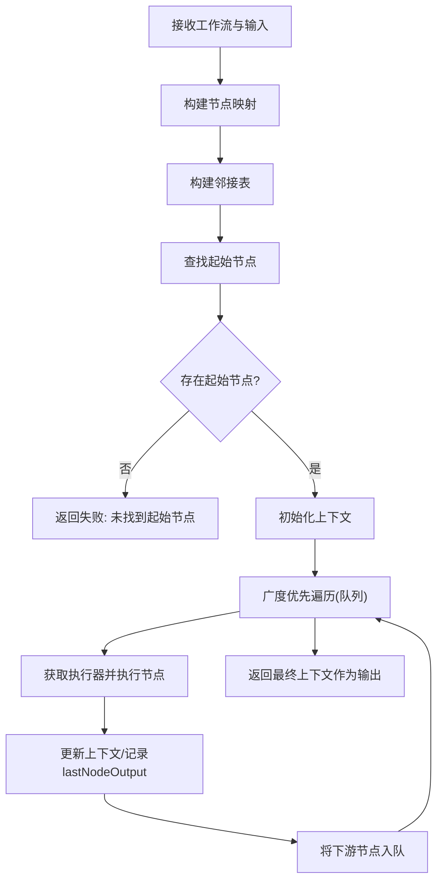
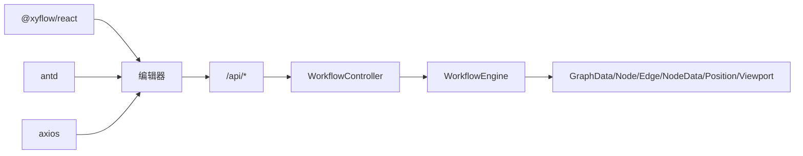

# 工作流编辑器

<cite>
**本文引用的文件**
- [frontend/src/components/WorkflowEditor/index.tsx](file://frontend/src/components/WorkflowEditor/index.tsx)
- [frontend/src/components/WorkflowEditor/CustomNodes.tsx](file://frontend/src/components/WorkflowEditor/CustomNodes.tsx)
- [frontend/src/components/WorkflowEditor/NodePalette.tsx](file://frontend/src/components/WorkflowEditor/NodePalette.tsx)
- [frontend/src/hooks/useWorkflow.ts](file://frontend/src/hooks/useWorkflow.ts)
- [frontend/src/services/workflowApi.ts](file://frontend/src/services/workflowApi.ts)
- [frontend/src/components/DebugDrawer/index.tsx](file://frontend/src/components/DebugDrawer/index.tsx)
- [backend/src/main/java/com/bokagent/controller/WorkflowController.java](file://backend/src/main/java/com/bokagent/controller/WorkflowController.java)
- [backend/src/main/java/com/bokagent/engine/WorkflowEngine.java](file://backend/src/main/java/com/bokagent/engine/WorkflowEngine.java)
- [backend/src/main/java/com/bokagent/entity/GraphData.java](file://backend/src/main/java/com/bokagent/entity/GraphData.java)
- [backend/src/main/java/com/bokagent/entity/Node.java](file://backend/src/main/java/com/bokagent/entity/Node.java)
- [backend/src/main/java/com/bokagent/entity/Edge.java](file://backend/src/main/java/com/bokagent/entity/Edge.java)
- [backend/src/main/java/com/bokagent/entity/NodeData.java](file://backend/src/main/java/com/bokagent/entity/NodeData.java)
- [backend/src/main/java/com/bokagent/entity/Position.java](file://backend/src/main/java/com/bokagent/entity/Position.java)
- [backend/src/main/java/com/bokagent/entity/Viewport.java](file://backend/src/main/java/com/bokagent/entity/Viewport.java)
</cite>

## 目录
1. [简介](#简介)
2. [项目结构](#项目结构)
3. [核心组件](#核心组件)
4. [架构总览](#架构总览)
5. [详细组件分析](#详细组件分析)
6. [依赖分析](#依赖分析)
7. [性能考虑](#性能考虑)
8. [故障排查指南](#故障排查指南)
9. [结论](#结论)
10. [附录](#附录)

## 简介
本技术文档面向前端与全栈开发者，系统性讲解 BokAgent 工作流编辑器的实现与使用。内容涵盖：
- React Flow 集成：画布配置、节点拖拽、连线逻辑、缩放平移与最小地图。
- 节点面板设计：节点类型管理、拖拽行为、节点属性配置界面。
- 自定义节点：Start 节点、LLM 节点、End 节点的视觉与交互。
- 工作流数据结构：节点位置、边连接、视口信息与序列化。
- 编辑器 API：事件监听、状态同步、数据导出导入。
- 调试抽屉：执行状态、日志输出、性能监控。
- 用户体验优化：撤销重做、快捷键、批量操作建议。
- 后端集成：工作流 CRUD、执行接口与引擎执行流程。

## 项目结构
前端采用 React + TypeScript + Ant Design + Vite；后端采用 Spring Boot。编辑器核心位于 frontend/src/components/WorkflowEditor，配套服务层在 frontend/src/services，调试抽屉在 frontend/src/components/DebugDrawer；后端控制器与引擎位于 backend/src/main/java/com/bokagent。

图表来源
- [frontend/src/components/WorkflowEditor/index.tsx:1-116](file://frontend/src/components/WorkflowEditor/index.tsx#L1-L116)
- [frontend/src/components/WorkflowEditor/NodePalette.tsx:1-48](file://frontend/src/components/WorkflowEditor/NodePalette.tsx#L1-L48)
- [frontend/src/components/WorkflowEditor/CustomNodes.tsx:1-81](file://frontend/src/components/WorkflowEditor/CustomNodes.tsx#L1-L81)
- [frontend/src/components/DebugDrawer/index.tsx:1-141](file://frontend/src/components/DebugDrawer/index.tsx#L1-L141)
- [frontend/src/hooks/useWorkflow.ts:1-69](file://frontend/src/hooks/useWorkflow.ts#L1-L69)
- [frontend/src/services/workflowApi.ts:1-44](file://frontend/src/services/workflowApi.ts#L1-L44)
- [backend/src/main/java/com/bokagent/controller/WorkflowController.java:1-92](file://backend/src/main/java/com/bokagent/controller/WorkflowController.java#L1-L92)
- [backend/src/main/java/com/bokagent/engine/WorkflowEngine.java:1-169](file://backend/src/main/java/com/bokagent/engine/WorkflowEngine.java#L1-L169)
- [backend/src/main/java/com/bokagent/entity/GraphData.java:1-15](file://backend/src/main/java/com/bokagent/entity/GraphData.java#L1-L15)
- [backend/src/main/java/com/bokagent/entity/Node.java:1-15](file://backend/src/main/java/com/bokagent/entity/Node.java#L1-L15)
- [backend/src/main/java/com/bokagent/entity/Edge.java:1-14](file://backend/src/main/java/com/bokagent/entity/Edge.java#L1-L14)
- [backend/src/main/java/com/bokagent/entity/NodeData.java:1-15](file://backend/src/main/java/com/bokagent/entity/NodeData.java#L1-L15)
- [backend/src/main/java/com/bokagent/entity/Position.java:1-13](file://backend/src/main/java/com/bokagent/entity/Position.java#L1-L13)
- [backend/src/main/java/com/bokagent/entity/Viewport.java:1-15](file://backend/src/main/java/com/bokagent/entity/Viewport.java#L1-L15)

章节来源
- [frontend/src/components/WorkflowEditor/index.tsx:1-116](file://frontend/src/components/WorkflowEditor/index.tsx#L1-L116)
- [frontend/src/components/WorkflowEditor/NodePalette.tsx:1-48](file://frontend/src/components/WorkflowEditor/NodePalette.tsx#L1-L48)
- [frontend/src/components/WorkflowEditor/CustomNodes.tsx:1-81](file://frontend/src/components/WorkflowEditor/CustomNodes.tsx#L1-L81)
- [frontend/src/components/DebugDrawer/index.tsx:1-141](file://frontend/src/components/DebugDrawer/index.tsx#L1-L141)
- [frontend/src/hooks/useWorkflow.ts:1-69](file://frontend/src/hooks/useWorkflow.ts#L1-L69)
- [frontend/src/services/workflowApi.ts:1-44](file://frontend/src/services/workflowApi.ts#L1-L44)
- [backend/src/main/java/com/bokagent/controller/WorkflowController.java:1-92](file://backend/src/main/java/com/bokagent/controller/WorkflowController.java#L1-L92)
- [backend/src/main/java/com/bokagent/engine/WorkflowEngine.java:1-169](file://backend/src/main/java/com/bokagent/engine/WorkflowEngine.java#L1-L169)
- [backend/src/main/java/com/bokagent/entity/GraphData.java:1-15](file://backend/src/main/java/com/bokagent/entity/GraphData.java#L1-L15)
- [backend/src/main/java/com/bokagent/entity/Node.java:1-15](file://backend/src/main/java/com/bokagent/entity/Node.java#L1-L15)
- [backend/src/main/java/com/bokagent/entity/Edge.java:1-14](file://backend/src/main/java/com/bokagent/entity/Edge.java#L1-L14)
- [backend/src/main/java/com/bokagent/entity/NodeData.java:1-15](file://backend/src/main/java/com/bokagent/entity/NodeData.java#L1-L15)
- [backend/src/main/java/com/bokagent/entity/Position.java:1-13](file://backend/src/main/java/com/bokagent/entity/Position.java#L1-L13)
- [backend/src/main/java/com/bokagent/entity/Viewport.java:1-15](file://backend/src/main/java/com/bokagent/entity/Viewport.java#L1-L15)

## 核心组件
- 工作流编辑器容器：负责初始化 React Flow 实例、绑定拖拽与连线事件、渲染背景、控制条与小地图，并挂载调试抽屉。
- 节点面板：提供可拖拽的节点类型卡片，设置拖拽数据类型以供画布接收。
- 自定义节点：StartNode、LLMNode、EndNode，分别定义节点外观、输入输出句柄与属性编辑区域。
- 调试抽屉：提供测试输入 JSON、执行按钮、执行结果展示与统计信息。
- 工作流 Hook：封装保存/加载工作流、维护工作流 ID 与加载状态。
- 工作流 API：封装 /api 下的工作流与执行记录相关接口。

章节来源
- [frontend/src/components/WorkflowEditor/index.tsx:11-116](file://frontend/src/components/WorkflowEditor/index.tsx#L11-L116)
- [frontend/src/components/WorkflowEditor/NodePalette.tsx:11-48](file://frontend/src/components/WorkflowEditor/NodePalette.tsx#L11-L48)
- [frontend/src/components/WorkflowEditor/CustomNodes.tsx:6-81](file://frontend/src/components/WorkflowEditor/CustomNodes.tsx#L6-L81)
- [frontend/src/components/DebugDrawer/index.tsx:12-141](file://frontend/src/components/DebugDrawer/index.tsx#L12-L141)
- [frontend/src/hooks/useWorkflow.ts:4-69](file://frontend/src/hooks/useWorkflow.ts#L4-L69)
- [frontend/src/services/workflowApi.ts:11-44](file://frontend/src/services/workflowApi.ts#L11-L44)

## 架构总览
编辑器从前端发起保存请求，后端控制器接收请求并持久化工作流；执行阶段由后端引擎根据图数据拓扑执行节点，返回执行结果给前端调试抽屉展示。

图表来源
- [frontend/src/components/WorkflowEditor/index.tsx:54-62](file://frontend/src/components/WorkflowEditor/index.tsx#L54-L62)
- [frontend/src/services/workflowApi.ts:18-22](file://frontend/src/services/workflowApi.ts#L18-L22)
- [backend/src/main/java/com/bokagent/controller/WorkflowController.java:50-76](file://backend/src/main/java/com/bokagent/controller/WorkflowController.java#L50-L76)
- [backend/src/main/java/com/bokagent/engine/WorkflowEngine.java:45-80](file://backend/src/main/java/com/bokagent/engine/WorkflowEngine.java#L45-L80)

## 详细组件分析

### React Flow 画布与事件流
- 初始化与状态：通过 ReactFlowProvider 提供上下文，使用 useNodesState/useEdgesState 维护节点与边状态，onConnect 连线，onDrop/ onDragOver 处理拖拽落点与拖拽覆盖。
- 画布配置：fitView 自动适配视图；Background 控制网格；Controls 提供缩放/平移工具；MiniMap 显示缩略视图。
- 交互链路：节点面板拖拽设置 dataTransfer 类型；画布 onDrop 计算屏幕坐标到画布坐标，生成新节点并合并到状态；onConnect 基于参数追加边。

图表来源
- [frontend/src/components/WorkflowEditor/NodePalette.tsx:11-27](file://frontend/src/components/WorkflowEditor/NodePalette.tsx#L11-L27)
- [frontend/src/components/WorkflowEditor/index.tsx:23-52](file://frontend/src/components/WorkflowEditor/index.tsx#L23-L52)
- [frontend/src/components/WorkflowEditor/index.tsx:84-99](file://frontend/src/components/WorkflowEditor/index.tsx#L84-L99)

章节来源
- [frontend/src/components/WorkflowEditor/index.tsx:11-116](file://frontend/src/components/WorkflowEditor/index.tsx#L11-L116)
- [frontend/src/components/WorkflowEditor/NodePalette.tsx:11-48](file://frontend/src/components/WorkflowEditor/NodePalette.tsx#L11-L48)

### 节点面板与拖拽行为
- 节点类型：start、llm、end 三类，分别对应不同颜色与图标。
- 拖拽行为：卡片设置 draggable，onDragStart 将节点类型写入 dataTransfer，effectAllowed 设为 move。
- 画布接收：onDragOver 阻止默认 dropEffect；onDrop 读取 dataTransfer 并结合 screenToFlowPosition 生成节点。

章节来源
- [frontend/src/components/WorkflowEditor/NodePalette.tsx:5-48](file://frontend/src/components/WorkflowEditor/NodePalette.tsx#L5-L48)
- [frontend/src/components/WorkflowEditor/index.tsx:23-52](file://frontend/src/components/WorkflowEditor/index.tsx#L23-L52)

### 自定义节点实现
- Start 节点：绿色主题，右侧输出句柄，适合作为工作流入口。
- LLM 节点：蓝色主题，左侧输入句柄，右侧输出句柄，内置提示词输入框，支持小尺寸文本域编辑。
- End 节点：红色主题，左侧输入句柄，适合作为工作流出口。
- 句柄：每个节点在左右两侧暴露 Handle，用于连接上下游节点。
- 节点类型注册：nodeTypes 映射到 React Flow 的 nodeTypes，编辑器通过 nodeTypes 渲染对应组件。

图表来源
- [frontend/src/components/WorkflowEditor/CustomNodes.tsx:6-81](file://frontend/src/components/WorkflowEditor/CustomNodes.tsx#L6-L81)

章节来源
- [frontend/src/components/WorkflowEditor/CustomNodes.tsx:6-81](file://frontend/src/components/WorkflowEditor/CustomNodes.tsx#L6-L81)

### 工作流数据结构与序列化
- 前端保存：useWorkflow.saveWorkflow 将 nodes、edges 与 viewport 组装为 graphData，调用 workflowApi.createWorkflow 或 updateWorkflow。
- 后端实体：
  - GraphData：包含 nodes、edges、viewport。
  - Node：包含 id、type、position、data。
  - Edge：包含 id、source、target。
  - NodeData：包含 label、prompt、config。
  - Position：包含 x、y。
  - Viewport：包含 x、y、zoom。
- 序列化：前端直接传递对象结构；后端通过 JSON 映射持久化。

图表来源
- [backend/src/main/java/com/bokagent/entity/GraphData.java:10-14](file://backend/src/main/java/com/bokagent/entity/GraphData.java#L10-L14)
- [backend/src/main/java/com/bokagent/entity/Node.java:9-14](file://backend/src/main/java/com/bokagent/entity/Node.java#L9-L14)
- [backend/src/main/java/com/bokagent/entity/Edge.java:9-13](file://backend/src/main/java/com/bokagent/entity/Edge.java#L9-L13)
- [backend/src/main/java/com/bokagent/entity/NodeData.java:9-14](file://backend/src/main/java/com/bokagent/entity/NodeData.java#L9-L14)
- [backend/src/main/java/com/bokagent/entity/Position.java:9-12](file://backend/src/main/java/com/bokagent/entity/Position.java#L9-L12)
- [backend/src/main/java/com/bokagent/entity/Viewport.java:9-14](file://backend/src/main/java/com/bokagent/entity/Viewport.java#L9-L14)

章节来源
- [frontend/src/hooks/useWorkflow.ts:8-39](file://frontend/src/hooks/useWorkflow.ts#L8-L39)
- [backend/src/main/java/com/bokagent/entity/GraphData.java:10-14](file://backend/src/main/java/com/bokagent/entity/GraphData.java#L10-L14)
- [backend/src/main/java/com/bokagent/entity/Node.java:9-14](file://backend/src/main/java/com/bokagent/entity/Node.java#L9-L14)
- [backend/src/main/java/com/bokagent/entity/Edge.java:9-13](file://backend/src/main/java/com/bokagent/entity/Edge.java#L9-L13)
- [backend/src/main/java/com/bokagent/entity/NodeData.java:9-14](file://backend/src/main/java/com/bokagent/entity/NodeData.java#L9-L14)
- [backend/src/main/java/com/bokagent/entity/Position.java:9-12](file://backend/src/main/java/com/bokagent/entity/Position.java#L9-L12)
- [backend/src/main/java/com/bokagent/entity/Viewport.java:9-14](file://backend/src/main/java/com/bokagent/entity/Viewport.java#L9-L14)

### 编辑器 API 使用指南
- 保存工作流：saveWorkflow(nodes, edges) → workflowApi.createWorkflow/updateWorkflow → 后端持久化。
- 加载工作流：loadWorkflow(id) → workflowApi.getWorkflow → 设置 workflowId。
- 导出/导入：当前实现仅保存 nodes、edges、viewport；如需完整导入，可在加载后将数据回填至 React Flow 状态。
- 事件监听：onNodesChange/onEdgesChange 用于监听节点/边变化；onConnect 用于连线；onDrop/onDragOver 用于拖拽落点。
- 状态同步：useWorkflow 维护 workflowId 与 loading；编辑器通过 setNodes/setEdges 同步 React Flow 状态。

章节来源
- [frontend/src/hooks/useWorkflow.ts:8-54](file://frontend/src/hooks/useWorkflow.ts#L8-L54)
- [frontend/src/services/workflowApi.ts:11-26](file://frontend/src/services/workflowApi.ts#L11-L26)
- [frontend/src/components/WorkflowEditor/index.tsx:84-99](file://frontend/src/components/WorkflowEditor/index.tsx#L84-L99)

### 调试抽屉功能
- 功能：提供测试输入 JSON、执行按钮、执行结果展示、节点/边统计。
- 流程：点击执行后，校验节点数量，解析测试数据，调用后端执行接口，解析返回并格式化输出。
- 输出：包含状态、消息、输出数据、错误信息、开始/结束时间等；同时展示节点数量与连接数量。

图表来源
- [frontend/src/components/DebugDrawer/index.tsx:17-67](file://frontend/src/components/DebugDrawer/index.tsx#L17-L67)
- [frontend/src/services/workflowApi.ts:36-41](file://frontend/src/services/workflowApi.ts#L36-L41)
- [backend/src/main/java/com/bokagent/controller/WorkflowController.java:1-92](file://backend/src/main/java/com/bokagent/controller/WorkflowController.java#L1-L92)
- [backend/src/main/java/com/bokagent/engine/WorkflowEngine.java:45-80](file://backend/src/main/java/com/bokagent/engine/WorkflowEngine.java#L45-L80)

章节来源
- [frontend/src/components/DebugDrawer/index.tsx:12-141](file://frontend/src/components/DebugDrawer/index.tsx#L12-L141)

### 后端执行引擎与拓扑执行
- 执行入口：WorkflowEngine.execute 接收工作流与输入数据，构建节点映射与邻接表，查找起始节点，按拓扑顺序执行。
- 执行器注册：start、llm、end 对应不同 NodeExecutor。
- 上下文传递：每节点输出合并到上下文，供后续节点使用；保留 lastNodeOutput 便于调试。
- 性能：记录执行耗时，异常时返回失败信息。

图表来源
- [backend/src/main/java/com/bokagent/engine/WorkflowEngine.java:45-167](file://backend/src/main/java/com/bokagent/engine/WorkflowEngine.java#L45-L167)

章节来源
- [backend/src/main/java/com/bokagent/engine/WorkflowEngine.java:17-169](file://backend/src/main/java/com/bokagent/engine/WorkflowEngine.java#L17-L169)

## 依赖分析
- 前端依赖：@xyflow/react 提供图形编辑能力；Ant Design 提供 UI 组件；axios 提供 HTTP 客户端；React Hooks 管理状态。
- 后端依赖：Spring Boot 提供 REST 控制器；Lombok 简化实体；MyBatis Plus 提供 ORM；日志框架记录执行过程。

图表来源
- [frontend/package.json:12-23](file://frontend/package.json#L12-L23)
- [frontend/src/services/workflowApi.ts:1-44](file://frontend/src/services/workflowApi.ts#L1-L44)
- [backend/src/main/java/com/bokagent/controller/WorkflowController.java:1-92](file://backend/src/main/java/com/bokagent/controller/WorkflowController.java#L1-L92)
- [backend/src/main/java/com/bokagent/engine/WorkflowEngine.java:1-169](file://backend/src/main/java/com/bokagent/engine/WorkflowEngine.java#L1-L169)
- [backend/src/main/java/com/bokagent/entity/GraphData.java:1-15](file://backend/src/main/java/com/bokagent/entity/GraphData.java#L1-L15)

章节来源
- [frontend/package.json:12-23](file://frontend/package.json#L12-L23)
- [frontend/src/services/workflowApi.ts:1-44](file://frontend/src/services/workflowApi.ts#L1-L44)
- [backend/src/main/java/com/bokagent/controller/WorkflowController.java:1-92](file://backend/src/main/java/com/bokagent/controller/WorkflowController.java#L1-L92)
- [backend/src/main/java/com/bokagent/engine/WorkflowEngine.java:1-169](file://backend/src/main/java/com/bokagent/engine/WorkflowEngine.java#L1-L169)

## 性能考虑
- 画布渲染：合理设置节点数量与复杂度，避免过多 Handle 与动态样式导致重绘开销。
- 数据序列化：前端仅传递必要字段（nodes、edges、viewport），后端按需解析，减少网络与存储压力。
- 执行性能：拓扑执行按队列推进，避免重复访问；建议在节点执行器中缓存热点数据或进行异步处理。
- UI 响应：保存/执行接口增加 loading 状态，避免频繁点击造成重复请求。

## 故障排查指南
- 保存失败：检查 useWorkflow.saveWorkflow 的错误抛出与前端 message 提示；确认 workflowApi.createWorkflow/updateWorkflow 的返回值。
- 执行失败：调试抽屉捕获异常并输出错误信息；核对后端执行接口路径与参数；查看后端日志定位问题。
- 节点无法拖入：确认 onDragOver 阻止默认行为且 onDrop 正确读取 dataTransfer；检查 screenToFlowPosition 是否有效。
- 连线无效：确认 onConnect 回调正确追加边；检查节点 Handle 的位置与类型是否匹配。

章节来源
- [frontend/src/hooks/useWorkflow.ts:33-39](file://frontend/src/hooks/useWorkflow.ts#L33-L39)
- [frontend/src/components/DebugDrawer/index.tsx:57-67](file://frontend/src/components/DebugDrawer/index.tsx#L57-L67)
- [frontend/src/components/WorkflowEditor/index.tsx:23-52](file://frontend/src/components/WorkflowEditor/index.tsx#L23-L52)

## 结论
本编辑器基于 React Flow 实现了所见即所得的工作流绘制，结合 Ant Design 提供良好的交互体验。前端通过 Hook 与 API 封装简化了状态管理与数据持久化；后端通过控制器与引擎实现了工作流的拓扑执行与结果返回。整体架构清晰、扩展性强，具备进一步完善调试与性能监控的空间。

## 附录
- 用户体验优化建议
  - 撤销/重做：在 React Flow 中启用 history 或自定义状态栈，记录节点/边变更序列。
  - 快捷键：支持删除选中节点、复制粘贴、全选、自动布局等常用快捷键。
  - 批量操作：支持多选节点、统一修改属性、批量连线等。
  - 主题切换：支持明暗主题，提升长时间编辑体验。
- 数据导入导出
  - 当前保存仅包含 nodes、edges、viewport；如需完整导入，可在加载时将后端返回的 graphData 回填至 React Flow。
- 后续增强方向
  - 节点属性面板：为 LLM 节点增加更多配置项（模型、参数、提示模板等）。
  - 执行记录：完善执行记录的分页查询与详情展示。
  - 实时通信：结合 WebSocket 实时推送执行进度与日志。