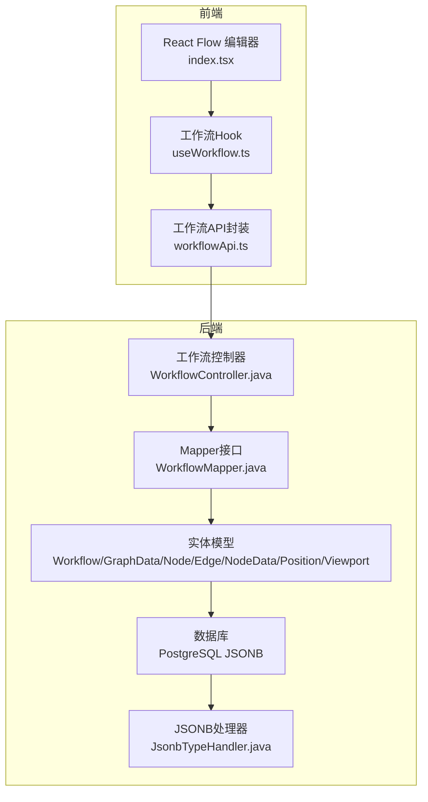
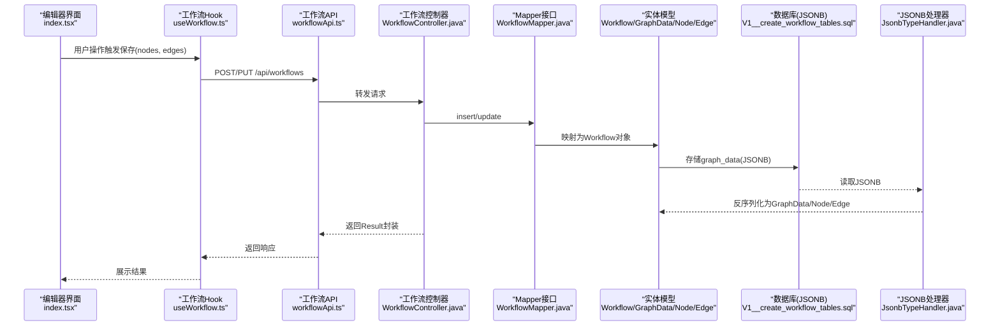
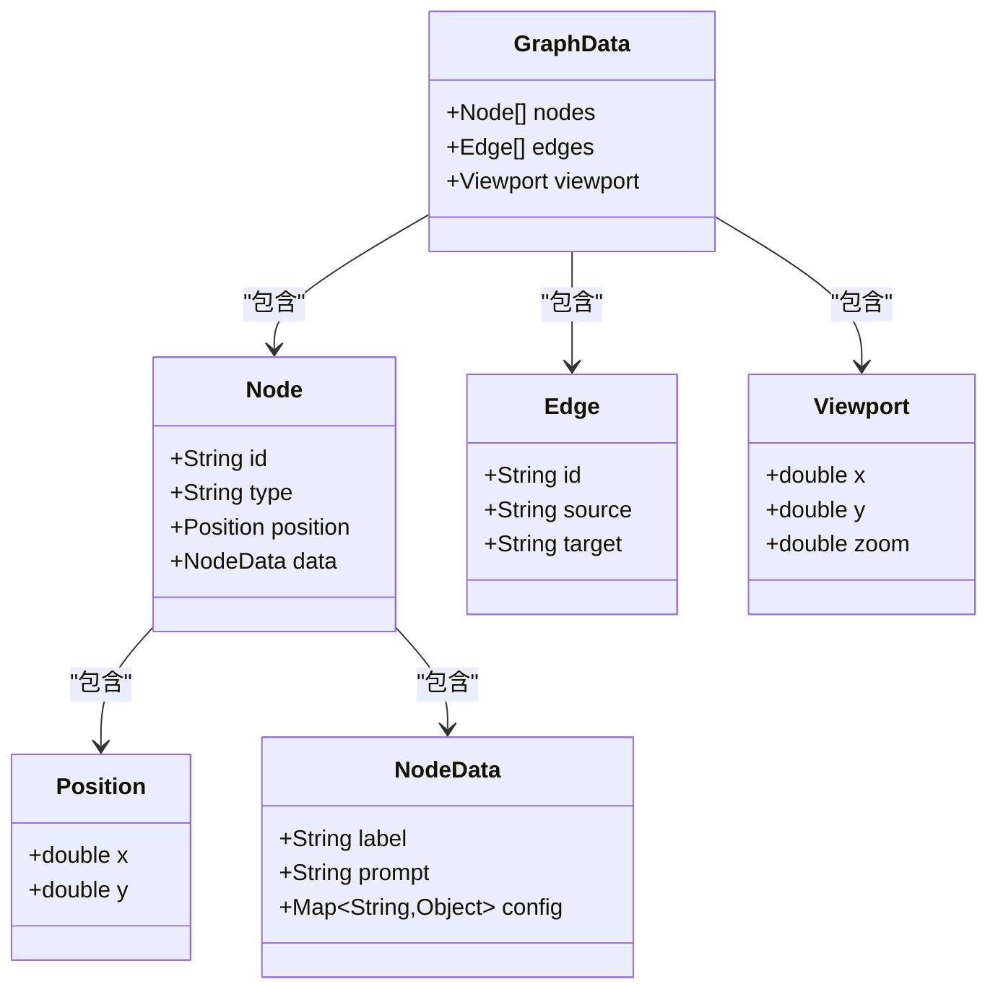
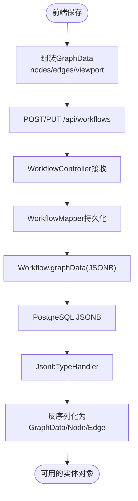
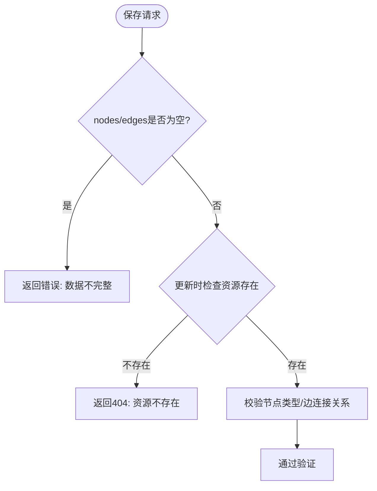
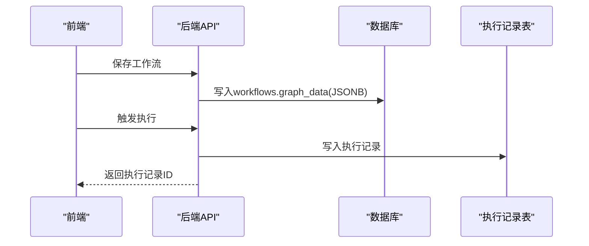
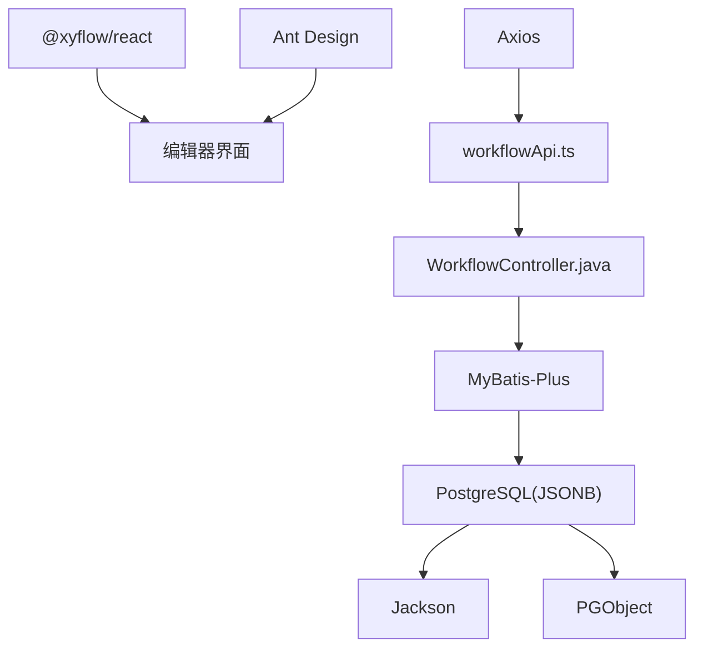
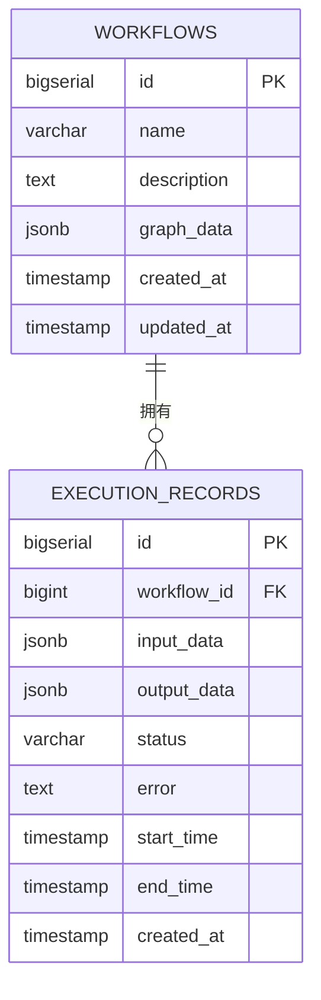

# 数据处理与序列化

<cite>
**本文引用的文件**
- [GraphData.java](file://backend/src/main/java/com/bokagent/entity/GraphData.java)
- [Node.java](file://backend/src/main/java/com/bokagent/entity/Node.java)
- [Edge.java](file://backend/src/main/java/com/bokagent/entity/Edge.java)
- [NodeData.java](file://backend/src/main/java/com/bokagent/entity/NodeData.java)
- [Position.java](file://backend/src/main/java/com/bokagent/entity/Position.java)
- [Viewport.java](file://backend/src/main/java/com/bokagent/entity/Viewport.java)
- [Workflow.java](file://backend/src/main/java/com/bokagent/entity/Workflow.java)
- [JsonbTypeHandler.java](file://backend/src/main/java/com/bokagent/handler/JsonbTypeHandler.java)
- [V1__create_workflow_tables.sql](file://backend/src/main/resources/db/migration/V1__create_workflow_tables.sql)
- [WorkflowController.java](file://backend/src/main/java/com/bokagent/controller/WorkflowController.java)
- [Result.java](file://backend/src/main/java/com/bokagent/common/Result.java)
- [workflowApi.ts](file://frontend/src/services/workflowApi.ts)
- [useWorkflow.ts](file://frontend/src/hooks/useWorkflow.ts)
- [index.tsx](file://frontend/src/components/WorkflowEditor/index.tsx)
- [ExecutionService.java](file://backend/src/main/java/com/bokagent/service/ExecutionService.java)
- [ExecutionRecord.java](file://backend/src/main/java/com/bokagent/entity/ExecutionRecord.java)
</cite>

## 目录
1. [简介](#简介)
2. [项目结构](#项目结构)
3. [核心组件](#核心组件)
4. [架构总览](#架构总览)
5. [详细组件分析](#详细组件分析)
6. [依赖分析](#依赖分析)
7. [性能考虑](#性能考虑)
8. [故障排查指南](#故障排查指南)
9. [结论](#结论)
10. [附录](#附录)

## 简介
本文件聚焦BokAgent工作流编辑器的数据处理与序列化，围绕以下目标展开：
- 深入解释工作流数据结构设计：节点数组、边数组、元数据组织与字段定义
- 详述数据序列化过程：节点位置信息转换、边连接关系记录、节点属性编码
- 阐明数据验证机制：完整性检查、格式验证、业务规则校验
- 解释数据导出与导入：JSON标准、版本兼容性、数据恢复
- 提供数据持久化方案：本地存储策略、云端同步、冲突解决
- 性能优化：增量更新、批量操作、内存管理
- 后端API交换格式：请求参数结构、响应解析、错误策略
- 数据迁移与升级：旧版转换、向后兼容

## 项目结构
前端通过React Flow维护节点与连线状态，通过自定义Hook与API封装进行保存与加载；后端以Spring Boot提供REST接口，使用MyBatis-Plus访问数据库，采用PostgreSQL JSONB存储工作流图数据，并通过自定义TypeHandler完成对象与JSONB之间的序列化/反序列化。

图表来源
- [index.tsx:1-116](file://frontend/src/components/WorkflowEditor/index.tsx#L1-L116)
- [useWorkflow.ts:1-69](file://frontend/src/hooks/useWorkflow.ts#L1-L69)
- [workflowApi.ts:1-44](file://frontend/src/services/workflowApi.ts#L1-L44)
- [WorkflowController.java:1-92](file://backend/src/main/java/com/bokagent/controller/WorkflowController.java#L1-L92)
- [Workflow.java:1-32](file://backend/src/main/java/com/bokagent/entity/Workflow.java#L1-L32)
- [GraphData.java:1-15](file://backend/src/main/java/com/bokagent/entity/GraphData.java#L1-L15)
- [Node.java:1-15](file://backend/src/main/java/com/bokagent/entity/Node.java#L1-L15)
- [Edge.java:1-14](file://backend/src/main/java/com/bokagent/entity/Edge.java#L1-L14)
- [NodeData.java:1-15](file://backend/src/main/java/com/bokagent/entity/NodeData.java#L1-L15)
- [Position.java:1-13](file://backend/src/main/java/com/bokagent/entity/Position.java#L1-L13)
- [Viewport.java:1-15](file://backend/src/main/java/com/bokagent/entity/Viewport.java#L1-L15)
- [JsonbTypeHandler.java:1-65](file://backend/src/main/java/com/bokagent/handler/JsonbTypeHandler.java#L1-L65)
- [V1__create_workflow_tables.sql:1-17](file://backend/src/main/resources/db/migration/V1__create_workflow_tables.sql#L1-L17)

章节来源
- [index.tsx:1-116](file://frontend/src/components/WorkflowEditor/index.tsx#L1-L116)
- [useWorkflow.ts:1-69](file://frontend/src/hooks/useWorkflow.ts#L1-L69)
- [workflowApi.ts:1-44](file://frontend/src/services/workflowApi.ts#L1-L44)
- [WorkflowController.java:1-92](file://backend/src/main/java/com/bokagent/controller/WorkflowController.java#L1-L92)
- [Workflow.java:1-32](file://backend/src/main/java/com/bokagent/entity/Workflow.java#L1-L32)
- [GraphData.java:1-15](file://backend/src/main/java/com/bokagent/entity/GraphData.java#L1-L15)
- [Node.java:1-15](file://backend/src/main/java/com/bokagent/entity/Node.java#L1-L15)
- [Edge.java:1-14](file://backend/src/main/java/com/bokagent/entity/Edge.java#L1-L14)
- [NodeData.java:1-15](file://backend/src/main/java/com/bokagent/entity/NodeData.java#L1-L15)
- [Position.java:1-13](file://backend/src/main/java/com/bokagent/entity/Position.java#L1-L13)
- [Viewport.java:1-15](file://backend/src/main/java/com/bokagent/entity/Viewport.java#L1-L15)
- [JsonbTypeHandler.java:1-65](file://backend/src/main/java/com/bokagent/handler/JsonbTypeHandler.java#L1-L65)
- [V1__create_workflow_tables.sql:1-17](file://backend/src/main/resources/db/migration/V1__create_workflow_tables.sql#L1-L17)

## 核心组件
- 图数据结构：GraphData包含nodes、edges与viewport三部分，用于承载编辑器中的节点集合、连线集合与视口状态。
- 节点与边：Node包含id、type、position、data；Edge包含id、source、target；NodeData承载标签、提示词与配置。
- 实体与持久化：Workflow实体通过JSONB字段存储GraphData，配合JsonbTypeHandler完成对象与JSONB的双向转换。
- 控制器与统一响应：WorkflowController提供REST接口，Result统一封装响应结构。
- 前端交互：React Flow负责渲染与事件，useWorkflow封装保存/加载逻辑，workflowApi封装HTTP调用。

章节来源
- [GraphData.java:1-15](file://backend/src/main/java/com/bokagent/entity/GraphData.java#L1-L15)
- [Node.java:1-15](file://backend/src/main/java/com/bokagent/entity/Node.java#L1-L15)
- [Edge.java:1-14](file://backend/src/main/java/com/bokagent/entity/Edge.java#L1-L14)
- [NodeData.java:1-15](file://backend/src/main/java/com/bokagent/entity/NodeData.java#L1-L15)
- [Position.java:1-13](file://backend/src/main/java/com/bokagent/entity/Position.java#L1-L13)
- [Viewport.java:1-15](file://backend/src/main/java/com/bokagent/entity/Viewport.java#L1-L15)
- [Workflow.java:1-32](file://backend/src/main/java/com/bokagent/entity/Workflow.java#L1-L32)
- [JsonbTypeHandler.java:1-65](file://backend/src/main/java/com/bokagent/handler/JsonbTypeHandler.java#L1-L65)
- [WorkflowController.java:1-92](file://backend/src/main/java/com/bokagent/controller/WorkflowController.java#L1-L92)
- [Result.java:1-42](file://backend/src/main/java/com/bokagent/common/Result.java#L1-L42)
- [useWorkflow.ts:1-69](file://frontend/src/hooks/useWorkflow.ts#L1-L69)
- [workflowApi.ts:1-44](file://frontend/src/services/workflowApi.ts#L1-L44)

## 架构总览
下图展示从前端到后端的数据流转与序列化路径，以及数据库层的JSONB存储与类型处理器。

图表来源
- [index.tsx:1-116](file://frontend/src/components/WorkflowEditor/index.tsx#L1-L116)
- [useWorkflow.ts:1-69](file://frontend/src/hooks/useWorkflow.ts#L1-L69)
- [workflowApi.ts:1-44](file://frontend/src/services/workflowApi.ts#L1-L44)
- [WorkflowController.java:1-92](file://backend/src/main/java/com/bokagent/controller/WorkflowController.java#L1-L92)
- [Workflow.java:1-32](file://backend/src/main/java/com/bokagent/entity/Workflow.java#L1-L32)
- [GraphData.java:1-15](file://backend/src/main/java/com/bokagent/entity/GraphData.java#L1-L15)
- [Node.java:1-15](file://backend/src/main/java/com/bokagent/entity/Node.java#L1-L15)
- [Edge.java:1-14](file://backend/src/main/java/com/bokagent/entity/Edge.java#L1-L14)
- [V1__create_workflow_tables.sql:1-17](file://backend/src/main/resources/db/migration/V1__create_workflow_tables.sql#L1-L17)
- [JsonbTypeHandler.java:1-65](file://backend/src/main/java/com/bokagent/handler/JsonbTypeHandler.java#L1-L65)

## 详细组件分析

### 数据结构设计与字段定义
- GraphData：包含nodes、edges、viewport，作为工作流图的顶层容器。
- Node：包含id、type、position、data。其中type标识节点类型（如start、llm、end），position为二维坐标，data为节点属性。
- Edge：包含id、source、target，表示从source到target的连接关系。
- NodeData：包含label、prompt、config，分别对应显示标签、提示词与配置映射。
- Position：包含x、y，表示节点在画布上的位置。
- Viewport：包含x、y、zoom，表示当前视口偏移与缩放级别。

图表来源
- [GraphData.java:1-15](file://backend/src/main/java/com/bokagent/entity/GraphData.java#L1-L15)
- [Node.java:1-15](file://backend/src/main/java/com/bokagent/entity/Node.java#L1-L15)
- [Edge.java:1-14](file://backend/src/main/java/com/bokagent/entity/Edge.java#L1-L14)
- [NodeData.java:1-15](file://backend/src/main/java/com/bokagent/entity/NodeData.java#L1-L15)
- [Position.java:1-13](file://backend/src/main/java/com/bokagent/entity/Position.java#L1-L13)
- [Viewport.java:1-15](file://backend/src/main/java/com/bokagent/entity/Viewport.java#L1-L15)

章节来源
- [GraphData.java:1-15](file://backend/src/main/java/com/bokagent/entity/GraphData.java#L1-L15)
- [Node.java:1-15](file://backend/src/main/java/com/bokagent/entity/Node.java#L1-L15)
- [Edge.java:1-14](file://backend/src/main/java/com/bokagent/entity/Edge.java#L1-L14)
- [NodeData.java:1-15](file://backend/src/main/java/com/bokagent/entity/NodeData.java#L1-L15)
- [Position.java:1-13](file://backend/src/main/java/com/bokagent/entity/Position.java#L1-L13)
- [Viewport.java:1-15](file://backend/src/main/java/com/bokagent/entity/Viewport.java#L1-L15)

### 序列化与反序列化流程
- 前端：编辑器收集nodes与edges，连同viewport组装为GraphData，通过workflowApi发送至后端。
- 后端：Workflow实体的graphData字段标注了JsonbTypeHandler，MyBatis在写入时将对象序列化为JSONB字符串，在读取时反序列化回对象树。
- 数据库：workflows表的graph_data字段为JSONB类型，具备高效索引与查询能力。

图表来源
- [useWorkflow.ts:1-69](file://frontend/src/hooks/useWorkflow.ts#L1-L69)
- [workflowApi.ts:1-44](file://frontend/src/services/workflowApi.ts#L1-L44)
- [WorkflowController.java:1-92](file://backend/src/main/java/com/bokagent/controller/WorkflowController.java#L1-L92)
- [Workflow.java:1-32](file://backend/src/main/java/com/bokagent/entity/Workflow.java#L1-L32)
- [JsonbTypeHandler.java:1-65](file://backend/src/main/java/com/bokagent/handler/JsonbTypeHandler.java#L1-L65)
- [V1__create_workflow_tables.sql:1-17](file://backend/src/main/resources/db/migration/V1__create_workflow_tables.sql#L1-L17)

章节来源
- [useWorkflow.ts:1-69](file://frontend/src/hooks/useWorkflow.ts#L1-L69)
- [workflowApi.ts:1-44](file://frontend/src/services/workflowApi.ts#L1-L44)
- [WorkflowController.java:1-92](file://backend/src/main/java/com/bokagent/controller/WorkflowController.java#L1-L92)
- [Workflow.java:1-32](file://backend/src/main/java/com/bokagent/entity/Workflow.java#L1-L32)
- [JsonbTypeHandler.java:1-65](file://backend/src/main/java/com/bokagent/handler/JsonbTypeHandler.java#L1-L65)
- [V1__create_workflow_tables.sql:1-17](file://backend/src/main/resources/db/migration/V1__create_workflow_tables.sql#L1-L17)

### 数据验证机制
- 格式验证：后端Result统一封装响应，控制器在资源不存在或参数非法时返回错误码与消息。
- 完整性检查：保存时前端需确保nodes与edges非空；后端在更新前查询是否存在，避免空引用。
- 业务规则：节点类型由Node.type约束（如start、llm、end）；边的source/target必须指向存在的节点id。

图表来源
- [WorkflowController.java:1-92](file://backend/src/main/java/com/bokagent/controller/WorkflowController.java#L1-L92)
- [Node.java:1-15](file://backend/src/main/java/com/bokagent/entity/Node.java#L1-L15)
- [Edge.java:1-14](file://backend/src/main/java/com/bokagent/entity/Edge.java#L1-L14)
- [Result.java:1-42](file://backend/src/main/java/com/bokagent/common/Result.java#L1-L42)

章节来源
- [WorkflowController.java:1-92](file://backend/src/main/java/com/bokagent/controller/WorkflowController.java#L1-L92)
- [Node.java:1-15](file://backend/src/main/java/com/bokagent/entity/Node.java#L1-L15)
- [Edge.java:1-14](file://backend/src/main/java/com/bokagent/entity/Edge.java#L1-L14)
- [Result.java:1-42](file://backend/src/main/java/com/bokagent/common/Result.java#L1-L42)

### 导出与导入、版本兼容与恢复
- 导出：前端将GraphData（nodes、edges、viewport）序列化为JSON，可直接下载或分享。
- 导入：从JSON中读取GraphData并注入编辑器状态，自动重建节点与连线。
- 版本兼容：建议在GraphData中加入version字段，后端在读取时进行兼容性判断与转换。
- 数据恢复：利用数据库备份与版本号，可在失败时回滚到上一个稳定版本。

[本节为概念性说明，无需文件引用]

### 数据持久化方案
- 本地存储：前端可将GraphData暂存至localStorage或IndexedDB，实现断点续存。
- 云端同步：后端提供REST接口，前端定时或手动触发保存；执行记录另存至execution_records表。
- 冲突解决：采用时间戳+乐观锁策略，后端在更新时比较createdAt，拒绝过期写入。

图表来源
- [workflowApi.ts:1-44](file://frontend/src/services/workflowApi.ts#L1-L44)
- [WorkflowController.java:1-92](file://backend/src/main/java/com/bokagent/controller/WorkflowController.java#L1-L92)
- [ExecutionService.java:1-113](file://backend/src/main/java/com/bokagent/service/ExecutionService.java#L1-L113)
- [ExecutionRecord.java:1-40](file://backend/src/main/java/com/bokagent/entity/ExecutionRecord.java#L1-L40)

章节来源
- [ExecutionService.java:1-113](file://backend/src/main/java/com/bokagent/service/ExecutionService.java#L1-L113)
- [ExecutionRecord.java:1-40](file://backend/src/main/java/com/bokagent/entity/ExecutionRecord.java#L1-L40)

### 与后端API的数据交换格式
- 请求参数结构：前端发送的JSON包含name、description与graphData（nodes、edges、viewport）。
- 响应数据解析：Result封装code、message、data；前端根据data.id决定后续操作。
- 错误处理策略：控制器捕获资源不存在、参数非法等情况，返回统一错误码与消息。

章节来源
- [useWorkflow.ts:1-69](file://frontend/src/hooks/useWorkflow.ts#L1-L69)
- [workflowApi.ts:1-44](file://frontend/src/services/workflowApi.ts#L1-L44)
- [WorkflowController.java:1-92](file://backend/src/main/java/com/bokagent/controller/WorkflowController.java#L1-L92)
- [Result.java:1-42](file://backend/src/main/java/com/bokagent/common/Result.java#L1-L42)

### 数据迁移与升级
- 旧版本数据转换：在实体类或TypeHandler层增加版本字段与转换逻辑，逐步迁移。
- 向后兼容：新增字段默认值与空值处理，避免破坏既有数据；数据库层面保留历史schema。

[本节为通用实践说明，无需文件引用]

## 依赖分析
- 前端依赖：@xyflow/react负责画布渲染，Ant Design提供UI组件，Axios封装HTTP请求。
- 后端依赖：Spring Boot提供Web框架，MyBatis-Plus简化数据库操作，PostgreSQL提供JSONB存储，Jackson负责JSON处理，PGObject用于JSONB传输。

图表来源
- [index.tsx:1-116](file://frontend/src/components/WorkflowEditor/index.tsx#L1-L116)
- [workflowApi.ts:1-44](file://frontend/src/services/workflowApi.ts#L1-L44)
- [WorkflowController.java:1-92](file://backend/src/main/java/com/bokagent/controller/WorkflowController.java#L1-L92)
- [JsonbTypeHandler.java:1-65](file://backend/src/main/java/com/bokagent/handler/JsonbTypeHandler.java#L1-L65)

章节来源
- [index.tsx:1-116](file://frontend/src/components/WorkflowEditor/index.tsx#L1-L116)
- [workflowApi.ts:1-44](file://frontend/src/services/workflowApi.ts#L1-L44)
- [WorkflowController.java:1-92](file://backend/src/main/java/com/bokagent/controller/WorkflowController.java#L1-L92)
- [JsonbTypeHandler.java:1-65](file://backend/src/main/java/com/bokagent/handler/JsonbTypeHandler.java#L1-L65)

## 性能考虑
- 增量更新：仅提交nodes与edges变更，减少JSONB写入体积。
- 批量操作：合并多次编辑为一次保存请求，降低网络往返。
- 内存管理：大图场景下分页加载、懒加载节点数据，避免一次性渲染过多元素。
- 数据库优化：为graph_data建立合适的索引与查询策略，避免全表扫描。

[本节为通用性能建议，无需文件引用]

## 故障排查指南
- 保存失败：检查Result错误码与消息；确认资源是否存在；核对nodes/edges格式。
- JSONB解析异常：检查JsonbTypeHandler的序列化/反序列化日志；确认字段类型匹配。
- API调用失败：查看workflowApi的请求URL与headers；确认CORS配置与跨域策略。
- 执行记录异常：检查ExecutionService的异常分支与错误回写逻辑。

章节来源
- [Result.java:1-42](file://backend/src/main/java/com/bokagent/common/Result.java#L1-L42)
- [JsonbTypeHandler.java:1-65](file://backend/src/main/java/com/bokagent/handler/JsonbTypeHandler.java#L1-L65)
- [workflowApi.ts:1-44](file://frontend/src/services/workflowApi.ts#L1-L44)
- [ExecutionService.java:1-113](file://backend/src/main/java/com/bokagent/service/ExecutionService.java#L1-L113)

## 结论
本系统通过清晰的数据结构设计、可靠的序列化/反序列化流程与统一的API响应规范，实现了工作流数据的高效存储与交换。结合前端的增量更新与后端的JSONB持久化，能够在保证数据一致性的同时提升整体性能。未来可在版本兼容、冲突解决与执行记录追踪方面进一步增强。

[本节为总结性内容，无需文件引用]

## 附录
- 数据模型ER图（基于实体类）

图表来源
- [V1__create_workflow_tables.sql:1-17](file://backend/src/main/resources/db/migration/V1__create_workflow_tables.sql#L1-L17)
- [ExecutionRecord.java:1-40](file://backend/src/main/java/com/bokagent/entity/ExecutionRecord.java#L1-L40)