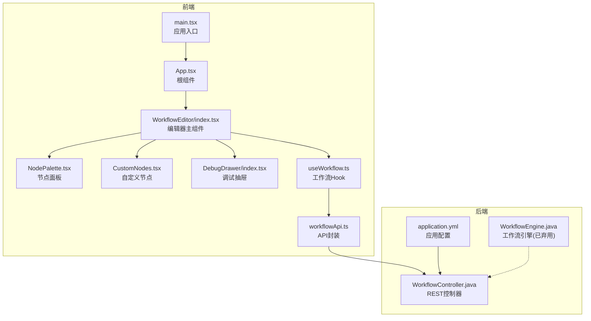
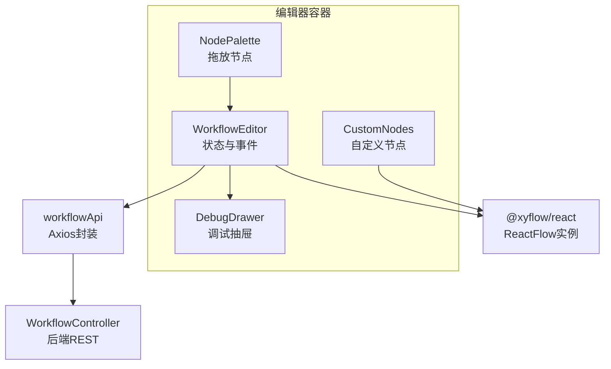
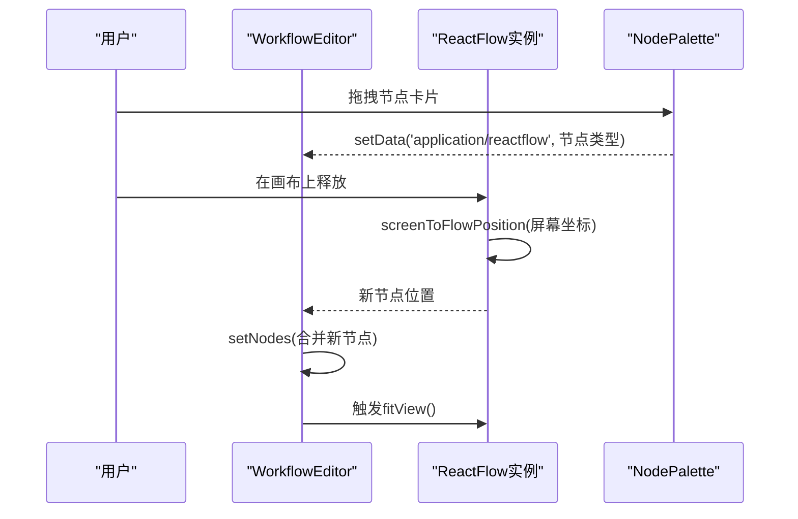
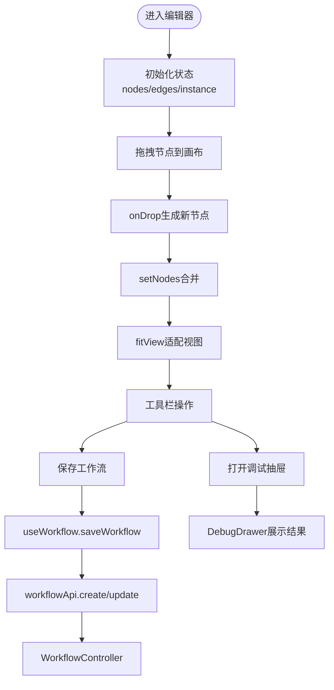
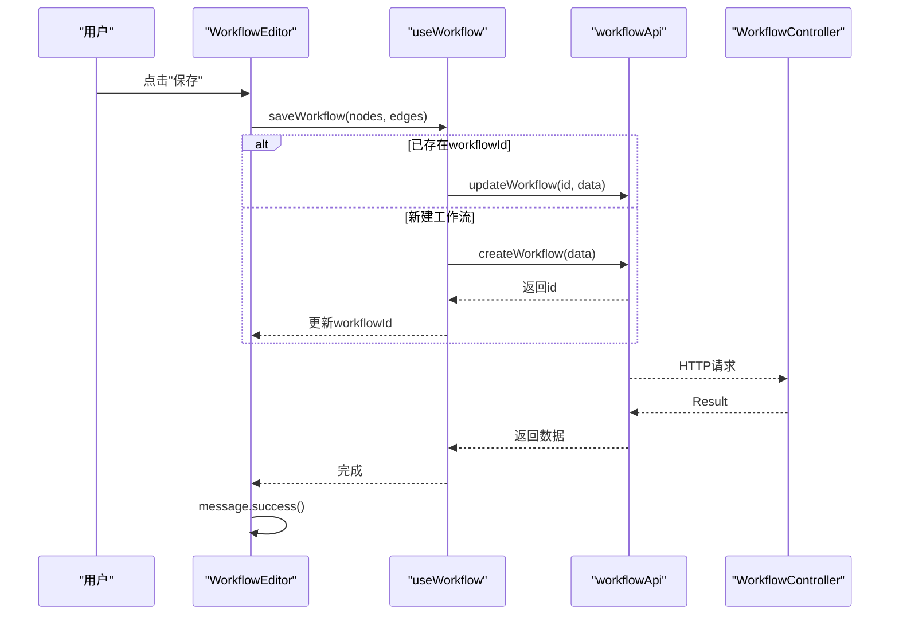
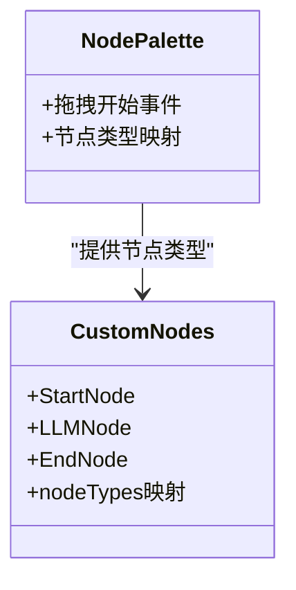
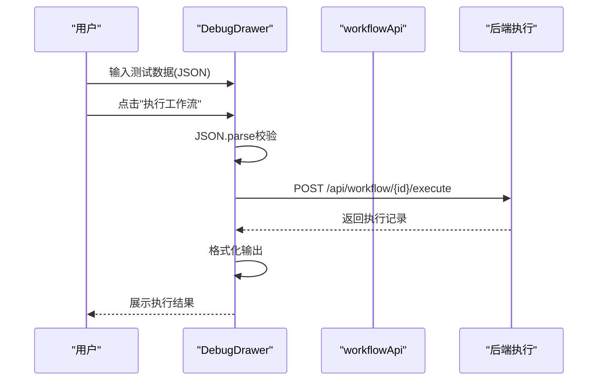
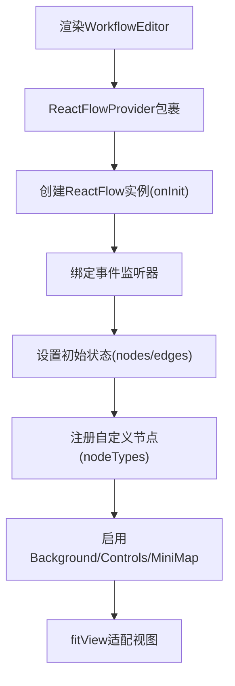
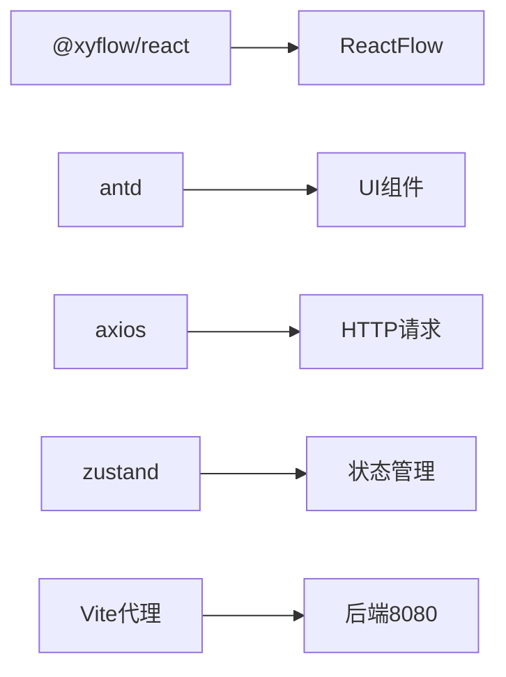

# 编辑器架构设计

<cite>
**本文引用的文件**
- [frontend/src/App.tsx](file://frontend/src/App.tsx)
- [frontend/src/main.tsx](file://frontend/src/main.tsx)
- [frontend/src/components/WorkflowEditor/index.tsx](file://frontend/src/components/WorkflowEditor/index.tsx)
- [frontend/src/components/WorkflowEditor/NodePalette.tsx](file://frontend/src/components/WorkflowEditor/NodePalette.tsx)
- [frontend/src/components/WorkflowEditor/CustomNodes.tsx](file://frontend/src/components/WorkflowEditor/CustomNodes.tsx)
- [frontend/src/components/DebugDrawer/index.tsx](file://frontend/src/components/DebugDrawer/index.tsx)
- [frontend/src/hooks/useWorkflow.ts](file://frontend/src/hooks/useWorkflow.ts)
- [frontend/src/services/workflowApi.ts](file://frontend/src/services/workflowApi.ts)
- [frontend/package.json](file://frontend/package.json)
- [frontend/vite.config.ts](file://frontend/vite.config.ts)
- [backend/src/main/java/com/bokagent/controller/WorkflowController.java](file://backend/src/main/java/com/bokagent/controller/WorkflowController.java)
- [backend/src/main/resources/application.yml](file://backend/src/main/resources/application.yml)
- [backend/src/main/java/com/bokagent/engine/WorkflowEngine.java](file://backend/src/main/java/com/bokagent/engine/WorkflowEngine.java)
- [README.md](file://README.md)
- [docs/PROJECT_STRUCTURE.md](file://docs/PROJECT_STRUCTURE.md)
</cite>

## 目录
1. [简介](#简介)
2. [项目结构](#项目结构)
3. [核心组件](#核心组件)
4. [架构总览](#架构总览)
5. [详细组件分析](#详细组件分析)
6. [依赖分析](#依赖分析)
7. [性能考虑](#性能考虑)
8. [故障排除指南](#故障排除指南)
9. [结论](#结论)
10. [附录](#附录)

## 简介
本技术文档围绕BokAgent工作流编辑器的架构设计展开，重点阐述React Flow Provider的集成方式、全局状态管理与实例初始化、上下文传递机制；详细说明编辑器的整体布局结构（左侧节点面板、主画布区域、右侧调试抽屉）、工具栏功能逻辑与事件处理；解释画布基本配置（背景网格、控制控件、小地图）；给出编辑器初始化流程（React Flow实例创建、事件监听器绑定、默认状态设置）；并总结架构决策的技术考量（组件拆分原则、状态管理模式、性能优化策略）。文档同时结合前后端交互、代理配置与后端控制器，帮助读者全面理解端到端实现。

## 项目结构
前端采用React 18 + TypeScript + Vite + Ant Design 5 + React Flow的组合，后端采用Spring Boot 3.5 + Spring AI + MyBatis-Plus。项目通过Vite的开发服务器代理将前端对/api的请求转发至后端8080端口，形成前后端一体化开发体验。

**图表来源**
- [frontend/src/main.tsx:1-22](file://frontend/src/main.tsx#L1-L22)
- [frontend/src/App.tsx:1-21](file://frontend/src/App.tsx#L1-L21)
- [frontend/src/components/WorkflowEditor/index.tsx:1-116](file://frontend/src/components/WorkflowEditor/index.tsx#L1-L116)
- [frontend/src/components/WorkflowEditor/NodePalette.tsx:1-48](file://frontend/src/components/WorkflowEditor/NodePalette.tsx#L1-L48)
- [frontend/src/components/WorkflowEditor/CustomNodes.tsx:1-81](file://frontend/src/components/WorkflowEditor/CustomNodes.tsx#L1-L81)
- [frontend/src/components/DebugDrawer/index.tsx:1-141](file://frontend/src/components/DebugDrawer/index.tsx#L1-L141)
- [frontend/src/hooks/useWorkflow.ts:1-69](file://frontend/src/hooks/useWorkflow.ts#L1-L69)
- [frontend/src/services/workflowApi.ts:1-44](file://frontend/src/services/workflowApi.ts#L1-L44)
- [backend/src/main/java/com/bokagent/controller/WorkflowController.java:1-92](file://backend/src/main/java/com/bokagent/controller/WorkflowController.java#L1-L92)
- [backend/src/main/resources/application.yml:1-190](file://backend/src/main/resources/application.yml#L1-L190)
- [backend/src/main/java/com/bokagent/engine/WorkflowEngine.java:1-171](file://backend/src/main/java/com/bokagent/engine/WorkflowEngine.java#L1-L171)

**章节来源**
- [frontend/src/main.tsx:1-22](file://frontend/src/main.tsx#L1-L22)
- [frontend/src/App.tsx:1-21](file://frontend/src/App.tsx#L1-L21)
- [frontend/vite.config.ts:1-21](file://frontend/vite.config.ts#L1-L21)
- [docs/PROJECT_STRUCTURE.md:90-141](file://docs/PROJECT_STRUCTURE.md#L90-L141)

## 核心组件
- React Flow Provider集成与实例初始化：编辑器主组件通过ReactFlowProvider包裹ReactFlow实例，使用useNodesState与useEdgesState管理节点与边的状态，onInit回调获取实例句柄以支持拖放定位与视图操作。
- 全局状态管理：编辑器内部通过useState管理React Flow实例、调试抽屉可见性；工作流状态通过自定义Hook useWorkflow集中管理，包含保存、加载、重置等能力。
- 上下文传递机制：节点面板通过HTML5拖放API将节点类型传递给画布；画布通过React Flow实例的screenToFlowPosition计算落点位置；调试抽屉接收当前nodes与edges作为只读输入。
- 画布配置：启用Background、Controls、MiniMap三个核心UI组件，fitView自动适配视图，支持拖拽覆盖与连接事件处理。
- 工具栏：包含保存与调试两个按钮，分别触发保存工作流与打开调试抽屉；调试按钮在节点为空时禁用。

**章节来源**
- [frontend/src/components/WorkflowEditor/index.tsx:1-116](file://frontend/src/components/WorkflowEditor/index.tsx#L1-L116)
- [frontend/src/hooks/useWorkflow.ts:1-69](file://frontend/src/hooks/useWorkflow.ts#L1-L69)
- [frontend/src/components/WorkflowEditor/NodePalette.tsx:1-48](file://frontend/src/components/WorkflowEditor/NodePalette.tsx#L1-L48)
- [frontend/src/components/DebugDrawer/index.tsx:1-141](file://frontend/src/components/DebugDrawer/index.tsx#L1-L141)

## 架构总览
编辑器采用“容器-组件”分层设计：容器组件负责状态与事件处理，展示组件负责UI渲染；通过React Flow Provider提供上下文，自定义节点承载业务数据（如提示词），调试抽屉提供执行与结果展示。

**图表来源**
- [frontend/src/components/WorkflowEditor/index.tsx:1-116](file://frontend/src/components/WorkflowEditor/index.tsx#L1-L116)
- [frontend/src/components/WorkflowEditor/NodePalette.tsx:1-48](file://frontend/src/components/WorkflowEditor/NodePalette.tsx#L1-L48)
- [frontend/src/components/WorkflowEditor/CustomNodes.tsx:1-81](file://frontend/src/components/WorkflowEditor/CustomNodes.tsx#L1-L81)
- [frontend/src/components/DebugDrawer/index.tsx:1-141](file://frontend/src/components/DebugDrawer/index.tsx#L1-L141)
- [frontend/src/services/workflowApi.ts:1-44](file://frontend/src/services/workflowApi.ts#L1-L44)
- [backend/src/main/java/com/bokagent/controller/WorkflowController.java:1-92](file://backend/src/main/java/com/bokagent/controller/WorkflowController.java#L1-L92)

## 详细组件分析

### React Flow Provider集成与实例初始化
- Provider包裹：编辑器主组件在画布外层使用ReactFlowProvider，确保子组件可访问React Flow上下文。
- 实例获取：通过onInit回调将React Flow实例保存到组件状态，供拖放定位使用（screenToFlowPosition）。
- 状态钩子：useNodesState与useEdgesState分别管理节点与边的增删改查，配合onNodesChange与onEdgesChange实现响应式更新。
- 连接与拖放：onConnect使用addEdge辅助函数追加边；onDragOver阻止默认行为并设置dropEffect；onDrop根据实例坐标生成新节点并合并到nodes。

**图表来源**
- [frontend/src/components/WorkflowEditor/index.tsx:23-52](file://frontend/src/components/WorkflowEditor/index.tsx#L23-L52)
- [frontend/src/components/WorkflowEditor/NodePalette.tsx:12-15](file://frontend/src/components/WorkflowEditor/NodePalette.tsx#L12-L15)

**章节来源**
- [frontend/src/components/WorkflowEditor/index.tsx:11-116](file://frontend/src/components/WorkflowEditor/index.tsx#L11-L116)

### 全局状态管理与上下文传递
- 编辑器内部状态：React Flow实例、调试抽屉可见性。
- 工作流状态：通过useWorkflow Hook集中管理workflowId与loading，封装保存/加载/重置逻辑。
- 上下文传递：节点面板通过setData传递节点类型；画布通过实例方法转换坐标；调试抽屉接收nodes与edges作为props。

**图表来源**
- [frontend/src/components/WorkflowEditor/index.tsx:11-116](file://frontend/src/components/WorkflowEditor/index.tsx#L11-L116)
- [frontend/src/hooks/useWorkflow.ts:8-39](file://frontend/src/hooks/useWorkflow.ts#L8-L39)
- [frontend/src/services/workflowApi.ts:11-26](file://frontend/src/services/workflowApi.ts#L11-L26)
- [backend/src/main/java/com/bokagent/controller/WorkflowController.java:48-76](file://backend/src/main/java/com/bokagent/controller/WorkflowController.java#L48-L76)

**章节来源**
- [frontend/src/hooks/useWorkflow.ts:1-69](file://frontend/src/hooks/useWorkflow.ts#L1-L69)

### 工具栏设计与事件处理
- 保存按钮：点击后调用saveWorkflow，根据是否存在workflowId决定创建或更新；成功后提示成功消息，失败则抛错并记录日志。
- 调试按钮：点击后设置debugVisible为true，打开右侧调试抽屉；当节点为空时禁用该按钮。
- 事件绑定：工具栏按钮直接绑定到组件内部的handleSave与setDebugVisible回调。

**图表来源**
- [frontend/src/components/WorkflowEditor/index.tsx:54-62](file://frontend/src/components/WorkflowEditor/index.tsx#L54-L62)
- [frontend/src/hooks/useWorkflow.ts:8-39](file://frontend/src/hooks/useWorkflow.ts#L8-L39)
- [frontend/src/services/workflowApi.ts:18-22](file://frontend/src/services/workflowApi.ts#L18-L22)
- [backend/src/main/java/com/bokagent/controller/WorkflowController.java:62-76](file://backend/src/main/java/com/bokagent/controller/WorkflowController.java#L62-L76)

**章节来源**
- [frontend/src/components/WorkflowEditor/index.tsx:54-79](file://frontend/src/components/WorkflowEditor/index.tsx#L54-L79)
- [frontend/src/hooks/useWorkflow.ts:8-39](file://frontend/src/hooks/useWorkflow.ts#L8-L39)

### 画布配置与UI组件
- 背景网格：Background组件提供网格样式，增强节点对齐感。
- 控制控件：Controls组件提供缩放、平移等交互控件。
- 小地图：MiniMap组件提供全局概览，便于快速导航。
- 视图适配：fitView自动调整视图以容纳所有节点与边。

**章节来源**
- [frontend/src/components/WorkflowEditor/index.tsx:95-99](file://frontend/src/components/WorkflowEditor/index.tsx#L95-L99)

### 节点面板与自定义节点
- 节点面板：提供开始、LLM、结束三类节点，支持拖拽到画布；每类节点具有不同颜色与图标。
- 自定义节点：StartNode、LLMNode、EndNode分别定义节点外观与Handle位置；LLM节点包含输入框以编辑提示词。

**图表来源**
- [frontend/src/components/WorkflowEditor/NodePalette.tsx:5-9](file://frontend/src/components/WorkflowEditor/NodePalette.tsx#L5-L9)
- [frontend/src/components/WorkflowEditor/CustomNodes.tsx:74-78](file://frontend/src/components/WorkflowEditor/CustomNodes.tsx#L74-L78)

**章节来源**
- [frontend/src/components/WorkflowEditor/NodePalette.tsx:1-48](file://frontend/src/components/WorkflowEditor/NodePalette.tsx#L1-L48)
- [frontend/src/components/WorkflowEditor/CustomNodes.tsx:1-81](file://frontend/src/components/WorkflowEditor/CustomNodes.tsx#L1-L81)

### 调试抽屉与执行流程
- 输入校验：测试输入数据必须为合法JSON，否则允许输入但不阻断。
- 执行调用：向后端发起POST请求执行工作流，接收执行记录并格式化输出。
- 结果展示：将执行状态、输出、错误、时间等信息以卡片形式展示；提供清空输出功能。
- 节点统计：显示当前节点数与连接数，辅助调试。

**图表来源**
- [frontend/src/components/DebugDrawer/index.tsx:17-67](file://frontend/src/components/DebugDrawer/index.tsx#L17-L67)
- [frontend/src/services/workflowApi.ts:29-41](file://frontend/src/services/workflowApi.ts#L29-L41)

**章节来源**
- [frontend/src/components/DebugDrawer/index.tsx:1-141](file://frontend/src/components/DebugDrawer/index.tsx#L1-L141)

### 编辑器初始化流程
- React Flow实例创建：在ReactFlowProvider内创建实例，onInit回调保存实例句柄。
- 事件监听器绑定：onNodesChange/onEdgesChange/onConnect/onDragOver/onDrop绑定到对应处理函数。
- 默认状态设置：初始nodes与edges为空数组，fitView自动适配；调试抽屉默认关闭。
- 节点类型注册：通过nodeTypes映射注册自定义节点组件。

**图表来源**
- [frontend/src/components/WorkflowEditor/index.tsx:83-99](file://frontend/src/components/WorkflowEditor/index.tsx#L83-L99)
- [frontend/src/components/WorkflowEditor/CustomNodes.tsx:74-78](file://frontend/src/components/WorkflowEditor/CustomNodes.tsx#L74-L78)

**章节来源**
- [frontend/src/components/WorkflowEditor/index.tsx:11-116](file://frontend/src/components/WorkflowEditor/index.tsx#L11-L116)

## 依赖分析
- 前端依赖：@xyflow/react提供React Flow核心能力；antd提供UI组件与国际化；axios封装HTTP请求；dayjs提供日期本地化；zustand用于状态管理（虽未在当前编辑器中直接使用，但已在依赖中声明）。
- 代理配置：Vite开发服务器将/api前缀代理到后端8080端口，/ws前缀代理到WebSocket端点，便于前后端联调。
- 后端依赖：Spring Boot + Spring AI + MyBatis-Plus + PostgreSQL + Redis + MinIO等，提供工作流存储、缓存、对象存储与多LLM集成能力。

**图表来源**
- [frontend/package.json:12-22](file://frontend/package.json#L12-L22)
- [frontend/vite.config.ts:7-18](file://frontend/vite.config.ts#L7-L18)

**章节来源**
- [frontend/package.json:1-37](file://frontend/package.json#L1-L37)
- [frontend/vite.config.ts:1-21](file://frontend/vite.config.ts#L1-L21)

## 性能考虑
- 组件拆分原则：将状态管理与UI渲染分离，减少不必要的重渲染；自定义节点仅在必要时更新数据。
- 状态管理模式：使用React内置状态与自定义Hook集中管理工作流状态，避免跨层级传递复杂上下文。
- 性能优化策略：启用fitView自动适配；合理使用Handle位置减少重绘；在调试抽屉中对输出内容进行节流展示；后端通过缓存与超时配置提升执行效率。

## 故障排除指南
- 保存失败：检查网络代理是否正常、后端接口是否可达、返回状态码与错误信息；前端使用message.error提示失败原因。
- 调试执行失败：确认节点数量大于0、测试输入为合法JSON、后端执行接口可用；查看控制台错误日志。
- 拖拽无效：确认节点面板的draggable与onDragStart事件已正确设置，且React Flow实例已初始化。

**章节来源**
- [frontend/src/components/WorkflowEditor/index.tsx:54-62](file://frontend/src/components/WorkflowEditor/index.tsx#L54-L62)
- [frontend/src/components/DebugDrawer/index.tsx:17-67](file://frontend/src/components/DebugDrawer/index.tsx#L17-L67)

## 结论
本编辑器通过React Flow Provider实现了可视化工作流的拖拽编排，结合Ant Design的UI组件与Axios的HTTP封装，形成了清晰的容器-组件架构。工具栏与调试抽屉提供了便捷的操作与反馈路径；画布的背景网格、控制控件与小地图增强了用户体验。整体架构遵循单一职责与状态集中管理的原则，具备良好的可扩展性与维护性。

## 附录
- 技术栈概览：前端React 18 + TypeScript + Vite + Ant Design 5 + React Flow；后端Spring Boot 3.5 + Spring AI + MyBatis-Plus。
- 项目启动：前端通过npm run dev启动，后端通过mvn spring-boot:run启动；Docker一键部署亦可参考项目文档。

**章节来源**
- [README.md:16-29](file://README.md#L16-L29)
- [docs/PROJECT_STRUCTURE.md:135-141](file://docs/PROJECT_STRUCTURE.md#L135-L141)