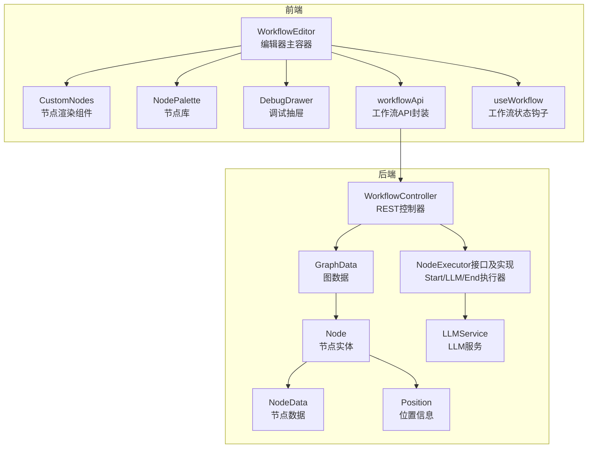
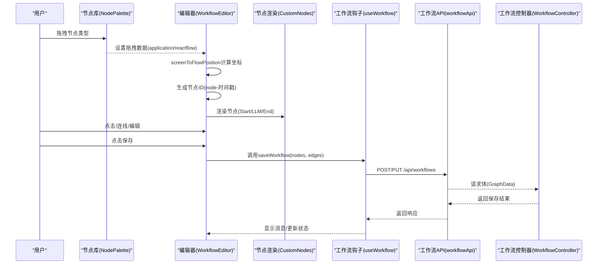
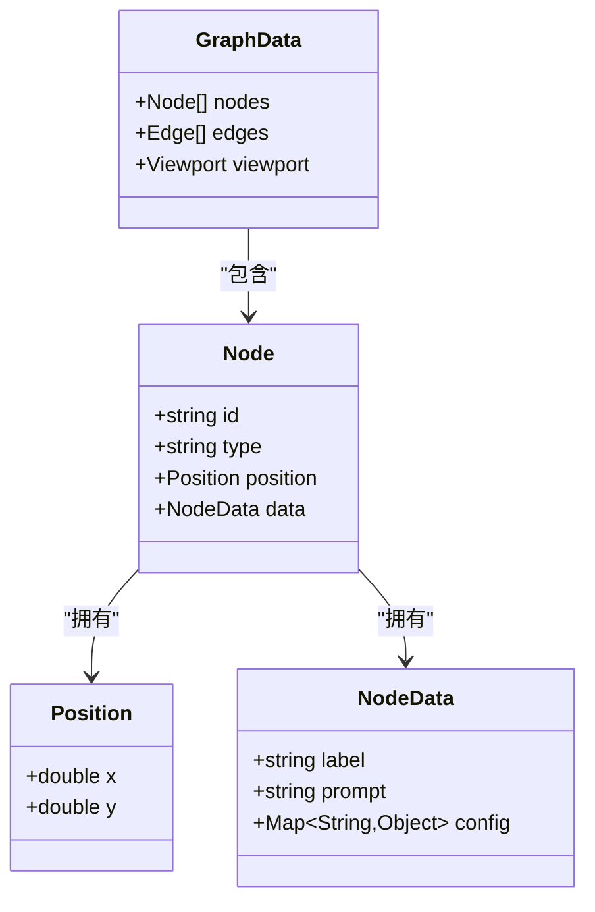
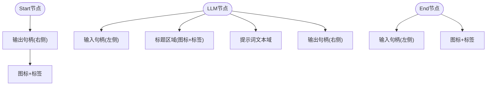
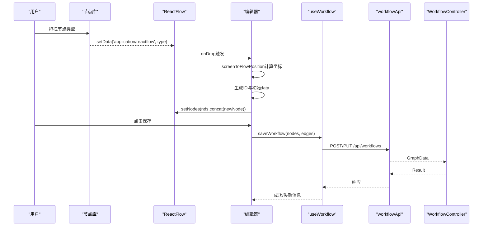
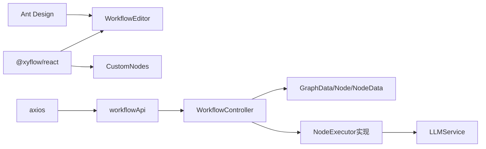

# 自定义节点实现

<cite>
**本文引用的文件**
- [CustomNodes.tsx](file://frontend/src/components/WorkflowEditor/CustomNodes.tsx)
- [index.tsx](file://frontend/src/components/WorkflowEditor/index.tsx)
- [NodePalette.tsx](file://frontend/src/components/WorkflowEditor/NodePalette.tsx)
- [useWorkflow.ts](file://frontend/src/hooks/useWorkflow.ts)
- [workflowApi.ts](file://frontend/src/services/workflowApi.ts)
- [index.tsx](file://frontend/src/components/DebugDrawer/index.tsx)
- [Node.java](file://backend/src/main/java/com/bokagent/entity/Node.java)
- [NodeData.java](file://backend/src/main/java/com/bokagent/entity/NodeData.java)
- [Position.java](file://backend/src/main/java/com/bokagent/entity/Position.java)
- [GraphData.java](file://backend/src/main/java/com/bokagent/entity/GraphData.java)
- [NodeExecutor.java](file://backend/src/main/java/com/bokagent/engine/NodeExecutor.java)
- [StartNodeExecutor.java](file://backend/src/main/java/com/bokagent/engine/StartNodeExecutor.java)
- [LLMNodeExecutor.java](file://backend/src/main/java/com/bokagent/engine/LLMNodeExecutor.java)
- [EndNodeExecutor.java](file://backend/src/main/java/com/bokagent/engine/EndNodeExecutor.java)
- [LLMService.java](file://backend/src/main/java/com/bokagent/service/LLMService.java)
- [WorkflowController.java](file://backend/src/main/java/com/bokagent/controller/WorkflowController.java)
</cite>

## 目录
1. [简介](#简介)
2. [项目结构](#项目结构)
3. [核心组件](#核心组件)
4. [架构总览](#架构总览)
5. [详细组件分析](#详细组件分析)
6. [依赖分析](#依赖分析)
7. [性能考虑](#性能考虑)
8. [故障排除指南](#故障排除指南)
9. [结论](#结论)
10. [附录](#附录)

## 简介
本文件面向BokAgent工作流编辑器中的“自定义节点”实现，围绕三种核心节点类型（Start、LLM、End）进行技术文档化说明。内容涵盖：
- 视觉设计与交互逻辑：起始标识、AI模型标签、结束标记的呈现方式
- 数据结构定义：节点ID生成规则、位置坐标、标签文本配置
- 渲染逻辑：SVG图形绘制、颜色主题、状态指示器
- 交互行为：拖拽创建、点击事件、双击编辑、右键菜单
- 属性配置：可编辑字段、验证规则、默认值
- 扩展开发指南：新增节点类型、自定义渲染组件、特殊交互
- 状态视觉变化：选中、悬停、连接状态样式

## 项目结构
前端采用React + Ant Design + React Flow实现可视化编辑器；后端采用Spring Boot + Spring AI，提供工作流持久化与执行能力。



图表来源
- [index.tsx:11-116](file://frontend/src/components/WorkflowEditor/index.tsx#L11-L116)
- [CustomNodes.tsx:1-81](file://frontend/src/components/WorkflowEditor/CustomNodes.tsx#L1-L81)
- [NodePalette.tsx:1-48](file://frontend/src/components/WorkflowEditor/NodePalette.tsx#L1-L48)
- [index.tsx:1-141](file://frontend/src/components/DebugDrawer/index.tsx#L1-L141)
- [useWorkflow.ts:1-69](file://frontend/src/hooks/useWorkflow.ts#L1-L69)
- [workflowApi.ts:1-44](file://frontend/src/services/workflowApi.ts#L1-L44)
- [WorkflowController.java:1-92](file://backend/src/main/java/com/bokagent/controller/WorkflowController.java#L1-L92)
- [Node.java:1-15](file://backend/src/main/java/com/bokagent/entity/Node.java#L1-L15)
- [NodeData.java:1-15](file://backend/src/main/java/com/bokagent/entity/NodeData.java#L1-L15)
- [Position.java:1-13](file://backend/src/main/java/com/bokagent/entity/Position.java#L1-L13)
- [GraphData.java:1-15](file://backend/src/main/java/com/bokagent/entity/GraphData.java#L1-L15)
- [NodeExecutor.java:1-24](file://backend/src/main/java/com/bokagent/engine/NodeExecutor.java#L1-L24)
- [StartNodeExecutor.java:1-41](file://backend/src/main/java/com/bokagent/engine/StartNodeExecutor.java#L1-L41)
- [LLMNodeExecutor.java:1-69](file://backend/src/main/java/com/bokagent/engine/LLMNodeExecutor.java#L1-L69)
- [EndNodeExecutor.java:1-41](file://backend/src/main/java/com/bokagent/engine/EndNodeExecutor.java#L1-L41)
- [LLMService.java:1-67](file://backend/src/main/java/com/bokagent/service/LLMService.java#L1-L67)

章节来源
- [index.tsx:1-116](file://frontend/src/components/WorkflowEditor/index.tsx#L1-L116)
- [CustomNodes.tsx:1-81](file://frontend/src/components/WorkflowEditor/CustomNodes.tsx#L1-L81)
- [NodePalette.tsx:1-48](file://frontend/src/components/WorkflowEditor/NodePalette.tsx#L1-L48)
- [index.tsx:1-141](file://frontend/src/components/DebugDrawer/index.tsx#L1-L141)
- [useWorkflow.ts:1-69](file://frontend/src/hooks/useWorkflow.ts#L1-L69)
- [workflowApi.ts:1-44](file://frontend/src/services/workflowApi.ts#L1-L44)
- [WorkflowController.java:1-92](file://backend/src/main/java/com/bokagent/controller/WorkflowController.java#L1-L92)
- [Node.java:1-15](file://backend/src/main/java/com/bokagent/entity/Node.java#L1-L15)
- [NodeData.java:1-15](file://backend/src/main/java/com/bokagent/entity/NodeData.java#L1-L15)
- [Position.java:1-13](file://backend/src/main/java/com/bokagent/entity/Position.java#L1-L13)
- [GraphData.java:1-15](file://backend/src/main/java/com/bokagent/entity/GraphData.java#L1-L15)
- [NodeExecutor.java:1-24](file://backend/src/main/java/com/bokagent/engine/NodeExecutor.java#L1-L24)
- [StartNodeExecutor.java:1-41](file://backend/src/main/java/com/bokagent/engine/StartNodeExecutor.java#L1-L41)
- [LLMNodeExecutor.java:1-69](file://backend/src/main/java/com/bokagent/engine/LLMNodeExecutor.java#L1-L69)
- [EndNodeExecutor.java:1-41](file://backend/src/main/java/com/bokagent/engine/EndNodeExecutor.java#L1-L41)
- [LLMService.java:1-67](file://backend/src/main/java/com/bokagent/service/LLMService.java#L1-L67)

## 核心组件
- 节点渲染组件：三种节点的UI渲染与交互入口
  - Start节点：绿色系边框与图标，作为流程起点
  - LLM节点：蓝色系边框与图标，内置提示词输入框
  - End节点：红色系边框与图标，作为流程终点
- 节点库：提供拖拽创建节点的能力
- 编辑器主容器：管理节点与连线状态、保存工作流、挂载调试抽屉
- 调试抽屉：执行工作流并展示结果
- 工作流钩子与API：封装保存/加载工作流的逻辑与HTTP请求

章节来源
- [CustomNodes.tsx:6-81](file://frontend/src/components/WorkflowEditor/CustomNodes.tsx#L6-L81)
- [NodePalette.tsx:5-48](file://frontend/src/components/WorkflowEditor/NodePalette.tsx#L5-L48)
- [index.tsx:11-116](file://frontend/src/components/WorkflowEditor/index.tsx#L11-L116)
- [index.tsx:12-141](file://frontend/src/components/DebugDrawer/index.tsx#L12-L141)
- [useWorkflow.ts:8-69](file://frontend/src/hooks/useWorkflow.ts#L8-L69)
- [workflowApi.ts:11-44](file://frontend/src/services/workflowApi.ts#L11-L44)

## 架构总览
前端通过React Flow渲染节点与连线，节点类型映射到自定义组件；拖拽节点时生成唯一ID与初始位置；保存工作流时将nodes/edges/viewport打包发送至后端；后端以GraphData/Node/NodeData等实体存储节点元数据与业务数据。



图表来源
- [NodePalette.tsx:11-48](file://frontend/src/components/WorkflowEditor/NodePalette.tsx#L11-L48)
- [index.tsx:23-52](file://frontend/src/components/WorkflowEditor/index.tsx#L23-L52)
- [CustomNodes.tsx:7-81](file://frontend/src/components/WorkflowEditor/CustomNodes.tsx#L7-L81)
- [useWorkflow.ts:9-39](file://frontend/src/hooks/useWorkflow.ts#L9-L39)
- [workflowApi.ts:18-25](file://frontend/src/services/workflowApi.ts#L18-L25)
- [WorkflowController.java:50-76](file://backend/src/main/java/com/bokagent/controller/WorkflowController.java#L50-L76)

## 详细组件分析

### 节点数据结构与生成规则
- 节点ID生成：拖拽创建时使用“node-时间戳”的字符串规则，保证唯一性
- 位置坐标：通过screenToFlowPosition将屏幕坐标转换为画布坐标
- 标签文本：初始label为“类型 节点”，可在编辑器中修改
- 节点数据结构：
  - Node：包含id、type、position、data
  - NodeData：包含label、prompt、config
  - Position：包含x、y
  - GraphData：包含nodes、edges、viewport



图表来源
- [Node.java:9-14](file://backend/src/main/java/com/bokagent/entity/Node.java#L9-L14)
- [NodeData.java:10-14](file://backend/src/main/java/com/bokagent/entity/NodeData.java#L10-L14)
- [Position.java:9-12](file://backend/src/main/java/com/bokagent/entity/Position.java#L9-L12)
- [GraphData.java:10-14](file://backend/src/main/java/com/bokagent/entity/GraphData.java#L10-L14)

章节来源
- [index.tsx:42-47](file://frontend/src/components/WorkflowEditor/index.tsx#L42-L47)
- [Node.java:9-14](file://backend/src/main/java/com/bokagent/entity/Node.java#L9-L14)
- [NodeData.java:10-14](file://backend/src/main/java/com/bokagent/entity/NodeData.java#L10-L14)
- [Position.java:9-12](file://backend/src/main/java/com/bokagent/entity/Position.java#L9-L12)
- [GraphData.java:10-14](file://backend/src/main/java/com/bokagent/entity/GraphData.java#L10-L14)

### 渲染逻辑与视觉设计
- Start节点：绿色主题，左侧输出句柄，图标+标签
- LLM节点：蓝色主题，左侧输入句柄、右侧输出句柄，标题区域含图标与标签，下方带小尺寸文本域用于输入prompt
- End节点：红色主题，左侧输入句柄，图标+标签
- Handle组件：用于声明输入/输出端口，支撑连线建立
- 主题色与边框：三类节点分别使用不同的颜色主题，便于区分节点类型



图表来源
- [CustomNodes.tsx:7-23](file://frontend/src/components/WorkflowEditor/CustomNodes.tsx#L7-L23)
- [CustomNodes.tsx:26-52](file://frontend/src/components/WorkflowEditor/CustomNodes.tsx#L26-L52)
- [CustomNodes.tsx:55-71](file://frontend/src/components/WorkflowEditor/CustomNodes.tsx#L55-L71)

章节来源
- [CustomNodes.tsx:6-81](file://frontend/src/components/WorkflowEditor/CustomNodes.tsx#L6-L81)

### 交互行为
- 拖拽创建：节点库提供拖拽源，编辑器接收拖拽数据并生成节点
- 坐标转换：使用React Flow提供的screenToFlowPosition将鼠标坐标转为画布坐标
- 保存工作流：通过useWorkflow封装的saveWorkflow将nodes/edges/viewport提交给后端
- 调试执行：调试抽屉提供测试输入JSON，调用后端执行接口并展示结果



图表来源
- [NodePalette.tsx:11-48](file://frontend/src/components/WorkflowEditor/NodePalette.tsx#L11-L48)
- [index.tsx:23-52](file://frontend/src/components/WorkflowEditor/index.tsx#L23-L52)
- [useWorkflow.ts:9-39](file://frontend/src/hooks/useWorkflow.ts#L9-L39)
- [workflowApi.ts:18-25](file://frontend/src/services/workflowApi.ts#L18-L25)
- [WorkflowController.java:50-76](file://backend/src/main/java/com/bokagent/controller/WorkflowController.java#L50-L76)

章节来源
- [NodePalette.tsx:11-48](file://frontend/src/components/WorkflowEditor/NodePalette.tsx#L11-L48)
- [index.tsx:23-52](file://frontend/src/components/WorkflowEditor/index.tsx#L23-L52)
- [useWorkflow.ts:9-39](file://frontend/src/hooks/useWorkflow.ts#L9-L39)
- [workflowApi.ts:18-25](file://frontend/src/services/workflowApi.ts#L18-L25)
- [WorkflowController.java:50-76](file://backend/src/main/java/com/bokagent/controller/WorkflowController.java#L50-L76)

### 属性配置与验证
- 可编辑字段
  - Start/End：label（节点名称）
  - LLM：label（节点名称）、prompt（提示词）
- 默认值
  - 新建节点时label默认为“类型 节点”
  - LLM节点prompt默认为空，执行时回退为通用提示
- 验证规则
  - 前端未实现强制校验；保存时由后端控制器返回错误信息
  - 调试抽屉要求测试输入为合法JSON

章节来源
- [index.tsx:42-47](file://frontend/src/components/WorkflowEditor/index.tsx#L42-L47)
- [LLMNodeExecutor.java:26-30](file://backend/src/main/java/com/bokagent/engine/LLMNodeExecutor.java#L26-L30)
- [index.tsx:69-77](file://frontend/src/components/DebugDrawer/index.tsx#L69-L77)
- [WorkflowController.java:42-46](file://backend/src/main/java/com/bokagent/controller/WorkflowController.java#L42-L46)

### 执行器与状态流转
- NodeExecutor接口：定义execute与getNodeType方法
- StartNodeExecutor：初始化上下文，返回started状态
- LLMNodeExecutor：读取prompt，调用LLMService，返回completed或failed状态
- EndNodeExecutor：汇总上下文，返回completed状态

```mermaid
sequenceDiagram
participant Exec as "执行引擎"
participant Start as "StartNodeExecutor"
participant LLM as "LLMNodeExecutor"
participant End as "EndNodeExecutor"
participant LLMService as "LLMService"
Exec->>Start : execute(node, context)
Start-->>Exec : {nodeId, nodeType=start, status=started, ...}
Exec->>LLM : execute(node, context)
LLM->>LLM : 读取prompt(默认回退)
LLM->>LLMService : chat(prompt, context)
LLMService-->>LLM : 回复内容
LLM-->>Exec : {status=completed, output, ...}
Exec->>End : execute(node, context)
End-->>Exec : {status=completed, finalOutput, ...}
```

图表来源
- [NodeExecutor.java:9-23](file://backend/src/main/java/com/bokagent/engine/NodeExecutor.java#L9-L23)
- [StartNodeExecutor.java:17-34](file://backend/src/main/java/com/bokagent/engine/StartNodeExecutor.java#L17-L34)
- [LLMNodeExecutor.java:22-61](file://backend/src/main/java/com/bokagent/engine/LLMNodeExecutor.java#L22-L61)
- [EndNodeExecutor.java:17-34](file://backend/src/main/java/com/bokagent/engine/EndNodeExecutor.java#L17-L34)
- [LLMService.java:27-44](file://backend/src/main/java/com/bokagent/service/LLMService.java#L27-L44)

章节来源
- [NodeExecutor.java:9-23](file://backend/src/main/java/com/bokagent/engine/NodeExecutor.java#L9-L23)
- [StartNodeExecutor.java:17-34](file://backend/src/main/java/com/bokagent/engine/StartNodeExecutor.java#L17-L34)
- [LLMNodeExecutor.java:22-61](file://backend/src/main/java/com/bokagent/engine/LLMNodeExecutor.java#L22-L61)
- [EndNodeExecutor.java:17-34](file://backend/src/main/java/com/bokagent/engine/EndNodeExecutor.java#L17-L34)
- [LLMService.java:27-44](file://backend/src/main/java/com/bokagent/service/LLMService.java#L27-L44)

### 节点扩展开发指南
- 新增节点类型步骤
  - 在前端：在CustomNodes中新增组件，并在nodeTypes映射中注册
  - 在后端：实现NodeExecutor接口的新执行器类，并在执行链路中接入
  - 在数据库：若需要持久化额外字段，在NodeData或新增实体中扩展
- 自定义渲染组件
  - 可在现有组件基础上增加图标、颜色、布局等
  - 保持Handle的输入/输出位置与类型一致，确保连线正确
- 特殊交互功能
  - 可在节点内部加入按钮、下拉菜单、模态框等
  - 注意与React Flow的状态同步，避免状态不一致

章节来源
- [CustomNodes.tsx:74-81](file://frontend/src/components/WorkflowEditor/CustomNodes.tsx#L74-L81)
- [NodeExecutor.java:9-23](file://backend/src/main/java/com/bokagent/engine/NodeExecutor.java#L9-L23)

### 节点状态下的视觉变化
- 选中状态：当前实现未显式定义选中样式，可通过React Flow的选中回调与CSS覆盖实现
- 悬停效果：当前实现未显式定义悬停样式，可通过React Flow的hover状态与CSS覆盖实现
- 连接状态：Handle的输入/输出类型决定连线方向，颜色主题体现节点类型差异

章节来源
- [CustomNodes.tsx:7-81](file://frontend/src/components/WorkflowEditor/CustomNodes.tsx#L7-L81)

## 依赖分析
- 前端依赖
  - @xyflow/react：提供节点、连线、画布、拖拽等能力
  - Ant Design：提供UI组件与图标
  - axios：封装HTTP请求
- 后端依赖
  - Spring Boot + Spring AI：提供LLM调用与Web框架
  - MyBatis-Plus：数据库访问层



图表来源
- [index.tsx:1-116](file://frontend/src/components/WorkflowEditor/index.tsx#L1-L116)
- [CustomNodes.tsx:1-81](file://frontend/src/components/WorkflowEditor/CustomNodes.tsx#L1-L81)
- [workflowApi.ts:1-44](file://frontend/src/services/workflowApi.ts#L1-L44)
- [WorkflowController.java:1-92](file://backend/src/main/java/com/bokagent/controller/WorkflowController.java#L1-L92)
- [GraphData.java:1-15](file://backend/src/main/java/com/bokagent/entity/GraphData.java#L1-L15)
- [NodeExecutor.java:1-24](file://backend/src/main/java/com/bokagent/engine/NodeExecutor.java#L1-L24)
- [LLMService.java:1-67](file://backend/src/main/java/com/bokagent/service/LLMService.java#L1-L67)

章节来源
- [index.tsx:1-116](file://frontend/src/components/WorkflowEditor/index.tsx#L1-L116)
- [CustomNodes.tsx:1-81](file://frontend/src/components/WorkflowEditor/CustomNodes.tsx#L1-L81)
- [workflowApi.ts:1-44](file://frontend/src/services/workflowApi.ts#L1-L44)
- [WorkflowController.java:1-92](file://backend/src/main/java/com/bokagent/controller/WorkflowController.java#L1-L92)
- [GraphData.java:1-15](file://backend/src/main/java/com/bokagent/entity/GraphData.java#L1-L15)
- [NodeExecutor.java:1-24](file://backend/src/main/java/com/bokagent/engine/NodeExecutor.java#L1-L24)
- [LLMService.java:1-67](file://backend/src/main/java/com/bokagent/service/LLMService.java#L1-L67)

## 性能考虑
- 节点数量增长时，建议限制一次性渲染的节点数或启用虚拟滚动
- 大量连线场景下，优先使用批量更新与防抖策略
- LLM调用为IO密集型，建议在前端做请求去重与缓存策略
- 后端执行链路中，合理拆分节点以降低单次执行耗时

## 故障排除指南
- 保存失败
  - 检查后端控制器返回的错误信息（如工作流不存在）
  - 确认GraphData结构与后端实体匹配
- 执行失败
  - 查看调试抽屉输出，确认测试输入JSON格式正确
  - 检查LLMService是否能正常调用外部模型
- 节点无法连线
  - 确认Handle的type与position配置一致（target/source与Left/Right）

章节来源
- [WorkflowController.java:42-46](file://backend/src/main/java/com/bokagent/controller/WorkflowController.java#L42-L46)
- [index.tsx:69-77](file://frontend/src/components/DebugDrawer/index.tsx#L69-L77)
- [LLMService.java:40-43](file://backend/src/main/java/com/bokagent/service/LLMService.java#L40-L43)

## 结论
本实现以React Flow为核心，结合Ant Design与Spring AI，构建了简洁而可扩展的可视化工作流编辑器。三种核心节点通过统一的数据结构与渲染组件实现一致的交互体验；后端执行器抽象为后续扩展提供了清晰路径。建议在后续迭代中补充节点选中/悬停样式、双击编辑与右键菜单等交互细节，并完善前后端的校验与错误提示。

## 附录
- API参考
  - GET /api/workflows：获取工作流列表
  - GET /api/workflows/{id}：获取指定工作流
  - POST /api/workflows：创建工作流
  - PUT /api/workflows/{id}：更新工作流
  - DELETE /api/workflows/{id}：删除工作流

章节来源
- [workflowApi.ts:12-25](file://frontend/src/services/workflowApi.ts#L12-L25)
- [WorkflowController.java:28-90](file://backend/src/main/java/com/bokagent/controller/WorkflowController.java#L28-L90)