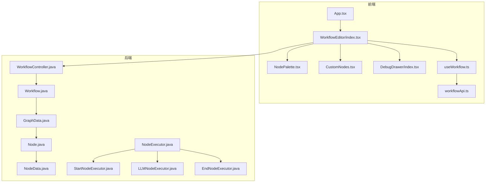
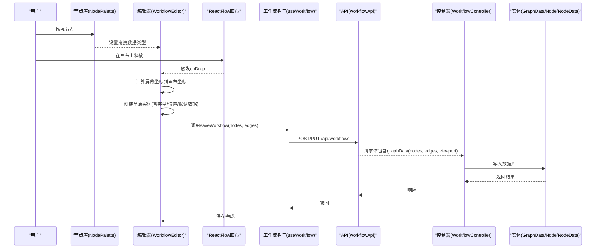
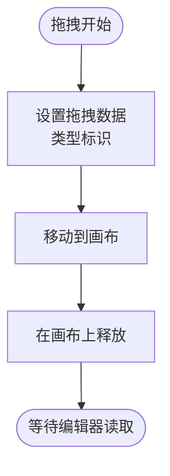
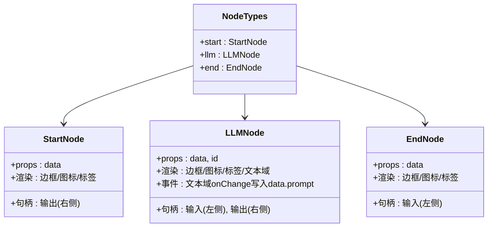
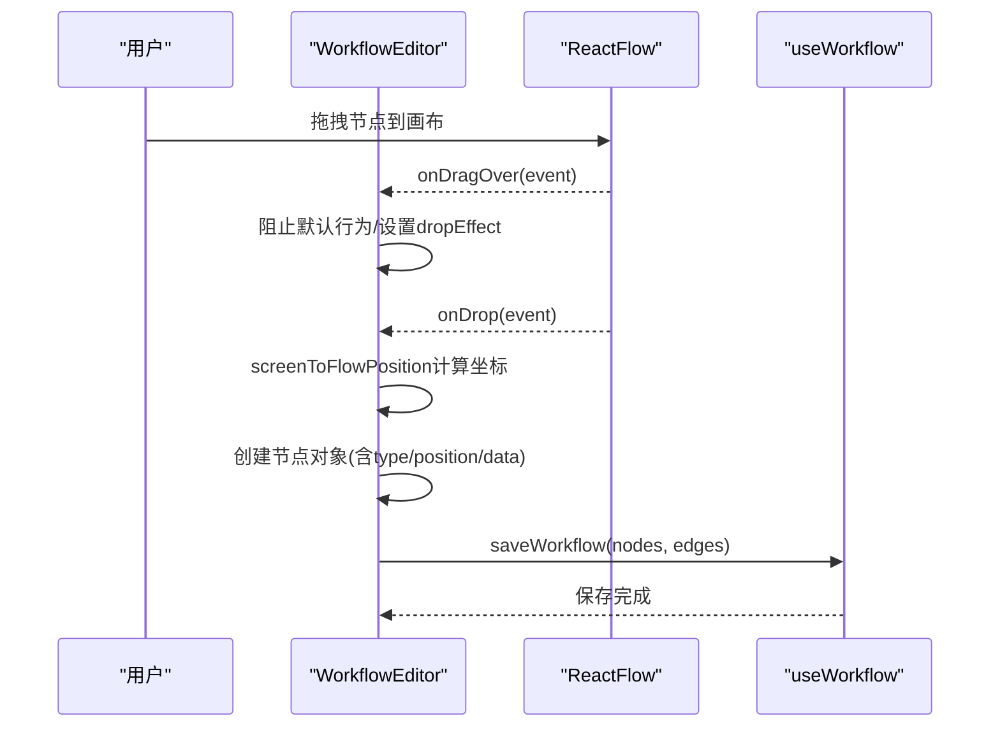
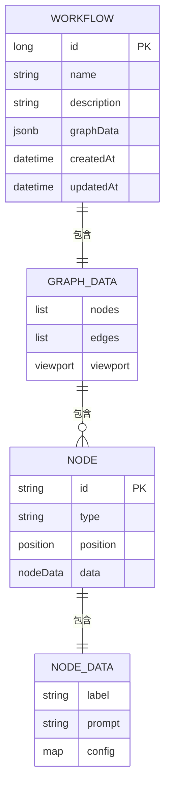
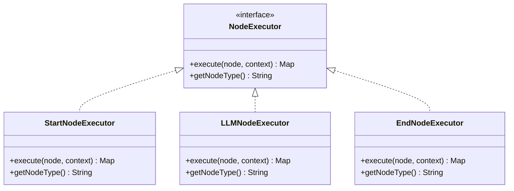
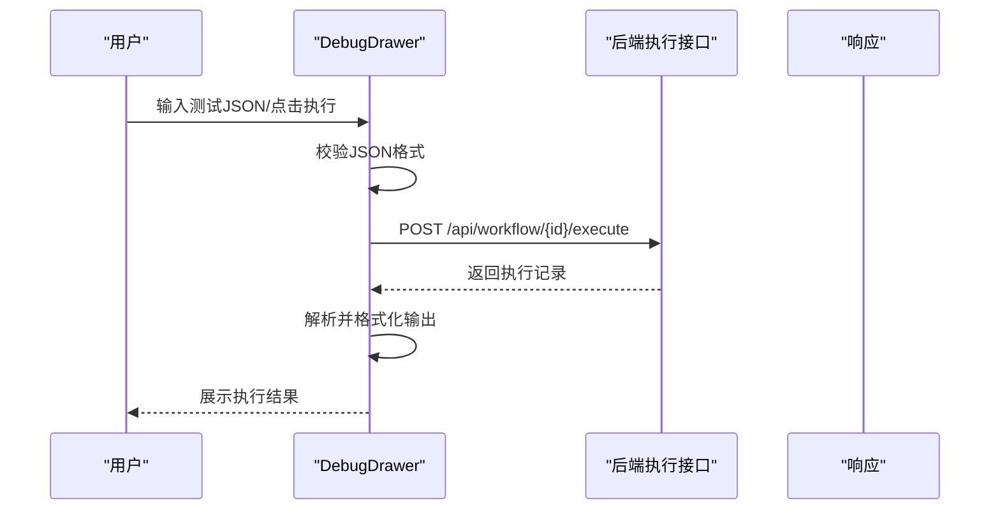
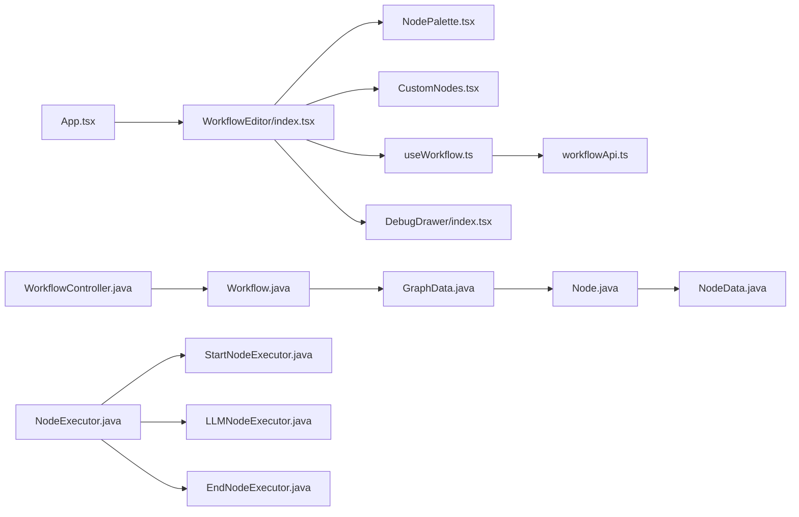

# 节点面板管理

<cite>
**本文引用的文件**
- [NodePalette.tsx](file://frontend/src/components/WorkflowEditor/NodePalette.tsx)
- [CustomNodes.tsx](file://frontend/src/components/WorkflowEditor/CustomNodes.tsx)
- [index.tsx](file://frontend/src/components/WorkflowEditor/index.tsx)
- [useWorkflow.ts](file://frontend/src/hooks/useWorkflow.ts)
- [workflowApi.ts](file://frontend/src/services/workflowApi.ts)
- [App.tsx](file://frontend/src/App.tsx)
- [DebugDrawer/index.tsx](file://frontend/src/components/DebugDrawer/index.tsx)
- [NodeExecutor.java](file://backend/src/main/java/com/bokagent/engine/NodeExecutor.java)
- [StartNodeExecutor.java](file://backend/src/main/java/com/bokagent/engine/StartNodeExecutor.java)
- [LLMNodeExecutor.java](file://backend/src/main/java/com/bokagent/engine/LLMNodeExecutor.java)
- [EndNodeExecutor.java](file://backend/src/main/java/com/bokagent/engine/EndNodeExecutor.java)
- [Node.java](file://backend/src/main/java/com/bokagent/entity/Node.java)
- [NodeData.java](file://backend/src/main/java/com/bokagent/entity/NodeData.java)
- [GraphData.java](file://backend/src/main/java/com/bokagent/entity/GraphData.java)
- [Workflow.java](file://backend/src/main/java/com/bokagent/entity/Workflow.java)
- [WorkflowController.java](file://backend/src/main/java/com/bokagent/controller/WorkflowController.java)
</cite>

## 目录
1. [简介](#简介)
2. [项目结构](#项目结构)
3. [核心组件](#核心组件)
4. [架构总览](#架构总览)
5. [详细组件分析](#详细组件分析)
6. [依赖分析](#依赖分析)
7. [性能考虑](#性能考虑)
8. [故障排查指南](#故障排查指南)
9. [结论](#结论)
10. [附录](#附录)

## 简介
本技术文档围绕 BokAgent 的“节点面板管理系统”展开，聚焦前端节点面板与后端执行引擎的协作机制。文档从 UI 设计与交互入手，逐步深入到拖拽行为实现、节点类型与样式的定制、节点数据的序列化与反序列化、以及可扩展性与用户体验优化策略。读者将能够理解如何在现有框架上新增节点类型、自定义节点样式、添加节点属性配置，并掌握调试与执行流程。

## 项目结构
前端采用 React + Ant Design + React Flow 构建可视化工作流编辑器；后端基于 Spring Boot，使用 MyBatis-Plus 持久化工作流图数据。节点面板由节点库（NodePalette）、自定义节点（CustomNodes）与编辑器主容器（WorkflowEditor）组成；调试抽屉用于本地测试执行。

图表来源
- [App.tsx:1-21](file://frontend/src/App.tsx#L1-L21)
- [index.tsx:1-116](file://frontend/src/components/WorkflowEditor/index.tsx#L1-L116)
- [NodePalette.tsx:1-48](file://frontend/src/components/WorkflowEditor/NodePalette.tsx#L1-L48)
- [CustomNodes.tsx:1-81](file://frontend/src/components/WorkflowEditor/CustomNodes.tsx#L1-L81)
- [DebugDrawer/index.tsx:1-141](file://frontend/src/components/DebugDrawer/index.tsx#L1-L141)
- [workflowApi.ts:1-44](file://frontend/src/services/workflowApi.ts#L1-L44)
- [useWorkflow.ts:1-69](file://frontend/src/hooks/useWorkflow.ts#L1-L69)
- [WorkflowController.java:1-92](file://backend/src/main/java/com/bokagent/controller/WorkflowController.java#L1-L92)
- [Workflow.java:1-32](file://backend/src/main/java/com/bokagent/entity/Workflow.java#L1-L32)
- [GraphData.java:1-15](file://backend/src/main/java/com/bokagent/entity/GraphData.java#L1-L15)
- [Node.java:1-15](file://backend/src/main/java/com/bokagent/entity/Node.java#L1-L15)
- [NodeData.java:1-15](file://backend/src/main/java/com/bokagent/entity/NodeData.java#L1-L15)
- [NodeExecutor.java:1-24](file://backend/src/main/java/com/bokagent/engine/NodeExecutor.java#L1-L24)
- [StartNodeExecutor.java:1-41](file://backend/src/main/java/com/bokagent/engine/StartNodeExecutor.java#L1-L41)
- [LLMNodeExecutor.java:1-69](file://backend/src/main/java/com/bokagent/engine/LLMNodeExecutor.java#L1-L69)
- [EndNodeExecutor.java:1-41](file://backend/src/main/java/com/bokagent/engine/EndNodeExecutor.java#L1-L41)

章节来源
- [App.tsx:1-21](file://frontend/src/App.tsx#L1-L21)
- [index.tsx:1-116](file://frontend/src/components/WorkflowEditor/index.tsx#L1-L116)

## 核心组件
- 节点库（NodePalette）：提供三类节点的拖拽入口，分别对应开始、LLM、结束节点，支持拖拽到画布。
- 自定义节点（CustomNodes）：定义三种节点的渲染样式与交互控件（如 LLM 节点的文本域），并导出节点类型映射。
- 编辑器主容器（WorkflowEditor）：承载 React Flow 画布，处理拖拽事件、连线、保存工作流、调试抽屉。
- 工作流钩子（useWorkflow）：封装保存/加载工作流的业务逻辑，负责序列化节点与边数据。
- 调试抽屉（DebugDrawer）：提供测试输入、触发执行、查看执行结果的界面。
- 后端执行器（NodeExecutor 及其实现）：定义节点执行规范，分别实现开始、LLM、结束节点的执行逻辑。
- 数据模型（Workflow/GraphData/Node/NodeData）：后端持久化结构，承载节点类型、位置、数据与视口状态。

章节来源
- [NodePalette.tsx:1-48](file://frontend/src/components/WorkflowEditor/NodePalette.tsx#L1-L48)
- [CustomNodes.tsx:1-81](file://frontend/src/components/WorkflowEditor/CustomNodes.tsx#L1-L81)
- [index.tsx:1-116](file://frontend/src/components/WorkflowEditor/index.tsx#L1-L116)
- [useWorkflow.ts:1-69](file://frontend/src/hooks/useWorkflow.ts#L1-L69)
- [DebugDrawer/index.tsx:1-141](file://frontend/src/components/DebugDrawer/index.tsx#L1-L141)
- [NodeExecutor.java:1-24](file://backend/src/main/java/com/bokagent/engine/NodeExecutor.java#L1-L24)
- [StartNodeExecutor.java:1-41](file://backend/src/main/java/com/bokagent/engine/StartNodeExecutor.java#L1-L41)
- [LLMNodeExecutor.java:1-69](file://backend/src/main/java/com/bokagent/engine/LLMNodeExecutor.java#L1-L69)
- [EndNodeExecutor.java:1-41](file://backend/src/main/java/com/bokagent/engine/EndNodeExecutor.java#L1-L41)
- [Workflow.java:1-32](file://backend/src/main/java/com/bokagent/entity/Workflow.java#L1-L32)
- [GraphData.java:1-15](file://backend/src/main/java/com/bokagent/entity/GraphData.java#L1-L15)
- [Node.java:1-15](file://backend/src/main/java/com/bokagent/entity/Node.java#L1-L15)
- [NodeData.java:1-15](file://backend/src/main/java/com/bokagent/entity/NodeData.java#L1-L15)

## 架构总览
前端通过拖拽将节点类型传递给编辑器，编辑器在画布上创建节点实例并维护节点/边状态；保存时将节点与边序列化为后端可识别的数据结构；后端控制器接收请求，持久化到数据库；调试抽屉可触发执行流程并返回执行结果。

图表来源
- [NodePalette.tsx:11-27](file://frontend/src/components/WorkflowEditor/NodePalette.tsx#L11-L27)
- [index.tsx:23-52](file://frontend/src/components/WorkflowEditor/index.tsx#L23-L52)
- [useWorkflow.ts:9-39](file://frontend/src/hooks/useWorkflow.ts#L9-L39)
- [workflowApi.ts:11-26](file://frontend/src/services/workflowApi.ts#L11-L26)
- [WorkflowController.java:50-76](file://backend/src/main/java/com/bokagent/controller/WorkflowController.java#L50-L76)
- [GraphData.java:1-15](file://backend/src/main/java/com/bokagent/entity/GraphData.java#L1-L15)
- [Node.java:1-15](file://backend/src/main/java/com/bokagent/entity/Node.java#L1-L15)
- [NodeData.java:1-15](file://backend/src/main/java/com/bokagent/entity/NodeData.java#L1-L15)

## 详细组件分析

### 节点库（NodePalette）
- 功能：展示三类节点（开始、LLM、结束），每项具备图标、颜色与标签；支持拖拽。
- 拖拽实现：在卡片上设置 draggable 并在 onDragStart 中写入自定义 MIME 类型的数据，以便后续在画布中读取。
- 样式：通过节点颜色与图标区分类型，便于用户识别。

图表来源
- [NodePalette.tsx:11-27](file://frontend/src/components/WorkflowEditor/NodePalette.tsx#L11-L27)

章节来源
- [NodePalette.tsx:1-48](file://frontend/src/components/WorkflowEditor/NodePalette.tsx#L1-L48)

### 自定义节点（CustomNodes）
- 节点类型映射：导出 nodeTypes 映射，键为节点类型字符串，值为对应的 React 组件。
- 开始节点：渲染为带绿色边框与图标的矩形，包含一个右向输出句柄。
- LLM 节点：渲染为带蓝色边框与图标的矩形，包含左向输入句柄与文本域，支持编辑提示词；文本域变更会直接写入 data.prompt。
- 结束节点：渲染为带红色边框与图标的矩形，包含一个左向输入句柄。
- 句柄（Handle）：用于连接边，定义了输入/输出方向。

图表来源
- [CustomNodes.tsx:6-78](file://frontend/src/components/WorkflowEditor/CustomNodes.tsx#L6-L78)

章节来源
- [CustomNodes.tsx:1-81](file://frontend/src/components/WorkflowEditor/CustomNodes.tsx#L1-L81)

### 编辑器主容器（WorkflowEditor）
- 状态管理：使用 useNodesState/useEdgesState 维护节点与边集合；通过 onDrop/onDragOver 处理拖放与放置逻辑。
- 拖放流程：
  - onDragOver：阻止默认行为并设置 dropEffect 为 move。
  - onDrop：读取拖拽数据中的类型标识，计算鼠标位置对应的画布坐标，创建节点实例（含 id、type、position、data），并追加到节点列表。
- 连线：使用 onConnect 添加边。
- 保存：调用 useWorkflow.saveWorkflow 序列化 nodes/edges/viewport 并提交到后端。
- 调试：打开 DebugDrawer 展示节点/边统计与执行结果。

图表来源
- [index.tsx:23-52](file://frontend/src/components/WorkflowEditor/index.tsx#L23-L52)
- [useWorkflow.ts:9-39](file://frontend/src/hooks/useWorkflow.ts#L9-L39)

章节来源
- [index.tsx:1-116](file://frontend/src/components/WorkflowEditor/index.tsx#L1-L116)
- [useWorkflow.ts:1-69](file://frontend/src/hooks/useWorkflow.ts#L1-L69)

### 节点数据的序列化与反序列化
- 前端序列化：保存工作流时，将 nodes、edges、viewport 组装为 graphData 提交至后端。
- 后端持久化：Workflow 实体包含 graphData 字段，使用 JsonbTypeHandler 将对象序列化为数据库 JSONB 字段。
- 数据结构：
  - GraphData：包含 nodes、edges、viewport。
  - Node：包含 id、type、position、data。
  - NodeData：包含 label、prompt、config。
- 反序列化：从数据库读取时，JsonbTypeHandler 将 JSONB 反序列化为 GraphData/Node/NodeData 对象，供执行器使用。

图表来源
- [Workflow.java:1-32](file://backend/src/main/java/com/bokagent/entity/Workflow.java#L1-L32)
- [GraphData.java:1-15](file://backend/src/main/java/com/bokagent/entity/GraphData.java#L1-L15)
- [Node.java:1-15](file://backend/src/main/java/com/bokagent/entity/Node.java#L1-L15)
- [NodeData.java:1-15](file://backend/src/main/java/com/bokagent/entity/NodeData.java#L1-L15)

章节来源
- [useWorkflow.ts:9-39](file://frontend/src/hooks/useWorkflow.ts#L9-L39)
- [workflowApi.ts:11-26](file://frontend/src/services/workflowApi.ts#L11-L26)
- [Workflow.java:1-32](file://backend/src/main/java/com/bokagent/entity/Workflow.java#L1-L32)
- [GraphData.java:1-15](file://backend/src/main/java/com/bokagent/entity/GraphData.java#L1-L15)
- [Node.java:1-15](file://backend/src/main/java/com/bokagent/entity/Node.java#L1-L15)
- [NodeData.java:1-15](file://backend/src/main/java/com/bokagent/entity/NodeData.java#L1-L15)

### 后端执行器与节点类型
- 接口：NodeExecutor 定义 execute(node, context) 与 getNodeType()。
- 开始节点：初始化执行上下文，返回包含节点标识、类型、状态与时间戳的结果。
- LLM 节点：读取 NodeData.prompt，调用 LLMService 生成回复，将输出合并回上下文并返回统一结构。
- 结束节点：汇总最终上下文作为 finalOutput 返回。
- 执行上下文：以 Map<String, Object> 形式传递，前序节点输出作为后续节点输入。

图表来源
- [NodeExecutor.java:1-24](file://backend/src/main/java/com/bokagent/engine/NodeExecutor.java#L1-L24)
- [StartNodeExecutor.java:1-41](file://backend/src/main/java/com/bokagent/engine/StartNodeExecutor.java#L1-L41)
- [LLMNodeExecutor.java:1-69](file://backend/src/main/java/com/bokagent/engine/LLMNodeExecutor.java#L1-L69)
- [EndNodeExecutor.java:1-41](file://backend/src/main/java/com/bokagent/engine/EndNodeExecutor.java#L1-L41)

章节来源
- [NodeExecutor.java:1-24](file://backend/src/main/java/com/bokagent/engine/NodeExecutor.java#L1-L24)
- [StartNodeExecutor.java:1-41](file://backend/src/main/java/com/bokagent/engine/StartNodeExecutor.java#L1-L41)
- [LLMNodeExecutor.java:1-69](file://backend/src/main/java/com/bokagent/engine/LLMNodeExecutor.java#L1-L69)
- [EndNodeExecutor.java:1-41](file://backend/src/main/java/com/bokagent/engine/EndNodeExecutor.java#L1-L41)

### 调试抽屉（DebugDrawer）
- 功能：提供测试输入 JSON、执行按钮、执行结果展示与节点/边统计。
- 流程：校验测试输入 JSON，构造执行请求体，调用后端执行接口，解析响应并格式化输出。
- 注意：当前示例中固定使用固定工作流 ID，实际应从 useWorkflow 获取。

图表来源
- [DebugDrawer/index.tsx:17-67](file://frontend/src/components/DebugDrawer/index.tsx#L17-L67)

章节来源
- [DebugDrawer/index.tsx:1-141](file://frontend/src/components/DebugDrawer/index.tsx#L1-L141)

## 依赖分析
- 前端组件耦合：WorkflowEditor 依赖 NodePalette、CustomNodes、useWorkflow、DebugDrawer；useWorkflow 依赖 workflowApi；App 作为根组件承载 WorkflowEditor。
- 后端实体耦合：Workflow 包含 GraphData；GraphData 包含 Node 列表；Node 包含 NodeData。
- 执行链路：前端保存 -> 后端控制器 -> 实体持久化 -> 执行器按类型执行。

图表来源
- [App.tsx:1-21](file://frontend/src/App.tsx#L1-L21)
- [index.tsx:1-116](file://frontend/src/components/WorkflowEditor/index.tsx#L1-L116)
- [NodePalette.tsx:1-48](file://frontend/src/components/WorkflowEditor/NodePalette.tsx#L1-L48)
- [CustomNodes.tsx:1-81](file://frontend/src/components/WorkflowEditor/CustomNodes.tsx#L1-L81)
- [useWorkflow.ts:1-69](file://frontend/src/hooks/useWorkflow.ts#L1-L69)
- [workflowApi.ts:1-44](file://frontend/src/services/workflowApi.ts#L1-L44)
- [WorkflowController.java:1-92](file://backend/src/main/java/com/bokagent/controller/WorkflowController.java#L1-L92)
- [Workflow.java:1-32](file://backend/src/main/java/com/bokagent/entity/Workflow.java#L1-L32)
- [GraphData.java:1-15](file://backend/src/main/java/com/bokagent/entity/GraphData.java#L1-L15)
- [Node.java:1-15](file://backend/src/main/java/com/bokagent/entity/Node.java#L1-L15)
- [NodeData.java:1-15](file://backend/src/main/java/com/bokagent/entity/NodeData.java#L1-L15)
- [NodeExecutor.java:1-24](file://backend/src/main/java/com/bokagent/engine/NodeExecutor.java#L1-L24)
- [StartNodeExecutor.java:1-41](file://backend/src/main/java/com/bokagent/engine/StartNodeExecutor.java#L1-L41)
- [LLMNodeExecutor.java:1-69](file://backend/src/main/java/com/bokagent/engine/LLMNodeExecutor.java#L1-L69)
- [EndNodeExecutor.java:1-41](file://backend/src/main/java/com/bokagent/engine/EndNodeExecutor.java#L1-L41)

章节来源
- [App.tsx:1-21](file://frontend/src/App.tsx#L1-L21)
- [index.tsx:1-116](file://frontend/src/components/WorkflowEditor/index.tsx#L1-L116)
- [WorkflowController.java:1-92](file://backend/src/main/java/com/bokagent/controller/WorkflowController.java#L1-L92)

## 性能考虑
- 节点渲染：自定义节点内避免不必要的重渲染，尽量将可变字段（如 LLM 提示词）写入 data 对象，保持 props 稳定。
- 拖拽性能：onDragOver 中仅设置 dropEffect，避免复杂计算；onDrop 仅进行坐标转换与节点创建。
- 序列化体积：graphData 中 nodes/edges 数量增长会增加网络与存储开销，建议在保存前做必要裁剪或懒加载。
- 执行链路：LLM 节点调用外部服务存在延迟，建议在前端做加载态与错误兜底，在后端对异常进行标准化返回。

## 故障排查指南
- 拖拽无效：确认 onDragStart 是否正确设置了自定义 MIME 类型数据；确认 onDrop 是否读取到该数据。
- 节点不显示：检查 nodeTypes 映射是否正确注册；确认 ReactFlow 的 nodeTypes 属性已传入。
- 保存失败：检查 useWorkflow 的 saveWorkflow 是否正确组装 graphData；核对后端控制器的路径与参数。
- 执行报错：查看 DebugDrawer 的输出与控制台日志；确认 LLM 服务可用性与网络连通性。
- 数据不一致：核对 NodeData 的字段（label/prompt/config）是否与前端渲染一致；检查后端 JsonbTypeHandler 的映射。

章节来源
- [index.tsx:23-52](file://frontend/src/components/WorkflowEditor/index.tsx#L23-L52)
- [useWorkflow.ts:9-39](file://frontend/src/hooks/useWorkflow.ts#L9-L39)
- [DebugDrawer/index.tsx:17-67](file://frontend/src/components/DebugDrawer/index.tsx#L17-L67)
- [LLMNodeExecutor.java:32-61](file://backend/src/main/java/com/bokagent/engine/LLMNodeExecutor.java#L32-L61)

## 结论
本节点面板管理系统以清晰的前后端职责划分实现了可视化工作流的构建与执行：前端负责节点的拖拽、布局与保存，后端负责节点类型的执行与数据持久化。通过标准化的数据结构与执行接口，系统具备良好的扩展性，可在不破坏现有流程的前提下新增节点类型、自定义样式与属性配置。

## 附录

### 新增节点类型的步骤指南
- 前端
  - 在 CustomNodes 中新增节点组件，并将其加入 nodeTypes 映射。
  - 在 NodePalette 中添加该节点的条目（类型、标签、图标、颜色）。
  - 如需编辑属性，可在节点组件内添加输入控件，并写入 data 对象。
- 后端
  - 在 NodeExecutor 接口下新增对应执行器实现，覆盖 execute 与 getNodeType。
  - 在执行链路中确保上下文传递与结果格式一致。
- 数据模型
  - 若需要持久化额外字段，可在 NodeData 中扩展字段并在前端渲染。

章节来源
- [CustomNodes.tsx:74-78](file://frontend/src/components/WorkflowEditor/CustomNodes.tsx#L74-L78)
- [NodePalette.tsx:5-9](file://frontend/src/components/WorkflowEditor/NodePalette.tsx#L5-L9)
- [NodeExecutor.java:9-23](file://backend/src/main/java/com/bokagent/engine/NodeExecutor.java#L9-L23)
- [NodeData.java:10-14](file://backend/src/main/java/com/bokagent/entity/NodeData.java#L10-L14)

### 用户体验优化策略
- 节点搜索：在节点库中增加搜索框，过滤节点类型并高亮匹配项。
- 分组显示：将节点按功能分组（如“基础节点”、“AI节点”），提升可发现性。
- 快速选择：支持键盘快捷键选择常用节点，或提供最近使用列表。
- 拖拽预览：在拖拽过程中显示节点预览与目标位置提示。
- 批量操作：支持复制/粘贴节点、批量连线与自动布局。

[本节为概念性内容，无需代码来源]